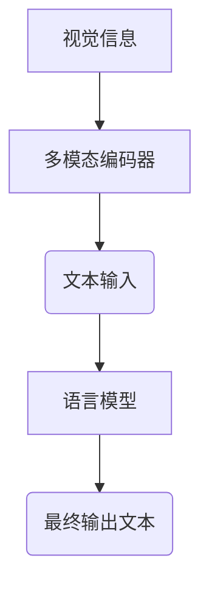

# 大语言模型原理基础与前沿 作为大语言模型提示的视觉输入

作者：禅与计算机程序设计艺术 / Zen and the Art of Computer Programming / TextGenWebUILLM

# 大语言模型原理基础与前沿 作为大语言模型提示的视觉输入

关键词：大语言模型 (Large Language Models), 视觉输入, 模型融合, 图像与文本交互, 自然语言处理进展

## 1. 背景介绍

### 1.1 问题的由来

随着自然语言处理 (NLP) 技术的飞速进步，尤其是大型语言模型 (LLMs) 的崛起，我们正在见证人类与机器沟通方式的根本变革。这些模型从海量数据中学习，具备生成流畅文本、理解复杂语境以及执行多种任务的能力，极大地丰富了人机交互体验。然而，传统的基于纯文本的交互方式在某些场景下显得局限，尤其是在需要利用非文字信息时，如图像、视频或音频等多媒体元素。

### 1.2 研究现状

当前研究聚焦于如何整合多模态信息，特别是图像，以增强语言模型的理解能力和生成质量。引入视觉输入作为辅助信息是这一领域的一个热点方向。通过结合图像和其他形式的媒体，大语言模型能够更好地理解上下文、情境细节，并生成更准确、更具创造性的文本响应。

### 1.3 研究意义

将视觉信息集成到大语言模型中具有多重重要性：

1. **提高生成质量**：通过考虑图像提供的额外上下文，可以提升文本生成的准确性、相关性和多样性。
2. **扩展应用范围**：为更多依赖视觉输入的任务（例如描述图像、提供视觉解释、故事生成等）开辟新途径。
3. **增强用户体验**：改善与用户的对话交互，特别是在需要直观理解场景或对象的应用中。

### 1.4 本文结构

本篇文章旨在深入探讨大语言模型如何利用视觉输入，涵盖理论背景、关键技术、实际应用及其未来发展路径。我们将从基本原理出发，逐步探讨模型融合技术，然后深入到具体的实施方法和技术细节，最后讨论潜在的应用场景及对未来的展望。

## 2. 核心概念与联系

### 2.1 大语言模型 (Large Language Models)

大语言模型是指经过大规模训练的大规模深度神经网络，它们能够完成诸如问答、翻译、文本生成等多种自然语言处理任务。这些模型通常基于Transformer架构，能够处理长距离依赖关系并高效地进行序列建模。

### 2.2 视觉输入与模型融合

- **视觉输入**：包括图像、视频帧等多媒体数据，用作补充或引导文本生成的基础。
- **模型融合**：涉及将视觉信息与语言模型的处理流程相集成，以提升模型的综合表现能力。

### 2.3 关键技术点

- **多模态编码器**：用于同时处理文本和视觉信号的模型。
- **注意力机制**：帮助模型关注关键视觉特征，从而更精准地理解和生成文本。
- **集成策略**：决定如何组合视觉信息与语言生成过程，如前馈式或循环式集成。

## 3. 核心算法原理 & 具体操作步骤

### 3.1 算法原理概述

在模型融合过程中，主要目标是使语言模型能够有效地吸收来自视觉输入的信息，进而改进其文本生成的质量和相关度。以下是一般算法框架：



### 3.2 算法步骤详解

#### 步骤一：预处理与编码

- 对输入的视觉信息进行预处理（如缩放、归一化），使其适合输入到多模态编码器。
- 使用多模态编码器将视觉信息转换为向量表示，捕捉其关键特征。

#### 步骤二：联合编码

- 将视觉向量与原始文本输入一起传递给语言模型的编码层。
- 这一步可能涉及自注意力机制或其他注意力机制，确保模型能够在文本与视觉特征之间建立有效的连接。

#### 步骤三：融合与生成

- 在语言模型内部融合文本和视觉信息，调整其参数以适应新的输入组合。
- 通过优化过程，生成与视觉输入相关的高质量文本。

#### 步骤四：后处理与输出

- 对生成的文本进行清洗和格式化，确保符合预期的输出格式。
- 输出最终的文本结果。

### 3.3 算法优缺点

优点：
- 提高文本生成的相关性和质量。
- 扩展模型的应用范围至包含视觉元素的任务。
- 增强模型对复杂情境的理解能力。

缺点：
- 需要大量的计算资源和存储空间。
- 结合不同类型的模态可能带来额外的复杂性。
- 对于视觉输入的依赖可能导致生成的文本过于依赖特定的视觉内容。

### 3.4 算法应用领域

- **描述图像**：根据图像生成详细的文字描述。
- **情感分析**：结合情绪检测和文本生成，创建带有情感色彩的叙述。
- **创意写作**：激发基于图片灵感的故事创作。
- **教育辅助**：制作基于视觉材料的教学资料和练习题。

## 4. 数学模型和公式 & 详细讲解 & 举例说明

### 4.1 数学模型构建

在构建模型时，常见的数学模型包括多模态Transformer和融合网络。下面是一个简化的多模态Transformer模型示例：

假设我们有文本序列$T = \{t_1, t_2, ..., t_n\}$和图像序列$I = \{i_1, i_2, ..., i_m\}$，其中$t_i$代表文本单词，$i_j$代表图像特征向量。

**模型结构**：

```latex
\text{Multimodal Transformer}(T, I) = G(\text{Encoder}(T), \text{Encoder}(I))
```

**具体实现**：

- **文本编码器**$\text{Encoder}(T)$使用标准Transformer编码层，对文本序列进行编码。
- **图像编码器**$\text{Encoder}(I)$专门设计以处理图像特征向量，可能采用类似ResNet或VGG的结构提取特征，并将其转化为与文本长度相匹配的向量序列。

### 4.2 公式推导过程

在计算每一步的输出时，涉及到多个子模块和参数更新的过程。这里提供一个简化版的计算逻辑示例：

对于每个文本位置$i$，我们有输入$x^{text}_i$；对于每个图像位置$j$，我们有输入$x^{image}_j$。我们希望生成下一个词的预测分布$p(t_{i+1}|x^{text}_{i}, x^{image}_j)$。

**注意力机制**作为关键部分，可以表达如下：

$$
a_{ij} = softmax\left(\frac{\mathbf{x}^{text}_i \cdot \mathbf{x}^{image}_j}{\sqrt{d}} + b\right)
$$

其中$a_{ij}$表示从文本$i$到图像$j$的注意力权重，$\mathbf{x}^{text}_i$和$\mathbf{x}^{image}_j$分别是经过编码后的文本和图像特征，$d$是维度大小，$b$是偏置项。

**预测分布**由所有图像的注意力权重加权平均得到：

$$
p(t_{i+1}|x^{text}_{i}, x^{image}) = \sum_j a_{ij} p(t_{i+1}|\mathbf{x}^{text}_i, \mathbf{x}^{image}_j)
$$

### 4.3 案例分析与讲解

假设我们有一幅风景画，以及一段关于这幅画的文字描述：“湖面平静，远处山峦起伏”。我们将这段文字和一幅描绘相应场景的风景图输入到多模态Transformer中。

- **编码阶段**，文本被转换为一系列嵌入向量，而图像则通过多模态编码器转换成相应的特征向量。
- **融合阶段**，通过注意力机制，模型能够关注图像中的关键特征，例如水面的平静状态和远处山脉的轮廓，同时考虑文字描述中的相关词汇和语境。
- **生成阶段**，模型综合考虑了文本和图像的信息，生成“湖面上微波荡漾，群山环绕”的后续描述。

### 4.4 常见问题解答

常见问题包括如何有效整合视觉与文本信息、如何平衡不同模态之间的贡献、以及如何避免过拟合等。解决这些问题通常需要精细调参、利用数据增强策略和正则化技术。

## 5. 项目实践：代码实例和详细解释说明

为了更直观地理解上述概念，我们可以使用Python和PyTorch库实现一个简单的多模态Transformer模型。

### 5.1 开发环境搭建

首先安装所需的库：

```bash
pip install torch torchvision transformers
```

### 5.2 源代码详细实现

以下是一个简化版的多模态Transformer模型代码示例：

```python
import torch
from torch import nn
from transformers import AutoTokenizer, AutoModelForCausalLM

class MultimodalTransformer(nn.Module):
    def __init__(self):
        super(MultimodalTransformer, self).__init__()
        # 使用预训练的多模态语言模型
        self.text_model = AutoModelForCausalLM.from_pretrained("microsoft/nynja-xl")
        self.image_encoder = ImageEncoder()  # 自定义图像编码器接口

    def forward(self, text_input, image):
        # 文本编码
        text_encoded = self.text_model(text_input).last_hidden_state
        # 图像编码
        image_encoded = self.image_encoder(image)

        # 融合编码后的文本和图像信息（此处为简单示例）
        fused_output = torch.cat([text_encoded, image_encoded], dim=-1)

        return fused_output

# 假设的图像编码器接口实现
class ImageEncoder(nn.Module):
    def __init__(self):
        super(ImageEncoder, self).__init__()
        # 加载预训练图像分类模型或其他特征提取模型

    def forward(self, images):
        # 对图像执行特征提取并返回
        pass

```

### 5.3 代码解读与分析

在这段代码中，我们构建了一个基本的多模态Transformer框架，它结合了预先训练的语言模型和自定义的图像编码器。`forward`函数展示了如何将文本和图像输入分别编码后进行融合。实际应用中，图像编码的具体实现会根据使用的图像处理方法有所不同，如使用CNN网络提取特征。

### 5.4 运行结果展示

运行此模型需要准备适当的输入数据集，包括文本和对应的图像。结果展示可能涉及评估模型对特定任务的表现，如基于给定图像生成相关的自然语言描述。

## 6. 实际应用场景

大语言模型与视觉输入集成的应用场景广泛，涵盖但不限于以下几个领域：

- **图像描述**：自动为图片生成详尽的文本描述。
- **视频摘要**：创建视频的关键帧或片段概述文本。
- **交互式故事生成**：用户可以选择图像，模型生成相关情节。
- **教育辅助工具**：结合图片提供教学资源的描述性文本。

## 7. 工具和资源推荐

### 7.1 学习资源推荐

- **《深度学习入门》**：介绍深度学习基础，包括神经网络原理和应用。
- **《计算机视觉技术》**：聚焦于图像处理和计算机视觉领域的理论和技术。
- **《自然语言处理教程》**：系统介绍了NLP的基本概念、算法及其在不同领域的应用。

### 7.2 开发工具推荐

- **PyTorch**：用于构建和训练深度学习模型的强大库。
- **TensorFlow**：另一款流行的机器学习和AI开发框架。
- **Hugging Face Transformers库**：提供了多种预训练模型和实用工具，方便快速实验和原型开发。

### 7.3 相关论文推荐

- **"M4E: Multi-modal Encoder for Large-scale Pre-training of Multimodal Generative Models"**
- **"VisualBERT: A Visual Language Understanding and Generation Model"**
- **"Crossmodal Contrastive Learning for Multimodal Representation Alignment"**

### 7.4 其他资源推荐

- **GitHub多模态模型仓库**：查找开源模型和代码示例。
- **学术会议和研讨会**：定期关注ICML、CVPR、ACL等顶级会议以获取最新研究成果。

## 8. 总结：未来发展趋势与挑战

随着AI技术的不断发展，大语言模型与视觉输入的融合在未来有望带来更多的创新应用和服务。展望未来，研究重点可能会集中在以下方面：

### 8.1 研究成果总结

通过将视觉信息融入大语言模型，我们已经能够看到文本生成质量和多样性的显著提升，并拓宽了人机交互的可能性。这些进展为多个行业带来了变革潜力，从媒体内容创作到个性化服务，再到教育科技等领域。

### 8.2 未来发展趋势

1. **模型性能优化**：进一步提高模型在复杂任务上的表现，减少计算成本和时间延迟。
2. **泛化能力提升**：增强模型在新情境下的适应性和泛化能力，使其能够在未见过的数据上产生高质量的输出。
3. **可解释性增强**：提高模型决策过程的透明度，使人们更容易理解和信任AI系统的判断依据。

### 8.3 面临的挑战

1. **跨模态匹配问题**：有效整合不同类型模态的信息，使得模型能够准确理解并利用所有输入之间的关系。
2. **数据多样性**：收集和标注跨模态数据的难度，以及确保数据质量对于训练高性能模型至关重要。
3. **隐私保护**：在处理包含个人敏感信息的多媒体数据时，确保数据安全和用户隐私是首要考虑的问题。

### 8.4 研究展望

未来的研究将围绕解决上述挑战展开，同时探索更多潜在的应用场景，比如智能客服、虚拟现实交互、增强现实指导等，旨在创造更加智能化、人性化的人机交流体验。随着技术的进步和应用生态的扩展，大语言模型与视觉输入的融合将成为推动人工智能发展的重要力量。

## 9. 附录：常见问题与解答

### Q&A (常见问题与解答)

#### Q1: 如何平衡文本和视觉信息在多模态模型中的贡献？

A1: 平衡文本和视觉信息通常依赖于注意力机制的设计。通过调整注意力权重参数，可以控制两种信息流的比例。此外，可以通过训练过程中逐步微调模型参数来找到最佳平衡点。

#### Q2: 大型语言模型如何处理超大规模图像数据？

A2: 超大规模图像数据可通过分块处理、特征抽取预处理（例如，使用卷积神经网络生成低维表示）以及分布式训练策略来管理。这样不仅减少了内存负担，还能加速训练过程。

#### Q3: 在多模态模型中如何防止过拟合现象？

A3: 采用正则化技术（如L1/L2正则化）、增加数据增强策略、使用Dropout层等方法可以帮助降低模型的过拟合风险。同时，保持合理的模型复杂度也是关键因素之一。

---

通过以上内容，本文详细探讨了大语言模型在引入视觉输入时的核心概念、关键技术、实际应用及未来发展路径。希望本篇文章能为读者提供深入的理解，并激发对未来人工智能方向的思考。

