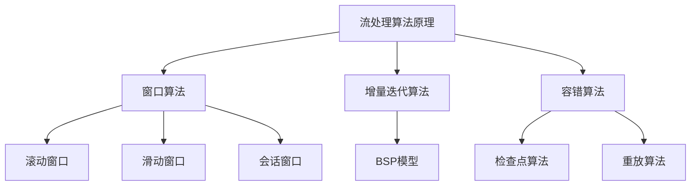

# 流处理 原理与代码实例讲解

## 1. 背景介绍

### 1.1 问题的由来

在当今快节奏的数字时代，数据已经成为推动业务创新和决策制定的关键驱动力。与传统的批处理系统不同，流处理系统旨在实时处理连续的数据流。这种处理方式对于处理大量实时数据流具有巨大优势,如物联网设备数据、社交媒体数据、金融交易数据等。

随着数据量的快速增长和实时性需求的提高,传统的批处理系统已经无法满足现代应用的需求。批处理系统通常需要先存储数据,然后再进行处理,这种"存储先于计算"的模式导致了较高的延迟,无法满足对实时性的要求。

### 1.2 研究现状

为了解决这一问题,流处理系统应运而生。流处理系统能够在数据到达时立即对其进行处理,无需先存储数据。这种"计算先于存储"的处理模式大大降低了延迟,满足了实时性的需求。

目前,已有多种流处理系统问世,如 Apache Spark Streaming、Apache Flink、Apache Storm 等。这些系统通过不同的架构和算法实现了流数据的实时处理。然而,流处理系统也面临着一些挑战,如容错性、状态管理、性能优化等。

### 1.3 研究意义

深入研究流处理系统的原理和实现方式,对于构建高效、可靠的实时数据处理应用程序至关重要。本文将探讨流处理的核心概念、算法原理、数学模型,并通过代码实例详细讲解其实现细节。这不仅有助于读者全面理解流处理技术,还可以指导实际项目中的实践应用。

### 1.4 本文结构

本文将从以下几个方面全面介绍流处理技术:

1. 核心概念与联系
2. 核心算法原理与具体操作步骤
3. 数学模型和公式详细讲解与案例分析
4. 项目实践:代码实例和详细解释说明
5. 实际应用场景
6. 工具和资源推荐
7. 总结:未来发展趋势与挑战
8. 附录:常见问题与解答

## 2. 核心概念与联系

在深入探讨流处理的算法原理和实现细节之前,我们需要先了解一些核心概念。这些概念为我们提供了流处理系统的基础知识,有助于更好地理解后续内容。

### 2.1 数据流(Data Stream)

数据流是指连续不断的数据序列,可以是无限的。与有限的数据集不同,数据流是动态的、持续生成的。例如,来自物联网设备的传感器数据、社交媒体上的用户活动数据等都可以看作是数据流。

### 2.2 流处理(Stream Processing)

流处理是指对连续到达的数据流进行实时处理和分析的过程。与批处理系统不同,流处理系统在数据到达时立即对其进行处理,而无需先存储数据。这种处理模式可以大大降低延迟,满足实时性需求。

### 2.3 有状态计算(Stateful Computation)

在流处理中,有状态计算是指在处理数据流时,需要维护和利用内部状态。例如,在计算滑动窗口平均值时,需要存储窗口内的数据,以便计算平均值。有状态计算使得流处理系统能够处理更复杂的业务逻辑。

### 2.4 窗口(Window)

窗口是流处理中的一个重要概念。它定义了一段时间或数据范围,用于对数据流进行分组和聚合操作。常见的窗口类型包括滚动窗口(Tumbling Window)、滑动窗口(Sliding Window)和会话窗口(Session Window)等。

### 2.5 容错性(Fault Tolerance)

由于数据流是连续不断的,因此容错性是流处理系统的一个关键特性。流处理系统需要能够从故障中恢复,并保证数据处理的正确性和一致性。常见的容错机制包括检查点(Checkpoint)、重播(Replay)等。

### 2.6 吞吐量和延迟(Throughput and Latency)

吞吐量和延迟是衡量流处理系统性能的两个重要指标。吞吐量指的是系统在单位时间内能够处理的数据量,而延迟指的是从数据进入系统到产生结果所需的时间。在设计流处理系统时,需要权衡吞吐量和延迟之间的平衡。

上述核心概念相互关联,共同构建了流处理系统的基础框架。理解这些概念对于掌握流处理技术至关重要。

## 3. 核心算法原理与具体操作步骤

在流处理系统中,核心算法原理决定了系统的性能和可靠性。本节将介绍一些流处理中常见的算法原理,并详细解释其具体操作步骤。

### 3.1 算法原理概述

#### 3.1.1 窗口算法

窗口算法是流处理中的核心算法之一。它将连续的数据流划分为有限的窗口,然后在每个窗口内进行聚合或其他操作。常见的窗口类型包括滚动窗口、滑动窗口和会话窗口。

#### 3.1.2 增量迭代算法

增量迭代算法是另一种常见的流处理算法。它基于批量流模型(BSP),将数据流划分为一系列的批次,然后对每个批次进行增量计算。这种算法可以有效地处理有状态计算,并提高系统的吞吐量。

#### 3.1.3 容错算法

由于数据流是连续不断的,容错性是流处理系统的一个关键特性。常见的容错算法包括检查点算法和重放算法。检查点算法定期保存系统的状态快照,以便在发生故障时进行恢复。重放算法则通过重新处理已接收的数据来恢复系统状态。

### 3.2 算法步骤详解

#### 3.2.1 窗口算法

1. **滚动窗口(Tumbling Window)**

滚动窗口将数据流划分为不重叠的固定大小窗口。每个窗口包含一段时间或一定数量的数据。窗口算法会对每个窗口内的数据进行聚合或其他操作。

步骤:
1) 设置窗口大小(时间或数据量)
2) 将数据流划分为不重叠的窗口
3) 对每个窗口内的数据执行聚合或其他操作
4) 输出结果

2. **滑动窗口(Sliding Window)**

滑动窗口与滚动窗口类似,但窗口之间存在重叠。每个新窗口会包含部分旧窗口的数据。这种算法常用于计算移动平均值等场景。

步骤:
1) 设置窗口大小和滑动步长
2) 将数据流划分为重叠的窗口
3) 对每个窗口内的数据执行聚合或其他操作
4) 输出结果

3. **会话窗口(Session Window)**

会话窗口根据数据之间的活动模式动态划分窗口。如果在一段时间内没有新数据到达,则会关闭当前窗口并开启新窗口。这种算法常用于处理会话数据,如用户浏览行为。

步骤:
1) 设置会话超时时间
2) 根据数据活动模式动态划分窗口
3) 对每个窗口内的数据执行聚合或其他操作
4) 输出结果

#### 3.2.2 增量迭代算法

增量迭代算法基于批量流模型(BSP),将数据流划分为一系列的批次,然后对每个批次进行增量计算。

步骤:
1) 将数据流划分为一系列批次
2) 对每个批次执行增量计算
3) 合并计算结果
4) 输出结果

#### 3.2.3 容错算法

1. **检查点算法**

检查点算法定期保存系统的状态快照,以便在发生故障时进行恢复。

步骤:
1) 设置检查点间隔时间
2) 定期保存系统状态快照
3) 在发生故障时,从最近的检查点恢复系统状态
4) 重新处理自上一个检查点以来的数据

2. **重放算法**

重放算法通过重新处理已接收的数据来恢复系统状态。

步骤:
1) 保存已接收的数据
2) 在发生故障时,从头开始重新处理已接收的数据
3) 恢复系统状态
4) 继续处理新到达的数据

### 3.3 算法优缺点

#### 3.3.1 窗口算法

优点:
- 简单直观,易于理解和实现
- 支持多种窗口类型,满足不同场景的需求
- 可以有效地处理有状态计算

缺点:
- 对于大窗口或高数据流量,可能会导致延迟和资源消耗较高
- 需要维护窗口状态,增加了系统复杂性

#### 3.3.2 增量迭代算法

优点:
- 支持有状态计算,可以处理复杂的业务逻辑
- 通过批处理提高了吞吐量
- 容错性较好,可以从故障中恢复

缺点:
- 增加了系统复杂性和开销
- 延迟可能较高,因为需要等待批次完成
- 对于低延迟场景可能不太适合

#### 3.3.3 容错算法

优点:
- 提高了系统的可靠性和容错性
- 能够从故障中恢复,保证数据处理的正确性和一致性

缺点:
- 增加了系统开销和复杂性
- 检查点算法可能会导致数据丢失
- 重放算法可能会重复处理部分数据

### 3.4 算法应用领域

上述算法在流处理系统中有广泛的应用场景:

- **窗口算法**:适用于需要对数据流进行聚合或统计的场景,如计算移动平均值、实时监控指标等。
- **增量迭代算法**:适用于需要处理复杂业务逻辑和有状态计算的场景,如实时推荐系统、实时风险监控等。
- **容错算法**:适用于对可靠性和容错性要求较高的场景,如金融交易处理、关键任务监控等。

根据具体的应用场景和需求,可以选择合适的算法或算法组合,以获得最佳的性能和可靠性。

## 4. 数学模型和公式详细讲解与举例说明

在流处理系统中,数学模型和公式扮演着重要的角色。它们为算法提供了理论基础,并帮助我们更好地理解和优化系统性能。本节将介绍一些常见的数学模型和公式,并通过案例分析进行详细讲解。

### 4.1 数学模型构建

#### 4.1.1 数据流模型

数据流可以被建模为一个无限序列:

$$S = \{s_1, s_2, s_3, \ldots\}$$

其中,每个 $s_i$ 表示一个数据元素。

在实际应用中,我们通常需要对数据流进行窗口划分。滚动窗口可以表示为:

$$W_t = \{s_i | t \leq i < t + w\}$$

其中,$ t $表示窗口起始时间,$ w $表示窗口大小。

滑动窗口可以表示为:

$$W_t = \{s_i | t \leq i < t + w, i = t + k \times s\}$$

其中,$ s $表示滑动步长。

#### 4.1.2 增量迭代模型

增量迭代算法基于批量流模型(BSP),将数据流划分为一系列批次。每个批次可以表示为:

$$B_i = \{s_j | (i-1) \times b < j \leq i \times b\}$$

其中,$ b $表示批次大小。

对于每个批次,我们可以定义一个增量函数 $f$,用于计算新批次与上一批次结果之间的差异:

$$x_i = f