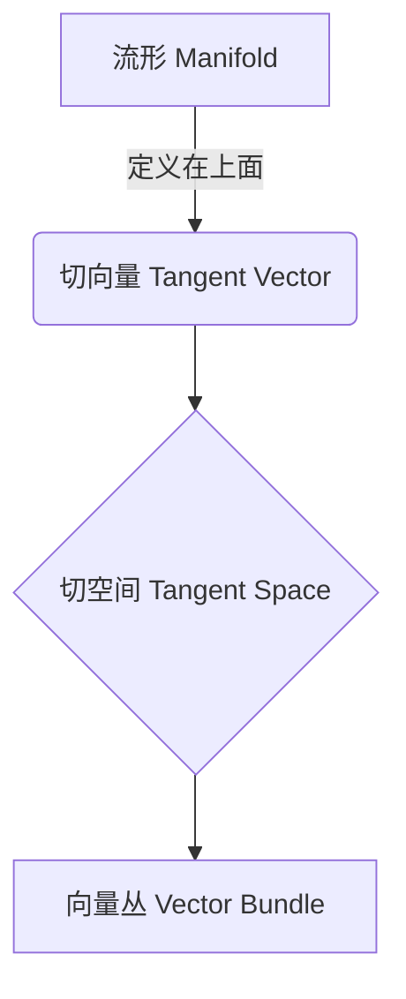

# 流形拓扑学理论与概念的实质：向量丛

## 1. 背景介绍

### 1.1 问题的由来

在数学和物理学领域中,研究物体的几何结构及其相互关系一直是一个重要的课题。随着现代科学技术的不断发展,越来越多的问题需要借助高维空间中的几何概念来描述和解决。传统的欧几里得几何无法满足这些需求,因此流形拓扑学应运而生。

流形(manifold)是一种在局部看起来像欧几里得空间的拓扑空间。它为研究高维几何结构提供了强有力的数学工具。然而,由于流形本身是一个抽象的概念,如何将其具体化并应用于实际问题一直是个挑战。这就需要借助向量丛(vector bundle)的概念。

### 1.2 研究现状

向量丛是流形上的一种特殊的几何结构,它将流形上的切向量(tangent vector)进行了"捆绑"。通过研究向量丛的性质,我们可以更好地理解流形的几何结构,并将其应用于物理学、工程学等诸多领域。

目前,向量丛理论在数学和物理学领域已有广泛应用,例如在广义相对论、量子场论、规范场论等领域都扮演着重要角色。然而,由于其数学抽象性较强,向量丛概念对于许多工程师和应用科学家来说仍然是一个挑战。

### 1.3 研究意义

深入理解向量丛的本质对于把握流形拓扑学的核心思想至关重要。掌握了向量丛的概念,我们就能更好地描述和操作高维几何结构,从而将流形拓扑学的理论应用于实际问题的求解。

本文将系统地介绍向量丛的理论基础、数学模型及其在实际问题中的应用,旨在帮助读者全面把握这一重要的数学概念。我们将从直观的角度出发,逐步深入探讨向量丛的本质,并通过具体的例子和应用场景,让读者对这一抽象概念有更加贴近和透彻的理解。

### 1.4 本文结构

本文共分为九个部分:

1. 背景介绍
2. 核心概念与联系
3. 核心算法原理与具体操作步骤
4. 数学模型和公式详细讲解与举例说明
5. 项目实践:代码实例和详细解释说明
6. 实际应用场景
7. 工具和资源推荐
8. 总结:未来发展趋势与挑战
9. 附录:常见问题与解答

## 2. 核心概念与联系

要理解向量丛的本质,我们首先需要了解一些基本概念,包括流形、切向量、切空间等。

**流形(Manifold)**是一种在局部看起来像欧几里得空间的拓扑空间。更精确地说,一个流形是一个拓扑空间,它在每一点都有着与欧几里得空间同胚的邻域。流形为我们研究高维几何结构提供了数学基础。

**切向量(Tangent Vector)**是定义在流形上的一种特殊向量。在某一点p处,切向量描述了通过该点的曲线在该点处的方向。所有通过p点的切向量构成了切空间(Tangent Space)。

**切空间(Tangent Space)**是流形上每一点的切向量所构成的向量空间。切空间为我们研究流形上的微分运算提供了基础。

**向量丛(Vector Bundle)**则是将流形上的所有切空间"捆绑"在一起形成的一种特殊的几何结构。向量丛的概念使我们能够在整个流形上进行向量运算和微分运算,而不仅局限于单个点。

这些概念之间存在着密切的联系,向量丛可以看作是将流形上的切空间"捆绑"起来的一种方式。掌握了这些核心概念,我们就能更好地理解向量丛的本质和作用。

## 3. 核心算法原理与具体操作步骤

### 3.1 算法原理概述

构建向量丛的核心思想是将流形上的所有切空间"捆绑"在一起,形成一种新的几何结构。这种结构使我们能够在整个流形上进行矢量运算和微分运算,而不仅局限于单个点。

具体来说,向量丛是一个在流形M上的几何结构,由一个总空间(total space) E、一个基空间(base space) M和一个投影映射(projection map) π:E→M 构成。每一个fiber(纤维)π^-1(p)都是一个向量空间,对应着流形上一点p处的切空间。

通过将所有的切空间"捆绑"在一起,向量丛为我们提供了一种统一的方式来研究和操作流形上的矢量场。我们可以在向量丛上定义各种代数和拓扑结构,从而推广许多在欧几里得空间中的概念和运算到更一般的流形情况。

### 3.2 算法步骤详解

构建向量丛的具体步骤如下:

1. **确定基空间(Base Space)**:基空间就是我们要研究的流形M。
2. **构建总空间(Total Space)** :总空间E是所有切空间的并集,即E = ⋃p∈M TpM,其中TpM表示p点处的切空间。
3. **定义投影映射(Projection Map)** :投影映射π:E→M将总空间E上的每个向量映射到其所属的基点p,即π(v)=p,其中v∈TpM。
4. **赋予拓扑结构** :在总空间E上赋予一个合适的拓扑结构,使得投影映射π成为连续映射。
5. **局部坐标系** :对于流形M上的每个坐标邻域,我们可以在相应的总空间E的子集上引入局部坐标系。
6. **定义向量丛同胚(Bundle Isomorphism)** :在不同坐标邻域之间,通过向量丛同胚变换来保证向量丛的"捆绑"结构是平滑连续的。
7. **导出相关概念和运算** :在构建好的向量丛上,我们可以定义各种代数和拓扑结构,如切向量场、微分形式、曲率张量等,并推导出相应的运算法则。

通过这些步骤,我们就可以将抽象的流形概念具体化为一种几何结构,并在其上进行矢量分析和微分几何研究。

### 3.3 算法优缺点

**优点**:

- 向量丛为我们提供了一种统一的框架,将流形上的切空间"捆绑"在一起,从而使我们能够在整个流形上进行矢量运算和微分运算。
- 向量丛概念将抽象的流形理论具体化,使其更易于应用于实际问题。
- 向量丛理论丰富了流形上的几何结构,为我们研究高维几何提供了强有力的数学工具。

**缺点**:

- 向量丛的概念较为抽象,需要一定的数学基础才能完全理解。
- 构建向量丛的过程相对复杂,需要引入大量的代数和拓扑概念。
- 向量丛理论主要应用于纯数学和理论物理领域,在其他应用领域的实践仍有待拓展。

### 3.4 算法应用领域

向量丛理论在数学和物理学领域有着广泛的应用,例如:

- **广义相对论**: 在广义相对论中,时空被描述为一种4维流形,而引力场则被描述为一种向量丛。
- **量子场论**: 量子场论中的各种场都可以被看作是某种向量丛的"切向量场"。
- **规范场论**: 规范场论中的规范场和规范势都可以用向量丛的语言来描述。
- **代数拓扑学**: 向量丛在研究流形上的特征类和指数定理等代数拓扑概念时扮演着重要角色。
- **微分几何**: 向量丛为研究流形上的切向量场、微分形式、曲率张量等微分几何概念提供了坚实的基础。

除了上述纯理论领域,向量丛概念还有望在工程和应用科学领域获得更多应用,例如计算机图形学、机器人技术、材料科学等。

## 4. 数学模型和公式详细讲解与举例说明

### 4.1 数学模型构建

向量丛的数学模型可以形式化地描述为一个四元组(E,π,M,F),其中:

- E是总空间(Total Space),表示所有切空间的并集。
- π是投影映射(Projection Map),将总空间E上的每个向量映射到其所属的基点。
- M是基空间(Base Space),即我们要研究的流形。
- F是典范纤维(Typical Fiber),表示每个切空间的向量空间结构。

我们通常要求总空间E和基空间M都是拓扑空间,且投影映射π是一个连续映射。同时,对于基空间M上的每个点p,其对应的纤维π^-1(p)与典范纤维F是同构的。

数学上,我们可以将向量丛的结构表示为:

$$\pi: E \rightarrow M$$

其中,对于M上的每个点p,π^-1(p)构成了一个与F同构的向量空间。

### 4.2 公式推导过程

为了更好地理解向量丛的结构,我们可以通过具体的例子来推导其公式表达。

**例1:平凡向量丛**

设M是一个流形,F是一个实向量空间,我们可以构建一个平凡向量丛(Trivial Vector Bundle)E=M×F,其中总空间E就是M和F的笛卡尔积。投影映射π:E→M被定义为π(p,v)=p。

在这种情况下,每个纤维π^-1(p)都与F同构,且向量丛的结构是平凡的,即E≅M×F。

**例2:切向量丛**

切向量丛(Tangent Bundle)是向量丛理论中一个非常重要的例子。对于一个流形M,我们定义其切向量丛为TM=⋃p∈M TpM,其中TpM表示p点处的切空间。

投影映射π:TM→M将每个切向量映射到其所属的基点。在局部坐标系(x1,x2,...,xn)下,切向量可以表示为:

$$v=\sum_{i=1}^n v^i \frac{\partial}{\partial x^i}$$

其中,vi是切向量在基向量∂/∂xi方向上的分量。

通过分析切向量丛的结构,我们可以将许多在欧几里得空间中的概念推广到一般的流形情况,如切向量场、微分形式、里奇曲率张量等。

### 4.3 案例分析与讲解

为了更好地理解向量丛的概念,让我们通过一个具体的例子来分析和讲解。

**例3:圆环上的单位切向量丛**

考虑单位圆环S1={z∈C:|z|=1},它是一个1维流形。我们希望在S1上构建一个向量丛,其纤维是单位切向量。

首先,我们定义总空间E为:

$$E=\{(z,v)\in \mathbb{C}\times\mathbb{C}:|z|=1,\langle z,v\rangle=0\}$$

即E是所有单位切向量的集合。基空间M就是S1,投影映射π:E→S1被定义为π(z,v)=z。

对于每个z∈S1,其对应的纤维π^-1(z)就是所有与z正交的单位向量构成的集合,它是一个1维实向量空间,与典范纤维F≅R同构。

通过局部坐标系,我们可以具体描述这个向量丛的结构。设z=eiθ,则E在(θ,v)坐标系下可以表示为:

$$E=\{(θ,v)\in S^1\times\mathbb{R}:v=\cos\phi,\phi\in[0,2\pi)\}$$

当θ从0变化到2π时,v的取值在[0,2π)区间内作环绕运动。这种扭曲的现象说明,虽然每个单独的纤维π^-1(z)都是平凡的,但当我们将它们"捆绑"在一起时,整个向量丛的结构就变得非平凡