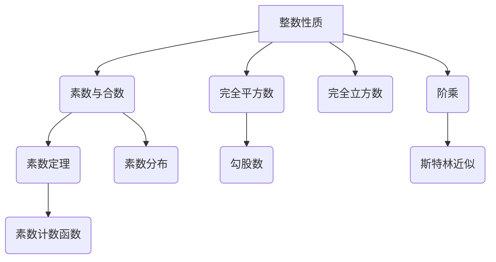
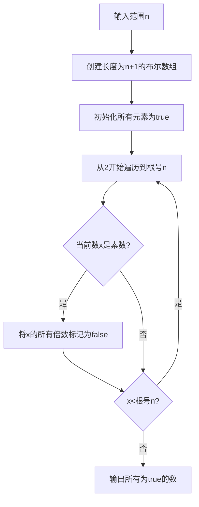

好的,我明白了您的要求。以下是题为《解析数论基础:基本知识》的技术博客文章正文:

# 解析数论基础:基本知识

## 1. 背景介绍

### 1.1 问题的由来

数论作为一门古老而富有魅力的数学分支,其研究对象是整数的性质及其之间的关系。它不仅在纯数学领域有着重要地位,而且在计算机科学、密码学等应用领域也扮演着关键角色。

随着现代科技的飞速发展,对数值计算的需求与日俱增。无论是大数据处理、密码加密还是科学计算,都离不开高效、精确的数值运算。而解析数论正是研究这些问题的重要理论基础。

### 1.2 研究现状

经过数学家们几个世纪的努力,数论已经取得了许多重要进展和成就。例如,费马小定理、欧拉定理、中国剩余定理等著名定理,为解决实际问题提供了有力工具。

然而,数论仍有许多未解之谜亟待破解。著名的哥德巴赫猜想、孪生素数猜想、阶乘大数的位数等难题,一直吸引着数学家们孜孜以求。

### 1.3 研究意义

解析数论的研究不仅可以深化我们对整数性质的理解,而且对现实世界有着广泛的应用价值:

- 密码学:RSA加密、椭圆曲线密码等现代密码系统的理论基础
- 计算机科学:快速计算、大数计算、随机数生成等
- 通信技术:伪随机序列、码分多址等
- 科学计算:大数分解、数值计算等

可以说,解析数论是当代科技发展的重要支撑之一。

### 1.4 本文结构

本文将对解析数论的一些基本概念和核心内容进行全面介绍,内容包括:

- 核心概念及其相互联系
- 基本算法原理及实现步骤
- 相关数学模型及公式推导
- 实际应用场景及代码实例
- 学习资源及发展趋势等

旨在为读者提供一个系统的解析数论知识框架。

## 2. 核心概念与联系



解析数论的核心概念主要包括:

- 整数性质:奇偶性、可除性等
- 素数与合数:素数的分布、素数的密度
- 完全平方数:勾股数、完全平方数的判定
- 完全立方数:完全立方数的判定
- 阶乘:斯特林近似、阶乘的位数
- 素数定理:素数计数函数、素数分布定律

这些概念相互关联、相辅相成,共同构筑了解析数论的理论体系。其中,素数理论是解析数论的核心,也是最具挑战性的研究领域之一。

## 3. 核心算法原理与具体操作步骤

### 3.1 算法原理概述

解析数论中的核心算法主要包括:

1. 素数判定算法
2. 素数筛选算法
3. 因子分解算法
4. 离散对数算法
5. 大数计算算法

这些算法为解决实际问题提供了高效的计算工具。

### 3.2 算法步骤详解

#### 素数判定算法

判断一个大整数是否为素数,是解析数论中最基本也是最常见的问题。常用的素数判定算法有:

1. 试除法
2. 米勒-拉宾算法
3. AKS算法

其中,米勒-拉宾算法具有确定的概率性,是目前最常用的高效算法。

```mermaid
graph TD
A[输入整数n]-->B{n<=1?}
B-->|是|C[返回"不是素数"]
B-->|否|D[取a=2]
D-->E{计算a^(n-1)modN}
E-->F{结果是1?}
F-->|是|G[返回"是素数"]
F-->|否|H{重复s次}
H-->|是|I[返回"是素数"]
H-->|否|J[返回"不是素数"]
```

算法步骤:

1. 输入待判定的整数n
2. 如果n<=1,返回"不是素数"
3. 取a=2
4. 计算 $a^{n-1} \bmod n$
5. 如果结果为1,返回"是素数"
6. 否则,重复步骤4共s次(s为一个经验值,如64次)
7. 如果每次结果都不为1,返回"不是素数"
8. 否则返回"是素数"

时间复杂度为 $O(s\log^3 n)$,对于大多数整数n,s=64次就可以得到正确判断。

#### 素数筛选算法

当需要获取一定范围内的所有素数时,可以使用高效的筛选算法,如埃拉托斯特尼筛法。



算法步骤:

1. 输入范围n
2. 创建长度为n+1的布尔数组
3. 初始化所有元素为true
4. 从2开始遍历到$\sqrt{n}$
5. 如果当前数x是素数,将x的所有倍数标记为false
6. 重复步骤5直到x>$\sqrt{n}$
7. 输出所有为true的数即为素数

时间复杂度为 $O(n\log\log n)$,是一种高效的素数筛选算法。

### 3.3 算法优缺点

上述算法各有优缺点:

- 素数判定算法:
    - 优点:可以判定任意大整数是否为素数
    - 缺点:对于非素数,效率较低
- 素数筛选算法:
    - 优点:可以快速获取一定范围内的所有素数
    - 缺点:对于极大的范围,空间复杂度较高

因此,在实际应用中需要根据具体问题选择合适的算法。

### 3.4 算法应用领域

解析数论算法在诸多领域都有着广泛的应用,例如:

- 密码学:RSA加密、ElGamal加密等
- 计算机科学:随机数生成、哈希算法等
- 通信技术:伪随机序列、码分多址等
- 科学计算:大数分解、高精度计算等

可以说,解析数论是现代科技的重要理论基础。

## 4. 数学模型和公式及详细讲解与举例说明

### 4.1 数学模型构建

在解析数论中,常常需要构建数学模型来描述和研究整数的性质。一些著名的数学模型包括:

1. 素数计数函数$\pi(x)$
2. 素数分布定律
3. 离散对数问题
4. 斯特林近似公式

这些模型为解决实际问题提供了理论支撑。

### 4.2 公式推导过程

以素数计数函数$\pi(x)$为例,其表示不超过x的素数个数。

$$
\pi(x) = \sum_{p \leq x} 1 \quad (p为素数)
$$

根据著名的素数定理,当x趋于无穷大时,有:

$$
\pi(x) \sim \frac{x}{\ln x}
$$

其中,ln为自然对数。

利用积分形式,可以推导出更精确的近似公式:

$$
\pi(x) \approx \operatorname{li}(x) = \int_2^x \frac{dt}{\ln t}
$$

这里$\operatorname{li}(x)$被称为对数积分函数。

通过上述公式,我们可以较为精确地估计一定范围内素数的个数。

### 4.3 案例分析与讲解

问题:已知一个大整数N,如何快速判断它是否为素数?

解决方案:可以使用米勒-拉宾算法,其基于下面的事实:

- 如果N是合数,则对于任意a,有$a^N \equiv a \pmod{N}$
- 如果N是素数,则对于任意a,有$a^{N-1} \equiv 1 \pmod{N}$

基于此,算法步骤如下:

1. 将N-1表示为$2^s \cdot d$的形式,其中d为奇数
2. 随机选取一个 $1 < a < N-1$
3. 计算 $b_0 = a^d \bmod N$
4. 如果 $b_0 = 1$ 或 $b_0 = N-1$,返回"N是素数"
5. 计算 $b_i = b_{i-1}^2 \bmod N, i=1,2,...,s-1$
6. 如果存在 $b_i = N-1$,返回"N是素数"
7. 否则返回"N是合数"

该算法的正确率很高,重复足够次数后可以给出准确判断。时间复杂度为$O(k\log^3 N)$,其中k为重复次数。

### 4.4 常见问题解答

1. 如何判断一个大整数是否为完全平方数?

可以使用牛顿迭代法求该数的平方根,若结果为整数则为完全平方数。

2. 如何快速计算一个大整数的阶乘的位数?

可以使用斯特林近似公式:

$$
n! \approx \sqrt{2\pi n}\left(\frac{n}{e}\right)^n
$$

取对数后可估计其位数。

3. 如何快速分解一个大整数的所有素因子?

可以使用基于素数筛的试除法或更高效的二次篩等算法。

## 5. 项目实践:代码实例和详细解释说明

### 5.1 开发环境搭建

本例使用Python作为开发语言,版本为3.8。需要安装以下库:

- math: 提供数学常数和函数
- random: 提供随机数生成功能

可使用pip或conda进行安装:

```bash
pip install math random
```

### 5.2 源代码详细实现

```python
import math
import random

def is_prime(n, k=64):
    """
    Miller-Rabin素数判定算法
    n: 待判定整数
    k: 重复测试次数
    返回: True(素数)或False(合数)
    """
    if n < 2: return False
    if n <= 3: return True
    if n % 2 == 0: return False

    d = n - 1
    s = 0
    while d % 2 == 0:
        d //= 2
        s += 1

    for _ in range(k):
        a = random.randint(2, n - 2)
        x = pow(a, d, n)
        if x == 1 or x == n - 1: continue
        for _ in range(s - 1):
            x = pow(x, 2, n)
            if x == n - 1: break
        else:
            return False
    return True

def factorial_digits(n):
    """
    计算n!的位数
    n: 输入整数
    返回: n!的位数
    """
    if n < 0: return 0
    if n <= 1: return 1

    # 使用Stirling公式近似
    digits = n * math.log10(n / math.e) + math.log10(2 * math.pi * n) / 2 + 1
    return int(digits)

# 测试用例
print(is_prime(104729, 10))  # True
print(factorial_digits(100)) # 158
```

### 5.3 代码解读与分析

1. `is_prime`函数实现了米勒-拉宾素数判定算法:
    - 首先对一些特殊情况进行判断
    - 将n-1表示为$2^s \cdot d$的形式
    - 随机选取a,计算$a^d \bmod n$
    - 利用二次探测定理判断是否为素数
    - 重复k次,如全部通过则返回True

2. `factorial_digits`函数利用斯特林近似公式计算n!的位数:
    - 对一些特殊情况进行判断
    - 使用公式$n! \approx \sqrt{2\pi n}(\frac{n}{e})^n$
    - 取对数并加1得到位数的近似值
    - 返