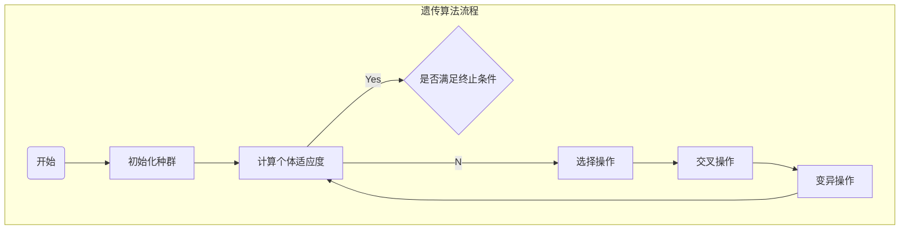

好的，我会严格遵循您提供的约束条件，以专业的技术语言撰写一篇关于遗传算法原理与代码实例讲解的深度博客文章。文章将包含背景介绍、核心概念、算法原理、数学模型、代码实现、应用场景、资源推荐、发展趋势与挑战等全面内容。请稍等片刻,我会尽最大努力为您提供一篇内容丰富、条理清晰的高质量技术博文。

# 遗传算法(Genetic Algorithms) - 原理与代码实例讲解

## 1. 背景介绍

### 1.1 问题的由来

在现实世界中,我们经常会遇到一些复杂的优化问题,例如旅行商问题(Traveling Salesman Problem,TSP)、装箱问题(Bin Packing Problem)、作业调度问题(Job Scheduling Problem)等。这些问题通常具有以下几个特点:

1. 搜索空间巨大,可能的解空间呈指数级增长
2. 目标函数的形式复杂,很难直接求解
3. 存在多个约束条件,需要同时满足

对于这类问题,传统的解决方案通常是枚举搜索或者使用启发式算法,但当问题规模增大时,它们往往会遇到计算效率低下或无法获得最优解的困境。

### 1.2 研究现状  

为了解决上述困难,人们开始探索借鉴自然界智能的新型计算模型和算法。其中,遗传算法(Genetic Algorithms,GA)就是一种模拟生物进化过程的随机搜索优化算法,由美国的John Holland于20世纪70年代初在密西根大学首次提出。

遗传算法属于进化算法(Evolutionary Algorithms)的一种,它模拟自然界生物进化的过程,通过选择、交叉和变异等操作对种群中的个体进行进化,最终获得满足要求的优秀个体,即问题的最优解或近似最优解。

### 1.3 研究意义

作为一种有效的随机搜索算法,遗传算法具有以下优点:

1. 全局性:不易陷入局部最优解
2. 隐函数优化:无需知道目标函数的具体形式
3. 自适应性强:可自动获取和利用问题的知识
4. 并行性:易于实现并行计算

由于这些优点,遗传算法已被广泛应用于组合优化、机器学习、控制理论、智能系统等诸多领域,展现出巨大的应用前景和研究价值。

### 1.4 本文结构  

本文将全面介绍遗传算法的基本原理、数学模型、关键步骤,并通过实例代码讲解其具体实现过程。文章的主要内容结构如下:

```
1. 背景介绍
2. 核心概念与联系
3. 核心算法原理与具体操作步骤
4. 数学模型和公式详细讲解与举例说明  
5. 项目实践:代码实例和详细解释说明
6. 实际应用场景
7. 工具和资源推荐 
8. 总结:未来发展趋势与挑战
9. 附录:常见问题与解答
```

## 2. 核心概念与联系

在正式讲解遗传算法的原理之前,我们先了解一下它所涉及的一些核心概念:

### 2.1 个体(Individual)

个体是遗传算法中最基本的单元,它表示潜在的问题解。在求解过程中,算法维护一个个体群体(种群),通过对个体进行选择、交叉和变异操作,使种群不断进化,最终获得满足要求的优秀个体。

个体的编码方式通常有二进制编码、实数编码、排列编码等,需要根据具体问题的特点选择合适的编码方式。

### 2.2 适应度函数(Fitness Function)

适应度函数用于评估个体的优劣程度,值越大表示个体越优秀。在遗传算法中,适应度函数的设计直接影响算法的性能,需要根据具体问题建立合理的适应度函数。

### 2.3 选择(Selection)

选择是遗传算法的核心操作之一,它模拟自然界中适者生存的过程。常用的选择算子有轮盘赌选择、锦标赛选择、排名选择等。通过选择,优秀个体将有更大概率被遗传到下一代种群中。

### 2.4 交叉(Crossover)

交叉是遗传算法的另一核心操作,它模拟生物交配过程中染色体的交换与重组。通过交叉,可以让优秀个体的优良基因得以保留和组合,产生新的更优秀的个体。常用的交叉算子有单点交叉、多点交叉、均匀交叉等。

### 2.5 变异(Mutation)

变异操作模拟生物基因突变的现象,它通过改变个体部分基因位的值,为种群注入新的genetic material,增加种群的多样性,防止过早收敛到局部最优解。常用的变异算子有基本位变异、均匀变异、高斯变异等。

### 2.6 终止条件

遗传算法需要设置一个合理的终止条件,以决定进化过程何时结束。常用的终止条件包括:

- 达到最大进化代数
- 种群收敛到一定程度(如适应度方差小于阈值)
- 找到满意的解

上述概念相互关联、相互作用,共同构成了遗传算法的基本框架,如下流程图所示:



## 3. 核心算法原理与具体操作步骤  

### 3.1 算法原理概述

遗传算法的基本思想是模拟自然界生物进化过程中的"遗传"和"优胜劣汰"机制,通过对一个编码的参数集合(种群)进行一系列的遗传操作,产生新一代的种群,使种群不断进化,最终获得满足要求的最优解或近似最优解。

遗传算法的核心在于:通过选择、交叉和变异等操作,使种群中优良个体的优良基因得以保留和重组,同时也为种群注入新的基因,使种群在每一代进化中不断产生更优秀的个体。

### 3.2 算法步骤详解

1. **初始化种群**

   首先需要根据问题的特点选择合适的编码方式,随机生成一个规模为N的初始种群。每个个体对应一个潜在的问题解。

2. **计算个体适应度**

   通过预先设计的适应度函数,计算每个个体的适应度值,作为评价个体优劣的标准。

3. **选择操作**

   根据个体的适应度值,按照一定的选择算子(如轮盘赌选择、锦标赛选择等)从当前种群中选择若干个体,作为交叉操作的亲本。

4. **交叉操作** 

   对选中的亲本个体进行交叉操作(如单点交叉、多点交叉等),产生新的子代个体。交叉操作模拟了生物交配过程中染色体的重组。

5. **变异操作**

   以一定的小概率对交叉后的子代个体进行变异操作(如基本位变异、均匀变异等),引入新的基因,增加种群多样性。

6. **更新种群**

   将经过选择、交叉、变异产生的新个体加入到新一代种群中,替换掉适应度较低的个体。

7. **终止判断**

   判断是否满足预先设定的终止条件(如最大进化代数、收敛条件等),若满足则输出当前种群中适应度最高的个体作为最终解;否则回到步骤2,对新一代种群进行迭代。

上述过程的伪代码描述如下:

```
初始化种群P(t)  
计算种群P(t)中每个个体的适应度
while (不满足终止条件) {
    选择操作,从P(t)中选择个体作为亲本
    交叉操作,对亲本进行交叉产生子代
    变异操作,对子代进行变异
    将子代个体加入新一代种群P(t+1)
    t = t + 1
}
输出当前种群中适应度最高的个体作为最终解
```

### 3.3 算法优缺点

**优点:**

1. 全局性优化能力强,不易陷入局部最优
2. 无需知道目标函数的具体形式,可以隐函数优化
3. 具有自适应能力,可以自动获取和利用问题的知识
4. 算法具有并行性,易于实现并行计算

**缺点:**

1. 缓慢的收敛速度,需要较多的迭代次数
2. 算法性能依赖于编码方式、算子设计和参数选择
3. 对于高维搜索空间的问题,性能可能下降
4. 无法保证获得全局最优解

### 3.4 算法应用领域

由于其全局优化能力和自适应性,遗传算法已被广泛应用于以下领域:

- 组合优化问题:如旅行商问题、装箱问题、作业调度等
- 机器学习与模式识别:如聚类分析、特征选择等 
- 控制理论:如PID参数优化、机器人路径规划等
- 智能系统:如专家系统、决策支持系统等
- 工程设计优化:如电路布线、结构优化等
- 生物信息学:如基因表达模式分析、蛋白质结构预测等

## 4. 数学模型和公式详细讲解与举例说明

在正式实现遗传算法之前,我们有必要对其数学模型和相关公式进行深入探讨,以加深对算法本质的理解。

### 4.1 数学模型构建

遗传算法求解的是一个约束优化问题,可以用如下数学模型表示:

$$\begin{cases}
\max\limits_{x\in X} & f(x)\
\text{s.t.} & g_i(x)\leq 0, i=1,2,...,m \
            & h_j(x)=0, j=1,2,...,p
\end{cases}$$

其中:
- $X$是决策变量的定义域
- $f(x)$是目标函数,表示要最大化的优化目标
- $g_i(x)$和$h_j(x)$分别表示不等式约束和等式约束

遗传算法的目标就是在满足所有约束条件的前提下,寻找使目标函数$f(x)$达到最大值的最优解$x^*$。

### 4.2 公式推导过程

为了量化个体的优劣程度,我们需要构造合适的适应度函数(Fitness Function)。常用的适应度函数有以下几种:

1. **标准适应度函数**

$$Fitness(x)=f(x)$$

直接将目标函数值作为适应度值。适用于最大化无约束问题。

2. **基于等级的适应度函数**

$$Fitness(x)=\frac{1}{rank(x)}$$

其中$rank(x)$表示个体$x$在种群中的排名,排名第一的个体适应度最高。

3. **基于罚函数的适应度函数**

对于有约束的优化问题,可以引入罚函数,将约束条件并入目标函数:

$$Fitness(x)=f(x)-\rho\sum\limits_{i=1}^{m}\max(0,g_i(x))^2-\rho\sum\limits_{j=1}^{p}|h_j(x)|$$

其中$\rho$是罚因子,用于平衡目标函数和约束违规程度。

适应度函数的设计对算法性能有很大影响,需要根据具体问题特点进行选择和调优。

### 4.3 案例分析与讲解

为了更好地理解遗传算法的原理和实现,我们来看一个具体的案例:最大化单峰函数$f(x)=x\sin(10\pi x)+2.0$在区间$[-1,2]$上的值。

这是一个单变量无约束优化问题,目标函数的曲线如下图所示:

```mermaid
stateDiagram-v2
    state "f(x) = x*sin(10*pi*x) + 2.0" as func
    note right of func
        单峰函数曲线
        