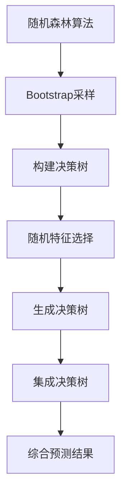

# 随机森林(Random Forests) - 原理与代码实例讲解

## 1. 背景介绍

### 1.1 问题的由来

在现代数据科学领域,机器学习算法扮演着越来越重要的角色。随着数据量的快速增长和问题复杂性的提高,传统的单一决策树模型往往难以满足实际需求。为了提高预测性能,降低过拟合风险,集成学习方法应运而生。

集成学习(Ensemble Learning)的核心思想是将多个基学习器(Base Learner)进行组合,从而获得比单一学习器更出色的泛化能力。其中,随机森林(Random Forests)作为一种非常成功的集成学习算法,在分类、回归等多个领域展现出卓越的性能,受到了广泛关注和应用。

### 1.2 研究现状

随机森林最早由Leo Breiman于2001年提出,它是在决策树算法的基础上发展而来的。该算法通过构建多个决策树,并对它们的预测结果进行综合,从而形成一个强大的预测模型。

与单一决策树相比,随机森林具有以下优势:

1. 降低过拟合风险
2. 提高预测准确性
3. 能够处理高维数据
4. 对噪声和缺失值具有鲁棒性
5. 可解释性较强

由于这些显著优点,随机森林在科学研究和工业应用中得到了广泛应用,例如计算机视觉、自然语言处理、生物信息学等领域。许多知名机器学习库如scikit-learn、XGBoost等都内置了随机森林算法的实现。

### 1.3 研究意义

随机森林算法的研究具有重要的理论和实践意义:

1. 理论层面:深入探讨集成学习的原理和优化方法,为发展更加高效、鲁棒的机器学习算法奠定基础。
2. 应用层面:随机森林可广泛应用于各个领域的分类、回归等任务,为解决实际问题提供有力工具。
3. 教学层面:随机森林算法结合了多个基础概念(决策树、Bootstrap、随机特征选择等),是机器学习教学的绝佳范例。

本文将全面介绍随机森林算法的原理、实现细节和实际应用,为读者提供深入理解该算法的机会。

### 1.4 本文结构

本文的主要结构如下:

1. 背景介绍
2. 核心概念与联系
3. 核心算法原理与具体操作步骤
4. 数学模型和公式详细讲解与举例说明
5. 项目实践:代码实例和详细解释说明
6. 实际应用场景
7. 工具和资源推荐
8. 总结:未来发展趋势与挑战
9. 附录:常见问题与解答

## 2. 核心概念与联系

在深入探讨随机森林算法之前,我们需要先了解其中涉及的几个核心概念及它们之间的联系。

### 2.1 决策树

决策树(Decision Tree)是一种基础的监督学习算法,通过构建树状决策模型对数据进行分类或回归预测。决策树的构建过程是递归地对数据进行划分,每个节点根据特征值进行分支决策,直至到达叶子节点作出最终预测。

决策树具有可解释性强、模型简单等优点,但也存在过拟合风险、对数据噪声敏感等缺陷。单一决策树的性能往往不够理想,因此需要通过集成学习的方式加以改进。

### 2.2 Bootstrap 采样

Bootstrap 采样(Bootstrapping)是一种重采样技术,通过从原始数据集中有放回地抽取样本,构建出与原始数据集大小相同的新数据集。这种采样方式使得新数据集中存在重复的样本,同时也有一部分样本被遗漏。

Bootstrap 采样在随机森林算法中的作用是为每棵决策树提供训练数据。由于每棵树使用的训练集都略有不同,因此它们的预测结果也会存在差异,从而提高了整体模型的泛化能力。

### 2.3 随机特征选择

在传统的决策树算法中,每个节点划分时会考虑所有特征,选择最优特征进行分裂。然而,这可能会导致模型过于依赖于某些特征,从而降低了泛化能力。

随机特征选择(Random Subspace Method)的思想是,在每个节点划分时,先从所有特征中随机选择一个特征子集,然后再从这个子集中选择最优特征进行分裂。这种方式降低了决策树对特征的依赖性,提高了模型的多样性。

### 2.4 集成学习

集成学习(Ensemble Learning)是指通过构建并结合多个基学习器(Base Learner)来完成学习任务的方法。常见的集成策略包括Bagging(Boostrap Aggregating)和Boosting。

随机森林算法采用了Bagging集成策略,即通过Bootstrap采样获得不同的训练集,分别训练出多棵决策树,最后将这些决策树的预测结果进行综合,从而得到最终的预测结果。

上述几个概念相互关联、相辅相成,共同构成了随机森林算法的理论基础。下一部分我们将详细介绍随机森林的核心算法原理和具体实现步骤。

## 3. 核心算法原理与具体操作步骤

### 3.1 算法原理概述

随机森林算法的核心思想是通过集成多棵决策树来提高预测性能。具体来说,它包括以下几个关键步骤:

1. 从原始数据集中使用Bootstrap采样技术抽取多个新的训练集。
2. 对每个训练集,使用随机特征选择的方式构建一棵决策树。
3. 对于新的预测样本,将其输入到每棵决策树中,收集各棵树的预测结果。
4. 对于分类任务,选择票数最多的类别作为最终预测结果;对于回归任务,计算所有决策树预测值的均值作为最终预测结果。

通过这种方式,随机森林算法实现了两个目标:

1. 降低过拟合风险:由于每棵决策树使用的训练集略有不同,因此它们的预测结果也会存在差异,从而降低了整体模型对特定数据的依赖性。
2. 提高预测准确性:通过综合多棵决策树的预测结果,可以有效减小单个决策树的方差,提高模型的稳定性和准确性。

下面我们将详细介绍随机森林算法的具体实现步骤。

### 3.2 算法步骤详解

1. **Bootstrap 采样**

   对于给定的原始数据集 D,我们通过 Bootstrap 采样技术构建出 n 个新的训练集 D1, D2, ..., Dn,每个训练集的大小与原始数据集相同。具体做法是:对于每个训练集 Di,我们从 D 中有放回地随机抽取 N 个样本(N 为原始数据集大小),构成新的训练集 Di。由于采样是有放回的,因此每个训练集中可能存在重复的样本,同时也会有一部分样本被遗漏。

2. **构建决策树**

   对于每个训练集 Di,我们使用经典的决策树算法(如 ID3、C4.5 或 CART)构建一棵决策树模型 Ti。在构建每个节点时,我们不是从所有特征中选择最优特征,而是采用随机特征选择的方式。

3. **随机特征选择**

   在构建决策树的每个节点时,我们不是从所有特征中选择最优特征,而是先从所有特征中随机选择一个特征子集,然后再从这个子集中选择最优特征进行分裂。对于分类问题,通常选择特征子集的大小为 $\sqrt{m}$ (m 为总特征数);对于回归问题,通常选择特征子集的大小为 $m/3$。这种随机特征选择的方式可以降低决策树对特定特征的依赖性,提高模型的多样性。

4. **生成决策树集合**

   重复上述步骤,我们可以获得 n 棵决策树 T1, T2, ..., Tn,它们共同构成了随机森林模型。

5. **综合预测结果**

   对于新的预测样本 x,我们将其输入到每棵决策树中,收集各棵树的预测结果:

   - 对于分类任务,每棵树会为 x 预测一个类别,我们选择票数最多的类别作为最终预测结果。
   - 对于回归任务,每棵树会为 x 预测一个数值,我们计算所有决策树预测值的均值作为最终预测结果。

通过上述步骤,我们成功构建了一个随机森林模型。该模型综合了多棵决策树的预测结果,具有更强的泛化能力和预测准确性。

### 3.3 算法优缺点

**优点:**

1. **降低过拟合风险**: 由于每棵决策树使用略有不同的训练集,并且在构建时采用了随机特征选择,因此各棵树之间的差异性较大,降低了整体模型对特定数据的依赖性,从而降低了过拟合风险。

2. **提高预测准确性**: 通过集成多棵决策树的预测结果,可以有效减小单个决策树的方差,提高模型的稳定性和准确性。

3. **能够处理高维数据**: 随机森林算法在训练时通过随机特征选择,降低了对单个特征的依赖,因此能够很好地处理高维数据。

4. **对噪声和缺失值具有鲁棒性**: 由于集成了多棵决策树的预测结果,随机森林对于数据中的噪声和缺失值具有较强的鲁棒性。

5. **可解释性较强**: 虽然随机森林模型由多棵决策树组成,但是每棵决策树本身都是可解释的,因此整体模型的可解释性也相对较高。

**缺点:**

1. **训练时间较长**: 随机森林需要构建多棵决策树,因此训练时间相对较长,尤其是在大数据集上训练时更为明显。

2. **占用内存较大**: 由于需要存储多棵决策树的结构,随机森林模型在内存占用方面要比单一决策树大得多。

3. **对于某些噪音数据的表现可能不佳**: 尽管随机森林对噪声具有一定的鲁棒性,但如果数据中存在大量噪声,它的性能可能会受到影响。

4. **缺乏连续输出**: 对于回归任务,随机森林只能给出离散的预测值,无法直接产生连续的输出。

### 3.4 算法应用领域

由于随机森林算法具有出色的性能和适用性,它在诸多领域都有广泛的应用,包括但不限于:

1. **计算机视觉**: 图像分类、目标检测、语义分割等。
2. **自然语言处理**: 文本分类、情感分析、机器翻译等。
3. **生物信息学**: 基因表达数据分析、蛋白质结构预测等。
4. **金融**: 信用评分、欺诈检测、风险管理等。
5. **推荐系统**: 个性化推荐、用户行为分析等。
6. **医疗健康**: 疾病诊断、药物开发、医疗影像分析等。
7. **气象预报**: 天气预测、气候模式分析等。
8. **其他领域**: 网络安全、能源预测、环境监测等。

随机森林算法在上述众多领域发挥着重要作用,为解决实际问题提供了有力的工具支持。

## 4. 数学模型和公式详细讲解与举例说明

### 4.1 数学模型构建

在介绍随机森林算法的数学模型之前,我们先回顾一下决策树的基本概念。

对于一个给定的数据集 $D = \{(x_1, y_1), (x_2, y_2), \ldots, (x_N, y_N)\}$,其中 $x_i$ 表示第 $i$ 个样本的特征向量,而 $y_i$ 表示对应的标签(对于分类问题,标