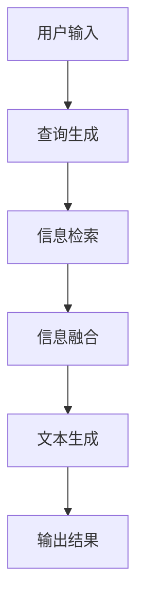

# 【LangChain编程：从入门到实践】LangChain中的RAG组件

## 1.背景介绍

在现代人工智能和自然语言处理（NLP）领域，生成式预训练模型（如GPT-3）已经展示了其强大的语言生成能力。然而，单纯依赖这些模型进行信息检索和生成（RAG，Retrieval-Augmented Generation）存在一定的局限性。LangChain作为一个新兴的框架，旨在通过结合信息检索和生成模型，提升文本生成的准确性和实用性。本文将深入探讨LangChain中的RAG组件，帮助读者理解其核心概念、算法原理、数学模型、实际应用以及未来发展趋势。

## 2.核心概念与联系

### 2.1 LangChain简介

LangChain是一个专注于自然语言处理的框架，旨在通过结合信息检索和生成模型，提升文本生成的准确性和实用性。其核心组件之一是RAG（Retrieval-Augmented Generation），即通过检索相关信息来增强生成模型的能力。

### 2.2 RAG的基本概念

RAG（Retrieval-Augmented Generation）是一种结合信息检索和生成模型的方法。其基本思想是先通过检索模块从大规模文档库中找到相关信息，然后将这些信息输入到生成模型中，以生成更加准确和有用的文本。

### 2.3 RAG的优势

- **提高生成准确性**：通过检索相关信息，生成模型可以基于更准确和相关的上下文生成文本。
- **增强模型的知识库**：生成模型可以利用外部知识库中的信息，弥补其自身知识的不足。
- **灵活性和可扩展性**：RAG方法可以灵活地结合不同的检索和生成模型，适应不同的应用场景。

## 3.核心算法原理具体操作步骤

### 3.1 RAG的工作流程

RAG的工作流程可以分为以下几个步骤：

1. **查询生成**：根据用户输入生成查询。
2. **信息检索**：使用查询从文档库中检索相关文档。
3. **信息融合**：将检索到的文档与原始查询进行融合。
4. **文本生成**：将融合后的信息输入生成模型，生成最终的文本。

以下是RAG工作流程的Mermaid流程图：



### 3.2 查询生成

查询生成是RAG的第一步，其目的是根据用户输入生成一个或多个查询。这些查询将用于从文档库中检索相关信息。查询生成可以使用简单的关键词提取方法，也可以使用复杂的自然语言处理技术。

### 3.3 信息检索

信息检索是RAG的核心步骤之一，其目的是从大规模文档库中找到与查询相关的文档。常用的信息检索方法包括TF-IDF、BM25以及基于深度学习的检索模型。

### 3.4 信息融合

信息融合是将检索到的文档与原始查询进行融合的过程。其目的是将检索到的信息与用户输入的上下文结合起来，以便生成模型能够生成更加准确和相关的文本。

### 3.5 文本生成

文本生成是RAG的最后一步，其目的是将融合后的信息输入生成模型，生成最终的文本。常用的生成模型包括GPT-3、BERT等。

## 4.数学模型和公式详细讲解举例说明

### 4.1 查询生成的数学模型

查询生成可以看作是一个条件概率问题，即在给定用户输入的情况下生成查询的概率。其数学表示为：

$$
P(Q|U) = \text{softmax}(W \cdot U + b)
$$

其中，$Q$表示生成的查询，$U$表示用户输入，$W$和$b$是模型的参数。

### 4.2 信息检索的数学模型

信息检索可以看作是一个相似度计算问题，即在给定查询的情况下找到最相关的文档。常用的相似度计算方法包括余弦相似度、点积等。其数学表示为：

$$
\text{sim}(Q, D) = \frac{Q \cdot D}{\|Q\| \|D\|}
$$

其中，$Q$表示查询，$D$表示文档。

### 4.3 信息融合的数学模型

信息融合可以看作是一个加权平均问题，即将检索到的文档与原始查询进行加权平均。其数学表示为：

$$
F = \alpha Q + (1 - \alpha) D
$$

其中，$F$表示融合后的信息，$Q$表示查询，$D$表示文档，$\alpha$是加权系数。

### 4.4 文本生成的数学模型

文本生成可以看作是一个条件语言模型，即在给定上下文的情况下生成文本的概率。其数学表示为：

$$
P(T|F) = \prod_{i=1}^{n} P(t_i|t_{<i}, F)
$$

其中，$T$表示生成的文本，$F$表示融合后的信息，$t_i$表示生成的第$i$个词。

## 5.项目实践：代码实例和详细解释说明

### 5.1 环境配置

在开始项目实践之前，我们需要配置开发环境。以下是所需的Python库：

```bash
pip install transformers
pip install faiss-cpu
pip install torch
```

### 5.2 查询生成代码示例

以下是一个简单的查询生成代码示例：

```python
from transformers import AutoTokenizer, AutoModelForSeq2SeqLM

tokenizer = AutoTokenizer.from_pretrained("t5-small")
model = AutoModelForSeq2SeqLM.from_pretrained("t5-small")

def generate_query(user_input):
    inputs = tokenizer.encode("generate query: " + user_input, return_tensors="pt")
    outputs = model.generate(inputs)
    query = tokenizer.decode(outputs[0], skip_special_tokens=True)
    return query

user_input = "如何提高机器学习模型的准确性？"
query = generate_query(user_input)
print(query)
```

### 5.3 信息检索代码示例

以下是一个简单的信息检索代码示例：

```python
import faiss
import numpy as np

# 假设我们有一个文档库
documents = ["机器学习是一种人工智能技术", "深度学习是机器学习的一个分支", "提高模型准确性的方法有很多"]

# 将文档向量化
document_vectors = [np.random.rand(768) for _ in documents]

# 构建FAISS索引
index = faiss.IndexFlatL2(768)
index.add(np.array(document_vectors))

def retrieve_documents(query_vector, k=3):
    D, I = index.search(np.array([query_vector]), k)
    return [documents[i] for i in I[0]]

# 假设我们有一个查询向量
query_vector = np.random.rand(768)
retrieved_documents = retrieve_documents(query_vector)
print(retrieved_documents)
```

### 5.4 信息融合代码示例

以下是一个简单的信息融合代码示例：

```python
def fuse_information(query, documents, alpha=0.5):
    fused_information = alpha * query + (1 - alpha) * " ".join(documents)
    return fused_information

query = "提高机器学习模型的准确性"
documents = ["机器学习是一种人工智能技术", "深度学习是机器学习的一个分支"]
fused_information = fuse_information(query, documents)
print(fused_information)
```

### 5.5 文本生成代码示例

以下是一个简单的文本生成代码示例：

```python
def generate_text(fused_information):
    inputs = tokenizer.encode("generate text: " + fused_information, return_tensors="pt")
    outputs = model.generate(inputs)
    text = tokenizer.decode(outputs[0], skip_special_tokens=True)
    return text

fused_information = "提高机器学习模型的准确性 机器学习是一种人工智能技术 深度学习是机器学习的一个分支"
generated_text = generate_text(fused_information)
print(generated_text)
```

## 6.实际应用场景

### 6.1 问答系统

RAG可以用于构建高效的问答系统，通过检索相关文档并生成准确的答案。例如，医疗问答系统可以通过检索医学文献来回答用户的健康问题。

### 6.2 文档摘要

RAG可以用于生成文档摘要，通过检索相关文档并生成简洁的摘要。例如，新闻摘要系统可以通过检索相关新闻来生成简洁的新闻摘要。

### 6.3 内容生成

RAG可以用于生成高质量的内容，通过检索相关文档并生成有用的内容。例如，内容创作系统可以通过检索相关文档来生成高质量的文章。

## 7.工具和资源推荐

### 7.1 工具

- **Transformers**：一个强大的自然语言处理库，支持多种生成模型。
- **FAISS**：一个高效的相似度搜索库，适用于大规模信息检索。

### 7.2 资源

- **Hugging Face Model Hub**：一个提供多种预训练模型的资源库。
- **Kaggle**：一个提供多种数据集和竞赛的平台，适合进行RAG相关的实验。

## 8.总结：未来发展趋势与挑战

### 8.1 未来发展趋势

- **多模态RAG**：结合文本、图像、音频等多种模态的信息检索和生成。
- **实时RAG**：实现实时的信息检索和生成，提升用户体验。
- **个性化RAG**：根据用户的兴趣和需求，生成个性化的内容。

### 8.2 挑战

- **数据隐私**：在进行信息检索和生成时，如何保护用户的隐私是一个重要的挑战。
- **模型效率**：如何提升RAG模型的效率，降低计算成本，是一个亟待解决的问题。
- **生成质量**：如何提升生成文本的质量，避免生成无意义或错误的信息，是一个重要的研究方向。

## 9.附录：常见问题与解答

### 9.1 RAG与传统生成模型的区别是什么？

RAG结合了信息检索和生成模型，通过检索相关信息来增强生成模型的能力，而传统生成模型仅依赖于自身的预训练知识。

### 9.2 如何选择合适的检索模型？

选择检索模型时，可以根据具体应用场景和数据规模来选择。对于小规模数据，可以使用TF-IDF或BM25；对于大规模数据，可以使用基于深度学习的检索模型。

### 9.3 如何提升RAG模型的生成质量？

可以通过增加训练数据、优化模型结构、结合多模态信息等方法来提升RAG模型的生成质量。

### 9.4 RAG模型的计算成本如何控制？

可以通过模型压缩、分布式计算、硬件加速等方法来降低RAG模型的计算成本。

### 9.5 RAG模型的应用前景如何？

RAG模型在问答系统、文档摘要、内容生成等领域具有广泛的应用前景，未来有望在更多领域得到应用。

---

作者：禅与计算机程序设计艺术 / Zen and the Art of Computer Programming