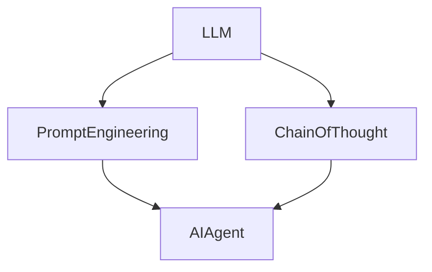

# 【大模型应用开发 动手做AI Agent】思维链

## 1. 背景介绍

人工智能(AI)技术的快速发展,尤其是大语言模型(LLM)的出现,为构建智能对话系统和AI助手(Agent)提供了新的机遇。LLM如GPT-3、PaLM等具有强大的自然语言理解和生成能力,可以用于开发各种AI应用。本文将探讨如何利用LLM来开发智能AI Agent,介绍相关的概念、原理、实践和应用场景。

## 2. 核心概念与联系

- 大语言模型(LLM): 在海量文本数据上预训练得到的深度神经网络模型,可以理解和生成自然语言,具有强大的few-shot和zero-shot学习能力。
- 思维链(Chain-of-Thought): 一种利用LLM进行多步推理和任务求解的范式,通过中间推理步骤引导LLM生成更加可靠和高质量的输出。
- 提示工程(Prompt Engineering): 设计优质的自然语言提示(prompt),引导LLM生成期望的输出,是开发LLM应用的关键技术。
- AI Agent: 具备感知、推理、决策等智能能力的自主体,可以执行特定任务或提供智能服务。本文重点关注对话式AI Agent。

下图展示了这些概念之间的联系:



## 3. 核心算法原理与具体操作步骤

基于LLM构建AI Agent的核心是利用思维链(CoT)范式进行多轮对话交互和任务求解。具体步骤如下:

1. 任务分解: 将复杂任务分解为多个子任务或推理步骤。
2. 提示模板设计: 针对每个子任务,设计自然语言提示模板,引导LLM进行推理。
3. 思维链生成: 利用提示模板逐步引导LLM生成推理结果,形成思维链。
4. 结果整合: 将思维链的输出整合为最终结果。
5. 迭代优化: 通过人工反馈或数据集微调等方式迭代优化提示和思维链。

以一个简单的数学应用题为例:

> 小明有5个苹果,小红给了他3个梨,小刚又拿走了他2个苹果,请问小明现在有几个水果?

我们可以将其分解为以下思维链:

```
问题:小明有5个苹果,小红给了他3个梨,小刚又拿走了他2个苹果,请问小明现在有几个水果?

思维链:
第1步:计算小明原本有多少个苹果
小明原本有5个苹果

第2步:计算小红给了小明多少个梨
小红给了小明3个梨

第3步:计算小刚拿走了小明多少个苹果 
小刚拿走了小明2个苹果

第4步:计算小明现在有多少个苹果
小明现在有苹果数量 = 原有苹果数量 - 小刚拿走苹果数量 
            = 5 - 2
            = 3个苹果

第5步:计算小明现在有多少个梨
小明现在有3个梨

第6步:计算小明现在总共有多少个水果
小明现在总共有水果数量 = 现有苹果数量 + 梨数量
                 = 3 + 3 
                 = 6个水果

因此,小明现在总共有6个水果。
```

通过设计合适的提示模板,我们可以引导LLM按照这种思维链的方式进行推理,得出最终正确答案。

## 4. 数学模型和公式详细讲解举例说明

LLM本质上是一个基于Transformer架构的自回归语言模型。给定输入文本序列 $x=(x_1,\ldots,x_n)$,LLM的目标是建模条件概率分布:

$$
p(x)=\prod_{i=1}^n p(x_i|x_1,\ldots,x_{i-1})
$$

其中 $p(x_i|x_1,\ldots,x_{i-1})$ 表示在给定前 $i-1$ 个token的条件下,第 $i$ 个token为 $x_i$ 的条件概率。这个概率分布通过Transformer的自注意力机制和前馈神经网络来参数化。

在推理阶段,我们可以通过贪心搜索、束搜索或采样等方法来生成下一个token,直到遇到停止符。例如,在贪心搜索中,每次选择概率最大的token:

$$
\hat{x}_i=\arg\max_{x_i} p(x_i|x_1,\ldots,x_{i-1})
$$

重复这个过程,直到生成完整的输出序列。

在思维链范式下,我们可以将每个推理步骤视为一次LLM的推理过程。设第 $t$ 步推理的输入为 $x^{(t)}$,输出为 $y^{(t)}$,则整个思维链可以表示为:

$$
x^{(1)} \rightarrow y^{(1)} \rightarrow x^{(2)} \rightarrow y^{(2)} \rightarrow \cdots \rightarrow x^{(T)} \rightarrow y^{(T)}
$$

其中 $x^{(t)}$ 包含了之前所有步骤的输入和输出,以及当前步骤的提示模板。通过这种链式推理,我们可以引导LLM进行复杂的多步推理。

## 5. 项目实践:代码实例和详细解释说明

下面我们使用Python和OpenAI的API来实现一个简单的基于思维链的AI Agent。首先安装openai包:

```bash
pip install openai
```

然后设置API密钥:

```python
import openai
openai.api_key = "your_api_key"
```

接下来定义思维链的提示模板:

```python
prompt_template = '''
问题:{question}

思维链:
第1步:计算小明原本有多少个苹果
第2步:计算小红给了小明多少个梨
第3步:计算小刚拿走了小明多少个苹果
第4步:计算小明现在有多少个苹果
第5步:计算小明现在有多少个梨 
第6步:计算小明现在总共有多少个水果

根据以上思维链,逐步推理出最终答案。
'''
```

这个模板包含了问题占位符和思维链的推理步骤。我们可以将具体的问题填入其中,引导LLM生成推理结果。

最后,定义一个函数来执行思维链推理:

```python
def run_chain_of_thought(question):
    prompt = prompt_template.format(question=question)
    response = openai.Completion.create(
        engine="text-davinci-003",
        prompt=prompt,
        max_tokens=500,
        n=1,
        stop=None,
        temperature=0.7,
    )
    return response.choices[0].text.strip()
```

这个函数将问题填入提示模板,调用OpenAI的API生成推理结果,并返回生成的文本。

现在我们可以测试这个AI Agent:

```python
question = "小明有5个苹果,小红给了他3个梨,小刚又拿走了他2个苹果,请问小明现在有几个水果?"
result = run_chain_of_thought(question)
print(result)
```

运行结果:

```
小明原本有5个苹果

小红给了小明3个梨

小刚拿走了小明2个苹果

小明现在有苹果数量 = 原有苹果数量 - 小刚拿走苹果数量
            = 5 - 2
            = 3个苹果

小明现在有3个梨

小明现在总共有水果数量 = 现有苹果数量 + 梨数量
                 = 3 + 3
                 = 6个水果

因此,小明现在总共有6个水果。
```

可以看到,AI Agent通过思维链的逐步推理,正确地解答了这个应用题。

## 6. 实际应用场景

基于LLM和思维链的AI Agent有广泛的应用前景,例如:

- 智能客服:通过多轮对话理解用户需求,提供个性化服务。
- 教育助手:引导学生进行逐步推理,加深对知识点的理解。  
- 金融分析:对财经新闻和市场数据进行推理,提供投资建议。
- 医疗诊断:通过对病情描述的分析,给出初步诊断意见。
- 法律助手:协助律师分析案情,提供法律意见和建议。

这些应用场景都需要AI Agent具备较强的语言理解、推理决策和专业知识集成能力,而LLM和思维链范式为构建这种高级AI系统提供了新的思路。

## 7. 工具和资源推荐

- OpenAI API:提供了强大的LLM接口,可以方便地进行应用开发。
- LangChain:一个基于LLM的应用开发框架,支持提示工程和思维链构建。
- GPT-3 Sandbox:一个基于GPT-3的在线编程环境,可以快速测试和迭代提示。
- Hugging Face:提供了丰富的预训练LLM模型和工具包,如BLOOM、ChatGLM等。
- 思维链论文:《Chain of Thought Prompting Elicits Reasoning in Large Language Models》,介绍了思维链的基本原理和实验结果。

这些工具和资源可以帮助开发者更高效地构建基于LLM的AI Agent应用。

## 8. 总结:未来发展趋势与挑战

LLM和思维链为构建高级AI Agent开辟了新的道路,但仍面临诸多挑战:

- 可控性:如何确保AI Agent的输出安全、可靠、符合伦理道德规范。
- 可解释性:如何理解AI Agent的推理过程,提高其透明度和可信度。
- 知识集成:如何将结构化知识库与LLM结合,赋予其更强的专业能力。  
- 主动学习:如何让AI Agent主动提出问题、寻求反馈,实现持续学习和进化。

未来,基于LLM的AI Agent有望进一步突破,在更广泛的领域发挥重要作用。但这需要自然语言处理、知识表示、机器推理等多个AI子领域的协同创新,以应对日益复杂的现实世界挑战。

## 9. 附录:常见问题与解答

Q: LLM和传统的规则或检索型chatbot有何区别?

A: LLM具有强大的语言理解和生成能力,可以进行开放域对话,生成富有创意的回复。而传统chatbot通常基于预定义的规则或检索知识库,难以处理超出范围的对话。

Q: 思维链范式的优势是什么?

A: 思维链通过将复杂问题分解为一系列推理步骤,引导LLM进行逐步推理,可以显著提高LLM在复杂推理任务上的表现,生成更加可靠和高质量的输出。

Q: 如何设计高质量的提示?

A: 高质量的提示应该简洁、明确、有逻辑,包含必要的背景知识和任务指令。可以通过示例学习、对比分析等方法来优化提示设计。好的提示可以最大限度地发挥LLM的能力。

Q: 除了思维链,还有哪些提示优化技术?

A: 自我一致性(self-consistency)、基于反例的提示(counterexample prompting)、少样本提示微调(few-shot prompt tuning)等都是有前景的提示优化技术,可以进一步提升LLM在各类任务上的表现。

Q: 如何处理LLM生成的不可靠或有害内容?

A: 可以通过设计合适的提示、引入过滤器或安全防护机制等方法来规避风险内容。在应用部署时,还需要建立人工审核和反馈机制,持续监测和优化系统输出。确保AI Agent的安全可控是一个长期的挑战。

作者: 禅与计算机程序设计艺术 / Zen and the Art of Computer Programming