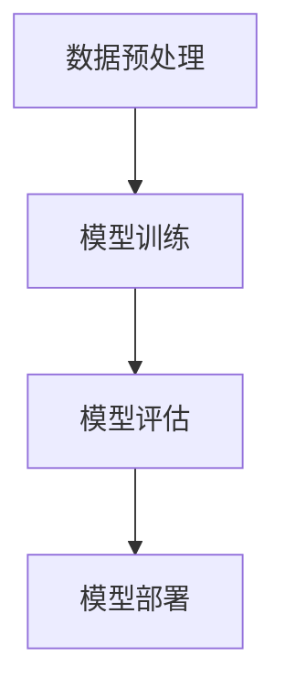

# 【大模型应用开发 动手做AI Agent】计划与执行

## 1.背景介绍

在人工智能领域，AI Agent（智能代理）已经成为一个热门话题。随着大模型（如GPT-3、BERT等）的出现，AI Agent的能力得到了极大的提升。大模型不仅能够处理自然语言，还能进行复杂的推理和决策。这使得它们在各种应用场景中具有巨大的潜力，如自动客服、智能助手、内容生成等。

## 2.核心概念与联系

### 2.1 大模型

大模型是指具有大量参数和复杂结构的深度学习模型。它们通常通过大规模数据训练，能够捕捉到数据中的复杂模式和关系。常见的大模型包括GPT-3、BERT、T5等。

### 2.2 AI Agent

AI Agent是一种能够自主感知环境、做出决策并执行动作的智能系统。它通常由感知模块、决策模块和执行模块组成。大模型可以作为AI Agent的核心组件，提供强大的感知和决策能力。

### 2.3 大模型与AI Agent的联系

大模型为AI Agent提供了强大的感知和决策能力，使得AI Agent能够在复杂环境中表现出色。通过结合大模型和AI Agent，我们可以开发出具有高度智能和自主性的系统。

## 3.核心算法原理具体操作步骤

### 3.1 数据预处理

数据预处理是大模型训练的第一步。它包括数据清洗、数据标注和数据增强等步骤。数据预处理的质量直接影响模型的性能。

### 3.2 模型训练

模型训练是大模型开发的核心步骤。它包括模型架构设计、损失函数选择和优化算法选择等。常用的优化算法包括SGD、Adam等。

### 3.3 模型评估

模型评估是验证模型性能的重要步骤。它包括模型的准确性、精确率、召回率和F1值等指标的计算。通过模型评估，我们可以了解模型的优缺点，并进行相应的改进。

### 3.4 模型部署

模型部署是将训练好的模型应用到实际场景中的步骤。它包括模型的导出、部署环境的搭建和API的开发等。通过模型部署，我们可以将大模型的能力转化为实际应用。



## 4.数学模型和公式详细讲解举例说明

### 4.1 损失函数

损失函数是模型训练的核心。常用的损失函数包括交叉熵损失、均方误差等。交叉熵损失函数的公式为：

$$
L = -\sum_{i=1}^{N} y_i \log(\hat{y}_i)
$$

其中，$y_i$ 是真实标签，$\hat{y}_i$ 是预测概率。

### 4.2 优化算法

优化算法用于最小化损失函数。常用的优化算法包括梯度下降（SGD）和Adam。梯度下降的更新公式为：

$$
\theta = \theta - \eta \nabla_\theta L
$$

其中，$\theta$ 是模型参数，$\eta$ 是学习率，$L$ 是损失函数。

### 4.3 模型评估指标

模型评估指标用于衡量模型的性能。常用的评估指标包括准确率、精确率、召回率和F1值。准确率的公式为：

$$
Accuracy = \frac{TP + TN}{TP + TN + FP + FN}
$$

其中，$TP$ 是真正例，$TN$ 是真负例，$FP$ 是假正例，$FN$ 是假负例。

## 5.项目实践：代码实例和详细解释说明

### 5.1 数据预处理

```python
import pandas as pd
from sklearn.model_selection import train_test_split

# 读取数据
data = pd.read_csv('data.csv')

# 数据清洗
data = data.dropna()

# 数据分割
train_data, test_data = train_test_split(data, test_size=0.2, random_state=42)
```

### 5.2 模型训练

```python
import torch
import torch.nn as nn
import torch.optim as optim

# 定义模型
class SimpleModel(nn.Module):
    def __init__(self):
        super(SimpleModel, self).__init__()
        self.fc = nn.Linear(10, 1)

    def forward(self, x):
        return self.fc(x)

model = SimpleModel()

# 定义损失函数和优化器
criterion = nn.BCEWithLogitsLoss()
optimizer = optim.Adam(model.parameters(), lr=0.001)

# 训练模型
for epoch in range(100):
    optimizer.zero_grad()
    outputs = model(train_data)
    loss = criterion(outputs, train_labels)
    loss.backward()
    optimizer.step()
```

### 5.3 模型评估

```python
from sklearn.metrics import accuracy_score

# 预测
predictions = model(test_data)
predictions = torch.round(torch.sigmoid(predictions))

# 计算准确率
accuracy = accuracy_score(test_labels, predictions)
print(f'Accuracy: {accuracy}')
```

### 5.4 模型部署

```python
import flask
from flask import request, jsonify

app = flask.Flask(__name__)

@app.route('/predict', methods=['POST'])
def predict():
    data = request.get_json()
    input_data = torch.tensor(data['input'])
    prediction = model(input_data)
    return jsonify({'prediction': prediction.item()})

if __name__ == '__main__':
    app.run(debug=True)
```

## 6.实际应用场景

### 6.1 自动客服

大模型可以用于开发自动客服系统，提供智能化的客户服务。通过自然语言处理技术，自动客服系统可以理解客户的问题并给出相应的回答。

### 6.2 智能助手

智能助手是大模型的另一个重要应用。智能助手可以帮助用户完成各种任务，如日程管理、信息查询等。通过大模型的强大能力，智能助手可以提供更加智能和个性化的服务。

### 6.3 内容生成

大模型还可以用于内容生成，如文章写作、代码生成等。通过大模型的生成能力，我们可以快速生成高质量的内容，提升工作效率。

## 7.工具和资源推荐

### 7.1 开发工具

- **PyTorch**：一个流行的深度学习框架，支持动态计算图和自动微分。
- **TensorFlow**：另一个流行的深度学习框架，支持大规模分布式训练和部署。
- **Hugging Face Transformers**：一个提供预训练大模型的库，支持多种自然语言处理任务。

### 7.2 数据集

- **IMDB**：一个电影评论数据集，常用于情感分析任务。
- **MNIST**：一个手写数字数据集，常用于图像分类任务。
- **COCO**：一个大规模图像数据集，常用于目标检测和图像分割任务。

### 7.3 学习资源

- **《深度学习》**：一本经典的深度学习教材，详细介绍了深度学习的基本概念和技术。
- **Coursera**：一个提供在线课程的平台，包含大量的人工智能和深度学习课程。
- **Kaggle**：一个数据科学竞赛平台，提供丰富的数据集和竞赛机会。

## 8.总结：未来发展趋势与挑战

### 8.1 未来发展趋势

随着大模型和AI Agent技术的不断发展，未来的智能系统将更加智能和自主。大模型的能力将进一步提升，AI Agent的应用场景将更加广泛。我们可以期待在医疗、金融、教育等领域看到更多的智能应用。

### 8.2 挑战

尽管大模型和AI Agent具有巨大的潜力，但它们也面临一些挑战。首先，训练大模型需要大量的计算资源和数据，这对许多企业来说是一个巨大的挑战。其次，大模型的解释性和透明性问题仍然需要解决。最后，如何确保大模型和AI Agent的安全性和伦理性也是一个重要的问题。

## 9.附录：常见问题与解答

### 9.1 大模型的训练需要多长时间？

大模型的训练时间取决于模型的规模、数据量和计算资源。一般来说，训练一个大模型可能需要几天到几周的时间。

### 9.2 如何选择合适的优化算法？

选择优化算法时需要考虑模型的特点和任务的需求。对于大多数任务，Adam优化器是一个不错的选择，因为它具有较好的收敛速度和稳定性。

### 9.3 如何提高模型的性能？

提高模型性能的方法包括数据增强、模型架构优化和超参数调优等。通过不断实验和调整，我们可以逐步提升模型的性能。

### 9.4 大模型的应用有哪些风险？

大模型的应用可能面临一些风险，如数据隐私泄露、模型偏见和安全漏洞等。我们需要采取相应的措施来降低这些风险，确保大模型的安全和可靠性。

---

作者：禅与计算机程序设计艺术 / Zen and the Art of Computer Programming