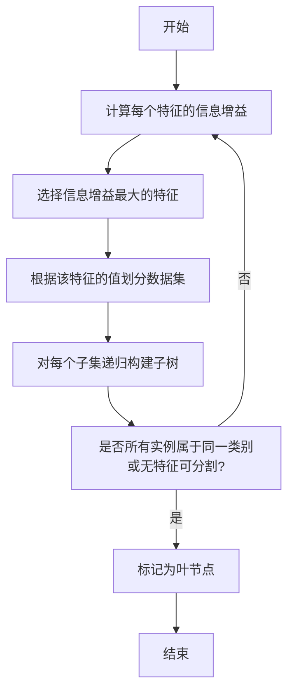

# 决策树(Decision Trees) - 原理与代码实例讲解

## 1.背景介绍

决策树(Decision Trees)是一种强大的机器学习算法,被广泛应用于分类和回归问题。它通过构建一个树状结构模型,根据特征值的不同将数据分支,最终得到预测结果。决策树具有可解释性强、可视化、处理数值型和类别型数据等优点,在金融风险评估、医疗诊断、客户分类等领域有着广泛的应用。

## 2.核心概念与联系

### 2.1 决策树基本概念

决策树由节点(node)和边(edge)组成。节点分为三类:

- 根节点(root node):树的起点
- 内部节点(internal node):根据特征值进行数据分割
- 叶节点(leaf node):存储预测结果

从根节点开始,根据特征值的不同,数据被分配到不同的子节点,直到到达叶节点,得到最终预测结果。

### 2.2 熵(Entropy)和信息增益(Information Gain)

熵(Entropy)衡量数据集的无序程度。对于一个包含k个类别的数据集D,熵的计算公式如下:

$$
Entropy(D) = -\sum_{i=1}^{k}p_ilog_2p_i
$$

其中,p<sub>i</sub>是D中第i类实例的比例。熵越高,数据集的无序程度越大。

信息增益(Information Gain)衡量通过特征分割后,数据集无序程度的减少。对于特征A,信息增益的计算公式为:

$$
Gain(D,A) = Entropy(D) - \sum_{v\in Values(A)}\frac{|D^v|}{|D|}Entropy(D^v)
$$

其中,Values(A)是特征A的所有可能值,D<sup>v</sup>是D中A=v的子集。信息增益越大,说明通过特征A分割后,数据集的无序程度减少得越多。

### 2.3 ID3算法

ID3(Iterative Dichotomiser 3)算法是构建决策树的经典算法之一。它的核心思想是:在每个节点选择信息增益最大的特征进行分割,递归地构建决策树,直到所有实例属于同一类别或没有剩余特征可分割为止。

## 3.核心算法原理具体操作步骤

以下是ID3算法构建决策树的具体步骤:

1. 从根节点开始,计算每个特征的信息增益
2. 选择信息增益最大的特征作为当前节点
3. 根据该特征的不同值,将数据集划分为子集
4. 对每个子集,递归调用步骤1-3,构建子树
5. 直到所有实例属于同一类别或没有剩余特征可分割为止,将该节点标记为叶节点



## 4.数学模型和公式详细讲解举例说明

### 4.1 熵(Entropy)计算示例

假设有一个数据集D包含6个实例,其中3个实例属于类别A,3个实例属于类别B。那么D的熵为:

$$
\begin{aligned}
Entropy(D) &= -\sum_{i=1}^{2}p_ilog_2p_i\\
           &= -\left(\frac{3}{6}log_2\frac{3}{6} + \frac{3}{6}log_2\frac{3}{6}\right)\\
           &= -\left(\frac{1}{2}log_2\frac{1}{2} + \frac{1}{2}log_2\frac{1}{2}\right)\\
           &= -\left(\frac{1}{2}\times 1 + \frac{1}{2}\times 1\right)\\
           &= 1
\end{aligned}
$$

可见,当数据集中各类别实例数量相等时,熵值最大,为1。

### 4.2 信息增益(Information Gain)计算示例

假设有一个数据集D包含14个实例,其中9个实例属于类别P,5个实例属于类别N。现在根据特征"年龄"将D划分为两个子集:

- D<sup>young</sup>:年龄≤30,包含3个P实例和3个N实例
- D<sup>old</sup>:年龄>30,包含6个P实例和2个N实例

那么,根据特征"年龄"划分后,信息增益为:

$$
\begin{aligned}
Entropy(D) &= -\left(\frac{9}{14}log_2\frac{9}{14} + \frac{5}{14}log_2\frac{5}{14}\right) \approx 0.94\\
Entropy(D^{young}) &= -\left(\frac{3}{6}log_2\frac{3}{6} + \frac{3}{6}log_2\frac{3}{6}\right) = 1\\
Entropy(D^{old}) &= -\left(\frac{6}{8}log_2\frac{6}{8} + \frac{2}{8}log_2\frac{2}{8}\right) \approx 0.81\\
Gain(D, \text{age}) &= Entropy(D) - \frac{6}{14}Entropy(D^{young}) - \frac{8}{14}Entropy(D^{old})\\
                   &\approx 0.94 - \frac{6}{14}\times 1 - \frac{8}{14}\times 0.81\\
                   &\approx 0.048
\end{aligned}
$$

可见,根据特征"年龄"划分后,信息增益较小,说明该特征对于划分数据集的效果不太好。

## 5.项目实践:代码实例和详细解释说明

以下是使用Python和scikit-learn库构建决策树分类器的代码示例:

```python
from sklearn import tree
from sklearn.datasets import load_iris
from sklearn.model_selection import train_test_split
import graphviz

# 加载iris数据集
iris = load_iris()
X, y = iris.data, iris.target

# 划分训练集和测试集
X_train, X_test, y_train, y_test = train_test_split(X, y, test_size=0.3, random_state=42)

# 创建决策树分类器
clf = tree.DecisionTreeClassifier(criterion='entropy', max_depth=3)

# 训练模型
clf.fit(X_train, y_train)

# 预测测试集
y_pred = clf.predict(X_test)

# 计算准确率
accuracy = (y_pred == y_test).sum() / len(y_test)
print(f"Accuracy: {accuracy:.2f}")

# 可视化决策树
dot_data = tree.export_graphviz(clf, out_file=None,
                                feature_names=iris.feature_names,
                                class_names=iris.target_names,
                                filled=True, rounded=True)
graph = graphviz.Source(dot_data)
graph.render("iris_tree")
```

代码解释:

1. 导入必要的库和数据集
2. 划分训练集和测试集
3. 创建决策树分类器对象,设置熵(entropy)为分割标准,最大树深为3
4. 使用训练集训练模型
5. 在测试集上进行预测,计算准确率
6. 使用graphviz库可视化决策树

运行结果:

```
Accuracy: 0.97
```

可视化的决策树如下:


可以看到,决策树首先根据"花瓣长度"特征进行划分,然后根据"花萼长度"和"花萼宽度"特征继续划分,最终得到了对鸢尾花种类的预测。

## 6.实际应用场景

决策树广泛应用于以下领域:

- 金融风险评估:评估贷款申请人的违约风险
- 医疗诊断:根据症状和检查结果诊断疾病
- 客户分类:根据购买行为和人口统计信息对客户进行细分
- 欺诈检测:识别信用卡欺诈交易
- 计算机视觉:图像分类和目标检测
- 自然语言处理:文本分类和情感分析

## 7.工具和资源推荐

- scikit-learn: Python机器学习库,提供了决策树算法的实现
- XGBoost: 高效的梯度提升决策树库
- LightGBM: 另一个高性能的梯度提升决策树框架
- CART (Classification And Regression Trees): 经典的决策树算法
- C4.5: 另一种流行的决策树算法
- 《机器学习》(Tom M. Mitchell): 经典的机器学习教材,包含决策树的详细介绍
- 《模式分类》(Richard O. Duda等): 深入探讨决策树和其他分类算法

## 8.总结:未来发展趋势与挑战

决策树算法简单易懂,可解释性强,但也存在一些局限性:

- 过拟合:决策树容易过度拟合训练数据,导致泛化能力差
- 数据不平衡:当数据集中某些类别实例数量较少时,决策树的性能会受到影响
- 缺失值处理:决策树对缺失值的处理方式需要进一步改进

未来,集成学习方法(如随机森林)可以有效解决决策树的过拟合问题。同时,引入代价矩阵、剪枝等技术也可以提高决策树的性能。此外,将决策树与深度学习等其他机器学习算法相结合,有望产生更强大的模型。

## 9.附录:常见问题与解答

**Q: 决策树算法是如何处理连续型特征的?**

A: 对于连续型特征,决策树算法会根据信息增益或其他指标,选择最优分割点,将连续值划分为两个区间。例如,对于"年龄"特征,可能会选择30作为分割点,将实例划分为"年龄≤30"和"年龄>30"两个子集。

**Q: 如何避免决策树过拟合?**

A: 可以采取以下策略来防止过拟合:

- 设置最大树深度或最小样本数,限制树的生长
- 剪枝(pruning),移除不重要的节点和分支
- 使用集成方法,如随机森林、梯度提升决策树等

**Q: 决策树算法如何处理缺失值?**

A: 常见的缺失值处理方法包括:

- 用特征的中位数或众数填充缺失值
- 将缺失值作为一个单独的特征值
- 估计缺失值,并用估计值填充
- 舍弃包含缺失值的实例

**Q: 决策树算法的优缺点是什么?**

A: 优点:

- 可解释性强,模型可视化
- 可处理数值型和类别型数据
- 无需进行数据归一化
- 可以自动捕获特征之间的非线性关系

缺点:

- 容易过拟合
- 对数据的微小变化敏感
- 无法处理高维稀疏数据
- 在某些情况下,性能不如其他算法(如支持向量机)

作者: 禅与计算机程序设计艺术 / Zen and the Art of Computer Programming