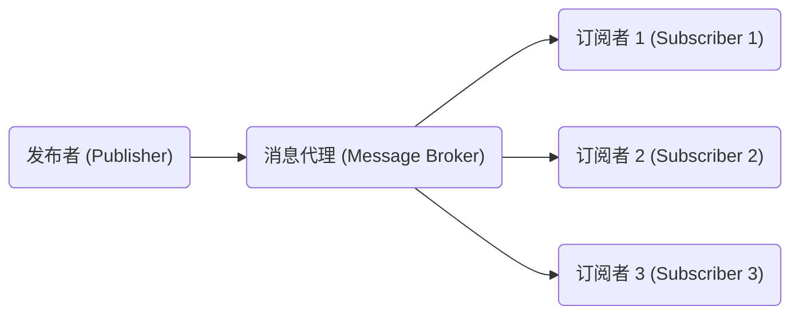

# 发布订阅 原理与代码实例讲解

## 1. 背景介绍

### 1.1 什么是发布订阅模式

发布订阅模式（Publish/Subscribe Pattern）是一种消息传递模式，它定义了一种对象间的一对多的依赖关系。发布者对象发送消息，而订阅者对象则接收这些消息。这种模式被广泛应用于各种场景，例如消息队列、事件驱动架构、物联网等。

发布订阅模式的主要优点包括:

- 松耦合: 发布者和订阅者之间是完全解耦的，它们之间不需要相互了解对方的存在。
- 可扩展性: 新的订阅者可以动态地添加到系统中，而不需要修改发布者的代码。
- 异步通信: 发布者在发送消息后不需要等待订阅者的响应，从而提高了系统的吞吐量和响应性能。

### 1.2 发布订阅模式的应用场景

发布订阅模式在以下场景中广泛应用:

- 消息队列系统: 如 RabbitMQ、Apache Kafka 等。
- 事件驱动架构: 在事件驱动架构中,发布订阅模式用于在不同组件之间传递事件。
- 物联网 (IoT): 在物联网系统中,传感器作为发布者发送数据,而应用程序作为订阅者接收数据。
- 实时数据处理: 发布订阅模式可用于实时处理大量数据流。
- 集成系统: 在企业应用程序集成中,发布订阅模式可用于在不同系统之间传递消息。

## 2. 核心概念与联系

### 2.1 发布订阅模式的核心概念

发布订阅模式涉及以下几个核心概念:

1. **发布者 (Publisher)**: 发布者是发送消息的对象。它不需要知道谁在监听,只需要将消息发送到消息代理或事件总线。

2. **订阅者 (Subscriber)**: 订阅者是接收消息的对象。它需要订阅感兴趣的主题或事件类型,以便接收相关消息。

3. **主题 (Topic)** 或 **事件 (Event)**: 主题或事件是消息的逻辑通道或类别。发布者发送消息到特定主题,而订阅者则订阅感兴趣的主题。

4. **消息代理 (Message Broker)** 或 **事件总线 (Event Bus)**: 这是一个中介,用于在发布者和订阅者之间路由消息。它负责接收来自发布者的消息,并将其传递给相关的订阅者。

### 2.2 发布订阅模式与观察者模式的关系

发布订阅模式与观察者模式有一些相似之处,但也存在一些区别:

- 观察者模式是一种面向对象设计模式,而发布订阅模式更多地关注于分布式系统的消息传递。
- 在观察者模式中,观察者直接订阅具体的主题对象。而在发布订阅模式中,订阅者订阅的是主题或事件类型,而不是具体的发布者对象。
- 观察者模式通常在同一进程或应用程序内部使用,而发布订阅模式常用于分布式系统,可跨进程或应用程序边界传递消息。

尽管有所区别,但发布订阅模式可以看作是观察者模式在分布式系统中的一种实现方式。

## 3. 核心算法原理具体操作步骤

发布订阅模式的核心算法原理可以概括为以下几个步骤:

1. **初始化**: 创建消息代理或事件总线,用于在发布者和订阅者之间路由消息。

2. **订阅**: 订阅者向消息代理注册感兴趣的主题或事件类型,以便接收相关消息。

3. **发布**: 发布者将消息发送到消息代理,并指定目标主题或事件类型。

4. **路由**: 消息代理根据消息的目标主题或事件类型,将消息路由到所有相关的订阅者。

5. **接收**: 订阅者接收来自消息代理的消息,并进行相应的处理。

以下是一个基于事件总线实现发布订阅模式的伪代码示例:

```python
# 事件总线
class EventBus:
    def __init__(self):
        self.handlers = {}

    def subscribe(self, event_type, handler):
        # 订阅事件类型
        handlers = self.handlers.setdefault(event_type, [])
        handlers.append(handler)

    def publish(self, event):
        # 发布事件
        handlers = self.handlers.get(type(event), [])
        for handler in handlers:
            handler(event)

# 发布者
class Publisher:
    def __init__(self, event_bus):
        self.event_bus = event_bus

    def publish_event(self, event):
        self.event_bus.publish(event)

# 订阅者
class Subscriber:
    def __init__(self, event_bus):
        self.event_bus = event_bus

    def handle_event(self, event):
        print(f"Received event: {event}")

    def subscribe(self, event_type):
        self.event_bus.subscribe(event_type, self.handle_event)
```

在这个示例中,我们定义了一个 `EventBus` 类作为消息代理。`subscribe` 方法用于订阅特定事件类型,而 `publish` 方法则用于发布事件。`Publisher` 类负责发布事件,而 `Subscriber` 类则订阅感兴趣的事件类型并处理接收到的事件。

## 4. 数学模型和公式详细讲解举例说明

发布订阅模式本身并不涉及复杂的数学模型或公式。然而,在一些特定的应用场景中,例如实时数据处理或机器学习,可能需要使用一些数学模型或公式来处理和分析数据。

以下是一个简单的示例,展示如何在发布订阅模式中使用数学公式进行数据处理:

假设我们有一个物联网系统,其中传感器作为发布者发送温度数据,而应用程序作为订阅者接收这些数据。我们希望计算一段时间内的平均温度。

让我们定义以下公式:

$$\overline{T} = \frac{1}{n}\sum_{i=1}^{n}T_i$$

其中 $\overline{T}$ 表示平均温度, $n$ 是温度读数的总数, $T_i$ 是第 $i$ 次温度读数。

我们可以在订阅者中实现这个公式,如下所示:

```python
class TemperatureSubscriber(Subscriber):
    def __init__(self, event_bus):
        super().__init__(event_bus)
        self.temperatures = []
        self.subscribe(TemperatureEvent)

    def handle_event(self, event):
        self.temperatures.append(event.temperature)
        if len(self.temperatures) >= 10:  # 每 10 个读数计算一次平均值
            avg_temp = sum(self.temperatures) / len(self.temperatures)
            print(f"Average temperature: {avg_temp}")
            self.temperatures = []
```

在这个示例中,`TemperatureSubscriber` 是一个订阅者,它订阅了 `TemperatureEvent` 事件类型。每当接收到新的温度读数,它会将其添加到 `temperatures` 列表中。当收集到 10 个温度读数时,它会使用上面的公式计算平均温度,并将结果打印出来。

通过将数学公式集成到订阅者中,我们可以在接收数据时即时进行处理和分析,从而实现实时数据处理。

## 5. 项目实践: 代码实例和详细解释说明

为了更好地理解发布订阅模式的实现,让我们通过一个实际的代码示例来演示如何在 Python 中使用这种模式。

在这个示例中,我们将创建一个简单的聊天室应用程序,其中用户可以发送消息,而其他用户可以接收这些消息。我们将使用 `PubSub` 库来实现发布订阅模式。

### 5.1 安装 PubSub 库

首先,我们需要安装 `PubSub` 库。您可以使用 `pip` 进行安装:

```
pip install pubsub
```

### 5.2 创建发布者和订阅者

接下来,我们将创建一个 `Publisher` 类和一个 `Subscriber` 类。`Publisher` 类将用于发送消息,而 `Subscriber` 类将用于接收消息。

```python
from pubsub import pub

class Publisher:
    def send_message(self, message):
        pub.sendMessage('chat_room', message=message)

class Subscriber:
    def __init__(self, name):
        self.name = name
        pub.subscribe(self.receive_message, 'chat_room')

    def receive_message(self, message):
        print(f"{self.name} received: {message}")
```

在这个示例中,我们使用 `pub.sendMessage` 方法来发送消息,并使用 `pub.subscribe` 方法来订阅消息。`'chat_room'` 是我们定义的主题名称。

### 5.3 运行示例

现在,让我们创建一个发布者和两个订阅者,并测试发布订阅模式的工作原理:

```python
# 创建发布者和订阅者
publisher = Publisher()
subscriber1 = Subscriber('Alice')
subscriber2 = Subscriber('Bob')

# 发布消息
publisher.send_message('Hello, everyone!')

# 输出:
# Alice received: Hello, everyone!
# Bob received: Hello, everyone!
```

在这个示例中,我们创建了一个 `Publisher` 实例和两个 `Subscriber` 实例。当发布者发送消息时,两个订阅者都能够接收到该消息。

### 5.4 Mermaid 流程图

下面是使用 Mermaid 绘制的发布订阅模式的流程图:



在这个流程图中,发布者将消息发送到消息代理。消息代理负责将消息路由到所有相关的订阅者。订阅者订阅感兴趣的主题或事件类型,并接收相应的消息。

## 6. 实际应用场景

发布订阅模式在许多实际应用场景中都有广泛的应用,包括但不限于以下几个方面:

### 6.1 消息队列系统

消息队列系统是发布订阅模式最常见的应用场景之一。在这种场景中,生产者(发布者)将消息发送到队列中,而消费者(订阅者)则从队列中接收并处理这些消息。这种模式可以实现系统之间的异步通信,提高系统的可扩展性和容错能力。常见的消息队列系统包括 RabbitMQ、Apache Kafka、Amazon SQS 等。

### 6.2 事件驱动架构

在事件驱动架构中,系统的各个组件通过发布和订阅事件来进行通信。当某个组件发生特定事件时,它会发布相应的事件,而其他感兴趣的组件则会订阅该事件并进行相应的处理。这种模式可以实现系统的松耦合,提高系统的灵活性和可维护性。

### 6.3 实时数据处理

在实时数据处理场景中,发布订阅模式可以用于实时处理大量的数据流。例如,在物联网系统中,传感器可以作为发布者发送实时数据,而数据处理应用程序则作为订阅者接收和处理这些数据。这种模式可以实现实时数据的收集、处理和分析。

### 6.4 物联网 (IoT)

物联网系统中的各种设备和传感器可以作为发布者,将数据发送到消息代理或事件总线。而应用程序或数据处理组件则可以作为订阅者,接收并处理这些数据。发布订阅模式在物联网系统中扮演着重要的角色,实现了设备与应用程序之间的通信和数据传输。

### 6.5 集成系统

在企业应用程序集成中,发布订阅模式可以用于在不同系统之间传递消息和数据。每个系统都可以作为发布者或订阅者,实现系统之间的松耦合集成。这种模式可以提高系统的可扩展性和灵活性,并简化集成过程。

## 7. 工具和资源推荐

在实现发布订阅模式时,有许多工具和资源可以帮助您更好地理解和应用这种模式。以下是一些推荐的工具和资源:

### 7.1 消息队列系统

- **RabbitMQ**: 一个流行的开源消息代理,支持多