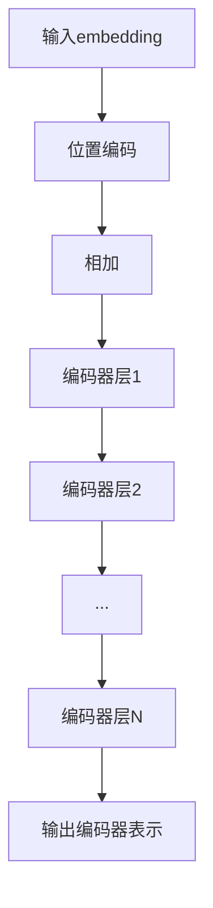
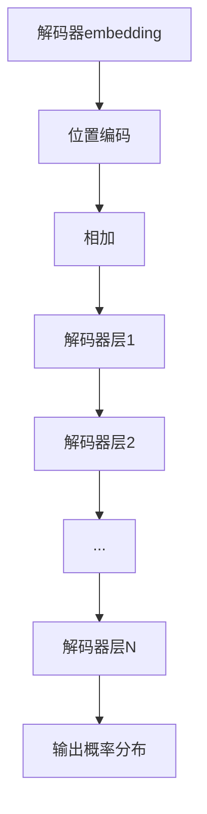

# 大规模语言模型从理论到实践：近端策略优化算法

## 1.背景介绍

### 1.1 语言模型的重要性

语言模型在自然语言处理领域扮演着关键角色。它们被广泛应用于机器翻译、语音识别、文本生成、问答系统等各种任务中。随着深度学习技术的快速发展,大规模语言模型已成为该领域的主流方向。

### 1.2 大规模语言模型的挑战

然而,训练大规模语言模型面临着巨大的计算和内存开销挑战。模型参数的数量通常高达数十亿,需要海量的文本数据进行预训练。传统的序列建模方法,如RNN和LSTM,在处理长序列时存在效率低下的问题。

### 1.3 Transformer模型

2017年,Transformer模型应运而生,它使用注意力机制替代了RNN,显著提高了并行计算能力。自注意力层能够直接捕捉输入序列中任意两个位置之间的依赖关系,避免了RNN的递归计算瓶颈。Transformer成为构建大规模语言模型的主要框架。

## 2.核心概念与联系  

### 2.1 自回归语言模型

自回归语言模型的目标是最大化给定上文的条件概率:

$$P(x_t|x_1,...,x_{t-1})$$

其中$x_t$表示当前词,$(x_1,...,x_{t-1})$表示上文序列。训练时通过最大化似然估计来学习模型参数。

### 2.2 注意力机制

注意力机制是Transformer的核心,它计算查询向量与键向量的相关性作为注意力权重,并将注意力权重与值向量加权求和,捕捉不同位置之间的长程依赖关系。

### 2.3 位置编码

由于Transformer没有递归结构,因此需要一些方式来注入序列的位置信息。位置编码就是将位置信息编码为向量,并与输入词嵌入相加,使模型能够区分不同位置。

## 3.核心算法原理具体操作步骤

### 3.1 Transformer编码器

Transformer编码器的主要流程如下:

1. 输入embedding和位置编码相加
2. 通过多层编码器层
    - 多头自注意力层
    - 前馈全连接层
    - 残差连接与层归一化
3. 输出编码器表示



### 3.2 Transformer解码器  

1. 输入解码器embedding和位置编码相加
2. 通过多层解码器层 
    - 掩码多头自注意力层
    - 多头编码器-解码器注意力层
    - 前馈全连接层
    - 残差连接与层归一化
3. 输出概率分布



### 3.3 Beam Search解码

由于语言模型是自回归的,因此在生成时需要进行序列解码。Beam Search是一种常用的近似解码算法,通过维护一个概率最高的候选集,有效地探索搜索空间。

## 4.数学模型和公式详细讲解举例说明

### 4.1 Self-Attention

给定查询$Q$、键$K$和值$V$,标量化的点积注意力定义为:

$$\text{Attention}(Q, K, V) = \text{softmax}(\frac{QK^T}{\sqrt{d_k}})V$$

其中$d_k$是缩放因子,用于防止内积过大导致的梯度不稳定问题。

多头注意力机制则将查询、键和值线性投影为$h$个头,对每个头分别计算注意力,最后将所有头的注意力结果拼接:

$$\text{MultiHead}(Q, K, V) = \text{Concat}(head_1, ..., head_h)W^O$$
$$\text{where } head_i = \text{Attention}(QW_i^Q, KW_i^K, VW_i^V)$$

这种多头注意力机制赋予了模型从不同表示子空间捕捉相关信息的能力。

### 4.2 位置编码

为了使模型能够区分不同位置,Transformer使用了正弦位置编码:

$$PE_{(pos, 2i)} = \sin(pos/10000^{2i/d_{model}})$$
$$PE_{(pos, 2i+1)} = \cos(pos/10000^{2i/d_{model}})$$

其中$pos$是位置索引,$i$是维度索引。这种位置编码能够根据相对位置的不同,为不同的词嵌入施加不同的位置信息。

### 4.3 掩码机制

在解码器的自注意力层中,为了防止当前位置的词利用了后续位置的信息,需要使用掩码机制,将来自无效位置的连接值设置为负无穷。

$$\text{Attention}(Q, K, V) = \text{softmax}(\frac{QK^T}{\sqrt{d_k}} + M)V$$

其中$M$是掩码张量,无效位置的值为负无穷,有效位置为0。

## 5.项目实践：代码实例和详细解释说明

以下是使用PyTorch实现Transformer模型的示例代码:

```python
import torch
import torch.nn as nn

class TransformerEncoder(nn.Module):
    def __init__(self, d_model, nhead, dim_feedforward, num_layers, dropout=0.1):
        super().__init__()
        encoder_layer = nn.TransformerEncoderLayer(d_model, nhead, dim_feedforward, dropout)
        self.encoder = nn.TransformerEncoder(encoder_layer, num_layers)
        self.d_model = d_model

    def forward(self, src, src_mask=None):
        src = src * math.sqrt(self.d_model)
        output = self.encoder(src, src_mask)
        return output

class TransformerDecoder(nn.Module):
    def __init__(self, d_model, nhead, dim_feedforward, num_layers, dropout=0.1):
        super().__init__()
        decoder_layer = nn.TransformerDecoderLayer(d_model, nhead, dim_feedforward, dropout)
        self.decoder = nn.TransformerDecoder(decoder_layer, num_layers)
        self.d_model = d_model

    def forward(self, tgt, memory, tgt_mask=None, memory_mask=None):
        tgt = tgt * math.sqrt(self.d_model)
        output = self.decoder(tgt, memory, tgt_mask, memory_mask)
        return output

class Transformer(nn.Module):
    def __init__(self, src_vocab_size, tgt_vocab_size, d_model=512, nhead=8, num_encoder_layers=6,
                 num_decoder_layers=6, dim_feedforward=2048, dropout=0.1):
        super().__init__()
        self.encoder = TransformerEncoder(d_model, nhead, dim_feedforward, num_encoder_layers, dropout)
        self.decoder = TransformerDecoder(d_model, nhead, dim_feedforward, num_decoder_layers, dropout)
        self.src_embed = nn.Embedding(src_vocab_size, d_model)
        self.tgt_embed = nn.Embedding(tgt_vocab_size, d_model)
        self.out = nn.Linear(d_model, tgt_vocab_size)

    def forward(self, src, tgt, src_mask=None, tgt_mask=None, memory_mask=None):
        src_emb = self.src_embed(src)
        tgt_emb = self.tgt_embed(tgt)
        memory = self.encoder(src_emb, src_mask)
        output = self.decoder(tgt_emb, memory, tgt_mask, memory_mask)
        return self.out(output)
```

上述代码实现了Transformer的编码器、解码器和完整模型。其中:

- `TransformerEncoder`实现了多层编码器,包括多头自注意力层和前馈全连接层。
- `TransformerDecoder`实现了多层解码器,包括掩码多头自注意力层、编码器-解码器注意力层和前馈全连接层。
- `Transformer`集成了编码器、解码器和词嵌入层,实现了完整的Transformer模型。

在使用时,需要为源语言和目标语言构建词汇表,并将输入序列转换为词汇索引。然后,通过`Transformer`模型的`forward`方法进行前向传播,得到目标序列的概率分布。在训练阶段,使用交叉熵损失函数优化模型参数;在推理阶段,可以使用Beam Search等解码算法生成输出序列。

## 6.实际应用场景

大规模语言模型在自然语言处理领域有着广泛的应用,包括但不限于:

1. **机器翻译**: 将一种语言的文本翻译成另一种语言,如谷歌翻译、微软翻译等。
2. **对话系统**: 构建智能对话代理,用于客户服务、个人助理等场景,如Alexa、Siri等。
3. **文本摘要**: 自动生成文本的摘要或概括,用于新闻、论文等领域。
4. **问答系统**: 根据知识库回答自然语言的问题,如医疗、法律、教育等领域的问答系统。
5. **内容生成**: 自动生成文章、小说、诗歌、代码等内容,辅助人类创作。
6. **语音识别**: 将语音转录为文本,用于语音助手、会议记录等场景。
7. **文本分类**: 根据文本内容对其进行分类,如情感分析、垃圾邮件过滤等。

总的来说,大规模语言模型能够在各种涉及自然语言的任务中发挥重要作用,提高人机交互的效率和质量。

## 7.工具和资源推荐  

以下是一些流行的大规模语言模型工具和资源:

1. **Hugging Face Transformers**: 一个集成了各种预训练语言模型的开源库,支持PyTorch和TensorFlow,提供了统一的API接口。
2. **OpenAI GPT系列模型**: GPT-2和GPT-3是OpenAI开发的大规模语言模型,在多项自然语言任务中表现出色。
3. **谷歌BERT模型**: BERT是谷歌开发的双向编码器表示,在多项自然语言任务上取得了state-of-the-art的表现。
4. **Facebook RoBERTa模型**: RoBERTa是Facebook优化版的BERT模型,通过更多的训练数据和策略提升了性能。
5. **OpenAI Codex模型**: Codex是OpenAI专门针对代码的大规模语言模型,可用于代码生成、代码理解等任务。
6. **AllenNLP**: 一个开源的NLP研究库,集成了多种最新模型和工具。
7. **spaCy**: 一个用于工业级自然语言处理的开源库,提供了快速、生产级的数据结构和算法。
8. **NVIDIA NeMo**: 一个用于构建conversational AI模型的工具包,支持语音识别、自然语言处理和语音合成等任务。

## 8.总结:未来发展趋势与挑战

大规模语言模型是自然语言处理领域的前沿方向,它们展现出了强大的语言理解和生成能力。然而,这一领域仍面临着诸多挑战和发展机遇:

1. **模型规模持续增长**: 未来模型规模可能会进一步扩大,以捕捉更多的语言知识。但这也带来了更高的计算和内存开销。
2. **提高模型效率**: 需要开发更高效的模型架构和训练算法,以降低大规模模型的计算和内存开销。
3. **多模态融合**: 将视觉、语音等其他模态信息融合到语言模型中,以构建更通用的人工智能系统。
4. **少样本学习**: 减少对大规模数据集的依赖,使模型能够从少量示例中快速学习新知识。
5. **可解释性和可控性**: 提高模型的可解释性和可控性,确保其输出符合预期,并避免产生有害或不当的内容。
6. **隐私和安全性**: 解决模型训练和应用过程中可能产生的隐私和安全风险。

总的来说,大规模语言模型将持续推动自然语言处理领域的发展,但同时也需要解决一系列技术和伦理挑战,以确保其可持续和负责任的发展。

## 9.附录:常见问题与解答

1. **什么是自注意力机制?**
    
    自注意力机制是Transformer模型的核心,它计算输入序列中任意两个位置之间的相关性,捕捉长程依赖关系。