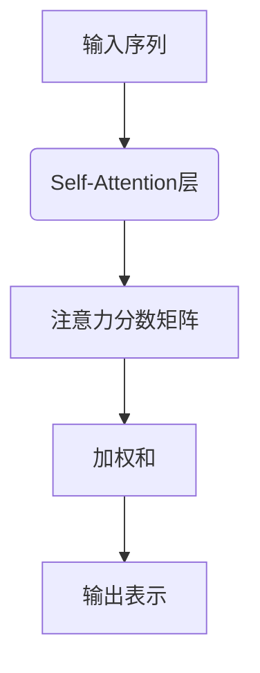
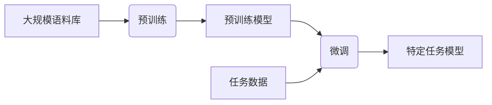

# 大语言模型原理基础与前沿 FP8与INT8

## 1. 背景介绍

### 1.1 大语言模型的崛起

近年来,大型语言模型(Large Language Models, LLMs)在自然语言处理(NLP)领域掀起了一场革命。这些模型通过在大规模语料库上进行预训练,学习了丰富的语言知识和上下文信息,从而在广泛的NLP任务中表现出色,包括机器翻译、问答系统、文本生成等。

代表性的大语言模型有 GPT(Generative Pre-trained Transformer)、BERT(Bidirectional Encoder Representations from Transformers)、XLNet、T5等,其中 GPT-3 更是凭借高达 1750 亿参数的规模,在多项基准测试中刷新纪录,展现出令人惊叹的泛化能力。

### 1.2 FP8与INT8量化

然而,这些大型模型通常需要大量计算资源和存储空间,给实际部署带来了巨大挑战。为了解决这一问题,模型量化(Model Quantization)应运而生,旨在将原本使用 32 位浮点数(FP32)表示的模型参数压缩到更低比特位(如 8 位整数 INT8 或 8 位浮点数 FP8),从而减小模型尺寸,提高计算效率。

本文将深入探讨大语言模型的原理基础,并重点介绍 FP8 与 INT8 量化技术在大语言模型压缩和加速方面的最新进展。

## 2. 核心概念与联系

### 2.1 自注意力机制(Self-Attention)

大语言模型的核心是 Transformer 架构,其中自注意力机制是关键组件之一。自注意力允许模型捕捉输入序列中任意两个位置之间的依赖关系,从而更好地建模长距离上下文信息。



### 2.2 Transformer 编码器-解码器架构

Transformer 架构由编码器(Encoder)和解码器(Decoder)两部分组成。编码器将输入序列映射为上下文表示,解码器则基于编码器的输出和输入序列生成目标序列。


### 2.3 预训练与微调(Pre-training & Fine-tuning)

大语言模型通常采用两阶段策略:首先在大规模语料库上进行无监督预训练,获取通用语言知识;然后在特定任务数据上进行有监督微调,将预训练模型迁移到下游任务。



### 2.4 量化技术概述

模型量化旨在将原始 FP32 参数压缩到低比特表示,如 INT8 或 FP8。常见的量化方法包括:

- 线性量化(Linear Quantization)
- 对数量化(Logarithmic Quantization)
- 向量量化(Vector Quantization)
- 层级量化(Hierarchical Quantization)

## 3. 核心算法原理具体操作步骤

### 3.1 线性量化(Linear Quantization)

线性量化是最简单的量化方法,将浮点数值线性映射到离散的整数值。具体步骤如下:

1. 计算模型参数的最小值 $x_{min}$ 和最大值 $x_{max}$。
2. 将参数值 $x$ 缩放到 $[0, 2^{n}-1]$ 的范围内,其中 $n$ 是目标比特位数:

$$
   q = \text{round}\left(\frac{x - x_{min}}{x_{max} - x_{min}} \times (2^{n} - 1)\right)
$$

3. 在推理时,将量化值 $q$ 反向映射回浮点数:

$$
   \hat{x} = q \times \frac{x_{max} - x_{min}}{2^{n} - 1} + x_{min}
$$

线性量化易于实现,但可能导致精度损失,尤其是对于分布不均匀的参数。

### 3.2 对数量化(Logarithmic Quantization)

对数量化通过对参数取对数,使其分布更加集中,从而提高量化精度。具体步骤如下:

1. 计算模型参数的最小值 $x_{min}$ 和最大值 $x_{max}$,确保 $x_{min} > 0$。
2. 对参数取对数:

$$
   l = \log(x)
$$

3. 将对数值 $l$ 线性量化到整数:

$$
   q = \text{round}\left(\frac{l - l_{min}}{l_{max} - l_{min}} \times (2^{n} - 1)\right)
$$

4. 在推理时,将量化值 $q$ 反向映射回原始参数:

$$
   \hat{x} = \exp\left(q \times \frac{l_{max} - l_{min}}{2^{n} - 1} + l_{min}\right)
$$

对数量化适用于分布较为分散的参数,但对于接近零的参数,精度可能会受到影响。

### 3.3 向量量化(Vector Quantization)

向量量化将参数向量直接量化到一组代码簇中,而不是逐元素量化。具体步骤如下:

1. 对模型参数进行 K-Means 聚类,得到 $N$ 个代码簇 $\{c_1, c_2, \dots, c_N\}$。
2. 对每个参数向量 $\vec{x}$,找到与之最近的代码簇 $c_i$:

$$
   i = \arg\min_{j} \|\vec{x} - c_j\|_2
$$

3. 将参数向量 $\vec{x}$ 量化为代码簇索引 $i$,使用 $\lceil\log_2 N\rceil$ 比特存储。
4. 在推理时,直接使用代码簇 $c_i$ 作为参数向量的近似值。

向量量化可以有效降低存储开销,但代价是计算复杂度较高,并且可能引入较大的近似误差。

### 3.4 层级量化(Hierarchical Quantization)

层级量化将模型分层量化,不同层使用不同的量化方法和比特位数,以平衡精度和压缩率。具体步骤如下:

1. 根据对模型精度的影响,将模型层划分为不同的重要性级别。
2. 对于重要层,使用较高比特位数(如 8 位)进行量化,以保持较高精度。
3. 对于不太重要的层,使用较低比特位数(如 4 位或 2 位)进行量化,以获得更高的压缩率。
4. 可以结合多种量化方法,如线性量化、对数量化等,为不同层选择合适的量化策略。

层级量化灵活性较高,可以根据具体需求在精度和压缩率之间进行权衡。

## 4. 数学模型和公式详细讲解举例说明

在上一节中,我们介绍了几种常见的量化算法。现在,让我们通过一个具体的例子来进一步说明线性量化的数学原理。

假设我们有一个简单的模型,只包含一个权重参数 $w$,其值为 $0.7$。我们希望将其量化为 4 位整数(INT4)。

1. 首先,我们需要确定量化范围 $[x_{min}, x_{max}]$。在这个简单的例子中,我们假设 $x_{min} = -1$,  $x_{max} = 1$。

2. 接下来,我们将参数值 $w = 0.7$ 缩放到 $[0, 2^4 - 1] = [0, 15]$ 的范围内:

$$
   q = \text{round}\left(\frac{0.7 - (-1)}{1 - (-1)} \times (15)\right) = 11
$$

3. 在推理时,我们将量化值 $q = 11$ 反向映射回浮点数:

$$
   \hat{w} = 11 \times \frac{1 - (-1)}{15} + (-1) = 0.6667
$$

我们可以看到,经过线性量化,原始参数 $w = 0.7$ 被近似为 $\hat{w} = 0.6667$,引入了一定的近似误差。

对于更复杂的模型,我们需要对每一层的参数进行独立量化,并且可能需要采用不同的量化方法和比特位数,以平衡精度和压缩率。

## 5. 项目实践:代码实例和详细解释说明

为了更好地理解量化过程,我们提供了一个基于 PyTorch 的简单示例,演示如何对一个小型前馈神经网络进行线性量化。

```python
import torch
import torch.nn as nn

# 定义一个简单的前馈神经网络
class SimpleNet(nn.Module):
    def __init__(self):
        super(SimpleNet, self).__init__()
        self.fc1 = nn.Linear(10, 5)
        self.fc2 = nn.Linear(5, 1)

    def forward(self, x):
        x = self.fc1(x)
        x = torch.relu(x)
        x = self.fc2(x)
        return x

# 创建模型实例
model = SimpleNet()

# 模拟一些输入数据
x = torch.randn(1, 10)

# 获取模型参数
params = [p for p in model.parameters()]

# 线性量化函数
def linear_quantize(x, num_bits=8):
    x_min = x.min().item()
    x_max = x.max().item()
    scale = (2 ** num_bits - 1) / (x_max - x_min)
    x_q = torch.clamp(torch.round(x * scale) - (2 ** (num_bits - 1)), -(2 ** (num_bits - 1)), 2 ** (num_bits - 1) - 1)
    x_q = x_q / scale + x_min
    return x_q

# 对模型参数进行量化
for p in params:
    p.data = linear_quantize(p.data, num_bits=8)

# 进行前向传播
y = model(x)
print(y)
```

在这个示例中,我们首先定义了一个简单的前馈神经网络 `SimpleNet`。然后,我们创建了模型实例并模拟了一些输入数据。

接下来,我们实现了一个 `linear_quantize` 函数,用于对张量进行线性量化。该函数首先计算张量的最小值和最大值,然后将张量值缩放到 $[0, 2^{num\_bits} - 1]$ 的范围内,并进行四舍五入操作。最后,将量化值反向映射回原始范围。

在量化模型参数时,我们遍历所有参数张量,并使用 `linear_quantize` 函数对它们进行量化。最后,我们进行前向传播,并打印输出结果。

请注意,这只是一个简单的示例,用于说明量化过程。在实际应用中,您可能需要考虑更复杂的量化策略,如对数量化、向量量化或层级量化,并根据具体需求进行调整。

## 6. 实际应用场景

大语言模型量化技术在多个领域都有广泛的应用前景,包括但不限于:

### 6.1 移动和嵌入式设备

由于移动和嵌入式设备通常具有有限的计算资源和存储空间,量化可以显著减小模型尺寸,从而使大型语言模型能够在这些设备上高效运行。这为语音助手、智能翻译、个性化推荐等应用打开了大门。

### 6.2 云服务和数据中心

在云服务和数据中心中,量化可以减少模型的内存占用和计算开销,从而降低运营成本,提高资源利用率。这对于大规模部署语言模型服务至关重要,如机器翻译、聊天机器人、内容生成等。

### 6.3 边缘计算和物联网

在边缘计算和物联网领域,设备通常具有严格的功耗和计算能力限制。量化可以使大语言模型在这些资源受限的环境中运行,支持智能家居、智能城市等应用场景。

### 6.4 科研和算法开发

量化技术不仅有助于模型部署,也为算法创新提供了新的途径。研究人员可以利用量化技术探索更高效的模型架构和训练方法,推动整个人工智能领域的发展。

## 7. 工具和资源推荐

在实现大语言模型量化时,可以利用以下工具和资源:

###