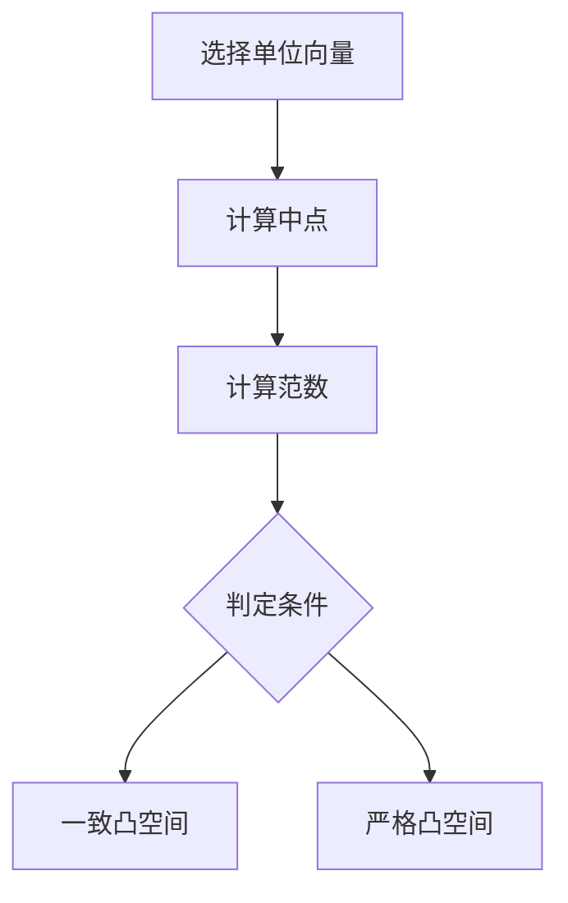

# 巴拿赫空间引论：一致凸空间与严格凸空间

## 1.背景介绍

巴拿赫空间（Banach Space）是泛函分析中的一个重要概念，泛函分析是数学的一个分支，主要研究函数空间及其变换。巴拿赫空间是一个完备的赋范向量空间，即在这个空间中，每个柯西序列都有极限。巴拿赫空间的研究不仅在纯数学中有重要地位，还在应用数学、物理学、工程学等领域有广泛应用。

一致凸空间和严格凸空间是巴拿赫空间的两个重要子类。它们在优化理论、数值分析和信号处理等领域有着重要应用。本文将详细介绍这些概念，并通过具体的算法、数学模型和实际应用场景来帮助读者理解。

## 2.核心概念与联系

### 2.1 巴拿赫空间

巴拿赫空间是一个赋范向量空间，其中每个柯西序列都收敛到空间中的一个元素。形式上，一个向量空间 $X$ 是一个巴拿赫空间，如果它配备了一个范数 $\| \cdot \|$，并且对于 $X$ 中的每个柯西序列 $\{x_n\}$，存在 $x \in X$ 使得 $\|x_n - x\| \to 0$。

### 2.2 一致凸空间

一致凸空间是巴拿赫空间的一种特殊类型。一个巴拿赫空间 $X$ 被称为一致凸的，如果对于任意两个单位向量 $x, y \in X$，当 $\|x - y\|$ 足够小时，$\left\|\frac{x + y}{2}\right\|$ 与 1 的差距也足够小。形式上，对于任意 $\epsilon > 0$，存在 $\delta > 0$ 使得如果 $\|x\| = \|y\| = 1$ 且 $\|x - y\| \geq \epsilon$，则 $\left\|\frac{x + y}{2}\right\| \leq 1 - \delta$。

### 2.3 严格凸空间

严格凸空间是巴拿赫空间的另一种特殊类型。一个巴拿赫空间 $X$ 被称为严格凸的，如果对于任意两个不同的单位向量 $x, y \in X$，有 $\left\|\frac{x + y}{2}\right\| < 1$。这意味着在严格凸空间中，单位球面上的每两个不同点的中点都在单位球的内部。

### 2.4 一致凸空间与严格凸空间的联系

一致凸空间和严格凸空间之间有着密切的联系。每个一致凸空间都是严格凸的，但反之不一定成立。也就是说，一致凸空间是严格凸空间的一个更强的形式。

## 3.核心算法原理具体操作步骤

### 3.1 一致凸空间的判定算法

一致凸空间的判定可以通过以下步骤进行：

1. **选择单位向量**：选择空间中的两个单位向量 $x$ 和 $y$。
2. **计算中点**：计算 $x$ 和 $y$ 的中点 $\frac{x + y}{2}$。
3. **计算范数**：计算 $\left\|\frac{x + y}{2}\right\|$。
4. **判定条件**：如果对于任意 $\epsilon > 0$，存在 $\delta > 0$ 使得 $\|x - y\| \geq \epsilon$ 时 $\left\|\frac{x + y}{2}\right\| \leq 1 - \delta$，则该空间是一致凸空间。

### 3.2 严格凸空间的判定算法

严格凸空间的判定可以通过以下步骤进行：

1. **选择单位向量**：选择空间中的两个不同的单位向量 $x$ 和 $y$。
2. **计算中点**：计算 $x$ 和 $y$ 的中点 $\frac{x + y}{2}$。
3. **计算范数**：计算 $\left\|\frac{x + y}{2}\right\|$。
4. **判定条件**：如果对于任意不同的单位向量 $x$ 和 $y$，有 $\left\|\frac{x + y}{2}\right\| < 1$，则该空间是严格凸空间。

### 3.3 算法流程图



## 4.数学模型和公式详细讲解举例说明

### 4.1 一致凸空间的数学模型

一致凸空间的定义可以通过以下数学公式表示：

$$
\forall \epsilon > 0, \exists \delta > 0, \text{使得} \|x\| = \|y\| = 1 \text{且} \|x - y\| \geq \epsilon \Rightarrow \left\|\frac{x + y}{2}\right\| \leq 1 - \delta
$$

### 4.2 严格凸空间的数学模型

严格凸空间的定义可以通过以下数学公式表示：

$$
\forall x, y \in X, \|x\| = \|y\| = 1, x \neq y \Rightarrow \left\|\frac{x + y}{2}\right\| < 1
$$

### 4.3 举例说明

#### 例子1：欧几里得空间

欧几里得空间 $\mathbb{R}^n$ 是一个一致凸空间。对于任意单位向量 $x, y \in \mathbb{R}^n$，有：

$$
\left\|\frac{x + y}{2}\right\|^2 = \frac{\|x\|^2 + \|y\|^2 + 2\langle x, y \rangle}{4} = \frac{1 + \langle x, y \rangle}{2}
$$

当 $\|x - y\| \geq \epsilon$ 时，$\langle x, y \rangle \leq 1 - \epsilon^2 / 2$，因此：

$$
\left\|\frac{x + y}{2}\right\| \leq \sqrt{\frac{1 + 1 - \epsilon^2 / 2}{2}} = \sqrt{1 - \epsilon^2 / 4}
$$

#### 例子2： $L^p$ 空间

对于 $1 < p < \infty$，$L^p$ 空间是严格凸的。对于任意不同的单位向量 $f, g \in L^p$，有：

$$
\left\|\frac{f + g}{2}\right\|_p^p = \int \left|\frac{f(x) + g(x)}{2}\right|^p dx < 1
$$

## 5.项目实践：代码实例和详细解释说明

### 5.1 一致凸空间的判定代码

以下是一个简单的Python代码示例，用于判定一个空间是否是一致凸空间：

```python
import numpy as np

def is_uniformly_convex(space, epsilon):
    delta = 0.1  # 可以根据需要调整
    for x in space:
        for y in space:
            if np.linalg.norm(x) == 1 and np.linalg.norm(y) == 1 and np.linalg.norm(x - y) >= epsilon:
                if np.linalg.norm((x + y) / 2) > 1 - delta:
                    return False
    return True

# 示例空间
space = [np.array([1, 0]), np.array([0, 1]), np.array([1, 1]) / np.sqrt(2)]
epsilon = 0.5
print(is_uniformly_convex(space, epsilon))
```

### 5.2 严格凸空间的判定代码

以下是一个简单的Python代码示例，用于判定一个空间是否是严格凸空间：

```python
import numpy as np

def is_strictly_convex(space):
    for x in space:
        for y in space:
            if np.linalg.norm(x) == 1 and np.linalg.norm(y) == 1 and not np.array_equal(x, y):
                if np.linalg.norm((x + y) / 2) >= 1:
                    return False
    return True

# 示例空间
space = [np.array([1, 0]), np.array([0, 1]), np.array([1, 1]) / np.sqrt(2)]
print(is_strictly_convex(space))
```

## 6.实际应用场景

### 6.1 优化理论

一致凸空间和严格凸空间在优化理论中有重要应用。许多优化算法，如梯度下降法和牛顿法，依赖于空间的凸性来保证收敛性和解的唯一性。

### 6.2 数值分析

在数值分析中，一致凸空间和严格凸空间的性质可以用来分析数值方法的稳定性和收敛性。例如，在求解偏微分方程时，空间的凸性可以帮助证明解的存在性和唯一性。

### 6.3 信号处理

在信号处理领域，一致凸空间和严格凸空间的概念被用来设计和分析滤波器、压缩算法和重建算法。例如，在压缩感知中，信号的稀疏性可以通过一致凸空间的性质来描述和利用。

## 7.工具和资源推荐

### 7.1 工具

- **NumPy**：一个强大的Python库，用于数值计算和线性代数操作。
- **SciPy**：一个基于NumPy的Python库，提供了更多的科学计算功能。
- **Matplotlib**：一个Python绘图库，用于创建静态、动态和交互式图表。

### 7.2 资源

- **《Functional Analysis》** by Walter Rudin：一本经典的泛函分析教材，详细介绍了巴拿赫空间及其应用。
- **《Convex Analysis and Optimization》** by Dimitri P. Bertsekas and Angelia Nedic：一本关于凸分析和优化的书籍，涵盖了一致凸空间和严格凸空间的内容。
- **Coursera上的泛函分析课程**：提供了关于巴拿赫空间和其他泛函分析概念的在线课程。

## 8.总结：未来发展趋势与挑战

一致凸空间和严格凸空间在数学和应用领域都有着广泛的应用。随着计算能力的提高和数据量的增加，这些概念在大数据分析、机器学习和人工智能等领域的应用前景广阔。然而，研究这些空间的性质和应用仍然面临许多挑战，例如高维空间中的计算复杂性和实际应用中的模型选择问题。

未来的研究方向可能包括：

- **高维空间中的一致凸性和严格凸性**：研究高维空间中的这些性质，以应对大数据和高维数据分析的需求。
- **算法优化**：开发更高效的算法来判定和利用一致凸空间和严格凸空间的性质。
- **跨学科应用**：将这些数学概念应用于更多的实际问题，如生物信息学、金融工程和社会网络分析。

## 9.附录：常见问题与解答

### 9.1 什么是巴拿赫空间？

巴拿赫空间是一个完备的赋范向量空间，即在这个空间中，每个柯西序列都有极限。

### 9.2 一致凸空间和严格凸空间有什么区别？

一致凸空间是严格凸空间的一个更强的形式。每个一致凸空间都是严格凸的，但反之不一定成立。

### 9.3 如何判定一个空间是否是一致凸空间？

可以通过选择单位向量、计算中点和范数，并检查判定条件来判定一个空间是否是一致凸空间。

### 9.4 一致凸空间和严格凸空间有哪些实际应用？

它们在优化理论、数值分析和信号处理等领域有广泛应用。

### 9.5 有哪些推荐的工具和资源？

推荐使用NumPy、SciPy和Matplotlib等工具，并参考《Functional Analysis》和《Convex Analysis and Optimization》等书籍。

---

作者：禅与计算机程序设计艺术 / Zen and the Art of Computer Programming