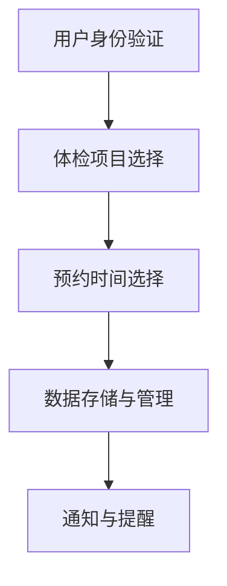

# 微信小程序健康体检预约

## 1.背景介绍

随着移动互联网的迅猛发展，微信小程序作为一种轻量级应用，已经成为了用户日常生活中不可或缺的一部分。健康体检作为人们关注健康的重要手段，如何通过微信小程序实现便捷的体检预约，成为了一个值得探讨的技术课题。本篇文章将深入探讨微信小程序健康体检预约的实现原理、核心算法、数学模型、项目实践及其实际应用场景。

## 2.核心概念与联系

### 2.1 微信小程序

微信小程序是一种无需下载安装即可使用的应用，用户通过微信即可便捷地访问。小程序具有轻量、便捷、跨平台等特点，适用于各种场景。

### 2.2 健康体检预约

健康体检预约系统旨在为用户提供便捷的体检预约服务，用户可以通过系统选择体检项目、预约时间、查看体检报告等。

### 2.3 核心联系

微信小程序与健康体检预约系统的结合，可以实现用户通过微信便捷地进行体检预约，提升用户体验，优化医疗资源配置。

## 3.核心算法原理具体操作步骤

### 3.1 用户身份验证

用户身份验证是确保系统安全性和数据准确性的关键步骤。常用的身份验证方法包括手机号验证、微信授权登录等。

### 3.2 体检项目选择

体检项目选择是用户根据自身需求选择适合的体检项目。系统需要提供详细的体检项目介绍和推荐功能。

### 3.3 预约时间选择

预约时间选择是用户根据自身时间安排选择合适的体检时间。系统需要提供实时的预约时间段查询和冲突检测功能。

### 3.4 数据存储与管理

数据存储与管理是系统的核心部分，涉及用户信息、体检项目、预约时间等数据的存储和管理。常用的数据库包括MySQL、MongoDB等。

### 3.5 通知与提醒

通知与提醒功能是确保用户按时参加体检的重要手段。系统需要提供短信、微信消息等多种通知方式。



## 4.数学模型和公式详细讲解举例说明

### 4.1 用户行为预测模型

用户行为预测模型可以帮助系统更好地了解用户需求，提供个性化推荐。常用的模型包括协同过滤、矩阵分解等。

$$
R_{ui} = \mu + b_u + b_i + q_i^Tp_u
$$

其中，$R_{ui}$ 表示用户 $u$ 对项目 $i$ 的评分，$\mu$ 表示全局平均评分，$b_u$ 和 $b_i$ 分别表示用户 $u$ 和项目 $i$ 的偏差，$q_i$ 和 $p_u$ 分别表示项目 $i$ 和用户 $u$ 的特征向量。

### 4.2 预约时间冲突检测

预约时间冲突检测是确保用户预约时间不冲突的重要步骤。可以使用区间重叠检测算法实现。

$$
\text{if } (start_1 < end_2) \text{ and } (start_2 < end_1) \text{ then overlap}
$$

其中，$start_1$ 和 $end_1$ 表示第一个预约时间段的开始和结束时间，$start_2$ 和 $end_2$ 表示第二个预约时间段的开始和结束时间。

## 5.项目实践：代码实例和详细解释说明

### 5.1 用户身份验证代码示例

```javascript
wx.login({
  success: res => {
    if (res.code) {
      // 发送 res.code 到后台换取 openId, sessionKey, unionId
      wx.request({
        url: 'https://example.com/onLogin',
        data: {
          code: res.code
        },
        success: res => {
          console.log('用户登录成功', res.data);
        }
      });
    } else {
      console.log('登录失败！' + res.errMsg);
    }
  }
});
```

### 5.2 体检项目选择代码示例

```javascript
Page({
  data: {
    items: []
  },
  onLoad: function() {
    wx.request({
      url: 'https://example.com/getItems',
      success: res => {
        this.setData({
          items: res.data
        });
      }
    });
  }
});
```

### 5.3 预约时间选择代码示例

```javascript
Page({
  data: {
    times: []
  },
  onLoad: function() {
    wx.request({
      url: 'https://example.com/getAvailableTimes',
      success: res => {
        this.setData({
          times: res.data
        });
      }
    });
  },
  selectTime: function(e) {
    const selectedTime = e.currentTarget.dataset.time;
    wx.request({
      url: 'https://example.com/bookTime',
      data: {
        time: selectedTime
      },
      success: res => {
        console.log('预约成功', res.data);
      }
    });
  }
});
```

## 6.实际应用场景

### 6.1 医院体检中心

医院体检中心可以通过微信小程序提供便捷的体检预约服务，减少排队时间，提高工作效率。

### 6.2 健康管理公司

健康管理公司可以通过微信小程序为客户提供个性化的体检预约服务，提升客户满意度。

### 6.3 企业员工体检

企业可以通过微信小程序为员工提供集中的体检预约服务，方便员工安排体检时间。

## 7.工具和资源推荐

### 7.1 开发工具

- 微信开发者工具：用于开发和调试微信小程序。
- Visual Studio Code：流行的代码编辑器，支持多种编程语言和插件。

### 7.2 后端服务

- 腾讯云：提供稳定的云服务，适合微信小程序后端部署。
- 阿里云：提供多种云服务，支持微信小程序开发。

### 7.3 数据库

- MySQL：关系型数据库，适合存储结构化数据。
- MongoDB：文档型数据库，适合存储非结构化数据。

## 8.总结：未来发展趋势与挑战

### 8.1 未来发展趋势

随着人工智能和大数据技术的发展，微信小程序健康体检预约系统将更加智能化和个性化。通过用户行为分析和预测，系统可以提供更加精准的体检项目推荐和预约时间安排。

### 8.2 挑战

- 数据安全与隐私保护：如何确保用户数据的安全性和隐私性是一个重要的挑战。
- 系统性能与稳定性：如何在高并发情况下保证系统的性能和稳定性是另一个重要的挑战。

## 9.附录：常见问题与解答

### 9.1 如何确保用户数据的安全性？

可以通过数据加密、访问控制等技术手段确保用户数据的安全性。同时，遵循相关法律法规，保护用户隐私。

### 9.2 如何处理预约时间冲突？

可以通过预约时间冲突检测算法，实时检测并提示用户预约时间冲突，确保用户选择的时间段不冲突。

### 9.3 如何提升系统性能？

可以通过优化数据库查询、使用缓存技术、分布式架构等手段提升系统性能。

---

作者：禅与计算机程序设计艺术 / Zen and the Art of Computer Programming