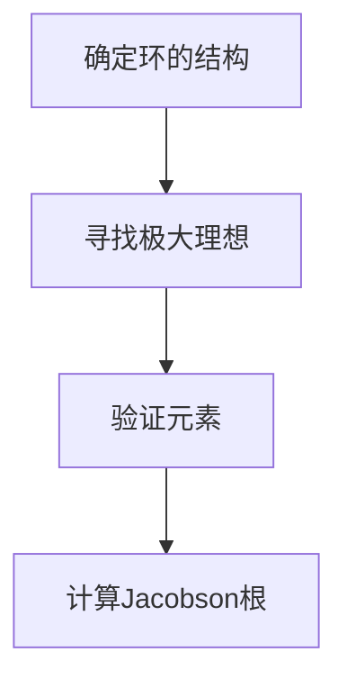

# 环与代数：Jacobson根的内刻画

## 1.背景介绍

在代数学中，环与代数是两个重要的研究领域。环理论研究的是环的结构及其性质，而代数则是研究代数结构及其运算的学科。Jacobson根（Jacobson Radical）是环理论中的一个重要概念，它在理解环的结构和性质方面起着关键作用。本文将深入探讨Jacobson根的内刻画，帮助读者更好地理解这一概念及其应用。

## 2.核心概念与联系

### 2.1 环的定义

环是一个集合 $R$，配备了两个二元运算：加法和乘法。加法使得 $R$ 成为一个交换群，而乘法则是结合的。形式化地，环满足以下性质：

1. $(R, +)$ 是一个交换群。
2. 乘法是结合的：对于所有 $a, b, c \in R$，有 $(a \cdot b) \cdot c = a \cdot (b \cdot c)$。
3. 乘法对加法分配：对于所有 $a, b, c \in R$，有 $a \cdot (b + c) = a \cdot b + a \cdot c$ 和 $(a + b) \cdot c = a \cdot c + b \cdot c$。

### 2.2 Jacobson根的定义

Jacobson根（记作 $J(R)$）是环 $R$ 的一个理想，定义为所有使得 $1 - ra$ 可逆的 $a \in R$ 的集合。形式化地，

$$
J(R) = \{ a \in R \mid 1 - ra \text{ 对所有 } r \in R \text{ 可逆} \}
$$

### 2.3 Jacobson根的性质

Jacobson根具有以下重要性质：

1. $J(R)$ 是 $R$ 的一个理想。
2. 如果 $R$ 是交换环，则 $J(R)$ 是 $R$ 的所有极大理想的交。
3. $J(R/J(R)) = 0$，即 $R$ 的 Jacobson根模去 Jacobson根后得到的环的 Jacobson根是零。

## 3.核心算法原理具体操作步骤

### 3.1 计算Jacobson根的步骤

计算一个环的Jacobson根通常涉及以下步骤：

1. **确定环的结构**：了解环的基本性质，如是否交换、是否有单位元等。
2. **寻找极大理想**：在交换环的情况下，Jacobson根是所有极大理想的交。
3. **验证元素**：验证某个元素是否属于Jacobson根，检查 $1 - ra$ 是否对所有 $r \in R$ 可逆。

### 3.2 示例操作

假设我们有一个环 $R = \mathbb{Z}/6\mathbb{Z}$，我们可以通过以下步骤计算其Jacobson根：

1. **确定环的结构**：$R$ 是一个有限环，有单位元。
2. **寻找极大理想**：$R$ 的极大理想是 $\{0, 2, 4\}$ 和 $\{0, 3\}$。
3. **验证元素**：验证 $a \in R$ 是否使得 $1 - ra$ 对所有 $r \in R$ 可逆。

## 4.数学模型和公式详细讲解举例说明

### 4.1 Jacobson根的数学模型

Jacobson根可以通过以下数学模型来描述：

$$
J(R) = \bigcap_{\mathfrak{m} \in \text{Max}(R)} \mathfrak{m}
$$

其中，$\text{Max}(R)$ 表示 $R$ 的所有极大理想的集合。

### 4.2 具体例子

考虑环 $R = \mathbb{Z}/12\mathbb{Z}$，我们可以通过以下步骤计算其Jacobson根：

1. **确定极大理想**：$R$ 的极大理想是 $\{0, 2, 4, 6, 8, 10\}$ 和 $\{0, 3, 6, 9\}$。
2. **计算交集**：$J(R) = \{0, 6\}$。

### 4.3 Mermaid 流程图



## 5.项目实践：代码实例和详细解释说明

### 5.1 Python代码示例

以下是一个使用Python计算环的Jacobson根的示例代码：

```python
def is_unit(element, ring):
    """检查元素是否是单位元"""
    for r in ring:
        if (element * r) % len(ring) == 1:
            return True
    return False

def jacobson_radical(ring):
    """计算环的Jacobson根"""
    radical = set()
    for a in ring:
        if all(is_unit(1 - a * r, ring) for r in ring):
            radical.add(a)
    return radical

# 示例环
ring = [0, 1, 2, 3, 4, 5]
jacobson_root = jacobson_radical(ring)
print("Jacobson根:", jacobson_root)
```

### 5.2 代码解释

1. `is_unit` 函数检查一个元素是否是单位元。
2. `jacobson_radical` 函数计算环的Jacobson根。
3. 示例环为 $\mathbb{Z}/6\mathbb{Z}$，计算其Jacobson根。

## 6.实际应用场景

### 6.1 模块理论

在模块理论中，Jacobson根用于研究模的结构和性质。特别地，Jacobson根可以帮助确定模的简单性和半单性。

### 6.2 代数几何

在代数几何中，Jacobson根用于研究代数簇的局部性质。通过分析环的Jacobson根，可以获得代数簇的局部几何信息。

### 6.3 计算机代数系统

在计算机代数系统中，Jacobson根用于简化代数运算和优化算法。通过预先计算环的Jacobson根，可以提高代数运算的效率。

## 7.工具和资源推荐

### 7.1 计算机代数系统

- **SageMath**：一个开源的计算机代数系统，支持环和代数的计算。
- **Mathematica**：一个强大的计算工具，支持符号计算和数值计算。

### 7.2 在线资源

- **arXiv**：一个提供数学和计算机科学论文的在线平台。
- **MathWorld**：一个提供数学定义和定理的在线百科全书。

## 8.总结：未来发展趋势与挑战

### 8.1 未来发展趋势

随着计算机代数系统的发展，计算环的Jacobson根将变得更加高效和自动化。未来的研究可能会集中在以下几个方面：

1. **算法优化**：开发更高效的算法来计算Jacobson根。
2. **应用扩展**：将Jacobson根的应用扩展到更多的数学和工程领域。
3. **计算机辅助证明**：利用计算机代数系统来辅助数学证明，特别是在环理论和代数几何中。

### 8.2 挑战

尽管Jacobson根在理论和应用中具有重要意义，但其计算和应用仍面临一些挑战：

1. **计算复杂度**：对于大规模环，计算Jacobson根的复杂度较高。
2. **理论难题**：一些环的Jacobson根的性质仍未完全理解，需要进一步的理论研究。
3. **实际应用**：将理论结果应用于实际问题时，可能会遇到一些实际困难。

## 9.附录：常见问题与解答

### 9.1 什么是Jacobson根？

Jacobson根是环的一个理想，包含所有使得 $1 - ra$ 对所有 $r \in R$ 可逆的元素。

### 9.2 Jacobson根有什么应用？

Jacobson根在模块理论、代数几何和计算机代数系统中有广泛的应用。

### 9.3 如何计算Jacobson根？

计算Jacobson根通常涉及确定环的结构、寻找极大理想和验证元素是否属于Jacobson根。

### 9.4 Jacobson根的性质有哪些？

Jacobson根是环的一个理想，在交换环中是所有极大理想的交，且 $J(R/J(R)) = 0$。

### 9.5 有哪些工具可以帮助计算Jacobson根？

SageMath和Mathematica是两个常用的计算机代数系统，可以帮助计算Jacobson根。

---

作者：禅与计算机程序设计艺术 / Zen and the Art of Computer Programming