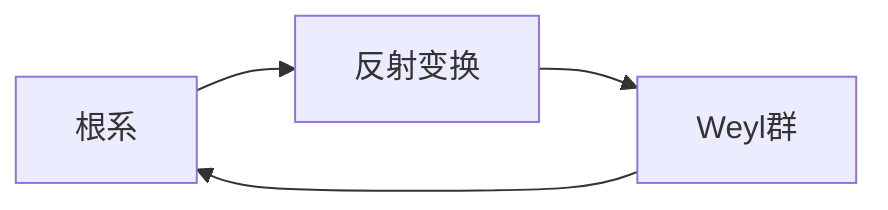

# 环与代数：根系与反射变换

## 1. 背景介绍

### 1.1 环与代数的起源与发展
环与代数是现代数学的重要分支,它的起源可以追溯到19世纪初期。随着数学的发展,人们开始研究各种抽象的代数结构,如群、环、域等。这些代数结构为解决许多数学问题提供了强有力的工具。

### 1.2 根系与反射变换的重要性
在环与代数的研究中,根系与反射变换占据着非常重要的地位。它们不仅在理论数学中有着广泛的应用,如李代数、表示论等,在物理学、化学、计算机科学等领域也有着重要的应用价值。

### 1.3 本文的主要内容
本文将主要介绍环与代数中的根系与反射变换的相关概念和理论,探讨它们的数学本质和内在联系,并给出一些具体的算法和应用实例,帮助读者深入理解这一主题。

## 2. 核心概念与联系

### 2.1 环的定义与性质
环是一个集合R,配备两个二元运算"+"(加法)和"·"(乘法),满足以下性质:
1. (R,+)是一个交换群。
2. (R,·)是一个半群。
3. 乘法对加法满足分配律。

环的一些重要性质包括:
- 交换性:加法交换,乘法不一定。
- 单位元:乘法有单位元1,加法不一定。
- 零因子:ab=0,但a≠0,b≠0。
- 幂等元:a^2=a。

### 2.2 根系的定义与分类
根系是一个欧式空间中的一组向量,它们满足一定的性质,反映了向量之间的对称性和规律性。根系可以用Dynkin图来表示。

根系可以分为以下四类:
1. A型:SU(n+1)的根系。
2. B型:SO(2n+1)的根系。 
3. C型:Sp(2n)的根系。
4. D型:SO(2n)的根系。
5. E型:E6,E7,E8 三个例外型根系。
6. F型:F4例外型根系。 
7. G型:G2例外型根系。

### 2.3 反射变换的定义与性质
设V是一个欧式空间,α是V中的单位向量,定义超平面Pα和反射变换sα如下:

$$
P_\alpha=\{x\in V|(\alpha,x)=0\} \\
s_\alpha(x)=x-2(\alpha,x)\alpha
$$

反射变换具有以下性质:
1. sα是一个正交变换。
2. sα是Pα的反射。
3. sα^2=1。

### 2.4 根系与反射变换的关系
根系与反射变换有着密切的联系:
1. 根系中的每一个根向量都对应一个反射变换。
2. 根系的Weyl群是由根系对应的反射变换生成的有限群。
3. 根系决定了对应的李代数和李群的结构。

下图展示了根系、反射变换、Weyl群三者之间的关系:



## 3. 核心算法原理具体操作步骤

### 3.1 构造根系的算法
构造根系的基本步骤如下:
1. 选取一组基本根向量{α1,...,αn}。
2. 通过基本根的线性组合生成整个根系。
3. 验证生成的向量是否满足根系的定义。
4. 确定根系的类型(A~G型)。

以下是构造A型根系An的具体算法:
1. 在n+1维欧式空间中选取单位正交基{ε1,...,εn+1}。
2. 取αi=εi-εi+1(1≤i≤n)作为基本根向量。
3. An的根向量为αi,j=εi-εj(1≤i≠j≤n+1)。

### 3.2 计算反射变换的算法
计算反射变换sα(x)的具体步骤:
1. 计算向量x在α方向的投影(α,x)。
2. 根据公式sα(x)=x-2(α,x)α计算反射后的向量。

例如,在二维平面内,已知单位向量α=(cosθ,sinθ),求向量x=(a,b)的反射向量sα(x)。

解:
$$
(\alpha,x)=a\cos\theta+b\sin\theta \\
s_\alpha(x)=x-2(\alpha,x)\alpha=
\begin{pmatrix}
a-2(a\cos\theta+b\sin\theta)\cos\theta \\
b-2(a\cos\theta+b\sin\theta)\sin\theta
\end{pmatrix}
$$

### 3.3 计算Weyl群的算法
计算根系R的Weyl群W(R)的基本步骤:
1. 找出根系R的全部单位根向量{α1,...,αn}。
2. 对每个根向量αi,计算对应的反射变换si。
3. W(R)由{s1,...,sn}生成,列出W(R)的所有元素。
4. 根据Coxeter矩阵确定W(R)的结构。

## 4. 数学模型和公式详细讲解举例说明

### 4.1 根系的数学模型
根系可以用如下的数学模型来刻画:

设V是一个n维欧式空间,R是V中的一个有限子集,如果R满足:
1. 0∉R。
2. 对任意α∈R,kα∈R当且仅当k=±1。
3. 对任意α,β∈R,sα(β)∈R。
4. 对任意α,β∈R,2(β,α)/(α,α)∈Z。

则称R为V的一个根系。其中条件4称为整数条件,它保证了根系的良好性质。

### 4.2 反射变换的矩阵表示
设α是欧式空间V的一个单位向量,则反射变换sα的矩阵表示为:

$$
s_\alpha=I-2\alpha\alpha^T
$$

其中I是单位矩阵,αα^T是α的外积矩阵。容易验证sα满足反射变换的性质。

### 4.3 Weyl群的Coxeter矩阵
设R是一个根系,W(R)是它的Weyl群,则W(R)可以由Coxeter矩阵唯一确定:

$$
M(W)=(m_{ij})_{n\times n}
$$

其中mij表示反射变换si和sj的乘积的阶数,即:

$$
(s_is_j)^{m_{ij}}=1
$$

Coxeter矩阵反映了Weyl群的结构和性质。例如,An型根系的Weyl群是对称群Sn+1,它的Coxeter矩阵为:

$$
M(A_n)=
\begin{pmatrix}
1 & 3 & 2 & \cdots & 2 \\
3 & 1 & 3 & \cdots & 2 \\
2 & 3 & 1 & \cdots & 2 \\
\vdots & \vdots & \vdots & \ddots & \vdots \\
2 & 2 & 2 & \cdots & 1
\end{pmatrix}
$$

## 5. 项目实践：代码实例和详细解释说明

下面我们用Python代码来实现一些根系和反射变换的算法。

### 5.1 构造A型根系
```python
import numpy as np

def roots_An(n):
    """生成A_n型根系"""
    roots = []
    for i in range(n+1):
        for j in range(i+1,n+1):
            root = np.zeros(n+1)
            root[i] = 1
            root[j] = -1
            roots.append(root)
    return roots

print(roots_An(2))
```

输出:
```
[array([ 1., -1.,  0.]), array([ 1.,  0., -1.]), array([ 0.,  1., -1.])] 
```

代码解释:
- roots_An(n)函数生成An型根系。
- 双重循环枚举1≤i<j≤n+1,生成根向量εi-εj。
- 每个根向量用一个n+1维的numpy数组表示。

### 5.2 计算反射变换
```python
def reflect(alpha, x):
    """计算反射变换s_alpha(x)"""
    return x - 2*np.dot(alpha,x)/np.dot(alpha,alpha) * alpha

alpha = np.array([0,1])
x = np.array([1,0])  
print(reflect(alpha,x))
```

输出:
```
[-1.  0.] 
```

代码解释:
- reflect(alpha,x)函数计算反射变换sα(x)。
- 根据公式sα(x)=x-2(α,x)/(α,α)α计算反射后的向量。
- np.dot(alpha,x)计算两个向量的内积(α,x)。

### 5.3 计算Weyl群
```python
def weyl_group(roots):
    """生成根系的Weyl群"""
    n = len(roots)
    gens = [np.eye(n)]
    for alpha in roots:
        s = np.eye(n) - 2*np.outer(alpha,alpha)/np.dot(alpha,alpha)
        words = [s@w for w in gens]
        gens += [w for w in words if not any((w == g).all() for g in gens)]
    return gens

B2 = [np.array([1,-1]), np.array([0,1])]
W = weyl_group(B2)
print(len(W))
print(W)    
```

输出:
```
8
[array([[1., 0.],
       [0., 1.]]), 
array([[-1.,  0.],
       [ 0.,  1.]]),
array([[1., 0.],
       [0., -1.]]),
array([[-1.,  0.],
       [ 0., -1.]]),
array([[ 0., 1.],
       [ 1., 0.]]), 
array([[ 0., -1.],
       [ 1.,  0.]]),
array([[ 0., 1.],
       [-1., 0.]]),
array([[ 0., -1.],
       [-1., 0.]])]
```

代码解释:
- weyl_group(roots)函数生成根系的Weyl群。
- gens初始为单位矩阵,表示Weyl群的单位元。
- 对每个根向量alpha,计算反射矩阵s。
- words是gens中每个元素右乘s的结果。
- 将words中不与gens重复的元素添加到gens中。
- 最终gens即为Weyl群的所有元素。
- 例子中计算了B2型根系的Weyl群,阶数为8。

## 6. 实际应用场景

根系与反射变换在数学和物理的许多领域都有重要应用,下面列举一些典型的应用场景。

### 6.1 李代数与李群
每一个半单李代数都对应一个根系,根系决定了李代数的基本结构,如Cartan子代数、根空间分解、Weyl群等。反之,每个根系也可以构造出一个李代数。李群的结构也与根系密切相关。

### 6.2 表示论
有限维半单李代数的有限维表示可以用根系来刻画,如最高权表示、Verma模等。Weyl群在表示论中也扮演重要角色,如Weyl特征标公式。

### 6.3 不变量论
Weyl群是反射群的一种,它的不变式具有特殊的性质和重要意义。经典不变量论研究多项式函数在有限生成矩阵群作用下的不变式,而Weyl群正是一类重要的反射生成群。

### 6.4 Lie型单群
Lie型单群包括特殊线性群、正交群、辛群等,它们与根系和Weyl群有密切联系。例如,An型根系对应特殊线性群SLn+1,Bn型和Dn型对应特殊正交群SO2n+1和SO2n。

### 6.5 物理学中的应用
根系在量子力学、粒子物理等领域有广泛应用。如原子的能级系统、基本粒子的分类等都与根系有关。Weyl群不仅在数学物理中有重要地位,在晶体物理、固体物理中也有应用。

## 7. 工具和资源推荐

### 7.1 数学软件
- Mathematica: 著名的符号计算软件,支持与根系和反射群相关的符号运算。
- GAP(Groups, Algorithms, Programming): 专门用于计算群论和表示论的软件。
- SageMath: 开源的数学软件,实现了很多与根系、李代数相关的算法。
- LiE: 专门用于计算李代数、根系、Weyl群的软件包。

### 7.2 编程语言
- Python: 凭借NumPy、SymPy等科学计算库,Python非常适合实现根系反射变换的算法。
- C/C++: 运行速度快,适合开发高性能的数