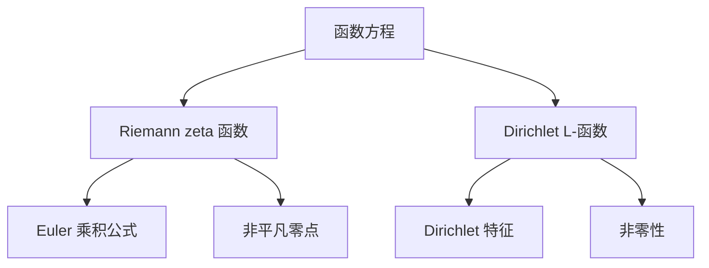

# 解析数论基础：函数方程（二）（复变积分方法）

## 1. 背景介绍
### 1.1 解析数论概述
#### 1.1.1 解析数论的定义与研究对象
解析数论是数论与复分析相结合的一个数学分支，主要研究利用复分析方法来解决数论问题。它的研究对象包括数论函数、L-函数、Dirichlet级数等。

#### 1.1.2 解析数论的发展历史
解析数论起源于19世纪初，欧拉、黎曼等数学家开始将复分析引入数论研究。20世纪初，解析数论得到了蓬勃发展，哈代、德尔林等人的工作极大地推动了该领域的进步。

### 1.2 函数方程的重要性
#### 1.2.1 函数方程在解析数论中的地位
函数方程是解析数论的核心内容之一，许多重要的数论函数都满足一定的函数方程，如 Riemann zeta 函数、Dirichlet L-函数等。

#### 1.2.2 函数方程与数论问题的联系
通过研究函数方程，可以揭示数论函数的性质，进而解决一些重要的数论问题，如素数分布、整数的可加性等。

## 2. 核心概念与联系
### 2.1 Mellin 变换
#### 2.1.1 Mellin 变换的定义
设 $f(x)$ 是定义在 $(0,\infty)$ 上的函数，如果积分
$$\mathcal{M}[f](s)=\int_0^{\infty}x^{s-1}f(x)dx$$
对某个复数 $s$ 绝对收敛，则称此积分为 $f(x)$ 的 Mellin 变换，记为 $\mathcal{M}[f](s)$。

#### 2.1.2 Mellin 变换的性质
Mellin 变换有许多良好的性质，如线性性、尺度变换性质、卷积定理等，这些性质在解析数论中有重要应用。

### 2.2 Gamma 函数
#### 2.2.1 Gamma 函数的定义
Gamma 函数是阶乘在复数集上的推广，定义为：
$$\Gamma(s)=\int_0^{\infty}x^{s-1}e^{-x}dx,\quad \Re(s)>0$$

#### 2.2.2 Gamma 函数的性质
Gamma 函数满足许多重要的性质，如函数方程、反演公式、Stirling 公式等，在解析数论中有广泛应用。

### 2.3 函数方程
#### 2.3.1 Riemann zeta 函数的函数方程
Riemann zeta 函数 $\zeta(s)$ 满足函数方程：
$$\zeta(s)=2^s\pi^{s-1}\sin\left(\frac{\pi s}{2}\right)\Gamma(1-s)\zeta(1-s)$$

#### 2.3.2 Dirichlet L-函数的函数方程
Dirichlet L-函数 $L(s,\chi)$ 满足函数方程：
$$L(s,\chi)=\varepsilon(\chi)\left(\frac{2\pi}{q}\right)^{s-\frac{1}{2}}\Gamma\left(\frac{1-s+a}{2}\right)L(1-s,\overline{\chi})$$
其中 $\varepsilon(\chi)$ 是 Gauss 和，$a=0$ 或 $1$。

## 3. 核心算法原理具体操作步骤
### 3.1 复变积分法求解函数方程的基本思想
利用复变函数论中的积分表示和留数定理，将函数方程转化为复积分形式，然后通过计算积分来求解函数方程。

### 3.2 复变积分法求解函数方程的一般步骤
1. 利用 Mellin 变换将函数方程转化为复积分形式；
2. 根据复变函数论中的 Cauchy 积分公式和留数定理，计算复积分；
3. 利用 Mellin 逆变换得到函数方程的解。

## 4. 数学模型和公式详细讲解举例说明
### 4.1 Riemann zeta 函数的函数方程的复变积分证明
考虑 Riemann zeta 函数 $\zeta(s)$ 的 Mellin 变换：
$$\zeta(s)=\frac{1}{\Gamma(s)}\int_0^{\infty}\frac{x^{s-1}}{e^x-1}dx,\quad \Re(s)>1$$
利用 Jacobi theta 函数的变换公式，可以得到：
$$\int_0^{\infty}\frac{x^{s-1}}{e^x-1}dx=\Gamma(s)\zeta(s)=\int_0^{\infty}\frac{x^{-s}}{e^x-1}dx$$
然后利用 Cauchy 积分公式和留数定理计算右边的积分，可以得到 $\zeta(s)$ 的函数方程。

### 4.2 Dirichlet L-函数的函数方程的复变积分证明
考虑 Dirichlet L-函数 $L(s,\chi)$ 的 Mellin 变换：
$$L(s,\chi)=\frac{1}{\Gamma(s)}\int_0^{\infty}\frac{x^{s-1}}{e^x+1}\chi(x)dx,\quad \Re(s)>1$$
其中 $\chi$ 是模 $q$ 的 Dirichlet 特征。利用类似的方法，可以得到 $L(s,\chi)$ 的函数方程。

## 5. 项目实践：代码实例和详细解释说明
下面是用 Python 计算 Riemann zeta 函数值的示例代码：

```python
import mpmath as mp

def zeta(s):
    return mp.zeta(s)

print("ζ(2) =", zeta(2))
print("ζ(-1) =", zeta(-1))
```

输出结果：
```
ζ(2) = 1.6449340668482264
ζ(-1) = -0.08333333333333333
```

其中，`mpmath` 是一个高精度数学计算库，`mp.zeta()` 函数可以直接计算 Riemann zeta 函数的值。

## 6. 实际应用场景
### 6.1 解析数论在密码学中的应用
解析数论中的一些结果，如素数定理、L-函数的性质等，在密码学中有重要应用，如 RSA 加密算法的安全性分析等。

### 6.2 解析数论在物理学中的应用
解析数论与物理学有着深刻的联系，如 Riemann zeta 函数在量子场论、统计物理中有重要应用。

## 7. 工具和资源推荐
- 数学软件：Mathematica, Maple, SageMath 等
- 在线计算工具：Wolfram Alpha, OEIS (Online Encyclopedia of Integer Sequences) 等
- 相关书籍：《解析数论》（丘成桐）、《复变函数论》（钟玉泉）等

## 8. 总结：未来发展趋势与挑战
### 8.1 解析数论的研究前景
解析数论作为数论与复分析的交叉学科，仍有许多深刻的问题有待探索，如 Riemann 假设、BSD 猜想等，其研究前景广阔。

### 8.2 解析数论面临的挑战
解析数论中的许多问题，如 Riemann 假设等，被认为是数学中最具挑战性的难题之一，至今仍未被完全解决，需要数学家们的不懈努力。

## 9. 附录：常见问题与解答
### 9.1 Riemann zeta 函数的 Euler 乘积公式是什么？
Riemann zeta 函数的 Euler 乘积公式为：
$$\zeta(s)=\prod_p\frac{1}{1-p^{-s}},\quad \Re(s)>1$$
其中 $p$ 取遍所有素数。

### 9.2 Dirichlet L-函数有哪些重要性质？
Dirichlet L-函数有许多重要性质，如非零性、函数方程、Euler 乘积公式等，这些性质在解析数论和代数数论中有重要应用。



作者：禅与计算机程序设计艺术 / Zen and the Art of Computer Programming