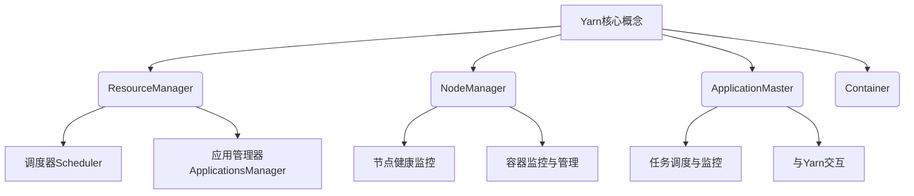

# 【AI大数据计算原理与代码实例讲解】Yarn

## 1. 背景介绍

### 1.1 问题的由来

在大数据时代,海量数据的存储和计算成为了一个巨大的挑战。传统的单机系统已经无法满足现代大数据应用的需求,因此分布式计算框架应运而生。Apache Hadoop作为开源的分布式系统基础架构,为大数据处理提供了可靠、可扩展、高效的解决方案。然而,Hadoop的MapReduce计算模型存在一些固有的缺陷,如对于迭代计算效率低下、无法高效处理内存计算等。为了解决这些问题,Yarn(Yet Another Resource Negotiator)作为Hadoop的资源管理和任务调度框架应运而生。

### 1.2 研究现状

Yarn的出现极大地提高了Hadoop的资源利用率和系统吞吐量,同时支持了多种计算框架在同一个集群上运行,如Spark、Flink、Hive等。Yarn将资源管理和任务调度/监控相分离,提供了一个统一的资源管理平台,使得各种计算框架可以共享同一份资源。目前,Yarn已经成为大数据计算领域事实上的标准,被广泛应用于各大公司和机构的大数据平台中。

### 1.3 研究意义

深入理解Yarn的设计原理和实现细节,对于构建高效、可扩展的大数据计算平台至关重要。本文将全面剖析Yarn的核心概念、架构设计、调度策略、容错机制等,并通过代码示例讲解其实现细节,旨在帮助读者全面掌握Yarn,为大数据平台的设计和优化提供理论基础和实践指导。

### 1.4 本文结构

本文将从以下几个方面全面介绍Yarn:

1. 核心概念与架构
2. 资源管理和调度策略
3. 应用部署运行流程
4. 容错与高可用机制
5. 项目实践:代码实例分析
6. 实际应用场景
7. 工具与资源推荐
8. 未来发展趋势与挑战

## 2. 核心概念与联系



Yarn的核心概念包括:

1. **ResourceManager(RM)**: 整个集群的资源管理和调度总控制器,负责资源分配和调度。
2. **NodeManager(NM)**: 运行在每个节点上,负责容器的启动、监控和资源的分配。
3. **ApplicationMaster(AM)**: 每个应用程序对应一个AM,负责应用的整个生命周期管理和任务调度。
4. **Container**: 资源抽象的单位,封装了CPU、内存等多维度资源。

这些核心组件通过合理分工和紧密协作,构建了一个高效、可扩展的分布式资源管理和任务调度框架。

## 3. 核心算法原理 & 具体操作步骤

### 3.1 算法原理概述

Yarn采用了全局资源管理和细粒度资源分配的设计理念,核心算法包括:

1. **资源管理算法**: 基于容器的资源抽象模型,将CPU、内存等资源进行统一管理和调度。
2. **公平调度算法**: 采用容量调度器(Capacity Scheduler)和公平调度器(Fair Scheduler)等策略,根据队列配置对资源进行分配,保证资源公平性。
3. **容错恢复算法**: 通过重启应用、重新同步状态等机制,实现容错和高可用。

### 3.2 算法步骤详解

#### 资源管理算法

1. **资源模型抽象**: 将CPU核数、内存大小等资源封装为一个多维度的容器(Container)对象。
2. **资源请求**: ApplicationMaster向ResourceManager申请运行任务所需的容器资源。
3. **资源分配**: ResourceManager根据集群资源状况和调度策略,将容器资源分配给ApplicationMaster。
4. **资源使用**: ApplicationMaster在分配到的容器中启动任务,使用分配的资源。
5. **资源释放**: 任务完成后,容器被关闭,相应资源释放给集群以便复用。

#### 公平调度算法

1. **队列配置**: 管理员为不同应用配置不同的队列,并设置每个队列的资源量配比。
2. **资源分配**: 调度器按照队列的资源量配比,将集群资源分配给各个队列。
3. **应用资源分配**: 队列内部采用公平调度或者其他策略,将队列资源分配给队列内的应用。
4. **资源预emption**: 如果有高优先级应用到来且资源不足,可以从低优先级应用抢占资源。

#### 容错恢复算法

1. **健康监控**: NodeManager持续监控本节点上容器的健康状态。
2. **容器失败处理**: 如果容器失败,NodeManager会释放容器资源,并通知ApplicationMaster。
3. **节点失败处理**: 如果节点失败,ResourceManager会通知相关ApplicationMaster节点失败。
4. **应用失败处理**: ApplicationMaster根据应用状态和策略,重启应用或者重新同步状态。

### 3.3 算法优缺点

**优点**:

1. 资源统一管理,提高集群资源利用率。
2. 细粒度资源分配,支持多种计算框架共存。
3. 公平调度算法,保证资源公平分配。
4. 良好的容错和高可用性。

**缺点**:

1. 中心化的ResourceManager设计可能存在单点故障风险。
2. 公平调度算法对于短任务调度可能不够高效。
3. 资源抢占可能导致低优先级应用任务被杀死,影响执行效率。

### 3.4 算法应用领域

Yarn资源管理和调度算法可广泛应用于以下领域:

1. **大数据计算平台**: 如Hadoop、Spark、Flink等大数据框架都采用了Yarn进行资源管理。
2. **云计算平台**: 云平台的虚拟资源调度可借鉴Yarn的设计思想。
3. **科学计算**: 对于需要大量计算资源的科学应用,Yarn可提供高效的资源调度。
4. **机器学习训练**: 分布式机器学习训练通常需要大量GPU等资源,Yarn可实现资源的高效利用。

## 4. 数学模型和公式 & 详细讲解 & 举例说明

### 4.1 数学模型构建

Yarn的资源分配和调度可以建模为一个约束优化问题:

**目标函数**:
$$\max \sum\limits_{i=1}^{n}f_i(r_i)$$

其中$f_i(r_i)$表示应用$i$在分配资源$r_i$时的效用函数。

**约束条件**:

$$\sum\limits_{i=1}^{n}r_i \le R$$
$$r_i \ge 0,\forall i$$

$R$表示集群的总资源量,$r_i$表示分配给应用$i$的资源量。

根据不同的调度策略,可以设置不同的效用函数$f_i(r_i)$,如:

1. **公平调度**: $f_i(r_i)=\log(r_i)$,追求资源的对数公平性。
2. **最大-最小公平调度**: $f_i(r_i)=r_i$,追求资源的绝对公平性。
3. **优先级调度**: $f_i(r_i)=p_ir_i$,根据优先级$p_i$分配资源。

### 4.2 公式推导过程

以公平调度为例,我们推导资源分配的闭式解:

令$L(r_1,r_2,...,r_n,\lambda)=\sum\limits_{i=1}^{n}\log(r_i)+\lambda(\sum\limits_{i=1}^{n}r_i-R)$为拉格朗日函数。

对每个$r_i$求偏导数并令其等于0:

$$\frac{\partial L}{\partial r_i}=\frac{1}{r_i}+\lambda=0 \Rightarrow r_i=\frac{1}{\lambda}$$

将$r_i$代入约束条件$\sum\limits_{i=1}^{n}r_i=R$可求解$\lambda$:

$$\lambda=\frac{n}{R}$$

因此,公平调度时,应用$i$分配到的资源为:

$$r_i=\frac{R}{n}$$

即将集群总资源$R$平均分配给$n$个应用。

### 4.3 案例分析与讲解

假设一个Yarn集群有100个节点,每个节点配置8个CPU核心和32GB内存。现有3个应用在运行:

1. 应用A:需求20个容器,每个容器2个CPU核心和8GB内存。
2. 应用B:需求30个容器,每个容器3个CPU核心和6GB内存。
3. 应用C:需求10个容器,每个容器4个CPU核心和16GB内存。

我们用公平调度策略对资源进行分配。

**解**:

1. 集群总资源:CPU=100*8=800核,内存=100*32GB=3.2TB
2. 应用A需求:CPU=20*2=40核,内存=20*8GB=160GB
3. 应用B需求:CPU=30*3=90核,内存=30*6GB=180GB
4. 应用C需求:CPU=10*4=40核,内存=10*16GB=160GB

根据公平调度公式,三个应用分别分配:

- A:CPU=800/3=266核,内存=3.2/3=1.07TB,满足需求
- B:CPU=800/3=266核,内存=3.2/3=1.07TB,满足需求
- C:CPU=800/3=266核,内存=3.2/3=1.07TB,满足需求

因此,三个应用的资源需求均可以得到满足。

### 4.4 常见问题解答

1. **如何防止资源被独占?**

   Yarn采用多队列隔离的方式,避免某个应用monopoly所有资源。同时可设置每个队列的资源上限。

2. **资源分配过程是并行还是串行?**

   Yarn的资源分配是并行的。多个ApplicationMaster可以同时向ResourceManager申请资源,RM并行处理各个请求。

3. **是否支持GPU等异构资源管理?**

   是的,Yarn从2.7版本开始支持GPU等异构资源统一管理和调度。

4. **如何根据应用特点选择合适的调度策略?**

   可根据应用的资源需求模式(CPU密集型、内存密集型等)、优先级、公平性要求等,选择最佳的调度策略,如公平调度、优先级调度等。

## 5. 项目实践:代码实例和详细解释说明

### 5.1 开发环境搭建

1. 下载安装Hadoop发行版(如Apache Hadoop 3.3.4)
2. 配置Hadoop环境变量
3. 伪分布式或完全分布式集群部署

```xml
<!-- hadoop环境变量配置 -->
<configuration>
  <property>
    <name>yarn.nodemanager.aux-services</name>
    <value>mapreduce_shuffle</value>
  </property>
</configuration>
```

### 5.2 源代码详细实现

以下是一个使用Yarn的MapReduce程序示例:

```java
// WordCount.java
import org.apache.hadoop.conf.Configuration;
import org.apache.hadoop.fs.Path;
import org.apache.hadoop.io.IntWritable;
import org.apache.hadoop.io.Text;
import org.apache.hadoop.mapreduce.Job;
import org.apache.hadoop.mapreduce.lib.input.FileInputFormat;
import org.apache.hadoop.mapreduce.lib.output.FileOutputFormat;

public class WordCount {
    public static void main(String[] args) throws Exception {
        Configuration conf = new Configuration();
        Job job = Job.getInstance(conf, "word count");
        job.setJarByClass(WordCount.class);
        job.setMapperClass(TokenizerMapper.class);
        job.setCombinerClass(IntSumReducer.class);
        job.setReducerClass(IntSumReducer.class);
        job.setOutputKeyClass(Text.class);
        job.setOutputValueClass(IntWritable.class);
        FileInputFormat.addInputPath(job, new Path(args[0]));
        FileOutputFormat.setOutputPath(job, new Path(args[1]));
        System.exit(job.waitForCompletion(true) ? 0 : 1);
    }
}
```

```java
// TokenizerMapper.java
import java.io.IOException;
import org.apache.hadoop.io.IntWritable;
import org.apache.hadoop.io.Text;
import org.apache.hadoop.mapreduce