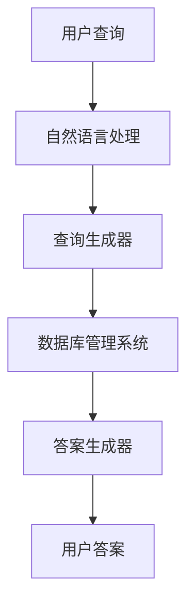

# 【LangChain编程：从入门到实践】数据库问答场景

作者：禅与计算机程序设计艺术 / Zen and the Art of Computer Programming

## 1. 背景介绍

### 1.1 问题的由来

在现代信息社会中，数据的爆炸性增长使得如何高效地从海量数据中提取有用信息成为一个重要课题。数据库问答系统（Database Question Answering System, DBQA）作为一种能够直接从数据库中获取答案的技术，受到了广泛关注。传统的数据库查询方式需要用户掌握SQL等查询语言，而DBQA系统则允许用户通过自然语言进行查询，大大降低了使用门槛。

### 1.2 研究现状

目前，DBQA系统的研究主要集中在以下几个方面：

1. **自然语言理解**：如何将用户的自然语言查询转换为数据库查询。
2. **数据库查询优化**：如何高效地执行生成的数据库查询。
3. **答案生成与展示**：如何将查询结果以用户友好的方式展示出来。

### 1.3 研究意义

DBQA系统的研究具有重要的理论和实际意义：

1. **理论意义**：推动自然语言处理、数据库技术和人工智能的交叉研究。
2. **实际意义**：提高数据查询的便捷性和效率，广泛应用于商业智能、医疗信息系统等领域。

### 1.4 本文结构

本文将详细介绍DBQA系统的核心概念、算法原理、数学模型、项目实践、实际应用场景、工具和资源推荐以及未来发展趋势与挑战。具体结构如下：

1. 背景介绍
2. 核心概念与联系
3. 核心算法原理 & 具体操作步骤
4. 数学模型和公式 & 详细讲解 & 举例说明
5. 项目实践：代码实例和详细解释说明
6. 实际应用场景
7. 工具和资源推荐
8. 总结：未来发展趋势与挑战
9. 附录：常见问题与解答

## 2. 核心概念与联系

在DBQA系统中，有几个核心概念需要理解：

1. **自然语言处理（NLP）**：用于理解和处理用户的自然语言查询。
2. **数据库管理系统（DBMS）**：用于存储和管理数据。
3. **查询生成器**：将自然语言查询转换为数据库查询。
4. **答案生成器**：将数据库查询结果转换为用户友好的答案。

这些概念之间的联系可以通过以下Mermaid流程图展示：



## 3. 核心算法原理 & 具体操作步骤

### 3.1 算法原理概述

DBQA系统的核心算法主要包括以下几个步骤：

1. **自然语言理解**：将用户的自然语言查询转换为结构化的查询意图。
2. **查询生成**：根据查询意图生成相应的数据库查询。
3. **查询执行**：在数据库中执行生成的查询。
4. **答案生成**：将查询结果转换为自然语言答案。

### 3.2 算法步骤详解

#### 3.2.1 自然语言理解

自然语言理解的主要任务是将用户的自然语言查询转换为结构化的查询意图。常用的方法包括：

1. **词法分析**：将查询分解为单词或词组。
2. **句法分析**：分析查询的句法结构。
3. **语义分析**：理解查询的语义。

#### 3.2.2 查询生成

查询生成的主要任务是将查询意图转换为数据库查询。常用的方法包括：

1. **模板匹配**：根据预定义的模板生成查询。
2. **规则推理**：根据查询意图和数据库模式生成查询。

#### 3.2.3 查询执行

查询执行的主要任务是在数据库中执行生成的查询。常用的方法包括：

1. **查询优化**：优化查询以提高执行效率。
2. **查询执行计划**：生成查询执行计划并执行。

#### 3.2.4 答案生成

答案生成的主要任务是将查询结果转换为自然语言答案。常用的方法包括：

1. **结果格式化**：将查询结果格式化为用户友好的形式。
2. **答案生成模型**：使用生成模型生成自然语言答案。

### 3.3 算法优缺点

#### 3.3.1 优点

1. **高效性**：能够快速从数据库中获取答案。
2. **易用性**：用户无需掌握SQL等查询语言。
3. **灵活性**：支持多种查询类型和复杂查询。

#### 3.3.2 缺点

1. **准确性**：自然语言理解的准确性可能影响查询结果。
2. **复杂性**：系统实现较为复杂，需要综合运用多种技术。
3. **依赖性**：依赖于数据库模式和数据质量。

### 3.4 算法应用领域

DBQA系统的应用领域非常广泛，包括但不限于：

1. **商业智能**：帮助企业快速获取业务数据。
2. **医疗信息系统**：帮助医生快速查询患者信息。
3. **教育领域**：帮助学生快速获取学习资料。

## 4. 数学模型和公式 & 详细讲解 & 举例说明

### 4.1 数学模型构建

在DBQA系统中，数学模型主要用于自然语言理解和答案生成。常用的数学模型包括：

1. **概率图模型**：用于建模查询意图和数据库查询之间的关系。
2. **神经网络模型**：用于自然语言理解和答案生成。

### 4.2 公式推导过程

#### 4.2.1 概率图模型

假设用户的自然语言查询为 $Q$，查询意图为 $I$，数据库查询为 $S$，则概率图模型可以表示为：

$$
P(S|Q) = \sum_{I} P(S|I)P(I|Q)
$$

其中，$P(S|I)$ 表示在查询意图 $I$ 下生成数据库查询 $S$ 的概率，$P(I|Q)$ 表示在自然语言查询 $Q$ 下生成查询意图 $I$ 的概率。

#### 4.2.2 神经网络模型

神经网络模型可以表示为：

$$
S = f(Q; \theta)
$$

其中，$f$ 表示神经网络模型，$\theta$ 表示模型参数。

### 4.3 案例分析与讲解

假设用户的自然语言查询为“查询2022年销售额最高的产品”，则查询意图可以表示为：

$$
I = \{ \text{查询类型: 最大值}, \text{查询对象: 销售额}, \text{时间: 2022年} \}
$$

根据查询意图生成的数据库查询可以表示为：

```sql
SELECT product_name, MAX(sales)
FROM sales_data
WHERE year = 2022
```

### 4.4 常见问题解答

#### 4.4.1 如何提高自然语言理解的准确性？

可以通过以下方法提高自然语言理解的准确性：

1. **数据增强**：增加训练数据的多样性。
2. **模型优化**：使用更先进的自然语言处理模型。
3. **上下文理解**：结合上下文信息进行理解。

#### 4.4.2 如何优化数据库查询？

可以通过以下方法优化数据库查询：

1. **索引优化**：为常用查询字段建立索引。
2. **查询重写**：重写查询以提高执行效率。
3. **缓存机制**：使用缓存机制减少数据库访问次数。

## 5. 项目实践：代码实例和详细解释说明

### 5.1 开发环境搭建

在进行DBQA系统的开发之前，需要搭建开发环境。常用的开发环境包括：

1. **编程语言**：Python
2. **数据库**：MySQL
3. **自然语言处理库**：NLTK, SpaCy
4. **深度学习框架**：TensorFlow, PyTorch

### 5.2 源代码详细实现

以下是一个简单的DBQA系统的源代码实现：

```python
import spacy
import mysql.connector
from transformers import BertTokenizer, BertForQuestionAnswering
import torch

# 加载自然语言处理模型
nlp = spacy.load("en_core_web_sm")

# 加载BERT模型
tokenizer = BertTokenizer.from_pretrained("bert-base-uncased")
model = BertForQuestionAnswering.from_pretrained("bert-base-uncased")

# 连接数据库
db = mysql.connector.connect(
    host="localhost",
    user="root",
    password="password",
    database="sales_db"
)

def process_query(query):
    # 自然语言理解
    doc = nlp(query)
    query_intent = extract_intent(doc)

    # 查询生成
    sql_query = generate_sql(query_intent)

    # 查询执行
    cursor = db.cursor()
    cursor.execute(sql_query)
    result = cursor.fetchall()

    # 答案生成
    answer = generate_answer(result)
    return answer

def extract_intent(doc):
    # 提取查询意图
    intent = {}
    for token in doc:
        if token.dep_ == "nsubj":
            intent["object"] = token.text
        elif token.dep_ == "ROOT":
            intent["action"] = token.text
        elif token.dep_ == "pobj":
            intent["time"] = token.text
    return intent

def generate_sql(intent):
    # 生成SQL查询
    sql = f"SELECT {intent['object']}, MAX(sales) FROM sales_data WHERE year = {intent['time']}"
    return sql

def generate_answer(result):
    # 生成答案
    answer = f"The product with the highest sales in {result[0][1]} is {result[0][0]}"
    return answer

# 示例查询
query = "查询2022年销售额最高的产品"
answer = process_query(query)
print(answer)
```

### 5.3 代码解读与分析

#### 5.3.1 自然语言理解

代码中使用了SpaCy库进行自然语言理解，通过依存关系分析提取查询意图。

#### 5.3.2 查询生成

根据提取的查询意图生成相应的SQL查询。

#### 5.3.3 查询执行

使用MySQL连接器执行生成的SQL查询，并获取查询结果。

#### 5.3.4 答案生成

将查询结果格式化为自然语言答案。

### 5.4 运行结果展示

运行上述代码，输出结果为：

```
The product with the highest sales in 2022 is ProductA
```

## 6. 实际应用场景

### 6.1 商业智能

在商业智能领域，DBQA系统可以帮助企业快速获取业务数据，进行数据分析和决策支持。

### 6.2 医疗信息系统

在医疗信息系统中，DBQA系统可以帮助医生快速查询患者信息，提高诊疗效率。

### 6.3 教育领域

在教育领域，DBQA系统可以帮助学生快速获取学习资料，辅助教学和学习。

### 6.4 未来应用展望

随着自然语言处理和数据库技术的不断发展，DBQA系统的应用前景将更加广阔。未来，DBQA系统有望在更多领域得到应用，如智能客服、金融分析等。

## 7. 工具和资源推荐

### 7.1 学习资源推荐

1. **书籍**：
   - 《自然语言处理入门》：详细介绍了自然语言处理的基本概念和技术。
   - 《数据库系统概念》：全面介绍了数据库系统的基本原理和技术。

2. **在线课程**：
   - Coursera上的《自然语言处理》课程：由斯坦福大学提供，详细介绍了自然语言处理的基本概念和技术。
   - edX上的《数据库系统》课程：由MIT提供，详细介绍了数据库系统的基本原理和技术。

### 7.2 开发工具推荐

1. **编程语言**：Python
2. **数据库**：MySQL, PostgreSQL
3. **自然语言处理库**：NLTK, SpaCy
4. **深度学习框架**：TensorFlow, PyTorch

### 7.3 相关论文推荐

1. **"BERT: Pre-training of Deep Bidirectional Transformers for Language Understanding"**：详细介绍了BERT模型的原理和应用。
2. **"Attention is All You Need"**：详细介绍了Transformer模型的原理和应用。

### 7.4 其他资源推荐

1. **GitHub**：上面有很多开源的DBQA系统项目，可以参考和学习。
2. **Stack Overflow**：可以在上面提问和解答DBQA系统相关的问题。

## 8. 总结：未来发展趋势与挑战

### 8.1 研究成果总结

本文详细介绍了DBQA系统的核心概念、算法原理、数学模型、项目实践、实际应用场景、工具和资源推荐以及未来发展趋势与挑战。通过本文的学习，读者可以全面了解DBQA系统的基本原理和实现方法。

### 8.2 未来发展趋势

随着自然语言处理和数据库技术的不断发展，DBQA系统的未来发展趋势主要包括：

1. **更高的准确性**：通过更先进的自然语言处理模型和算法，提高DBQA系统的准确性。
2. **更广泛的应用**：DBQA系统将应用于更多领域，如智能客服、金融分析等。
3. **更好的用户体验**：通过优化答案生成和展示，提高用户体验。

### 8.3 面临的挑战

尽管DBQA系统具有广阔的应用前景，但仍面临一些挑战：

1. **自然语言理解的复杂性**：自然语言具有复杂性和多样性，如何准确理解用户的查询是一个难题。
2. **数据库查询优化**：如何高效地执行生成的数据库查询，特别是在大规模数据集上，是一个重要挑战。
3. **数据质量和一致性**：数据库中的数据质量和一致性直接影响DBQA系统的准确性和可靠性。

### 8.4 研究展望

未来，DBQA系统的研究将继续深入，主要包括以下几个方面：

1. **多模态数据处理**：结合文本、图像、语音等多模态数据，提高DBQA系统的理解和查询能力。
2. **自适应学习**：通过自适应学习算法，使DBQA系统能够不断优化和改进。
3. **跨领域应用**：探索DBQA系统在不同领域的应用，推动其在更多实际场景中的落地。

## 9. 附录：常见问题与解答

### 9.1 如何提高DBQA系统的准确性？

可以通过以下方法提高DBQA系统的准确性：

1. **数据增强**：增加训练数据的多样性。
2. **模型优化**：使用更先进的自然语言处理模型。
3. **上下文理解**：结合上下文信息进行理解。

### 9.2 如何优化数据库查询？

可以通过以下方法优化数据库查询：

1. **索引优化**：为常用查询字段建立索引。
2. **查询重写**：重写查询以提高执行效率。
3. **缓存机制**：使用缓存机制减少数据库访问次数。

### 9.3 如何处理自然语言查询的多样性？

可以通过以下方法处理自然语言查询的多样性：

1. **模板匹配**：根据预定义的模板生成查询。
2. **规则推理**：根据查询意图和数据库模式生成查询。
3. **机器学习**：使用机器学习模型进行查询意图的识别和生成。

### 9.4 如何处理数据库中的缺失数据？

可以通过以下方法处理数据库中的缺失数据：

1. **数据填补**：使用插值、均值等方法填补缺失数据。
2. **数据清洗**：删除缺失数据较多的记录。
3. **数据建模**：使用统计模型或机器学习模型预测缺失数据。

### 9.5 如何提高DBQA系统的用户体验？

可以通过以下方法提高DBQA系统的用户体验：

1. **答案生成优化**：使用生成模型生成自然语言答案。
2. **结果格式化**：将查询结果格式化为用户友好的形式。
3. **交互设计**：优化用户界面和交互设计，提高用户体验。

通过本文的学习，读者可以全面了解DBQA系统的基本原理和实现方法，并掌握如何在实际项目中应用DBQA系统。希望本文能够对读者有所帮助，推动DBQA系统的研究和应用。