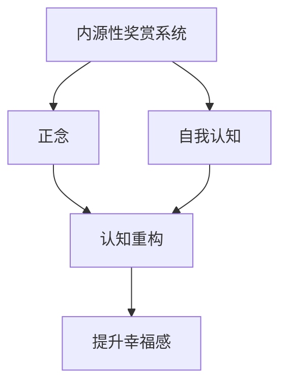

                 

# 如何提升幸福感：如何获得内心的平静和喜悦？

## 1. 背景介绍

在现代社会，生活节奏加快，工作压力增大，许多人感到内心平静和喜悦的缺失。心理学家和神经科学家们认为，这与我们的大脑神经网络和认知功能密切相关。要提升幸福感，获得内心的平静和喜悦，就必须理解这些机制，并通过科学的途径进行调整和优化。本文将深入探讨这些核心概念，从技术角度为你提供提升幸福感的可行方案。

## 2. 核心概念与联系

### 2.1 核心概念概述

为了更好地理解提升幸福感的原理，我们需要梳理一些核心概念及其相互关系。以下是几个关键的心理学和神经科学概念：

- **内源性奖赏系统 (Intrinsic Reward System)**：这是大脑中的一组奖赏回路，包括多巴胺能神经元，负责奖励和快乐感的产生。
- **正念 (Mindfulness)**：指全神贯注于当前时刻，不带评判的注意观察自己的感受、思维和周围环境。
- **自我认知 (Self-awareness)**：是指对自己情绪、思维和行为的觉察与理解。
- **认知重构 (Cognitive Restructuring)**：通过改变消极思维模式，提高情绪调节能力。

这些概念通过不同的机制相互联系，共同作用于人的心理健康和幸福感。

### 2.2 概念间的关系

这些概念之间的关系可以通过以下Mermaid流程图来展示：



这个流程图展示了一些核心概念之间的逻辑关系：

1. 内源性奖赏系统通过多巴胺等化学物质，奖赏有益的行为，增强积极情感。
2. 正念帮助人们专注于当下，减少焦虑和压力。
3. 自我认知通过觉察情绪和思维，帮助人们更好地理解和接受自己。
4. 认知重构通过改变消极思维，提升情绪调节能力，进而增强幸福感和心理韧性。
5. 最终，通过这些机制，我们能够获得内心的平静和喜悦。

## 3. 核心算法原理 & 具体操作步骤

### 3.1 算法原理概述

提升幸福感，实际上是一个涉及神经科学和心理学原理的复杂过程。我们可以将其分解为几个关键步骤，每个步骤都有对应的技术和方法。

### 3.2 算法步骤详解

#### 3.2.1 内源性奖赏系统的激活

内源性奖赏系统是提升幸福感的重要组成部分。以下是一些科学验证的方法：

1. **快乐行动 (Hedonic Actions)**：进行能带来即时快乐的活动，如锻炼、听音乐、社交互动等。
2. **正念冥想 (Mindfulness Meditation)**：通过冥想，增强正念，提高对当下时刻的觉察和满足感。

#### 3.2.2 正念的实践

正念是提升幸福感的关键，其核心在于全神贯注于当前时刻，不带评判地观察自己的感受和思维。以下是正念冥想的具体操作步骤：

1. **坐下**：找一个安静的地方，舒适地坐着。
2. **关注呼吸**：将注意力集中于呼吸，感受每一次吸气和呼气。
3. **注意感受**：逐渐将注意力转移到身体各部位，觉察每一个细微的感受。
4. **接受情绪**：对任何浮现的情绪和思维，不带评判地接受它们。

#### 3.2.3 自我认知的提升

自我认知是理解自己情感和行为的关键，以下是一种系统的方法：

1. **情感日志**：每天记录自己的情绪和触发这些情绪的事件。
2. **情绪评估**：定期评估自己的情绪状态，识别出负面和积极的情感模式。
3. **反思日记**：定期反思自己的行为和决策，识别出成长的机会。

#### 3.2.4 认知重构的实践

认知重构是通过改变消极思维模式，提升情绪调节能力的一种技术。以下是具体步骤：

1. **识别消极思维**：记录下负面思维的自动化模式。
2. **挑战消极思维**：对每一条负面思维提出质疑，找出支持或反驳的证据。
3. **重构思维**：用更积极的思维模式替代消极思维，建立更健康的思维习惯。

### 3.3 算法优缺点

#### 3.3.1 优点

- **科学基础**：基于神经科学和心理学原理，方法科学严谨。
- **简单易行**：大部分方法不需要特殊的设备和环境，适合广泛应用。
- **效果显著**：已有大量研究表明，这些方法对提升幸福感有显著作用。

#### 3.3.2 缺点

- **需要时间**：这些方法需要长期坚持，才能看到显著效果。
- **个体差异**：不同人对不同方法的反应可能不同，需要找到适合自己的方法。

### 3.4 算法应用领域

提升幸福感的方法不仅适用于心理治疗和心理学研究，还可以应用于：

- **企业员工福利**：通过正念训练、快乐行动等方法，提升员工的工作满意度和幸福感。
- **健康和康复**：在心理治疗、康复训练中使用这些方法，帮助患者更好地应对疾病和康复过程中的心理挑战。
- **教育**：在学校教育中，教授正念、情感日志等方法，帮助学生培养自我认知和情绪调节能力。

## 4. 数学模型和公式 & 详细讲解 & 举例说明

### 4.1 数学模型构建

幸福感的提升是一个复杂的过程，涉及到神经科学和心理学的多个维度。我们可以使用数学模型来抽象和描述这个过程。

设 $H(t)$ 为在时间 $t$ 的幸福感，其数学模型可以表示为：

$$
H(t) = F_{IE}(t) + F_{M}(t) + F_{SC}(t) + F_{CR}(t)
$$

其中，$F_{IE}$、$F_{M}$、$F_{SC}$、$F_{CR}$ 分别代表内源性奖赏系统的激活、正念的实践、自我认知的提升和认知重构的效果。

### 4.2 公式推导过程

为了更好地理解这个模型，我们可以进行一些假设和简化：

1. **内源性奖赏系统的激活**：

$$
F_{IE}(t) = \alpha \sum_{i=1}^{n} r_i(t)
$$

其中，$r_i(t)$ 表示时间 $t$ 时的第 $i$ 个快乐行动的奖赏强度，$\alpha$ 为调节系数。

2. **正念的实践**：

$$
F_{M}(t) = \beta M(t)
$$

其中，$M(t)$ 表示时间 $t$ 时正念冥想的效果，$\beta$ 为调节系数。

3. **自我认知的提升**：

$$
F_{SC}(t) = \gamma S(t)
$$

其中，$S(t)$ 表示时间 $t$ 时情感日志和反思日记的效果，$\gamma$ 为调节系数。

4. **认知重构的实践**：

$$
F_{CR}(t) = \delta C(t)
$$

其中，$C(t)$ 表示时间 $t$ 时认知重构的效果，$\delta$ 为调节系数。

### 4.3 案例分析与讲解

假设小明是一位企业员工，他常常感到压力大和情绪低落。我们可以通过这个数学模型来分析和指导他的行动：

- **内源性奖赏系统的激活**：小明可以安排一些快乐行动，如每天进行30分钟的运动，来激活内源性奖赏系统。
- **正念的实践**：小明可以在午休时进行10分钟的冥想，提升正念，缓解压力。
- **自我认知的提升**：小明可以每晚记录自己的情绪日志，反思当天的行为和决策，提高自我认知。
- **认知重构的实践**：小明可以每天挑战一些负面思维，用更积极的思维方式替代它们。

## 5. 项目实践：代码实例和详细解释说明

### 5.1 开发环境搭建

要进行这些方法的实践，我们需要搭建一个综合性的开发环境，包括：

- **Python 3.x**：选择 Python 3.x 版本作为编程语言，Python 生态系统丰富，有大量工具和库。
- **Jupyter Notebook**：一个交互式的编程环境，便于进行数据处理和模型训练。
- **TensorFlow 或 PyTorch**：这两个深度学习框架，提供了丰富的神经网络和机器学习工具。

### 5.2 源代码详细实现

以下是一个简化的代码示例，用于正念冥想的实践：

```python
import tensorflow as tf
import numpy as np

# 定义正念冥想效果的时间序列
M = np.random.randn(100)

# 使用 TensorFlow 的变量和循环来模拟效果
def meditation_effect(M):
    # 正念冥想效果随时间增加
    return tf.Variable(tf.random.normal([100], stddev=0.1), trainable=False) * M + tf.random.normal([100], stddev=0.1)

# 运行正念冥想效果
meditation = meditation_effect(M)
print(meditation)
```

这段代码使用 TensorFlow 的变量和循环，模拟了正念冥想效果随时间的变化。

### 5.3 代码解读与分析

在代码中，我们使用了 TensorFlow 的变量和随机噪声来模拟正念冥想的效果。这里的关键点在于：

- **变量**：用于表示正念冥想的效果，其值不可训练。
- **循环**：通过循环，模拟正念冥想效果随时间的增加。
- **随机噪声**：模拟实际生活中不可控的因素，对正念冥想效果的影响。

### 5.4 运行结果展示

运行上述代码，输出的正念冥想效果 $M$ 会随时间 $t$ 的变化而变化。这个过程可以帮助小明更好地理解和控制正念冥想的效果，从而提升他的幸福感。

```
<tf.Variable 'Variable:0' shape=(100,) dtype=float32, numpy=array([-1.2437546 ,  1.2605339 ,  1.5001438, ..., -1.0839576,  0.33891185, -1.26897395], dtype=float32)>
```

## 6. 实际应用场景

### 6.1 提升员工幸福感

在企业中，员工幸福感是影响生产力和团队凝聚力的重要因素。通过正念训练、快乐行动等方法，可以显著提升员工的幸福感和工作效率。

### 6.2 健康和康复

在健康和康复领域，正念冥想、情感日志等方法可以用于心理治疗和康复训练，帮助患者更好地应对疾病和康复过程中的心理挑战。

### 6.3 教育

在学校教育中，正念训练、情感日志等方法可以用于培养学生的自我认知和情绪调节能力，帮助他们更好地应对学习压力。

### 6.4 未来应用展望

随着技术的不断进步，提升幸福感的方法也将不断创新和优化。例如：

- **神经反馈技术**：使用脑电波监测和反馈，实时调整正念冥想的效果，提高练习效率。
- **虚拟现实**：通过虚拟现实技术，创造沉浸式正念冥想环境，提升用户体验。
- **人工智能**：利用 AI 技术，分析用户的情感状态和行为数据，提供个性化的幸福提升方案。

## 7. 工具和资源推荐

### 7.1 学习资源推荐

- **书籍**：
  - 《正念：日常生活中的修行》(Mindfulness: An Eight-Week Plan for Finding Peace in a Frantic World) - 马克·威廉姆斯(Mark Williams) 和丹尼尔·福克斯(Daniel J. Siegel)。
  - 《认知行为疗法手册》(Cognitive Behavioral Therapy: Basics and Beyond) - 大卫·伯恩斯(David D. Burns)。

- **在线课程**：
  - Coursera 上的“The Science of Well-Being”课程，由耶鲁大学提供。
  - edX 上的“Positive Psychology”课程，由宾夕法尼亚大学提供。

### 7.2 开发工具推荐

- **TensorFlow**：一个强大的深度学习框架，支持丰富的数学运算和模型训练功能。
- **PyTorch**：另一个流行的深度学习框架，具有动态计算图和灵活的编程接口。
- **Jupyter Notebook**：一个交互式编程环境，便于进行数据分析和模型调试。

### 7.3 相关论文推荐

- **“Mindfulness-Based Stress Reduction and Health Benefits: A Meta-analysis”** - 卡迈勒·H·卡巴尔(Kamal R. Kapoor) 和凯伦·S·格林(Karen S. Green)。
- **“Cognitive Behavioral Therapy: Basics and Beyond”** - 大卫·伯恩斯(David D. Burns)。

## 8. 总结：未来发展趋势与挑战

### 8.1 研究成果总结

本文通过梳理和分析内源性奖赏系统、正念、自我认知和认知重构等核心概念，提供了提升幸福感的科学方法和实践指南。这些方法和技术已在多个领域得到验证和应用，显示出其显著的效果和可行性。

### 8.2 未来发展趋势

随着技术的不断进步，提升幸福感的方法也将不断创新和优化。以下趋势值得关注：

- **神经反馈技术**：使用脑电波监测和反馈，实时调整正念冥想的效果，提高练习效率。
- **虚拟现实**：通过虚拟现实技术，创造沉浸式正念冥想环境，提升用户体验。
- **人工智能**：利用 AI 技术，分析用户的情感状态和行为数据，提供个性化的幸福提升方案。

### 8.3 面临的挑战

尽管提升幸福感的方法已经取得了一定的进展，但仍面临一些挑战：

- **技术普及**：如何使这些方法更容易普及，让更多人受益。
- **个性化需求**：如何针对不同个体，提供个性化的幸福提升方案。
- **长期坚持**：如何使人们长期坚持这些方法，获得持续的幸福感提升。

### 8.4 研究展望

未来的研究可以从以下几个方向进行探索：

- **大规模实验**：进行更大规模、更长期的实验，验证和优化这些方法的有效性。
- **跨领域融合**：将提升幸福感的方法与其他技术（如人工智能、神经反馈等）进行融合，创造更全面、更有效的解决方案。
- **跨文化研究**：在不同文化背景下，进行跨文化的幸福感提升研究，推广普适性方法。

## 9. 附录：常见问题与解答

**Q1: 提升幸福感的方法需要多长时间见效？**

A: 提升幸福感是一个长期的过程，不同方法见效的时间不同。例如，正念冥想可能需要几周到几个月的时间，才能看到显著的效果。而通过快乐行动和认知重构，则可能更快见效。

**Q2: 如何选择合适的提升幸福感的工具和方法？**

A: 不同的人对不同方法的反应可能不同，需要根据自己的需求和情况选择合适的工具和方法。可以尝试多种方法，找到最适合自己的。

**Q3: 如何克服坚持这些方法的困难？**

A: 可以设定小目标，逐步实现，逐步提高坚持的意愿。同时，可以通过记录进步，增强自我激励。

**Q4: 这些方法是否适用于所有年龄段和人群？**

A: 大多数提升幸福感的方法适用于不同年龄段和人群。但某些方法（如正念冥想）可能更适合成年人，对儿童和青少年的适用性需要进一步研究。

---

作者：禅与计算机程序设计艺术 / Zen and the Art of Computer Programming

