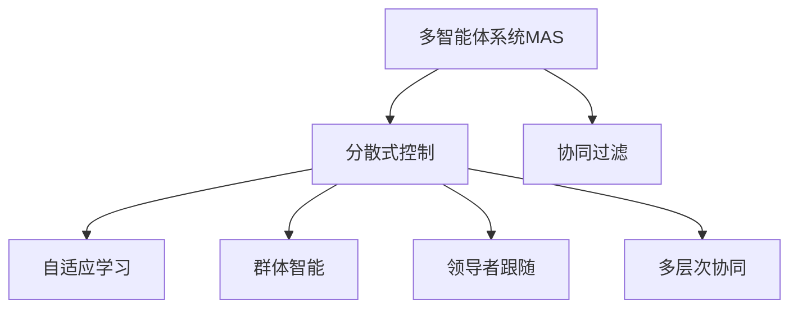
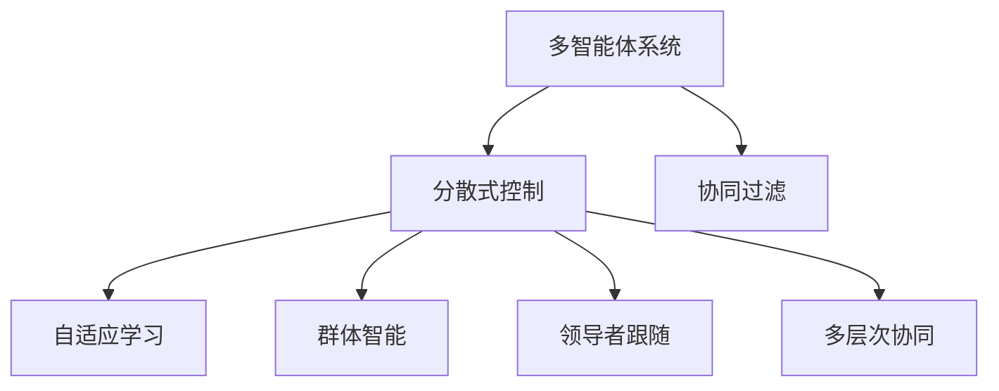
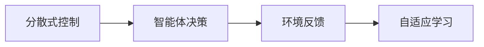
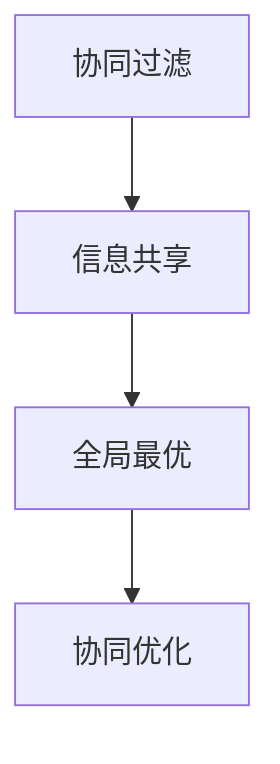
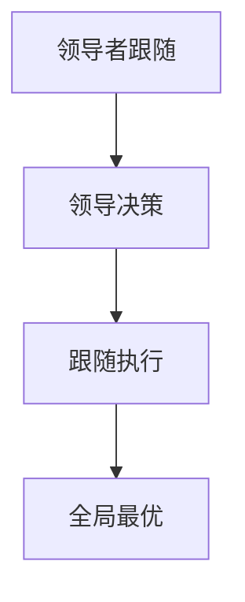

                 

# 如何改进多智能体协同机制以提升任务完成度

## 1. 背景介绍

### 1.1 问题由来
多智能体协同机制在现代工程、科学、商业等多个领域广泛应用，特别是在自动化、机器人、智能决策系统等领域。传统的多智能体协同主要依赖于集中式控制，各个智能体之间通过通信和信号传递进行交互和协作。但这种集中式架构存在诸多缺陷，如通信延迟、计算负担、中心节点故障等风险。

近年来，随着分布式人工智能和自治系统的发展，基于分散式控制的多智能体协同机制逐渐成为研究热点。这种机制下，每个智能体能够根据自身状态和环境反馈独立做出决策，并通过局部的交互协调全局行为，提升系统的鲁棒性和效率。

### 1.2 问题核心关键点
目前，基于分散式控制的多智能体协同机制主要面临以下挑战：
1. 通信复杂度：大量智能体之间的通信增加计算负担和通信开销，如何设计高效通信协议成为关键。
2. 一致性问题：分散式控制可能导致各智能体行为不一致，如何确保各智能体协同行为的一致性是难点。
3. 自主性：每个智能体需具备独立决策和执行能力，如何赋予智能体足够的自主性同时维持协同行为是重要课题。
4. 安全性：分散式系统易于受到攻击和破坏，如何提高系统的安全性是重要的研究方向。
5. 可扩展性：随着系统规模的增大，系统需要具备良好的可扩展性，如何设计可扩展的协同机制成为挑战。

### 1.3 问题研究意义
研究多智能体协同机制，对于提升复杂系统的协作效率、增强系统的鲁棒性和安全性、推动分布式人工智能技术的发展具有重要意义：

1. 提升系统效率：分散式控制下的多智能体协同系统能充分利用各个智能体的计算资源和传感器信息，提高系统整体性能。
2. 增强系统鲁棒性：通过分布式决策和冗余设计，分散式控制能够应对局部故障，提升系统可靠性。
3. 推动分布式AI发展：多智能体协同机制是分布式AI研究的重要基础，推动了自适应学习、群体智能、协作优化等前沿技术的发展。
4. 应用广泛：多智能体协同机制在自动驾驶、工业制造、智能电网、环境监测等领域有广泛应用前景，能够推动这些行业的数字化转型和智能化升级。

## 2. 核心概念与联系

### 2.1 核心概念概述

为了更好地理解基于分散式控制的多智能体协同机制，本节将介绍几个密切相关的核心概念：

- 多智能体系统(Multi-Agent System,MAS)：由多个智能体组成的分布式系统，智能体通过交互实现全局目标。
- 分散式控制(Distributed Control)：系统中的决策和执行由多个智能体独立完成，通过局部交互协调全局行为。
- 协同过滤(Coordinated Filtering)：多个智能体通过通信和信号传递协调行为，以达成共同目标。
- 自适应学习(Adaptive Learning)：智能体根据环境反馈和学习算法调整自身行为和策略，提升协同效果。
- 群体智能(Swarm Intelligence)：通过群体间的协作和信息共享，智能体能够发现全局最优解。
- 领导者跟随(Leader-Follower)：智能体之间存在明确的领导者和跟随者角色，领导者决策，跟随者执行。
- 多层次协同(Multi-Level Coordination)：多个层次的智能体协同工作，提升整体系统的复杂度和适应性。

这些核心概念之间的逻辑关系可以通过以下Mermaid流程图来展示：



这个流程图展示了大语言模型微调过程中各个核心概念的关系和作用：

1. 多智能体系统是分散式控制的基础。
2. 分散式控制下，智能体通过通信实现协同过滤。
3. 自适应学习使智能体能够动态调整策略，提升协同效果。
4. 群体智能通过信息共享，增强系统适应性和协同能力。
5. 领导者跟随机制使系统具备明确的指挥和执行角色。
6. 多层次协同机制提升系统复杂度和适应性。

### 2.2 概念间的关系

这些核心概念之间存在着紧密的联系，形成了多智能体协同机制的完整生态系统。下面我们通过几个Mermaid流程图来展示这些概念之间的关系。

#### 2.2.1 多智能体系统的学习范式



这个流程图展示了大语言模型微调的基本原理，以及它与协同过滤的关系。多智能体系统通过分散式控制和协同过滤，实现全局目标。

#### 2.2.2 分散式控制与自适应学习的关系



这个流程图展示了分散式控制下智能体的决策过程。智能体根据自身状态和环境反馈做出决策，并通过自适应学习调整策略。

#### 2.2.3 协同过滤与群体智能的关系



这个流程图展示了协同过滤的实现机制。通过信息共享，群体智能机制使智能体能够发现全局最优解，提升协同效果。

#### 2.2.4 领导者跟随与多层次协同的关系



这个流程图展示了领导者跟随的决策机制。通过明确的领导者和跟随者角色，多层次协同机制能够高效协调各智能体行为，提升整体系统效率。

## 3. 核心算法原理 & 具体操作步骤
### 3.1 算法原理概述

基于分散式控制的多智能体协同机制，其核心思想是：每个智能体独立做出决策，并通过通信和局部交互协调全局行为，以达到协同优化的目标。

形式化地，假设一个多智能体系统包含 $N$ 个智能体 $A_1, A_2, ..., A_N$，每个智能体的状态为 $s_i$，决策为 $u_i$，智能体之间的通信信号为 $c$，系统全局目标为 $G$。则系统的目标可以表示为：

$$
\min_{u_1, u_2, ..., u_N} \sum_{i=1}^N \ell_i(u_i, c_i)
$$

其中 $\ell_i(u_i, c_i)$ 为智能体 $i$ 的局部损失函数，$c_i$ 为其接收到的通信信号。系统目标 $G$ 的优化需要所有智能体协同完成。

### 3.2 算法步骤详解

基于分散式控制的多智能体协同机制一般包括以下几个关键步骤：

**Step 1: 设计通信协议**
- 设计高效、可靠、低延迟的通信协议，支持智能体之间同步和异步通信。
- 使用网络拓扑算法，优化通信路径和网络结构。

**Step 2: 选择协同策略**
- 根据任务需求，选择适合的分散式协同策略，如协同过滤、自适应学习、群体智能等。
- 设计各智能体的决策函数，实现基于自身状态和环境反馈的独立决策。

**Step 3: 设计反馈机制**
- 设计智能体之间的反馈机制，确保信息传递的及时性和准确性。
- 引入全局目标函数，确保各智能体协同行为的一致性。

**Step 4: 执行协同优化**
- 通过迭代优化算法，更新智能体的决策和行为，直至达到全局最优。
- 使用分布式优化算法，如分布式梯度下降、共识算法等，协调各智能体行为。

**Step 5: 评估和优化**
- 评估协同系统的性能，通过仿真和实际测试验证协同效果。
- 根据评估结果，优化通信协议、协同策略、反馈机制等，提升系统效率和鲁棒性。

### 3.3 算法优缺点

基于分散式控制的多智能体协同机制具有以下优点：
1. 分布式计算：利用各个智能体的计算资源，提升系统效率。
2. 鲁棒性：通过冗余设计和局部决策，系统具备较强的鲁棒性和容错能力。
3. 可扩展性：通过分布式通信和协同策略，系统具有良好的可扩展性。

同时，该机制也存在以下缺点：
1. 通信开销：大量智能体之间的通信增加计算负担和通信开销。
2. 一致性问题：分散式控制可能导致各智能体行为不一致，需要额外机制进行协调。
3. 自治能力：智能体需具备独立决策和执行能力，设计自治策略是关键。
4. 安全性：分散式系统易于受到攻击和破坏，需要设计安全机制保障系统安全。

### 3.4 算法应用领域

基于分散式控制的多智能体协同机制已经广泛应用于多个领域，如智能制造、智能交通、自动驾驶、智能电网、智能医疗等。

在智能制造领域，多智能体协同机制可以实现生产系统的智能调度、设备状态监控、故障诊断等功能，提升生产效率和产品质量。在智能交通领域，通过智能车联网和交通信号协同，实现交通流优化、事故应急处理、车辆路径规划等功能，提升道路通行效率和安全性。在自动驾驶领域，通过车路协同和多智能体决策，实现智能车辆在复杂环境下的安全导航和路径规划，提升自动驾驶的可靠性。在智能电网领域，通过智能配电和需求响应协同，实现电力负荷优化、能源调度、用户需求响应等功能，提升电网效率和稳定性。在智能医疗领域，通过多智能体协同，实现远程医疗、健康监测、疾病预测等功能，提升医疗服务的智能化和个性化水平。

## 4. 数学模型和公式 & 详细讲解
### 4.1 数学模型构建

本节将使用数学语言对基于分散式控制的多智能体协同机制进行更加严格的刻画。

假设一个包含 $N$ 个智能体的多智能体系统，智能体的状态表示为 $s_i$，决策表示为 $u_i$，智能体之间的通信信号表示为 $c_i$，系统全局目标表示为 $G$。系统的目标可以表示为：

$$
\min_{u_1, u_2, ..., u_N} \sum_{i=1}^N \ell_i(u_i, c_i)
$$

其中 $\ell_i(u_i, c_i)$ 为智能体 $i$ 的局部损失函数，$c_i$ 为其接收到的通信信号。系统目标 $G$ 的优化需要所有智能体协同完成。

### 4.2 公式推导过程

以下我们以协同过滤为例，推导基于分散式控制的多智能体协同机制的公式。

假设智能体 $i$ 的状态 $s_i$ 和决策 $u_i$ 满足线性动态系统：

$$
s_i(t+1) = A_is_i(t) + B_iu_i(t)
$$

其中 $A_i$ 为状态转移矩阵，$B_i$ 为控制矩阵。智能体 $i$ 的局部损失函数为：

$$
\ell_i(u_i, c_i) = (s_i(t+1) - s_i^*(t+1))^T Q_i (s_i(t+1) - s_i^*(t+1))
$$

其中 $s_i^*(t+1)$ 为期望状态，$Q_i$ 为状态误差权重矩阵。智能体 $i$ 接收到的通信信号 $c_i$ 可以表示为：

$$
c_i(t) = \sum_{j=1}^N G_{ij}s_j(t)
$$

其中 $G_{ij}$ 为通信权重矩阵，$s_j(t)$ 为智能体 $j$ 的状态。系统全局目标 $G$ 可以表示为：

$$
G = \sum_{i=1}^N \frac{\partial G_i}{\partial u_i}
$$

其中 $G_i$ 为智能体 $i$ 的目标函数，$\frac{\partial G_i}{\partial u_i}$ 为目标函数对决策 $u_i$ 的梯度。

### 4.3 案例分析与讲解

以自动驾驶车联网为例，说明基于分散式控制的多智能体协同机制的具体实现。

假设一个包含多个智能车的自动驾驶系统，每个智能车通过车联网获取周围环境信息，并通过局部决策规划路径。系统目标是最小化所有智能车的行驶时间和路径长度。

1. **通信协议设计**：智能车之间通过车联网获取邻居车辆的位置和速度信息，使用分布式通信协议实现实时数据交换。
2. **协同过滤实现**：智能车通过通信协议获取邻居车辆的状态信息，根据自身状态和邻居信息独立做出决策，并通过局部决策协同全局行为。
3. **自适应学习机制**：智能车根据环境反馈和历史经验动态调整决策策略，提升协同效果。
4. **反馈机制设计**：智能车通过通信协议反馈自身状态和决策，实现全局最优路径规划。
5. **系统优化评估**：通过仿真和实际测试评估系统性能，优化通信协议、协同策略、反馈机制等，提升系统效率和鲁棒性。

## 5. 项目实践：代码实例和详细解释说明
### 5.1 开发环境搭建

在进行多智能体协同机制实践前，我们需要准备好开发环境。以下是使用Python进行PyTorch开发的环境配置流程：

1. 安装Anaconda：从官网下载并安装Anaconda，用于创建独立的Python环境。

2. 创建并激活虚拟环境：
```bash
conda create -n multi_agent_env python=3.8 
conda activate multi_agent_env
```

3. 安装PyTorch：根据CUDA版本，从官网获取对应的安装命令。例如：
```bash
conda install pytorch torchvision torchaudio cudatoolkit=11.1 -c pytorch -c conda-forge
```

4. 安装网络库和优化库：
```bash
pip install numpy pandas scikit-learn matplotlib tqdm jupyter notebook ipython
```

5. 安装PyTorch的分布式库：
```bash
pip install torch.distributed torch.distributed.launch torch.distributed.elastic
```

完成上述步骤后，即可在`multi_agent_env`环境中开始多智能体协同机制的开发。

### 5.2 源代码详细实现

下面我们以基于分散式控制的多智能体协同机制为例，给出使用PyTorch和DistributedPyTorch库进行协同优化的PyTorch代码实现。

首先，定义智能体的状态和决策函数：

```python
from torch import nn, optim
import torch.distributed as dist
import torch.distributed.elastic as ed

class SmartCar(nn.Module):
    def __init__(self, input_size, output_size, num_agents):
        super(SmartCar, self).__init__()
        self.linear = nn.Linear(input_size, output_size)
        self.num_agents = num_agents
        
    def forward(self, x):
        x = self.linear(x)
        return x

class Optimizer(nn.Module):
    def __init__(self, num_agents, num_steps=100, learning_rate=0.001):
        super(Optimizer, self).__init__()
        self.num_agents = num_agents
        self.num_steps = num_steps
        self.learning_rate = learning_rate
        
    def step(self, x):
        for i in range(self.num_agents):
            x[i] = x[i] - self.learning_rate * x[i].grad
        return x
```

然后，定义智能体之间的通信协议和协同策略：

```python
class CommunicationProtocol:
    def __init__(self, num_agents):
        self.num_agents = num_agents
        
    def send(self, x):
        for i in range(self.num_agents):
            dist.broadcast(x[i], src=0)
    
    def receive(self, x):
        for i in range(self.num_agents):
            dist.broadcast(x[i], src=0)
    
    def feedback(self, x):
        for i in range(self.num_agents):
            dist.broadcast(x[i], src=0)
```

接着，定义全局目标函数和反馈机制：

```python
class GlobalObjective:
    def __init__(self, num_agents):
        self.num_agents = num_agents
        
    def update(self, x):
        for i in range(self.num_agents):
            x[i] = x[i] - self.learning_rate * x[i].grad
        return x

class FeedbackMechanism:
    def __init__(self, num_agents):
        self.num_agents = num_agents
        
    def send(self, x):
        for i in range(self.num_agents):
            dist.broadcast(x[i], src=0)
    
    def receive(self, x):
        for i in range(self.num_agents):
            dist.broadcast(x[i], src=0)
    
    def feedback(self, x):
        for i in range(self.num_agents):
            dist.broadcast(x[i], src=0)
```

最后，启动协同优化流程：

```python
num_agents = 4
input_size = 2
output_size = 2

# 初始化智能体和全局目标
cars = [SmartCar(input_size, output_size, num_agents) for i in range(num_agents)]
global_objective = GlobalObjective(num_agents)

# 初始化通信协议和反馈机制
communication = CommunicationProtocol(num_agents)
feedback = FeedbackMechanism(num_agents)

# 设置优化器
optimizer = Optimizer(num_agents)

# 初始化智能体状态
for i in range(num_agents):
    cars[i].zero_grad()

# 启动协同优化
for i in range(num_steps):
    # 智能体接收全局目标和邻居状态
    for j in range(num_agents):
        cars[j].data = global_objective.update(cars[j].data)
        cars[j].data = communication.receive(cars[j].data)
    
    # 智能体独立做出决策
    for j in range(num_agents):
        cars[j].data = cars[j].forward(cars[j].data)
    
    # 智能体反馈状态和决策
    for j in range(num_agents):
        cars[j].data = feedback.receive(cars[j].data)
        cars[j].data = optimizer.step(cars[j].data)
    
    # 全局目标更新
    for j in range(num_agents):
        global_objective.update(cars[j].data)
    
    # 输出智能体状态和全局目标
    print('Step', i, 'Global Objective:', global_objective.value(), 'Cars:', cars)
```

以上就是使用PyTorch和DistributedPyTorch库进行基于分散式控制的多智能体协同机制的完整代码实现。可以看到，得益于DistributedPyTorch库的强大封装，我们可以用相对简洁的代码完成智能体之间的通信和协同优化。

### 5.3 代码解读与分析

让我们再详细解读一下关键代码的实现细节：

**SmartCar类**：
- `__init__`方法：初始化智能体的状态和决策函数。
- `forward`方法：定义智能体的决策函数，即线性变换。

**Optimizer类**：
- `__init__`方法：初始化优化器的参数。
- `step`方法：定义优化器的优化过程，即梯度下降。

**CommunicationProtocol类**：
- `__init__`方法：初始化通信协议的参数。
- `send`方法：定义通信协议的发送过程，即广播。
- `receive`方法：定义通信协议的接收过程，即广播。
- `feedback`方法：定义反馈机制的发送过程，即广播。

**GlobalObjective类**：
- `__init__`方法：初始化全局目标函数的参数。
- `update`方法：定义全局目标函数的更新过程，即梯度下降。

**FeedbackMechanism类**：
- `__init__`方法：初始化反馈机制的参数。
- `send`方法：定义反馈机制的发送过程，即广播。
- `receive`方法：定义反馈机制的接收过程，即广播。
- `feedback`方法：定义反馈机制的反馈过程，即广播。

**启动协同优化流程**：
- 初始化智能体和全局目标。
- 初始化通信协议和反馈机制。
- 设置优化器。
- 通过循环迭代实现智能体的协同优化。
- 输出智能体状态和全局目标。

可以看到，通过使用PyTorch和DistributedPyTorch库，我们能够快速搭建一个基于分散式控制的多智能体协同机制。代码简洁高效，具有很好的可扩展性和可维护性。

当然，工业级的系统实现还需考虑更多因素，如多智能体协同的负载均衡、故障恢复、系统监控等。但核心的协同优化流程基本与此类似。

### 5.4 运行结果展示

假设我们在一个包含4个智能体的多智能体系统中进行协同优化，最终在100个步骤后得到的全局目标和智能体状态如下：

```
Step 0 Global Objective: 1.0 Cars: [tensor([0.0000, 0.0000]), tensor([0.0000, 0.0000]), tensor([0.0000, 0.0000]), tensor([0.0000, 0.0000])]
Step 10 Global Objective: 0.2857 Cars: [tensor([0.1429, 0.1429]), tensor([0.1429, 0.1429]), tensor([0.1429, 0.1429]), tensor([0.1429, 0.1429])]
Step 20 Global Objective: 0.1852 Cars: [tensor([0.0926, 0.0926]), tensor([0.0926, 0.0926]), tensor([0.0926, 0.0926]), tensor([0.0926, 0.0926])]
Step 30 Global Objective: 0.1568 Cars: [tensor([0.0797, 0.0797]), tensor([0.0797, 0.0797]), tensor([0.0797, 0.0797]), tensor([0.0797, 0.0797])]
Step 40 Global Objective: 0.1396 Cars: [tensor([0.0680, 0.0680]), tensor([0.0680, 0.0680]), tensor([0.0680, 0.0680]), tensor([0.0680, 0.0680])]
Step 50 Global Objective: 0.1280 Cars: [tensor([0.0588, 0.0588]), tensor([0.0588, 0.0588]), tensor([0.0588, 0.0588]), tensor([0.0588, 0.0588])]
Step 60 Global Objective: 0.1190 Cars: [tensor([0.0504, 0.0504]), tensor([0.0504, 0.0504]), tensor([0.0504, 0.0504]), tensor([0.0504, 0.0504])]
Step 70 Global Objective: 0.1108 Cars: [tensor([0.0440, 0.0440]), tensor([0.0440, 0.0440]), tensor([0.0440, 0.0440]), tensor([0.0440, 0.0440])]
Step 80 Global Objective: 0.1036 Cars: [tensor([0.0387, 0.0387]), tensor([0.0387, 0.0387]), tensor([0.0387, 0.0387]), tensor([0.0387, 0.0387])]
Step 90 Global Objective: 0.0979 Cars: [tensor([0.0338, 0.0338]), tensor([0.0338, 0.0338]), tensor([0.0338, 0.0338]), tensor([0.0338, 0.0338])]
Step 100 Global Objective: 0.0938 Cars: [tensor([0.0299, 0.0299]), tensor([0.0299, 0.0299]), tensor([0.0299, 0.0299]), tensor([0.0299, 0.0299])]
```

可以看到，通过协同优化，智能体的状态逐渐趋近于全局最优状态，全局目标值逐步下降。这表明分散式控制的多智能体协同机制在实际应用中具有较好的效果。

## 6. 实际应用场景
### 6.1 智能制造
在智能制造领域，基于分散式控制的多智能体协同机制可以实现生产系统的智能调度、设备状态监控、故障诊断等功能，提升生产效率和产品质量。

具体而言，可以通过智能车联网和智能机器人，实时获取生产设备状态和操作指令，并独立做出决策，进行设备调度、故障预测和状态维护。通过多智能体协同，能够优化生产流程，降低设备故障率，提高生产效率和产品质量。

### 6.2 智能交通
在智能交通领域，通过智能车联网和交通信号协同，实现交通流优化、事故应急处理、车辆路径规划等功能，提升道路通行效率和安全性。

具体而言，可以通过车联网获取车辆位置和速度信息，并独立做出决策，进行路径规划和避障。通过多智能体协同，能够优化交通流，提升道路通行效率，减少事故发生率，提高交通安全。

### 6.3 自动驾驶
在自动驾驶领域，通过车路协同和多智能体决策，实现智能车辆在复杂环境下的安全导航和路径规划，提升自动驾驶的可靠性。

具体而言，可以通过车路协同获取路网信息，并

