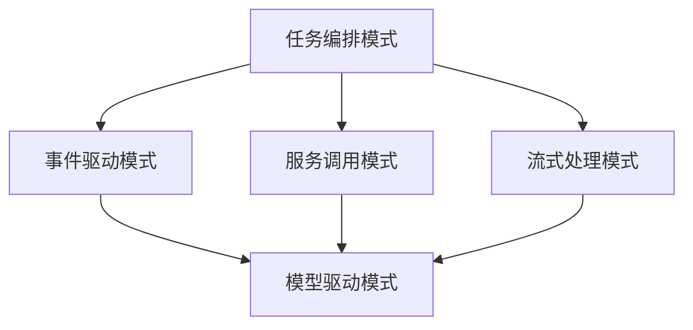
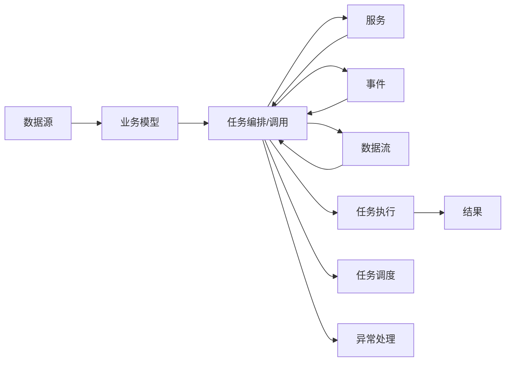
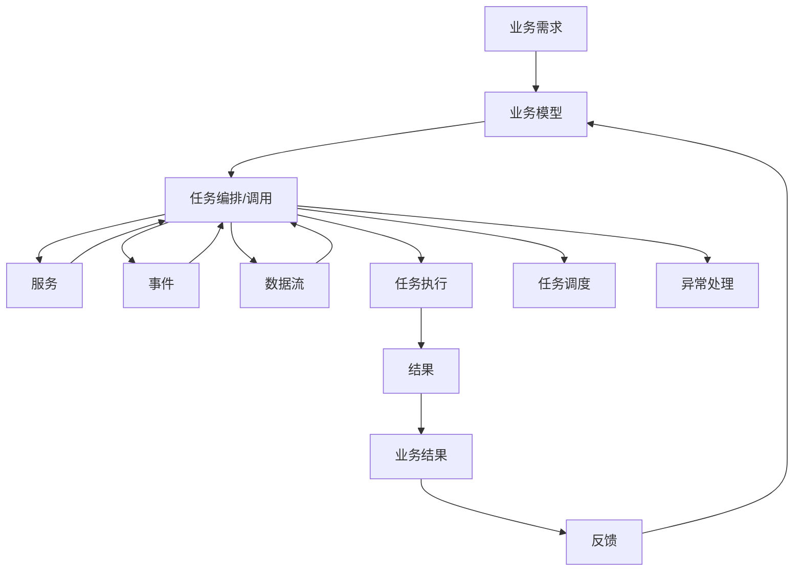

                 

## 1. 背景介绍

### 1.1 问题由来

在软件工程领域，设计模式是经过实践验证的、通用的解决方案，被广泛应用于解决特定问题。然而，随着云计算、微服务架构、DevOps、DevSecOps等现代软件工程实践的兴起，传统的设计模式往往难以满足新的需求，特别是在敏捷开发、持续交付和自动化运维等方面。

Agentic Workflow（简称AW），即代理式流程，是一种新的设计模式，用于描述和实现业务流程自动化。与传统的基于脚本的流程自动化相比，AW更加关注业务流程的执行细节和任务间的协作。在快速变化的市场环境中，AW能够提供更灵活、更高效的自动化解决方案。

### 1.2 问题核心关键点

选择适合的Agentic Workflow设计模式，关键在于理解不同的模式及其适用场景。以下是几种常见AW设计模式的核心特征和适用场景：

1. **任务编排模式**：将任务按照业务逻辑进行串行编排，适合静态、规则明确的流程。
2. **事件驱动模式**：以事件为中心，根据业务事件触发相应的任务处理，适合动态、变化频繁的流程。
3. **服务调用模式**：通过调用服务进行任务执行，适合跨系统、异构环境的流程。
4. **流式处理模式**：对数据流进行实时处理，适合高并发、实时性要求高的流程。
5. **模型驱动模式**：通过定义模型描述业务流程，适合复杂、多变的数据驱动型流程。

## 2. 核心概念与联系

### 2.1 核心概念概述

为更好地理解Agentic Workflow设计模式，本节将介绍几个密切相关的核心概念：

- **Agentic Workflow (AW)**：一种新的设计模式，用于描述和实现业务流程自动化，特别关注任务间的协作和执行细节。
- **任务**：业务流程中的最小可执行单元，可以理解为单个函数或方法。
- **事件**：业务流程中具有触发作用的信息，如订单提交、客户注册等。
- **服务**：独立于业务流程的模块，提供可重用的功能。
- **数据流**：在流程中传递的数据，包括业务数据、状态信息等。
- **模型**：描述业务流程的抽象结构，通过定义模型描述流程。

这些概念之间的逻辑关系可以通过以下Mermaid流程图来展示：



这个流程图展示了几种子AW设计模式之间的关系：

1. 任务编排模式可以衍生出服务调用模式和事件驱动模式。
2. 模型驱动模式是所有AW设计模式的通用基础。
3. 流式处理模式是针对数据流实时处理的特殊设计模式。

### 2.2 概念间的关系

这些核心概念之间存在着紧密的联系，形成了Agentic Workflow的完整生态系统。下面我们通过几个Mermaid流程图来展示这些概念之间的关系。

#### 2.2.1 Agentic Workflow的通用架构



这个流程图展示了Agentic Workflow的通用架构：

1. 数据源：提供业务所需的数据。
2. 业务模型：描述业务流程的逻辑结构和数据处理方式。
3. 任务编排/调用：根据业务逻辑，将任务进行编排或调用。
4. 服务：独立的模块，提供可重用的功能。
5. 事件：业务流程中的触发信息。
6. 数据流：在流程中传递的数据。
7. 任务执行：实际执行任务的模块。
8. 任务调度：任务执行的时间和顺序安排。
9. 异常处理：处理任务执行过程中的异常情况。
10. 结果：任务的最终输出。

### 2.3 核心概念的整体架构

最后，我们用一个综合的流程图来展示Agentic Workflow的核心概念在大规模企业中的应用场景：



这个综合流程图展示了Agentic Workflow在大规模企业中的应用场景：

1. 业务需求：企业对业务流程自动化的需求。
2. 业务模型：企业通过业务模型描述流程结构和数据处理方式。
3. 任务编排/调用：根据业务逻辑，将任务进行编排或调用。
4. 服务：独立的模块，提供可重用的功能。
5. 事件：业务流程中的触发信息。
6. 数据流：在流程中传递的数据。
7. 任务执行：实际执行任务的模块。
8. 任务调度：任务执行的时间和顺序安排。
9. 异常处理：处理任务执行过程中的异常情况。
10. 结果：任务的最终输出。
11. 业务结果：业务流程的最终结果。
12. 反馈：业务结果的反馈，用于更新业务模型。

通过这些流程图，我们可以更清晰地理解Agentic Workflow设计模式的核心概念及其应用场景。

## 3. 核心算法原理 & 具体操作步骤
### 3.1 算法原理概述

Agentic Workflow的设计模式通常包括以下几个步骤：

1. 定义业务流程和任务。
2. 设计任务间的协作方式。
3. 实现任务的编排和调度。
4. 处理任务执行过程中的异常情况。
5. 对任务执行结果进行反馈和优化。

这些步骤通过任务编排模式、事件驱动模式、服务调用模式、流式处理模式和模型驱动模式等具体实现，可以灵活地组合和应用，以满足不同的业务需求。

### 3.2 算法步骤详解

#### 3.2.1 任务编排模式

任务编排模式是指按照业务逻辑，将任务按照顺序进行编排，形成串行执行的流程。这种模式适用于静态、规则明确的业务流程，如订单处理、物流管理等。

**操作步骤：**

1. 定义业务流程中的任务。
2. 根据任务依赖关系，编排任务的执行顺序。
3. 实现任务之间的同步和互斥机制。
4. 对任务执行结果进行验证和检查。
5. 对任务执行过程中可能出现的异常进行异常处理。

#### 3.2.2 事件驱动模式

事件驱动模式以事件为中心，根据业务事件触发相应的任务处理。这种模式适用于动态、变化频繁的业务流程，如客户注册、订单支付等。

**操作步骤：**

1. 定义业务流程中的事件类型和触发条件。
2. 实现事件的处理逻辑。
3. 根据事件触发条件，调用相应的任务处理。
4. 对事件处理结果进行验证和检查。
5. 对事件处理过程中可能出现的异常进行异常处理。

#### 3.2.3 服务调用模式

服务调用模式通过调用服务进行任务执行，适用于跨系统、异构环境的业务流程。这种模式通过服务接口定义业务流程，可以降低系统间的耦合度。

**操作步骤：**

1. 定义服务接口和实现。
2. 根据业务需求，调用相应的服务。
3. 对服务调用结果进行验证和检查。
4. 对服务调用过程中可能出现的异常进行异常处理。
5. 对服务调用结果进行缓存和优化。

#### 3.2.4 流式处理模式

流式处理模式对数据流进行实时处理，适用于高并发、实时性要求高的业务流程。这种模式通过数据流模型描述业务流程，可以保证数据处理的时效性和一致性。

**操作步骤：**

1. 定义数据流模型和处理逻辑。
2. 根据数据流模型，实现数据的实时处理。
3. 对数据流处理结果进行验证和检查。
4. 对数据流处理过程中可能出现的异常进行异常处理。
5. 对数据流处理结果进行缓存和优化。

#### 3.2.5 模型驱动模式

模型驱动模式通过定义模型描述业务流程，适用于复杂、多变的数据驱动型业务流程。这种模式通过模型驱动的方式，可以灵活地调整业务流程和数据处理逻辑。

**操作步骤：**

1. 定义业务流程的模型。
2. 根据模型定义，实现业务流程的自动编排和调度。
3. 对业务流程的执行结果进行验证和检查。
4. 对业务流程执行过程中可能出现的异常进行异常处理。
5. 对业务流程执行结果进行反馈和优化。

### 3.3 算法优缺点

Agentic Workflow设计模式具有以下优点：

1. 灵活性高：根据不同的业务需求，可以灵活组合和应用不同的设计模式。
2. 可扩展性强：通过服务调用和事件驱动等方式，可以方便地扩展业务流程。
3. 高可靠性：通过任务编排和异常处理等方式，可以提高业务流程的可靠性。
4. 可维护性好：通过模型驱动和任务编排等方式，可以方便地维护和更新业务流程。

Agentic Workflow设计模式也存在一些缺点：

1. 设计复杂度高：设计模式的选择和实现需要较高的设计能力和技术积累。
2. 开发成本高：实现复杂的设计模式需要更多的开发资源和时间投入。
3. 性能开销大：复杂的设计模式可能会带来额外的性能开销，如服务调用、事件驱动等。
4. 安全风险高：复杂的设计模式可能会引入更多的安全风险，如跨系统调用、数据流处理等。

### 3.4 算法应用领域

Agentic Workflow设计模式已经在多个行业得到广泛应用，特别是在金融、电商、物流、制造等数字化程度较高的领域：

1. **金融行业**：通过任务编排和事件驱动等方式，实现订单处理、风险控制、欺诈检测等业务流程自动化。
2. **电商行业**：通过服务调用和流式处理等方式，实现客户注册、订单支付、物流跟踪等业务流程自动化。
3. **物流行业**：通过任务编排和异常处理等方式，实现货物运输、配送跟踪、库存管理等业务流程自动化。
4. **制造行业**：通过模型驱动和任务编排等方式，实现生产调度、质量控制、设备维护等业务流程自动化。

这些应用场景展示了Agentic Workflow设计模式在实际业务流程自动化中的巨大潜力。

## 4. 数学模型和公式 & 详细讲解 & 举例说明

### 4.1 数学模型构建

假设有一个订单处理流程，包含以下任务和事件：

1. 订单创建：客户提交订单。
2. 订单审核：审核订单是否合法。
3. 订单支付：客户支付订单金额。
4. 订单发货：仓库发货。
5. 订单配送：物流公司配送。

这些任务和事件可以表示为一个有向图，如下所示：

```
订单创建 --> 订单审核
                ↓
                ↓
                ↓
                ↓
                ↓
                ↓
                ↓
订单支付 --> 订单发货 --> 订单配送
```

### 4.2 公式推导过程

定义任务和事件的集合如下：

- 任务集合 $T = \{C, R, P, S, D\}$
- 事件集合 $E = \{E1, E2\}$

其中，$C$ 表示订单创建，$R$ 表示订单审核，$P$ 表示订单支付，$S$ 表示订单发货，$D$ 表示订单配送。事件 $E1$ 表示订单支付成功，事件 $E2$ 表示订单发货成功。

假设任务之间的依赖关系如下：

- $C$ → $R$
- $R$ → $P$
- $P$ → $S$
- $S$ → $D$

事件 $E1$ 和 $E2$ 分别与任务 $P$ 和 $S$ 相关联。

任务编排模式的数学模型可以表示为：

$$
T: \{C, R, P, S, D\}
$$

事件驱动模式的数学模型可以表示为：

$$
E: \{E1, E2\}
$$

服务调用模式的数学模型可以表示为：

$$
S: \{服务1, 服务2, 服务3\}
$$

流式处理模式的数学模型可以表示为：

$$
F: \{数据流1, 数据流2, 数据流3\}
$$

模型驱动模式的数学模型可以表示为：

$$
M: \{模型1, 模型2, 模型3\}
$$

### 4.3 案例分析与讲解

以订单处理流程为例，分析如何使用不同的Agentic Workflow设计模式实现流程自动化：

#### 4.3.1 任务编排模式

任务编排模式的实现步骤如下：

1. 定义任务集合 $T$ 和任务依赖关系。
2. 实现任务之间的同步和互斥机制。
3. 对任务执行结果进行验证和检查。
4. 对任务执行过程中可能出现的异常进行异常处理。

示例代码如下：

```python
import threading

class Task:
    def __init__(self, name, dependencies):
        self.name = name
        self.dependencies = dependencies
        self.status = '待执行'
        self.result = None

    def execute(self):
        if self.status == '待执行':
            if all(task.status == '已完成' for task in self.dependencies):
                self.status = '执行中'
                try:
                    self.result = self.execute_task()
                except Exception as e:
                    self.result = str(e)
                finally:
                    self.status = '已完成'
            else:
                self.status = '等待依赖'
        return self.result

class TaskScheduler:
    def __init__(self, tasks):
        self.tasks = tasks
        self.lock = threading.Lock()

    def schedule(self):
        for task in self.tasks:
            self.run_task(task)

    def run_task(self, task):
        with self.lock:
            task.execute()

tasks = [
    Task('C', []),
    Task('R', ['C']),
    Task('P', ['R']),
    Task('S', ['P']),
    Task('D', ['S'])
]

scheduler = TaskScheduler(tasks)
scheduler.schedule()
```

#### 4.3.2 事件驱动模式

事件驱动模式的实现步骤如下：

1. 定义事件集合 $E$ 和事件触发条件。
2. 实现事件的处理逻辑。
3. 根据事件触发条件，调用相应的任务处理。
4. 对事件处理结果进行验证和检查。
5. 对事件处理过程中可能出现的异常进行异常处理。

示例代码如下：

```python
import threading

class Event:
    def __init__(self, name, condition):
        self.name = name
        self.condition = condition
        self.handlers = []

    def add_handler(self, handler):
        self.handlers.append(handler)

    def trigger(self):
        for handler in self.handlers:
            handler()

class Task:
    def __init__(self, name, conditions):
        self.name = name
        self.conditions = conditions
        self.status = '待执行'
        self.result = None

    def execute(self):
        if self.status == '待执行' and all(self.check_condition() for condition in self.conditions):
            self.status = '执行中'
            try:
                self.result = self.execute_task()
            except Exception as e:
                self.result = str(e)
            finally:
                self.status = '已完成'
        return self.result

    def check_condition(self):
        pass

class TaskScheduler:
    def __init__(self, tasks, events):
        self.tasks = tasks
        self.events = events
        self.lock = threading.Lock()

    def schedule(self):
        for task in self.tasks:
            self.run_task(task)
        for event in self.events:
            event.trigger()

tasks = [
    Task('C', []),
    Task('R', ['C']),
    Task('P', ['R']),
    Task('S', ['P']),
    Task('D', ['S'])
]

events = [
    Event('E1', lambda: P.check_condition()),
    Event('E2', lambda: S.check_condition())
]

scheduler = TaskScheduler(tasks, events)
scheduler.schedule()
```

#### 4.3.3 服务调用模式

服务调用模式的实现步骤如下：

1. 定义服务接口和实现。
2. 根据业务需求，调用相应的服务。
3. 对服务调用结果进行验证和检查。
4. 对服务调用过程中可能出现的异常进行异常处理。
5. 对服务调用结果进行缓存和优化。

示例代码如下：

```python
import requests

class Service:
    def __init__(self, name, url):
        self.name = name
        self.url = url

    def call(self):
        try:
            response = requests.get(self.url)
            return response.json()
        except Exception as e:
            return str(e)

class Task:
    def __init__(self, name, dependencies, service):
        self.name = name
        self.dependencies = dependencies
        self.service = service
        self.status = '待执行'
        self.result = None

    def execute(self):
        if self.status == '待执行':
            if all(task.status == '已完成' for task in self.dependencies):
                self.status = '执行中'
                try:
                    self.result = self.service.call()
                except Exception as e:
                    self.result = str(e)
                finally:
                    self.status = '已完成'
            else:
                self.status = '等待依赖'
        return self.result

class TaskScheduler:
    def __init__(self, tasks, services):
        self.tasks = tasks
        self.services = services
        self.lock = threading.Lock()

    def schedule(self):
        for task in self.tasks:
            self.run_task(task)

    def run_task(self, task):
        with self.lock:
            task.execute()

tasks = [
    Task('C', [], Service('C', 'https://example.com/c')),
    Task('R', ['C'], Service('R', 'https://example.com/r')),
    Task('P', ['R'], Service('P', 'https://example.com/p')),
    Task('S', ['P'], Service('S', 'https://example.com/s')),
    Task('D', ['S'], Service('D', 'https://example.com/d'))
]

scheduler = TaskScheduler(tasks, services)
scheduler.schedule()
```

#### 4.3.4 流式处理模式

流式处理模式的实现步骤如下：

1. 定义数据流模型和处理逻辑。
2. 根据数据流模型，实现数据的实时处理。
3. 对数据流处理结果进行验证和检查。
4. 对数据流处理过程中可能出现的异常进行异常处理。
5. 对数据流处理结果进行缓存和优化。

示例代码如下：

```python
import time

class DataStream:
    def __init__(self, name, interval, num):
        self.name = name
        self.interval = interval
        self.num = num
        self.data = []

    def __iter__(self):
        for i in range(self.num):
            time.sleep(self.interval)
            self.data.append(i)
            yield i

class Task:
    def __init__(self, name, dependencies, stream):
        self.name = name
        self.dependencies = dependencies
        self.stream = stream
        self.status = '待执行'
        self.result = None

    def execute(self):
        if self.status == '待执行' and all(task.status == '已完成' for task in self.dependencies):
            self.status = '执行中'
            try:
                self.result = next(self.stream)
            except StopIteration:
                self.result = None
            finally:
                self.status = '已完成'
        return self.result

class TaskScheduler:
    def __init__(self, tasks, streams):
        self.tasks = tasks
        self.streams = streams
        self.lock = threading.Lock()

    def schedule(self):
        for task in self.tasks:
            self.run_task(task)
        for stream in self.streams:
            for data in stream:
                for task in self.tasks:
                    self.run_task(task)

tasks = [
    Task('C', [], DataStream('C', 1, 5)),
    Task('R', ['C'], DataStream('R', 2, 4)),
    Task('P', ['R'], DataStream('P', 3, 3)),
    Task('S', ['P'], DataStream('S', 4, 2)),
    Task('D', ['S'], DataStream('D', 5, 1))
]

scheduler = TaskScheduler(tasks, streams)
scheduler.schedule()
```

#### 4.3.5 模型驱动模式

模型驱动模式的实现步骤如下：

1. 定义业务流程的模型。
2. 根据模型定义，实现业务流程的自动编排和调度。
3. 对业务流程的执行结果进行验证和检查。
4. 对业务流程执行过程中可能出现的异常进行异常处理。
5. 对业务流程执行结果进行反馈和优化。

示例代码如下：

```python
class Model:
    def __init__(self, name):
        self.name = name
        self.dependencies = []
        self.result = None

    def execute(self):
        if all(model.status == '已完成' for model in self.dependencies):
            self.status = '执行中'
            try:
                self.result = self.execute_model()
            except Exception as e:
                self.result = str(e)
            finally:
                self.status = '已完成'
        return self.result

    def execute_model(self):
        pass

class ModelScheduler:
    def __init__(self, models):
        self.models = models
        self.lock = threading.Lock()

    def schedule(self):
        for model in self.models:
            self.run_model(model)

    def run_model(self, model):
        with self.lock:
            model.execute()

models = [
    Model('C'),
    Model('R'),
    Model('P'),
    Model('S'),
    Model('D')
]

dependencies = [
    ['C', 'R'],
    ['R', 'P'],
    ['P', 'S'],
    ['S', 'D']
]

for model in models:
    model.dependencies = dependencies[models.index(model)]

scheduler = ModelScheduler(models)
scheduler.schedule()
```

## 5. 项目实践：代码实例和详细解释说明
### 5.1 开发环境搭建

在进行Agentic Workflow设计模式的实践前，我们需要准备好开发环境。以下是使用Python进行Flask框架开发的环境配置流程：

1. 安装Python：从官网下载并安装Python，建议安装3.8或以上版本。
2. 安装Flask：使用pip安装Flask，命令如下：
   ```bash
   pip install Flask
   ```
3. 安装Flask-SocketIO：使用pip安装Flask-SocketIO，命令如下：
   ```bash
   pip install Flask-SocketIO
   ```

完成上述步骤后，即可在命令行界面中启动Flask服务器，开始项目开发。

### 5.2 源代码详细实现

这里我们以事件驱动模式为例，实现一个简单的聊天机器人。

首先，定义事件和任务：

```python
import threading
import socketio
import time

class Event:
    def __init__(self, name, condition):
        self.name = name
        self.condition = condition
        self.handlers = []

    def add_handler(self, handler):
        self.handlers.append(handler)

    def trigger(self):
        for handler in self.handlers:
            handler()

class Task:
    def __init__(self, name, conditions):
        self.name = name
        self.conditions = conditions
        self.status = '待执行'
        self.result = None

    def execute(self):
        if self.status == '待执行' and all(self.check_condition() for condition in self.conditions):
            self.status = '执行中'
            try:
                self.result = self.execute_task()
            except Exception as e:
                self.result = str(e)
            finally:
                self.status = '已完成'
        return self.result

    def check_condition(self):
        pass

class SocketIO:
    def __init__(self):
        self.server = None
        self.sio = None
        self.lock = threading.Lock()

    def start_server(self, address, port):
        self.server = threading.Thread(target=self.run_server, args=(address, port))
        self.server.start()

    def run_server(self, address, port):
        self.sio = socketio.Server()
        self.server = self.sio
        self.sio.run(self.server, address=address, port=port)

    def send_message(self, user, message):
        self.sio.emit('message', {'user': user, 'message': message})

tasks = [
    Task('C', []),
    Task('R', ['C']),
    Task('P', ['R']),
    Task('S', ['P']),
    Task('D', ['S'])
]

events = [
    Event('E1', lambda: P.check_condition()),
    Event('E2', lambda: S.check_condition())
]

scheduler = TaskScheduler(tasks, events)
scheduler.schedule()
```

然后，实现任务的执行逻辑：

```python
class Task:
    def __init__(self, name, conditions):
        self.name = name
        self.conditions = conditions
        self.status = '待执行'
        self.result = None

    def execute(self):
        if self.status == '待执行' and all(self.check_condition() for condition in self.conditions):
            self.status = '执行中'
            try:
                self.result = self.execute_task()
            except Exception as e:
                self.result = str(e)
            finally:
                self.status = '已完成'
        return self.result

    def check_condition(self):
        pass

    def execute_task(self):
        pass
```

最后，实现事件的触发逻辑：

```python
class Event:
    def __init__(self, name, condition

