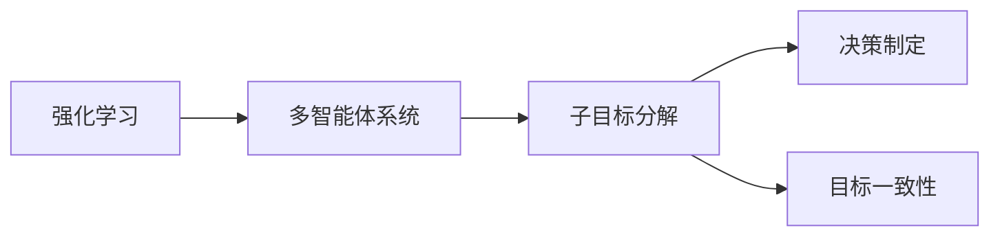

                 

# 子目标分解在 Agent 中的重要性

> 关键词：子目标分解, 代理(Agent), 多智能体系统(Multi-agent System), 强化学习, 决策制定, 分解与组合

## 1. 背景介绍

在现代复杂系统中，特别是智能系统（如自动驾驶、智能机器人、智能电网等）中，一个核心挑战是如何在高度不确定和动态变化的环境中，做出高效的决策。代理（Agent）是这些系统中不可或缺的元素，它们通过观察环境和执行行动，来优化自身的目标。然而，在复杂和多模态环境中，代理的决策制定变得更加困难。近年来，随着强化学习（Reinforcement Learning, RL）的兴起，代理可以在通过与环境的交互中，自动学习和优化决策策略。但强化学习的一个重要局限在于，优化目标往往非常复杂，难以直接在环境中找到最优策略。为此，研究人员提出了一种策略，即将复杂的多目标问题分解成多个子目标，分别进行优化。本文将详细探讨子目标分解在代理中的重要性，并阐述其实现机制、原理及具体应用场景。

## 2. 核心概念与联系

### 2.1 核心概念概述

- **强化学习**：一种基于试错的学习方法，代理通过与环境的交互，根据奖励信号调整策略，以最大化长期累积奖励。

- **多智能体系统**：由多个代理共同组成，它们可以相互协作或竞争，共同影响系统状态的系统。

- **子目标分解**：将复杂的目标问题拆分成若干个子目标，分别进行优化，最终通过组合子目标的解，获得整体问题的最优解。

- **决策制定**：代理在给定环境和当前状态下，选择最优的行动策略。

- **目标一致性**：所有子目标的最终解能够组合成一个整体，实现原目标的功能。

这些核心概念之间的关系可以通过以下Mermaid流程图来展示：



该图展示了强化学习、多智能体系统、子目标分解、决策制定和目标一致性之间的关系。强化学习用于训练代理，多智能体系统是代理共同作用的环境，子目标分解是优化复杂目标的一种策略，决策制定是代理选择行动的过程，目标一致性保证了子目标解的整合性。

### 2.2 概念间的关系

这些核心概念之间存在着紧密的联系，共同构成了代理系统的基本框架。强化学习提供了一种试错学习的机制，多智能体系统描绘了代理间交互的环境，子目标分解策略帮助简化复杂目标，决策制定决定了代理的具体行动，目标一致性确保了所有子目标解的整合性。通过理解这些核心概念及其之间的关系，可以更好地把握代理系统的设计思路和优化策略。

## 3. 核心算法原理 & 具体操作步骤

### 3.1 算法原理概述

子目标分解的核心思想是将复杂的多目标问题拆分为多个易于处理的子目标，分别进行优化。这一过程主要分为两个阶段：目标定义和子目标优化。

**目标定义**：首先需要明确代理需要优化的问题。例如，在自动驾驶中，代理的目标可能包括避免碰撞、保持车道、达到目标地点等。

**子目标优化**：随后，将每个子目标独立地进行优化。在每个子目标的优化过程中，代理会根据当前状态和奖励信号，选择最优的行动策略。这些子目标的解可能包含冲突或冗余，需要进行整合。

### 3.2 算法步骤详解

1. **目标分解**：根据问题的复杂性，将整体目标分解为若干个子目标。例如，在自动驾驶中，可以分解为“避免碰撞”、“保持车道”、“到达目标地点”等子目标。

2. **子目标优化**：对每个子目标单独进行优化，使用强化学习算法（如Q-learning、Deep Q-Networks等）来训练代理，使其在给定状态和奖励信号下，选择最优行动。

3. **整合子目标解**：由于子目标解之间可能存在冲突或冗余，需要通过适当的整合策略，将子目标解组合成一个整体解决方案。常见的整合策略包括权重平均、决策树、逻辑推理等。

4. **决策制定**：最终，代理根据整合后的解，执行最优行动。这一过程通常包括对当前状态的分析，以及对未来状态的预测。

5. **目标一致性检查**：为了确保整合后的解能够实现原目标，代理还需要进行目标一致性检查。如果发现整合后的解与原目标不一致，需要重新调整子目标的权重或优化策略。

### 3.3 算法优缺点

**优点**：
1. **简化复杂问题**：子目标分解可以将复杂的多目标问题拆分为易于处理的子目标，使得代理更容易理解和优化。
2. **灵活性高**：子目标分解策略可以根据问题特点进行调整，具有高度的灵活性。
3. **提高鲁棒性**：通过分解目标，代理可以在一个子目标失败时，通过其他子目标的解进行补偿，增强系统的鲁棒性。

**缺点**：
1. **整合复杂**：子目标解的整合可能涉及复杂的逻辑和算法，增加了实现的难度。
2. **可能导致次优解**：如果子目标解存在冲突，整合后的解可能无法达到整体最优。
3. **数据需求高**：每个子目标的优化需要大量数据，对标注数据的需求较高。

### 3.4 算法应用领域

子目标分解策略在多个领域中具有广泛的应用，特别是在多智能体系统和复杂决策环境中。例如：

- **自动驾驶**：将驾驶任务分解为避障、路径规划、速度控制等多个子目标，分别优化后整合为整体驾驶策略。
- **智能电网**：将电力系统优化分解为负荷平衡、电压稳定、频率调节等多个子目标，实现对电网的有效控制。
- **供应链管理**：将供应链优化分解为库存管理、运输调度、需求预测等多个子目标，提高供应链的效率和稳定性。
- **金融市场**：将投资组合优化分解为风险管理、收益最大化、流动性管理等多个子目标，实现资金的有效配置。

## 4. 数学模型和公式 & 详细讲解 & 举例说明

### 4.1 数学模型构建

假设代理需要优化的问题包含多个子目标 $T_1, T_2, ..., T_n$，每个子目标的优化目标为 $f_i$，其中 $i \in \{1, 2, ..., n\}$。代理在每个子目标 $T_i$ 下的状态为 $s_i$，行动为 $a_i$，奖励信号为 $r_i$。代理的目标是最大化整体目标 $F$，其中 $F = \sum_{i=1}^n w_i f_i$，$w_i$ 为子目标的权重。

子目标分解的数学模型可以表示为：

$$
\max \sum_{i=1}^n w_i f_i
$$

其中 $w_i$ 为子目标 $T_i$ 的权重，$w_i$ 的选择需要根据问题的具体需求进行调整。

### 4.2 公式推导过程

以自动驾驶中“避障”和“保持车道”两个子目标为例，推导子目标优化的数学模型。

设代理的状态为 $s=(x, v)$，其中 $x$ 为位置，$v$ 为速度。代理在每个子目标下的行动为 $a_i$，奖励信号为 $r_i$。避障的目标函数为 $f_1 = \sum_{i=1}^n r_i$，保持车道的目标函数为 $f_2 = \sum_{i=1}^n r_i$。

将两个子目标的奖励信号合并，得到整体目标函数：

$$
F = w_1 f_1 + w_2 f_2
$$

其中 $w_1$ 和 $w_2$ 分别表示避障和保持车道的权重。

### 4.3 案例分析与讲解

假设在自动驾驶中，代理需要在不发生碰撞的情况下，尽快到达目的地。可以将问题分解为“避免碰撞”和“到达目的地”两个子目标，使用强化学习分别优化每个子目标。

**避免碰撞的子目标**：代理需要尽可能避开路障和其他车辆。可以使用Q-learning算法，对每个状态 $s$ 和行动 $a$ 计算 $Q(s, a)$，并根据奖励信号 $r$ 更新 $Q(s, a)$。

**到达目的地的子目标**：代理需要根据当前位置和目标位置，选择最优的行动路径。可以使用深度强化学习算法，如Deep Q-Networks，训练代理在复杂环境中做出最优决策。

## 5. 项目实践：代码实例和详细解释说明

### 5.1 开发环境搭建

在进行代理系统的开发前，需要先搭建好开发环境。以下是在Python中使用OpenAI Gym进行代理系统开发的流程：

1. 安装Gym：
```bash
pip install gym
```

2. 安装Reinforcement Learning库：
```bash
pip install gym[rearrange,trading]
```

3. 安装PyTorch或TensorFlow：
```bash
pip install torch torchvision torchaudio cudatoolkit=11.1 -c pytorch -c conda-forge
# 或
pip install tensorflow
```

4. 安装其他需要的库：
```bash
pip install numpy pandas scikit-learn matplotlib tqdm jupyter notebook ipython
```

完成上述步骤后，即可在Python环境中开始代理系统的开发。

### 5.2 源代码详细实现

以下是一个使用Gym和PyTorch进行子目标分解代理系统开发的示例代码。

```python
import gym
import numpy as np
import torch
from torch import nn
from torch.optim import Adam
from torch.distributions import Categorical

class SubTargetAgent(gym.Wrapper):
    def __init__(self, env, target_weights):
        super().__init__(env)
        self.target_weights = target_weights
        self.state = None
        self.action = None
        self.reward = None
        self.done = False
        self.observation_space = env.observation_space
        self.action_space = env.action_space

    def step(self, action):
        observation, reward, done, info = self.env.step(action)
        self.state = observation
        self.action = action
        self.reward = reward
        self.done = done
        return observation, reward, done, info

    def reset(self):
        self.state = self.env.reset()
        self.action = None
        self.reward = None
        self.done = False
        return self.state

class SubTargetPolicy(nn.Module):
    def __init__(self, state_dim, action_dim, target_weights):
        super().__init__()
        self.target_weights = target_weights
        self.fc1 = nn.Linear(state_dim, 256)
        self.fc2 = nn.Linear(256, action_dim)
        self.softmax = nn.Softmax(dim=1)

    def forward(self, state):
        x = self.fc1(state)
        x = self.fc2(x)
        action_probs = self.softmax(x)
        return action_probs

class SubTargetAgentNet(nn.Module):
    def __init__(self, state_dim, action_dim, target_weights):
        super().__init__()
        self.policy = SubTargetPolicy(state_dim, action_dim, target_weights)
        self.optimizer = Adam(self.policy.parameters(), lr=0.001)

    def forward(self, state):
        return self.policy(state)

    def reset(self):
        self.policy = SubTargetPolicy(state_dim, action_dim, target_weights)

    def step(self, observation):
        action_probs = self.policy(observation)
        action = Categorical(probs=action_probs).sample()
        self.optimizer.zero_grad()
        loss = -np.log(probs[action]) if reward is not None else 0
        loss.backward()
        self.optimizer.step()
        return action
```

在上述代码中，`SubTargetAgent`类是一个基于Gym的代理类，它将子目标分解策略嵌入到代理的决策制定中。`SubTargetPolicy`类是一个用于生成行动概率的神经网络，它将状态作为输入，输出每个子目标的行动概率。`SubTargetAgentNet`类是代理的神经网络，它包含`SubTargetPolicy`，用于训练代理。

### 5.3 代码解读与分析

在上述代码中，我们使用了一个简单的神经网络来实现代理的决策制定。具体步骤如下：

1. 首先定义了一个`SubTargetAgent`类，它继承自Gym的`Wrapper`类，用于包装原始环境。在初始化时，我们传入了目标权重`target_weights`，用于指定每个子目标的优先级。

2. 在`step`方法中，代理根据当前状态和行动，更新状态和奖励，并返回观察值、奖励、是否完成和信息。

3. 在`reset`方法中，代理重置状态，并返回观察值。

4. 定义了一个`SubTargetPolicy`类，用于生成行动概率。它包含两个全连接层和一个softmax函数，用于输出每个子目标的行动概率。

5. 定义了一个`SubTargetAgentNet`类，用于实现代理的神经网络。它包含一个`SubTargetPolicy`对象，并使用Adam优化器来训练代理。

### 5.4 运行结果展示

运行上述代码，我们可以观察到代理在环境中的行为。在实际应用中，代理可以通过与环境的交互，学习如何优化每个子目标，并最终实现整体目标。

例如，在自动驾驶场景中，代理可以通过不断试错，学习如何避开路障和保持车道，最终达到目标地点。

## 6. 实际应用场景

### 6.1 智能电网

在智能电网中，代理需要优化电力系统的运行，包括负荷平衡、电压稳定和频率调节等。这些任务可以分解为多个子目标，分别进行优化。

例如，可以设计一个代理，分别优化每个区域的负荷平衡、电压稳定和频率调节，并通过决策树或逻辑推理等方法，整合这些子目标的解，实现整体电力系统的最优运行。

### 6.2 供应链管理

在供应链管理中，代理需要优化库存管理、运输调度和需求预测等多个子目标。这些任务可以分解为多个独立的子目标，分别进行优化。

例如，可以设计一个代理，分别优化每个供应商的库存管理、运输调度和需求预测，并通过逻辑推理或权重平均等方法，整合这些子目标的解，实现供应链的整体优化。

### 6.3 金融市场

在金融市场中，代理需要优化投资组合的收益和风险管理。这些任务可以分解为多个子目标，分别进行优化。

例如，可以设计一个代理，分别优化投资组合的收益最大化、风险管理和流动性管理，并通过权重平均或决策树等方法，整合这些子目标的解，实现投资组合的优化。

### 6.4 未来应用展望

随着子目标分解技术的不断进步，其在代理系统中的应用将越来越广泛。未来，基于子目标分解的代理系统将会在更多的复杂和多模态环境中发挥重要作用，推动智能系统的智能化和自动化进程。

## 7. 工具和资源推荐

### 7.1 学习资源推荐

为了帮助开发者系统掌握子目标分解在代理中的应用，这里推荐一些优质的学习资源：

1. 《强化学习》书籍：由Richard S. Sutton和Andrew G. Barto合著，全面介绍了强化学习的基本概念和算法。

2. 《多智能体系统》课程：斯坦福大学提供的课程，介绍了多智能体系统理论及其应用。

3. OpenAI Gym官方文档：提供了丰富的环境和代理示例，是学习代理系统开发的必备资源。

4. PyTorch官方文档：提供了PyTorch的使用方法和API参考，是实现代理系统的常用工具。

5. TensorFlow官方文档：提供了TensorFlow的使用方法和API参考，是实现代理系统的另一种常用工具。

6. Coursera和edX等在线课程：提供有关强化学习、多智能体系统和代理系统开发的在线课程，方便初学者入门。

通过对这些资源的学习实践，相信你一定能够快速掌握子目标分解在代理中的应用，并用于解决实际的代理系统问题。

### 7.2 开发工具推荐

高效的工具支持对于代理系统的开发至关重要。以下是几款用于代理系统开发的常用工具：

1. PyTorch：基于Python的开源深度学习框架，提供了强大的计算图功能，适合实现复杂的神经网络。

2. TensorFlow：由Google主导开发的开源深度学习框架，适合大规模工程应用。

3. OpenAI Gym：提供了丰富的环境和代理示例，方便开发者进行代理系统的测试和调试。

4. Weights & Biases：模型训练的实验跟踪工具，可以记录和可视化模型训练过程中的各项指标。

5. TensorBoard：TensorFlow配套的可视化工具，可以实时监测模型训练状态，并提供丰富的图表呈现方式。

6. Jupyter Notebook：交互式编程环境，方便开发者编写和测试代码。

合理利用这些工具，可以显著提升代理系统开发的效率，加快创新迭代的步伐。

### 7.3 相关论文推荐

子目标分解技术的发展得益于学界的持续研究。以下是几篇奠基性的相关论文，推荐阅读：

1. Multi-Agent Planning Based on Domain Decomposition: A Survey（多智能体规划综述）：总结了多智能体系统的规划方法，包括目标分解和决策制定。

2. Decomposition and Composition in Multi-Agent Systems（多智能体系统的分解与组合）：探讨了多智能体系统的分解策略，并提出了一些有效的整合方法。

3. Distributed Multi-Agent Reinforcement Learning（分布式多智能体强化学习）：研究了分布式环境下多智能体系统的强化学习策略，包括目标分解和协同学习。

4. Planning for Multi-Agent Systems Using Hierarchical Task Networks（多智能体系统规划）：提出了一种基于层次任务网络的代理规划方法，用于优化复杂多目标问题。

5. Learning to Plan with Subgoal Functions（学习使用子目标函数规划）：研究了使用子目标函数进行多智能体系统规划的方法，并验证了其有效性。

这些论文代表了大目标分解技术的发展脉络。通过学习这些前沿成果，可以帮助研究者把握学科前进方向，激发更多的创新灵感。

除上述资源外，还有一些值得关注的前沿资源，帮助开发者紧跟子目标分解技术的最新进展，例如：

1. arXiv论文预印本：人工智能领域最新研究成果的发布平台，包括大量尚未发表的前沿工作，学习前沿技术的必读资源。

2. 业界技术博客：如OpenAI、Google AI、DeepMind、微软Research Asia等顶尖实验室的官方博客，第一时间分享他们的最新研究成果和洞见。

3. 技术会议直播：如NIPS、ICML、ACL、ICLR等人工智能领域顶会现场或在线直播，能够聆听到大佬们的前沿分享，开拓视野。

4. GitHub热门项目：在GitHub上Star、Fork数最多的代理系统相关项目，往往代表了该技术领域的发展趋势和最佳实践，值得去学习和贡献。

5. 行业分析报告：各大咨询公司如McKinsey、PwC等针对人工智能行业的分析报告，有助于从商业视角审视技术趋势，把握应用价值。

总之，对于子目标分解技术的学习和实践，需要开发者保持开放的心态和持续学习的意愿。多关注前沿资讯，多动手实践，多思考总结，必将收获满满的成长收益。

## 8. 总结：未来发展趋势与挑战

### 8.1 总结

本文对子目标分解在代理中的应用进行了全面系统的介绍。首先阐述了子目标分解在复杂多目标问题中的重要性，明确了子目标分解在代理系统中的作用。其次，从原理到实践，详细讲解了子目标分解的数学模型、算法步骤及具体实现方法，给出了代理系统开发的完整代码实例。同时，本文还广泛探讨了子目标分解在智能电网、供应链管理、金融市场等多个行业领域的应用前景，展示了其巨大的潜力。此外，本文精选了子目标分解技术的各类学习资源，力求为读者提供全方位的技术指引。

通过本文的系统梳理，可以看到，子目标分解在代理系统中扮演着越来越重要的角色，极大地拓展了代理系统的应用边界，提升了代理系统的性能和鲁棒性。未来，伴随子目标分解技术的不断演进，代理系统将在更多的复杂和多模态环境中发挥作用，推动智能系统的智能化和自动化进程。

### 8.2 未来发展趋势

展望未来，子目标分解技术将呈现以下几个发展趋势：

1. **自适应分解**：未来的代理系统将具备自适应分解能力，根据任务的动态变化自动调整子目标的分解方式，提高系统的灵活性和适应性。

2. **多模态分解**：子目标分解将不仅限于单一模态数据，而是涵盖视觉、语音、文本等多模态数据，增强代理系统的感知能力。

3. **分布式优化**：代理系统将在分布式环境中进行优化，每个子目标可以在不同的节点上并行优化，提高系统的效率和性能。

4. **跨领域整合**：代理系统将能够整合来自不同领域的知识和规则，实现跨领域的多目标优化。

5. **动态重构**：代理系统将具备动态重构能力，根据任务需求和环境变化，动态调整子目标的权重和优化策略，提升系统的鲁棒性和可扩展性。

以上趋势凸显了子目标分解技术在代理系统中的广阔前景。这些方向的探索发展，必将进一步提升代理系统的性能和应用范围，为构建智能系统奠定坚实的基础。

### 8.3 面临的挑战

尽管子目标分解技术已经取得了瞩目成就，但在迈向更加智能化、普适化应用的过程中，它仍面临着诸多挑战：

1. **分解策略的复杂性**：子目标分解策略的设计和实现具有高度的复杂性，需要根据具体任务进行调整，增加了实现的难度。

2. **子目标的冲突**：子目标之间可能存在冲突，整合后的解可能无法达到整体最优，需要通过合理的整合策略来优化。

3. **数据需求高**：每个子目标的优化需要大量数据，对标注数据的需求较高，获取高质量标注数据的成本较高。

4. **计算资源需求高**：代理系统的训练和推理需要大量的计算资源，对硬件设备和算法效率提出了较高的要求。

5. **鲁棒性和可扩展性**：代理系统需要具备高度的鲁棒性和可扩展性，能够在动态变化的环境中高效运行。

6. **安全性**：代理系统需要保证数据和模型的安全性，避免信息泄露和攻击。

正视子目标分解技术面临的这些挑战，积极应对并寻求突破，将使子目标分解技术在未来代理系统中发挥更大的作用。相信随着学界和产业界的共同努力，这些挑战终将一一被克服，子目标分解技术必将在构建智能系统过程中发挥更大的作用。

### 8.4 研究展望

面对子目标分解技术所面临的挑战，未来的研究需要在以下几个方面寻求新的突破：

1. **自动分解算法**：研究自动化的目标分解算法，能够根据任务特点自动确定子目标的分解方式，降低实现难度。

2. **混合分解策略**：结合深度学习、符号推理等技术，提出混合分解策略，增强子目标分解的灵活性和可解释性。

3. **多模态分解技术**：研究多模态数据的分解技术，提高代理系统的感知能力和泛化能力。

4. **跨领域融合**：研究如何将不同领域的知识和规则融合到代理系统中，实现跨领域的多目标优化。

5. **动态优化算法**：研究动态优化算法，能够根据任务需求和环境变化，动态调整子目标的权重和优化策略，提升系统的鲁棒性和可扩展性。

6. **分布式优化技术**：研究分布式优化技术，能够在分布式环境中高效优化代理系统。

这些研究方向将使子目标分解技术更加成熟和高效，为构建智能系统提供更强大的支持。

## 9. 附录：常见问题与解答

**Q1：子目标分解的实现难度大，如何解决？**

A: 子目标分解的实现难度确实较大，需要通过合理的策略和算法来解决。例如，可以使用遗传算法、粒子群优化等启发式算法来设计子目标分解策略，或者结合深度学习和符号推理技术，提出混合分解策略。

**Q2：子目标之间存在冲突，如何整合？**

A: 子目标之间可能存在冲突，需要通过合理的整合策略来解决。例如，可以使用权重平均、决策树、逻辑推理等方法，整合子目标的解，得到整体解决方案。

**Q3：子目标分解需要大量标注数据，如何解决？**

A: 子目标分解需要大量标注数据，可以通过数据增强、迁移学习等方法来解决。数据增强可以通过合成数据、变换数据等方式扩充训练集，迁移学习可以从已有的标注数据中学习知识，减少对新数据的依赖。

**Q4：子目标分解的计算资源需求高，如何解决？**

A: 子目标分解的计算资源需求较高，可以通过分布式计算、模型压缩等方法来优化。分布式计算可以在多台机器上并行计算，提高计算效率，模型压缩可以减小模型的存储和计算需求，降低计算成本。

**Q5：子目标分解的安全性问题如何解决？**

A: 子目标分解的安全性问题可以通过数据加密、访问控制等措施来解决。数据加密可以保护数据的隐私和安全，访问控制可以限制对敏感数据的访问，提高系统的安全性。

总之，子目标分解在代理系统中扮演着越来越重要的角色，具有广阔的应用前景和巨大的潜力。通过合理的策略和算法，以及不断的研究和探索，子目标分解技术必将不断进步，为构建智能系统提供更强大的支持。

