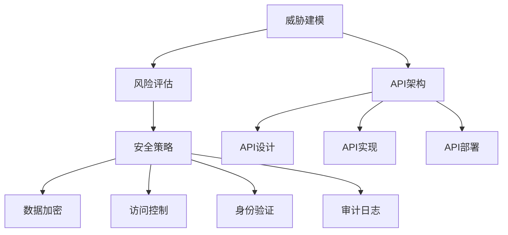

                 

# 安全 API 设计的详细步骤

> 关键词：安全API设计,API安全,Web安全,API架构,威胁建模,风险评估,安全策略,数据加密,访问控制,身份验证,审计日志

## 1. 背景介绍

### 1.1 问题由来
随着互联网的普及和技术的不断发展，API（应用程序接口）在现代应用程序开发中扮演了越来越重要的角色。API不仅连接了不同系统和服务，也成为数据传输和交互的主要方式。然而，API设计中存在的安全漏洞和威胁，可能导致数据泄露、服务中断、财务损失等严重后果。因此，设计安全、可靠的API成为开发者必须重视的任务。

### 1.2 问题核心关键点
在设计API时，安全是一个不可忽视的重要方面。以下列出了安全API设计的核心关键点：
- 威胁建模：识别潜在的安全威胁和漏洞，提前采取防护措施。
- 风险评估：评估API的安全性，识别潜在风险。
- 安全策略：制定并实施一套全面的安全策略，以应对各种安全威胁。
- 数据加密：对传输和存储的数据进行加密，确保数据安全。
- 访问控制：控制谁可以访问API及其具体权限。
- 身份验证：验证用户身份，防止未经授权的访问。
- 审计日志：记录API的使用和操作，便于后续审计和安全分析。

### 1.3 问题研究意义
设计安全API对保障数据安全和应用稳定性具有重要意义：
1. 减少数据泄露风险：通过加密和访问控制等措施，可以显著降低数据泄露的可能性。
2. 提高系统可靠性：安全设计可以增强系统防御能力，防止恶意攻击导致的服务中断。
3. 增强用户信任：安全、可靠的服务可以提升用户的信任度和满意度。
4. 减少法律风险：遵守法律法规，减少因安全问题带来的法律和合规风险。
5. 支持业务创新：通过提供安全的API服务，可以支持业务快速创新和扩展。

## 2. 核心概念与联系

### 2.1 核心概念概述
在设计安全API时，需要理解以下核心概念：

- **API安全（API Security）**：指通过各种技术和策略，确保API的安全性，防止未经授权的访问和数据泄露。
- **Web安全（Web Security）**：指在Web应用程序中保护数据和用户隐私的措施。
- **API架构（API Architecture）**：涉及API的设计、实现和部署，确保其可靠性和安全性。
- **威胁建模（Threat Modeling）**：识别和评估潜在的安全威胁和漏洞。
- **风险评估（Risk Assessment）**：对API的风险进行量化和分析。
- **安全策略（Security Strategy）**：制定和实施一系列安全措施，保障API的安全性。
- **数据加密（Data Encryption）**：通过加密技术保护数据在传输和存储过程中的安全。
- **访问控制（Access Control）**：控制用户对API的访问权限。
- **身份验证（Authentication）**：验证用户身份，防止未授权访问。
- **审计日志（Audit Logging）**：记录API的使用和操作，便于安全分析和审计。

这些概念之间相互关联，共同构成了一个完整的API安全设计框架。以下通过一个Mermaid流程图展示它们之间的关系：



### 2.2 概念间的关系

这些核心概念通过一个完整的流程连接起来，旨在保障API的安全性。以下将详细阐述每个概念的具体内容及其相互关系。

## 3. 核心算法原理 & 具体操作步骤

### 3.1 算法原理概述
设计安全API的算法原理主要包括以下几个方面：
1. **威胁建模**：识别潜在的威胁和漏洞，包括SQL注入、跨站脚本攻击（XSS）、跨站请求伪造（CSRF）等。
2. **风险评估**：通过定性和定量分析，评估API的风险等级，确定需要防护的措施。
3. **安全策略**：制定和实施一系列安全措施，如数据加密、访问控制、身份验证等。
4. **数据加密**：使用对称加密、非对称加密等技术保护数据的传输和存储。
5. **访问控制**：通过身份验证、角色授权等手段，控制用户对API的访问权限。
6. **身份验证**：验证用户的身份，防止未授权访问。
7. **审计日志**：记录API的使用和操作，便于安全分析和审计。

### 3.2 算法步骤详解
以下是一个详细的安全API设计步骤：

**Step 1: 威胁建模**
- 识别API的潜在威胁和漏洞，如SQL注入、XSS、CSRF等。
- 使用威胁建模工具（如OWASP Top 10）对API进行全面分析。
- 制定威胁应对策略，如输入验证、参数化、输出编码等。

**Step 2: 风险评估**
- 量化API的安全风险，使用安全评分系统（如OWASP ASVS）对API进行评估。
- 确定API的弱点，并确定需要采取的防护措施。
- 制定风险缓解策略，如安全架构设计、加密技术应用等。

**Step 3: 安全策略制定**
- 根据威胁建模和风险评估结果，制定全面的安全策略。
- 包括数据加密、访问控制、身份验证等具体措施。
- 确保策略的全面性和可执行性，覆盖API的各个方面。

**Step 4: 数据加密**
- 在传输过程中使用TLS/SSL协议加密数据。
- 在存储过程中使用对称加密或非对称加密技术保护数据。
- 使用数据脱敏技术，避免敏感信息泄露。

**Step 5: 访问控制**
- 实现身份验证机制，如OAuth2、JWT等。
- 使用角色和权限管理系统，控制用户对API的访问权限。
- 实现API的权限级别控制，如读、写、执行等。

**Step 6: 身份验证**
- 实现强密码策略，防止弱密码攻击。
- 使用多因素认证（MFA）增加身份验证的复杂度。
- 实现单点登录（SSO），方便用户访问多个系统。

**Step 7: 审计日志**
- 记录API的使用和操作，包括登录、调用、参数修改等。
- 使用日志管理工具（如ELK Stack）集中管理和分析日志。
- 定期审计日志，发现和解决潜在的安全问题。

### 3.3 算法优缺点
安全API设计的优点包括：
- 提高API的安全性，减少数据泄露和恶意攻击的风险。
- 增强系统的可靠性，确保API的稳定性和可用性。
- 增强用户信任，提升用户体验和满意度。

缺点则包括：
- 设计和实施复杂，需要较高的技术水平。
- 增加开发和运维成本，可能影响API的部署和迭代速度。
- 需要对API进行持续监控和维护，确保其安全性。

### 3.4 算法应用领域
安全API设计在以下领域得到了广泛应用：
- Web API：如电商平台、在线支付等。
- Mobile API：如移动应用、移动支付等。
- IoT API：如智能家居、工业物联网等。
- Cloud API：如云服务、微服务等。

## 4. 数学模型和公式 & 详细讲解 & 举例说明

### 4.1 数学模型构建
在设计安全API时，可以使用以下数学模型进行建模和评估：

1. **安全评分模型**：使用OWASP ASVS（应用程序安全验证标准）对API进行评分，量化其安全风险。
   $$
   R = \sum_{i=1}^n S_i \cdot W_i
   $$
   其中 $R$ 为安全评分，$S_i$ 为单项评分，$W_i$ 为单项权重。

2. **加密强度模型**：使用AES、RSA等算法进行数据加密，计算其强度和安全等级。
   $$
   C = \frac{1}{P} \cdot \log_2(F)
   $$
   其中 $C$ 为加密强度，$P$ 为加密密钥长度，$F$ 为加密算法因子。

3. **访问控制模型**：使用RBAC（基于角色的访问控制）模型进行权限控制，计算API的安全等级。
   $$
   S = \sum_{i=1}^n A_i \cdot W_i
   $$
   其中 $S$ 为安全评分，$A_i$ 为单项访问控制评分，$W_i$ 为单项权重。

### 4.2 公式推导过程
以下详细推导上述数学模型的公式：

**安全评分模型**
1. 使用OWASP ASVS进行单项评分，如输入验证、身份验证、日志记录等。
   $$
   S_1 = \text{Input Validation}
   $$
   $$
   S_2 = \text{Authentication}
   $$
   $$
   S_3 = \text{Logging}
   $$
   ...

2. 根据单项评分计算综合评分 $R$，使用权重 $W_i$ 对每个评分进行加权。
   $$
   R = S_1 \cdot W_1 + S_2 \cdot W_2 + S_3 \cdot W_3 + ...
   $$

**加密强度模型**
1. 使用AES算法进行数据加密，假设密钥长度为128位。
   $$
   P = 128
   $$
2. 计算加密强度 $C$。
   $$
   C = \frac{1}{128} \cdot \log_2(2^{128}) = 128/128 = 1
   $$

**访问控制模型**
1. 使用RBAC模型进行权限控制，假设有三个角色：管理员、普通用户、游客。
   $$
   A_1 = \text{Admin Role Access}
   $$
   $$
   A_2 = \text{User Role Access}
   $$
   $$
   A_3 = \text{Guest Role Access}
   $$
2. 根据单项访问控制评分计算综合评分 $S$。
   $$
   S = A_1 \cdot W_1 + A_2 \cdot W_2 + A_3 \cdot W_3
   $$

### 4.3 案例分析与讲解
以下通过一个实际案例，讲解如何设计和实现一个安全的API。

**案例背景**
某电商平台需要设计一个API，允许用户查询和购买商品，同时保护用户信息和交易数据的安全。

**设计过程**

**Step 1: 威胁建模**
- 识别潜在威胁：SQL注入、XSS、CSRF、暴力破解、DDoS攻击等。
- 使用威胁建模工具，发现并记录潜在漏洞。
- 制定威胁应对策略，如输入验证、输出编码、防止暴力破解等。

**Step 2: 风险评估**
- 量化安全风险，使用OWASP ASVS进行评分。
- 确定API的弱点，如SQL注入漏洞。
- 确定防护措施，如使用参数化查询、输入验证等。

**Step 3: 安全策略制定**
- 制定全面的安全策略，包括数据加密、访问控制、身份验证等。
- 使用TLS/SSL协议加密数据传输。
- 使用OAuth2进行身份验证和授权。

**Step 4: 数据加密**
- 使用AES算法对数据进行加密。
- 对存储在数据库中的敏感信息进行加密。
- 使用数据脱敏技术，避免敏感信息泄露。

**Step 5: 访问控制**
- 实现身份验证机制，如OAuth2、JWT等。
- 使用RBAC模型控制用户访问权限。
- 实现API的权限级别控制，如读、写、执行等。

**Step 6: 身份验证**
- 实现强密码策略，防止弱密码攻击。
- 使用多因素认证（MFA）增加身份验证的复杂度。
- 实现单点登录（SSO），方便用户访问多个系统。

**Step 7: 审计日志**
- 记录API的使用和操作，包括登录、调用、参数修改等。
- 使用日志管理工具，集中管理和分析日志。
- 定期审计日志，发现和解决潜在的安全问题。

## 5. 项目实践：代码实例和详细解释说明

### 5.1 开发环境搭建

以下是使用Python进行Flask框架开发的安全API代码实现。

**Step 1: 安装Flask和相关依赖**

```bash
pip install Flask flask-restful
```

**Step 2: 创建API项目**

创建一个名为 `api` 的Python项目，包含 `app.py` 和 `models.py` 文件。

### 5.2 源代码详细实现

以下是Flask框架下实现安全API的代码实现。

**app.py**

```python
from flask import Flask, request
from flask_restful import Resource, Api
from models import User, db

app = Flask(__name__)
api = Api(app)

# 数据库初始化
db.init_app(app)

# 路由设置
api.add_resource(SignUp, '/api/signup')
api.add_resource(Login, '/api/login')
api.add_resource(GetUser, '/api/user/<id>')

if __name__ == '__main__':
    app.run(debug=True)
```

**models.py**

```python
from flask_sqlalchemy import SQLAlchemy
from werkzeug.security import generate_password_hash, check_password_hash

db = SQLAlchemy()

class User(db.Model):
    id = db.Column(db.Integer, primary_key=True)
    username = db.Column(db.String(50), unique=True, nullable=False)
    password_hash = db.Column(db.String(100), nullable=False)

    def set_password(self, password):
        self.password_hash = generate_password_hash(password)

    def check_password(self, password):
        return check_password_hash(self.password_hash, password)
```

### 5.3 代码解读与分析

**app.py**

- `app.py` 是Flask应用的核心文件，包含API的路由和数据库初始化。
- `api` 是Flask-RESTful的API对象，用于管理资源路由。
- `app.run(debug=True)` 启动应用，设置调试模式。

**models.py**

- `models.py` 包含API的模型定义，使用SQLAlchemy进行数据库操作。
- `User` 模型定义了用户的基本信息，包括用户名、密码等。
- `set_password` 方法用于加密用户密码。
- `check_password` 方法用于验证用户密码。

### 5.4 运行结果展示

启动应用后，可以通过`http://localhost:5000`访问API接口。

**注册接口**

```python
@app.route('/api/signup', methods=['POST'])
def signup():
    data = request.get_json()
    username = data['username']
    password = data['password']
    
    user = User(username=username)
    user.set_password(password)
    
    db.session.add(user)
    db.session.commit()
    
    return jsonify({'message': 'User created successfully'})

```

**登录接口**

```python
@app.route('/api/login', methods=['POST'])
def login():
    data = request.get_json()
    username = data['username']
    password = data['password']
    
    user = User.query.filter_by(username=username).first()
    if user and user.check_password(password):
        return jsonify({'token': generate_jwt_token(user.id)})
    else:
        return jsonify({'message': 'Invalid credentials'})

```

**获取用户信息接口**

```python
@app.route('/api/user/<id>', methods=['GET'])
def get_user(id):
    user = User.query.get(id)
    if user:
        return jsonify(user.to_json())
    else:
        return jsonify({'message': 'User not found'})

```

以上代码展示了Flask框架下实现安全API的基本流程。通过定义模型和路由，实现了用户注册、登录和信息获取等功能，同时通过SQLAlchemy进行数据库操作，确保了数据的安全性。

## 6. 实际应用场景

### 6.1 智能客服系统

在智能客服系统中，API的安全性至关重要。用户输入的敏感信息（如姓名、身份证号等）需要严格保护，防止数据泄露。API的设计需要考虑以下几点：

**身份验证**
- 实现OAuth2或JWT机制，确保用户身份的真实性和合法性。
- 使用多因素认证（MFA）增加身份验证的安全性。

**数据加密**
- 使用TLS/SSL协议加密API的通信数据。
- 对存储在数据库中的敏感信息进行加密存储。

**访问控制**
- 使用RBAC模型控制用户的访问权限，确保用户只能访问其权限范围内的功能。
- 实现API的权限级别控制，如读、写、执行等。

**审计日志**
- 记录用户的API操作，包括登录、调用、参数修改等。
- 定期审计日志，发现和解决潜在的安全问题。

### 6.2 金融系统

在金融系统中，API的安全性直接关系到用户资金的安全和系统的稳定性。API的设计需要考虑以下几点：

**身份验证**
- 实现OAuth2或JWT机制，确保用户身份的真实性和合法性。
- 使用多因素认证（MFA）增加身份验证的安全性。

**数据加密**
- 使用TLS/SSL协议加密API的通信数据。
- 对存储在数据库中的敏感信息进行加密存储。

**访问控制**
- 使用RBAC模型控制用户的访问权限，确保用户只能访问其权限范围内的功能。
- 实现API的权限级别控制，如读、写、执行等。

**审计日志**
- 记录用户的API操作，包括登录、调用、参数修改等。
- 定期审计日志，发现和解决潜在的安全问题。

### 6.3 物联网系统

在物联网系统中，API的安全性直接关系到系统的稳定性和用户的安全。API的设计需要考虑以下几点：

**身份验证**
- 实现OAuth2或JWT机制，确保设备身份的真实性和合法性。
- 使用多因素认证（MFA）增加身份验证的安全性。

**数据加密**
- 使用TLS/SSL协议加密API的通信数据。
- 对存储在数据库中的敏感信息进行加密存储。

**访问控制**
- 使用RBAC模型控制设备的访问权限，确保设备只能访问其权限范围内的功能。
- 实现API的权限级别控制，如读、写、执行等。

**审计日志**
- 记录设备的API操作，包括登录、调用、参数修改等。
- 定期审计日志，发现和解决潜在的安全问题。

## 7. 工具和资源推荐

### 7.1 学习资源推荐

为了帮助开发者系统掌握安全API设计的理论基础和实践技巧，以下是一些推荐的资源：

1. **OWASP Top 10**：官网提供的安全威胁清单，包含常见安全漏洞的详细介绍和防御措施。
   [OWASP Top 10](https://owasp.org/www-project-top-ten/)

2. **OWASP ASVS**：应用程序安全验证标准，提供API安全验证的评分系统。
   [OWASP ASVS](https://owasp.org/www-project-application-security-verdict-systems/)

3. **Flask-RESTful官方文档**：Flask-RESTful库的官方文档，包含API开发的最佳实践。
   [Flask-RESTful官方文档](https://flask-restful.readthedocs.io/en/stable/)

4. **Flask官方文档**：Flask框架的官方文档，包含API开发的详细指南。
   [Flask官方文档](https://flask.palletsprojects.com/en/2.x/)

5. **SQLAlchemy官方文档**：SQLAlchemy库的官方文档，包含数据库操作的详细指南。
   [SQLAlchemy官方文档](https://docs.sqlalchemy.org/en/14/)

### 7.2 开发工具推荐

以下是一些用于安全API开发的常用工具：

1. **Flask**：基于Python的轻量级Web框架，适合快速开发API。
   [Flask官网](https://flask.palletsprojects.com/)

2. **Flask-RESTful**：基于Flask的RESTful API扩展，提供RESTful API开发的便捷工具。
   [Flask-RESTful官网](https://flask-restful.readthedocs.io/)

3. **SQLAlchemy**：Python数据库操作库，支持多种数据库。
   [SQLAlchemy官网](https://docs.sqlalchemy.org/)

4. **JWT**：JSON Web Token库，用于实现API的身份验证和授权。
   [JWT官网](https://jwt.io/)

5. **SQLAlchemy**：Python数据库操作库，支持多种数据库。
   [SQLAlchemy官网](https://docs.sqlalchemy.org/)

### 7.3 相关论文推荐

以下是几篇关于API安全设计的经典论文，推荐阅读：

1. **OWASP Top 10**：OWASP官方发布的十大Web安全威胁。
   [OWASP Top 10](https://owasp.org/www-project-top-ten/)

2. **OWASP ASVS**：应用程序安全验证标准，提供API安全验证的评分系统。
   [OWASP ASVS](https://owasp.org/www-project-application-security-verdict-systems/)

3. **API Security Design Patterns**：RFC文档，提供API安全设计的模式和最佳实践。
   [RFC API Security Design Patterns](https://tools.ietf.org/html/rfc7301)

4. **Secure Web APIs**：IEEE会议论文，介绍Web API安全设计的技术和策略。
   [Secure Web APIs](https://ieeexplore.ieee.org/document/9002443)

5. **Designing Secure Web Services**：IBM技术报告，提供Web服务安全设计的指导。
   [Designing Secure Web Services](https://www.ibm.com/blogs/research/2007/10/designing-secure-web-services/)

## 8. 总结：未来发展趋势与挑战

### 8.1 总结

本文对安全API设计的原理和操作步骤进行了全面系统的介绍。首先阐述了API安全设计的重要性，明确了威胁建模、风险评估、安全策略、数据加密、访问控制、身份验证、审计日志等核心概念。其次，从理论到实践，详细讲解了安全API设计的数学模型和算法步骤，给出了具体的代码实现。同时，本文还广泛探讨了安全API在智能客服、金融系统、物联网等多个行业领域的应用前景，展示了安全API设计的巨大潜力。最后，本文精选了相关资源，力求为读者提供全方位的技术指引。

通过本文的系统梳理，可以看到，安全API设计是保障API安全性的重要手段，对保护数据和系统安全具有重要意义。设计安全API需要综合考虑威胁建模、风险评估、安全策略、数据加密、访问控制、身份验证和审计日志等多个方面，才能确保API的安全性。

### 8.2 未来发展趋势

展望未来，API安全设计将呈现以下几个发展趋势：

1. **人工智能辅助安全设计**：利用AI技术，自动化识别和处理API中的安全漏洞，提升安全设计的效率和准确性。
2. **零信任安全架构**：实施零信任模型，确保用户身份和数据的安全，减少攻击面。
3. **容器化和云原生安全**：在容器化、云原生环境中，实施细粒度的访问控制和安全策略。
4. **多因素认证和身份验证**：使用多因素认证（MFA）和单点登录（SSO），提升身份验证的安全性。
5. **分布式安全和微分段**：在分布式系统中，实施微分段和安全策略，确保数据和系统的隔离和保护。
6. **区块链和加密技术**：利用区块链和加密技术，确保数据的安全性和完整性。

这些趋势凸显了API安全设计的不断进步和创新，为保障API安全提供了更多的技术手段和策略。

### 8.3 面临的挑战

尽管API安全设计已经取得了一定的进展，但在迈向更加智能化、普适化应用的过程中，仍面临以下挑战：

1. **安全设计复杂度增加**：随着API功能的不断扩展，安全设计的复杂度也随之增加，需要更高的技术水平和资源投入。
2. **安全漏洞频发**：API的漏洞种类繁多，新的安全威胁不断出现，安全设计需要不断更新和优化。
3. **数据隐私保护**：API涉及大量用户数据，数据隐私保护成为关键问题，需要制定严格的隐私保护策略。
4. **合规性挑战**：不同的国家和地区对数据保护有不同的法律和规定，API的合规性设计需要考虑到这些差异。
5. **资源消耗**：实施安全策略会带来一定的资源消耗，如加密、认证、审计等，需要权衡资源和安全的平衡。

### 8.4 研究展望

面对API安全设计所面临的挑战，未来的研究需要在以下几个方面寻求新的突破：

1. **自动化安全测试和修复**：开发自动化的安全测试工具，发现并修复API中的安全漏洞。
2. **轻量级安全设计**：开发轻量级的安全策略和机制，提高API的性能和可扩展性。
3. **分布式安全架构**：设计适用于分布式系统的安全架构，保障数据和系统的安全性。
4. **区块链和加密技术**：探索区块链和加密技术在API安全设计中的应用，提升数据的安全性和完整性。
5. **隐私保护技术**：开发隐私保护技术，确保用户数据的隐私和安全。

这些研究方向的探索，必将引领API安全设计迈向更高的台阶，为构建安全、可靠、可控的API系统铺平道路。面向未来，API安全设计还需要与其他安全技术进行更深入的融合，如网络安全、应用安全、设备安全等，多路径协同发力，共同推动API安全系统的进步。

## 9. 附录：常见问题与解答

**Q1：API安全设计需要考虑哪些方面？**

A: API安全设计需要考虑以下几个方面：
1. 威胁建模：识别潜在的威胁和漏洞，提前采取防护措施。
2. 风险评估：量化API的安全风险，确定需要防护的措施。
3

