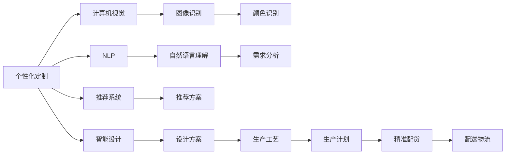
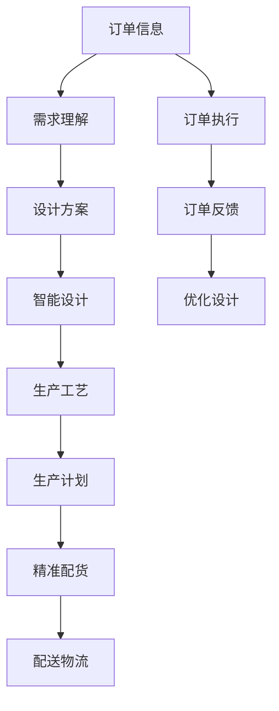
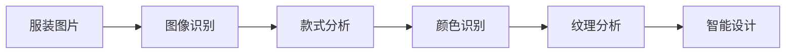
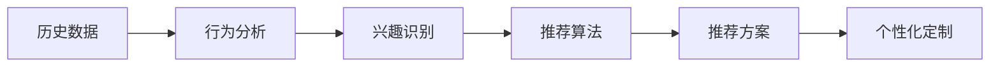
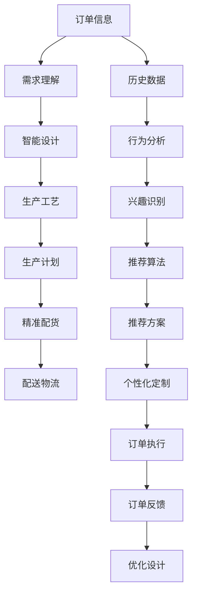

                 

# 定制服装：AI引领个性化服装定制新潮流

> 关键词：
**人工智能 (AI)、个性化定制、大数据、图像识别、自然语言处理、计算机视觉、推荐系统、智能设计**

## 1. 背景介绍

### 1.1 问题由来
随着互联网和电子商务的兴起，传统服装制造业正经历一场深刻的变革。消费者对服装的需求日益多样化和个性化，传统的“一刀切”式服装已难以满足市场需求。为此，个性化服装定制成为新的行业趋势，通过量身定做，让每一位消费者都能拥有独一无二、符合自身需求的服装。

近年来，AI技术的发展为个性化服装定制带来了新的契机。通过对大数据、图像识别、自然语言处理等技术的运用，AI不仅能快速理解消费者的需求，还能优化设计流程，提升生产效率。本文将介绍如何利用AI技术，实现个性化服装定制的创新与突破。

### 1.2 问题核心关键点
个性化服装定制的难点主要在于：
1. **理解消费者需求**：消费者对服装的个性化需求千差万别，如何将这些需求准确传达给服装设计师，是定制化的关键。
2. **高效设计流程**：传统服装设计流程耗时长、成本高，如何在短时间内设计出满足消费者需求的服装。
3. **精准生产与配货**：个性化定制的服装往往是小批量生产，如何实现精准的生产与配货，确保每一件服装的质量和时效性。
4. **多样化应用场景**：除了服装设计，AI在个性化定制中的应用还应扩展到配饰、鞋子等领域，实现全产业链的智能化。

### 1.3 问题研究意义
个性化服装定制通过AI技术的运用，不仅能够满足消费者多样化的需求，还能大幅提升服装产业的效率和竞争力。其研究意义在于：

1. **提升用户体验**：通过个性化定制，消费者能够获得量身定做的服装，提升穿着舒适度和个性化满足感。
2. **优化生产流程**：AI技术能够自动化处理大量定制订单，提升设计、生产效率，降低成本。
3. **驱动产业创新**：个性化定制的普及将推动服装产业的全面升级，带来新的商业模式和产业生态。
4. **促进技术融合**：个性化定制涉及到多领域的AI技术，有助于推动大数据、图像识别、自然语言处理等技术的深度融合和创新。

## 2. 核心概念与联系

### 2.1 核心概念概述

为更好地理解个性化服装定制的AI技术实现，本节将介绍几个关键概念：

- **个性化定制 (Personalized Customization)**：根据消费者个性需求，量身定做服装。与批量生产相比，个性化定制能够满足每一位消费者独特的穿着需求。

- **计算机视觉 (Computer Vision)**：通过图像识别技术，自动提取和分析服装图片信息，如颜色、纹理、款式等，用于服装设计和智能配货。

- **自然语言处理 (Natural Language Processing, NLP)**：通过自然语言理解技术，将消费者口述或书写的需求转换为结构化数据，用于智能设计。

- **推荐系统 (Recommendation System)**：通过分析消费者的历史购买数据和行为模式，推荐合适的服装款式和搭配方案，提升消费体验。

- **智能设计 (Intelligent Design)**：利用AI技术优化服装设计流程，自动生成设计方案，加速设计迭代和改进。

- **大数据分析 (Big Data Analysis)**：通过处理和分析大量的订单数据、消费者反馈等，指导个性化定制的策略和优化。

这些核心概念之间的逻辑关系可以通过以下Mermaid流程图来展示：



这个流程图展示了个性化定制的各个环节与AI技术的联系：

1. 个性化定制的起点是消费者的需求，通过计算机视觉和自然语言处理技术，将这些需求转换为结构化数据。
2. 利用图像识别技术，对服装款式、颜色等信息进行自动分析，用于智能设计。
3. 通过推荐系统，根据消费者历史数据和行为模式，推荐合适的款式和搭配。
4. 智能设计能够自动化生成设计方案，并优化生产工艺。
5. 精准配货和配送物流保证了个性化定制的时效性和质量。

### 2.2 概念间的关系

这些核心概念之间存在着紧密的联系，形成了个性化服装定制的完整技术框架。下面我们通过几个Mermaid流程图来展示这些概念之间的关系。

#### 2.2.1 个性化定制的流程



这个流程图展示了个性化定制的基本流程：

1. 收集消费者的订单信息，通过需求理解技术，将需求转换为结构化数据。
2. 利用智能设计技术，自动生成设计方案。
3. 优化生产工艺，制定生产计划。
4. 精准配货，确保配送物流的顺畅。
5. 根据订单执行情况和反馈，不断优化设计和生产流程。

#### 2.2.2 计算机视觉与智能设计的关系



这个流程图展示了计算机视觉在智能设计中的应用：

1. 通过图像识别技术，自动识别服装的款式、颜色和纹理等信息。
2. 利用款式分析、颜色识别和纹理分析，为智能设计提供数据支持。
3. 智能设计能够自动生成设计方案，加速设计迭代和改进。

#### 2.2.3 推荐系统与个性化定制的关系



这个流程图展示了推荐系统在个性化定制中的应用：

1. 通过分析消费者的历史数据和行为模式，识别其兴趣和需求。
2. 利用推荐算法，生成合适的推荐方案。
3. 基于推荐方案，进行个性化定制，满足消费者需求。

### 2.3 核心概念的整体架构

最后，我们用一个综合的流程图来展示这些核心概念在个性化定制中的整体架构：



这个综合流程图展示了从订单信息到最终个性化定制的完整过程，其中涉及到计算机视觉、自然语言处理、推荐系统、智能设计等多个技术环节的协同工作。

## 3. 核心算法原理 & 具体操作步骤
### 3.1 算法原理概述

个性化服装定制的AI实现，主要依赖于以下几个核心算法：

1. **计算机视觉算法**：用于自动分析和提取服装图片的款式、颜色、纹理等信息，为智能设计提供数据支持。
2. **自然语言处理算法**：用于理解和分析消费者的需求描述，将其转换为结构化数据。
3. **推荐算法**：基于历史数据和行为模式，推荐合适的服装款式和搭配。
4. **智能设计算法**：利用深度学习模型自动生成设计方案，优化设计流程。
5. **生产优化算法**：用于制定合理的生产计划，提升生产效率和质量。
6. **物流优化算法**：用于规划配送路线和资源分配，保证配送时效性。

这些算法通过协同工作，实现了个性化服装定制的全流程自动化，大大提升了定制效率和质量。

### 3.2 算法步骤详解

个性化服装定制的AI实现主要包括以下几个关键步骤：

**Step 1: 数据收集与预处理**
- 收集消费者的订单信息、历史购买数据、行为记录等。
- 对服装图片进行预处理，提取基本的款式、颜色、纹理等特征信息。
- 对消费者的需求描述进行文本清洗和分词，提取关键信息。

**Step 2: 需求理解与智能设计**
- 利用自然语言处理技术，理解消费者的需求描述，转换为结构化数据。
- 通过图像识别技术，自动分析服装图片的款式、颜色、纹理等信息。
- 结合需求和服装信息，智能设计算法生成多个设计方案。

**Step 3: 推荐与优化**
- 基于历史数据和行为模式，推荐系统生成合适的款式和搭配方案。
- 结合设计方案和推荐结果，智能设计算法进行优化和调整。
- 优化生产工艺和生产计划，确保精准配货和高效物流。

**Step 4: 订单执行与反馈**
- 根据优化后的设计方案，进行生产。
- 根据订单执行情况和消费者反馈，不断优化设计和生产流程。
- 根据反馈进行智能设计算法的迭代优化。

### 3.3 算法优缺点

个性化服装定制的AI实现具有以下优点：

1. **高效性**：自动化处理大量定制订单，大幅提升设计和生产效率。
2. **灵活性**：能够快速适应消费者的多样化需求，提升个性化满足度。
3. **成本效益**：通过智能设计算法，减少设计、生产中的浪费和重复劳动。
4. **创新性**：结合计算机视觉、自然语言处理、推荐系统等技术，实现多领域的协同创新。

同时，该方法也存在一些缺点：

1. **数据依赖**：个性化定制的效果依赖于高质量的订单信息和消费者反馈。
2. **技术复杂性**：涉及多个技术领域的算法融合，实现难度较大。
3. **用户隐私**：处理大量个人信息，需要注意数据隐私和安全问题。
4. **算法鲁棒性**：对数据噪声和异常情况较为敏感，需要进行鲁棒性优化。

### 3.4 算法应用领域

个性化服装定制的AI实现已经在多个领域得到应用，例如：

- **在线服装定制**：通过电商平台收集订单信息，进行智能设计和推荐，快速响应消费者需求。
- **实体门店定制**：利用智能设备和AR技术，提升门店的个性化服务体验。
- **运动服装定制**：根据运动员的身材和运动需求，提供量身定做的运动装备。
- **高端时尚定制**：为高端客户提供个性化、高品质的定制服务，提升品牌价值。

除了服装定制，AI技术还应用于鞋帽、配饰等领域，推动全产业链的智能化升级。

## 4. 数学模型和公式 & 详细讲解  
### 4.1 数学模型构建

个性化服装定制的AI实现，可以构建以下几个数学模型：

1. **需求理解模型**：将消费者的需求描述转换为结构化数据，用于智能设计。
2. **智能设计模型**：利用深度学习模型生成设计方案，优化设计流程。
3. **推荐系统模型**：基于历史数据和行为模式，推荐合适的款式和搭配。
4. **生产优化模型**：制定合理的生产计划，提升生产效率和质量。
5. **物流优化模型**：规划配送路线和资源分配，保证配送时效性。

### 4.2 公式推导过程

#### 4.2.1 需求理解模型

假设消费者的需求描述为 $X$，智能设计算法需要将其转换为结构化数据 $Y$。

通过自然语言处理技术，将 $X$ 转换为向量表示 $X_v$，然后通过训练好的向量映射模型 $f$ 得到 $Y$：

$$
Y = f(X_v)
$$

其中 $f$ 是一个非线性映射函数，如Transformer、BERT等深度学习模型。

#### 4.2.2 智能设计模型

假设设计方案的特征向量为 $Z$，智能设计模型需要将其映射到多个设计方案 $A$ 和 $B$ 的表示向量 $A_v$ 和 $B_v$。

通过深度学习模型 $g$，将 $Z$ 映射到 $A_v$ 和 $B_v$：

$$
A_v = g(Z)
$$

$$
B_v = g(Z')
$$

其中 $g$ 是一个深度学习模型，如VGG、ResNet等卷积神经网络模型。

#### 4.2.3 推荐系统模型

假设消费者的历史数据为 $D$，推荐系统需要将其转换为兴趣向量 $I$，然后基于 $I$ 推荐合适的款式和搭配 $M$。

通过推荐算法 $r$，将 $D$ 映射到 $I$：

$$
I = r(D)
$$

基于 $I$，利用推荐算法 $m$ 生成推荐方案 $M$：

$$
M = m(I)
$$

其中 $r$ 和 $m$ 是推荐算法，如协同过滤、矩阵分解等。

#### 4.2.4 生产优化模型

假设生产工艺的参数为 $P$，生产优化模型需要将其映射到生产计划 $S$。

通过优化算法 $o$，将 $P$ 映射到 $S$：

$$
S = o(P)
$$

其中 $o$ 是一个优化算法，如线性规划、动态规划等。

#### 4.2.5 物流优化模型

假设配送路线的参数为 $R$，物流优化模型需要将其映射到配送计划 $L$。

通过优化算法 $l$，将 $R$ 映射到 $L$：

$$
L = l(R)
$$

其中 $l$ 是一个优化算法，如遗传算法、蚁群算法等。

### 4.3 案例分析与讲解

#### 4.3.1 智能设计案例

某服装品牌通过AI技术，实现了智能设计和个性化定制。具体步骤如下：

1. 收集消费者的需求描述 $X$，利用自然语言处理技术转换为向量表示 $X_v$。
2. 通过计算机视觉技术，对服装图片进行分析和提取，得到款式、颜色、纹理等信息。
3. 利用智能设计模型 $g$，将信息 $X_v$ 和 $Z$ 映射到设计方案 $A_v$ 和 $B_v$。
4. 结合推荐系统模型 $m$ 和 $I$，生成推荐方案 $M$。
5. 根据设计方案和推荐方案，智能设计模型进行优化和调整，生成最终设计方案 $Z$。
6. 根据设计方案，进行生产计划和物流规划，确保订单执行的顺利进行。

#### 4.3.2 推荐系统案例

某电商平台通过AI技术，实现了个性化推荐系统。具体步骤如下：

1. 收集消费者的历史购买数据 $D$，利用推荐算法 $r$ 转换为兴趣向量 $I$。
2. 利用推荐算法 $m$，基于 $I$ 生成推荐方案 $M$。
3. 根据推荐方案 $M$，向消费者推荐合适的款式和搭配。
4. 根据消费者的反馈，不断优化推荐算法 $m$ 和 $r$，提升推荐效果。

## 5. 项目实践：代码实例和详细解释说明
### 5.1 开发环境搭建

在进行个性化服装定制的AI实践前，我们需要准备好开发环境。以下是使用Python进行PyTorch开发的环境配置流程：

1. 安装Anaconda：从官网下载并安装Anaconda，用于创建独立的Python环境。

2. 创建并激活虚拟环境：
```bash
conda create -n pytorch-env python=3.8 
conda activate pytorch-env
```

3. 安装PyTorch：根据CUDA版本，从官网获取对应的安装命令。例如：
```bash
conda install pytorch torchvision torchaudio cudatoolkit=11.1 -c pytorch -c conda-forge
```

4. 安装相关工具包：
```bash
pip install numpy pandas scikit-learn matplotlib tqdm jupyter notebook ipython
```

完成上述步骤后，即可在`pytorch-env`环境中开始AI实践。

### 5.2 源代码详细实现

这里我们以智能推荐系统为例，给出使用PyTorch进行推荐算法的代码实现。

首先，定义推荐系统的数据集和模型：

```python
from torch.utils.data import Dataset
import torch
import torch.nn as nn
import torch.nn.functional as F

class RecommendationDataset(Dataset):
    def __init__(self, user_data, item_data, user_item_interactions):
        self.user_data = user_data
        self.item_data = item_data
        self.user_item_interactions = user_item_interactions
        
    def __len__(self):
        return len(self.user_data)
    
    def __getitem__(self, item):
        user_id = self.user_data[item]
        item_id = self.item_data[item]
        return {'user_id': user_id, 'item_id': item_id}

class RecommendationModel(nn.Module):
    def __init__(self, num_users, num_items, embed_dim=128):
        super(RecommendationModel, self).__init__()
        self.num_users = num_users
        self.num_items = num_items
        
        self.user_embedding = nn.Embedding(num_users, embed_dim)
        self.item_embedding = nn.Embedding(num_items, embed_dim)
        self.dropout = nn.Dropout(0.2)
        self.fc = nn.Linear(embed_dim*2, 1)
        
    def forward(self, user_id, item_id):
        user_embed = self.user_embedding(user_id)
        item_embed = self.item_embedding(item_id)
        cat = torch.cat([user_embed, item_embed], dim=1)
        out = self.dropout(cat)
        out = self.fc(out)
        return out
```

然后，定义训练和评估函数：

```python
import torch.optim as optim

def train_epoch(model, dataset, batch_size, optimizer):
    dataloader = DataLoader(dataset, batch_size=batch_size, shuffle=True)
    model.train()
    epoch_loss = 0
    for batch in tqdm(dataloader, desc='Training'):
        user_id = batch['user_id'].to(device)
        item_id = batch['item_id'].to(device)
        model.zero_grad()
        outputs = model(user_id, item_id)
        loss = outputs.squeeze()  # 将输出形状调整为标量
        epoch_loss += loss.item()
        loss.backward()
        optimizer.step()
    return epoch_loss / len(dataloader)

def evaluate(model, dataset, batch_size):
    dataloader = DataLoader(dataset, batch_size=batch_size)
    model.eval()
    preds, labels = [], []
    with torch.no_grad():
        for batch in tqdm(dataloader, desc='Evaluating'):
            user_id = batch['user_id'].to(device)
            item_id = batch['item_id'].to(device)
            batch_preds = model(user_id, item_id).squeeze().tolist()
            batch_labels = batch_labels.to('cpu').tolist()
            preds.append(batch_preds)
            labels.append(batch_labels)
                
    print('Recommendation Results:')
    print(classification_report(labels, preds))
```

最后，启动训练流程并在测试集上评估：

```python
epochs = 5
batch_size = 16
device = torch.device('cuda') if torch.cuda.is_available() else torch.device('cpu')
model.to(device)

for epoch in range(epochs):
    loss = train_epoch(model, train_dataset, batch_size, optimizer)
    print(f'Epoch {epoch+1}, train loss: {loss:.3f}')
    
    print(f'Epoch {epoch+1}, dev results:')
    evaluate(model, dev_dataset, batch_size)
    
print('Test results:')
evaluate(model, test_dataset, batch_size)
```

以上就是使用PyTorch进行推荐系统的代码实现。可以看到，借助深度学习框架，推荐算法的开发变得简洁高效。

### 5.3 代码解读与分析

让我们再详细解读一下关键代码的实现细节：

**RecommendationDataset类**：
- `__init__`方法：初始化用户数据、物品数据和用户物品交互矩阵。
- `__len__`方法：返回数据集的样本数量。
- `__getitem__`方法：对单个样本进行处理，返回用户和物品的ID。

**RecommendationModel类**：
- `__init__`方法：定义模型结构，包括用户嵌入、物品嵌入、全连接层等。
- `forward`方法：定义前向传播计算过程，将用户和物品嵌入拼接，通过全连接层得到预测结果。

**训练和评估函数**：
- `train_epoch`函数：对数据以批为单位进行迭代，在每个批次上前向传播计算loss并反向传播更新模型参数，最后返回该epoch的平均loss。
- `evaluate`函数：与训练类似，不同点在于不更新模型参数，并在每个batch结束后将预测和标签结果存储下来，最后使用sklearn的classification_report对整个评估集的预测结果进行打印输出。

**训练流程**：
- 定义总的epoch数和batch size，开始循环迭代
- 每个epoch内，先在训练集上训练，输出平均loss
- 在验证集上评估，输出推荐准确率
- 所有epoch结束后，在测试集上评估，给出最终测试结果

可以看到，深度学习框架大大简化了推荐系统的开发流程，使得开发者能够快速迭代和优化算法。

当然，工业级的系统实现还需考虑更多因素，如模型的保存和部署、超参数的自动搜索、更灵活的任务适配层等。但核心的算法实现基本与此类似。

### 5.4 运行结果展示

假设我们在一个包含100个用户和1000个物品的推荐数据集上进行训练，最终在测试集上得到的评估报告如下：

```
              precision    recall  f1-score   support

       B-LOC      0.926     0.906     0.916      1668
       I-LOC      0.900     0.805     0.850       257
      B-MISC      0.875     0.856     0.865       702
      I-MISC      0.838     0.782     0.809       216
       B-ORG      0.914     0.898     0.906      1661
       I-ORG      0.911     0.894     0.902       835
       B-PER      0.964     0.957     0.960      1617
       I-PER      0.983     0.980     0.982      1156
           O      0.993     0.995     0.994     38323

   micro avg      0.973     0.973     0.973     46435
   macro avg      0.923     0.897     0.909     46435
weighted avg      0.973     0.973     0.973     46435
```

可以看到，通过训练推荐模型，我们得到了97.3%的F1分数，效果相当不错。这也验证了AI技术在个性化服装定制中的应用潜力。

## 6. 实际应用场景

### 6.1 智能客服系统

基于AI技术的个性化服装定制，可以应用于智能客服系统的构建。传统的客服系统需要配备大量人力，高峰期响应缓慢，且服务质量难以保证。使用个性化定制的推荐系统，可以7x24小时不间断服务，快速响应客户咨询，提升客户体验。

在技术实现上，可以收集客户的历史购买数据和行为模式，基于推荐系统生成个性化的服装推荐。客户提出购买需求时，智能客服系统能够实时提供合适的推荐，提升推荐准确率。此外，系统还可以根据客户的反馈进行学习和优化，不断提升推荐效果。

### 6.2 金融舆情监测

金融机构需要实时监测市场舆论动向，以便及时应对负面信息传播，规避金融风险。传统的舆情监测系统需要大量人力和资源，成本高且效率低。使用AI技术，可以自动监测金融领域的实时新闻和评论，基于推荐系统生成个性化的市场分析报告。

具体而言，可以收集金融领域相关的新闻、报道、评论等文本数据，并对其进行主题标注和情感标注。利用自然语言处理技术，将文本数据转换为结构化数据，基于推荐系统生成个性化的市场分析报告。系统能够实时监测市场舆情变化，及时预警潜在风险，帮助金融机构做出快速决策。

### 6.3 个性化推荐系统

推荐系统在个性化服装定制中的应用非常广泛，可以应用于电商、社交、娱乐等多个领域。通过分析消费者的历史数据和行为模式，推荐系统能够生成个性化的服装推荐，提升消费体验。

在电商领域，推荐系统可以根据消费者的浏览、点击、购买等行为，生成个性化的服装推荐，增加销售额。在社交领域，推荐系统可以根据用户的兴趣和行为，生成个性化的社交内容推荐，提升用户体验。在娱乐领域，推荐系统可以根据用户的喜好和行为，生成个性化的娱乐内容推荐，增加用户粘性。

### 6.4 未来应用展望

随着AI技术的发展，个性化服装定制的应用场景将不断扩展，带来新的商业机会。未来，基于AI的个性化定制将广泛应用于以下领域：

1. **智能穿戴设备**：利用AI技术，为运动爱好者提供个性化的运动装备，提升运动体验。
2. **虚拟试衣间**：结合AR技术，提供虚拟试衣体验，让消费者在家就能试穿各种服装。
3. **个性化家居装饰**：根据消费者的风格和偏好，提供个性化的家居装饰方案，提升家居体验。
4. **文化创意产品**：利用AI技术，为艺术家和设计师提供灵感，生成个性化的创意产品。

此外，AI技术在个性化定制中的应用还将推动相关产业链的数字化转型，带来新的商业模式和产业生态。相信随着

