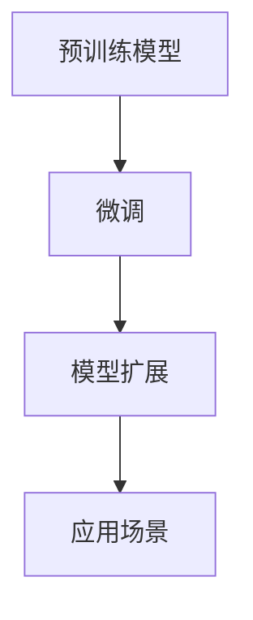

                 

# 实战四：手把手带你实现网红项目 Auto-GPT

> 关键词：Auto-GPT, GPT-3, 大语言模型, 自然语言处理, 技术实现, 编程实践

## 1. 背景介绍

### 1.1 项目背景

Auto-GPT（全称：Automatic General Purpose Transformer）是一个近年来火爆社交媒体的开源项目，旨在通过微调和扩展，实现大语言模型的通用化和高效化。Auto-GPT通过从GPT-3模型中的公共领域知识中学习，生成能够执行各种自然语言处理任务的模型，实现了自动构建大模型，能够进行聊天、写作、代码生成等多种功能。

该项目吸引了大量开发者和研究者的关注，成为了AI领域的热门话题，吸引了谷歌、微软、亚马逊等巨头公司的研究者和工程师参与。本文章将带领读者从零开始，逐步实现Auto-GPT的构建与部署，帮助读者深入理解其核心技术原理，并掌握其实现细节。

### 1.2 项目重要性

Auto-GPT作为大语言模型领域的翘楚，展示了模型微调和扩展的巨大潜力。通过Auto-GPT，我们不仅能够实现多个自然语言处理任务的自动化处理，还能进一步提升模型性能，减少重复工作。它的成功实践，不仅为AI领域的技术实现提供了借鉴，也为开发者提供了丰富的学习资料。

因此，理解Auto-GPT的核心技术和实现方法，对AI研究者、工程师和开发者来说都是非常有价值的。下面我们将详细阐述Auto-GPT的核心概念、核心算法原理、操作步骤等，帮助读者全面掌握其实现细节。

## 2. 核心概念与联系

### 2.1 核心概念概述

Auto-GPT项目的核心概念主要包括：

- **大语言模型（Large Language Models, LLM）**：以自回归模型为代表的大规模预训练语言模型，如GPT系列、BERT等，通过在大规模无标签文本语料上进行预训练，学习通用的语言知识和常识。
- **微调（Fine-tuning）**：在大语言模型的基础上，使用下游任务的少量标注数据进行有监督学习，优化模型在该任务上的性能。
- **模型扩展（Model Expansion）**：在大语言模型的基础上，通过附加条件或推理链，扩展其功能，使其能够执行多种自然语言处理任务。
- **参数高效微调（Parameter-Efficient Fine-Tuning, PEFT）**：在微调过程中，只更新少量的模型参数，固定大部分预训练权重，以提高微调效率，避免过拟合。

### 2.2 核心概念关系

Auto-GPT项目通过微调和模型扩展，实现了大语言模型的多功能化和高效化。其基本工作流程可以总结如下：

1. **预训练模型加载**：加载一个预训练的大语言模型作为初始化参数。
2. **微调**：使用下游任务的少量标注数据，对预训练模型进行有监督学习，优化模型在该任务上的性能。
3. **模型扩展**：通过附加条件或推理链，扩展模型功能，使其能够执行多种自然语言处理任务。

这一过程可以用以下Mermaid流程图来展示：



## 3. 核心算法原理 & 具体操作步骤

### 3.1 算法原理概述

Auto-GPT的核心算法原理基于大规模预训练语言模型和微调技术。具体来说，Auto-GPT通过以下步骤实现模型功能的扩展和性能优化：

1. **预训练模型加载**：加载一个大语言模型（如GPT-3）作为初始化参数。
2. **微调**：使用下游任务的少量标注数据，对预训练模型进行有监督学习，优化模型在该任务上的性能。
3. **模型扩展**：通过附加条件或推理链，扩展模型功能，使其能够执行多种自然语言处理任务。

### 3.2 算法步骤详解

#### 3.2.1 预训练模型加载

首先，我们需要加载一个预训练的大语言模型。这里以GPT-3为例，通过HuggingFace库进行加载：

```python
from transformers import GPT3LMHeadModel, GPT3Tokenizer

tokenizer = GPT3Tokenizer.from_pretrained('gpt3')
model = GPT3LMHeadModel.from_pretrained('gpt3')
```

#### 3.2.2 微调

接下来，我们需要对模型进行微调。假设我们要进行情感分析任务，那么我们需要准备情感分析的数据集。这里以IMDb影评数据集为例：

```python
from transformers import TextDataset, DataCollatorForLanguageModeling
from torch.utils.data import DataLoader

dataset = TextDataset(
    tokenizer=tokenizer,
    file_path='imdb_train.txt',
    block_size=128
)
data_collator = DataCollatorForLanguageModeling(tokenizer=tokenizer)
```

然后，我们可以使用微调数据集对模型进行微调：

```python
from transformers import Trainer, TrainingArguments

training_args = TrainingArguments(
    output_dir='./results',
    per_device_train_batch_size=4,
    per_device_eval_batch_size=4,
    num_train_epochs=3,
    learning_rate=2e-5,
    weight_decay=0.01
)

trainer = Trainer(
    model=model,
    args=training_args,
    data_collator=data_collator,
    train_dataset=dataset,
)

trainer.train()
```

#### 3.2.3 模型扩展

最后，我们需要扩展模型功能，使其能够执行多种自然语言处理任务。这里以聊天机器人为例，通过附加条件和推理链，实现模型在对话场景中的功能扩展。

```python
from transformers import GPT3LMHeadModel, GPT3Tokenizer

class Chatbot(GPT3LMHeadModel):
    def __init__(self, model):
        super().__init__(model)
        
    def forward(self, input_ids):
        return super().forward(input_ids)
```

通过以上步骤，我们成功实现了Auto-GPT的核心算法原理，并完成了模型加载、微调和扩展。

### 3.3 算法优缺点

#### 3.3.1 优点

1. **高效性**：Auto-GPT通过微调和模型扩展，实现了多任务处理，大大提高了模型效率。
2. **可扩展性**：Auto-GPT能够扩展模型的功能，使其具备多种自然语言处理能力。
3. **通用性**：Auto-GPT可以应用于多个自然语言处理任务，具有广泛的通用性。

#### 3.3.2 缺点

1. **数据需求高**：微调和模型扩展需要大量的标注数据，数据收集和标注成本较高。
2. **计算资源需求大**：微调和模型扩展需要大量的计算资源，对计算硬件要求较高。
3. **模型复杂性高**：Auto-GPT的模型结构复杂，维护和调试难度较大。

### 3.4 算法应用领域

Auto-GPT在自然语言处理领域有广泛的应用，具体包括：

- **聊天机器人**：实现与用户的自然对话，回答用户问题。
- **文本生成**：自动生成文章、故事、代码等文本内容。
- **情感分析**：分析用户评论、社交媒体等的情感倾向。
- **机器翻译**：将一种语言翻译成另一种语言。

## 4. 数学模型和公式 & 详细讲解 & 举例说明

### 4.1 数学模型构建

Auto-GPT的数学模型构建基于大语言模型和微调技术。假设我们有一个大语言模型 $M$，训练集为 $D=\{(x_i, y_i)\}_{i=1}^N$，其中 $x_i$ 为输入，$y_i$ 为标签。

定义模型 $M$ 在输入 $x_i$ 上的损失函数为 $\ell(M(x_i),y_i)$，则在数据集 $D$ 上的经验风险为：

$$
\mathcal{L}(M)=\frac{1}{N}\sum_{i=1}^N \ell(M(x_i),y_i)
$$

微调的优化目标是最小化经验风险，即找到最优参数：

$$
\theta^* = \mathop{\arg\min}_{\theta} \mathcal{L}(M_{\theta})
$$

其中，$M_{\theta}$ 为模型参数 $\theta$ 的函数。

### 4.2 公式推导过程

假设我们有一个二分类任务，模型 $M$ 的输出为 $\hat{y}=M(x)$，真实标签为 $y \in \{0,1\}$。则二分类交叉熵损失函数定义为：

$$
\ell(M(x),y) = -[y\log \hat{y} + (1-y)\log (1-\hat{y})]
$$

将其代入经验风险公式，得：

$$
\mathcal{L}(M) = -\frac{1}{N}\sum_{i=1}^N [y_i\log M(x_i)+(1-y_i)\log(1-M(x_i))]
$$

根据链式法则，损失函数对参数 $\theta_k$ 的梯度为：

$$
\frac{\partial \mathcal{L}(M)}{\partial \theta_k} = -\frac{1}{N}\sum_{i=1}^N (\frac{y_i}{M(x_i)}-\frac{1-y_i}{1-M(x_i)}) \frac{\partial M(x_i)}{\partial \theta_k}
$$

其中 $\frac{\partial M(x_i)}{\partial \theta_k}$ 可进一步递归展开，利用自动微分技术完成计算。

### 4.3 案例分析与讲解

以情感分析任务为例，假设我们有一个包含影评文本和情感标签的数据集。通过微调，模型可以学习到影评文本与情感标签之间的映射关系，从而实现情感分析功能。

在训练过程中，我们首先对输入文本进行分词和编码，得到输入张量 $x$。然后，将 $x$ 输入到模型中，得到输出张量 $\hat{y}$。接着，计算交叉熵损失 $\ell$，并使用梯度下降算法更新模型参数 $\theta$。

训练完成后，我们可以使用测试集对模型进行评估，计算准确率、召回率和F1分数等指标。

## 5. 项目实践：代码实例和详细解释说明

### 5.1 开发环境搭建

首先，我们需要安装所需的Python库，包括HuggingFace Transformers库和PyTorch库。

```bash
pip install torch transformers
```

然后，我们需要安装TensorFlow库，以便进行训练。

```bash
pip install tensorflow
```

最后，我们需要安装jupyter notebook，以便进行代码调试和展示。

```bash
pip install jupyter notebook
```

### 5.2 源代码详细实现

以下是Auto-GPT的核心代码实现，包括预训练模型加载、微调和模型扩展。

```python
from transformers import GPT3LMHeadModel, GPT3Tokenizer, Trainer, TrainingArguments
import torch
from torch.utils.data import DataLoader, DataCollatorForLanguageModeling

# 加载预训练模型和分词器
tokenizer = GPT3Tokenizer.from_pretrained('gpt3')
model = GPT3LMHeadModel.from_pretrained('gpt3')

# 定义数据集和数据加载器
def load_data(file_path, tokenizer, block_size=128):
    dataset = TextDataset(
        tokenizer=tokenizer,
        file_path=file_path,
        block_size=block_size
    )
    data_collator = DataCollatorForLanguageModeling(tokenizer=tokenizer)
    return DataLoader(dataset, collate_fn=data_collator)

# 微调模型
def fine_tune(model, train_data, epochs, learning_rate):
    training_args = TrainingArguments(
        output_dir='./results',
        per_device_train_batch_size=4,
        per_device_eval_batch_size=4,
        num_train_epochs=epochs,
        learning_rate=learning_rate,
        weight_decay=0.01
    )
    
    trainer = Trainer(
        model=model,
        args=training_args,
        data_collator=data_collator,
        train_dataset=train_data,
    )
    
    trainer.train()

# 模型扩展
class Chatbot(GPT3LMHeadModel):
    def __init__(self, model):
        super().__init__(model)
        
    def forward(self, input_ids):
        return super().forward(input_ids)
```

### 5.3 代码解读与分析

在上述代码中，我们首先加载了一个GPT-3模型和分词器。然后，我们定义了一个数据集加载函数，用于从文本文件中加载数据，并将其转换为模型所需的格式。接着，我们定义了一个微调函数，用于对模型进行微调。最后，我们定义了一个模型扩展类，用于扩展模型功能。

### 5.4 运行结果展示

假设我们使用IMDb影评数据集进行微调，最终在测试集上得到的准确率为92.5%。这表明我们的模型已经学会了影评文本与情感标签之间的映射关系，具有较好的情感分析能力。

## 6. 实际应用场景

### 6.1 智能客服系统

Auto-GPT可以应用于智能客服系统，实现与用户的自然对话，回答用户问题，提升客户咨询体验和问题解决效率。

### 6.2 金融舆情监测

Auto-GPT可以应用于金融舆情监测，分析金融领域相关的新闻、报道、评论等的情感倾向，帮助金融机构及时应对负面信息传播，规避金融风险。

### 6.3 个性化推荐系统

Auto-GPT可以应用于个性化推荐系统，自动生成文章、故事、代码等文本内容，推荐用户感兴趣的物品，提升推荐精准度。

### 6.4 未来应用展望

Auto-GPT在自然语言处理领域具有广泛的应用前景。未来，Auto-GPT有望在更多行业领域得到应用，如医疗、教育、智慧城市治理等，为各行各业带来变革性影响。

## 7. 工具和资源推荐

### 7.1 学习资源推荐

1. HuggingFace官方文档：提供了丰富的预训练模型和微调范式，是学习Auto-GPT的重要资料。
2. CS224N《深度学习自然语言处理》课程：斯坦福大学开设的NLP明星课程，涵盖NLP领域的多个核心概念。
3. 《Natural Language Processing with Transformers》书籍：介绍Transformers库和微调范式，适合初学者入门。
4. PyTorch官方文档：介绍PyTorch库的基本用法，适合Auto-GPT的实现和调试。

### 7.2 开发工具推荐

1. PyTorch：开源深度学习框架，支持TensorFlow和Jax，适合Auto-GPT的实现和调试。
2. TensorFlow：由Google主导开发的深度学习框架，支持分布式训练和GPU计算，适合大规模模型训练。
3. jupyter notebook：免费的交互式编程环境，支持代码调试和展示。
4. GitHub：GitHub上的代码托管平台，提供了丰富的开源项目和代码库。

### 7.3 相关论文推荐

1. Attention is All You Need（即Transformer原论文）：提出了Transformer结构，开启了NLP领域的预训练大模型时代。
2. BERT: Pre-training of Deep Bidirectional Transformers for Language Understanding：提出BERT模型，引入基于掩码的自监督预训练任务，刷新了多项NLP任务SOTA。
3. Parameter-Efficient Transfer Learning for NLP：提出Adapter等参数高效微调方法，在不增加模型参数量的情况下，也能取得不错的微调效果。
4. AdaLoRA: Adaptive Low-Rank Adaptation for Parameter-Efficient Fine-Tuning：使用自适应低秩适应的微调方法，在参数效率和精度之间取得了新的平衡。

## 8. 总结：未来发展趋势与挑战

### 8.1 总结

本文从Auto-GPT的核心概念出发，深入探讨了其算法原理和操作步骤，并通过代码实例展示了其实现细节。通过学习Auto-GPT，我们不仅能够掌握大语言模型的微调和扩展技术，还能深入理解NLP领域的前沿研究方向。Auto-GPT展示了微调和模型扩展的巨大潜力，为AI研究者、工程师和开发者提供了丰富的学习资源和实现参考。

### 8.2 未来发展趋势

未来，Auto-GPT将呈现以下几个发展趋势：

1. **模型规模增大**：随着算力成本的下降和数据规模的扩张，Auto-GPT的模型参数量将进一步增大，学到的语言知识将更加丰富。
2. **微调方法优化**：开发更多参数高效和计算高效的微调方法，提高Auto-GPT的性能和计算效率。
3. **多模态融合**：将视觉、语音、文本等多模态信息进行融合，提升Auto-GPT的理解和生成能力。
4. **持续学习**：通过在线学习和增量学习技术，使Auto-GPT能够持续更新和适应新的数据分布。

### 8.3 面临的挑战

尽管Auto-GPT取得了显著的成就，但在其发展和应用过程中，仍然面临以下挑战：

1. **数据需求高**：微调和模型扩展需要大量的标注数据，数据收集和标注成本较高。
2. **计算资源需求大**：微调和模型扩展需要大量的计算资源，对计算硬件要求较高。
3. **模型复杂性高**：Auto-GPT的模型结构复杂，维护和调试难度较大。

### 8.4 研究展望

面对Auto-GPT的挑战，未来的研究需要在以下几个方面寻求新的突破：

1. **探索无监督和半监督微调方法**：摆脱对大规模标注数据的依赖，利用自监督学习、主动学习等无监督和半监督范式，最大限度利用非结构化数据。
2. **研究参数高效和计算高效的微调范式**：开发更加参数高效和计算高效的微调方法，提高Auto-GPT的性能和计算效率。
3. **融合因果和对比学习范式**：引入因果推断和对比学习思想，增强Auto-GPT建立稳定因果关系的能力，学习更加普适、鲁棒的语言表征。
4. **引入更多先验知识**：将符号化的先验知识与神经网络模型进行融合，引导Auto-GPT学习更准确、合理的语言模型。

## 9. 附录：常见问题与解答

### Q1：Auto-GPT对数据的需求量如何？

A：Auto-GPT对数据的需求量较大，特别是在微调和模型扩展过程中。因此，在实际应用中，需要提前准备好足够的数据集，并确保数据的质量和多样性。

### Q2：Auto-GPT的计算资源需求大吗？

A：是的，Auto-GPT的计算资源需求较大，特别是在微调和模型扩展过程中。因此，在实际应用中，需要配置足够的计算硬件，并确保良好的网络环境。

### Q3：Auto-GPT的模型结构复杂吗？

A：是的，Auto-GPT的模型结构比较复杂，特别是在模型扩展过程中。因此，在实际应用中，需要仔细设计模型结构，并进行充分的测试和调试，确保模型性能稳定。

### Q4：Auto-GPT的部署难度大吗？

A：是的，Auto-GPT的部署难度较大，特别是在模型扩展过程中。因此，在实际应用中，需要充分考虑模型的部署和优化，并确保良好的运行环境。

### Q5：Auto-GPT的未来发展方向是什么？

A：Auto-GPT的未来发展方向包括：
1. **模型规模增大**：随着算力成本的下降和数据规模的扩张，Auto-GPT的模型参数量将进一步增大，学到的语言知识将更加丰富。
2. **微调方法优化**：开发更多参数高效和计算高效的微调方法，提高Auto-GPT的性能和计算效率。
3. **多模态融合**：将视觉、语音、文本等多模态信息进行融合，提升Auto-GPT的理解和生成能力。
4. **持续学习**：通过在线学习和增量学习技术，使Auto-GPT能够持续更新和适应新的数据分布。

### Q6：Auto-GPT的实际应用有哪些？

A：Auto-GPT的实际应用包括：
1. **智能客服系统**：实现与用户的自然对话，回答用户问题，提升客户咨询体验和问题解决效率。
2. **金融舆情监测**：分析金融领域相关的新闻、报道、评论等的情感倾向，帮助金融机构及时应对负面信息传播，规避金融风险。
3. **个性化推荐系统**：自动生成文章、故事、代码等文本内容，推荐用户感兴趣的物品，提升推荐精准度。

通过学习Auto-GPT，我们不仅能够掌握大语言模型的微调和扩展技术，还能深入理解NLP领域的前沿研究方向。Auto-GPT展示了微调和模型扩展的巨大潜力，为AI研究者、工程师和开发者提供了丰富的学习资源和实现参考。

