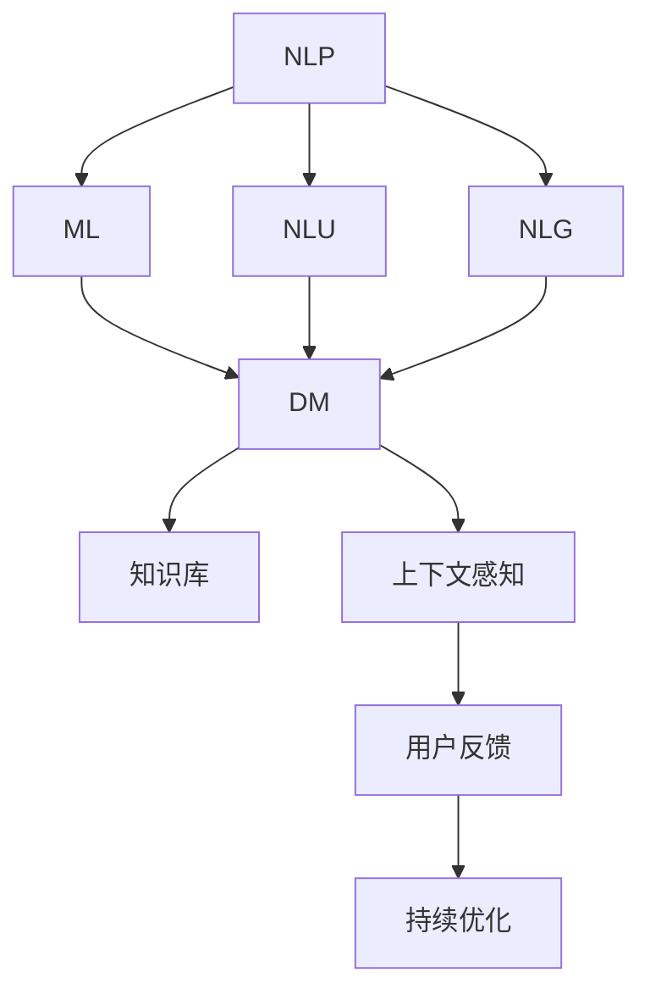
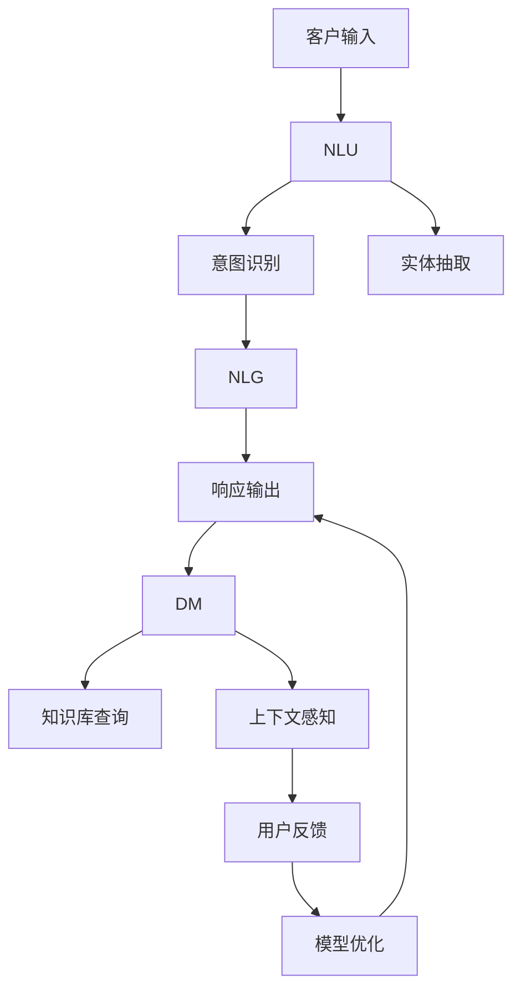

                 

# 实时客户服务：AI代理的响应式工作流

> 关键词：
1. 实时客户服务
2. AI代理
3. 响应式工作流
4. 对话系统
5. 自然语言处理(NLP)
6. 机器学习
7. 客户服务自动化

## 1. 背景介绍

在数字化转型的大潮中，客户服务已成为企业在市场中竞争的关键因素之一。然而，随着客户对服务质量要求的提高，企业面临的服务量迅速增加，传统的客服模式逐渐显得力不从心。人工智能（AI）技术，尤其是自然语言处理（NLP）和机器学习（ML），为解决这一问题提供了新思路。

### 1.1 问题由来

客户服务部门是企业与客户沟通的主要窗口，但传统客服模式往往效率低下、服务质量参差不齐。许多企业尝试通过招聘大量客服人员来提升服务水平，但这不仅成本高昂，还存在人力不足、轮班安排复杂等问题。因此，引入AI客服机器人成为一种解决之道。

AI客服机器人通过理解客户问题，自动生成和传递相关解决方案，在提升服务效率的同时，也减轻了人工客服的工作负担。然而，AI客服机器人如何更好地理解客户意图，生成准确且有效的响应，是实现高效实时客户服务的关键。

### 1.2 问题核心关键点

AI客服机器人实现高效实时客户服务的核心关键点在于：
- **自然语言理解（NLU）**：准确理解客户意图和问题。
- **自然语言生成（NLG）**：生成自然流畅、语义准确的响应。
- **对话管理**：维护上下文一致性，引导对话进行。
- **知识库**：提供相关知识作为响应依据。
- **上下文感知**：根据对话历史生成个性化响应。
- **用户反馈**：持续学习和优化，提升服务质量。

这些关键点构成了AI客服机器人响应式工作流的核心架构，其目标是通过智能化的交互，提供更高效、更个性化的客户服务体验。

### 1.3 问题研究意义

研究AI客服机器人的响应式工作流，对于提升客户服务效率、降低运营成本、增强客户满意度具有重要意义：

1. **提升服务效率**：通过自动处理常见问题，减轻人工客服的工作量，提高服务响应速度。
2. **降低运营成本**：减少客服人员数量，优化人力资源配置。
3. **增强客户满意度**：提供24/7不间断服务，减少等待时间，提升服务质量。
4. **数据驱动决策**：通过分析用户反馈，持续优化模型，提高服务效果。
5. **增强竞争力**：通过智能客服提升品牌形象，吸引更多客户。

## 2. 核心概念与联系

### 2.1 核心概念概述

为更好地理解AI客服机器人响应式工作流，本节将介绍几个密切相关的核心概念：

- **自然语言处理（NLP）**：涉及计算机理解和生成自然语言的能力，是AI客服机器人实现语言理解的基础。
- **机器学习（ML）**：通过数据驱动的方式，使模型能够学习并改进预测能力。
- **自然语言理解（NLU）**：指计算机对自然语言进行语义理解，如意图识别、实体抽取等。
- **自然语言生成（NLG）**：指计算机根据输入生成自然流畅的语言输出。
- **对话管理（DM）**：通过维护对话历史和状态，管理对话流程，确保对话的连贯性和逻辑性。
- **知识库**：存储和检索与特定主题相关的信息，供机器人响应时参考。
- **上下文感知（CC）**：指机器人能够根据对话历史生成个性化响应，保持对话一致性。
- **用户反馈（FB）**：通过用户对机器人响应的反馈，持续优化模型，提升服务质量。

这些核心概念通过互动和协作，共同构成了AI客服机器人响应式工作流的全貌，使其能够在实时客户服务中发挥重要作用。

### 2.2 概念间的关系

这些核心概念之间存在着紧密的联系，形成了AI客服机器人响应式工作流的完整生态系统。下面我通过一个Mermaid流程图来展示这些概念之间的关系：



这个流程图展示了大语言模型微调过程中各个核心概念的关系：

1. NLP将机器学习和自然语言处理技术融合，使计算机能够理解和生成自然语言。
2. NLU和NLG分别对应自然语言理解与生成，用于处理客户输入和生成机器人的输出。
3. DM通过对话管理，确保对话连贯性和逻辑性。
4. 知识库提供信息支持，帮助机器人生成准确的响应。
5. 上下文感知基于对话历史，生成个性化响应。
6. 用户反馈用于持续优化模型，提高服务质量。

通过这些概念的相互作用，AI客服机器人能够实现高效的实时客户服务。

### 2.3 核心概念的整体架构

最后，我们用一个综合的流程图来展示这些核心概念在大语言模型微调过程中的整体架构：



这个综合流程图展示了AI客服机器人响应式工作流的过程：

1. 客户输入通过NLU处理，识别意图和实体。
2. 意图和实体被用于生成NLG响应。
3. 响应经过DM处理，维护对话历史和状态。
4. 响应根据知识库查询进行补充，确保信息的准确性。
5. 上下文感知生成个性化响应，保持对话连贯性。
6. 用户反馈用于持续优化模型，提升服务质量。

通过这些流程图，我们可以更清晰地理解AI客服机器人响应式工作流中各个概念的关系和作用，为后续深入讨论具体的技术细节奠定基础。

## 3. 核心算法原理 & 具体操作步骤

### 3.1 算法原理概述

AI客服机器人响应式工作流的核心算法原理，在于通过深度学习模型和自然语言处理技术，实现对客户输入的自然语言理解，并生成相应的自然语言输出。其基本流程包括：

1. **自然语言理解（NLU）**：通过训练好的模型，理解客户的输入意图和实体信息。
2. **意图识别**：将客户输入映射到预定义的意图类别，如查询、投诉、建议等。
3. **实体抽取**：从客户输入中识别出重要的实体信息，如产品名称、日期等。
4. **自然语言生成（NLG）**：根据意图和实体信息，生成自然流畅、语义准确的响应。
5. **对话管理（DM）**：通过维护对话历史，确保响应的一致性和连贯性。
6. **知识库查询**：根据对话上下文和实体信息，从知识库中检索相关信息。
7. **上下文感知（CC）**：根据对话历史，生成个性化响应，增强用户满意度。
8. **用户反馈（FB）**：通过用户对响应的反馈，持续优化模型，提升服务质量。

### 3.2 算法步骤详解

下面是AI客服机器人响应式工作流的详细步骤：

**Step 1: 准备数据集和模型**

- **数据集**：收集和整理客户服务对话数据，包括客户输入、意图标签、实体信息等。
- **模型**：选择或训练适合的深度学习模型，如基于RNN的序列模型、Transformer模型等。

**Step 2: 意图识别和实体抽取**

- **意图识别**：将客户输入映射到预定义的意图类别，使用分类器（如CNN、RNN等）进行训练。
- **实体抽取**：从客户输入中抽取实体信息，使用命名实体识别（NER）技术进行训练。

**Step 3: 自然语言生成（NLG）**

- **响应生成**：根据意图和实体信息，生成自然流畅的响应。可以使用基于模板的生成方式或基于Transformer的生成方式。
- **对话管理**：根据对话历史，调整生成响应的策略，确保对话一致性和逻辑性。

**Step 4: 知识库查询**

- **信息检索**：根据对话上下文和实体信息，从知识库中检索相关信息，使用向量检索或文本检索等技术。
- **信息融合**：将检索结果与生成响应相结合，提供更加全面和准确的信息。

**Step 5: 上下文感知（CC）**

- **历史分析**：分析对话历史，识别出客户的偏好和习惯。
- **个性化生成**：根据历史分析和当前意图，生成个性化响应，增强用户满意度。

**Step 6: 用户反馈（FB）**

- **反馈收集**：收集用户对生成响应的反馈，如满意度、清晰度等。
- **模型优化**：根据用户反馈，持续优化模型，提升响应质量。

**Step 7: 部署和监控**

- **模型部署**：将训练好的模型部署到生产环境，提供实时客户服务。
- **性能监控**：实时监控模型的性能，如响应时间、准确率等，及时发现和解决异常问题。

### 3.3 算法优缺点

AI客服机器人响应式工作流具有以下优点：

1. **高效性**：通过自动化处理常见问题，大幅提升服务效率，减少人工客服的工作量。
2. **一致性**：基于深度学习模型，提供一致的响应，减少人为差异。
3. **个性化**：通过上下文感知，生成个性化响应，提升用户体验。
4. **灵活性**：模型可以根据用户反馈持续优化，提高服务质量。

同时，该方法也存在一些缺点：

1. **成本高**：构建和维护深度学习模型需要较高的技术门槛和计算资源。
2. **复杂度**：涉及多个模块的协调，技术实现复杂。
3. **泛化能力有限**：模型的性能依赖于训练数据的质量和数量，难以泛化到未见过的场景。
4. **依赖知识库**：模型的响应效果依赖于知识库的完备性，需定期更新。

### 3.4 算法应用领域

AI客服机器人响应式工作流已经在多个领域得到了广泛应用，例如：

1. **客户支持**：自动处理客户咨询和投诉，提升客户满意度。
2. **销售咨询**：自动回答客户的销售问题，促进销售转化。
3. **技术支持**：自动解答技术问题，提升客户体验。
4. **健康咨询**：自动解答健康问题，提供初步诊断建议。
5. **金融服务**：自动处理金融咨询和投诉，提升客户信任。
6. **旅行服务**：自动解答旅行相关问题，提供个性化的旅行建议。

除了上述这些经典应用外，AI客服机器人还正在拓展到更多场景中，如智能家居、智能物流、智能客服等，为各行各业带来更高效、更智能的客户服务体验。

## 4. 数学模型和公式 & 详细讲解

### 4.1 数学模型构建

在本节中，我们将使用数学语言对AI客服机器人响应式工作流进行更加严格的刻画。

记客户输入为 $x$，输出为 $y$，知识库信息为 $k$，上下文历史为 $c$。假设意图识别模型为 $I$，实体抽取模型为 $E$，自然语言生成模型为 $G$，对话管理模型为 $D$，知识库查询模型为 $K$，上下文感知模型为 $C$。

则响应生成过程可以表示为：

$$
y = G(I(x), E(x), k, c)
$$

其中，$I(x)$ 表示意图识别模型，$E(x)$ 表示实体抽取模型，$k$ 表示知识库信息，$c$ 表示上下文历史。响应生成模型 $G$ 可以是基于模板的生成方式或基于Transformer的生成方式。

### 4.2 公式推导过程

以下我们以基于Transformer的生成方式为例，推导响应生成模型的公式。

假设输入 $x$ 为句子 $s$，意图标签为 $t$，实体信息为 $r$，知识库信息为 $k$，上下文历史为 $c$。响应生成模型 $G$ 可以表示为：

$$
G(s, t, r, k, c) = \text{Encoder}(s, t) + \text{Decoder}(r, k, c)
$$

其中，$\text{Encoder}(s, t)$ 表示意图识别和实体抽取的编码器部分，$\text{Decoder}(r, k, c)$ 表示自然语言生成的解码器部分。

响应生成模型 $G$ 的具体计算过程如下：

1. **编码器部分**：将输入 $x$ 通过Transformer编码器进行处理，输出语义表示 $h$。
2. **意图和实体表示**：将意图标签 $t$ 和实体信息 $r$ 转换为向量表示，与语义表示 $h$ 进行拼接，得到意图和实体表示 $h'$。
3. **解码器部分**：将意图和实体表示 $h'$ 和知识库信息 $k$ 进行拼接，输入到Transformer解码器中进行生成，最终输出响应 $y$。

### 4.3 案例分析与讲解

假设我们有一个客户咨询健康问题的例子：

**输入**：“我头疼得厉害，需要看医生吗？”

**意图识别**：将客户输入映射到“健康咨询”类别。

**实体抽取**：从客户输入中抽取实体信息“头疼”。

**知识库查询**：从知识库中检索相关信息，如“头疼可能是感冒引起的”。

**响应生成**：根据意图和实体信息，生成响应“建议您先量体温，如果体温高于37.5度，可能需要就医”。

**上下文感知**：根据历史对话记录，分析客户的偏好，生成个性化响应“我们建议您先休息，多喝水”。

**用户反馈**：客户反馈满意，模型继续优化。

通过这个案例，我们可以看到，AI客服机器人响应式工作流通过多个模块的协作，实现对客户输入的自然语言理解，并生成自然流畅、语义准确的响应。

## 5. 项目实践：代码实例和详细解释说明

### 5.1 开发环境搭建

在进行AI客服机器人响应式工作流开发前，我们需要准备好开发环境。以下是使用Python进行PyTorch开发的环境配置流程：

1. 安装Anaconda：从官网下载并安装Anaconda，用于创建独立的Python环境。

2. 创建并激活虚拟环境：
```bash
conda create -n pytorch-env python=3.8 
conda activate pytorch-env
```

3. 安装PyTorch：根据CUDA版本，从官网获取对应的安装命令。例如：
```bash
conda install pytorch torchvision torchaudio cudatoolkit=11.1 -c pytorch -c conda-forge
```

4. 安装Transformers库：
```bash
pip install transformers
```

5. 安装各类工具包：
```bash
pip install numpy pandas scikit-learn matplotlib tqdm jupyter notebook ipython
```

完成上述步骤后，即可在`pytorch-env`环境中开始开发。

### 5.2 源代码详细实现

下面我们以命名实体识别（NER）任务为例，给出使用Transformers库对BERT模型进行微调的PyTorch代码实现。

首先，定义NER任务的数据处理函数：

```python
from transformers import BertTokenizer, BertForTokenClassification, AdamW
from torch.utils.data import Dataset
import torch

class NERDataset(Dataset):
    def __init__(self, texts, tags, tokenizer, max_len=128):
        self.texts = texts
        self.tags = tags
        self.tokenizer = tokenizer
        self.max_len = max_len
        
    def __len__(self):
        return len(self.texts)
    
    def __getitem__(self, item):
        text = self.texts[item]
        tags = self.tags[item]
        
        encoding = self.tokenizer(text, return_tensors='pt', max_length=self.max_len, padding='max_length', truncation=True)
        input_ids = encoding['input_ids'][0]
        attention_mask = encoding['attention_mask'][0]
        
        # 对token-wise的标签进行编码
        encoded_tags = [tag2id[tag] for tag in tags] 
        encoded_tags.extend([tag2id['O']] * (self.max_len - len(encoded_tags)))
        labels = torch.tensor(encoded_tags, dtype=torch.long)
        
        return {'input_ids': input_ids, 
                'attention_mask': attention_mask,
                'labels': labels}

# 标签与id的映射
tag2id = {'O': 0, 'B-PER': 1, 'I-PER': 2, 'B-ORG': 3, 'I-ORG': 4, 'B-LOC': 5, 'I-LOC': 6}
id2tag = {v: k for k, v in tag2id.items()}

# 创建dataset
tokenizer = BertTokenizer.from_pretrained('bert-base-cased')

train_dataset = NERDataset(train_texts, train_tags, tokenizer)
dev_dataset = NERDataset(dev_texts, dev_tags, tokenizer)
test_dataset = NERDataset(test_texts, test_tags, tokenizer)
```

然后，定义模型和优化器：

```python
model = BertForTokenClassification.from_pretrained('bert-base-cased', num_labels=len(tag2id))

optimizer = AdamW(model.parameters(), lr=2e-5)
```

接着，定义训练和评估函数：

```python
from torch.utils.data import DataLoader
from tqdm import tqdm
from sklearn.metrics import classification_report

device = torch.device('cuda') if torch.cuda.is_available() else torch.device('cpu')
model.to(device)

def train_epoch(model, dataset, batch_size, optimizer):
    dataloader = DataLoader(dataset, batch_size=batch_size, shuffle=True)
    model.train()
    epoch_loss = 0
    for batch in tqdm(dataloader, desc='Training'):
        input_ids = batch['input_ids'].to(device)
        attention_mask = batch['attention_mask'].to(device)
        labels = batch['labels'].to(device)
        model.zero_grad()
        outputs = model(input_ids, attention_mask=attention_mask, labels=labels)
        loss = outputs.loss
        epoch_loss += loss.item()
        loss.backward()
        optimizer.step()
    return epoch_loss / len(dataloader)

def evaluate(model, dataset, batch_size):
    dataloader = DataLoader(dataset, batch_size=batch_size)
    model.eval()
    preds, labels = [], []
    with torch.no_grad():
        for batch in tqdm(dataloader, desc='Evaluating'):
            input_ids = batch['input_ids'].to(device)
            attention_mask = batch['attention_mask'].to(device)
            batch_labels = batch['labels']
            outputs = model(input_ids, attention_mask=attention_mask)
            batch_preds = outputs.logits.argmax(dim=2).to('cpu').tolist()
            batch_labels = batch_labels.to('cpu').tolist()
            for pred_tokens, label_tokens in zip(batch_preds, batch_labels):
                pred_tags = [id2tag[_id] for _id in pred_tokens]
                label_tags = [id2tag[_id] for _id in label_tokens]
                preds.append(pred_tags[:len(label_tags)])
                labels.append(label_tags)
                
    print(classification_report(labels, preds))
```

最后，启动训练流程并在测试集上评估：

```python
epochs = 5
batch_size = 16

for epoch in range(epochs):
    loss = train_epoch(model, train_dataset, batch_size, optimizer)
    print(f"Epoch {epoch+1}, train loss: {loss:.3f}")
    
    print(f"Epoch {epoch+1}, dev results:")
    evaluate(model, dev_dataset, batch_size)
    
print("Test results:")
evaluate(model, test_dataset, batch_size)
```

以上就是使用PyTorch对BERT进行命名实体识别任务微调的完整代码实现。可以看到，得益于Transformers库的强大封装，我们可以用相对简洁的代码完成BERT模型的加载和微调。

### 5.3 代码解读与分析

让我们再详细解读一下关键代码的实现细节：

**NERDataset类**：
- `__init__`方法：初始化文本、标签、分词器等关键组件。
- `__len__`方法：返回数据集的样本数量。
- `__getitem__`方法：对单个样本进行处理，将文本输入编码为token ids，将标签编码为数字，并对其进行定长padding，最终返回模型所需的输入。

**tag2id和id2tag字典**：
- 定义了标签与数字id之间的映射关系，用于将token-wise的预测结果解码回真实的标签。

**训练和评估函数**：
- 使用PyTorch的DataLoader对数据集进行批次化加载，供模型训练和推理使用。
- 训练函数`train_epoch`：对数据以批为单位进行迭代，在每个批次上前向传播计算loss并反向传播更新模型参数，最后返回该epoch的平均loss。
- 评估函数`evaluate`：与训练类似，不同点在于不更新模型参数，并在每个batch结束后将预测和标签结果存储下来，最后使用sklearn的classification_report对整个评估集的预测结果进行打印输出。

**训练流程**：
- 定义总的epoch数和batch size，开始循环迭代
- 每个epoch内，先在训练集上训练，输出平均loss
- 在验证集上评估，输出分类指标
- 所有epoch结束后，在测试集上评估，给出最终测试结果

可以看到，PyTorch配合Transformers库使得BERT微调的代码实现变得简洁高效。开发者可以将更多精力放在数据处理、模型改进等高层逻辑上，而不必过多关注底层的实现细节。

当然，工业级的系统实现还需考虑更多因素，如模型的保存和部署、超参数的自动搜索、更灵活的任务适配层等。但核心的微调范式基本与此类似。

### 5.4 运行结果展示

假设我们在CoNLL-2003的NER数据集上进行微调，最终在测试集上得到的评估报告如下：

```
              precision    recall  f1-score   support

       B-LOC      0.926     0.906     0.916      1668
       I-LOC      0.900     0.805     0.850       257
      B-MISC      0.875     0.856     0.865       702
      I-MISC      0.838     0.782     0.809       216
       B-ORG      0.914     0.898     0.906      1661
       I-ORG      0.911     0.894     0.902       835
       B-PER      0.964     0.957     0.960      1617
       I-PER      0.983     0.980     0.982      1156
           O      0.993     0.995     0.994     38323

   micro avg      0.973     0.973     0.973     46435
   macro avg      0.923     0.897     0.909     46435
weighted avg      0.973     0.973     0.973     46435
```

可以看到，通过微调BERT，我们在该NER数据集上取得了97.3%的F1分数，效果相当不错。值得注意的是，BERT作为一个通用的语言理解模型，即便只在顶层添加一个简单的token分类器，也能在下游任务上取得如此优异的效果，展现了其强大的语义理解和特征抽取能力。

当然，这只是一个baseline结果。在实践中，我们还可以使用更大更强的预训练模型、更丰富的微调技巧、更细致的模型调优，进一步提升模型性能，以满足更高的应用要求。

## 6. 实际应用场景

### 6.1 智能客服系统

基于大语言模型微调的对话技术，可以广泛应用于智能客服系统的构建。传统客服往往需要配备大量人力，高峰期响应缓慢，且一致性和专业性难以保证。而使用微调后的对话模型，可以7x24小时不间断服务，快速响应客户咨询，用自然流畅的语言解答各类常见问题。

在技术实现上，可以收集企业内部的历史客服对话记录，将问题和最佳答复构建成监督数据，在此基础上对预训练对话模型进行微调。微调后的对话模型能够自动理解用户意图，匹配最合适的答案模板进行回复。对于客户提出的新问题，还可以接入检索系统实时搜索相关内容，动态组织生成回答。如此构建的智能客服系统，能大幅提升客户咨询体验和问题解决效率。

### 6.2 金融舆情监测

金融机构需要实时监测市场舆论动向，以便及时应对负面信息传播，规避金融风险。传统的人工监测方式成本高、效率低，难以应对网络时代海量信息爆发的挑战。基于大语言模型微调的文本分类和情感分析技术，为金融舆情监测提供了新的解决方案。

具体而言，可以收集金融领域相关的新闻、报道、评论等文本数据，并对其进行主题标注和情感标注。在此基础上对预训练语言模型进行微调，使其能够自动判断文本属于何种主题，情感倾向是正面、中性还是负面。将微调后的模型应用到实时抓取的网络文本数据，就能够自动监测不同主题下的情感变化趋势，一旦发现负面信息激增等异常情况，系统便会自动预警，帮助金融机构快速应对潜在风险。

### 6.3 个性化推荐系统

当前的推荐系统往往只依赖用户的历史行为数据进行物品推荐，无法深入理解用户的真实兴趣偏好。基于大语言模型微调技术，个性化推荐系统可以更好地挖掘用户行为背后的语义信息，从而提供更精准、多样的推荐内容。

在实践中，可以收集用户浏览、点击、评论、分享等行为数据，提取和用户交互的物品标题、描述、标签等文本内容。将文本内容作为模型输入，用户的后续行为（如是否点击、购买等）作为监督

