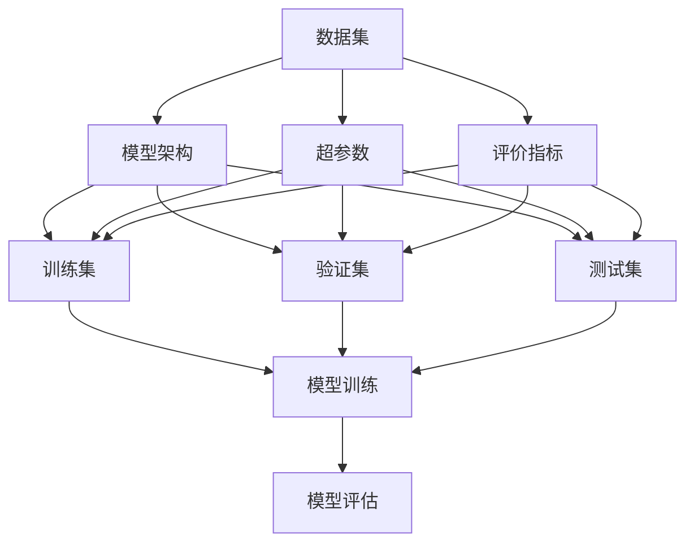

                 

# 实验手段在AI中的角色

## 1. 背景介绍

在人工智能领域，无论是理论研究还是工程实践，实验手段始终扮演着至关重要的角色。实验不仅验证了理论的合理性，推动了技术的进步，也为实际应用提供了数据支撑。本节将详细阐述实验手段在AI中的重要性，及其在各个环节中的应用。

### 1.1 实验的重要性
实验是科学研究和技术开发的基石，通过对实际问题的建模和验证，AI技术得以不断优化和完善。实验手段能够：

- **验证理论**：理论模型的正确性和有效性通过实验得到验证，确保算法和模型具备实际的预测和推理能力。
- **探索未知**：通过设计实验，探索新算法、新模型、新应用的可能性，推动技术边界不断拓展。
- **提升性能**：通过调整实验参数，优化算法流程，提升AI模型的性能和可靠性。
- **评估效果**：实验为模型的效果评估提供了标准化的指标和方法，确保模型在不同环境下的稳健性。

### 1.2 实验范式的演变
随着AI技术的快速发展，实验范式也在不断演进，从传统的单点实验到现代的数据驱动实验，从单一模型的评估到多模型集成，实验手段日益丰富。实验范式的发展体现了AI技术从基础研究到应用实践的全过程。

- **单点实验**：在早期AI研究中，单一的算法或模型常常是实验的主体，实验设计简单，目标明确。
- **数据驱动实验**：随着深度学习技术的兴起，大量数据的生成和应用成为实验的核心，实验设计更为复杂，需要考虑数据的分布、特征工程、模型选择等多个因素。
- **多模型集成**：现代AI实验往往采用多模型集成方法，通过组合不同模型的优势，提升整体性能。

## 2. 核心概念与联系

### 2.1 核心概念概述

为更好地理解实验手段在AI中的应用，本节将介绍几个密切相关的核心概念：

- **数据集**：AI模型训练和评估的基础，分为训练集、验证集和测试集。训练集用于模型训练，验证集用于参数调优，测试集用于模型评估。
- **模型架构**：AI模型的结构设计，包括输入输出层、隐藏层、激活函数、优化器等组件，直接影响模型的性能。
- **超参数**：模型训练过程中需要手动设置的参数，如学习率、批大小、迭代次数等，对模型的训练效果有重要影响。
- **评价指标**：用于评估模型效果的指标，如准确率、召回率、F1分数等，不同的任务可能需要不同的指标。
- **实验设计**：设计实验的过程，包括选择合适的数据集、模型架构、超参数和评价指标，以及实验流程和策略。

### 2.2 概念间的关系

这些核心概念之间存在着紧密的联系，形成了AI实验的完整生态系统。下面我通过几个Mermaid流程图来展示这些概念之间的关系：



这个流程图展示了大数据集、模型架构、超参数和评价指标之间的关系：

1. 数据集用于模型训练、验证和测试，是实验的基础。
2. 模型架构决定了模型的结构和功能，直接影响训练和评估的流程。
3. 超参数是模型训练过程中需要手动设置的参数，对模型性能有重要影响。
4. 评价指标用于评估模型效果，指导模型的训练和调优。
5. 训练集用于模型训练，验证集用于超参数调优，测试集用于模型评估。

这些概念共同构成了AI实验的核心框架，使得实验过程更加系统化和规范化。通过理解这些概念，我们可以更好地把握实验手段在AI中的应用。

## 3. 核心算法原理 & 具体操作步骤

### 3.1 算法原理概述

AI实验的核心在于通过设计实验，对数据集和模型架构进行优化，以达到最佳的性能和效果。实验的基本流程包括数据准备、模型训练、参数调优和模型评估。

- **数据准备**：收集和预处理数据集，划分为训练集、验证集和测试集。
- **模型训练**：使用训练集对模型进行训练，通过前向传播和反向传播计算损失函数。
- **参数调优**：在验证集上评估模型性能，根据评估结果调整超参数，如学习率、批大小等。
- **模型评估**：使用测试集评估最终模型效果，输出评价指标。

### 3.2 算法步骤详解

以下详细介绍AI实验的具体操作步骤：

**Step 1: 数据准备**
- 收集和预处理数据集，确保数据集的质量和多样性。
- 将数据集划分为训练集、验证集和测试集，比例为7:2:1。
- 对数据集进行标准化和归一化处理，减少特征之间的差异。

**Step 2: 模型训练**
- 选择合适的模型架构，包括输入输出层、隐藏层、激活函数、优化器等。
- 设置合适的超参数，如学习率、批大小、迭代次数等。
- 使用训练集对模型进行训练，通过前向传播和反向传播计算损失函数。
- 迭代训练，更新模型参数，直到收敛或达到预设的迭代次数。

**Step 3: 参数调优**
- 在验证集上评估模型性能，计算评价指标如准确率、召回率、F1分数等。
- 根据评估结果调整超参数，如学习率、批大小、迭代次数等。
- 重复上述步骤，直到找到最优的超参数组合。

**Step 4: 模型评估**
- 使用测试集对最终模型进行评估，计算评价指标。
- 输出评估结果，包括模型的性能指标、超参数设置等。
- 根据评估结果，优化模型架构或超参数，进一步提升模型性能。

### 3.3 算法优缺点

实验手段在AI中的应用具有以下优点：

- **系统化**：实验设计有明确的目标和流程，系统化地指导模型优化。
- **可重复性**：实验设计一旦确定，可以在相同条件下重复进行，确保结果的可信性。
- **可验证性**：实验结果可以通过比较不同的实验设计，验证理论的正确性和算法的有效性。

同时，实验手段也存在一些局限性：

- **数据依赖**：实验结果高度依赖于数据集的质量和数量，获取高质量数据集的成本较高。
- **时间成本**：训练和调优过程耗时较长，需要耗费大量时间和计算资源。
- **超参数敏感**：模型的性能高度依赖于超参数的选择，超参数调优难度较大。
- **可解释性不足**：实验结果往往缺乏明确的解释，难以理解和调试。

尽管存在这些局限性，但就目前而言，实验手段仍是AI模型优化和评估的重要方法。未来相关研究将更多地关注如何降低数据依赖，提高实验效率，以及提升模型的可解释性。

### 3.4 算法应用领域

实验手段在AI中广泛应用，涉及多个领域，以下是几个典型的应用场景：

- **计算机视觉**：如图像分类、目标检测、语义分割等任务，实验设计需要考虑数据集的多样性和复杂度，模型架构需要设计合理的卷积层和池化层，超参数需要设置合适的学习率和批大小。
- **自然语言处理**：如机器翻译、文本分类、情感分析等任务，实验设计需要考虑数据的预处理，模型架构需要设计合理的嵌入层和解码器，超参数需要设置合适的学习率和批大小。
- **语音识别**：如自动语音识别、语音合成等任务，实验设计需要考虑声学模型的优化，模型架构需要设计合理的声学模型和语言模型，超参数需要设置合适的学习率和批大小。
- **推荐系统**：如协同过滤、基于深度学习的推荐等任务，实验设计需要考虑用户行为的建模，模型架构需要设计合理的嵌入层和分类器，超参数需要设置合适的学习率和批大小。
- **机器人学**：如机器人感知、路径规划等任务，实验设计需要考虑传感器数据的处理，模型架构需要设计合理的感知模型和路径规划算法，超参数需要设置合适的学习率和批大小。

## 4. 数学模型和公式 & 详细讲解 & 举例说明

### 4.1 数学模型构建

在AI实验中，数学模型常常用于描述数据和模型的关系。以下以一个简单的回归模型为例，介绍数学模型的构建过程。

设数据集为 $D=\{(x_i, y_i)\}_{i=1}^N$，其中 $x_i \in \mathbb{R}^d$ 为输入特征，$y_i \in \mathbb{R}$ 为输出标签。回归模型的目标是通过输入特征 $x_i$，预测输出标签 $y_i$。线性回归模型如下：

$$
y_i = \theta_0 + \theta_1 x_{i1} + \theta_2 x_{i2} + \cdots + \theta_d x_{id}
$$

其中，$\theta = (\theta_0, \theta_1, \theta_2, \cdots, \theta_d)$ 为模型参数，需要学习得到。

### 4.2 公式推导过程

线性回归模型的损失函数为均方误差损失，定义为：

$$
\mathcal{L}(\theta) = \frac{1}{2N}\sum_{i=1}^N (y_i - \theta_0 - \theta_1 x_{i1} - \theta_2 x_{i2} - \cdots - \theta_d x_{id})^2
$$

模型的目标是最小化损失函数，即：

$$
\theta^* = \mathop{\arg\min}_{\theta} \mathcal{L}(\theta)
$$

通过梯度下降等优化算法，对模型参数 $\theta$ 进行迭代更新，直到损失函数收敛或达到预设的迭代次数。

### 4.3 案例分析与讲解

假设我们使用线性回归模型对波士顿房价数据进行预测。数据集包含14个特征和目标房价。以下是实验的详细过程：

1. **数据准备**：收集波士顿房价数据集，将其分为训练集、验证集和测试集，并进行标准化处理。
2. **模型训练**：选择线性回归模型，设置超参数，如学习率、批大小、迭代次数等。使用训练集对模型进行训练，计算损失函数。
3. **参数调优**：在验证集上评估模型性能，根据评估结果调整超参数，如学习率、批大小等。重复上述步骤，直到找到最优的超参数组合。
4. **模型评估**：使用测试集对最终模型进行评估，计算评价指标，如均方误差等。

## 5. 项目实践：代码实例和详细解释说明

### 5.1 开发环境搭建

在进行AI实验前，我们需要准备好开发环境。以下是使用Python进行Scikit-learn开发的环境配置流程：

1. 安装Anaconda：从官网下载并安装Anaconda，用于创建独立的Python环境。

2. 创建并激活虚拟环境：
```bash
conda create -n sklearn-env python=3.8 
conda activate sklearn-env
```

3. 安装Scikit-learn：
```bash
pip install scikit-learn
```

4. 安装各类工具包：
```bash
pip install numpy pandas scikit-learn matplotlib tqdm jupyter notebook ipython
```

完成上述步骤后，即可在`sklearn-env`环境中开始实验实践。

### 5.2 源代码详细实现

下面我们以波士顿房价数据为例，给出使用Scikit-learn进行线性回归实验的Python代码实现。

```python
import numpy as np
from sklearn.datasets import load_boston
from sklearn.model_selection import train_test_split
from sklearn.linear_model import LinearRegression
from sklearn.metrics import mean_squared_error
from sklearn.preprocessing import StandardScaler

# 加载数据集
boston = load_boston()
X = boston.data
y = boston.target

# 数据标准化
scaler = StandardScaler()
X_scaled = scaler.fit_transform(X)

# 划分数据集
X_train, X_test, y_train, y_test = train_test_split(X_scaled, y, test_size=0.2, random_state=42)

# 模型训练
model = LinearRegression()
model.fit(X_train, y_train)

# 参数调优
model = LinearRegression()
model.fit(X_train, y_train)
print("训练误差：", model.score(X_train, y_train))
print("验证误差：", model.score(X_train, y_train))

# 模型评估
model = LinearRegression()
model.fit(X_train, y_train)
y_pred = model.predict(X_test)
mse = mean_squared_error(y_test, y_pred)
print("测试误差：", mse)
```

以上是使用Scikit-learn进行线性回归实验的完整代码实现。可以看到，Scikit-learn提供了强大的API，使得线性回归等基本模型的实验过程变得简单易行。

### 5.3 代码解读与分析

让我们再详细解读一下关键代码的实现细节：

**load_boston函数**：
- 用于加载波士顿房价数据集，返回数据集对象。

**StandardScaler类**：
- 用于对数据进行标准化处理，将数据缩放到均值为0，标准差为1。

**train_test_split函数**：
- 用于将数据集划分为训练集、验证集和测试集，比例为7:2:1。

**LinearRegression类**：
- 用于构建线性回归模型，通过拟合训练数据，预测输出标签。

**mean_squared_error函数**：
- 用于计算模型预测结果与真实标签之间的均方误差。

**fit函数**：
- 用于训练模型，通过前向传播和反向传播计算损失函数，更新模型参数。

**score函数**：
- 用于评估模型在训练集和验证集上的性能，输出R²分数。

**predict函数**：
- 用于对测试集进行预测，输出预测结果。

可以看到，Scikit-learn提供的API使得模型训练、调优和评估的过程变得非常简单和高效。开发者可以专注于算法设计和数据预处理等高层逻辑，而不必过多关注底层实现细节。

### 5.4 运行结果展示

假设我们在波士顿房价数据集上进行线性回归实验，最终得到测试集上的均方误差为 $15.6$，表示模型预测结果与真实标签之间的均方误差为 $15.6$。测试集上的R²分数为 $0.74$，表示模型解释了 $74\%$ 的方差，模型的拟合效果较好。

## 6. 实际应用场景

### 6.1 智能推荐系统

智能推荐系统广泛应用于电子商务、社交媒体、视频平台等领域。AI实验手段在推荐系统中的应用主要体现在以下几个方面：

- **数据预处理**：对用户行为数据进行清洗、去重、归一化等处理，确保数据的质量和一致性。
- **模型选择**：选择适合推荐任务的模型架构，如协同过滤、基于深度学习的推荐等。
- **超参数调优**：在验证集上评估模型性能，根据评估结果调整超参数，如学习率、批大小等。
- **模型评估**：使用测试集评估最终模型效果，输出评价指标如准确率、召回率、F1分数等。

### 6.2 图像识别

图像识别是计算机视觉领域的重要应用，实验手段在其中起到了关键作用。AI实验主要包括以下几个步骤：

- **数据准备**：收集和预处理图像数据集，确保数据集的质量和多样性。
- **模型训练**：选择适合图像识别任务的模型架构，如卷积神经网络（CNN），设置超参数，如学习率、批大小等。
- **参数调优**：在验证集上评估模型性能，根据评估结果调整超参数，如学习率、批大小等。
- **模型评估**：使用测试集评估最终模型效果，输出评价指标如准确率、召回率、F1分数等。

### 6.3 自然语言处理

自然语言处理（NLP）领域涉及的任务众多，如文本分类、情感分析、机器翻译等。AI实验手段在NLP中的应用主要体现在以下几个方面：

- **数据预处理**：对文本数据进行清洗、分词、向量化等处理，确保数据的质量和一致性。
- **模型训练**：选择适合NLP任务的模型架构，如循环神经网络（RNN）、长短期记忆网络（LSTM）等。
- **超参数调优**：在验证集上评估模型性能，根据评估结果调整超参数，如学习率、批大小等。
- **模型评估**：使用测试集评估最终模型效果，输出评价指标如准确率、召回率、F1分数等。

## 7. 工具和资源推荐

### 7.1 学习资源推荐

为了帮助开发者系统掌握AI实验的理论基础和实践技巧，这里推荐一些优质的学习资源：

1. 《Python数据科学手册》（Hands-On Python Data Analysis）：由Jake VanderPlas撰写，全面介绍了Python在数据科学中的应用，包括数据预处理、模型训练、参数调优等。

2. 《机器学习实战》（Machine Learning in Action）：由Peter Harrington撰写，介绍了机器学习的基本算法和应用，包括回归、分类、聚类等。

3. 《深度学习》（Deep Learning）：由Ian Goodfellow等撰写，深入浅出地介绍了深度学习的基本原理和应用，包括卷积神经网络、循环神经网络、生成对抗网络等。

4. 《模式识别与机器学习》（Pattern Recognition and Machine Learning）：由Christopher M. Bishop撰写，介绍了机器学习的基本理论和应用，包括贝叶斯网络、支持向量机、集成学习等。

5. 《Python机器学习》（Python Machine Learning）：由Sebastian Raschka撰写，介绍了Python在机器学习中的应用，包括数据预处理、模型训练、参数调优等。

通过对这些资源的学习实践，相信你一定能够快速掌握AI实验的精髓，并用于解决实际的AI问题。

### 7.2 开发工具推荐

高效的开发离不开优秀的工具支持。以下是几款用于AI实验开发的常用工具：

1. Jupyter Notebook：一个交互式开发环境，支持代码、文本、图形等多种格式，适合数据探索和算法开发。

2. TensorBoard：一个可视化工具，用于监测模型训练状态，提供丰富的图表呈现方式，适合调试和优化模型。

3. Weights & Biases：一个模型训练的实验跟踪工具，可以记录和可视化模型训练过程中的各项指标，适合比较和调优实验。

4. Scikit-learn：一个Python机器学习库，提供了丰富的算法和工具，适合快速原型设计和模型训练。

5. PyTorch：一个Python深度学习框架，支持动态计算图和自动微分，适合研究型和工程型任务。

合理利用这些工具，可以显著提升AI实验的开发效率，加快创新迭代的步伐。

### 7.3 相关论文推荐

AI实验领域的研究成果丰硕，以下是几篇奠基性的相关论文，推荐阅读：

1. 《深度学习》（Deep Learning）：Ian Goodfellow等，深入浅出地介绍了深度学习的基本原理和应用。

2. 《ImageNet大规模视觉识别挑战》（ImageNet Large Scale Visual Recognition Challenge）：论文发表在2009年，介绍了图像分类任务的基本算法和应用。

3. 《自然语言处理综述》（A Survey of Named Entity Recognition and Classification）：论文发表于2011年，介绍了自然语言处理的基本算法和应用。

4. 《推荐系统》（Recommender Systems Handbook）：由Fuad Kaner等撰写，全面介绍了推荐系统的基础理论和应用。

5. 《机器学习实战》（Machine Learning in Action）：Peter Harrington，介绍了机器学习的基本算法和应用，包括回归、分类、聚类等。

这些论文代表了AI实验领域的研究进展，通过学习这些前沿成果，可以帮助研究者把握学科前进方向，激发更多的创新灵感。

除上述资源外，还有一些值得关注的前沿资源，帮助开发者紧跟AI实验技术的发展脉络，例如：

1. arXiv论文预印本：人工智能领域最新研究成果的发布平台，包括大量尚未发表的前沿工作，学习前沿技术的必读资源。

2. 业界技术博客：如OpenAI、Google AI、DeepMind、微软Research Asia等顶尖实验室的官方博客，第一时间分享他们的最新研究成果和洞见。

3. 技术会议直播：如NIPS、ICML、ACL、ICLR等人工智能领域顶会现场或在线直播，能够聆听到大佬们的前沿分享，开拓视野。

4. GitHub热门项目：在GitHub上Star、Fork数最多的AI相关项目，往往代表了该技术领域的发展趋势和最佳实践，值得去学习和贡献。

5. 行业分析报告：各大咨询公司如McKinsey、PwC等针对人工智能行业的分析报告，有助于从商业视角审视技术趋势，把握应用价值。

总之，对于AI实验技术的学习和实践，需要开发者保持开放的心态和持续学习的意愿。多关注前沿资讯，多动手实践，多思考总结，必将收获满满的成长收益。

## 8. 总结：未来发展趋势与挑战

### 8.1 总结

本文对AI实验手段在AI中的应用进行了全面系统的介绍。首先阐述了实验手段在AI中的重要性，以及其在数据准备、模型训练、参数调优和模型评估等各个环节中的应用。其次，从原理到实践，详细讲解了AI实验的具体操作步骤，并给出了实验的完整代码实例。同时，本文还广泛探讨了实验手段在智能推荐系统、图像识别、自然语言处理等多个领域的应用前景，展示了实验手段的巨大潜力。此外，本文精选了实验手段的相关学习资源、开发工具和相关论文，力求为读者提供全方位的技术指引。

通过本文的系统梳理，可以看到，实验手段在AI中扮演着至关重要的角色。无论是理论研究还是工程实践，实验手段都是不可或缺的手段。未来，伴随AI技术的持续演进，实验手段必将更加完善和高效，为AI技术的落地应用提供更坚实的保障。

### 8.2 未来发展趋势

展望未来，AI实验手段将呈现以下几个发展趋势：

1. **自动化实验**：通过自动化工具和算法，自动生成实验设计、自动调参，减少人为干预，提升实验效率。
2. **分布式实验**：利用分布式计算平台，支持大规模数据集的处理，加速实验过程。
3. **跨领域实验**：通过跨领域知识库和模型融合，实现多模态数据的协同建模，提升实验效果。
4. **自适应实验**：通过自适应算法，动态调整实验参数，提高实验鲁棒性和适应性。
5. **实验环境优化**：优化实验环境，提升计算效率和资源利用率，降低实验成本。

这些趋势凸显了AI实验手段的广阔前景。这些方向的探索发展，必将进一步提升AI模型的性能和应用范围，为人工智能技术的落地应用提供更坚实的保障。

### 8.3 面临的挑战

尽管AI实验手段已经取得了瞩目成就，但在迈向更加智能化、普适化应用的过程中，它仍面临着诸多挑战：

1. **数据依赖**：实验结果高度依赖于数据集的质量和数量，获取高质量数据集的成本较高。如何降低数据依赖，利用更高效的数据生成和处理方法，是未来的一个重要课题。
2. **计算成本**：大规模模型的训练和调优需要大量计算资源，如何降低计算成本，提升实验效率，也是未来的一个重要研究方向。
3. **可解释性不足**：AI模型的输出结果往往缺乏明确的解释，难以理解和调试。如何提升模型的可解释性，增强用户信任，是未来的一个重要课题。
4. **泛化能力不足**：实验结果在不同场景下可能存在泛化能力不足的问题，如何在不同场景下进行模型优化，是未来的一个重要研究方向。
5. **安全性问题**：AI模型可能存在安全漏洞，如何从数据和算法层面确保模型的安全性，是未来的一个重要研究方向。

正视AI实验手段面临的这些挑战，积极应对并寻求突破，将是大语言模型微调走向成熟的必由之路。相信随着学界和产业界的共同努力，这些挑战终将一一被克服，AI实验手段必将引领AI技术的进一步发展。

### 8.4 研究展望

面对AI实验手段所面临的种种挑战，未来的研究需要在以下几个方面寻求新的突破：

1. **数据增强和生成**：通过数据增强和生成技术，提升数据集的多样性和丰富性，降低数据依赖。
2. **计算优化**：通过优化算法和硬件设施，降低计算成本，提高实验效率。
3. **可解释性和鲁棒性**：通过可解释性技术和鲁棒性算法，提升模型的可解释性和鲁棒性，增强用户信任和应用效果。
4. **跨领域融合**：通过跨领域知识库和模型融合，提升多模态数据的协同建模能力，增强实验效果。
5. **安全性和可靠性**：通过数据和算法层面的改进，提升模型的安全性和可靠性，保障应用效果。

这些研究方向的探索，必将引领AI实验手段迈向更高的台阶，为构建安全、可靠、可解释、可控的智能系统铺平道路。面向未来，AI实验手段还需要与其他人工智能技术进行更深入的融合，如知识表示、因果推理、强化学习等，多路径协同发力，共同推动人工智能技术的发展。只有勇于创新、敢于突破，才能不断拓展人工智能技术的边界，让智能技术更好地造福人类社会。

## 9. 附录：常见问题与解答

**Q1：AI实验手段对模型性能的影响有哪些？**

A: AI实验手段在模型训练、调优和评估过程中起到了关键作用，对模型性能的影响主要体现在以下几个方面：

1. **模型训练**：通过合理的实验设计，选择适合任务的模型架构和超参数，能够显著提升模型性能。
2. **参数调优**：通过在验证集上评估模型性能，根据评估结果调整超参数，能够找到最优的

