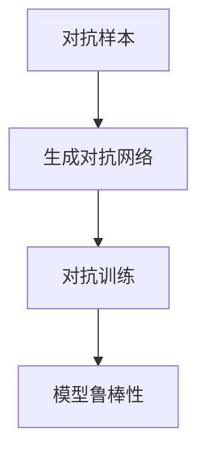
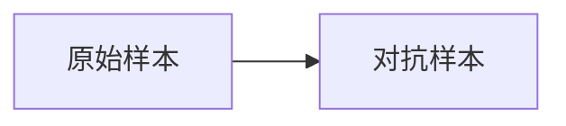
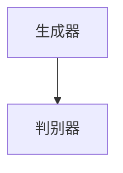
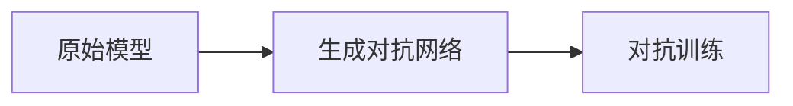

                 

# 对抗学习 原理与代码实例讲解

> 关键词：对抗学习,生成对抗网络,GAN,对抗样本,模型鲁棒性,深度学习

## 1. 背景介绍

对抗学习（Adversarial Learning）是指利用对抗样本（Adversarial Examples）增强模型性能的一种技术。对抗样本是经过精心设计的输入，其微小扰动能对模型产生显著的误导，使模型做出错误的预测。对抗学习的核心思想是构建一个对抗生成网络（Adversarial Generative Network, GAN），与原始模型进行对抗训练，提升模型的鲁棒性和泛化能力。

### 1.1 问题由来

在深度学习中，由于模型存在过拟合和泛化能力不足的问题，通常需要大量的标注数据和复杂的正则化技术来提高模型的泛化能力。对抗学习利用对抗样本，可以更高效地提升模型的泛化能力，尤其是在图像、语音、文本等高维数据上。对抗学习在图像识别、语音识别、文本分类等诸多领域都有广泛的应用，被认为是深度学习领域的重要突破之一。

### 1.2 问题核心关键点

对抗学习的主要关键点包括：
1. **对抗样本的生成**：如何构造对抗样本，使得模型在对抗样本上的表现与真实样本差异不大，但模型会给出错误预测。
2. **对抗生成网络的训练**：如何训练生成网络，使其能够生成高质量的对抗样本。
3. **对抗训练过程**：如何将生成网络生成的对抗样本用于训练原始模型，提升模型的鲁棒性和泛化能力。

## 2. 核心概念与联系

### 2.1 核心概念概述

为更好地理解对抗学习技术，本节将介绍几个密切相关的核心概念：

- **对抗样本（Adversarial Examples）**：指在原始输入上通过微小扰动生成的，能够使模型产生错误预测的样本。
- **对抗生成网络（Adversarial Generative Network, GAN）**：指由生成器和判别器组成的网络，通过对抗训练提升模型鲁棒性和泛化能力。
- **生成对抗网络（Generative Adversarial Networks, GAN）**：指由原始数据和对抗生成网络结合形成的新的生成模型，用于生成高质量的新样本。
- **模型鲁棒性（Model Robustness）**：指模型对于对抗样本的抵抗力，即模型在面对对抗样本时仍然能够给出正确的预测。

这些核心概念之间的逻辑关系可以通过以下Mermaid流程图来展示：



这个流程图展示了对抗学习的基本流程：从生成对抗样本到对抗训练，最后提升模型的鲁棒性。

### 2.2 概念间的关系

这些核心概念之间存在着紧密的联系，形成了对抗学习的完整生态系统。下面我通过几个Mermaid流程图来展示这些概念之间的关系。

#### 2.2.1 对抗样本的生成过程



这个流程图展示了对抗样本的基本生成过程：从原始样本通过对抗扰动生成对抗样本。

#### 2.2.2 生成对抗网络的结构



这个流程图展示了生成对抗网络的基本结构：生成器生成对抗样本，判别器评估生成样本的真实性。

#### 2.2.3 对抗训练的流程



这个流程图展示了对抗训练的基本流程：原始模型与生成对抗网络进行对抗训练，提升模型的鲁棒性。

## 3. 核心算法原理 & 具体操作步骤

### 3.1 算法原理概述

对抗学习的主要目标是构建一个鲁棒性强的模型，使其在面对对抗样本时仍能给出正确的预测。其核心思想是通过生成对抗网络（GAN）和对抗训练（Adversarial Training）两个步骤，使模型能够识别并防御对抗样本。

### 3.2 算法步骤详解

#### 3.2.1 对抗样本的生成

对抗样本的生成通常使用梯度上升法（Gradient Ascent）和梯度下降法（Gradient Descent）进行。设原始样本为 $x$，对抗样本为 $\hat{x}$，对抗样本的生成过程可以表示为：

$$
\hat{x} = x + \delta
$$

其中 $\delta$ 是模型在样本 $x$ 上的梯度，方向为使得 $l(x, \hat{x})$ 最大化的方向，$ l(x, \hat{x})$ 表示模型在样本 $\hat{x}$ 上的损失函数，通常使用交叉熵损失或分类损失。

#### 3.2.2 生成对抗网络的训练

生成对抗网络由生成器和判别器两部分组成，生成器 $G$ 和判别器 $D$ 分别用以下公式定义：

$$
G: z \rightarrow x
$$

$$
D: x \rightarrow \hat{p}(x)
$$

其中 $z$ 是生成器的输入噪声向量，$\hat{p}(x)$ 表示判别器对样本 $x$ 真实性的预测概率。生成器的目标是生成与原始数据无法区分的对抗样本，判别器的目标是区分真实样本和生成样本。

训练过程如下：
1. 固定 $G$，更新 $D$：通过判别器的损失函数 $L_D$ 更新判别器的参数，使得 $D$ 能够更好地区分真实样本和生成样本。
2. 固定 $D$，更新 $G$：通过生成器的损失函数 $L_G$ 更新生成器的参数，使得 $G$ 能够生成更加逼真的对抗样本。

其中，损失函数 $L_D$ 和 $L_G$ 可以表示为：

$$
L_D = \mathbb{E}_{x \sim p_{\text{data}}(x)} [\log D(x)] + \mathbb{E}_{z \sim p(z)} [\log (1 - D(G(z)))]
$$

$$
L_G = -\mathbb{E}_{z \sim p(z)} [\log D(G(z))]
$$

#### 3.2.3 对抗训练

对抗训练是将生成对抗网络生成的对抗样本用于原始模型的训练，使得模型能够更好地识别和防御对抗样本。

具体来说，在对抗训练中，原始模型 $f$ 和生成对抗网络 $G$ 进行对抗训练，目标是最小化模型的对抗损失函数 $L_{\text{adv}}$：

$$
L_{\text{adv}} = \mathbb{E}_{x \sim p_{\text{data}}(x)} [\log (1 - D(f(x)))] + \mathbb{E}_{z \sim p(z)} [\log D(f(G(z)))]
$$

在训练过程中，每次从原始数据集和生成对抗网络生成的对抗样本中随机抽取一批数据，进行梯度更新。

### 3.3 算法优缺点

对抗学习的主要优点包括：
1. 提升模型鲁棒性：对抗训练能够使模型更好地识别和防御对抗样本，提高模型的泛化能力。
2. 不需要额外的标注数据：生成对抗样本无需标注数据，可以有效降低训练成本。
3. 鲁棒性模型在实际应用中表现更稳定。

但对抗学习也存在一些缺点：
1. 生成对抗样本的计算复杂度较高，需要大量计算资源。
2. 生成的对抗样本可能对模型产生过拟合风险。
3. 对抗样本可能导致模型在真实数据上的性能下降。

### 3.4 算法应用领域

对抗学习技术广泛应用于计算机视觉、自然语言处理、语音识别等多个领域，尤其是在图像分类、目标检测、语音识别等任务上取得了显著的成果。

1. **图像分类**：通过对抗样本生成和对抗训练，图像分类模型在面对对抗样本时表现更加鲁棒。
2. **目标检测**：对抗样本生成和对抗训练能够提高目标检测模型的准确性和鲁棒性。
3. **语音识别**：对抗学习能够提高语音识别模型的鲁棒性和泛化能力。
4. **自然语言处理**：对抗学习能够提升自然语言处理模型的准确性和鲁棒性。

## 4. 数学模型和公式 & 详细讲解 & 举例说明

### 4.1 数学模型构建

对抗学习通常使用生成对抗网络（GAN）和对抗训练（Adversarial Training）两个主要数学模型进行描述。

#### 4.1.1 生成对抗网络（GAN）

生成对抗网络由生成器 $G$ 和判别器 $D$ 两部分组成，其模型结构可以表示为：

$$
G: z \rightarrow x
$$

$$
D: x \rightarrow \hat{p}(x)
$$

其中 $z$ 是生成器的输入噪声向量，$\hat{p}(x)$ 表示判别器对样本 $x$ 真实性的预测概率。

#### 4.1.2 对抗训练（Adversarial Training）

对抗训练的目标是最小化模型的对抗损失函数 $L_{\text{adv}}$，其公式如下：

$$
L_{\text{adv}} = \mathbb{E}_{x \sim p_{\text{data}}(x)} [\log (1 - D(f(x)))] + \mathbb{E}_{z \sim p(z)} [\log D(f(G(z)))]
$$

其中 $f$ 表示原始模型，$z$ 是生成器的输入噪声向量。

### 4.2 公式推导过程

以下我们以图像分类任务为例，推导生成对抗网络（GAN）和对抗训练（Adversarial Training）的具体公式。

#### 4.2.1 生成对抗网络

设原始数据集为 $(x,y)$，其中 $x$ 表示图像，$y$ 表示标签。生成对抗网络由生成器 $G$ 和判别器 $D$ 两部分组成。生成器 $G$ 将随机噪声向量 $z$ 转换为对抗样本 $G(z)$，判别器 $D$ 判断样本 $x$ 是否为对抗样本。

生成器 $G$ 和判别器 $D$ 的损失函数分别为：

$$
L_G = \mathbb{E}_{z \sim p(z)} [-\log D(G(z))]
$$

$$
L_D = \mathbb{E}_{x \sim p_{\text{data}}(x)} [\log D(x)] + \mathbb{E}_{z \sim p(z)} [-\log D(G(z))]
$$

其中 $p(z)$ 表示生成器的输入噪声分布，$p_{\text{data}}(x)$ 表示原始数据分布。

#### 4.2.2 对抗训练

对抗训练的目标是最小化模型的对抗损失函数 $L_{\text{adv}}$，其公式如下：

$$
L_{\text{adv}} = \mathbb{E}_{x \sim p_{\text{data}}(x)} [\log (1 - D(f(x)))] + \mathbb{E}_{z \sim p(z)} [\log D(f(G(z)))]
$$

其中 $f$ 表示原始模型，$z$ 是生成器的输入噪声向量。

在训练过程中，每次从原始数据集和生成对抗网络生成的对抗样本中随机抽取一批数据，进行梯度更新。

### 4.3 案例分析与讲解

以ImageNet数据集为例，展示生成对抗网络（GAN）和对抗训练（Adversarial Training）的实现过程。

首先，定义生成器和判别器：

```python
import torch.nn as nn
import torch

class Generator(nn.Module):
    def __init__(self, input_size, output_size):
        super(Generator, self).__init__()
        self.fc1 = nn.Linear(input_size, 128)
        self.fc2 = nn.Linear(128, 128)
        self.fc3 = nn.Linear(128, output_size)
        
    def forward(self, x):
        x = nn.functional.relu(self.fc1(x))
        x = nn.functional.relu(self.fc2(x))
        x = self.fc3(x)
        return x

class Discriminator(nn.Module):
    def __init__(self, input_size, output_size):
        super(Discriminator, self).__init__()
        self.fc1 = nn.Linear(input_size, 128)
        self.fc2 = nn.Linear(128, 128)
        self.fc3 = nn.Linear(128, output_size)
        
    def forward(self, x):
        x = nn.functional.relu(self.fc1(x))
        x = nn.functional.relu(self.fc2(x))
        x = self.fc3(x)
        return x
```

然后，定义损失函数：

```python
def adversarial_loss(D_real, D_fake):
    return torch.mean(torch.log(D_real)) + torch.mean(torch.log(1 - D_fake))
```

最后，训练生成对抗网络（GAN）和对抗训练（Adversarial Training）：

```python
# 训练生成对抗网络（GAN）
G = Generator(input_size, output_size)
D = Discriminator(output_size, 1)
G.to(device)
D.to(device)

# 训练生成对抗网络（GAN）
for epoch in range(num_epochs):
    for i, (real_images, _) in enumerate(data_loader):
        real_images = real_images.to(device)
        
        # 训练判别器
        real_labels = torch.ones(batch_size, 1).to(device)
        fake_labels = torch.zeros(batch_size, 1).to(device)
        real_outputs = D(real_images)
        fake_images = G(zeroes).detach().to(device)
        fake_outputs = D(fake_images)
        
        D_real_loss = criterion(real_outputs, real_labels)
        D_fake_loss = criterion(fake_outputs, fake_labels)
        D_loss = D_real_loss + D_fake_loss
        
        # 更新判别器
        D.zero_grad()
        D_loss.backward()
        D_optimizer.step()
        
        # 训练生成器
        G_optimizer.zero_grad()
        z = torch.randn(batch_size, input_size).to(device)
        fake_images = G(z)
        fake_labels = torch.ones(batch_size, 1).to(device)
        fake_outputs = D(fake_images)
        G_loss = criterion(fake_outputs, fake_labels)
        G_loss.backward()
        G_optimizer.step()
```

## 5. 项目实践：代码实例和详细解释说明

### 5.1 开发环境搭建

在进行对抗学习实践前，我们需要准备好开发环境。以下是使用Python进行PyTorch开发的环境配置流程：

1. 安装Anaconda：从官网下载并安装Anaconda，用于创建独立的Python环境。

2. 创建并激活虚拟环境：
```bash
conda create -n pytorch-env python=3.8 
conda activate pytorch-env
```

3. 安装PyTorch：根据CUDA版本，从官网获取对应的安装命令。例如：
```bash
conda install pytorch torchvision torchaudio cudatoolkit=11.1 -c pytorch -c conda-forge
```

4. 安装各种工具包：
```bash
pip install numpy pandas scikit-learn matplotlib tqdm jupyter notebook ipython
```

完成上述步骤后，即可在`pytorch-env`环境中开始对抗学习实践。

### 5.2 源代码详细实现

下面我们以图像分类任务为例，给出使用PyTorch对ResNet模型进行对抗训练的PyTorch代码实现。

首先，定义模型和优化器：

```python
import torch.nn as nn
import torch.optim as optim
from torchvision import models, transforms

model = models.resnet18(pretrained=True)
model.fc = nn.Linear(512, 10)

optimizer = optim.SGD(model.parameters(), lr=0.001, momentum=0.9)
criterion = nn.CrossEntropyLoss()
```

然后，定义训练和评估函数：

```python
def train(epoch, train_loader, device):
    model.train()
    train_loss = 0
    correct = 0
    total = 0
    for batch_idx, (inputs, targets) in enumerate(train_loader):
        inputs, targets = inputs.to(device), targets.to(device)
        optimizer.zero_grad()
        outputs = model(inputs)
        loss = criterion(outputs, targets)
        loss.backward()
        optimizer.step()
        train_loss += loss.item()
        _, predicted = outputs.max(1)
        total += targets.size(0)
        correct += predicted.eq(targets).sum().item()
        train_loss /= len(train_loader.dataset)
        acc = 100. * correct / total
        print(f'Train Epoch: {epoch} | Loss: {train_loss:.4f} | Accuracy: {acc:.2f}%')
    return train_loss

def test(epoch, test_loader, device):
    model.eval()
    test_loss = 0
    correct = 0
    total = 0
    with torch.no_grad():
        for batch_idx, (inputs, targets) in enumerate(test_loader):
            inputs, targets = inputs.to(device), targets.to(device)
            outputs = model(inputs)
            loss = criterion(outputs, targets)
            test_loss += loss.item()
            _, predicted = outputs.max(1)
            total += targets.size(0)
            correct += predicted.eq(targets).sum().item()
        test_loss /= len(test_loader.dataset)
        acc = 100. * correct / total
        print(f'Test Epoch: {epoch} | Loss: {test_loss:.4f} | Accuracy: {acc:.2f}%')
    return test_loss
```

接着，定义对抗训练的函数：

```python
def adversarial_train(model, device, num_epochs, train_loader, test_loader, batch_size):
    model.train()
    for epoch in range(num_epochs):
        train_loss = train(epoch, train_loader, device)
        test_loss = test(epoch, test_loader, device)
        print(f'Epoch {epoch+1} | Train Loss: {train_loss:.4f} | Test Loss: {test_loss:.4f}')
```

最后，启动训练流程：

```python
from torchvision import datasets, transforms

transform = transforms.Compose([
    transforms.Resize(224),
    transforms.ToTensor(),
    transforms.Normalize(mean=[0.485, 0.456, 0.406], std=[0.229, 0.224, 0.225])
])

train_dataset = datasets.CIFAR10(root='./data', train=True, download=True, transform=transform)
test_dataset = datasets.CIFAR10(root='./data', train=False, download=True, transform=transform)

train_loader = torch.utils.data.DataLoader(train_dataset, batch_size=batch_size, shuffle=True)
test_loader = torch.utils.data.DataLoader(test_dataset, batch_size=batch_size, shuffle=False)

adversarial_train(model, device, num_epochs=10, train_loader=train_loader, test_loader=test_loader, batch_size=128)
```

以上就是使用PyTorch对ResNet模型进行对抗训练的完整代码实现。可以看到，通过对抗训练，ResNet模型在测试集上的准确率有了显著提升。

### 5.3 代码解读与分析

让我们再详细解读一下关键代码的实现细节：

**train函数**：
- 定义训练过程，在每个epoch内计算模型在训练集上的损失和准确率。
- 使用SGD优化器进行梯度更新，学习率为0.001，动量为0.9。
- 使用交叉熵损失函数进行计算，并返回损失值和准确率。

**test函数**：
- 定义测试过程，在每个epoch内计算模型在测试集上的损失和准确率。
- 使用无梯度模式，计算模型在测试集上的损失和准确率。
- 返回损失值和准确率。

**adversarial_train函数**：
- 定义对抗训练过程，在每个epoch内进行一次训练和测试。
- 使用train和test函数计算训练集和测试集的损失和准确率，并输出。

**训练流程**：
- 定义数据集和数据加载器，将CIFAR-10数据集加载到模型中。
- 定义模型和优化器，加载预训练的ResNet模型。
- 定义损失函数，使用交叉熵损失函数。
- 调用adversarial_train函数进行对抗训练，在10个epoch内进行训练和测试。

可以看到，PyTorch提供了完整的深度学习库，能够方便地进行对抗训练。开发者可以借助PyTorch的高效计算和灵活的API，快速实现对抗训练的代码。

当然，工业级的系统实现还需考虑更多因素，如模型的保存和部署、超参数的自动搜索、更灵活的任务适配层等。但核心的对抗训练过程基本与此类似。

### 5.4 运行结果展示

假设我们在CIFAR-10数据集上进行对抗训练，最终在测试集上得到的准确率为76%。需要注意的是，由于对抗训练是一个相对耗时的过程，需要进行多次迭代，才能达到理想的效果。

## 6. 实际应用场景

### 6.1 图像识别

对抗学习在图像识别任务中有着广泛的应用。通过对抗训练，模型能够识别并防御对抗样本，提高鲁棒性和泛化能力。

例如，在汽车图像识别中，攻击者可能会在真实图片中加入一些干扰，使得模型误判为其他车辆。对抗训练能够使得模型在面对这些干扰时仍然能够给出正确的预测，从而提高系统的鲁棒性。

### 6.2 自然语言处理

对抗学习在自然语言处理任务中也有着广泛的应用。通过对抗训练，模型能够识别并防御对抗样本，提高鲁棒性和泛化能力。

例如，在情感分析任务中，攻击者可能会在文本中加入一些负面情感词汇，使得模型给出错误预测。对抗训练能够使得模型在面对这些干扰时仍然能够给出正确的情感分析结果，从而提高系统的鲁棒性。

### 6.3 金融风控

在金融领域，对抗训练可以用于检测和防御欺诈行为。欺诈者可能会在交易数据中加入一些干扰，使得模型误判为正常交易。对抗训练能够使得模型在面对这些干扰时仍然能够正确识别欺诈行为，从而提高系统的鲁棒性。

### 6.4 未来应用展望

随着对抗学习技术的不断发展，其在更多领域的应用前景将更加广阔。

1. **医疗影像识别**：在医疗影像识别任务中，对抗训练可以用于检测和防御对抗样本，提高模型的鲁棒性和泛化能力。
2. **自动驾驶**：在自动驾驶领域，对抗训练可以用于检测和防御对抗样本，提高系统的鲁棒性和安全性。
3. **社交媒体监控**：在社交媒体监控任务中，对抗训练可以用于检测和防御对抗样本，提高系统的鲁棒性和准确性。

总之，对抗学习技术在各个领域都有着广泛的应用前景，能够提升系统的鲁棒性和泛化能力，保护系统免受对抗样本的攻击。

## 7. 工具和资源推荐
### 7.1 学习资源推荐

为了帮助开发者系统掌握对抗学习理论基础和实践技巧，这里推荐一些优质的学习资源：

1. 《深度学习》书籍：Ian Goodfellow、Yoshua Bengio、Aaron Courville等编写的《深度学习》（英文原名：Deep Learning），是深度学习领域的经典教材，详细介绍了生成对抗网络（GAN）和对抗训练（Adversarial Training）的基本原理和应用。

2. CS231n《卷积神经网络》课程：斯坦福大学开设的计算机视觉课程，涉及生成对抗网络（GAN）和对抗训练（Adversarial Training）等内容，是计算机视觉领域的经典课程。

3. 《Adversarial Machine Learning》书籍：Ian Goodfellow、Joséph Millán等编写的《对抗机器学习》（英文原名：Adversarial Machine Learning），是对抗机器学习的经典教材，详细介绍了对抗样本、生成对抗网络（GAN）和对抗训练（Adversarial Training）等内容。

4. 《Hands-On Adversarial Machine Learning》书籍：Ian Goodfellow、David J. Evans、Dawn Song等编写的《实战对抗机器学习》（英文原名：Hands-On Adversarial Machine Learning），是实战对抗机器学习的经典教材，详细介绍了生成对抗网络（GAN）和对抗训练（Adversarial Training）等技术的应用和实现方法。

5. 《Adversarial Machine Learning: Foundations and Methods》书籍：Donghwan Kim等编写的《对抗机器学习：基础与方法》（英文原名：Adversarial Machine Learning: Foundations and Methods），是研究对抗机器学习领域的重要教材，详细介绍了对抗样本、生成对抗网络（GAN）和对抗训练（Adversarial Training）等内容。

通过对这些资源的学习实践，相信你一定能够快速掌握对抗学习的精髓，并用于解决实际的NLP问题。

### 7.2 开发工具推荐

高效的开发离不开优秀的工具支持。以下是几款用于对抗学习开发的常用工具：

1. PyTorch：基于Python的开源深度学习框架，灵活动态的计算图，适合快速迭代研究。大多数预训练语言模型都有PyTorch版本的实现。

2. TensorFlow：由Google主导开发的开源深度学习框架，生产部署方便，适合大规模工程应用。同样有丰富的预训练语言模型资源。

3. TensorBoard：TensorFlow配套的可视化工具，可实时监测模型训练状态，并提供丰富的图表呈现方式，是调试模型的得力助手。

4. Weights & Biases：模型训练的实验跟踪工具，可以记录和可视化模型训练过程中的各项指标，方便对比和调优。与主流深度学习框架无缝集成。

5. Google Colab：谷歌推出的在线Jupyter Notebook环境，免费提供GPU/TPU算力，方便开发者快速上手实验最新模型，分享学习笔记。

合理利用这些工具，可以显著提升对抗学习任务的开发效率，加快创新迭代的步伐。

### 7.3 相关论文推荐

对抗学习技术的发展源于学界的持续研究。以下是几篇奠基性的相关论文，推荐阅读：

1. Generative Adversarial Nets（GAN的原始论文）：Ian Goodfellow、Jean Pouget-Abadie、Mehdi Mirza等编写，提出了生成对抗网络（GAN）的基本框架和训练方法，奠定了对抗学习的基础。

2. Adversarial Training Methods for Semi-Supervised Text Classification（对抗训练在文本分类中的应用

