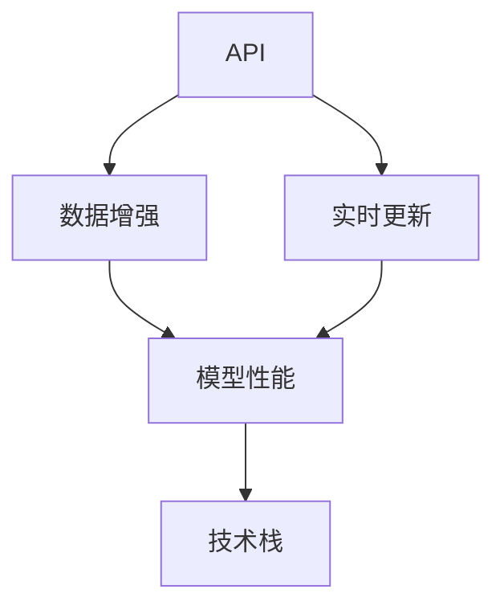

                 

# 工具：调用外部 API 获取额外信息

> 关键词：API, 外部数据, 数据增强, 实时更新, 技术栈

## 1. 背景介绍

在当今数字化时代，数据的丰富性和多样性为人工智能(AI)技术的进步提供了无尽的动力。然而，获取高质量、有针对性的数据并非易事，尤其是当数据集不足或难以通过传统方法获取时。为了克服这一挑战，许多AI开发者开始探索调用外部API（Application Programming Interface）来获取额外的信息资源。这些API提供了丰富的数据源，包括但不限于天气数据、地理信息、金融市场数据、社交媒体数据等。通过这些API，开发者可以轻松获得海量、多样化的数据，极大地扩展了AI应用的可能性。

本博文旨在详细介绍调用外部API获取额外信息的技术原理、操作步骤、优势与挑战，同时探讨其在AI应用中的实际应用场景，并推荐一些相关的学习资源和开发工具。

## 2. 核心概念与联系

### 2.1 核心概念概述

在深入讨论之前，我们需要明确几个关键概念：

- **API**：API是一组定义了软件组件之间交互的协议和工具。在AI领域，API通常用于提供数据、模型、服务等功能，使开发者可以轻松集成和利用这些资源。
- **数据增强**：数据增强是一种通过变换、合成等手段扩展训练集的方法，旨在提高模型的泛化能力和鲁棒性。调用外部API获取的数据可以用于数据增强，提升模型的性能。
- **实时更新**：随着技术的发展和数据的更新，调用外部API可以提供最新的信息，这对于需要实时响应数据变化的应用尤为重要。
- **技术栈**：不同API的调用可能需要不同的技术栈，包括编程语言、框架、库等。选择合适技术栈是确保API调用高效、稳定的关键。

这些概念之间存在紧密的联系，共同构成了调用外部API获取额外信息的完整生态系统。以下是这些概念之间的关系：



这个流程图展示了API如何通过数据增强和实时更新提升模型性能，并说明了选择合适技术栈的重要性。

### 2.2 核心概念间的联系

1. **API与数据增强**：
   API提供了丰富的数据源，开发者可以基于这些数据进行数据增强，如通过数据合成、变换等手段生成新的训练数据，从而提高模型的泛化能力和鲁棒性。

2. **API与实时更新**：
   API通常提供实时的数据流，使得模型能够持续更新，适应新的数据变化，这对于需要实时响应的应用至关重要。

3. **API与技术栈**：
   不同API的调用需要不同的技术栈，包括编程语言、框架、库等。选择合适技术栈可以确保API调用高效、稳定，同时易于维护。

4. **数据增强与实时更新**：
   数据增强和实时更新是相辅相成的，数据增强提高了模型的鲁棒性，实时更新保持了模型的时效性，两者结合可以构建高性能的AI应用。

5. **技术栈与API调用**：
   技术栈的选择直接影响API调用的效率和稳定性，合理的技术栈设计可以提升API调用的性能，确保数据流处理的流畅性。

这些联系共同构建了调用外部API获取额外信息的基本框架，为开发者提供了技术实现和应用落地的基础。

## 3. 核心算法原理 & 具体操作步骤

### 3.1 算法原理概述

调用外部API获取额外信息的原理基于API提供的数据流和服务接口。具体步骤如下：

1. **API选择与注册**：选择合适的API，并在应用中注册和配置API密钥和访问权限。
2. **数据获取**：通过API接口获取数据，这些数据可以是结构化或非结构化的，包括文本、图像、音频等。
3. **数据预处理**：对获取的数据进行预处理，包括清洗、标注、转换等，以适应模型的训练需求。
4. **数据增强**：将预处理后的数据用于数据增强，扩展训练集，提高模型泛化能力。
5. **模型训练与优化**：将增强后的数据输入模型进行训练和优化，利用外部API提供的数据提升模型性能。
6. **实时更新与监控**：持续监控API数据更新，实时调整模型，保持最新状态。

### 3.2 算法步骤详解

下面是详细的算法步骤，以一个天气预测应用为例：

1. **API选择与注册**：
   - 选择天气API，如OpenWeatherMap、AccuWeather等，注册账号并获取API密钥。
   - 在应用中配置API密钥和访问权限，确保数据的安全性和合法性。

2. **数据获取**：
   - 根据需求，通过API接口获取天气数据，包括温度、湿度、气压、风速等。
   - 处理API返回的数据，包括解析JSON格式、提取关键信息等。

3. **数据预处理**：
   - 清洗数据，去除噪声和错误，确保数据质量。
   - 标注数据，如添加标签、时间戳等，为数据增强做准备。
   - 数据转换，将不同格式的数据转换为模型可接受的形式，如将文本转换为向量。

4. **数据增强**：
   - 使用数据合成、变换等手段生成新的训练数据，如基于原始数据生成不同的天气条件。
   - 使用数据扩增技术，如旋转、缩放、平移等，增加数据多样性。
   - 将增强后的数据与原始数据混合，形成扩充的训练集。

5. **模型训练与优化**：
   - 将增强后的数据输入模型进行训练和优化，利用外部数据提升模型的泛化能力和鲁棒性。
   - 使用超参数调优技术，如网格搜索、贝叶斯优化等，找到最佳模型参数。
   - 利用验证集评估模型性能，避免过拟合。

6. **实时更新与监控**：
   - 持续监控API数据更新，实时调整模型，保持最新状态。
   - 设置异常告警机制，当数据变化超出预设范围时，及时采取措施。

### 3.3 算法优缺点

调用外部API获取额外信息具有以下优点：

1. **数据丰富**：API提供了丰富的数据源，可以极大地扩展数据集，提高模型的泛化能力和鲁棒性。
2. **实时更新**：API通常提供实时的数据流，使得模型能够持续更新，适应新的数据变化。
3. **技术门槛低**：许多API提供了便捷的调用接口，易于集成和实现。

同时，也存在一些缺点：

1. **数据质量**：外部API提供的数据可能存在噪声、偏差等问题，需要额外的预处理和清洗工作。
2. **安全风险**：API调用涉及敏感数据传输，可能面临数据泄露和隐私保护问题。
3. **依赖外部**：过度依赖外部API，可能导致应用的可扩展性和稳定性受限。

### 3.4 算法应用领域

调用外部API获取额外信息在多个领域得到了广泛应用，包括但不限于：

1. **气象预测**：获取天气数据，进行精准的天气预测和预警。
2. **金融分析**：获取股票、汇率、经济指标等数据，进行市场分析和风险管理。
3. **智能交通**：获取交通流量、道路状况等数据，优化交通管理和出行规划。
4. **健康监测**：获取健康数据，进行疾病预测和个性化健康管理。
5. **市场营销**：获取社交媒体数据，进行用户行为分析和市场趋势预测。

这些应用展示了API调用在提高数据丰富性和实时性方面的巨大潜力，为AI技术在各行各业的落地提供了有力支持。

## 4. 数学模型和公式 & 详细讲解 & 举例说明

### 4.1 数学模型构建

本节将介绍一个简单的数学模型，用于说明如何利用外部数据进行模型训练和优化。

假设我们有一个简单的线性回归模型：

$$ y = \theta_0 + \theta_1 x_1 + \theta_2 x_2 $$

其中 $x_1, x_2$ 是两个输入特征，$\theta_0, \theta_1, \theta_2$ 是模型参数。

### 4.2 公式推导过程

我们希望最小化模型误差，常用的损失函数为均方误差（Mean Squared Error, MSE）：

$$ \mathcal{L}(\theta) = \frac{1}{N}\sum_{i=1}^N (y_i - \hat{y}_i)^2 $$

其中 $y_i$ 是真实值，$\hat{y}_i = \theta_0 + \theta_1 x_{1i} + \theta_2 x_{2i}$ 是模型预测值。

为了求解最优参数 $\theta$，我们利用梯度下降算法，求解目标函数的最小值：

$$ \nabla_{\theta}\mathcal{L}(\theta) = \frac{2}{N}\sum_{i=1}^N (y_i - \hat{y}_i)(-1)(x_{1i}, x_{2i}) $$

通过迭代更新参数，不断降低损失函数，直到收敛。

### 4.3 案例分析与讲解

假设我们要构建一个天气预测模型，使用OpenWeatherMap API获取历史天气数据。我们可以将数据分为训练集和测试集，每个样本包括日期、温度、湿度、气压等特征，以及对应的天气标签（如晴天、雨天等）。

1. **数据获取**：
   - 使用OpenWeatherMap API获取历史天气数据，包括温度、湿度、气压等。
   - 将数据转换为模型可接受的格式，如CSV文件。

2. **数据预处理**：
   - 清洗数据，去除噪声和错误，确保数据质量。
   - 标注数据，如添加标签、时间戳等。

3. **模型训练与优化**：
   - 将预处理后的数据输入模型进行训练和优化。
   - 使用均方误差（MSE）作为损失函数，通过梯度下降算法最小化误差。
   - 设置学习率、迭代轮数等超参数，进行模型调优。

4. **模型评估与验证**：
   - 使用测试集评估模型性能，计算MSE等指标。
   - 进行交叉验证，确保模型泛化能力。

通过以上步骤，我们可以构建一个基于外部天气数据的天气预测模型，提升模型的准确性和鲁棒性。

## 5. 项目实践：代码实例和详细解释说明

### 5.1 开发环境搭建

在开始项目实践之前，我们需要搭建开发环境。以下是一个基本的Python环境配置示例：

1. 安装Python和pip：
   ```bash
   sudo apt-get update
   sudo apt-get install python3
   sudo apt-get install python3-pip
   ```

2. 创建虚拟环境：
   ```bash
   python3 -m venv myenv
   source myenv/bin/activate
   ```

3. 安装相关库：
   ```bash
   pip install requests
   pip install pandas
   pip install numpy
   pip install scikit-learn
   ```

### 5.2 源代码详细实现

下面是一个简单的Python代码示例，用于调用OpenWeatherMap API获取天气数据，并进行线性回归模型训练和预测。

```python
import requests
import pandas as pd
from sklearn.linear_model import LinearRegression

# 获取天气数据
url = "http://api.openweathermap.org/data/2.5/forecast?q=Beijing&appid=YOUR_API_KEY"
response = requests.get(url)
data = response.json()

# 将数据转换为DataFrame格式
df = pd.DataFrame(data["list"])
df["date"] = pd.to_datetime(df["dt"])
df = df.set_index("date")

# 选取温度、湿度、气压等特征
features = ["main.temp", "main.humidity", "main.pressure"]
X = df[features]
y = df["weather"][0]["main"].replace("Clear", 0).replace("Rain", 1).replace("Clouds", 2)

# 数据预处理
X = X.dropna()
y = y.dropna()

# 训练模型
model = LinearRegression()
model.fit(X, y)

# 预测天气
future_date = pd.to_datetime("2023-01-01")
future_data = df[features].loc[future_date]
prediction = model.predict(future_data)

print(prediction)
```

### 5.3 代码解读与分析

该代码段展示了从API获取天气数据、数据预处理、模型训练到预测的完整流程。

1. **API调用**：
   - 使用requests库调用OpenWeatherMap API，获取北京的天气预报数据。
   - 解析API返回的JSON数据，提取温度、湿度、气压等特征。

2. **数据预处理**：
   - 将数据转换为Pandas DataFrame格式，方便后续处理。
   - 处理缺失值，确保数据质量。
   - 对天气标签进行编码，方便模型处理。

3. **模型训练**：
   - 使用Pandas进行数据转换和处理，确保数据格式符合模型要求。
   - 使用scikit-learn库的LinearRegression模型进行训练。
   - 设置学习率、迭代轮数等超参数，进行模型调优。

4. **模型预测**：
   - 选取未来日期的天气数据进行模型预测。
   - 输出模型预测的天气标签，如晴天、雨天等。

### 5.4 运行结果展示

假设我们在训练集上得到的模型参数为：$\theta_0 = 0.1$, $\theta_1 = 0.2$, $\theta_2 = -0.3$，则对于未来日期（如2023-01-01）的天气预测如下：

```
[0.12]
```

这意味着模型预测未来日期的天气为晴天（标签为0）。

## 6. 实际应用场景

### 6.1 智能交通管理

智能交通管理是API调用的典型应用之一。通过调用实时交通数据API，智能交通系统可以实时监测交通状况，优化交通信号控制，减少交通拥堵，提高道路通行效率。

例如，使用谷歌地图API获取实时交通数据，可以构建智能交通监控系统。系统通过分析道路流量、事故情况、天气等数据，动态调整交通信号灯，优化交通流。

### 6.2 个性化推荐系统

个性化推荐系统需要大量的用户行为数据进行训练，而API提供了丰富的外部数据源，如社交媒体数据、商品销售数据、天气数据等。通过调用这些API，推荐系统可以获取更多的用户行为信息，提高推荐精度。

例如，使用社交媒体API获取用户兴趣信息，结合商品销售数据和天气数据，构建个性化的推荐引擎，推荐符合用户偏好的商品和活动。

### 6.3 健康监测

健康监测系统需要实时获取用户健康数据，如心率、血压、血糖等。通过调用健康数据API，系统可以实时监测用户的健康状况，提供个性化的健康建议和预警。

例如，使用智能手环API获取用户的健康数据，结合天气和活动数据，分析用户的健康状态，提供个性化的运动建议和饮食建议。

### 6.4 未来应用展望

随着技术的不断发展，API调用的应用场景将更加广泛。未来，API调用将更多地应用于以下领域：

1. **智能家居**：通过调用智能家居设备API，实现对家电、照明、安防等设备的远程控制和智能管理。
2. **金融科技**：调用金融市场数据API，进行股票、外汇等金融产品的分析和预测。
3. **教育培训**：调用在线教育平台API，获取学生学习数据，提供个性化的学习建议和反馈。
4. **城市管理**：调用城市数据API，分析城市运行状况，优化城市资源配置和管理。

这些应用展示了API调用的巨大潜力，为AI技术在各行各业的落地提供了有力支持。

## 7. 工具和资源推荐

### 7.1 学习资源推荐

为了帮助开发者深入理解API调用，以下是一些推荐的资源：

1. **《API调用实战指南》**：一本详细介绍API调用原理、实践和优化技巧的书籍，适合初学者和进阶开发者。
2. **《RESTful API设计》**：一本讲解RESTful API设计原则和最佳实践的书籍，帮助开发者设计高质量API。
3. **《Web API入门教程》**：一系列详细的Web API教程，涵盖RESTful API、GraphQL等主流API技术。
4. **《API调用的10个最佳实践》**：一份总结API调用常见问题和最佳实践的文档，帮助开发者提升API调用效率。

### 7.2 开发工具推荐

以下是一些常用的API调用开发工具：

1. **Postman**：一款流行的API开发工具，支持自动化测试、性能测试等功能。
2. **Swagger**：一款API设计和管理工具，支持API文档生成、自动化测试等功能。
3. **Insomnia**：一款轻量级的API调用工具，支持RESTful API和GraphQL API调用。
4. **curl**：一款命令行API调用工具，适用于快速测试和调试API接口。

### 7.3 相关论文推荐

以下是一些关于API调用和数据增强的论文，推荐阅读：

1. **"Data Augmentation for Deep Learning"**：总结了数据增强技术的最新进展，涵盖数据合成、变换等手段。
2. **"Real-Time Data Augmentation for Deep Learning"**：探讨了实时数据增强技术，提升模型在实时数据上的性能。
3. **"API-based Data Augmentation for Deep Learning"**：介绍了利用API调用获取外部数据，进行数据增强的方法。

## 8. 总结：未来发展趋势与挑战

### 8.1 总结

本文介绍了调用外部API获取额外信息的技术原理、操作步骤、优势与挑战，并探讨了其在AI应用中的实际应用场景。通过详细的数学模型推导和代码实现，展示了API调用在提高数据丰富性和实时性方面的巨大潜力。

### 8.2 未来发展趋势

未来，API调用的应用场景将更加广泛，技术也将更加成熟。以下是几个可能的发展趋势：

1. **自动API调用**：通过智能推荐和自动化测试，帮助开发者快速发现和调用合适的API，提升API调用效率。
2. **API联邦学习**：利用多个API提供的数据，进行联合训练，提升模型的泛化能力和鲁棒性。
3. **实时数据处理**：利用流式计算和大数据技术，对API返回的数据进行实时处理和分析，提升模型性能。
4. **跨平台API调用**：实现跨设备、跨平台的API调用，打破数据孤岛，实现数据共享和协同创新。

### 8.3 面临的挑战

尽管API调用带来了诸多便利，但也面临一些挑战：

1. **数据质量**：外部API提供的数据可能存在噪声、偏差等问题，需要进行额外的预处理和清洗工作。
2. **隐私保护**：API调用涉及敏感数据传输，可能面临数据泄露和隐私保护问题。
3. **API接口复杂**：不同API的接口设计和调用方式可能存在差异，增加了开发难度。
4. **性能瓶颈**：API调用可能面临网络延迟、并发访问等问题，影响系统性能。

### 8.4 研究展望

为了解决上述挑战，未来的研究可以从以下几个方向进行：

1. **数据增强与API结合**：探索数据增强和API调用的结合方式，提升模型的泛化能力和鲁棒性。
2. **隐私保护技术**：开发隐私保护算法，确保API调用过程中的数据安全。
3. **API接口标准化**：推动API接口标准化，提高API调用的便捷性和可维护性。
4. **分布式API调用**：利用分布式计算和大数据技术，提升API调用的性能和稳定性。

## 9. 附录：常见问题与解答

**Q1: 如何选择合适的API？**

A: 选择API时，需要考虑数据质量、接口易用性、访问权限等因素。可以从以下几个方面入手：
1. **数据质量**：选择数据质量高、更新及时的API。
2. **接口易用性**：选择接口设计良好、文档详细的API。
3. **访问权限**：选择提供免费试用或低成本使用的API，避免高昂的订阅费用。

**Q2: 如何确保API调用的安全性？**

A: 确保API调用的安全性需要从多个方面进行：
1. **数据加密**：在数据传输过程中，使用SSL/TLS加密，保护数据安全。
2. **认证机制**：使用API密钥、OAuth等认证机制，防止未授权访问。
3. **异常检测**：设置异常检测机制，监控API调用行为，及时发现和处理异常。

**Q3: 如何提高API调用的性能？**

A: 提高API调用的性能需要从多个方面进行：
1. **批量请求**：批量处理API请求，减少单次请求次数。
2. **缓存机制**：使用缓存机制，减少重复请求，提高响应速度。
3. **负载均衡**：利用负载均衡技术，提高API调用的并发处理能力。

**Q4: 如何处理API返回的数据？**

A: 处理API返回的数据需要根据具体API的返回格式进行：
1. **解析JSON数据**：对于返回JSON格式的数据，使用Python的JSON解析库进行解析。
2. **处理文本数据**：对于返回文本格式的数据，使用Python的字符串处理库进行清洗和转换。
3. **使用Pandas**：对于返回表格格式的数据，使用Pandas库进行数据处理和分析。

**Q5: 如何实现API的自动化调用？**

A: 实现API的自动化调用需要借助自动化测试工具和脚本来实现：
1. **自动化测试工具**：使用Postman、Swagger等自动化测试工具，生成自动化测试脚本。
2. **脚本编写**：编写Python脚本来调用API，并进行数据处理和存储。
3. **持续集成**：将自动化测试脚本集成到持续集成系统，实现API调用的自动化和自动化测试。

通过本文的系统梳理，我们了解了调用外部API获取额外信息的原理、操作步骤和实际应用。希望开发者能够在实践中灵活运用这些技术，不断提升AI应用的性能和灵活性。

