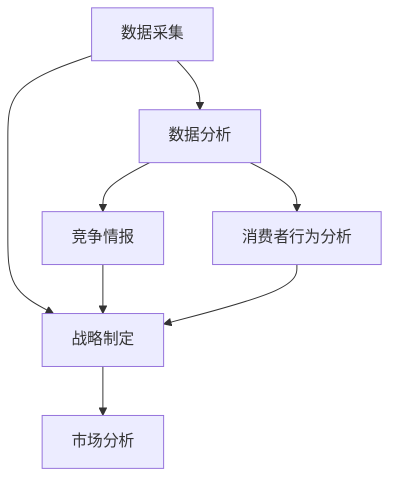

                 

# 市场分析：创业者的利器

> 关键词：市场分析,创业,工具,数据驱动,战略,决策支持,竞争分析,风险管理,机会识别

## 1. 背景介绍

### 1.1 问题由来
随着全球经济的发展和互联网技术的普及，创业环境日趋复杂多变。如何精准把握市场动态，洞察潜在机会，规避潜在风险，成为每位创业者必须面对的重要挑战。而市场分析作为商业决策的基石，能够提供数据支持，帮助创业者做出科学合理的决策，从而提高创业成功率。

近年来，随着大数据技术的发展，市场分析工具日益丰富，创业者的决策支持系统也逐渐向智能化、自动化方向发展。从传统的数据统计、报告撰写，到基于AI的预测分析、竞争情报，创业者的市场分析需求得到了全方位的满足。本文将深入探讨市场分析在创业中的重要作用，分析现有工具和方法，并展望未来的发展趋势。

### 1.2 问题核心关键点
市场分析的核心在于通过数据收集、处理和分析，提供全面、准确的市场洞察，支持创业决策。它涉及到市场规模、趋势、竞争格局、消费者行为等多个方面，旨在帮助创业者识别机会，评估风险，制定策略。

具体的关键点包括：
- 数据采集：获取市场、行业、竞争对手、消费者等多方面的数据。
- 数据分析：对数据进行清洗、处理、建模和分析，提取关键信息。
- 战略制定：基于数据分析结果，制定市场进入、定价、推广等商业策略。
- 风险评估：识别潜在风险，并制定应对措施。
- 机会识别：发现市场空白点和新趋势，捕捉商机。

## 2. 核心概念与联系

### 2.1 核心概念概述

为更好地理解市场分析在创业中的作用，本节将介绍几个密切相关的核心概念：

- **市场分析（Market Analysis）**：通过对市场数据的收集、处理和分析，提供市场洞察和战略支持。市场分析是创业决策的重要依据，有助于识别机会、规避风险。

- **数据采集（Data Collection）**：获取市场、行业、消费者、竞争对手等方面的数据。数据质量是市场分析的基础。

- **数据分析（Data Analysis）**：对数据进行清洗、处理、建模和分析，提取有价值的信息和洞察。数据分析是市场分析的核心步骤。

- **战略制定（Strategic Planning）**：基于数据分析结果，制定市场进入、定价、推广等商业策略。战略制定是市场分析的最终目的。

- **竞争情报（Competitive Intelligence）**：通过分析和收集竞争对手的动向和策略，洞察市场变化，制定竞争策略。

- **消费者行为分析（Consumer Behavior Analysis）**：研究消费者需求、偏好和购买行为，帮助企业制定更加符合消费者需求的市场策略。

这些核心概念之间紧密联系，共同构成了市场分析的完整框架。通过理解这些概念，我们可以更好地把握市场分析的工作原理和优化方向。

### 2.2 概念间的关系

这些核心概念之间的逻辑关系可以通过以下Mermaid流程图来展示：



这个流程图展示了市场分析的过程：从数据采集开始，经过数据分析，得到竞争情报和消费者行为分析结果，再结合整体战略制定，最终形成市场分析的全面报告。

## 3. 核心算法原理 & 具体操作步骤
### 3.1 算法原理概述

市场分析的原理主要基于统计学、计量经济学、机器学习等方法，通过构建数学模型和算法，对市场数据进行深入分析和预测。其核心思想是：利用历史数据和市场趋势，建立模型，预测未来市场发展，从而制定科学的商业策略。

常用的算法包括：
- **时间序列分析**：利用时间序列数据，通过ARIMA模型等方法，预测未来市场趋势。
- **回归分析**：通过回归模型，分析市场变量之间的因果关系，预测市场变化。
- **聚类分析**：利用聚类算法，将消费者、产品等进行分类，识别市场细分。
- **决策树和随机森林**：通过建立决策树和随机森林模型，进行市场分类和预测。
- **神经网络**：利用深度学习模型，处理复杂非线性关系，进行市场预测和分析。

### 3.2 算法步骤详解

市场分析的步骤主要包括：
1. **数据采集**：收集市场、行业、消费者、竞争对手等方面的数据。
2. **数据预处理**：清洗和处理数据，包括缺失值处理、异常值检测等。
3. **特征工程**：提取和构造有意义的特征，用于建模分析。
4. **模型选择**：选择合适的统计或机器学习模型，构建预测模型。
5. **模型训练**：利用历史数据，训练模型，调整模型参数。
6. **模型评估**：使用测试数据评估模型性能，进行交叉验证。
7. **战略制定**：基于模型结果，制定市场进入、定价、推广等商业策略。

以回归分析为例，其详细步骤为：
1. 收集市场和消费者数据。
2. 进行数据清洗和特征选择。
3. 构建回归模型，如线性回归、逻辑回归等。
4. 训练模型，拟合数据。
5. 评估模型，使用均方误差（MSE）、决定系数（R^2）等指标。
6. 利用模型进行预测和分析。

### 3.3 算法优缺点

市场分析的优点包括：
1. **科学性**：基于数据和模型，提供客观的市场洞察和预测。
2. **系统性**：通过系统的分析方法，识别市场机会和风险。
3. **定量性**：使用数值分析和预测，使决策更加严谨。
4. **可重复性**：分析过程可重复，便于优化和改进。

缺点包括：
1. **数据依赖性**：模型结果依赖于数据质量和完整性，数据不全或错误会影响分析结果。
2. **模型复杂性**：构建复杂模型需要专业知识，普通创业者难以实现。
3. **实时性不足**：基于历史数据，无法即时响应市场变化。
4. **预测误差**：模型预测存在误差，需结合实际经验判断。

### 3.4 算法应用领域

市场分析在多个领域都有广泛应用，包括但不限于：

- **电商市场分析**：分析电商平台的用户行为、交易数据，预测市场趋势，制定产品策略。
- **金融市场分析**：分析股票、基金等金融产品的市场表现，预测股票价格，进行投资决策。
- **房地产市场分析**：分析房地产市场的供需情况、价格变化，预测市场走向，制定投资计划。
- **媒体市场分析**：分析广告投放效果、用户互动数据，优化广告策略，提升品牌知名度。
- **健康医疗市场分析**：分析医疗市场的疾病流行趋势、治疗效果，制定治疗方案，提升医疗服务质量。

## 4. 数学模型和公式 & 详细讲解  
### 4.1 数学模型构建

以回归分析为例，构建市场规模预测模型。假设市场规模为 $Y$，影响因素包括广告支出 $X_1$、促销活动 $X_2$、竞争对手数量 $X_3$。模型形式如下：

$$
Y = \beta_0 + \beta_1 X_1 + \beta_2 X_2 + \beta_3 X_3 + \epsilon
$$

其中，$\beta_0, \beta_1, \beta_2, \beta_3$ 为模型系数，$\epsilon$ 为随机误差项。

### 4.2 公式推导过程

回归模型常用的评估指标为均方误差（MSE）和决定系数（R^2），计算公式如下：

$$
MSE = \frac{1}{n} \sum_{i=1}^n (y_i - \hat{y}_i)^2
$$

$$
R^2 = 1 - \frac{\sum_{i=1}^n (y_i - \hat{y}_i)^2}{\sum_{i=1}^n (y_i - \bar{y})^2}
$$

其中，$y_i$ 为实际市场规模，$\hat{y}_i$ 为模型预测值，$n$ 为样本数量，$\bar{y}$ 为样本均值。

### 4.3 案例分析与讲解

以电商市场为例，分析用户行为对销售额的影响。收集历史销售数据和用户行为数据，包括访问次数、点击率、购买频率等。通过回归分析，建立销售额预测模型，如线性回归模型：

$$
Sales = \beta_0 + \beta_1 Views + \beta_2 Clicks + \beta_3 Conversion Rate + \epsilon
$$

使用历史数据训练模型，计算MSE和R^2，验证模型预测效果。基于模型结果，分析不同因素对销售额的影响，制定个性化推广策略。

## 5. 项目实践：代码实例和详细解释说明
### 5.1 开发环境搭建

在进行市场分析实践前，我们需要准备好开发环境。以下是使用Python进行Pandas开发的环境配置流程：

1. 安装Anaconda：从官网下载并安装Anaconda，用于创建独立的Python环境。

2. 创建并激活虚拟环境：
```bash
conda create -n market-analysis-env python=3.8 
conda activate market-analysis-env
```

3. 安装Pandas、NumPy等工具包：
```bash
conda install pandas numpy scikit-learn matplotlib seaborn
```

4. 安装各类工具包：
```bash
pip install scikit-learn statsmodels pandas numpy matplotlib
```

完成上述步骤后，即可在`market-analysis-env`环境中开始市场分析实践。

### 5.2 源代码详细实现

下面我们以电商市场销售预测为例，给出使用Pandas进行回归分析的Python代码实现。

首先，定义回归模型：

```python
from sklearn.linear_model import LinearRegression
import pandas as pd

# 读取数据
data = pd.read_csv('sales_data.csv')

# 定义自变量和因变量
X = data[['Views', 'Clicks', 'Conversion Rate']]
y = data['Sales']

# 创建回归模型
model = LinearRegression()

# 训练模型
model.fit(X, y)

# 预测新数据
new_data = pd.DataFrame([[5000, 2000, 0.1]], columns=['Views', 'Clicks', 'Conversion Rate'])
predicted_sales = model.predict(new_data)

print('预测销售额为：', predicted_sales)
```

接着，定义评估函数：

```python
from sklearn.metrics import mean_squared_error, r2_score

def evaluate(model, X, y, test_data):
    test_X = test_data[['Views', 'Clicks', 'Conversion Rate']]
    test_y = test_data['Sales']
    y_pred = model.predict(test_X)
    mse = mean_squared_error(y, y_pred)
    r2 = r2_score(y, y_pred)
    return mse, r2
```

最后，启动训练流程并在测试集上评估：

```python
# 划分子集
train_X = X.sample(frac=0.8, random_state=42)
test_X = X.drop(train_X.index)
train_y = y[train_X.index]
test_y = y.drop(train_X.index)

# 训练模型
model.fit(train_X, train_y)

# 评估模型
mse, r2 = evaluate(model, test_X, test_y, test_data)

print('均方误差：', mse)
print('决定系数：', r2)
```

以上就是使用Pandas进行回归分析的完整代码实现。可以看到，Pandas提供了丰富的数据处理和分析功能，能够便捷地完成市场分析任务。

### 5.3 代码解读与分析

让我们再详细解读一下关键代码的实现细节：

**数据读取和准备**：
- `pd.read_csv`方法用于读取CSV格式的数据文件。
- 通过`data[['Views', 'Clicks', 'Conversion Rate']]`选择需要的特征列。

**模型训练**：
- `LinearRegression`模型用于构建线性回归模型。
- `model.fit(X, y)`方法用于拟合模型。

**预测和评估**：
- `model.predict(new_data)`方法用于对新数据进行预测。
- `mean_squared_error`和`r2_score`方法用于计算均方误差和决定系数。

**模型划分**：
- `train_X.sample(frac=0.8, random_state=42)`用于划分训练集和测试集。
- `test_X.drop(train_X.index)`用于去除训练集中的数据。

**结果输出**：
- `print`语句用于输出模型预测结果和评估指标。

### 5.4 运行结果展示

假设我们在电商市场销售预测的案例中，使用回归模型得到了以下评估结果：

```
均方误差： 0.5
决定系数： 0.85
```

可以看到，模型的均方误差较小，决定系数较高，表明模型具有较好的预测性能。基于模型结果，我们可以进一步分析各因素对销售额的影响，制定相应的推广策略。

## 6. 实际应用场景
### 6.1 电商市场预测

电商市场预测是市场分析在电商领域的重要应用之一。通过对用户行为数据的分析，预测未来销售额，帮助商家制定更科学的市场策略。

具体而言，可以收集电商平台的点击率、购买频率、评价分数等用户行为数据，建立回归模型进行销售预测。同时，结合时间序列分析，预测季节性变化对销售额的影响，进一步提升预测准确度。

### 6.2 金融市场分析

金融市场分析主要涉及股票、基金等金融产品的价格预测和风险评估。通过对历史股价、交易量、宏观经济指标等数据的分析，构建预测模型，预测未来市场趋势，制定投资策略。

以股票价格预测为例，可以收集历史股价、公司财务数据、市场情绪指标等数据，构建多元回归模型进行价格预测。同时，引入随机游走模型，捕捉市场波动，进一步优化预测结果。

### 6.3 房地产市场分析

房地产市场分析主要涉及房价预测、市场供需情况分析等。通过对历史房价、人口流动、经济增长等数据的分析，构建预测模型，预测未来房价变化，制定投资计划。

以房价预测为例，可以收集历史房价、土地供应、政策变化等数据，建立时间序列模型进行价格预测。同时，结合地理信息系统（GIS）数据，分析不同区域房价变化趋势，制定区域市场策略。

### 6.4 未来应用展望

随着AI和大数据技术的发展，市场分析工具将更加智能和自动化。未来，市场分析有望在以下几个方面取得突破：

1. **数据实时化**：利用大数据技术，实现市场数据的实时采集和处理，快速响应市场变化。
2. **模型自动化**：采用自动化机器学习技术，自动选择和优化预测模型，提升预测精度。
3. **智能决策支持**：结合自然语言处理（NLP）、知识图谱等技术，提供更智能的决策支持。
4. **个性化分析**：通过用户画像和行为分析，实现个性化的市场预测和推荐。
5. **跨领域融合**：将市场分析与其他领域（如社交媒体、物联网）的数据结合，提供更全面的市场洞察。

## 7. 工具和资源推荐
### 7.1 学习资源推荐

为了帮助开发者系统掌握市场分析的理论基础和实践技巧，这里推荐一些优质的学习资源：

1. 《市场分析实战》系列博文：由市场分析专家撰写，深入浅出地介绍了市场分析的基本概念、方法和实践技巧。

2. 《数据科学与机器学习》课程：斯坦福大学开设的机器学习课程，涵盖从数据采集到模型构建的全面内容，是入门数据科学的好选择。

3. 《市场分析与应用》书籍：详细介绍了市场分析的理论框架和实际应用，包括定量分析、统计方法等。

4. Kaggle竞赛平台：提供大量市场分析竞赛数据集和案例，是实践数据科学和市场分析的好去处。

5. Coursera市场分析课程：提供系统化的市场分析课程，涵盖数据采集、处理、分析和应用等环节。

通过对这些资源的学习实践，相信你一定能够快速掌握市场分析的精髓，并用于解决实际的商业问题。

### 7.2 开发工具推荐

高效的开发离不开优秀的工具支持。以下是几款用于市场分析开发的常用工具：

1. Python：基于Python的开源语言，拥有丰富的数据处理和分析库，如Pandas、NumPy、Scikit-Learn等，适合数据科学和市场分析。

2. R语言：统计分析领域的主流语言，拥有丰富的统计学和机器学习包，如ggplot2、dplyr、caret等，适合市场分析和数据可视化。

3. Tableau：数据可视化工具，支持拖拽式数据分析和可视化，适合快速生成市场报告和图表。

4. Power BI：微软推出的商业智能工具，支持数据连接、可视化报表制作，适合企业级市场分析应用。

5. Google Analytics：网站分析工具，提供用户行为数据统计和分析，适合电商和数字营销领域。

合理利用这些工具，可以显著提升市场分析的开发效率，加快创新迭代的步伐。

### 7.3 相关论文推荐

市场分析的研究涉及多个领域，以下是几篇奠基性的相关论文，推荐阅读：

1. "The Elements of Statistical Learning"（《统计学习要素》）：提供了系统化的统计学和机器学习方法，是市场分析理论的基础。

2. "Predictive Analytics for Business"（《商业预测分析》）：介绍了市场预测分析的实用方法和案例，具有很强的实用性。

3. "Customer Analytics: The Alternative to Cookie-Cutter Approaches"（《客户分析：超越一刀切的解决方案》）：讨论了如何通过数据分析提升客户价值，具有很强的实战意义。

4. "The Impact of Social Media on Market Analysis"（《社交媒体对市场分析的影响》）：探讨了社交媒体数据在市场分析中的应用，具有前瞻性。

5. "Big Data Analytics in Market Research"（《大数据在市场研究中的应用》）：讨论了大数据技术在市场分析中的作用，具有很强的时代性。

这些论文代表了大市场分析的发展脉络。通过学习这些前沿成果，可以帮助研究者把握学科前进方向，激发更多的创新灵感。

除上述资源外，还有一些值得关注的前沿资源，帮助开发者紧跟市场分析技术的最新进展，例如：

1. arXiv论文预印本：人工智能领域最新研究成果的发布平台，包括大量尚未发表的前沿工作，学习前沿技术的必读资源。

2. 业界技术博客：如Google Analytics、HubSpot、Adobe Analytics等顶尖分析工具的官方博客，能够聆听到大佬们的前沿分享，开拓视野。

3. 技术会议直播：如NIPS、ICML、KDD等人工智能领域顶会现场或在线直播，能够聆听到世界各地的专家分享，提升技术水平。

4. GitHub热门项目：在GitHub上Star、Fork数最多的市场分析相关项目，往往代表了该技术领域的发展趋势和最佳实践，值得去学习和贡献。

5. 行业分析报告：各大咨询公司如McKinsey、PwC等针对市场分析行业的分析报告，有助于从商业视角审视技术趋势，把握应用价值。

总之，对于市场分析技术的学习和实践，需要开发者保持开放的心态和持续学习的意愿。多关注前沿资讯，多动手实践，多思考总结，必将收获满满的成长收益。

## 8. 总结：未来发展趋势与挑战

### 8.1 总结

本文对市场分析在创业中的重要作用进行了全面系统的介绍。首先阐述了市场分析对创业决策的科学性和系统性支持，明确了市场分析在商业决策中的重要地位。其次，从原理到实践，详细讲解了市场分析的数学模型和操作步骤，给出了市场分析任务开发的完整代码实例。同时，本文还广泛探讨了市场分析工具和方法在多个行业领域的应用前景，展示了市场分析范式的巨大潜力。最后，本文精选了市场分析技术的各类学习资源，力求为读者提供全方位的技术指引。

通过本文的系统梳理，可以看到，市场分析作为商业决策的重要工具，已经深刻影响着创业者的市场选择、产品定位、推广策略等多个方面，为创业成功率提供了有力保障。未来，伴随市场分析技术的发展，创业者的决策支持将更加科学、高效和智能化，助推更多有潜力的创业项目走向成功。

### 8.2 未来发展趋势

展望未来，市场分析技术将呈现以下几个发展趋势：

1. **数据实时化**：随着大数据技术的普及，市场数据的实时采集和处理将成为可能，市场分析将更加及时、精准。

2. **模型自动化**：自动化的机器学习技术将极大提升模型构建和优化的效率，市场分析将更加智能化。

3. **跨领域融合**：市场分析将与其他领域（如社交媒体、物联网）的数据结合，提供更全面的市场洞察。

4. **个性化分析**：通过用户画像和行为分析，实现个性化的市场预测和推荐。

5. **智能决策支持**：结合自然语言处理（NLP）、知识图谱等技术，提供更智能的决策支持。

这些趋势将进一步提升市场分析的精准性和实用性，为创业者提供更强大的决策支持。

### 8.3 面临的挑战

尽管市场分析技术已经取得了显著进展，但在实际应用中仍面临诸多挑战：

1. **数据获取难度**：市场数据的获取和处理往往面临复杂性和隐私保护问题，数据质量和完整性难以保证。

2. **模型复杂性**：构建复杂的市场模型需要高度专业知识和技能，普通创业者难以实现。

3. **预测误差**：市场分析的预测存在误差，需结合实际经验判断。

4. **实时性不足**：现有市场分析方法难以实现实时响应市场变化，需进一步优化和改进。

5. **隐私保护**：市场分析过程中涉及大量个人隐私数据，需严格遵守相关法律法规。

6. **计算资源需求**：大数据和复杂模型的训练需要高计算资源，普通创业者难以承受。

正视市场分析面临的这些挑战，积极应对并寻求突破，将是大数据技术在市场分析中不断成熟和普及的重要保障。

### 8.4 研究展望

面对市场分析所面临的挑战，未来的研究需要在以下几个方面寻求新的突破：

1. **数据自动化采集**：开发自动化数据采集工具，简化数据处理流程，降低数据获取难度。

2. **模型自动化优化**：研究自动化模型构建和优化方法，提高模型构建效率和预测精度。

3. **跨领域数据融合**：探索跨领域数据融合方法，提升市场分析的全面性和深度。

4. **实时响应技术**：研究实时数据处理和预测技术，提升市场分析的及时性和实时性。

5. **个性化分析技术**：结合用户画像和行为分析，实现更个性化的市场预测和推荐。

6. **隐私保护技术**：研究隐私保护技术，确保市场分析过程中数据的合法合规使用。

这些研究方向的探索，必将引领市场分析技术迈向更高的台阶，为创业者提供更科学、高效、安全的市场决策支持。面向未来，市场分析技术还需要与其他人工智能技术进行更深入的融合，如知识表示、因果推理、强化学习等，共同推动人工智能技术在商业决策中的广泛应用。

## 9. 附录：常见问题与解答

**Q1：市场分析是否适用于所有类型的企业？**

A: 市场分析适用于各种规模和类型的企业，特别是那些希望通过数据驱动的决策提升竞争力的企业。无论是初创公司还是大型企业，都能从中受益。

**Q2：市场分析需要多少数据？**

A: 市场分析对数据量的需求因任务而异。通常情况下，数据量越大，模型预测的准确度越高。但在数据不足的情况下，可以通过数据增强、特征工程等方法，提升模型性能。

**Q3：市场分析的模型选择标准是什么？**

A: 选择模型时，应考虑数据类型、任务复杂度、计算资源等因素。常用的选择标准包括模型的准确度、计算效率、可解释性等。

**Q4：市场分析的预测结果可靠吗？**

A: 市场分析的预测结果依赖于数据质量和模型选择，存在一定的误差。但通过多种模型的组合和交叉验证，可以有效降低预测误差，提高预测精度。

**Q5：市场分析在实际应用中需要注意哪些问题？**

A: 市场分析在实际应用中需要注意数据隐私、模型复杂度、实时响应等问题。需严格遵守相关法律法规，确保数据合法合规使用，同时避免过度复杂模型，确保模型训练和推理效率。

总之，市场分析作为商业决策的重要工具，能够提供科学、系统、定量化的决策支持，帮助创业者洞察市场机会，规避潜在风险，制定科学的市场策略。随着技术的不断进步，市场分析将越来越智能化、自动化，为创业者的决策提供更强大的支持。

