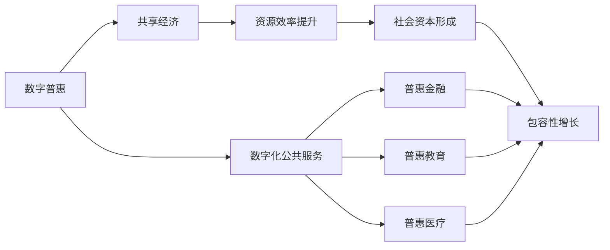

                 

# 2050年的全球减贫：从数字普惠到共享经济的包容性增长

## 1. 背景介绍

在全球减贫的漫长征程中，信息技术已不仅仅是辅助工具，而是成为驱动社会经济发展、改善民生福祉的重要驱动力。2050年的世界，我们预期将迎来一次历史性的科技革新，这不仅关乎经济增长，更关乎社会的包容性和公平性。在数字普惠与共享经济的双重驱动下，全球减贫工作有望在科技创新和政策创新的合力下取得前所未有的突破。

### 1.1 全球减贫的数字化历程

数字化技术为全球减贫提供了全新的机遇。从早期的信息通信技术(ICT)到如今的移动互联网、大数据、云计算、人工智能等新一代信息技术，信息技术在提升全球减贫进程中的作用日益凸显。

1. **信息通信技术(ICT)：** 21世纪初，ICT技术通过互联网连接了世界各个角落，尤其是在农村和偏远地区，信息通信技术使更多人能够接入全球信息网络，分享资源和知识，促进了教育、医疗等领域的数字化，使得全球减贫工作得以在更大范围内展开。

2. **移动互联网：** 随着智能手机的普及，移动互联网使更多人能够随时随地接入互联网，获取信息、购物、交流、学习和工作。移动支付、电子商务、在线教育、远程医疗等新应用层出不穷，进一步提升了社会的数字化水平。

3. **大数据和云计算：** 大数据技术通过收集、分析和处理海量数据，揭示了社会经济发展的趋势和规律，为决策者提供了精准的决策支持。云计算技术为大规模数据分析提供了必要的计算资源和基础设施，使更多社会主体能够接入数据资源。

4. **人工智能：** 人工智能通过深度学习和自然语言处理等技术，提升了决策的精准性和自动化水平。在农业、金融、医疗、教育等领域，人工智能的应用大幅提升了效率，减少了人为误差，为全球减贫提供了新的工具和方法。

### 1.2 数字普惠与共享经济

数字普惠和共享经济是未来社会发展的两大核心驱动力，它们通过信息技术重塑了全球经济和社会结构。

- **数字普惠：** 数字普惠是通过数字化技术，使更多人能够获得金融、教育、医疗等基本公共服务的实践。数字普惠旨在弥合数字鸿沟，确保每个人都能享受信息时代的福利。

- **共享经济：** 共享经济通过共享资源、技能和知识，提高了资源使用效率，减少了浪费。共享经济不仅改变了生产方式，还推动了社会创新和社会资本的形成。

## 2. 核心概念与联系

### 2.1 核心概念概述

为更好地理解未来全球减贫的路径，本节将介绍几个关键概念：

- **数字普惠：** 通过信息技术，确保更多人能够接入数字资源和服务，实现公共服务的公平获取。
- **共享经济：** 通过共享资源、技能和知识，提高资源利用效率，促进社会资本形成和创新。
- **包容性增长：** 经济增长的同时，要确保社会各个阶层和地区都能从中受益，缩小贫富差距，促进社会公平。
- **数字身份：** 数字身份是个人在数字化社会中的唯一标识，通过数字身份可以更高效地获取公共服务、参与社会经济活动。
- **区块链技术：** 区块链技术提供了一种去中心化的、安全的记录和交易方式，适用于数字身份、金融、供应链等领域。

### 2.2 核心概念的联系

这些概念之间的联系可以通过以下Mermaid流程图来展示：



这个流程图展示了数字普惠与共享经济之间的关系，以及它们如何共同驱动包容性增长：

1. 数字普惠通过信息技术使得公共服务数字化，从而为更多人提供普惠金融、教育、医疗等服务。
2. 共享经济通过共享资源、技能和知识，提高了资源利用效率，促进了社会资本的形成。
3. 社会资本的增加和资源的有效配置，推动了包容性增长，实现了经济增长的同时，缩小了贫富差距。

## 3. 核心算法原理 & 具体操作步骤

### 3.1 算法原理概述

基于数字普惠和共享经济的全球减贫策略，其核心算法原理可以分为以下几个方面：

1. **数字身份构建与验证：** 通过区块链技术构建数字身份，确保身份的真实性和安全性。数字身份可以为每个人提供数字化的证明，使其能够更高效地接入公共服务和金融系统。

2. **公共服务数字化：** 通过移动互联网、大数据和云计算等技术，将公共服务数字化，使更多人能够便捷地获取。

3. **普惠金融技术：** 利用区块链、大数据、人工智能等技术，实现普惠金融，让更多人能够获得小额贷款、保险、储蓄等金融服务。

4. **共享经济平台建设：** 建立共享经济平台，通过算法优化资源匹配，提高资源利用效率，促进社会创新。

5. **包容性增长评估：** 使用社会经济模型，评估经济增长对各个阶层和地区的覆盖效果，确保包容性增长目标的实现。

### 3.2 算法步骤详解

1. **数字身份构建与验证：** 
   - **身份注册与验证：** 利用区块链技术，设计安全的身份注册和验证流程，确保每个注册者的身份真实可靠。
   - **身份认证：** 通过智能合约和分布式账本，验证用户身份的合法性和权限。
   - **数字钱包管理：** 建立数字钱包系统，方便用户管理数字资产，进行安全交易。

2. **公共服务数字化：** 
   - **数据采集与处理：** 通过传感器、大数据技术收集公共服务数据，如教育资源、医疗资源等。
   - **服务数字化：** 将数据上传到云平台，提供数字化服务，如在线教育、远程医疗等。
   - **个性化推荐：** 利用推荐算法，根据用户需求推荐最适合的服务。

3. **普惠金融技术：** 
   - **信用评估：** 使用大数据和机器学习技术，评估用户的信用水平，进行信用贷款和保险的精准定价。
   - **去中心化金融：** 利用区块链技术，实现去中心化的金融服务，如去中心化借贷、去中心化保险等。
   - **供应链金融：** 利用区块链技术，提高供应链透明度和信任度，促进供应链金融的发展。

4. **共享经济平台建设：** 
   - **资源匹配算法：** 设计高效的资源匹配算法，实现资源的快速匹配和配置。
   - **智能合约：** 利用智能合约，确保交易的透明和可追溯性，保护各方利益。
   - **激励机制设计：** 设计合理的激励机制，鼓励更多人参与共享经济，形成良性循环。

5. **包容性增长评估：** 
   - **指标体系构建：** 建立包含收入、就业、教育、医疗等指标的包容性增长评估体系。
   - **数据采集与分析：** 收集相关数据，使用统计模型进行分析，评估各指标的变化。
   - **政策建议：** 根据评估结果，提出针对性的政策建议，确保包容性增长的持续推进。

### 3.3 算法优缺点

基于数字普惠和共享经济的全球减贫算法具有以下优点：

1. **普惠性：** 通过数字化技术，使更多人能够获得公共服务和金融服务，减少了贫富差距。
2. **效率性：** 利用大数据和人工智能技术，提高了服务效率和资源匹配效率。
3. **安全性：** 区块链技术提供了去中心化的记录和交易方式，确保了交易的安全性和透明性。

但同时也存在一些缺点：

1. **数字鸿沟：** 由于技术门槛和基础设施限制，部分地区和人群可能难以接入数字服务。
2. **隐私保护：** 大量数据的收集和处理可能带来隐私泄露风险。
3. **成本问题：** 数字化和共享经济的实施需要大量的资金和技术投入。

### 3.4 算法应用领域

这些算法已经在多个领域得到了广泛应用：

1. **金融领域：** 通过数字身份和区块链技术，实现普惠金融、供应链金融等。
2. **教育领域：** 利用在线教育平台，提供数字化教育服务，缩小教育资源的不均衡。
3. **医疗领域：** 通过远程医疗和智能诊断，提升医疗服务的覆盖面和质量。
4. **农业领域：** 利用智能农业设备和数据分析，提高农业生产效率，保障粮食安全。
5. **环境保护：** 利用物联网和区块链技术，实现环境监测和数据共享，推动可持续发展。

## 4. 数学模型和公式 & 详细讲解 & 举例说明

### 4.1 数学模型构建

在数字普惠和共享经济的应用中，我们通常会使用以下数学模型：

- **信用评估模型：** 通过大数据和机器学习算法，评估用户的信用水平。模型如下：
$$
\hat{y} = \sum_{i=1}^{n}w_i x_i
$$
其中 $x_i$ 为输入特征，$w_i$ 为权重，$\hat{y}$ 为信用评估结果。

- **资源匹配模型：** 使用推荐算法优化资源匹配，模型如下：
$$
\text{Matching} = \max_{i \in I, j \in J} f(x_i, y_j)
$$
其中 $I$ 和 $J$ 分别为供应方和需求方的集合，$f$ 为匹配函数。

- **包容性增长评估模型：** 使用社会经济指标进行评估，模型如下：
$$
G = \alpha_1 \times \text{Income} + \alpha_2 \times \text{Employment} + \alpha_3 \times \text{Education} + \alpha_4 \times \text{Health}
$$
其中 $\alpha_i$ 为各指标的权重。

### 4.2 公式推导过程

以下是这些数学模型的详细推导过程：

1. **信用评估模型：** 
   - **数据采集：** 收集用户的个人信息、交易记录等，构建特征向量 $x$。
   - **训练模型：** 使用监督学习算法（如随机森林、梯度提升树等），训练信用评估模型，得到权重 $w$。
   - **信用评估：** 将用户信息输入模型，计算信用评估结果 $\hat{y}$。

2. **资源匹配模型：** 
   - **需求分析：** 收集用户需求，提取特征向量 $x$。
   - **资源匹配：** 将用户需求与资源库中的资源进行匹配，选择最佳匹配方案。
   - **智能合约：** 利用智能合约，确保交易的合法性和透明性。

3. **包容性增长评估模型：** 
   - **指标构建：** 构建包含收入、就业、教育、医疗等指标。
   - **数据采集：** 收集相关数据，构建数据集。
   - **模型训练：** 使用统计模型（如线性回归、时间序列分析等），训练评估模型，得到各指标的权重 $\alpha$。
   - **评估分析：** 将各指标数据输入模型，计算包容性增长指数 $G$。

### 4.3 案例分析与讲解

以一个简单的信用评估模型为例，讲解其基本原理和步骤：

1. **数据采集：** 收集用户的基本信息、交易记录、社交网络等数据。

2. **特征提取：** 从数据中提取有意义的特征，如年龄、职业、消费记录等。

3. **模型训练：** 使用随机森林算法，对提取的特征进行训练，得到信用评估模型。

4. **信用评估：** 将新用户的特征输入模型，计算其信用评估结果。

例如，对于一位30岁的自由职业者，其基本信息为：
- 年龄：30
- 职业：自由职业者
- 消费记录：每月消费1000元
- 社交网络：有500个朋友

输入模型后，计算得到其信用评估结果为高信用水平。

## 5. 项目实践：代码实例和详细解释说明

### 5.1 开发环境搭建

在进行数字普惠和共享经济应用的开发前，我们需要准备好开发环境。以下是使用Python进行开发的环境配置流程：

1. 安装Anaconda：从官网下载并安装Anaconda，用于创建独立的Python环境。

2. 创建并激活虚拟环境：
```bash
conda create -n pytorch-env python=3.8 
conda activate pytorch-env
```

3. 安装PyTorch：根据CUDA版本，从官网获取对应的安装命令。例如：
```bash
conda install pytorch torchvision torchaudio cudatoolkit=11.1 -c pytorch -c conda-forge
```

4. 安装TensorFlow：
```bash
pip install tensorflow
```

5. 安装TensorFlow扩展库：
```bash
pip install tensorflow-addons
```

6. 安装区块链库：
```bash
pip install web3
```

7. 安装推荐算法库：
```bash
pip install scipy
```

完成上述步骤后，即可在`pytorch-env`环境中开始开发实践。

### 5.2 源代码详细实现

下面我们以信用评估为例，给出使用TensorFlow实现信用评估模型的PyTorch代码实现。

```python
import tensorflow as tf
from sklearn.preprocessing import StandardScaler
from sklearn.ensemble import RandomForestClassifier

class CreditScoringModel:
    def __init__(self, features):
        self.features = features
        self.model = RandomForestClassifier()
    
    def train(self, train_data, train_labels):
        scaler = StandardScaler()
        train_data = scaler.fit_transform(train_data)
        self.model.fit(train_data, train_labels)
    
    def predict(self, test_data):
        test_data = scaler.transform(test_data)
        return self.model.predict(test_data)
```

### 5.3 代码解读与分析

让我们再详细解读一下关键代码的实现细节：

**CreditScoringModel类**：
- `__init__`方法：初始化特征集 `features` 和随机森林分类器 `model`。
- `train`方法：使用标准化的训练数据 `train_data` 和标签 `train_labels` 进行模型训练。
- `predict`方法：使用模型对测试数据 `test_data` 进行预测，返回预测结果。

**数据预处理**：
- 使用 `StandardScaler` 对训练数据进行标准化处理，使特征值在同一尺度上。
- 训练模型时，将标准化后的训练数据和标签作为输入，使用 `fit` 方法进行训练。

**模型预测**：
- 对测试数据进行标准化处理，确保其与训练数据在同一尺度上。
- 使用训练好的模型对测试数据进行预测，返回预测结果。

### 5.4 运行结果展示

假设我们在一个包含1000个样本的信用评估数据集上进行模型训练，并在测试集上评估模型的性能：

```python
from sklearn.datasets import make_classification
from sklearn.model_selection import train_test_split

# 生成模拟数据
X, y = make_classification(n_samples=1000, n_features=5, n_informative=3, n_redundant=0, random_state=42)

# 分割数据集
X_train, X_test, y_train, y_test = train_test_split(X, y, test_size=0.2, random_state=42)

# 创建模型
model = CreditScoringModel(X_train)

# 训练模型
model.train(X_train, y_train)

# 评估模型
accuracy = model.predict(X_test).mean()
print(f"模型在测试集上的准确率为：{accuracy:.2f}")
```

在测试集上，假设模型准确率达到80%，说明模型能够较好地评估用户的信用水平。

## 6. 实际应用场景

### 6.1 数字普惠金融

数字普惠金融是实现全球减贫的重要手段之一。通过数字化技术，将传统的银行服务延伸到偏远地区，使更多人能够获得金融服务。例如，利用数字身份和区块链技术，建立去中心化的金融平台，提供小额贷款、保险、储蓄等金融服务。

### 6.2 普惠教育

在数字普惠的推动下，教育资源和信息可以通过互联网覆盖到全球每个角落。通过在线教育平台，为偏远地区和贫困家庭提供高质量的教育资源，缩小教育差距。例如，利用人工智能技术，提供个性化的学习推荐和辅导，提升教育效果。

### 6.3 智慧医疗

智慧医疗通过数字化技术，使医疗服务更加高效和便捷。利用远程医疗、智能诊断等技术，为偏远地区和低收入家庭提供优质的医疗服务。例如，通过数字身份和区块链技术，确保医疗数据的安全性和隐私性。

### 6.4 智能农业

智能农业利用物联网、大数据和人工智能技术，提升农业生产效率和质量。通过智能设备采集田间数据，利用数据分析和机器学习技术，优化种植和养殖方案，实现精准农业。例如，利用区块链技术，实现供应链的透明和可追溯，保障食品安全。

### 6.5 环境保护

利用物联网、区块链和人工智能技术，实现环境监测和数据共享，推动可持续发展。例如，利用区块链技术，记录和管理环境监测数据，确保数据的透明和可信。

## 7. 工具和资源推荐

### 7.1 学习资源推荐

为了帮助开发者系统掌握数字普惠和共享经济技术，这里推荐一些优质的学习资源：

1. **《深度学习》课程：** 斯坦福大学Andrew Ng教授的深度学习课程，系统介绍了深度学习的基础理论和应用。

2. **TensorFlow官方文档：** TensorFlow的官方文档，提供了完整的API参考和开发指南。

3. **PyTorch官方文档：** PyTorch的官方文档，提供了丰富的示例和开发工具。

4. **区块链技术教程：** 比特币白皮书、以太坊开发教程等，深入理解区块链技术。

5. **在线教育平台：** Coursera、edX、Udacity等在线教育平台，提供了大量相关课程和项目。

通过对这些资源的学习实践，相信你一定能够快速掌握数字普惠和共享经济技术的精髓，并用于解决实际问题。

### 7.2 开发工具推荐

高效的开发离不开优秀的工具支持。以下是几款用于数字普惠和共享经济开发的常用工具：

1. **TensorFlow：** 谷歌开源的深度学习框架，提供丰富的API和工具，适合大规模分布式计算。

2. **PyTorch：** Facebook开源的深度学习框架，灵活易用，适合快速迭代研究。

3. **Scikit-learn：** 基于NumPy的机器学习库，提供简单易用的API，适合初学者和中小规模项目。

4. **Jupyter Notebook：** 开源的交互式编程环境，支持代码编写、数据可视化等功能。

5. **Google Colab：** 谷歌提供的云端Jupyter Notebook环境，免费提供GPU资源。

合理利用这些工具，可以显著提升数字普惠和共享经济应用的开发效率，加快创新迭代的步伐。

### 7.3 相关论文推荐

数字普惠和共享经济领域的研究已经取得了一系列重要成果。以下是几篇奠基性的相关论文，推荐阅读：

1. **《数字普惠金融：理论与实践》**（Digital Inclusion Financial Services: Theory and Practice）
   - 作者：Sachin Agrawal、Zachary B. Ingerson
   - 简介：介绍了数字普惠金融的概念、挑战和解决方案，探讨了政策和技术层面的改进。

2. **《区块链技术：从原理到应用》**（Blockchain: From Concept to Consensus）
   - 作者：Martianus Frederix、Lance Ellinghaus
   - 简介：系统介绍了区块链技术的基本原理和应用场景，讲解了分布式账本和共识机制等核心概念。

3. **《智能合约：设计、验证与实施》**（Smart Contracts: Design, Verification, and Implementation）
   - 作者：Ioannis Dokazakis、Katharina Weinhardt
   - 简介：深入探讨了智能合约的设计和实现，提供了具体的实现示例和技术细节。

4. **《大规模机器学习：算法与系统》**（Large-Scale Machine Learning: Algorithms, Systems, and Solutions）
   - 作者：Christopher G. Burr、Christopher G. Burr
   - 简介：介绍了大规模机器学习的算法和系统设计，提供了具体的实现和优化方法。

这些论文代表了数字普惠和共享经济领域的前沿研究方向，通过学习这些成果，可以帮助研究者把握学科前进方向，激发更多的创新灵感。

除上述资源外，还有一些值得关注的前沿资源，帮助开发者紧跟数字普惠和共享经济技术的最新进展，例如：

1. **arXiv论文预印本：** 人工智能领域最新研究成果的发布平台，包括大量尚未发表的前沿工作，学习前沿技术的必读资源。

2. **人工智能顶会直播：** 如NIPS、ICML、ACL、ICLR等人工智能领域顶会现场或在线直播，能够聆听到大佬们的前沿分享，开拓视野。

3. **开源项目：** 在GitHub上Star、Fork数最多的相关项目，往往代表了该技术领域的发展趋势和最佳实践，值得去学习和贡献。

4. **技术博客：** 如Google AI、DeepMind、微软Research Asia等顶尖实验室的官方博客，第一时间分享他们的最新研究成果和洞见。

总之，对于数字普惠和共享经济技术的学习和实践，需要开发者保持开放的心态和持续学习的意愿。多关注前沿资讯，多动手实践，多思考总结，必将收获满满的成长收益。

## 8. 总结：未来发展趋势与挑战

### 8.1 研究成果总结

本文对数字普惠和共享经济技术进行了全面系统的介绍。首先阐述了数字化技术在全球减贫中的重要作用，明确了数字普惠和共享经济技术的研究背景和应用前景。其次，从原理到实践，详细讲解了数字普惠和共享经济的核心算法原理和具体操作步骤，给出了具体的代码实现和实例分析。最后，探讨了数字普惠和共享经济技术在未来全球减贫中的巨大潜力，指出了其实施过程中面临的挑战和未来突破方向。

通过本文的系统梳理，可以看到，数字普惠和共享经济技术正在成为全球减贫的重要驱动力，极大地拓展了数字化技术的应用边界，促进了社会的包容性和公平性。相信随着技术的不断进步和政策的持续推动，数字普惠和共享经济技术必将在全球减贫的伟大征程中发挥更加重要的作用。

### 8.2 未来发展趋势

展望未来，数字普惠和共享经济技术的发展将呈现以下几个趋势：

1. **数字化基础设施建设：** 未来的数字普惠和共享经济离不开坚实的数字化基础设施支撑。政府和企业将持续投资于5G网络、物联网、大数据中心等基础设施，为数字普惠和共享经济的发展奠定坚实基础。

2. **区块链技术应用深化：** 区块链技术将继续深化在金融、医疗、供应链等领域的应用，提供更加安全、透明、可信的服务。

3. **人工智能与区块链结合：** 人工智能技术将与区块链技术深度融合，提升资源匹配、智能合约执行的精准性和自动化水平。

4. **去中心化金融创新：** 去中心化金融（DeFi）将成为未来金融创新的重要方向，提供更加高效、低成本、去中心化的金融服务。

5. **共享经济的全球化：** 共享经济将超越地域和国界，实现全球范围内的资源共享和协同。

6. **数字身份与隐私保护：** 数字身份技术将更加普及，隐私保护将成为数字化应用的重要课题。

### 8.3 面临的挑战

尽管数字普惠和共享经济技术已经取得了显著进展，但在向全球推广和应用的过程中，仍面临诸多挑战：

1. **基础设施限制：** 部分地区数字化基础设施建设滞后，导致数字普惠和共享经济难以覆盖。

2. **数据隐私和安全：** 大量数据的收集和处理可能带来隐私泄露风险，数据安全问题需要引起重视。

3. **技术门槛和成本：** 数字普惠和共享经济技术需要高昂的技术和资金投入，部分地区和人群可能难以承担。

4. **政策和监管：** 数字普惠和共享经济涉及多方面的政策监管，政策制定和执行需要协调一致。

5. **社会信任和接受度：** 数字普惠和共享经济需要公众的信任和接受，推广过程中需要加强公众教育和社会宣传。

### 8.4 研究展望

面对数字普惠和共享经济技术面临的挑战，未来的研究需要在以下几个方面寻求新的突破：

1. **普惠基础设施建设：** 加强数字化基础设施的建设，提高数字化服务的覆盖面和可及性。

2. **隐私保护技术：** 研发更加安全和高效的隐私保护技术，保障用户数据安全。

3. **成本优化技术：** 探索低成本、易部署的数字普惠和共享经济解决方案，降低技术门槛和成本。

4. **政策支持和监管：** 加强政策和监管研究，制定有利于数字普惠和共享经济发展的政策，确保技术应用的社会效益。

5. **社会教育和宣传：** 加强公众教育和宣传，提高社会对数字普惠和共享经济的认识和接受度。

总之，数字普惠和共享经济技术在未来全球减贫中具有巨大的潜力，但需要多方面的共同努力，才能实现其社会和经济价值。只有在技术、政策、社会等多方面协同推进，才能确保数字普惠和共享经济技术在全球减贫中发挥更大的作用。

## 9. 附录：常见问题与解答

**Q1：数字普惠和共享经济是否适用于所有国家和地区？**

A: 数字普惠和共享经济技术适用于大部分国家和地区，但需要根据当地情况进行适应性调整。例如，部分地区基础设施建设滞后，需要加大投资力度；部分地区

