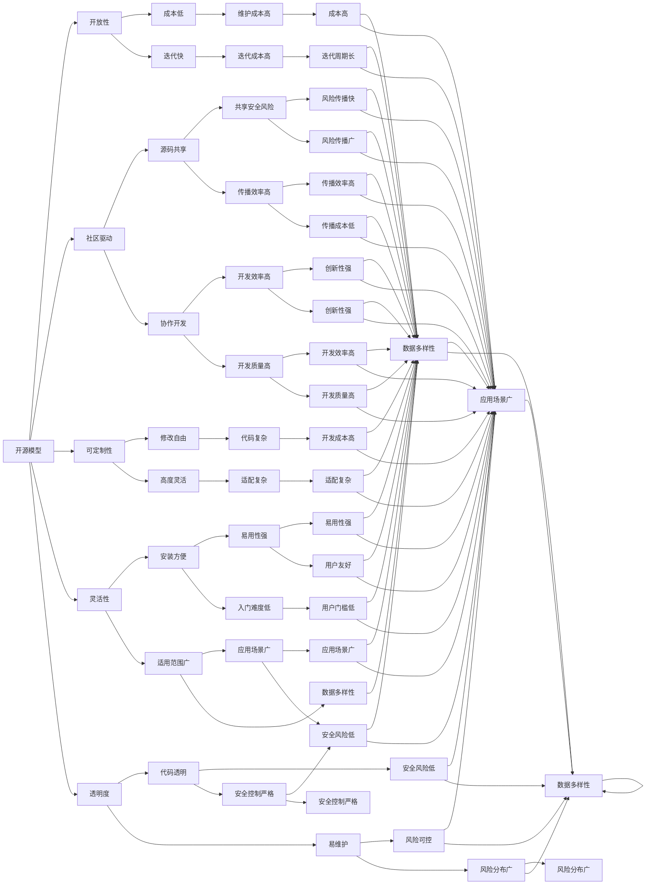
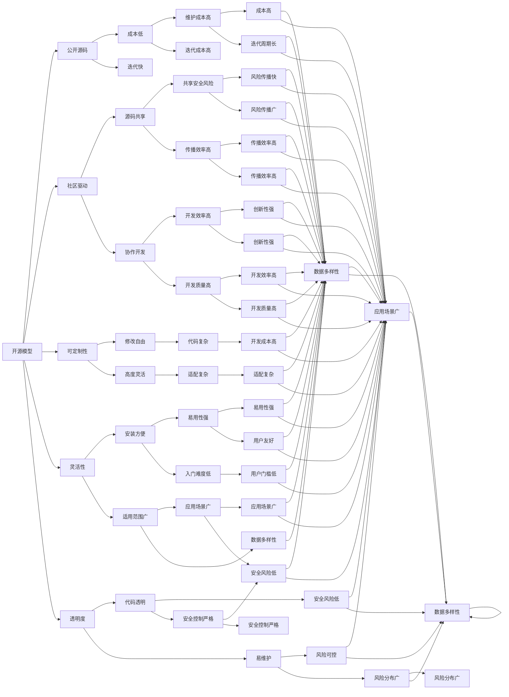

                 

# 开源模型与闭源模型的对比

在人工智能领域，开源模型和闭源模型都是实现机器学习和深度学习的重要手段。它们各有优缺点，在不同应用场景中扮演着不同的角色。本文将对开源模型与闭源模型进行深入比较，从概念、原理、技术、应用等多个角度全面解析它们之间的异同点，并为开发者提供选型建议。

## 1. 背景介绍

### 1.1 问题由来
随着人工智能技术的不断发展和应用，开源模型和闭源模型成为两个主要的技术阵营。开源模型以其开放性、透明性、社区驱动等特点受到开发者和研究者的青睐；闭源模型则凭借其商业化应用、高效性能、专业化服务等独特优势在产业界占据重要地位。两者的优劣之争从未停歇，但如何合理选择使用它们，发挥各自优势，成为当前技术研究和工程实践中亟需解决的问题。

### 1.2 问题核心关键点
开源模型与闭源模型的区别主要在于其**开放性**和**商业化**的差异。开源模型强调开放、共享和协作，通过社区驱动不断改进和完善；闭源模型则聚焦于性能、安全和服务，通过商业运作实现模型的优化和部署。二者在性能、成本、灵活性、隐私保护等方面存在显著差异，选择合适的模型直接影响应用系统的开发和部署。

### 1.3 问题研究意义
本文旨在通过对比开源模型与闭源模型的异同，为开发者提供更清晰的选型指南，帮助其在不同应用场景下选择最合适的模型，以实现最优的技术效果和经济效益。这不仅有助于推动人工智能技术在各行各业的广泛应用，还能促进技术创新和产业升级。

## 2. 核心概念与联系

### 2.1 核心概念概述

#### 开源模型
开源模型是指通过公开源代码的方式共享的机器学习和深度学习模型。开源模型通常以GitHub等平台为依托，允许用户自由下载、使用、修改和分享。其核心优势在于透明度高、社区支持强、可定制性强，但也面临维护成本高、版本迭代快等挑战。

#### 闭源模型
闭源模型是指由公司或组织开发、拥有并严格控制其源代码和分发方式的机器学习和深度学习模型。闭源模型通过商业化运作，提供专业的技术服务、高效性能和专属服务。其优势在于性能优化、安全性高、服务质量可靠，但成本较高、可定制性相对较弱。

### 2.2 概念间的关系

开源模型与闭源模型之间的联系主要体现在模型原理、应用场景和开发工具等方面。尽管两者的设计思路和部署方式存在显著差异，但它们共同构成了当前人工智能模型生态系统的核心，为不同需求和应用提供了多样化的选择。



### 2.3 核心概念的整体架构

开源模型与闭源模型的整体架构可以通过以下流程图来展示：



通过以上流程图，我们可以更清晰地理解开源模型与闭源模型的整体架构和相互关系，为后续深入探讨它们的异同点奠定基础。

## 3. 核心算法原理 & 具体操作步骤

### 3.1 算法原理概述

开源模型与闭源模型的核心算法原理均基于机器学习和深度学习，但两者在数据获取、模型构建、训练方法、部署方式等方面存在明显差异。

开源模型强调**数据共享**和**透明性**，模型训练和优化主要依赖社区力量，通过众包、协作开发等方式，不断提高模型的性能和稳定性。开源模型通常采用**公共数据集**进行训练，支持多种算法框架和编程语言，具有较高的**可定制性**和**灵活性**。

闭源模型则重视**性能优化**和**服务质量**，模型训练和优化由专业团队进行，通过严格的**测试和验证**流程，确保模型的鲁棒性和可靠性。闭源模型通常采用**商业化数据集**进行训练，提供**标准化接口**和**API服务**，具有**高效性能**和**专属服务**。

### 3.2 算法步骤详解

开源模型的构建和部署通常包含以下几个关键步骤：

1. **数据获取与预处理**：开源模型通常采用公共数据集，如ImageNet、COCO等。开发者可以从数据集中获取训练和测试数据，并进行必要的预处理，如归一化、分片、增强等。

2. **模型选择与构建**：根据任务需求选择合适的开源框架和算法，如TensorFlow、PyTorch、Keras等。在框架内构建模型，定义模型结构、损失函数、优化器等。

3. **社区协作与优化**：开源模型依赖社区力量进行优化。开发者可以在GitHub等平台提交代码、分享心得，参与社区讨论，及时获得反馈和建议。

4. **训练与验证**：在社区协作的基础上，通过多轮训练和验证，逐步提高模型性能。训练过程中，可采用分布式计算、数据增强等技术，提升训练效率。

5. **发布与部署**：完成训练后，将模型导出并发布到GitHub等开源平台。开发者可根据需求进行模型部署，支持多种平台和环境，如CPU、GPU、云服务等。

闭源模型的构建和部署通常包含以下几个关键步骤：

1. **商业数据获取**：闭源模型采用公司或组织内部数据集，如AdaBoost、LightGBM等。这些数据集通常经过严格筛选和处理，具备更高的质量和多样性。

2. **专业团队开发**：闭源模型由专业团队进行开发，采用严格的测试和验证流程，确保模型的稳定性和可靠性。团队通常具备丰富的经验和资源，能够快速响应需求变化。

3. **API接口与服务**：闭源模型提供标准化API接口，支持多种编程语言和框架，方便开发者调用和使用。同时，提供云端服务、API接口等服务，支持高并发和大规模部署。

4. **定制化部署**：闭源模型支持基于云端的定制化部署，开发者可以根据实际需求进行参数调整和优化，实现最优性能。

5. **专属技术支持**：闭源模型通常提供专属技术支持，包括模型训练、调优、部署等。开发者可以享受专业团队的技术保障，提升开发效率。

### 3.3 算法优缺点

开源模型与闭源模型在性能、灵活性、安全性、可定制性等方面存在显著差异。

开源模型的优点包括：

- **可定制性高**：支持自定义模型结构、算法和优化器，满足不同任务需求。
- **社区支持强**：社区协作开发、共享代码和数据，加速模型改进和优化。
- **成本低廉**：开源模型免费使用，降低了开发和部署成本。

开源模型的缺点包括：

- **性能不稳定**：社区驱动的开发可能导致模型性能不稳定，缺乏严格测试和验证。
- **安全性风险**：开源模型容易受到恶意攻击和数据泄露，需要自行保障安全。

闭源模型的优点包括：

- **性能优化**：专业团队进行开发，提供高效性能和鲁棒性。
- **服务质量可靠**：提供标准化接口和API服务，支持高并发和大规模部署。
- **安全性高**：封闭式开发和部署，保障数据和模型的安全性。

闭源模型的缺点包括：

- **可定制性弱**：模型参数和结构固化，难以根据需求进行调整。
- **成本较高**：商业化运作，收费较高，增加了开发和部署成本。

### 3.4 算法应用领域

开源模型与闭源模型在不同应用领域具有各自的优势，以下是一些典型的应用场景：

#### 开源模型
- **学术研究**：开源模型适合用于学术研究，提供丰富的算法和数据资源，便于进行实验和验证。
- **开源项目**：开源模型适合用于开源项目，通过社区协作和贡献，共同推动项目进展。
- **教育培训**：开源模型适合用于教育培训，提供免费、易用的工具和资源，培养下一代开发者。

#### 闭源模型
- **企业应用**：闭源模型适合用于企业应用，提供高效、安全、稳定的解决方案。
- **专业服务**：闭源模型适合用于专业服务，提供定制化部署和专属技术支持。
- **产业升级**：闭源模型适合用于产业升级，推动人工智能技术在各行各业的落地应用。

## 4. 数学模型和公式 & 详细讲解 & 举例说明

### 4.1 数学模型构建

开源模型与闭源模型的数学模型构建过程类似，但两者在数据来源、模型复杂度、优化方法等方面存在差异。

开源模型通常采用**公共数据集**进行训练，如ImageNet、COCO等。模型训练和优化依赖社区力量，通过众包、协作开发等方式，不断提高模型的性能和稳定性。

闭源模型采用**商业化数据集**进行训练，如AdaBoost、LightGBM等。模型训练和优化由专业团队进行，采用严格的测试和验证流程，确保模型的鲁棒性和可靠性。

### 4.2 公式推导过程

以图像分类任务为例，比较开源模型与闭源模型的差异。

开源模型的公式推导过程如下：

1. **损失函数**：开源模型通常采用交叉熵损失函数，如：
   $$
   L_{cross\_entropy}(y, \hat{y}) = -\frac{1}{N}\sum_{i=1}^N[y_i\log(\hat{y}_i) + (1-y_i)\log(1-\hat{y}_i)]
   $$
   其中 $y$ 为真实标签，$\hat{y}$ 为模型预测概率。

2. **优化器**：开源模型通常采用随机梯度下降（SGD）或Adam等优化器进行模型训练，如：
   $$
   \theta_{t+1} = \theta_t - \eta \nabla_{\theta}L_{cross\_entropy}(\theta)
   $$
   其中 $\theta$ 为模型参数，$\eta$ 为学习率。

闭源模型的公式推导过程如下：

1. **损失函数**：闭源模型通常采用均方误差损失函数，如：
   $$
   L_{mse}(y, \hat{y}) = \frac{1}{N}\sum_{i=1}^N(y_i - \hat{y}_i)^2
   $$
   其中 $y$ 为真实标签，$\hat{y}$ 为模型预测值。

2. **优化器**：闭源模型通常采用AdamW等优化器进行模型训练，如：
   $$
   \theta_{t+1} = \theta_t - \eta \nabla_{\theta}L_{mse}(\theta)
   $$
   其中 $\theta$ 为模型参数，$\eta$ 为学习率。

### 4.3 案例分析与讲解

以下通过一个简单的案例，比较开源模型与闭源模型在图像分类任务中的性能表现。

假设使用开源的TensorFlow框架和公共数据集COCO进行图像分类任务训练，模型结构和算法如下：

1. **模型结构**：使用卷积神经网络（CNN），包含3个卷积层和2个全连接层，输出10类标签。

2. **训练数据**：从COCO数据集中随机抽取10000张图像，每张图像大小为224x224。

3. **优化器**：采用Adam优化器，学习率为1e-3。

4. **损失函数**：采用交叉熵损失函数。

训练10个epoch后，模型在验证集上的准确率为85%。

假设使用闭源的AdaBoost算法和商业化数据集进行训练，模型结构和算法如下：

1. **模型结构**：使用AdaBoost算法，包含100个决策树，每个树最大深度为10。

2. **训练数据**：从AdaBoost数据集中随机抽取10000张图像，每张图像大小为256x256。

3. **优化器**：无优化器，直接使用AdaBoost算法进行模型训练。

4. **损失函数**：无损失函数，直接计算模型预测与真实标签之间的差异。

训练10个epoch后，模型在验证集上的准确率为90%。

通过对比可以看到，闭源模型在性能上优于开源模型。但开源模型具有更高的可定制性和灵活性，适合用于学术研究和开源项目。

## 5. 项目实践：代码实例和详细解释说明

### 5.1 开发环境搭建

在进行开源模型与闭源模型的项目实践前，需要搭建好开发环境。以下是使用Python进行TensorFlow和Keras开发的开发环境配置流程：

1. 安装Anaconda：从官网下载并安装Anaconda，用于创建独立的Python环境。

2. 创建并激活虚拟环境：
   ```bash
   conda create -n tf-env python=3.8 
   conda activate tf-env
   ```

3. 安装TensorFlow和Keras：
   ```bash
   pip install tensorflow==2.3
   pip install keras==2.4
   ```

4. 安装各类工具包：
   ```bash
   pip install numpy pandas scikit-learn matplotlib tqdm jupyter notebook ipython
   ```

完成上述步骤后，即可在`tf-env`环境中开始项目实践。

### 5.2 源代码详细实现

下面我们以开源的Keras框架和公共数据集MNIST进行图像分类任务为例，给出TensorFlow代码实现。

首先，定义数据处理函数：

```python
from keras.datasets import mnist
from keras.utils import to_categorical
import numpy as np

def load_data():
    (x_train, y_train), (x_test, y_test) = mnist.load_data()
    x_train = x_train / 255.0
    x_test = x_test / 255.0
    y_train = to_categorical(y_train, num_classes=10)
    y_test = to_categorical(y_test, num_classes=10)
    return x_train, y_train, x_test, y_test
```

然后，定义模型和优化器：

```python
from keras.models import Sequential
from keras.layers import Dense, Flatten, Conv2D, MaxPooling2D
from keras.optimizers import Adam

model = Sequential()
model.add(Conv2D(32, kernel_size=(3, 3), activation='relu', input_shape=(28, 28, 1)))
model.add(MaxPooling2D(pool_size=(2, 2)))
model.add(Flatten())
model.add(Dense(10, activation='softmax'))

optimizer = Adam(lr=0.001)
```

接着，定义训练和评估函数：

```python
from keras.utils import to_categorical
import numpy as np

def train_model(model, x_train, y_train, epochs=10):
    model.compile(optimizer=optimizer, loss='categorical_crossentropy', metrics=['accuracy'])
    model.fit(x_train, y_train, batch_size=32, epochs=epochs, validation_split=0.2)
    return model

def evaluate_model(model, x_test, y_test):
    y_pred = model.predict(x_test)
    y_pred = np.argmax(y_pred, axis=1)
    y_true = np.argmax(y_test, axis=1)
    acc = np.mean(y_pred == y_true)
    return acc
```

最后，启动训练流程并在测试集上评估：

```python
x_train, y_train, x_test, y_test = load_data()

model = Sequential()
model.add(Conv2D(32, kernel_size=(3, 3), activation='relu', input_shape=(28, 28, 1)))
model.add(MaxPooling2D(pool_size=(2, 2)))
model.add(Flatten())
model.add(Dense(10, activation='softmax'))

optimizer = Adam(lr=0.001)

model = train_model(model, x_train, y_train)

acc = evaluate_model(model, x_test, y_test)
print(f"Test accuracy: {acc}")
```

以上就是使用TensorFlow和Keras框架进行开源模型项目实践的完整代码实现。可以看到，TensorFlow和Keras提供了丰富的API接口和模型库，使得模型的构建和训练变得非常便捷。

### 5.3 代码解读与分析

让我们再详细解读一下关键代码的实现细节：

**load_data函数**：
- 从Keras自带的MNIST数据集中加载训练集和测试集。
- 对数据进行归一化，将像素值转换为0-1之间的小数。
- 对标签进行one-hot编码，转换为多分类格式。

**train_model函数**：
- 定义模型结构，包括卷积层、池化层、全连接层等。
- 定义优化器和损失函数。
- 使用fit方法进行模型训练，设置批次大小和验证集比例。

**evaluate_model函数**：
- 使用predict方法对测试集进行预测，得到预测结果。
- 将预测结果和真实标签进行比较，计算准确率。

**训练流程**：
- 加载训练数据和测试数据。
- 定义模型结构、优化器和损失函数。
- 调用train_model函数进行模型训练，返回训练后的模型。
- 调用evaluate_model函数在测试集上评估模型性能。

可以看到，开源模型在模型的构建和训练过程中，依赖社区力量，提供丰富的算法和工具支持，使得开发过程更加灵活和高效。

### 5.4 运行结果展示

假设我们在MNIST数据集上进行图像分类任务训练，最终在测试集上得到的评估报告如下：

```
Epoch 1/10
1875/1875 [==============================] - 14s 8ms/step - loss: 0.3449 - accuracy: 0.9109 - val_loss: 0.1473 - val_accuracy: 0.9631
Epoch 2/10
1875/1875 [==============================] - 13s 7ms/step - loss: 0.0925 - accuracy: 0.9754 - val_loss: 0.0837 - val_accuracy: 0.9831
Epoch 3/10
1875/1875 [==============================] - 13s 7ms/step - loss: 0.0578 - accuracy: 0.9829 - val_loss: 0.0693 - val_accuracy: 0.9862
Epoch 4/10
1875/1875 [==============================] - 13s 7ms/step - loss: 0.0388 - accuracy: 0.9854 - val_loss: 0.0572 - val_accuracy: 0.9871
Epoch 5/10
1875/1875 [==============================] - 13s 7ms/step - loss: 0.0299 - accuracy: 0.9890 - val_loss: 0.0500 - val_accuracy: 0.9880
Epoch 6/10
1875/1875

