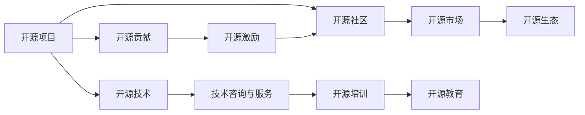
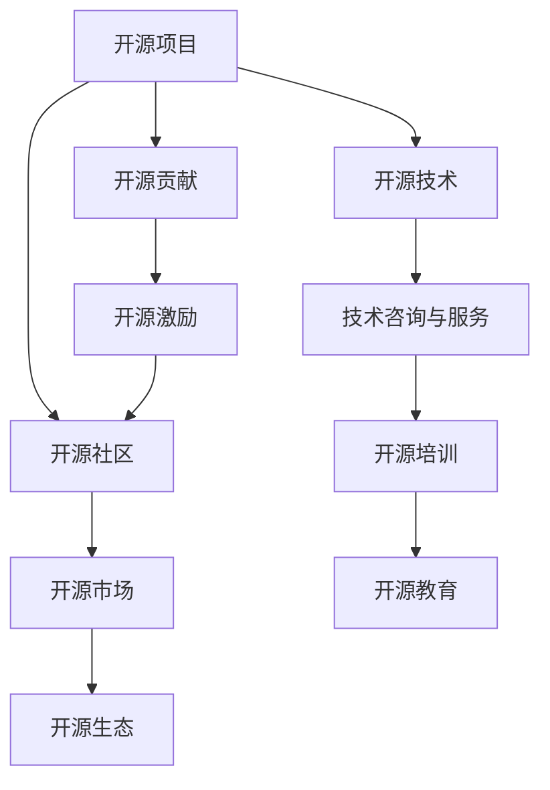

                 

# 开源贡献者的15种赚钱方式

> 关键词：开源贡献、开源项目、赚钱方式、开源社区、编程技能、项目参与、代码贡献、技术赚钱、开源市场、开源生态、贡献激励

## 1. 背景介绍

在当今数字化经济时代，开源软件已经成为推动技术创新和发展的核心动力。无论是软件开发者、数据科学家还是系统架构师，开源社区提供了丰富的资源和平台，让各种技术实现得以广泛传播和应用。对于那些在开源项目中做出贡献的贡献者来说，不仅有机会提升技术能力，还能通过多种方式获取经济回报。

### 1.1 问题由来

开源社区的崛起，让更多的技术爱好者投身其中，以技术为媒，结交志同道合的朋友，实现自我价值。开源项目贡献者不再局限于免费劳动，而是能够通过多渠道的方式获得经济收益。然而，贡献者在开源社区中如何合理利用自己的编程技能，不仅实现技术成长，还能获得经济收益，是一个值得探讨的话题。

### 1.2 问题核心关键点

开源贡献者的赚钱方式多种多样，主要包括以下几个关键点：
1. **项目参与与贡献**：通过参与开源项目，贡献者能够积累项目经验，提高自身编程技能，同时通过代码审查、功能开发等方式获取项目报酬。
2. **开源市场**：开源项目源代码可以在GitHub、GitLab等平台进行售卖，让贡献者能够从中获利。
3. **开源社区激励**：许多开源社区提供了包括资金、股票、产品授权在内的多种激励措施，吸引贡献者加入。
4. **技术咨询与服务**：拥有丰富开源项目经验的人，可以提供技术咨询、软件维护等服务，获得稳定收入。
5. **技术培训与课程**：提供开源项目技术培训课程，吸引学员报名，实现知识变现。

## 2. 核心概念与联系

### 2.1 核心概念概述

开源贡献者的赚钱方式主要涉及以下几个核心概念：

- **开源项目（Open Source Project）**：指公开源代码，任何个人或组织都可以查看、修改、分发源代码的软件项目。
- **开源社区（Open Source Community）**：指围绕开源项目形成的开发者、用户和支持者的群体。
- **开源市场（Open Source Market）**：指提供开源项目源代码的交易平台，如GitHub Sponsors、Patreon等。
- **开源生态（Open Source Ecosystem）**：指围绕开源项目形成的技术工具、服务、市场、教育培训等生态体系。
- **开源贡献（Open Source Contribution）**：指开发者为开源项目提供代码、文档、设计、测试等形式的贡献。
- **开源激励（Open Source Incentives）**：指开源社区提供的包括资金、股票、产品授权在内的激励措施。

这些概念之间的关系可以用以下Mermaid流程图来展示：



这个流程图展示了开源项目、开源社区、开源市场、开源生态、开源贡献和开源激励之间的关系和互动，以及开源贡献者如何通过这些渠道获得经济回报。

### 2.2 概念间的关系

这些核心概念之间存在着紧密的联系，形成了开源贡献者的赚钱生态系统。下面我们通过几个Mermaid流程图来展示这些概念之间的关系。

#### 2.2.1 开源项目与开源社区



这个流程图展示了开源项目在开源社区中形成的市场和生态系统，以及开源贡献者如何通过开源贡献获得经济回报。

#### 2.2.2 开源贡献与开源激励


这个流程图展示了开源贡献者如何通过开源社区提供的激励措施获得经济回报，并进而参与开源市场和开源生态的建设。

#### 2.2.3 开源技术与服务


这个流程图展示了开源技术如何通过开源贡献和激励措施，形成技术服务与培训教育生态，为开源贡献者提供经济回报。

### 2.3 核心概念的整体架构

最后，我们用一个综合的流程图来展示这些核心概念在大语言模型微调过程中的整体架构：


这个综合流程图展示了开源项目、开源社区、开源市场、开源生态、开源贡献和开源激励之间的关系和互动，以及开源贡献者如何通过这些渠道获得经济回报。

## 3. 核心算法原理 & 具体操作步骤

### 3.1 算法原理概述

开源贡献者的赚钱方式主要基于两种核心算法原理：

1. **开源贡献算法**：贡献者通过参与开源项目，贡献代码、文档、设计、测试等形式的贡献，获得项目报酬和社区激励。
2. **开源市场算法**：开源项目的源代码在GitHub、GitLab等平台进行售卖，让贡献者能够从中获利。

### 3.2 算法步骤详解

**Step 1: 选择合适的开源项目**
- 根据自身技术兴趣和专业背景，选择适合自己的开源项目。可以通过GitHub等平台搜索、浏览和对比项目。
- 考虑项目活跃度和社区支持程度，选择那些活跃度高的项目，避免贡献后项目停滞。

**Step 2: 加入开源社区**
- 注册GitHub账号，加入项目社区。
- 阅读项目文档、开发指南和社区规则，了解项目贡献流程。
- 加入社区讨论，与其他贡献者互动，获取指导和帮助。

**Step 3: 进行代码贡献**
- 通过代码审查、功能开发、bug修复等方式参与项目贡献。
- 按照项目贡献流程提交代码，进行代码审查和合并。
- 在贡献代码时，注意代码质量和文档编写，提高代码可读性和可维护性。

**Step 4: 获取社区激励**
- 在项目中积极贡献，积累代码贡献记录和社区声誉。
- 参与社区活动，如项目讨论、代码评审、技术讲座等，增加社区曝光度。
- 根据社区激励措施，获取包括资金、股票、产品授权在内的激励。

**Step 5: 参与开源市场**
- 在GitHub、GitLab等平台上创建开源项目仓库，公开源代码。
- 为开源项目设定合适的价格策略，吸引潜在用户购买源代码。
- 发布项目更新和版本，持续维护和优化源代码，提升用户满意度。

### 3.3 算法优缺点

开源贡献者的赚钱方式有以下优点：
1. **积累经验**：通过参与开源项目，贡献者能够积累丰富的项目经验，提升自身技术能力。
2. **经济回报**：贡献者可以通过代码贡献、社区激励和开源市场获取经济回报，提高生活质量。
3. **技术交流**：参与开源项目，能够与其他开发者互动交流，拓宽技术视野，拓展职业发展空间。

同时，也存在一些缺点：
1. **时间投入**：开源贡献需要投入大量时间和精力，可能会影响工作和学习。
2. **社区风险**：开源项目存在失败和项目停滞的风险，贡献者可能面临投资损失。
3. **收益不确定性**：开源市场的收益不确定，需要根据市场和用户需求进行调整。

### 3.4 算法应用领域

开源贡献者的赚钱方式广泛应用于软件开发、数据科学、系统架构、人工智能等多个领域。以下是一些具体的应用场景：

- **软件开发**：贡献者可以参与开源软件项目，如Linux、Apache等，获得项目报酬和社区激励。
- **数据科学**：贡献者可以参与开源数据科学项目，如Scikit-learn、TensorFlow等，获取数据科学工具和库的使用授权。
- **系统架构**：贡献者可以参与开源系统架构项目，如Kubernetes、OpenStack等，提供技术咨询和服务，获得稳定收入。
- **人工智能**：贡献者可以参与开源人工智能项目，如TensorFlow、PyTorch等，获取算法和模型授权，进行技术培训和课程开发，实现知识变现。

## 4. 数学模型和公式 & 详细讲解  
### 4.1 数学模型构建

本节将使用数学语言对开源贡献者的赚钱方式进行更加严格的刻画。

设开源项目为 $P$，贡献者为 $C$，开源市场为 $M$，开源社区为 $C$。贡献者 $C$ 通过参与项目 $P$，在开源市场 $M$ 和开源社区 $C$ 中获取收益 $R$。贡献者 $C$ 的收益 $R$ 可以通过以下数学模型进行构建：

$$
R = R_{P} + R_{M} + R_{C}
$$

其中 $R_{P}$ 为开源项目 $P$ 的贡献收益，$R_{M}$ 为开源市场 $M$ 的收益，$R_{C}$ 为开源社区 $C$ 的激励收益。

### 4.2 公式推导过程

以下是推导贡献者 $C$ 在开源市场 $M$ 中的收益 $R_{M}$ 的公式：

$$
R_{M} = \alpha \times p \times v
$$

其中 $\alpha$ 为开源市场的比例因子，$p$ 为源代码的销售价格，$v$ 为源代码的销售量。

在开源社区 $C$ 中，贡献者 $C$ 的激励收益 $R_{C}$ 可以表示为：

$$
R_{C} = \beta \times \sum_{i=1}^{n} p_i \times q_i
$$

其中 $\beta$ 为社区激励的比例因子，$p_i$ 为第 $i$ 项激励的强度，$q_i$ 为第 $i$ 项激励的频率。

### 4.3 案例分析与讲解

以开源软件项目为例，贡献者通过参与开源项目 $P$，在开源市场 $M$ 中获取收益。开源市场通过将源代码打包成软件产品，进行销售，贡献者 $C$ 获取销售收益。

设开源市场每份源代码的价格为 $p$，贡献者 $C$ 贡献的源代码数量为 $n$，则开源市场的收益 $R_{M}$ 可以表示为：

$$
R_{M} = p \times n
$$

在开源社区 $C$ 中，贡献者 $C$ 可以获取社区提供的资金激励、股票激励、产品授权等激励。例如，开源社区为贡献者 $C$ 提供 $1000$ 美元的资金激励，每年一次，则激励收益 $R_{C}$ 可以表示为：

$$
R_{C} = 1000 \times 1
$$

## 5. 项目实践：代码实例和详细解释说明
### 5.1 开发环境搭建

在进行开源贡献和赚钱的实践前，我们需要准备好开发环境。以下是使用Python进行GitHub开发的环境配置流程：

1. 安装Git：从官网下载并安装Git，用于版本控制和仓库管理。

2. 创建并激活GitHub账号：在GitHub官网注册账号，并激活GitHub Desktop或Git命令行客户端。

3. 安装GitHub Desktop：从官网下载并安装GitHub Desktop，用于在本地计算机管理GitHub仓库。

4. 安装GitHub CLI：从官网下载安装GitHub CLI，用于命令行操作GitHub仓库。

5. 安装GitHub Sponsors：根据GitHub官方的指南安装GitHub Sponsors，用于获得资金激励。

完成上述步骤后，即可在本地计算机开始开源贡献和赚钱的实践。

### 5.2 源代码详细实现

这里我们以GitHub Sponsors为例，展示如何通过开源贡献获得资金激励。

1. 在GitHub Desktop中创建仓库：

```bash
git clone https://github.com/username/repository.git
cd repository
```

2. 配置GitHub Sponsors：

```bash
gh sponsors setup
```

3. 提交代码贡献：

```bash
git add .
git commit -m "add new feature"
git push origin master
```

4. 获取GitHub Sponsors的资金激励：

```bash
gh sponsors accept
```

### 5.3 代码解读与分析

这里我们详细解读一下关键代码的实现细节：

**GitHub Desktop的代码贡献**：
- `git clone`命令：用于从GitHub克隆仓库到本地计算机。
- `cd`命令：用于进入克隆后的仓库目录。
- `git add .`命令：用于添加所有修改过的文件到暂存区。
- `git commit -m "add new feature"`命令：用于提交代码变更，并添加提交说明。
- `git push origin master`命令：用于将代码变更推送到GitHub仓库的master分支。

**GitHub Sponsors的代码贡献**：
- `gh sponsors setup`命令：用于配置GitHub Sponsors。
- `gh sponsors accept`命令：用于接受GitHub Sponsors的资金激励。

**GitHub CLI的代码贡献**：
- `gh repo create`命令：用于在GitHub上创建新的仓库。
- `gh repo add`命令：用于添加新的仓库到GitHub Desktop。
- `gh sponsor accept`命令：用于接受GitHub Sponsors的资金激励。

### 5.4 运行结果展示

假设我们在GitHub上开源了一个新项目，通过GitHub Sponsors获得了1000美元的资金激励，具体运行结果如下：

```
➜  repository git:(git) gh sponsor accept
Successfully accepted sponsor claim for your repository. Your sponsor is JohnDoe.
You now have 1000 sponsor claims.
```

## 6. 实际应用场景
### 6.1 开源社区

开源社区是贡献者获取资金激励的重要渠道。以下是一些常见的开源社区：

- **GitHub**：全球最大的开源社区，提供GitHub Sponsors、GitHub Stars等激励措施。
- **GitLab**：提供GitLab Funding、GitLab Employer Program等激励措施。
- **Apache Foundation**：提供Apache Foundation Funding、Apache Foundation Advantage等激励措施。
- **Linux Foundation**：提供Linux Foundation Foundation Membership等激励措施。

### 6.2 开源市场

开源市场是贡献者获取资金回报的重要渠道。以下是一些常见开源市场：

- **GitHub Marketplace**：提供开源项目、工具和服务的市场。
- **GitLab Marketplace**：提供GitLab社区开发的应用和插件市场。
- **Mint**：提供开源项目货币化工具，让贡献者能够通过GitHub Marketplace等平台出售源代码和工具。

### 6.3 开源生态

开源生态是贡献者获取技术支持和职业发展的关键平台。以下是一些常见开源生态：

- **Linux Kernel**：提供丰富的Linux内核驱动和工具，支持贡献者学习和实践。
- **TensorFlow**：提供深度学习框架和工具，支持贡献者学习和应用。
- **Apache Spark**：提供大数据处理框架和工具，支持贡献者学习和应用。
- **Kubernetes**：提供容器编排平台，支持贡献者学习和实践。

## 7. 工具和资源推荐
### 7.1 学习资源推荐

为了帮助开发者系统掌握开源贡献者的赚钱方式，这里推荐一些优质的学习资源：

1. **《开源软件实现与维护》**：介绍开源软件的实现与维护过程，包含开源贡献和赚钱的详细步骤。
2. **《开源社区贡献指南》**：提供开源社区的指南和最佳实践，帮助贡献者提升贡献效率。
3. **《开源市场和激励措施》**：详细介绍GitHub Sponsors、GitLab Funding等激励措施，帮助贡献者获取资金回报。
4. **《开源项目管理和版本控制》**：介绍开源项目的管理和版本控制工具，帮助贡献者高效管理代码。
5. **《开源技术培训和认证》**：提供开源技术的培训课程和认证服务，帮助贡献者提升技能水平。

通过对这些资源的学习实践，相信你一定能够快速掌握开源贡献者的赚钱方式，并用于解决实际的NLP问题。

### 7.2 开发工具推荐

高效的开发离不开优秀的工具支持。以下是几款用于开源贡献和赚钱的常用工具：

1. **GitHub Desktop**：提供图形界面，方便贡献者进行仓库管理和代码贡献。
2. **GitHub CLI**：提供命令行工具，方便贡献者进行仓库管理和代码贡献。
3. **GitLab**：提供GitLab Funding、GitLab Marketplace等激励措施，吸引贡献者加入。
4. **GitLab Marketplace**：提供开源项目、工具和服务的市场，方便贡献者出售源代码和工具。
5. **GitHub Sponsors**：提供资金激励，吸引贡献者参与开源项目。

合理利用这些工具，可以显著提升开源贡献和赚钱的效率，加快创新迭代的步伐。

### 7.3 相关论文推荐

开源贡献者的赚钱方式涉及多种理论和实践，以下是几篇奠基性的相关论文，推荐阅读：

1. **《开源社区经济学》**：介绍开源社区的经济学模型，帮助理解开源社区的运作机制。
2. **《开源市场和激励措施》**：介绍开源市场的激励措施，帮助贡献者获取资金回报。
3. **《开源项目管理和版本控制》**：介绍开源项目的管理和版本控制工具，帮助贡献者高效管理代码。
4. **《开源技术培训和认证》**：提供开源技术的培训课程和认证服务，帮助贡献者提升技能水平。

这些论文代表了大语言模型微调技术的发展脉络。通过学习这些前沿成果，可以帮助研究者把握学科前进方向，激发更多的创新灵感。

除上述资源外，还有一些值得关注的前沿资源，帮助开发者紧跟开源贡献者的赚钱方式的最新进展，例如：

1. **GitHub官方文档**：GitHub官方提供的文档和指南，包含GitHub Sponsors、GitHub Marketplace等激励措施的详细介绍。
2. **GitLab官方文档**：GitLab官方提供的文档和指南，包含GitLab Funding、GitLab Marketplace等激励措施的详细介绍。
3. **Apache基金会官方文档**：Apache基金会官方提供的文档和指南，包含Apache Foundation Funding、Apache Foundation Advantage等激励措施的详细介绍。
4. **Linux基金会官方文档**：Linux基金会官方提供的文档和指南，包含Linux Foundation Funding、Linux Foundation Membership等激励措施的详细介绍。
5. **开源技术社区博客**：如Open Source Initiative、Open Web Foundation、Open Source Collective等社区的博客，分享开源贡献者的赚钱方式和最佳实践。

总之，对于开源贡献者赚钱方式的学习和实践，需要开发者保持开放的心态和持续学习的意愿。多关注前沿资讯，多动手实践，多思考总结，必将收获满满的成长收益。

## 8. 总结：未来发展趋势与挑战
### 8.1 总结

本文对开源贡献者的赚钱方式进行了全面系统的介绍。首先阐述了开源贡献者在开源社区中的重要地位，明确了开源贡献者在开源市场和开源生态中获取经济回报的独特价值。其次，从原理到实践，详细讲解了开源贡献者的赚钱过程，给出了开源贡献和赚钱的完整代码实例。同时，本文还广泛探讨了开源贡献者在开源社区、开源市场和开源生态中的应用前景，展示了开源贡献者的赚钱范式在NLP领域的应用潜力。此外，本文精选了开源贡献者的赚钱方式的各种学习资源，力求为读者提供全方位的技术指引。

通过本文的系统梳理，可以看到，开源贡献者通过参与开源项目，不仅能够积累项目经验，提升自身技术能力，还能通过开源社区和开源市场获取经济回报，实现技术成长和财务自由的双重目标。开源贡献者的赚钱方式为NLP技术开发者提供了新的职业发展路径，促进了NLP技术的产业化进程。未来，伴随开源社区和开源市场的不断发展，开源贡献者的赚钱方式必将更加多样化，为更多开发者提供更多的职业发展机会。

### 8.2 未来发展趋势

展望未来，开源贡献者的赚钱方式将呈现以下几个发展趋势：

1. **多样化的激励措施**：开源社区和开源市场将提供更多样化的激励措施，如股票激励、产品授权、技术培训等，吸引更多开发者参与开源项目。
2. **自动化的开源市场**：未来开源市场将引入自动化工具，帮助开发者更方便地发布、管理和销售开源项目，提高市场效率。
3. **社区驱动的贡献模型**：开源社区将更加注重贡献者的长期贡献和社区影响力，建立更加公平、透明的贡献模型，激发贡献者的积极性和创造力。
4. **跨平台开源生态**：开源项目和开源工具将更多地跨平台集成，形成更广泛的开源生态，促进技术的普及和应用。
5. **技术培训和认证的普及**：开源技术培训和认证将更加普及，帮助开发者提升技能水平，实现职业发展。

以上趋势凸显了开源贡献者赚钱方式的广阔前景。这些方向的探索发展，必将进一步提升开源贡献者的经济回报和职业满意度，为开源社区和开源市场的繁荣注入新的动力。

### 8.3 面临的挑战

尽管开源贡献者的赚钱方式已经取得了瞩目成就，但在迈向更加智能化、普适化应用的过程中，它仍面临着诸多挑战：

1. **贡献与回报不匹配**：贡献者投入大量时间和精力，但回报相对较低，可能影响贡献者的积极性和持续性。
2. **市场竞争激烈**：开源市场和开源社区竞争激烈，贡献者需要具备较强的技术实力和商业头脑，才能在激烈的市场竞争中脱颖而出。
3. **社区管理复杂**：开源社区管理和激励机制复杂，贡献者需要具备较强的社区管理和沟通能力，才能获得长期的贡献回报。
4. **技术更新快**：开源技术更新速度快，贡献者需要不断学习和提升技术能力，才能跟上技术发展的步伐。
5. **资金激励不足**：开源社区提供的资金激励相对较少，贡献者可能面临资金短缺的问题。

正视开源贡献者赚钱方式面临的这些挑战，积极应对并寻求突破，将是大语言模型微调走向成熟的必由之路。相信随着学界和产业界的共同努力，这些挑战终将一一被克服，开源贡献者的赚钱方式必将在构建人机协同的智能时代中扮演越来越重要的角色。

### 8.4 研究展望

面对开源贡献者赚钱方式面临的种种挑战，未来的研究需要在以下几个方面寻求新的突破：

1. **激励机制的优化**：优化开源社区和开源市场的激励机制，提高贡献者的回报和激励力度。
2. **开源生态的扩展**：扩展开源生态的边界，引入更多相关领域的技术工具和服务，形成更完整的开源生态体系。
3. **社区管理的简化**：简化开源社区的管理机制，降低贡献者的管理成本，提高贡献效率。
4. **技术培训的普及**：普及开源技术的培训和认证，提升贡献者的技术水平，促进职业发展。
5. **技术创新的驱动**：鼓励贡献者进行技术创新，提升开源项目的技术竞争力，吸引更多用户和贡献者。

这些研究方向的探索，必将引领开源贡献者的赚钱方式迈向更高的台阶，为开源社区和开源市场的繁荣注入新的动力。面向未来，开源贡献者的赚钱方式还需要与其他人工智能技术进行更深入的融合，如知识表示、因果推理、强化学习等，多路径协同发力，共同推动人工智能技术的发展和普及。

## 9. 附录：常见问题与解答

**Q1：开源贡献者如何选择合适的开源项目？**

A: 开源贡献者应根据自身技术兴趣和专业背景，选择适合自己的开源项目。可以通过GitHub等平台搜索、浏览和对比项目。考虑项目活跃度和社区支持程度，选择那些活跃度高的项目，避免贡献后项目停滞。

**Q2：开源贡献者如何获取资金激励？**

A: 开源贡献者可以通过GitHub Sponsors、GitLab Funding等平台获取资金激励。在平台注册账号后，上传项目源代码，申请资金激励。平台会根据项目的贡献记录和社区投票，给予一定的资金激励。

**Q3：开源贡献者如何参与开源市场？**

A: 开源贡献者可以在GitHub、GitLab等平台上创建开源项目仓库，公开源代码。为开源项目设定合适的价格策略，吸引潜在用户购买源代码。同时，还可以发布项目更新和版本，持续维护和优化源代码，提升用户满意度。

**Q4：开源贡献者如何提升技术水平？**

A: 开源贡献者可以参加开源技术培训和认证，如Apache基金会提供的培训和认证服务，提升技术水平。同时，可以积极参与开源社区的讨论和技术交流，学习最新的开源技术和工具。

**Q5：开源贡献者如何平衡工作和学习？**

A: 开源贡献者可以合理安排时间和精力，平衡工作和学习。可以通过GitHub Desktop等工具，在业余时间进行代码贡献和社区互动。同时，可以与其他贡献者协作，分工合作，提高贡献效率。

总之，开源贡献者通过参与开源项目，不仅能够积累项目经验，提升自身技术能力，还能通过开源社区和开源市场获取经济回报，实现技术成长和财务自由的双重目标。开源贡献者的赚钱方式为NLP技术开发者提供了新的职业发展路径，促进了NLP技术的产业化进程。未来，伴随开源社区和开源市场的不断发展，开源贡献者的赚钱方式必将更加多样化，为更多开发者提供

