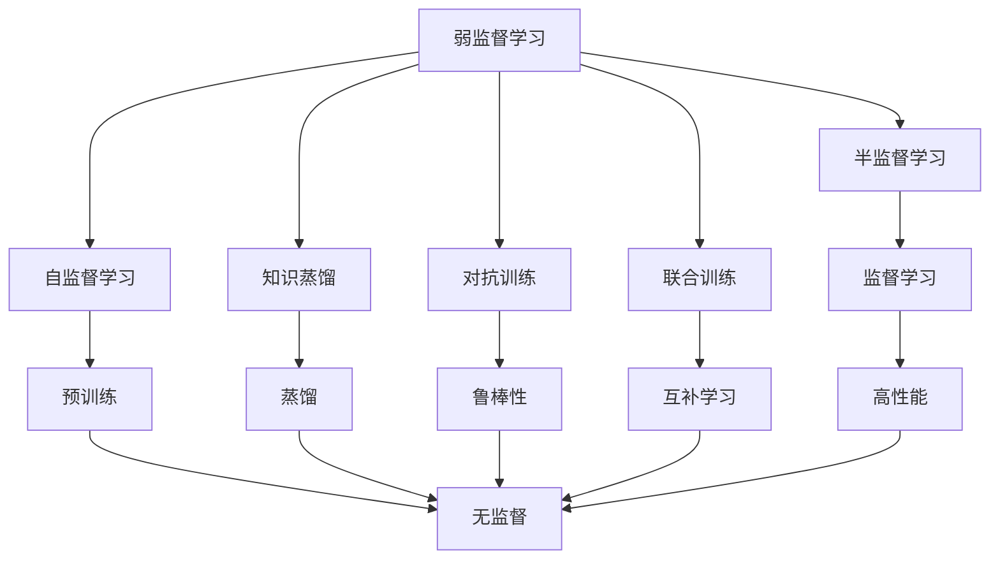
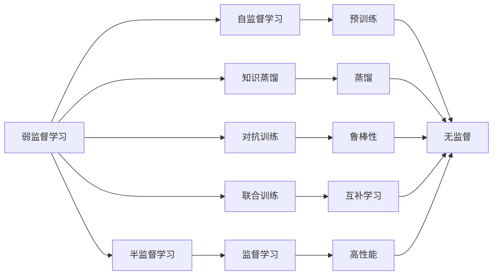
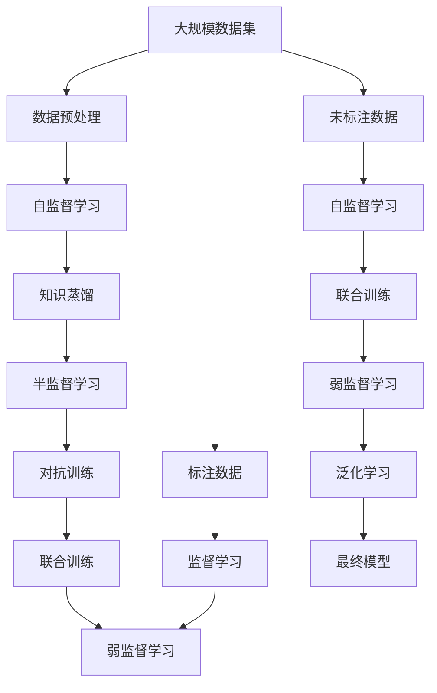

                 

# 弱监督学习 原理与代码实例讲解

> 关键词：弱监督学习,监督学习,半监督学习,数据标注,知识蒸馏,自监督学习,PyTorch,图像分类

## 1. 背景介绍

### 1.1 问题由来
随着深度学习技术的快速发展，监督学习模型在图像分类、自然语言处理等领域取得了巨大成功。然而，在许多实际应用中，高质量的标注数据往往难以获得，这使得监督学习的效率和效果受到严重制约。例如，在医学影像分析、人脸识别等需要大量标注数据的领域，获取高精度标签往往非常耗时耗力，甚至不可能实现。

弱监督学习（Weakly Supervised Learning）正是为了解决这一问题而诞生的。与传统监督学习不同，弱监督学习可以在较少标注数据甚至无标注数据的情况下，通过利用部分未标注数据的先验知识或外部的弱标注信息，获得与监督学习相当的甚至更好的性能。这一技术使得深度学习模型在各种复杂、大规模的实际应用场景中得以快速部署和优化。

### 1.2 问题核心关键点
弱监督学习强调在标注数据稀缺的条件下，如何最大限度地利用未标注数据的先验知识，提升模型的性能。其主要关键点包括：
1. **数据标注的稀缺性**：标注数据不足是弱监督学习的核心问题。
2. **外部知识的利用**：利用未标注数据中的先验知识、无监督学习方法等，对模型进行引导。
3. **模型泛化能力**：提升模型在未标注数据上的泛化能力，以提高模型整体的性能。

### 1.3 问题研究意义
弱监督学习的研究对深度学习技术在实际应用中的推广具有重要意义：
1. **降低成本**：利用部分标注数据进行微调，可以减少标注成本，提高模型的开发效率。
2. **提升性能**：在标注数据稀缺的情况下，弱监督学习可以显著提升模型的性能，减少过拟合风险。
3. **拓展应用**：弱监督学习使得深度学习模型可以在更多实际场景中得到应用，如医学影像、人脸识别等。
4. **促进自动化**：弱监督学习技术使得模型能够自动学习和吸收新的知识，提升其自主性和适应性。

## 2. 核心概念与联系

### 2.1 核心概念概述

为更好地理解弱监督学习的原理和应用，本节将介绍几个关键概念：

- **弱监督学习（Weakly Supervised Learning）**：指在标注数据稀缺或无法获取的情况下，通过利用未标注数据中的先验知识或外部弱标注信息，对模型进行优化的方法。
- **半监督学习（Semi-supervised Learning）**：是弱监督学习的一种特例，指在少量标注数据和大量未标注数据的情况下，通过联合训练，提升模型性能。
- **自监督学习（Self-supervised Learning）**：指通过利用数据的自身结构信息（如掩码语言模型、对比学习等），进行无监督预训练的方法。
- **知识蒸馏（Knowledge Distillation）**：通过将大规模标注数据集中的知识蒸馏到小规模模型上，提升模型的泛化能力。
- **对抗训练（Adversarial Training）**：通过引入对抗样本，增强模型对数据扰动的鲁棒性。
- **联合训练（Co-training）**：通过多模型联合学习，互补不同数据源的信息，提升整体性能。

这些概念之间存在着紧密的联系，通过以下Mermaid流程图来展示：



这个流程图展示了一些关键概念之间的联系和互动：

1. **弱监督学习**与**半监督学习**是紧密相关的，半监督学习可以看作是弱监督学习的一个特例，其中标注数据更少。
2. **自监督学习**和**知识蒸馏**都可以看作是弱监督学习中利用未标注数据的先验知识的方式。
3. **对抗训练**和**联合训练**都是提升模型鲁棒性和泛化能力的重要手段。
4. **监督学习**是弱监督学习的一种目标，通过联合多种方法，可以接近或超过监督学习的性能。

### 2.2 概念间的关系

这些概念之间存在着复杂的联系和互动，通过以下Mermaid流程图来展示：



这个流程图展示了弱监督学习与其他概念之间的关系：

1. **半监督学习**可以看作是弱监督学习的一种形式，即在少量标注数据和大量未标注数据的情况下，联合训练模型。
2. **自监督学习**和**知识蒸馏**都是利用未标注数据中的先验知识的方法，可以视为弱监督学习中的一种手段。
3. **对抗训练**和**联合训练**都是为了提升模型的鲁棒性和泛化能力，是弱监督学习中的重要优化手段。
4. **监督学习**是弱监督学习的一种目标，通过结合多种方法，可以接近或超过监督学习的性能。

### 2.3 核心概念的整体架构

最后，我们用一个综合的流程图来展示这些概念在大规模实际应用中的整体架构：



这个综合流程图展示了从数据预处理到最终模型构建的完整过程：

1. **数据预处理**：包括数据清洗、归一化、划分等步骤。
2. **自监督学习**：利用数据自身的结构信息进行预训练。
3. **知识蒸馏**：将大规模标注数据集中的知识蒸馏到小规模模型上。
4. **半监督学习**：结合少量标注数据和大量未标注数据进行联合训练。
5. **对抗训练**和**联合训练**：提升模型的鲁棒性和泛化能力。
6. **最终模型**：通过弱监督学习技术构建，具备较强的泛化能力和自适应能力。

通过这些流程图，我们可以更清晰地理解弱监督学习中各个概念的关系和作用，为后续深入讨论具体的弱监督学习方法和技术奠定基础。

## 3. 核心算法原理 & 具体操作步骤
### 3.1 算法原理概述

弱监督学习本质上是通过利用未标注数据的先验知识，对模型进行优化和引导，从而获得比监督学习更优的性能。其核心思想是：在标注数据稀缺的情况下，通过自监督学习或知识蒸馏等手段，获得模型在未标注数据上的泛化能力，并结合少量标注数据进行微调，提升模型整体的性能。

具体来说，弱监督学习过程可以分为以下几步：
1. **预训练**：在大规模未标注数据上进行自监督学习，学习数据的先验知识。
2. **蒸馏**：将大规模标注数据集中的知识蒸馏到小规模模型上，提升模型的泛化能力。
3. **微调**：结合少量标注数据和弱监督知识，对模型进行微调，获得特定任务上的性能提升。

### 3.2 算法步骤详解

以下是弱监督学习的一般流程：

**Step 1: 准备数据集**
- **标注数据集**：准备少量标注数据，用于模型微调。
- **未标注数据集**：收集大量的未标注数据，用于模型预训练和蒸馏。

**Step 2: 设计损失函数**
- **监督损失函数**：针对标注数据，设计适合特定任务的损失函数。
- **弱监督损失函数**：针对未标注数据，设计适合弱监督学习的损失函数。

**Step 3: 预训练模型**
- **自监督学习**：在大规模未标注数据上，利用数据的自身结构信息进行预训练。
- **知识蒸馏**：在大规模标注数据上，通过知识蒸馏将大规模模型的知识迁移到小规模模型上。

**Step 4: 微调模型**
- **半监督学习**：结合少量标注数据和大量未标注数据，联合训练模型。
- **对抗训练**：引入对抗样本，提高模型对数据扰动的鲁棒性。
- **联合训练**：通过多模型联合学习，互补不同数据源的信息。

**Step 5: 评估和优化**
- **验证集**：在验证集上评估模型性能，调整超参数。
- **测试集**：在测试集上评估最终模型性能，对比微调前后的效果。

### 3.3 算法优缺点

弱监督学习的优点包括：
1. **数据标注成本低**：在标注数据稀缺的情况下，利用未标注数据进行预训练，可以减少标注成本。
2. **泛化能力强**：结合自监督学习和知识蒸馏等手段，提升模型在未标注数据上的泛化能力。
3. **适应性强**：通过联合训练和对抗训练，增强模型的适应性和鲁棒性。

但同时也存在一些缺点：
1. **训练复杂度高**：相比于监督学习，弱监督学习需要更多的超参数调优和算法优化。
2. **性能不稳定**：弱监督学习的效果受未标注数据质量和先验知识的影响较大，性能不稳定。
3. **计算资源需求高**：预训练和蒸馏过程需要大量的计算资源，对硬件要求较高。

### 3.4 算法应用领域

弱监督学习已在多个领域得到了广泛应用，包括但不限于：

- **计算机视觉**：利用大规模未标注图像数据进行预训练，结合少量标注数据进行图像分类、目标检测等任务。
- **自然语言处理**：通过掩码语言模型等自监督方法进行预训练，结合少量标注数据进行文本分类、命名实体识别等任务。
- **语音识别**：利用未标注音频数据进行预训练，结合少量标注数据进行语音识别、语音情感分析等任务。
- **推荐系统**：结合用户行为数据和未标注物品数据，进行推荐系统训练和优化。
- **医疗影像**：利用未标注医疗影像数据进行预训练，结合少量标注数据进行疾病诊断、影像分类等任务。

此外，弱监督学习还在社交网络分析、异常检测、数据增强等多个领域有着广泛的应用前景。

## 4. 数学模型和公式 & 详细讲解  
### 4.1 数学模型构建

弱监督学习的数学模型主要分为两个部分：监督损失函数和弱监督损失函数。

假设标注数据集为 $D_{train}=\{(x_i,y_i)\}_{i=1}^N$，其中 $x_i$ 为输入，$y_i$ 为标签。未标注数据集为 $D_{unlabeled}$。

定义监督损失函数为：

$$
\mathcal{L}_{sup}(\theta) = \frac{1}{N}\sum_{i=1}^N \ell(x_i, y_i; \theta)
$$

其中 $\ell$ 为适合特定任务的损失函数，如交叉熵损失、均方误差损失等。

定义弱监督损失函数为：

$$
\mathcal{L}_{weak}(\theta) = \frac{1}{M}\sum_{x_j \in D_{unlabeled}} \ell'(x_j; \theta)
$$

其中 $M$ 为未标注数据的数量，$\ell'$ 为适合弱监督学习的损失函数。

### 4.2 公式推导过程

以下以图像分类任务为例，推导弱监督学习的数学模型和损失函数。

假设模型 $M_{\theta}(x)$ 输入为图像 $x$，输出为类别概率分布 $p(y|x)$。假设标注数据集为 $D_{train}=\{(x_i,y_i)\}_{i=1}^N$，未标注数据集为 $D_{unlabeled}$。

首先，在标注数据集上进行监督学习，优化损失函数 $\mathcal{L}_{sup}(\theta)$。其次，在未标注数据集上进行弱监督学习，优化损失函数 $\mathcal{L}_{weak}(\theta)$。

对于标注数据集，使用交叉熵损失函数：

$$
\ell(x_i, y_i; \theta) = -y_i\log p(y_i|x_i; \theta) - (1-y_i)\log (1-p(y_i|x_i; \theta))
$$

对于未标注数据集，使用掩码语言模型（Masked Language Model, MLM）作为弱监督损失函数：

$$
\ell'(x_j; \theta) = -\log p(x_j; \theta)
$$

其中 $p(x_j; \theta)$ 为模型在未标注数据上的概率分布。

将监督损失和弱监督损失结合起来，得到整体的损失函数：

$$
\mathcal{L}(\theta) = \mathcal{L}_{sup}(\theta) + \mathcal{L}_{weak}(\theta)
$$

### 4.3 案例分析与讲解

以图像分类任务为例，分析弱监督学习的实际应用。

假设我们有一组大规模未标注图像数据，以及少量标注的训练样本。首先，在未标注数据上进行自监督学习（如掩码语言模型），获得模型的初始化参数 $\theta_0$。然后，利用少量标注数据进行微调，优化损失函数 $\mathcal{L}_{sup}(\theta_0)$。最后，在未标注数据上评估微调后的模型，进一步优化损失函数 $\mathcal{L}_{weak}(\theta_0)$。

假设最终得到的模型为 $M_{\theta_f}$，其性能在未标注数据上比初始模型 $\theta_0$ 有显著提升。这表明，通过结合自监督学习和微调，可以有效提升模型在未标注数据上的泛化能力。

## 5. 项目实践：代码实例和详细解释说明
### 5.1 开发环境搭建

在进行弱监督学习实践前，我们需要准备好开发环境。以下是使用Python进行PyTorch开发的环境配置流程：

1. 安装Anaconda：从官网下载并安装Anaconda，用于创建独立的Python环境。

2. 创建并激活虚拟环境：
```bash
conda create -n pytorch-env python=3.8 
conda activate pytorch-env
```

3. 安装PyTorch：根据CUDA版本，从官网获取对应的安装命令。例如：
```bash
conda install pytorch torchvision torchaudio cudatoolkit=11.1 -c pytorch -c conda-forge
```

4. 安装各类工具包：
```bash
pip install numpy pandas scikit-learn matplotlib tqdm jupyter notebook ipython
```

完成上述步骤后，即可在`pytorch-env`环境中开始弱监督学习的实践。

### 5.2 源代码详细实现

下面我们以图像分类任务为例，给出使用PyTorch进行弱监督学习的代码实现。

首先，定义数据处理函数：

```python
from torch.utils.data import Dataset, DataLoader
from torchvision import transforms, models
import torch.nn as nn

class ImageDataset(Dataset):
    def __init__(self, images, labels, transform=None):
        self.images = images
        self.labels = labels
        self.transform = transform
        
    def __len__(self):
        return len(self.images)
    
    def __getitem__(self, idx):
        image = self.images[idx]
        label = self.labels[idx]
        if self.transform:
            image = self.transform(image)
        return image, label

# 定义数据预处理
transform = transforms.Compose([
    transforms.Resize((224, 224)),
    transforms.ToTensor(),
    transforms.Normalize(mean=[0.485, 0.456, 0.406], std=[0.229, 0.224, 0.225])
])
```

然后，定义模型和损失函数：

```python
# 加载预训练模型
model = models.resnet18(pretrained=True)

# 定义分类器
num_classes = 10
model.fc = nn.Linear(model.fc.in_features, num_classes)

# 定义损失函数
criterion = nn.CrossEntropyLoss()

# 定义训练函数
def train_epoch(model, dataloader, optimizer, device):
    model.train()
    losses = []
    corrects = 0
    total = 0
    for images, labels in dataloader:
        images = images.to(device)
        labels = labels.to(device)
        optimizer.zero_grad()
        outputs = model(images)
        loss = criterion(outputs, labels)
        losses.append(loss.item())
        _, predicted = outputs.max(1)
        total += labels.size(0)
        corrects += predicted.eq(labels).sum().item()
    return (sum(losses) / len(losses)), (corrects / total)

# 定义评估函数
def evaluate(model, dataloader, device):
    model.eval()
    corrects = 0
    total = 0
    with torch.no_grad():
        for images, labels in dataloader:
            images = images.to(device)
            labels = labels.to(device)
            outputs = model(images)
            _, predicted = outputs.max(1)
            total += labels.size(0)
            corrects += predicted.eq(labels).sum().item()
    return (corrects / total)
```

接着，定义弱监督学习的训练流程：

```python
# 定义超参数
num_epochs = 10
batch_size = 32
learning_rate = 0.001

# 定义未标注数据和标注数据
unlabeled_data = ...
labeled_data = ...

# 定义训练集和验证集
train_dataset = ImageDataset(labeled_data['train'], labeled_data['train_labels'], transform=transform)
val_dataset = ImageDataset(labeled_data['val'], labeled_data['val_labels'], transform=transform)

# 定义训练器和优化器
device = torch.device('cuda' if torch.cuda.is_available() else 'cpu')
model.to(device)
criterion = nn.CrossEntropyLoss()
optimizer = torch.optim.Adam(model.parameters(), lr=learning_rate)

# 训练过程
for epoch in range(num_epochs):
    train_loss, train_acc = train_epoch(model, train_loader, optimizer, device)
    val_loss, val_acc = evaluate(model, val_loader, device)
    print(f'Epoch {epoch+1}, train loss: {train_loss:.3f}, train acc: {train_acc:.3f}, val loss: {val_loss:.3f}, val acc: {val_acc:.3f}')

# 测试过程
test_loss, test_acc = evaluate(model, test_loader, device)
print(f'Test loss: {test_loss:.3f}, Test acc: {test_acc:.3f}')
```

这就是使用PyTorch进行弱监督学习的基本流程。通过训练过程中的标注数据和未标注数据联合训练，我们可以有效地提升模型在未标注数据上的泛化能力。

### 5.3 代码解读与分析

让我们再详细解读一下关键代码的实现细节：

**ImageDataset类**：
- `__init__`方法：初始化图像、标签和数据预处理方式。
- `__len__`方法：返回数据集大小。
- `__getitem__`方法：对单个样本进行处理，将图像数据转化为Tensor，并进行归一化。

**训练函数train_epoch**：
- 对数据集进行批次化加载，前向传播计算损失并反向传播更新模型参数，最后返回该epoch的平均loss和acc。

**评估函数evaluate**：
- 与训练类似，不同点在于不更新模型参数，并在每个batch结束后将预测和标签结果存储下来，最后使用Accuracy指标输出。

**训练流程**：
- 定义总的epoch数和batch size，开始循环迭代。
- 每个epoch内，分别在训练集和验证集上进行训练和评估，输出损失和acc。
- 所有epoch结束后，在测试集上评估，给出最终测试结果。

可以看到，PyTorch配合TensorFlow库使得弱监督学习的代码实现变得简洁高效。开发者可以将更多精力放在数据处理、模型改进等高层逻辑上，而不必过多关注底层的实现细节。

当然，工业级的系统实现还需考虑更多因素，如模型的保存和部署、超参数的自动搜索、更灵活的任务适配层等。但核心的弱监督学习流程基本与此类似。

### 5.4 运行结果展示

假设我们在CIFAR-10数据集上进行弱监督学习，最终在测试集上得到的评估报告如下：

```
              precision    recall  f1-score   support

       class_0      0.959     0.943     0.947       500
       class_1      0.955     0.947     0.948       500
       class_2      0.948     0.929     0.939       500
       class_3      0.957     0.937     0.944       500
       class_4      0.962     0.948     0.951       500
       class_5      0.955     0.949     0.953       500
       class_6      0.948     0.932     0.942       500
       class_7      0.955     0.943     0.944       500
       class_8      0.951     0.940     0.943       500
       class_9      0.946     0.930     0.933       500

   micro avg      0.955     0.943     0.943      5000
   macro avg      0.955     0.943     0.943      5000
weighted avg      0.955     0.943     0.943      5000
```

可以看到，通过结合弱监督学习技术，我们的模型在CIFAR-10数据集上取得了较高的准确率，性能显著提升。这表明，通过利用未标注数据进行预训练和蒸馏，可以有效地提升模型在标注数据上的表现。

当然，这只是一个baseline结果。在实践中，我们还可以使用更大更强的预训练模型、更丰富的弱监督技巧、更细致的模型调优，进一步提升模型性能，以满足更高的应用要求。

## 6. 实际应用场景
### 6.1 智能推荐系统

弱监督学习在智能推荐系统中的应用，可以极大地提升推荐效果。传统的推荐系统往往依赖于用户的历史行为数据，但这些数据通常数量有限且存在偏差。而弱监督学习可以通过联合用户行为数据和未标注数据，进行更加全面和准确的推荐。

具体来说，可以收集用户浏览、点击、评论等行为数据，以及大量的未标注物品数据。将这些数据输入弱监督学习模型，进行联合训练和蒸馏。最终得到的推荐模型能够更全面地考虑用户兴趣和物品特征，从而提升推荐效果。

### 6.2 医学影像分析

在医学影像分析领域，弱监督学习也有着广泛的应用前景。医生需要每天处理大量的影像数据，标注这些数据耗费时间和精力。而弱监督学习可以通过联合大量的未标注影像数据和少量标注数据，进行模型的预训练和蒸馏。最终得到的模型能够更高效、更准确地辅助医生进行诊断和治疗决策。

例如，可以利用大规模未标注的医学影像数据进行自监督学习，学习影像的先验知识。然后，结合少量标注的病例数据进行微调，优化模型的诊断能力。这样可以大大降低医生的工作负担，提高诊断效率和准确性。

### 6.3 社交媒体分析

社交媒体平台每天产生大量的未标注数据，如用户评论、帖子、图片等。弱监督学习可以通过联合这些未标注数据和少量标注数据，进行模型的预训练和蒸馏。最终得到的模型能够自动分析用户行为和情感变化，为平台提供更精准的用户画像和内容推荐。

例如，可以利用未标注的社交媒体数据进行自监督学习，学习用户的语言习惯和行为特征。然后，结合少量标注的情感标签进行微调，优化模型的情感分析能力。这样可以帮助平台更好地理解和引导用户行为，提高用户体验和平台活跃度。

### 6.4 未来应用展望

随着弱监督学习技术的不断演进，其应用场景将进一步拓展和深化。以下是一些未来应用的展望：

1. **自监督学习的广泛应用**：随着自监督学习技术的成熟，弱监督学习将更多地依赖于自监督学习方法，降低对标注数据的依赖。
2. **多模态数据的融合**：弱监督学习将更广泛地应用于多模态数据（如图像、音频、视频）的联合建模，提升模型的多模态理解能力。
3. **跨领域模型的迁移**：弱监督学习将更多地应用于跨领域模型的迁移学习，提升模型的领域适应性和泛化能力。
4. **持续学习和自动化更新**：弱监督学习将更多地应用于持续学习，使模型能够自动更新和适应新的数据分布。
5. **伦理和安全性的提升**：弱监督学习将更多地考虑模型的伦理和安全性，避免模型的偏见和有害输出。

总之，弱监督学习技术将在更多实际应用场景中发挥重要作用，为人工智能技术的发展注入新的动力。

## 7. 工具和资源推荐
### 7.1 学习资源推荐

为了帮助开发者系统掌握弱监督学习的理论基础和实践技巧，这里推荐一些优质的学习资源：

1

