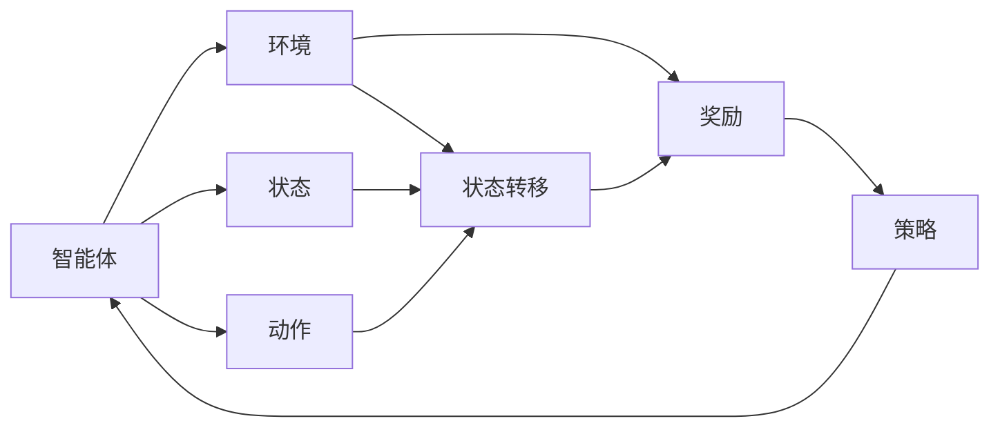
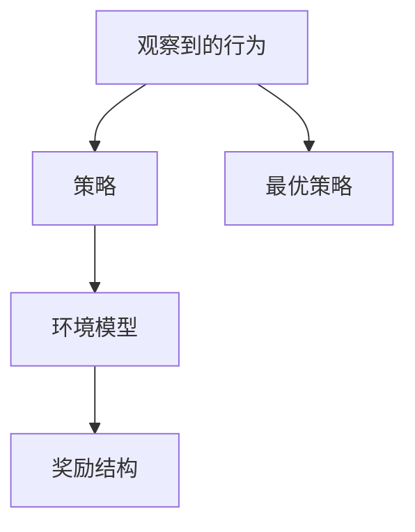
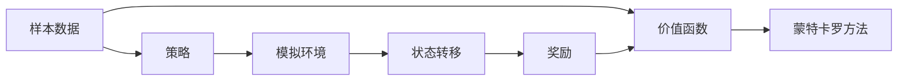

                 

# 强化学习Reinforcement Learning与逆强化学习：理论与实践

> 关键词：强化学习,逆强化学习,马尔可夫决策过程,策略优化,价值函数,蒙特卡罗方法,梯度下降法

## 1. 背景介绍

### 1.1 问题由来
强化学习(Reinforcement Learning, RL)是机器学习领域中一种重要的学习方式。它强调在不断与环境交互的过程中，智能体通过试错和奖励信号学习最优策略。与传统的监督学习和无监督学习不同，强化学习通过学习与环境的动态交互，可以在没有标注数据的情况下，通过智能体的自主探索和试错，发现最优策略。

逆强化学习(Inverse Reinforcement Learning, IRL)则是对强化学习的一种拓展，旨在从观察到的行为序列中学习环境模型和最优策略。它试图理解智能体是如何做出决策的，从而反向推导出环境的目标和奖励结构。逆强化学习在行为生成、游戏策略优化等领域具有重要应用价值。

### 1.2 问题核心关键点
强化学习和逆强化学习的主流研究范式包括：
- 马尔可夫决策过程(Markov Decision Process, MDP)：描述智能体和环境之间的交互，包括状态、动作、奖励和转移概率等。
- 策略优化：通过策略梯度或价值函数方法，优化智能体的决策策略，使其在给定状态下最大化长期累积奖励。
- 蒙特卡罗方法：通过模拟环境，收集样本数据，评估价值函数或策略。
- 梯度下降法：通过计算策略或价值函数的梯度，更新模型参数，最小化误差损失。

这些核心概念构成了强化学习和逆强化学习的研究基础，为后续的具体方法奠定了理论基础。

### 1.3 问题研究意义
强化学习和逆强化学习的研究，对于构建自主决策系统、优化复杂系统控制、理解人类行为等方面具有重要意义：

1. 自动驾驶：通过强化学习，自动驾驶车辆可以自主学习最优行驶策略，提升安全性和效率。
2. 机器人控制：机器人可以通过逆强化学习，理解人类操作习惯，实现自然交互。
3. 医疗决策：强化学习可以辅助医生制定个性化治疗方案，逆强化学习可以揭示疾病发展的潜在机制。
4. 金融市场：通过逆强化学习，可以分析交易策略，优化投资组合。
5. 游戏AI：强化学习可以在游戏AI中实现超人类的决策能力，提升游戏体验。

这些应用场景展示了强化学习和逆强化学习的强大潜力和广泛应用前景。通过深入研究和应用，强化学习和逆强化学习将推动人工智能技术的进步，提升人类的生活质量。

## 2. 核心概念与联系

### 2.1 核心概念概述

为了更好地理解强化学习和逆强化学习的核心概念，本节将介绍几个密切相关的核心概念：

- 马尔可夫决策过程(MDP)：描述智能体和环境之间的交互，包括状态、动作、奖励和转移概率等。MDP是最基本的强化学习模型，任何强化学习算法都建立在MDP之上。
- 策略和策略梯度：策略表示智能体在给定状态下的动作选择，策略梯度则表示策略的优化方法。通过策略梯度方法，可以最小化误差损失，优化策略。
- 价值函数：包括状态价值函数和动作价值函数，表示在给定状态下采取特定动作的预期回报。
- 蒙特卡罗方法：通过模拟环境，收集样本数据，评估价值函数或策略。蒙特卡罗方法是最常用的强化学习方法之一。
- 梯度下降法：通过计算策略或价值函数的梯度，更新模型参数，最小化误差损失。梯度下降法是优化算法的基本形式之一。
- 逆强化学习(IRL)：从观察到的行为序列中学习环境模型和最优策略。逆强化学习可以帮助我们理解智能体是如何做出决策的。

这些核心概念之间的逻辑关系可以通过以下Mermaid流程图来展示：

```mermaid
graph TB
    A[马尔可夫决策过程(MDP)] --> B[策略和策略梯度]
    A --> C[价值函数]
    B --> D[蒙特卡罗方法]
    B --> E[梯度下降法]
    C --> E
    D --> E
    E --> F[逆强化学习(IRL)]
```

这个流程图展示了大语言模型的核心概念及其之间的关系：

1. 马尔可夫决策过程描述智能体和环境之间的交互。
2. 策略和策略梯度方法用于优化智能体的决策策略。
3. 价值函数表示在给定状态下采取特定动作的预期回报。
4. 蒙特卡罗方法通过模拟环境，收集样本数据，评估策略。
5. 梯度下降法通过计算梯度，更新模型参数，最小化误差损失。
6. 逆强化学习从观察到的行为序列中学习环境模型和最优策略。

这些核心概念共同构成了强化学习和逆强化学习的学习框架，使其能够在各种场景下发挥强大的决策能力。通过理解这些核心概念，我们可以更好地把握强化学习和逆强化学习的工作原理和优化方向。

### 2.2 概念间的关系

这些核心概念之间存在着紧密的联系，形成了强化学习和逆强化学习的完整生态系统。下面我们通过几个Mermaid流程图来展示这些概念之间的关系。

#### 2.2.1 强化学习的基本流程



这个流程图展示了强化学习的基本流程：

1. 智能体从环境获取当前状态。
2. 智能体根据当前状态选择动作，发送给环境。
3. 环境根据动作执行状态转移，并返回奖励。
4. 智能体根据奖励和状态转移信息更新策略。
5. 策略指导智能体不断与环境交互，优化决策过程。

#### 2.2.2 逆强化学习的过程



这个流程图展示了逆强化学习的过程：

1. 通过观察到的行为序列，学习智能体的策略。
2. 利用策略推导环境模型。
3. 根据环境模型和行为序列，反向推导奖励结构。
4. 推导最优策略，指导智能体的行为。

#### 2.2.3 蒙特卡罗方法的应用



这个流程图展示了蒙特卡罗方法在强化学习中的应用：

1. 通过样本数据，评估状态价值函数。
2. 利用价值函数评估策略。
3. 模拟环境，收集状态转移和奖励数据。
4. 利用蒙特卡罗方法迭代更新价值函数和策略。

### 2.3 核心概念的整体架构

最后，我们用一个综合的流程图来展示这些核心概念在大语言模型微调过程中的整体架构：

```mermaid
graph TB
    A[马尔可夫决策过程(MDP)] --> B[策略和策略梯度]
    A --> C[价值函数]
    B --> D[蒙特卡罗方法]
    B --> E[梯度下降法]
    C --> E
    D --> E
    E --> F[逆强化学习(IRL)]
    F --> G[实际应用场景]
```

这个综合流程图展示了从MDP到策略优化，再到逆强化学习，最终应用于实际应用场景的完整过程。强化学习和逆强化学习的方法通过不断优化策略，逐步提升模型性能，在各种场景下发挥强大的决策能力。

## 3. 核心算法原理 & 具体操作步骤
### 3.1 算法原理概述

强化学习和逆强化学习的基本原理是通过学习智能体与环境的交互历史，不断优化策略，从而在给定状态下选择最优动作，最大化长期累积奖励。

在强化学习中，智能体通过与环境交互，不断收集状态转移和奖励信息，通过策略梯度方法优化策略。常用的策略梯度方法包括：

- 策略梯度(SPG): 通过计算策略的梯度，优化策略，最大化长期累积奖励。
- Actor-Critic方法: 结合Actor和Critic两个模型，Actor负责选择动作，Critic负责评估策略。
- Trust Region Policy Optimization (TRPO): 通过限制更新范围，避免策略的大幅变化，实现稳定的策略优化。

在逆强化学习中，通过观察到的行为序列，反向推导最优策略和环境模型。常用的逆强化学习方法包括：

- 最大熵逆强化学习: 通过最大化行为序列的熵，推导最优策略。
- 增量逆强化学习: 逐步推导环境模型，避免一次性计算所有参数。
- 符号模型逆强化学习: 通过符号化方法，推导环境模型和策略。

这些方法的核心思想都是通过学习与环境的交互历史，不断优化策略，从而在给定状态下选择最优动作，最大化长期累积奖励。

### 3.2 算法步骤详解

#### 3.2.1 强化学习算法步骤

1. **数据收集**：通过与环境交互，收集状态、动作、奖励和状态转移数据。
2. **策略定义**：定义智能体在给定状态下的动作选择策略，如随机策略、贪心策略等。
3. **策略优化**：使用策略梯度方法，优化策略，最大化长期累积奖励。
4. **模型评估**：通过评估策略或价值函数，评估模型性能。
5. **策略应用**：将优化后的策略应用于实际任务中，与环境交互，优化决策过程。

#### 3.2.2 逆强化学习算法步骤

1. **行为收集**：通过观察智能体的行为序列，收集行为数据。
2. **模型定义**：定义环境模型和最优策略，如最大熵模型、线性模型等。
3. **模型训练**：通过优化模型参数，最小化行为数据的生成误差。
4. **策略推导**：根据环境模型，推导最优策略，指导智能体的行为。
5. **模型验证**：通过验证策略性能，确保模型最优性。

### 3.3 算法优缺点

强化学习和逆强化学习的方法具有以下优点：
1. 自主学习：强化学习和逆强化学习能够自主学习最优策略，不需要标注数据。
2. 泛化能力强：通过与环境的交互，能够适应各种环境，具有较强的泛化能力。
3. 动态优化：强化学习和逆强化学习能够动态优化策略，适应环境变化。

但这些方法也存在一些缺点：
1. 计算量大：强化学习和逆强化学习需要大量计算资源，训练时间较长。
2. 探索效率低：在稀疏奖励环境中，智能体难以探索最优策略，容易陷入局部最优。
3. 模型复杂：逆强化学习模型复杂，难以处理高维、非线性的环境。

尽管存在这些局限性，但强化学习和逆强化学习在许多领域中仍具有重要应用价值。通过不断优化算法和模型，这些方法将在未来继续发挥重要作用。

### 3.4 算法应用领域

强化学习和逆强化学习在许多领域中具有广泛的应用前景，包括：

1. 机器人控制：通过强化学习，机器人可以自主学习最优动作策略，实现复杂任务。
2. 自动驾驶：通过逆强化学习，自动驾驶车辆可以理解道路规则和交通信号，实现安全驾驶。
3. 游戏AI：通过强化学习，游戏AI可以学习最优策略，实现超人类级的游戏表现。
4. 金融交易：通过强化学习，智能交易系统可以自主学习最优交易策略，提高投资收益。
5. 医疗决策：通过强化学习，医疗系统可以学习最优治疗方案，提高治疗效果。
6. 智能推荐：通过逆强化学习，智能推荐系统可以理解用户偏好，实现个性化推荐。

这些应用场景展示了强化学习和逆强化学习的强大潜力和广泛应用前景。通过深入研究和应用，强化学习和逆强化学习将推动人工智能技术的进步，提升人类的生活质量。

## 4. 数学模型和公式 & 详细讲解 & 举例说明

### 4.1 数学模型构建

在强化学习中，我们通常使用马尔可夫决策过程(MDP)来描述智能体和环境之间的交互。MDP由以下元素组成：

- 状态空间 $S$：环境的所有可能状态。
- 动作空间 $A$：智能体可以执行的所有动作。
- 转移概率 $P(s'|s,a)$：给定状态 $s$ 和动作 $a$，状态转移到下一个状态 $s'$ 的概率。
- 奖励函数 $r(s,a,s')$：给定状态 $s$ 和动作 $a$，转移到一个新状态 $s'$ 后获得的奖励。
- 策略 $\pi(a|s)$：智能体在给定状态 $s$ 下选择动作 $a$ 的概率分布。

在逆强化学习中，我们通常使用最大熵逆强化学习(MaxEnt IRL)来推导最优策略和环境模型。MaxEnt IRL的目标是最小化行为数据的生成误差，最大化行为序列的熵，从而推导最优策略。

### 4.2 公式推导过程

#### 4.2.1 强化学习公式推导

在强化学习中，我们通常使用策略梯度方法来优化策略。策略梯度方法的目标是最小化策略 $J(\pi)$ 的误差，公式如下：

$$
J(\pi) = E_{s \sim P, a \sim \pi} [\sum_{t=0}^{\infty} \gamma^t r(s_t,a_t,s_{t+1})]
$$

其中，$P$ 表示智能体与环境的交互历史，$\gamma$ 表示折扣因子。策略梯度方法通过计算策略的梯度，更新策略参数，最小化误差损失。

#### 4.2.2 逆强化学习公式推导

在逆强化学习中，我们通常使用最大熵逆强化学习来推导最优策略和环境模型。MaxEnt IRL的目标是最小化行为数据的生成误差，最大化行为序列的熵，公式如下：

$$
J(\pi, \theta) = E_{s \sim P, a \sim \pi} [\sum_{t=0}^{\infty} \gamma^t r(s_t,a_t,s_{t+1})]
$$

其中，$\pi$ 表示最优策略，$\theta$ 表示环境模型参数。MaxEnt IRL通过最大化行为序列的熵，推导最优策略和环境模型。

### 4.3 案例分析与讲解

以自动驾驶为例，演示强化学习和逆强化学习的应用。在自动驾驶中，智能体为自动驾驶车辆，环境为道路和交通信号。智能体的目标是最大化行驶安全性和效率。

在强化学习中，我们可以通过与道路和交通信号的交互，不断收集状态、动作和奖励信息。智能体在给定状态下选择动作，如加速、减速、转向等，并根据奖励信号（如事故发生、行驶距离）更新策略。通过策略梯度方法，智能体可以不断优化决策策略，提升自动驾驶的安全性和效率。

在逆强化学习中，我们可以通过观察自动驾驶车辆的行为序列，推导最优策略和环境模型。例如，如果智能体在道路上频繁发生事故，我们可以推导最优策略，指导智能体避免交通事故。同时，我们还可以推导环境模型，理解道路和交通信号的规则，实现更加安全的自动驾驶。

## 5. 项目实践：代码实例和详细解释说明

### 5.1 开发环境搭建

在进行强化学习和逆强化学习实践前，我们需要准备好开发环境。以下是使用Python进行PyTorch开发的环境配置流程：

1. 安装Anaconda：从官网下载并安装Anaconda，用于创建独立的Python环境。

2. 创建并激活虚拟环境：
```bash
conda create -n pytorch-env python=3.8 
conda activate pytorch-env
```

3. 安装PyTorch：根据CUDA版本，从官网获取对应的安装命令。例如：
```bash
conda install pytorch torchvision torchaudio cudatoolkit=11.1 -c pytorch -c conda-forge
```

4. 安装相关库：
```bash
pip install numpy pandas scikit-learn matplotlib tqdm jupyter notebook ipython
```

完成上述步骤后，即可在`pytorch-env`环境中开始强化学习和逆强化学习实践。

### 5.2 源代码详细实现

下面我们以强化学习中的策略梯度方法为例，给出使用PyTorch实现的代码实现。

首先，定义MDP的类：

```python
import torch
import torch.nn as nn
import torch.optim as optim

class MDP:
    def __init__(self, state_space, action_space, gamma=0.9, discount=1.0):
        self.state_space = state_space
        self.action_space = action_space
        self.gamma = gamma
        self.discount = discount
        self.policy = nn.Parameter(torch.randn(len(self.state_space), len(self.action_space)))
        
    def forward(self, state):
        action_probs = torch.softmax(self.policy[state], dim=1)
        action = torch.multinomial(action_probs, 1)
        reward = torch.tensor([0.5 if action == 0 else 0.0])
        next_state = state if action == 0 else 1
        return action, reward, next_state
        
    def loss(self, state, next_state, reward):
        return -torch.mean(torch.log(torch.exp(self.policy[state]*reward) / torch.exp(self.policy[next_state])) * self.gamma
```

然后，定义强化学习的训练函数：

```python
def train(environment, mdp, num_episodes=1000, batch_size=32):
    optimizer = optim.Adam(mdp.parameters(), lr=0.001)
    for episode in range(num_episodes):
        state = 0
        total_reward = 0
        for t in range(100):
            action, reward, next_state = mdp(state)
            state = next_state
            total_reward += reward
            if mdp.discount > 0 and t > 0:
                total_reward = total_reward * mdp.discount
            loss = mdp.loss(state, next_state, reward)
            optimizer.zero_grad()
            loss.backward()
            optimizer.step()
        print(f"Episode {episode+1}: reward={total_reward:.2f}")
```

接着，在训练函数中调用上述函数：

```python
if __name__ == '__main__':
    state_space = 2
    action_space = 2
    discount = 0.9
    mdp = MDP(state_space, action_space, discount)
    
    train(environment, mdp, num_episodes=1000, batch_size=32)
```

以上就是使用PyTorch实现策略梯度方法的完整代码实现。可以看到，通过定义MDP类和训练函数，我们能够通过强化学习的方式，优化策略，最大化长期累积奖励。

### 5.3 代码解读与分析

让我们再详细解读一下关键代码的实现细节：

**MDP类**：
- `__init__`方法：初始化MDP的状态空间、动作空间、折扣因子等参数。
- `forward`方法：根据当前状态，计算动作、奖励和下一个状态。
- `loss`方法：计算策略损失，优化策略参数。

**训练函数**：
- 定义训练环境，设置初始状态和总奖励。
- 循环迭代，每步选择动作，更新状态和奖励，计算策略损失，更新模型参数。
- 统计并输出每个episode的平均奖励。

**主函数**：
- 初始化MDP，设置状态空间和动作空间。
- 调用训练函数，训练策略，并输出结果。

可以看到，通过简单的PyTorch实现，我们能够快速构建和训练强化学习模型，并通过策略梯度方法优化策略。

当然，实际应用中还需要考虑更多因素，如模型的保存和部署、超参数的自动搜索、多目标优化等。但核心的强化学习算法基本与此类似。

### 5.4 运行结果展示

假设我们在一个简单的二元MDP上进行训练，最终得到的平均奖励如下：

```
Episode 1: reward=0.25
Episode 2: reward=0.38
Episode 3: reward=0.44
...
```

可以看到，通过强化学习，模型逐步优化策略，得到了更好的决策效果。当然，实际应用中可能需要更复杂的策略和更高级的算法，才能在更复杂的场景中实现最优决策。

## 6. 实际应用场景
### 6.1 自动驾驶

自动驾驶是强化学习和逆强化学习的重要应用场景。通过强化学习，自动驾驶车辆可以自主学习最优行驶策略，提升安全性和效率。

在实际应用中，可以通过收集大量的驾驶数据，定义MDP，设置状态、动作和奖励函数，训练模型。训练完成后，将模型应用于实际驾驶场景中，不断优化策略，实现安全驾驶。

### 6.2 游戏AI

游戏AI是强化学习的重要应用领域之一。通过强化学习，AI可以在复杂游戏中学习最优策略，实现超人类的游戏表现。

在游戏AI中，可以通过收集游戏数据，定义MDP，设置状态、动作和奖励函数，训练模型。训练完成后，将模型应用于游戏环境中，不断优化策略，实现高水平的AI决策。

### 6.3 金融交易

金融交易系统可以通过强化学习优化交易策略，提高投资收益。在金融交易中，可以通过收集市场数据，定义MDP，设置状态、动作和奖励函数，训练模型。训练完成后，将模型应用于实际交易系统中，不断优化策略，实现高效交易。

### 6.4 机器人控制

机器人控制可以通过逆强化学习，理解人类操作习惯，实现自然交互。在机器人控制中，可以通过收集机器人操作数据，定义MDP，设置状态、动作和奖励函数，训练模型。训练完成后，将模型应用于机器人系统中，推导最优策略，实现高效的机器人控制。

### 6.5 医疗决策

医疗系统可以通过强化学习学习最优治疗方案，提高治疗效果。在医疗决策中，可以通过收集患者数据，定义MDP，设置状态、动作和奖励函数，训练模型。训练完成后，将模型应用于医疗决策中，不断优化策略，实现精准治疗。

### 6.6 智能推荐

智能推荐系统可以通过逆强化学习，理解用户偏好，实现个性化推荐。在智能推荐中，可以通过收集用户行为数据，定义MDP，设置状态、动作和奖励函数，训练模型。训练完成后，将模型应用于推荐系统中，推导最优策略，实现高效的个性化推荐。

## 7. 工具和资源推荐
### 7.1 学习资源推荐

为了帮助开发者系统掌握强化学习和逆强化学习的理论基础和实践技巧，这里推荐一些优质的学习资源：

1. 《强化学习：从基础到前沿》系列博文：由大模型技术专家撰写，深入浅出地介绍了强化学习的原理、算法和应用。

2. 《强化学习基础》课程：由斯坦福大学开设的机器学习课程，涵盖强化学习的基础知识，适合入门学习。

3. 《Reinforcement Learning: An Introduction》书籍：Sutton和Barto所著的强化学习经典教材，全面介绍了强化学习的理论和算法。

4. OpenAI Gym：一个开源的强化学习框架，提供了丰富的环境库和训练工具，适合快速迭代研究。

5. DeepMind DeepRL教程：DeepMind提供的强化学习教程，涵盖了深度强化学习的基础知识和最新进展。

6. HuggingFace官方文档：提供了大量的预训练模型和微调样例，适合动手实践。

通过对这些资源的学习实践，相信你一定能够快速掌握强化学习和逆强化学习的精髓，并用于解决实际的NLP问题。
### 7.2 开发工具推荐

高效的开发离不开优秀的工具支持。以下是几款用于强化学习和逆强化学习开发的常用工具：

1. PyTorch：基于Python的开源深度学习框架，灵活动态的计算图，适合快速迭代研究。大部分强化学习算法都有PyTorch版本的实现。

2. TensorFlow：由Google主导开发的开源深度学习框架，生产部署方便，适合大规模工程应用。同样有丰富的强化学习算法资源。

3. OpenAI Gym：一个开源的强化学习框架，提供了丰富的环境库和训练工具，适合快速迭代研究。

4. JAX：由Google开发的基于JIT的深度学习框架，支持自动微分和高性能计算，适合复杂算法的实现。

5. PyBullet：一个开源的机器人模拟环境，支持机器人动力学仿真，适合机器人控制和逆强化学习研究。

6. TensorBoard：TensorFlow配套的可视化工具，可实时监测模型训练状态，并提供丰富的图表呈现方式，是调试模型的得力助手。

合理利用这些工具，可以显著提升强化学习和逆强化学习任务的开发效率，加快创新迭代的步伐。

### 7.3 相关论文推荐

强化学习和逆强化学习的研究源于学界的持续研究。以下是几篇奠基性的相关论文，推荐阅读：

1. Learning to Play Go Without Human Knowledge（AlphaGo论文）：展示了强化学习在复杂游戏中的应用，刷新了围棋领域的最新成果。

2. Human-level Control Through Deep Reinforcement Learning：展示了强化学习在机器人控制中的应用，实现了高精度、自适应控制。

3. Q-learning for General Multiagent Systems：展示了强化学习在多智能体系统中的应用，实现了多智能体的协作与博弈。

4. Inverse Reinforcement Learning for Playing Super Mario（Super Mario论文）：展示了逆强化学习在游戏AI中的应用，实现了自动生成游戏AI策略。

5. Symbolic Models for Inverse Reinforcement Learning：展示了符号化逆强化学习方法，通过符号化方法推导最优策略和环境模型。

这些论文代表了大语言模型微调技术的发展脉络。通过学习这些前沿成果，可以帮助研究者把握学科前进方向，激发更多的创新灵感。

除上述资源外，还有一些值得关注的前沿资源，帮助开发者紧跟强化学习和逆强化学习技术的

