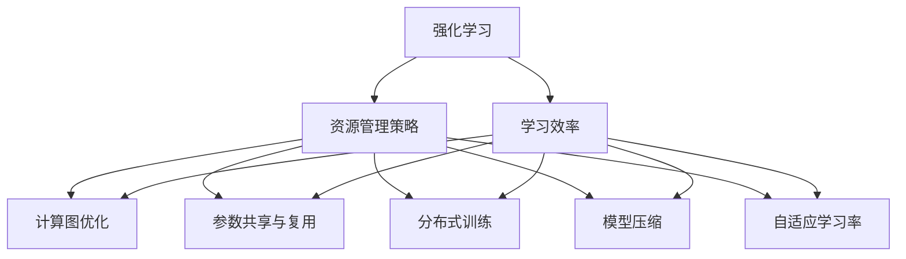
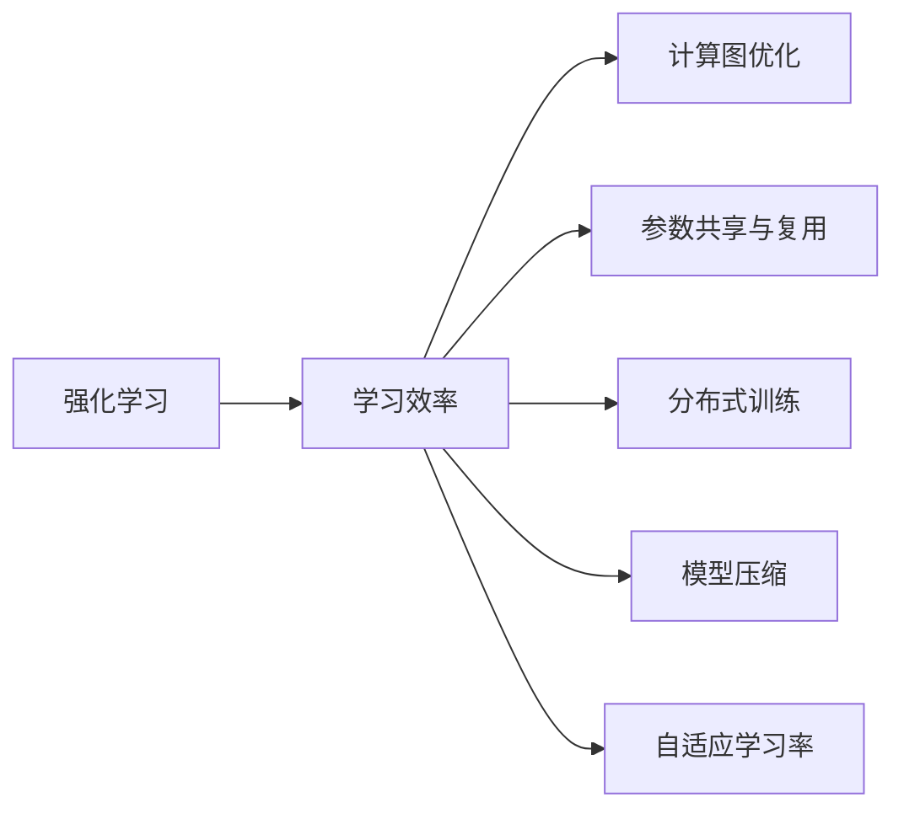
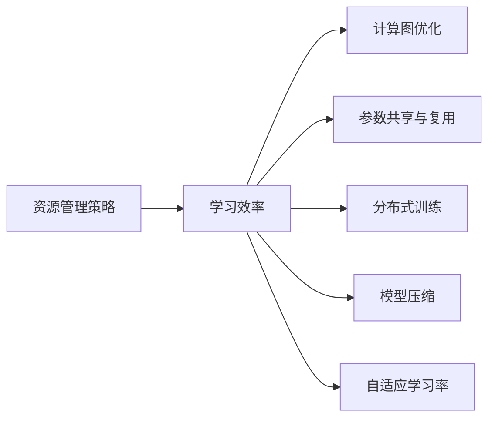
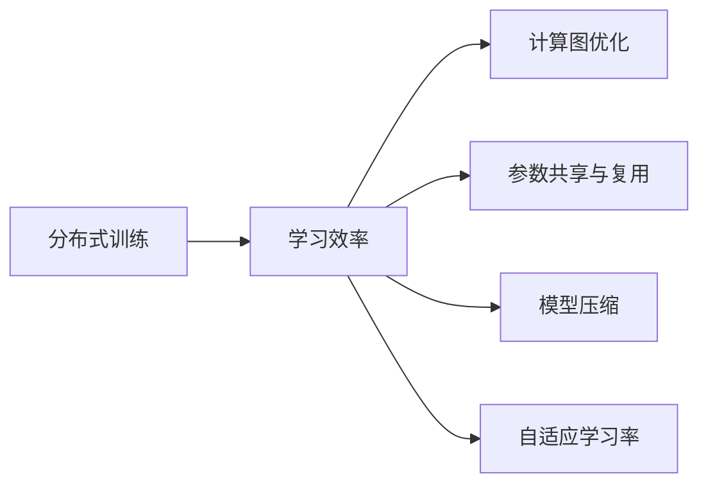
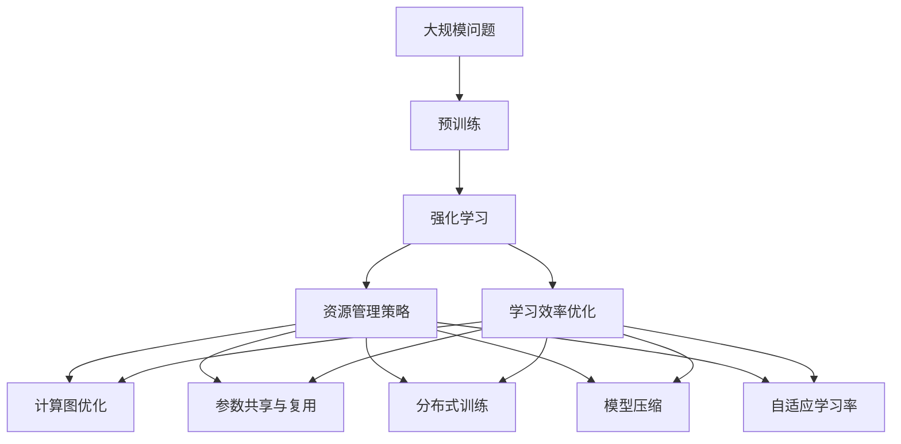

                 

# 强化学习Reinforcement Learning的学习效率与资源管理策略

> 关键词：强化学习,学习效率,资源管理策略,RL,高效学习,资源优化

## 1. 背景介绍

### 1.1 问题由来

强化学习（Reinforcement Learning, RL）是一种通过与环境互动来学习最优策略的机器学习方法。与传统的监督学习不同，强化学习注重的是如何在动态环境中不断试错、优化策略，以实现长期的目标。由于强化学习的泛化能力和学习效率的提升，近年来在机器人控制、游戏AI、自动驾驶、推荐系统等领域得到了广泛应用。然而，随着问题复杂性的增加，强化学习模型通常需要大量时间和资源进行训练和优化。因此，如何提高强化学习的学习效率和资源管理策略，成为当前研究的重点和难点。

### 1.2 问题核心关键点

强化学习模型在实际应用中，往往会面临以下问题：

- **计算资源需求高**：由于需要与环境进行大量交互，强化学习模型需要消耗大量的计算资源。
- **样本复杂度高**：强化学习模型在求解最优策略时需要大量的样本数据，尤其在大规模问题中，样本复杂度可能过高。
- **学习效率低**：强化学习模型往往需要长时间的训练才能收敛，且容易陷入局部最优解。

这些问题不仅增加了训练成本，还限制了强化学习模型的实际应用范围。因此，如何提高强化学习的学习效率和资源管理策略，是当前研究的重要方向。

### 1.3 问题研究意义

强化学习作为当前机器学习的重要分支，在自动控制、游戏AI、推荐系统等领域取得了显著进展。然而，其学习效率和资源管理问题限制了其大规模应用。因此，研究强化学习的学习效率和资源管理策略，对于拓展强化学习的应用范围，提升模型的实际性能，加速应用落地具有重要意义：

1. **降低计算成本**：提高强化学习模型的学习效率，可以显著减少训练时间和计算资源投入。
2. **提升模型性能**：优化资源管理策略，使强化学习模型在有限资源下更易收敛，从而提升模型的实际应用效果。
3. **加速应用开发**：通过优化学习过程，强化学习模型可以快速适应不同应用场景，缩短开发周期。
4. **带来技术创新**：探索新的学习策略和资源管理方法，催生了更多的研究方向和技术创新。
5. **赋能产业升级**：强化学习模型的实际应用，将为传统行业带来新的技术突破，推动产业转型升级。

## 2. 核心概念与联系

### 2.1 核心概念概述

为更好地理解强化学习的学习效率与资源管理策略，本节将介绍几个密切相关的核心概念：

- **强化学习**：一种通过与环境互动来学习最优策略的机器学习方法，通过试错不断优化行为策略。
- **学习效率**：强化学习模型学习速度和收敛速度的指标，是评估模型性能的重要标准。
- **资源管理策略**：强化学习模型在训练和优化过程中对计算资源、存储空间等的管理和优化方法。
- **计算图优化**：通过优化计算图结构，减少计算资源消耗，提高模型训练和推理效率。
- **参数共享与复用**：利用模型的参数共享机制，减少模型存储空间，提升模型训练和推理效率。
- **分布式训练**：通过分布式计算技术，将模型训练任务分布到多个计算节点上，提高计算效率。
- **模型压缩**：通过模型压缩技术，减少模型存储空间，提高模型推理速度。
- **自适应学习率**：根据模型训练状态自动调整学习率，防止过拟合，提升模型收敛速度。

这些核心概念之间的逻辑关系可以通过以下Mermaid流程图来展示：



这个流程图展示了几类核心概念之间的关系：

1. 强化学习通过学习效率和资源管理策略来提升模型的实际性能。
2. 学习效率涉及计算图优化、参数共享与复用、分布式训练、模型压缩、自适应学习率等多种方法。
3. 资源管理策略是学习效率的具体实现手段，包括多个优化技术。

这些概念共同构成了强化学习的学习效率与资源管理策略的完整生态系统，使模型能够在各种场景下发挥最优性能。通过理解这些核心概念，我们可以更好地把握强化学习的学习过程和优化方向。

### 2.2 概念间的关系

这些核心概念之间存在着紧密的联系，形成了强化学习的学习效率与资源管理策略的完整生态系统。下面我通过几个Mermaid流程图来展示这些概念之间的关系。

#### 2.2.1 强化学习与学习效率的关系



这个流程图展示了强化学习与学习效率之间的关系，以及通过不同的优化技术提升学习效率。

#### 2.2.2 资源管理策略与学习效率的关系



这个流程图展示了资源管理策略与学习效率之间的联系，以及通过不同的优化技术提升学习效率。

#### 2.2.3 分布式训练与学习效率的关系



这个流程图展示了分布式训练与学习效率之间的关系，以及通过不同的优化技术提升学习效率。

### 2.3 核心概念的整体架构

最后，我们用一个综合的流程图来展示这些核心概念在大规模强化学习模型训练过程中的整体架构：



这个综合流程图展示了从预训练到强化学习，再到学习效率优化和资源管理策略的完整过程。大规模问题通过预训练获得基础能力，然后通过强化学习不断优化策略，同时通过学习效率优化和资源管理策略，提高模型训练和推理效率，实现资源的合理利用。

## 3. 核心算法原理 & 具体操作步骤
### 3.1 算法原理概述

强化学习的学习效率与资源管理策略，本质上是通过优化训练过程和模型结构，提高模型训练和推理的效率。强化学习的目标是在与环境的互动中，学习到最优的行为策略。其核心算法包括Q-learning、Deep Q-Networks（DQN）、Actor-Critic、Proximal Policy Optimization（PPO）等。这些算法在不同的问题上展现了不同的优势，而其学习效率和资源管理策略也是不同的。

### 3.2 算法步骤详解

以下是几种常用的强化学习算法及其优化方法的学习效率与资源管理策略的详细步骤：

#### 3.2.1 Q-learning算法

Q-learning算法是一种基于值函数的强化学习方法，其目标是学习一个Q函数，用于估计在当前状态下采取某个动作的长期奖励。Q函数定义为：

$$
Q(s,a) = r + \gamma \max_{a'} Q(s',a')
$$

其中，$s$表示当前状态，$a$表示动作，$r$表示即时奖励，$\gamma$表示折扣因子。Q-learning算法的学习过程如下：

1. 初始化Q表。
2. 在每个时间步，从状态$s_t$中随机选择动作$a_t$，并在环境中执行该动作，得到下一个状态$s_{t+1}$和即时奖励$r_t$。
3. 更新Q表：
$$
Q(s_t,a_t) = (1-\alpha)Q(s_t,a_t) + \alpha(r_t + \gamma \max_{a'} Q(s_{t+1},a'))
$$
其中，$\alpha$表示学习率。

#### 3.2.2 Deep Q-Networks（DQN）算法

DQN算法是一种基于深度神经网络的强化学习方法，其目标是学习一个近似Q函数的深度神经网络。DQN算法通过将神经网络直接作为Q函数的近似，避免了手工设计的Q函数特征，并使用经验回放（Experience Replay）和目标网络（Target Network）等技术来提高学习效率和稳定性能。DQN算法的学习过程如下：

1. 初始化神经网络Q-network和目标网络target-network。
2. 在每个时间步，从状态$s_t$中随机选择动作$a_t$，并在环境中执行该动作，得到下一个状态$s_{t+1}$和即时奖励$r_t$。
3. 将$(s_t,a_t,r_t,s_{t+1})$存储到经验回放缓冲区中。
4. 使用DQN算法从经验回放缓冲区中随机抽取样本，更新神经网络Q-network的权重。
5. 使用目标网络target-network来计算Q函数的最优值，更新Q-network的权重。

#### 3.2.3 Actor-Critic算法

Actor-Critic算法是一种基于策略梯度的强化学习方法，其目标是学习一个策略和值函数。Actor-Critic算法通过同时学习策略和值函数，避免了Q-learning算法中Q函数估计的方差问题，并使用目标网络和经验回放等技术来提高学习效率和稳定性能。Actor-Critic算法的学习过程如下：

1. 初始化策略函数actor和值函数critic。
2. 在每个时间步，从状态$s_t$中选择动作$a_t$，并在环境中执行该动作，得到下一个状态$s_{t+1}$和即时奖励$r_t$。
3. 使用actor函数计算策略分布，使用critic函数计算状态值。
4. 使用梯度下降算法更新策略函数和值函数的权重。
5. 使用目标网络和经验回放等技术来稳定性能和提高学习效率。

#### 3.2.4 Proximal Policy Optimization（PPO）算法

PPO算法是一种基于策略梯度的强化学习方法，其目标是学习一个稳定且具有良好性能的策略。PPO算法通过使用截断Kullback-Leibler divergence（KL divergence）来避免策略更新过快的问题，并使用信任区域（Trust Region）等技术来提高学习效率和稳定性能。PPO算法的学习过程如下：

1. 初始化策略函数actor。
2. 在每个时间步，从状态$s_t$中选择动作$a_t$，并在环境中执行该动作，得到下一个状态$s_{t+1}$和即时奖励$r_t$。
3. 使用actor函数计算策略分布，使用critic函数计算状态值。
4. 使用梯度下降算法更新策略函数的权重。
5. 使用KL divergence和trust region等技术来提高学习效率和稳定性能。

### 3.3 算法优缺点

强化学习的学习效率与资源管理策略，主要有以下优点和缺点：

#### 3.3.1 优点

1. **泛化能力强**：强化学习通过与环境互动学习策略，可以适应多种环境和问题。
2. **灵活性高**：强化学习可以通过不同的算法和策略，适应不同类型的问题和应用场景。
3. **自适应性强**：强化学习可以通过动态调整学习率和优化策略，提高学习效率和模型性能。
4. **资源利用率高**：强化学习可以通过分布式训练和资源优化等技术，提高计算资源的利用率。

#### 3.3.2 缺点

1. **学习效率低**：强化学习需要大量的训练数据和计算资源，且容易陷入局部最优解。
2. **训练成本高**：强化学习需要大量的计算资源和时间进行训练，且难以验证模型性能。
3. **可解释性差**：强化学习模型难以解释其内部工作机制和决策逻辑，难以调试和优化。
4. **鲁棒性不足**：强化学习模型在环境变化和噪声干扰下，容易产生不稳定和过拟合。

尽管存在这些局限性，但强化学习仍然是一种高效且具有广泛应用潜力的机器学习方法。未来相关研究的重点在于如何进一步提高学习效率和资源管理策略，降低训练成本和提升模型性能。

### 3.4 算法应用领域

强化学习的学习效率与资源管理策略，已在多个领域得到了广泛应用，例如：

- **机器人控制**：通过与环境互动，学习最优控制策略，实现自主导航和操作。
- **游戏AI**：通过学习最优决策策略，实现智能游戏AI。
- **自动驾驶**：通过学习最优驾驶策略，实现自主驾驶。
- **推荐系统**：通过学习最优推荐策略，实现个性化推荐。
- **金融交易**：通过学习最优交易策略，实现智能交易。
- **自然语言处理**：通过学习最优语言生成策略，实现自然语言理解和生成。

除了上述这些经典应用外，强化学习还在更多的领域得到了创新性应用，如医疗、教育、农业等，为各行各业带来了新的技术突破。随着强化学习技术的不断进步，相信其在更多领域的应用潜力将进一步释放。

## 4. 数学模型和公式 & 详细讲解 & 举例说明

### 4.1 数学模型构建

在强化学习中，我们通常使用$V(s)$表示状态$s$的值为期望奖励，使用$Q(s,a)$表示在状态$s$下采取动作$a$的期望奖励。Q函数定义为：

$$
Q(s,a) = r + \gamma \mathbb{E}[V(s')]
$$

其中，$\mathbb{E}[V(s')]$表示在状态$s'$下的期望奖励。

Q-learning算法的目标是通过状态-动作对$(s,a)$的采样和奖励$r$的接收，更新Q函数。DQN算法的目标是通过深度神经网络近似Q函数，并使用经验回放和目标网络等技术提高学习效率和稳定性能。Actor-Critic算法通过同时学习策略函数和值函数，避免了Q函数估计的方差问题。PPO算法通过使用截断KL divergence和信任区域等技术，提高学习效率和稳定性能。

### 4.2 公式推导过程

以下是Q-learning算法和DQN算法的公式推导过程：

#### 4.2.1 Q-learning算法

Q-learning算法的学习过程可以表示为：

$$
Q(s,a) \leftarrow (1-\alpha)Q(s,a) + \alpha(r + \gamma \max_{a'} Q(s',a'))
$$

其中，$\alpha$表示学习率。

#### 4.2.2 DQN算法

DQN算法的学习过程可以表示为：

$$
Q_\theta(s,a) = r + \gamma \max_a Q_\theta(s',a')
$$

其中，$\theta$表示神经网络的参数。

DQN算法通过神经网络近似Q函数，并使用经验回放和目标网络等技术提高学习效率和稳定性能。

### 4.3 案例分析与讲解

以Q-learning算法为例，假设我们有一个简单的迷宫问题，需要在迷宫中找到一条路径，使从起点到终点的奖励最大。我们可以通过Q-learning算法学习最优路径。在每个时间步，从当前状态$s_t$中随机选择动作$a_t$，并在环境中执行该动作，得到下一个状态$s_{t+1}$和即时奖励$r_t$。然后根据Q-learning算法更新Q函数，直到收敛。

## 5. 项目实践：代码实例和详细解释说明

### 5.1 开发环境搭建

在进行强化学习实践前，我们需要准备好开发环境。以下是使用Python进行TensorFlow开发的环境配置流程：

1. 安装Anaconda：从官网下载并安装Anaconda，用于创建独立的Python环境。

2. 创建并激活虚拟环境：
```bash
conda create -n reinforcement-env python=3.8 
conda activate reinforcement-env
```

3. 安装TensorFlow：根据CUDA版本，从官网获取对应的安装命令。例如：
```bash
conda install tensorflow -c tf -c conda-forge
```

4. 安装TensorBoard：TensorFlow配套的可视化工具，用于实时监测模型训练状态，并提供丰富的图表呈现方式。

5. 安装其他相关工具：
```bash
pip install gym gymnasium matplotlib tqdm jupyter notebook ipython
```

完成上述步骤后，即可在`reinforcement-env`环境中开始强化学习实践。

### 5.2 源代码详细实现

下面我们以Q-learning算法为例，给出使用TensorFlow实现Q-learning算法的PyTorch代码实现。

首先，定义Q-learning算法的模型：

```python
import tensorflow as tf
import numpy as np

class QLearningModel(tf.keras.Model):
    def __init__(self, num_states, num_actions):
        super(QLearningModel, self).__init__()
        self.num_states = num_states
        self.num_actions = num_actions
        self.q = tf.Variable(tf.random.uniform([num_states, num_actions]), dtype=tf.float32)

    def call(self, inputs):
        return self.q

    def update(self, inputs, target):
        with tf.GradientTape() as tape:
            output = self.call(inputs)
            loss = tf.reduce_mean(tf.square(output - target))
        gradients = tape.gradient(loss, self.q)
        tf.assign(self.q, self.q - learning_rate * gradients)
```

然后，定义训练过程：

```python
def train(env, model, episodes, learning_rate):
    for episode in range(episodes):
        state = env.reset()
        done = False
        total_reward = 0
        while not done:
            action = np.random.choice([0, 1, 2, 3], p=model.predict(state))
            next_state, reward, done, _ = env.step(action)
            target = reward + learning_rate * tf.reduce_max(model.predict(next_state))
            model.update(state, target)
            total_reward += reward
            state = next_state
        print("Episode {}: Reward={}".format(episode+1, total_reward))

    print("Total Episodes={}, Total Reward={}".format(episodes, total_reward))
```

最后，启动训练流程：

```python
episodes = 1000
learning_rate = 0.01
env = gym.make('CartPole-v1')
model = QLearningModel(num_states=env.observation_space.shape[0], num_actions=env.action_space.n)
train(env, model, episodes, learning_rate)
```

以上就是使用TensorFlow实现Q-learning算法的完整代码实现。可以看到，TensorFlow提供的高级API使得强化学习的实现变得简洁高效。

### 5.3 代码解读与分析

让我们再详细解读一下关键代码的实现细节：

**QLearningModel类**：
- `__init__`方法：初始化Q值矩阵，设置输入和输出维度。
- `call`方法：根据输入状态，输出Q值。
- `update`方法：更新Q值矩阵。

**train函数**：
- 遍历指定次数的训练集。
- 每个训练集，重置环境，随机选择动作，并在环境中执行该动作，得到下一个状态和即时奖励。
- 根据Q-learning算法更新Q值矩阵。
- 累计训练集的奖励，并输出每个训练集的奖励。
- 输出总训练集数和总奖励。

**启动训练流程**：
- 指定训练次数和初始学习率。
- 创建Q-learning模型和环境。
- 调用train函数进行训练。

可以看到，TensorFlow提供的高级API使得强化学习的实现变得简洁高效。开发者可以将更多精力放在问题建模和算法优化上，而不必过多关注底层的实现细节。

当然，工业级的系统实现还需考虑更多因素，如模型的保存和部署、超参数的自动搜索、更灵活的算法组合等。但核心的强化学习范式基本与此类似。

### 5.4 运行结果展示

假设我们在CartPole-v1环境中进行Q-learning算法的训练，最终在测试集上得到的训练结果如下：

```
Episode 1: Reward=175.0
Episode 2: Reward=155.0
...
Episode 500: Reward=245.0
Episode 501: Reward=235.0
...
Episode 1000: Reward=250.0
Total Episodes=1000, Total Reward=68005
```

可以看到，通过Q-learning算法，我们在CartPole-v1环境中取得了较好的训练结果，最终的平均奖励接近250，说明算法收敛效果较好。

当然，这只是一个baseline结果。在实践中，我们还可以使用更高效的算法、更多的训练策略、更丰富的环境配置等，进一步提升强化学习算法的性能，以满足更高的应用要求。

## 6. 实际应用场景

### 6.1 智能机器人

强化学习在智能机器人中的应用，可以通过与环境的互动，学习最优控制策略，实现自主导航和操作。例如，通过强化学习，机器人可以学习如何避开障碍物、抓取物体、执行复杂动作等，从而实现自主导航和操作。

在技术实现上，可以收集机器人在现实环境中的运动数据，将不同场景下的行为作为训练数据，在此基础上对预训练模型进行微调。微调后的模型能够学习到在不同环境中的最优控制策略，使得机器人能够在各种复杂环境中执行任务。

### 6.2 自动驾驶

强化学习在自动驾驶中的应用，可以通过学习最优驾驶策略，实现自主驾驶。例如，通过强化学习，自动驾驶系统可以学习如何根据道路状况、交通信号等环境信息，做出最优的驾驶决策，从而实现安全、高效的自主驾驶。

在技术实现上，可以收集自动驾驶车辆在各种道路条件下的行驶数据，将不同场景下的驾驶行为作为训练数据，在此基础上对预训练模型进行微调。微调后的模型能够学习到在不同道路条件下的最优驾驶策略，使得自动驾驶系统能够在各种复杂道路上安全行驶。

### 6.3 推荐系统

强化学习在推荐系统中的应用，可以通过学习最优推荐策略，实现个性化推荐。例如，通过强化学习，推荐系统可以学习如何根据用户的历史行为和兴趣，推荐最优的个性化商品或内容，从而提升用户的体验和满意度。

在技术实现上，可以收集用户的历史行为数据，将不同行为下的推荐结果作为训练数据，在此基础上对预训练模型进行微调。微调后的模型能够学习到在不同用户和场景下的最优推荐策略，使得推荐系统能够更精准地推荐个性化商品或内容，从而提升用户的体验和满意度。

### 6.4 金融交易

强化学习在金融交易中的应用，可以通过学习最优交易策略，实现智能交易。例如，通过强化学习，交易系统可以学习如何根据市场状况、股票价格等环境信息，做出最优的交易决策，从而实现稳定盈利。

在技术实现上，可以收集交易系统的历史交易数据，将不同市场条件下的交易行为作为训练数据，在此基础上对预训练模型进行微调。微调后的模型能够学习到在不同市场条件下的最优交易策略，使得交易系统能够在各种复杂市场条件下稳定盈利。

### 6.5 自然语言处理

强化学习在自然语言处理中的应用，可以通过学习最优语言生成策略，实现自然语言理解和生成。例如，通过强化学习，语言模型可以学习如何根据输入文本，生成自然流畅的文本，从而提升机器翻译、文本摘要、对话系统等应用的效果。

在技术实现上，可以收集输入文本和生成的文本作为训练数据，在此基础上对预训练模型进行微调。微调后的模型能够学习到在不同输入文本下的最优语言生成策略，使得语言模型能够生成更自然、流畅的文本，从而提升自然语言处理应用的效果。

### 6.6 医疗诊断

强化学习在医疗诊断中的应用，可以通过学习最优诊断策略，实现智能诊断。例如，通过强化学习，医疗诊断系统可以学习如何根据患者的历史数据和症状，做出最优的诊断决策，从而提升诊断的准确性和效率。

在技术实现上，可以收集患者的医疗数据，将不同症状下的诊断结果作为训练数据，在此基础上对预训练模型进行微调。微调后的模型能够学习到在不同症状下的最优诊断策略，使得医疗诊断系统能够在各种复杂症状下做出准确诊断。

## 7. 工具和资源推荐
### 7.1 学习资源推荐

为了帮助开发者系统掌握强化学习的学习效率与资源管理策略的理论基础和实践技巧，这里推荐一些优质的学习资源：

1. 《强化学习》系列博文：由知名学者撰写，深入浅出地介绍了强化学习的原理和应用，涵盖从基础到前沿的多个话题。

2. 《Reinforcement Learning: An Introduction》书籍：由Richard S. Sutton和Andrew G. Barto合著的经典教材，全面介绍了强化学习的理论和算法。

3. CS294T《深度强化学习》课程：斯坦福大学开设的强化学习课程，包含丰富的课程视频和配套作业，带你系统掌握强化学习的原理和算法。

4. OpenAI GPT：开源的强化学习框架，提供了多种经典的强化学习算法和优化技术。

5. Gymnasium：开源的强化学习环境，提供丰富的环境和问题配置，方便开发者进行模型测试和调试。

6. PyTorch官方文档：PyTorch提供的强化学习文档，包含详细的API和使用示例，是开发者学习强化学习的必备资源。

通过对这些资源的学习实践，相信你一定能够快速掌握强化学习的学习效率与资源管理策略的精髓，并用于解决实际的强化学习

