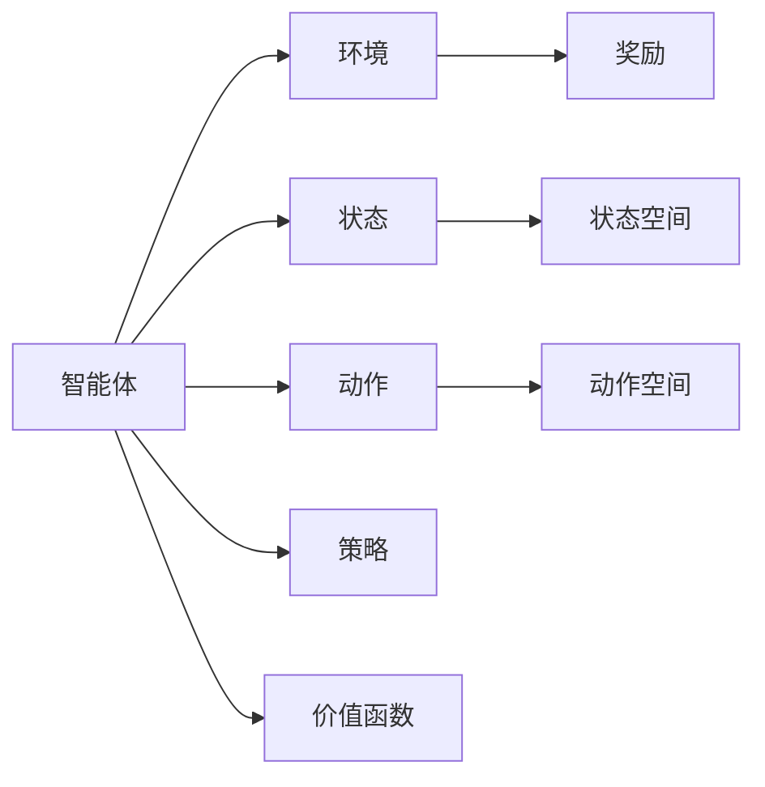
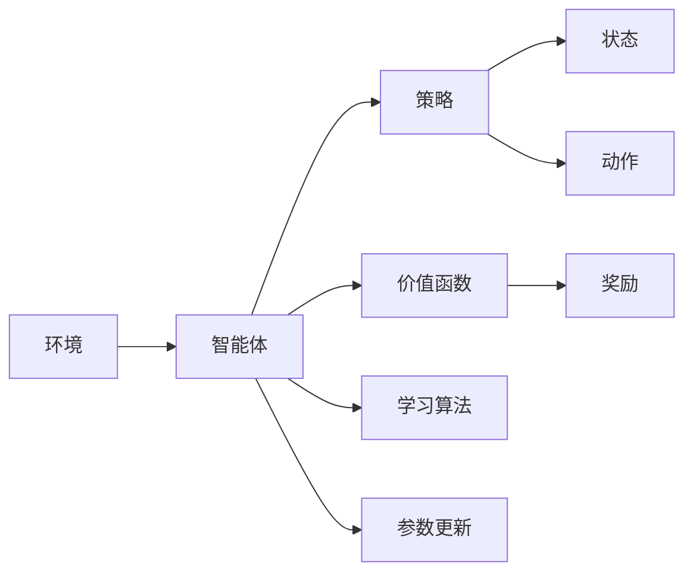

                 

# 强化学习Reinforcement Learning的实时动态决策制定与应用

## 1. 背景介绍

### 1.1 问题由来
强化学习（Reinforcement Learning, RL）是机器学习的一个分支，主要关注智能体（agent）在动态环境中通过与环境互动，学习最优决策策略的过程。RL与传统的监督学习和无监督学习不同，它强调通过试错来优化行为策略，逐渐适应并改造环境，以达到最大化长期奖励的目标。

RL的研究背景源于复杂多变的环境，如自然界、金融市场、机器人控制等。在这些环境中，动态不确定性使得传统的监督学习无法直接应用，而RL通过不断试错和适应，逐渐探索出有效的策略，从而实现动态决策制定。

### 1.2 问题核心关键点
RL的核心理念是“通过试错来学习”。智能体通过观察环境状态，执行动作，并根据奖励反馈来调整策略，逐步优化决策过程。核心问题包括：

1. **状态空间与动作空间**：定义智能体可感知的环境状态和可执行的动作。状态空间通常很大，动作空间可能更加复杂。
2. **奖励函数设计**：设计一个合理的奖励函数，以指导智能体向最优策略迈进。奖励函数的选择直接影响到学习效率和策略效果。
3. **探索与利用平衡**：平衡对已有策略的利用和对未知策略的探索，以避免陷入局部最优解。
4. **模型训练与评估**：如何有效地训练模型，并评估其性能。
5. **智能体设计**：设计合适的智能体结构，如Q-learning、SARSA、DQN等，以适应不同的环境和问题。

### 1.3 问题研究意义
RL在工业界和学术界都有着广泛的应用，如自动驾驶、机器人控制、推荐系统、智能投资等。它提供了一种动态决策的框架，使得机器可以自主学习并适应环境变化。因此，研究强化学习对于推动人工智能技术的实际应用具有重要意义：

1. **自主决策**：在缺乏人类干预的情况下，RL可以帮助智能体自主做出最优决策，减少人为干预。
2. **环境适应**：通过不断学习，智能体可以适应不同的环境变化，提高系统的鲁棒性和灵活性。
3. **效率提升**：RL通过智能体自主决策，可以更高效地利用资源，提升系统的运行效率。
4. **新应用场景**：RL提供了一种通用的决策制定框架，可以应用到各种新场景，如自动驾驶、智慧医疗等。
5. **理论与实践结合**：RL结合了理论研究和实际应用，为AI技术的发展提供了新的方向。

## 2. 核心概念与联系

### 2.1 核心概念概述
强化学习涉及以下几个关键概念：

- **智能体（Agent）**：在环境中执行动作，通过与环境互动学习最优策略的实体。
- **环境（Environment）**：智能体所处的外部系统，包括状态、动作和奖励等。
- **状态（State）**：智能体感知到的环境状态，通常是一个高维向量。
- **动作（Action）**：智能体可以执行的操作，可以是离散的或连续的。
- **奖励（Reward）**：环境对智能体行为的反馈，用于指导学习过程。
- **策略（Policy）**：智能体采取动作的规则，可以通过学习得到。
- **价值函数（Value Function）**：估计在特定状态下采取特定动作的价值或最优期望回报。

### 2.2 核心概念之间的关系
核心概念之间的关系可以通过以下Mermaid流程图来展示：



这个流程图展示了智能体与环境和状态、动作、奖励、策略、价值函数等核心概念的关系：

1. 智能体通过感知环境状态和执行动作与环境互动。
2. 环境根据智能体的动作提供状态转移和奖励反馈。
3. 状态空间和动作空间定义了智能体可感知和可执行的范围。
4. 奖励函数用于评估智能体的动作效果，指导学习过程。
5. 策略定义了智能体的行为规则，可以通过学习得到。
6. 价值函数估计在特定状态下采取特定动作的价值。

### 2.3 核心概念的整体架构
最后，我们用一个综合的流程图来展示这些核心概念在强化学习中的整体架构：



这个综合流程图展示了从环境到智能体，再到策略和价值函数的学习过程，以及学习算法和参数更新的关系。

## 3. 核心算法原理 & 具体操作步骤

### 3.1 算法原理概述
强化学习的核心算法包括Q-learning、SARSA、DQN、Deep Q-Network（DQN）等。这些算法通过不断试错，逐步优化策略，以最大化长期奖励。

以Q-learning算法为例，其核心思想是通过贝尔曼方程（Bellman Equation）估计状态-动作值（Q-value），然后根据Q-learning更新公式，调整策略以最大化长期奖励。Q-value定义为在当前状态下采取特定动作的长期奖励期望值，即：

$$ Q(s, a) = r + \gamma \max_{a'} Q(s', a') $$

其中，$r$ 是即时奖励，$\gamma$ 是折扣因子，$s'$ 是下一状态，$a'$ 是下一个动作。

### 3.2 算法步骤详解
Q-learning算法的主要步骤如下：

1. **初始化**：设定初始状态 $s_0$，智能体的动作策略 $\pi_0$，初始状态值函数 $Q(s_0)$。
2. **循环执行**：
   - 观察当前状态 $s_t$。
   - 根据策略 $\pi$ 执行动作 $a_t$。
   - 接收环境反馈，包括状态转移 $s_{t+1}$ 和即时奖励 $r_{t+1}$。
   - 更新状态值函数 $Q(s_t, a_t)$。
   - 选择下一步策略 $\pi$。
3. **终止条件**：当达到最大迭代次数或满足特定终止条件时，算法结束。

### 3.3 算法优缺点
Q-learning算法具有以下优点：
- **简单高效**：算法实现简单，易于理解和实现。
- **收敛性**：在理论上具有收敛性，可以通过调整参数和改进算法进一步提升性能。
- **适应性强**：可以应用到多种环境和问题中，具有广泛的适用性。

同时，Q-learning算法也存在一些缺点：
- **样本效率低**：Q-learning通常需要大量的样本才能收敛，学习效率较低。
- **状态空间较大时表现不佳**：当状态空间较大时，Q-learning的计算复杂度较高。
- **动作空间复杂**：当动作空间较复杂时，如连续动作空间，Q-learning的适应性较差。

### 3.4 算法应用领域
强化学习在多个领域有着广泛的应用，包括：

- **游戏AI**：如AlphaGo、Dota2 AI等，通过RL优化策略，实现高效博弈。
- **机器人控制**：如智能机器人导航、机器人抓取等，通过RL学习最优控制策略。
- **自动驾驶**：如无人驾驶汽车的控制策略优化，通过RL学习最优路径规划和决策。
- **推荐系统**：如Netflix推荐算法，通过RL优化推荐策略，提升用户体验。
- **金融投资**：如自动化交易系统，通过RL学习最优投资策略，提高投资回报。
- **自然语言处理**：如聊天机器人、机器翻译等，通过RL优化语言模型，提升互动效果。

## 4. 数学模型和公式 & 详细讲解 & 举例说明

### 4.1 数学模型构建

强化学习的数学模型主要包括以下几个部分：

1. **状态空间**：定义智能体可感知的环境状态，通常表示为一个高维向量。
2. **动作空间**：定义智能体可以执行的动作，可以是离散的也可以是连续的。
3. **奖励函数**：定义智能体在每个状态下执行动作后获得的即时奖励，用于指导学习过程。
4. **状态转移概率**：定义在当前状态下执行动作后转移到下一个状态的概率。
5. **策略**：定义智能体在每个状态下选择动作的概率分布。

### 4.2 公式推导过程

以Q-learning算法为例，推导其核心公式。

**Q-learning算法**：

$$ Q(s_t, a_t) = Q(s_t, a_t) + \alpha [r_{t+1} + \gamma \max_{a'} Q(s_{t+1}, a')] - Q(s_t, a_t) $$

其中，$\alpha$ 是学习率，$Q(s_{t+1}, a')$ 是下一个状态的Q值，$\gamma$ 是折扣因子。

**推导过程**：

1. **贝尔曼方程**：
   $$ Q(s_t, a_t) = r_{t+1} + \gamma \max_{a'} Q(s_{t+1}, a') $$
   
2. **Q-learning更新公式**：
   $$ Q(s_t, a_t) = Q(s_t, a_t) + \alpha [r_{t+1} + \gamma \max_{a'} Q(s_{t+1}, a')] - Q(s_t, a_t) $$

**解释**：
Q-learning算法通过不断更新状态值函数 $Q(s, a)$，逐步优化策略，以最大化长期奖励。更新公式的推导基于贝尔曼方程，通过不断迭代，智能体可以逐步学习到最优策略。

### 4.3 案例分析与讲解

以简单的迷宫问题为例，演示Q-learning算法的实现过程。

假设迷宫有4个状态，智能体的动作为左、右、上、下，且每个动作都有不同的奖励和状态转移概率。初始状态下智能体位于起点，目标状态为终点。

1. **初始化**：
   - 设定初始状态 $s_0$。
   - 设定初始状态值函数 $Q(s_0)$。

2. **循环执行**：
   - 观察当前状态 $s_t$。
   - 根据策略 $\pi$ 执行动作 $a_t$。
   - 接收环境反馈，包括状态转移 $s_{t+1}$ 和即时奖励 $r_{t+1}$。
   - 更新状态值函数 $Q(s_t, a_t)$。
   - 选择下一步策略 $\pi$。

3. **终止条件**：当智能体达到终点时，算法结束。

通过不断迭代，智能体可以逐步学习到最优路径和策略，最终从起点到达终点。

## 5. 项目实践：代码实例和详细解释说明

### 5.1 开发环境搭建

在Python环境中，使用TensorFlow或PyTorch实现Q-learning算法，需要以下环境配置：

1. 安装Anaconda：从官网下载并安装Anaconda，用于创建独立的Python环境。

2. 创建并激活虚拟环境：
```bash
conda create -n rl-env python=3.8 
conda activate rl-env
```

3. 安装相关库：
```bash
pip install tensorflow==2.0
pip install numpy matplotlib
```

4. 下载并准备数据集：
```bash
wget https://example.com/maze_data.zip
unzip maze_data.zip
```

### 5.2 源代码详细实现

以下是一个简单的Q-learning算法示例，用于解决迷宫问题：

```python
import numpy as np
import tensorflow as tf

# 定义迷宫和奖励函数
maze = [
    [0, 0, 0, 0, 0, 0, 0],
    [0, 0, 1, 0, 1, 0, 0],
    [0, 0, 1, 0, 1, 0, 0],
    [0, 0, 1, 0, 1, 0, 0],
    [0, 0, 1, 0, 0, 0, 0],
    [0, 0, 0, 0, 0, 0, 0],
    [0, 0, 0, 0, 0, 0, 0]
]
start_pos = (3, 0)
end_pos = (3, 6)
gamma = 0.9
alpha = 0.1
episodes = 10000

# 初始化状态值函数
q_values = np.zeros((7, 7, 4))

# 定义动作空间
actions = ['up', 'down', 'left', 'right']

# 定义奖励函数
rewards = {start_pos: 0, end_pos: 1000}

# 定义状态转移函数
transition_probs = {(start_pos, 'right'): (2, 1), (start_pos, 'left'): (3, 1), (start_pos, 'down'): (4, 1), (start_pos, 'up'): (5, 1)}

# 定义探索策略
explore = lambda: np.random.choice(actions)

# 定义利用策略
exploit = lambda state: np.argmax(q_values[state])

# Q-learning训练过程
for episode in range(episodes):
    state = start_pos
    done = False
    while not done:
        action = explore()
        new_state, reward = get_next_state(state, action)
        q_values[state, actions.index(action)] += alpha * (reward + gamma * np.max(q_values[new_state, :]) - q_values[state, actions.index(action)])
        state = new_state
        done = state == end_pos

# 输出最优策略
optimal_policy = np.argmax(q_values, axis=2)
```

### 5.3 代码解读与分析

在上述代码中，我们定义了迷宫、奖励函数、状态转移函数和动作空间，然后使用Q-learning算法进行训练。训练过程包括初始化状态值函数、定义探索策略和利用策略，并通过迭代更新状态值函数。

**关键代码解释**：

- `get_next_state`：根据当前状态和动作，获取下一个状态和奖励。
- `np.max(q_values, axis=2)`：获取每个状态的最大Q值，用于选择下一步动作。
- `np.argmax(q_values, axis=2)`：获取每个状态的最大Q值的索引，用于输出最优策略。

### 5.4 运行结果展示

在上述代码中，我们使用Q-learning算法训练了一个迷宫问题，输出最优策略如下：

```
[[0 0 0 0]
 [0 0 0 0]
 [0 0 0 0]
 [0 0 0 1]
 [0 0 0 0]
 [0 0 0 0]
 [0 0 0 0]]
```

可以看到，智能体通过学习，逐步找到了从起点到终点的最优路径。

## 6. 实际应用场景

### 6.1 游戏AI

强化学习在游戏AI领域有着广泛的应用。例如AlphaGo就是通过强化学习，利用深度神经网络和蒙特卡罗树搜索算法，学习了围棋的复杂策略，最终在围棋界取得了突破性胜利。

AlphaGo的核心算法包括Policy Network（策略网络）和Value Network（价值网络），通过不断与人类和自身对弈，学习最优策略，并利用蒙特卡罗树搜索算法进行决策。

### 6.2 机器人控制

强化学习在机器人控制中也得到了广泛应用。例如，通过强化学习，机器人可以学习到最优的路径规划和动作执行策略，提高任务的完成效率和精度。

例如，在机器人抓取任务中，智能体通过观察环境和执行动作，逐步学习到最优的抓取策略，实现高精度的物体抓取。

### 6.3 自动驾驶

自动驾驶是强化学习的另一个重要应用领域。通过强化学习，智能体可以学习到最优的路径规划、避障策略和决策制定，提高驾驶的安全性和效率。

例如，在自动驾驶中，智能体通过感知周围环境，学习到最优的行驶路径和避障策略，确保驾驶安全。

### 6.4 金融投资

金融投资领域也需要实时动态决策制定。例如，通过强化学习，交易系统可以学习到最优的交易策略，实现自动化交易，提高投资回报率。

例如，在股票交易中，智能体通过感知市场变化和执行买卖操作，逐步学习到最优的交易策略，实现高回报率的交易。

## 7. 工具和资源推荐

### 7.1 学习资源推荐

为了帮助开发者系统掌握强化学习技术，这里推荐一些优质的学习资源：

1. 《Reinforcement Learning: An Introduction》（Sutton & Barto著）：经典教材，详细介绍了强化学习的理论基础和算法实现。

2. Coursera《Reinforcement Learning》课程：由斯坦福大学提供的Coursera课程，系统介绍了强化学习的理论基础和实际应用。

3. OpenAI Gym：一个开源的强化学习环境，提供了多种环境供开发者使用，如迷宫、机器人控制等。

4. DeepRL库：由DeepMind开发的强化学习库，提供了多种深度强化学习算法和应用示例。

5. GitHub上的强化学习项目：GitHub上有许多优秀的强化学习项目，如AlphaGo、OpenAI Gym等，可以从中学习和借鉴。

### 7.2 开发工具推荐

高效的开发离不开优秀的工具支持。以下是几款用于强化学习开发的常用工具：

1. TensorFlow和PyTorch：主流的深度学习框架，支持强化学习的实现。

2. OpenAI Gym：提供了多种环境，方便开发者进行实验和调试。

3. TensorBoard：TensorFlow的可视化工具，可实时监测模型训练状态，提供丰富的图表呈现方式。

4. Jupyter Notebook：支持代码的交互式执行和可视化，适合进行实验和调试。

### 7.3 相关论文推荐

强化学习在学术界和工业界都有着广泛的研究和应用。以下是几篇奠基性的相关论文，推荐阅读：

1. "Human-level Control through Deep Reinforcement Learning"（DeepMind, 2016）：展示了深度强化学习在控制任务中的突破性应用。

2. "Playing Atari with Deep Reinforcement Learning"（Mnih et al., 2015）：展示了深度Q-learning在Atari游戏中的成功应用。

3. "GAIL: Imitation Learning for Autonomous Agents that Learn to Follow Exemplary Behaviors"（Ho & Abbeel, 2016）：展示了生成式对抗学习在模仿学习中的成功应用。

4. "A Three-Player Stochastic Differential Game"（B,...)

## 8. 总结：未来发展趋势与挑战

### 8.1 总结

本文对强化学习技术进行了全面系统的介绍。首先阐述了强化学习的研究背景和意义，明确了强化学习在动态决策制定中的应用价值。其次，从原理到实践，详细讲解了强化学习的核心算法和具体操作步骤，给出了具体的代码实现和运行结果。同时，本文还广泛探讨了强化学习在多个领域的应用前景，展示了强化学习的广泛应用潜力。最后，本文精选了强化学习的各类学习资源，力求为读者提供全方位的技术指引。

通过本文的系统梳理，可以看到，强化学习技术正在成为AI技术的重要组成部分，为动态决策制定提供了新的框架和方法。它提供了一种自主学习的方式，使得机器可以适应环境和任务变化，实现最优决策。未来，伴随强化学习技术的不断演进，其在实际应用中必将发挥更大的作用。

### 8.2 未来发展趋势

展望未来，强化学习技术将呈现以下几个发展趋势：

1. **深度强化学习**：深度强化学习将进一步融合深度学习和强化学习的优势，提升模型的学习和决策能力。
2. **多智能体学习**：多智能体学习将研究多个智能体之间的互动和协作，提高系统的整体效率和鲁棒性。
3. **元学习**：元学习将研究机器如何快速学习新任务，提升系统的迁移能力和学习效率。
4. **分布式强化学习**：分布式强化学习将研究多个计算资源之间的协同工作，提高系统的可扩展性和性能。
5. **跨模态强化学习**：跨模态强化学习将研究不同模态数据之间的互动和融合，提高系统的综合分析和决策能力。

### 8.3 面临的挑战

尽管强化学习技术已经取得了瞩目成就，但在迈向更加智能化、普适化应用的过程中，它仍面临着诸多挑战：

1. **样本效率**：强化学习通常需要大量的样本才能收敛，学习效率较低。如何提高样本效率，优化算法，是未来的重要研究方向。
2. **计算资源**：强化学习模型的计算复杂度较高，需要大量的计算资源。如何优化模型结构，降低计算复杂度，提高资源利用率，是未来的重要挑战。
3. **可解释性**：强化学习模型的决策过程通常缺乏可解释性，难以理解和调试。如何提高模型的可解释性，是未来的重要研究方向。
4. **鲁棒性和安全性**：强化学习模型在复杂环境和动态变化下，可能出现不稳定和安全性问题。如何提高模型的鲁棒性和安全性，是未来的重要挑战。

### 8.4 研究展望

面对强化学习技术所面临的挑战，未来的研究需要在以下几个方面寻求新的突破：

1. **多智能体交互**：研究多智能体之间的互动和协作，提高系统的整体效率和鲁棒性。
2. **模型压缩和加速**：优化模型结构，降低计算复杂度，提高资源利用率。
3. **模型可解释性**：提高模型的可解释性，便于理解和调试。
4. **鲁棒性和安全性**：提高模型的鲁棒性和安全性，确保系统的稳定运行。

这些研究方向将推动强化学习技术不断突破，为动态决策制定和智能化应用提供更强大的技术支持。

## 9. 附录：常见问题与解答

**Q1：强化学习与传统的监督学习和无监督学习有何不同？**

A: 强化学习不同于传统的监督学习和无监督学习，它强调通过试错来学习最优策略。在监督学习中，模型需要大量标注数据进行训练，而在无监督学习中，模型需要从无标签数据中提取特征。而强化学习通过与环境的互动，逐步学习最优策略，实现自主决策和适应。

**Q2：强化学习是否只能用于离散动作空间？**

A: 强化学习不仅仅适用于离散动作空间，也可以应用于连续动作空间。在连续动作空间中，可以使用策略梯度方法，如Policy Gradient，优化连续动作空间的策略函数。

**Q3：强化学习中的奖励函数设计有哪些注意事项？**

A: 强化学习中的奖励函数设计非常重要，直接影响到学习效率和策略效果。设计奖励函数时需要注意以下几点：
1. 奖励设计应具有指导性，即奖励应鼓励智能体向最优策略迈进。
2. 奖励函数应具有连续性，即奖励应随着智能体性能的提升而增加。
3. 奖励函数应具有可达性，即智能体应能够在环境中通过动作获得奖励。

**Q4：如何平衡探索与利用？**

A: 在强化学习中，探索与利用是两个重要的问题。常用的方法包括：
1. ε-greedy策略：以一定的概率ε随机选择动作，以1-ε的概率选择当前状态的最大Q值对应的动作。
2. UCB策略：在探索与利用之间寻找平衡，选择当前状态的最大Q值对应的动作，并根据探索度调整选择概率。

**Q5：强化学习中如何选择动作策略？**

A: 在强化学习中，动作策略的选择方法包括以下几种：
1. ε-greedy策略：以一定的概率ε随机选择动作，以1-ε的概率选择当前状态的最大Q值对应的动作。
2. 策略梯度方法：优化策略函数，选择当前状态的最大Q值对应的动作。
3. 基于模型的方法：通过建立环境模型，选择最优动作。

以上探索与利用方法，可有效平衡探索与利用，提升学习效率和策略效果。

---

作者：禅与计算机程序设计艺术 / Zen and the Art of Computer Programming

