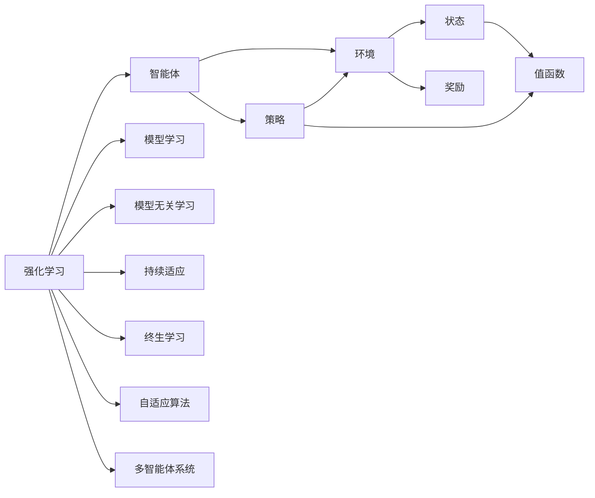
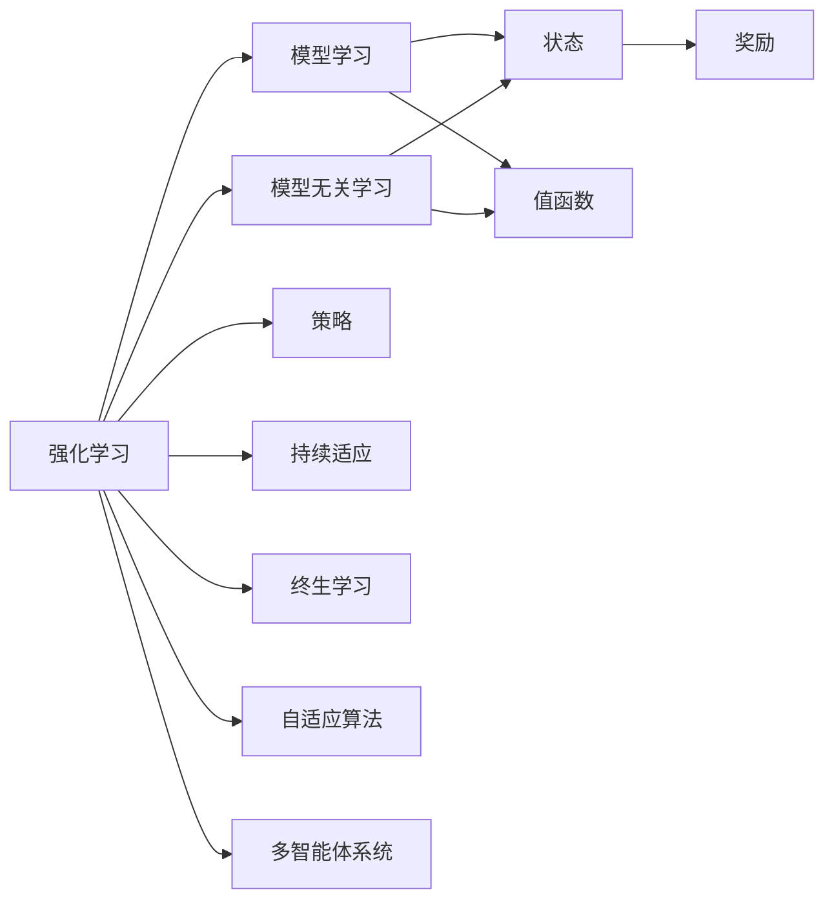
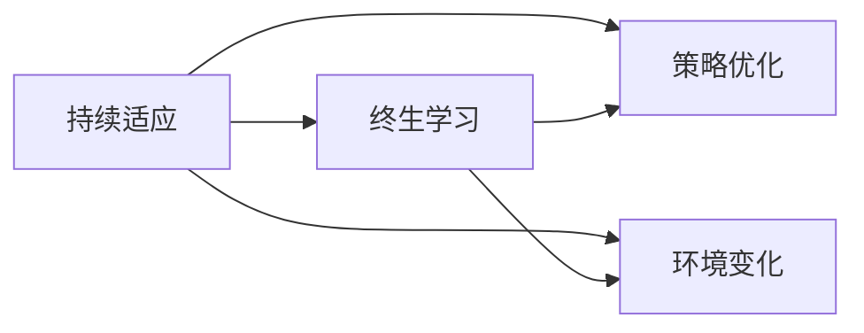
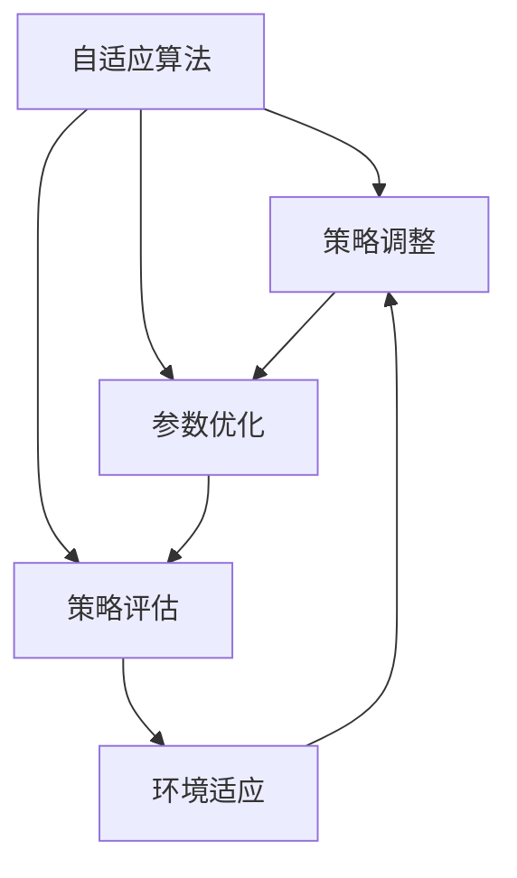

                 

# 强化学习Reinforcement Learning的终生学习与持续适应能力

> 关键词：强化学习, 终生学习, 持续适应, 智能体, 策略优化, 环境交互, 自适应算法, 多智能体系统, 奖励机制, 算法稳定性和鲁棒性

## 1. 背景介绍

### 1.1 问题由来
强化学习（Reinforcement Learning, RL）作为人工智能领域的重要分支，近年来在多个领域，如游戏、机器人控制、推荐系统等，取得了令人瞩目的进展。与传统监督学习和无监督学习不同，强化学习通过智能体与环境的交互，通过试错的方式学习最优策略，从而达到既定目标。

然而，强化学习的一个主要问题是其对环境的高度依赖。当智能体在复杂多变的环境中执行任务时，即使在最优策略下，也难以保证长期稳定性和适应性。因此，如何让强化学习算法具备终生学习与持续适应能力，成为一个亟需解决的问题。

### 1.2 问题核心关键点
强化学习终生学习与持续适应能力的关键在于：
- 如何使智能体在不断变化的环境中仍能保持策略的有效性。
- 如何使智能体能够从经验中持续学习并适应新的状态和任务。
- 如何设计自适应算法，使得智能体能够自主调整策略和行为，以应对环境变化。
- 如何在多智能体系统中，智能体之间如何协同工作，共同学习适应。

### 1.3 问题研究意义
研究强化学习的终生学习和持续适应能力，对于推动人工智能技术在复杂、动态环境中的广泛应用具有重要意义：

1. 提高智能体的鲁棒性和稳定性。通过终生学习与持续适应，智能体能够在不同的环境和任务中稳定表现，减少因环境变化导致的性能下降。
2. 提升智能体在复杂环境中的适应能力。当环境因素发生变化时，智能体能够快速学习并适应新情况，避免陷入局部最优。
3. 加速AI技术的部署与应用。终生学习与持续适应能力使AI技术能够更好地适应实际应用场景，减少对人类专家的依赖，加快技术落地速度。
4. 增强AI技术的泛化能力。智能体能够从经验中学习通用的知识，提高其在不同环境下的泛化能力。
5. 推动多智能体系统的协同演进。多智能体之间的协作和竞争，有助于促进智能体在动态环境中的持续优化和适应。

## 2. 核心概念与联系

### 2.1 核心概念概述

为了更好地理解强化学习的终生学习与持续适应能力，本节将介绍几个密切相关的核心概念：

- **强化学习(Reinforcement Learning)**：通过智能体与环境的交互，通过试错的方式学习最优策略，以达到既定目标。
- **智能体(Agent)**：执行策略并从环境中获取反馈的主体。
- **策略(Policy)**：智能体选择行动的概率分布。
- **环境(Environment)**：智能体可以感知和交互的外部世界，提供状态和奖励。
- **状态(State)**：智能体在某一时刻的状态描述。
- **奖励(Reward)**：智能体执行行动后获得的环境反馈，用于评估策略好坏。
- **值函数(Value Function)**：评估状态或行动的长期奖励的函数。
- **模型学习(Model-based Learning)**：通过构建环境模型，智能体可以更准确地预测未来状态和奖励，优化策略。
- **模型无关学习(Model-free Learning)**：不依赖环境模型的学习范式，通过直接与环境交互优化策略。
- **持续适应(Agent Adaptation)**：智能体在环境变化时，能够自主调整策略以应对新情况。
- **终生学习(Lifelong Learning)**：智能体在多个任务和环境中持续学习，适应新环境的能力。
- **自适应算法(Self-adaptive Algorithm)**：能够自主调整参数或策略的算法，以应对环境变化。
- **多智能体系统(Multi-agent System)**：多个智能体在共享环境中协同工作，共同学习适应。

这些核心概念之间的逻辑关系可以通过以下Mermaid流程图来展示：



这个流程图展示了几类强化学习的基本概念及其之间的关系：

1. 强化学习通过智能体与环境的交互学习最优策略。
2. 智能体选择策略并从环境中获取状态和奖励反馈。
3. 值函数用于评估策略和状态的好坏。
4. 模型学习和模型无关学习是两种主要的学习范式。
5. 持续适应和终生学习描述智能体的学习与适应能力。
6. 自适应算法使智能体能够自主调整策略。
7. 多智能体系统描述多个智能体在共享环境中的协作和竞争。

这些概念共同构成了强化学习的完整生态系统，使其能够在各种环境中学习、适应和优化。通过理解这些核心概念，我们可以更好地把握强化学习的学习原理和优化方向。

### 2.2 概念间的关系

这些核心概念之间存在着紧密的联系，形成了强化学习的完整生态系统。下面我们通过几个Mermaid流程图来展示这些概念之间的关系。

#### 2.2.1 强化学习的学习范式



这个流程图展示了两类主要的强化学习学习范式：

1. 模型学习通过构建环境模型，智能体可以更准确地预测未来状态和奖励，优化策略。
2. 模型无关学习直接通过与环境交互，智能体不断优化策略以适应新环境。

#### 2.2.2 持续适应与终生学习的关系



这个流程图展示了持续适应与终生学习的关系：

1. 持续适应使智能体能够在环境变化时快速调整策略，以应对新情况。
2. 终生学习使智能体在多个任务和环境中持续学习，适应新环境的能力。

#### 2.2.3 自适应算法的应用



这个流程图展示了自适应算法的作用：

1. 自适应算法根据智能体的行为和反馈，自主调整策略和参数。
2. 策略调整使智能体能够更准确地适应新环境。
3. 参数优化使智能体在不断变化的环境中保持稳定性。
4. 策略评估用于评估调整后的策略效果。

### 2.3 核心概念的整体架构

最后，我们用一个综合的流程图来展示这些核心概念在大语言模型微调过程中的整体架构：


这个综合流程图展示了从强化学习到持续适应的完整过程。智能体在环境中通过策略与环境交互，学习最优策略，并在此基础上不断调整策略以应对新环境，最终实现终生学习与持续适应的目标。

## 3. 核心算法原理 & 具体操作步骤
### 3.1 算法原理概述

强化学习的终生学习与持续适应能力主要通过智能体的自我调整和适应机制来实现。其核心思想是：智能体在不断与环境交互的过程中，通过不断调整策略和行为，优化决策过程，以适应新的环境和任务。

形式化地，假设智能体在环境 $E$ 中执行策略 $\pi$，策略 $\pi$ 的长期奖励期望为 $V^\pi(s)$，其中 $s$ 表示状态。智能体的目标是通过策略 $\pi$ 最大化长期奖励：

$$
\pi^* = \mathop{\arg\max}_{\pi} \mathbb{E}_{s\sim \rho} V^\pi(s)
$$

其中 $\mathbb{E}_{s\sim \rho}$ 表示在状态分布 $\rho$ 下的期望。

为了实现上述目标，智能体通常采用策略梯度、Q-learning等优化算法，通过不断更新策略参数，提升策略效果。在实际应用中，智能体还需要设计合理的奖励机制，以引导其学习行为。

### 3.2 算法步骤详解

强化学习的终生学习与持续适应能力一般包括以下几个关键步骤：

**Step 1: 设计环境与任务**

- 定义智能体执行的环境，包括状态、奖励、动作空间等。
- 设计智能体需要完成的任务，包括目标状态、策略评估方法等。

**Step 2: 选择优化算法**

- 选择合适的优化算法，如策略梯度、Q-learning、Actor-Critic等。
- 设置学习率、批大小、迭代轮数等超参数。

**Step 3: 设计奖励机制**

- 设计合理的奖励函数，以引导智能体的学习行为。
- 确保奖励函数能够激励智能体朝着目标状态前进，同时避免奖励信号的退化。

**Step 4: 执行学习过程**

- 在训练过程中，智能体通过与环境交互，不断调整策略。
- 根据优化算法更新策略参数，以提高策略效果。
- 在测试过程中，评估智能体在不同状态下的表现，评估其策略的鲁棒性和适应性。

**Step 5: 持续适应与终生学习**

- 在新的环境中，智能体通过持续调整策略，适应新状态和任务。
- 在多个任务和环境中，智能体不断学习，提升其通用性。

以上是强化学习的终生学习与持续适应的一般流程。在实际应用中，还需要根据具体任务，对各个环节进行优化设计，如改进奖励机制，引入外部知识，优化算法等，以进一步提升智能体的性能。

### 3.3 算法优缺点

强化学习的终生学习与持续适应能力具有以下优点：

1. 自我优化能力强。智能体在不断与环境交互的过程中，能够自主调整策略，提升性能。
2. 适应性强。智能体能够适应多种环境和任务，具有较强的鲁棒性。
3. 泛化能力强。智能体能够从经验中学习通用的知识，提高其在不同环境中的泛化能力。
4. 环境依赖性低。智能体不需要依赖先验的环境知识，能够在多变的环境中学习。

同时，该方法也存在一些局限性：

1. 学习过程较慢。相对于监督学习和无监督学习，强化学习需要更长的学习时间，特别是在复杂环境中。
2. 学习效果不稳定。在优化过程中，智能体可能会陷入局部最优，难以收敛到全局最优解。
3. 奖励设计复杂。设计合理的奖励函数需要丰富的经验和专业知识，有时难以满足实际需求。
4. 可解释性差。强化学习算法通常是"黑盒"模型，难以解释其决策过程和内部机制。

尽管存在这些局限性，但强化学习作为一种灵活的机器学习范式，其终生学习和持续适应能力在实际应用中仍具有重要价值。

### 3.4 算法应用领域

强化学习的终生学习与持续适应能力在多个领域得到了广泛应用，包括：

- 机器人控制：通过强化学习，机器人可以自主学习最优控制策略，适应不同环境和任务。
- 游戏AI：游戏AI通过强化学习，能够在复杂的游戏环境中学习最优策略，提升游戏表现。
- 自动驾驶：自动驾驶系统通过强化学习，学习最优驾驶策略，适应不同的道路环境和交通规则。
- 推荐系统：推荐系统通过强化学习，学习用户行为和偏好，提升推荐效果。
- 智能电网：智能电网通过强化学习，学习最优调度策略，优化能源分配和系统稳定性。
- 医疗诊断：医疗诊断系统通过强化学习，学习疾病诊断和治疗策略，提升诊断准确性和治疗效果。

除了上述这些经典应用外，强化学习还在金融、制造、农业等多个领域中发挥了重要作用。

## 4. 数学模型和公式 & 详细讲解  
### 4.1 数学模型构建

强化学习的终生学习与持续适应能力主要通过智能体的策略优化来实现。其数学模型可以表示为：

$$
\pi^* = \mathop{\arg\max}_{\pi} \mathbb{E}_{s\sim \rho} V^\pi(s)
$$

其中 $\pi$ 表示智能体的策略，$\rho$ 表示状态分布，$V^\pi(s)$ 表示在策略 $\pi$ 下状态 $s$ 的长期奖励期望。

假设智能体在每个状态下选择一个动作 $a$，状态 $s$ 的下一个状态为 $s'$，动作 $a$ 的奖励为 $r$，则状态转移概率为 $P(s'|s,a)$，智能体的策略为 $\pi(a|s)$。则智能体的长期奖励期望可以表示为：

$$
V^\pi(s) = \mathbb{E}_{a\sim \pi(\cdot|s)}\mathbb{E}_{s'\sim P(\cdot|s,a)}\left[ \sum_{t=0}^\infty \gamma^t r_t \right]
$$

其中 $\gamma$ 表示折扣因子。

通过值迭代或蒙特卡洛方法，可以计算出最优策略 $\pi^*$。在实际应用中，通常使用Q-learning、策略梯度等优化算法，通过不断更新策略参数，逼近最优策略。

### 4.2 公式推导过程

以下我们以Q-learning算法为例，推导其学习过程的数学公式。

Q-learning算法通过估计状态-动作对的Q值，来更新策略参数。其更新公式为：

$$
Q(s,a) \leftarrow Q(s,a) + \alpha(r + \gamma \max_{a'} Q(s',a') - Q(s,a))
$$

其中 $\alpha$ 表示学习率，$Q(s,a)$ 表示在状态 $s$ 下选择动作 $a$ 的Q值。

其推导过程如下：

1. 假设智能体在状态 $s$ 下选择动作 $a$，获得奖励 $r$，下一个状态为 $s'$。则智能体的累计奖励可以表示为：

$$
G_t = r_t + \gamma r_{t+1} + \gamma^2 r_{t+2} + \cdots
$$

2. 使用蒙特卡洛方法，可以得到 $G_t$ 的估计值：

$$
G_t \approx Q(s',a') + \gamma Q(s',a') + \gamma^2 Q(s',a'') + \cdots
$$

3. 将 $G_t$ 的估计值代入Q-learning的更新公式中，可以得到：

$$
Q(s,a) \leftarrow Q(s,a) + \alpha(G_t - Q(s,a))
$$

4. 通过不断迭代，智能体的Q值不断逼近最优Q值，最终得到最优策略 $\pi^*$。

通过上述推导，可以看到Q-learning算法的学习过程基于经验回溯，通过不断更新状态-动作对的Q值，优化策略参数。这种策略优化过程使得智能体能够逐步适应新环境，提升性能。

### 4.3 案例分析与讲解

下面以机器人控制为例，展示强化学习的终生学习与持续适应能力。

假设我们设计一个六自由度机器人，使其能够从初始位置到达目标位置，同时避免撞到障碍物。该问题可以形式化为一个强化学习任务，通过设计合理的奖励机制和环境模型，训练机器人执行最优控制策略。

1. 定义环境：定义机器人所在的环境，包括初始位置、目标位置、障碍物等。
2. 设计奖励机制：设计合理的奖励函数，引导机器人朝着目标位置前进，同时避免撞到障碍物。
3. 训练机器人：通过Q-learning算法，训练机器人执行最优控制策略。
4. 持续适应：在新的环境中，通过不断调整策略参数，使机器人能够适应新的障碍物和目标位置。

在训练过程中，我们通过不断迭代，更新机器人的控制策略，使其逐步适应新环境。通过持续适应，机器人可以在不同的环境中执行最优控制策略，具有较强的鲁棒性和泛化能力。

## 5. 项目实践：代码实例和详细解释说明
### 5.1 开发环境搭建

在进行强化学习实践前，我们需要准备好开发环境。以下是使用Python进行OpenAI Gym进行强化学习开发的流程：

1. 安装Gym：从官网下载并安装Gym，用于构建和管理模拟环境。

2. 安装PyTorch或TensorFlow：选择安装PyTorch或TensorFlow，用于实现强化学习算法。

3. 安装相关库：安装必要的库，如numpy、matplotlib、sklearn等。

完成上述步骤后，即可在本地环境中进行强化学习的实践。

### 5.2 源代码详细实现

这里我们以Q-learning算法在Atari环境上的应用为例，展示强化学习的开发过程。

首先，定义奖励函数：

```python
def reward_function(state):
    if state == 'target':
        return 100
    elif state == 'obstacle':
        return -10
    else:
        return 0
```

然后，定义环境：

```python
from gym import wrappers, spaces
import numpy as np

class AtariEnv(gym.Env):
    def __init__(self, game_name):
        self.game_name = game_name
        self.observer = wrappers.FlattenObservation(game_name)
        self.action_space = spaces.Discrete(2)
        self.observation_space = self.observer.observation_space
        self.state = self.observer.reset()
        self.done = False
    
    def step(self, action):
        observation, reward, done, info = self.observer.step(action)
        self.state = observation
        self.done = done
        return observation, reward, done, info
    
    def reset(self):
        self.state = self.observer.reset()
        self.done = False
        return self.state
```

接下来，实现Q-learning算法：

```python
import torch.nn as nn
import torch.optim as optim
import torch

class QNetwork(nn.Module):
    def __init__(self, state_size, action_size):
        super(QNetwork, self).__init__()
        self.fc1 = nn.Linear(state_size, 64)
        self.fc2 = nn.Linear(64, action_size)
    
    def forward(self, state):
        x = self.fc1(state)
        x = torch.relu(x)
        x = self.fc2(x)
        return x
    
def q_learning(env, model, gamma, alpha):
    state_size = env.observation_space.shape[0]
    action_size = env.action_space.n
    model = model.to(device)
    
    optimizer = optim.Adam(model.parameters(), lr=alpha)
    for episode in range(1000):
        state = env.reset()
        state = torch.FloatTensor([state]).to(device)
        done = False
        total_reward = 0
        
        while not done:
            action_probs = model(state)
            action = np.random.choice(range(action_size), p=action_probs.numpy()[0])
            next_state, reward, done, _ = env.step(action)
            next_state = torch.FloatTensor([next_state]).to(device)
            
            Q_sa = model(torch.FloatTensor([state]).to(device))
            Q_sa_next = model(torch.FloatTensor([next_state]).to(device))
            Q_sa_next = Q_sa_next.max(dim=1).values
            Q_sa = Q_sa[0][action]
            
            target = reward + gamma * Q_sa_next
            loss = nn.functional.smooth_l1_loss(Q_sa, torch.FloatTensor([target]).to(device))
            optimizer.zero_grad()
            loss.backward()
            optimizer.step()
            
            state = next_state
            total_reward += reward
        
        print(f"Episode {episode+1}, total reward: {total_reward:.2f}")
```

最后，启动训练过程：

```python
import torch
from gym.wrappers import Monitor
from qnetwork import QNetwork

env = AtariEnv('PongNoFrameskip-v4')
env = Monitor(env, './videos', force=True)
env = env.unwrapped

state_size = env.observation_space.shape[0]
action_size = env.action_space.n
device = torch.device('cuda' if torch.cuda.is_available() else 'cpu')
model = QNetwork(state_size, action_size).to(device)

gamma = 0.99
alpha = 0.01
q_learning(env, model, gamma, alpha)
```

以上就是使用PyTorch实现Q-learning算法的全部代码，展示了强化学习在环境中的学习过程。在实际应用中，还可以通过改进奖励函数、引入模型学习、优化算法等方法，进一步提升智能体的性能。

### 5.3 代码解读与分析

这里我们重点解读Q-learning算法的关键代码实现细节：

- `reward_function`函数：定义智能体的奖励函数，用于引导智能体的学习行为。
- `AtariEnv`类：定义环境，包括状态、动作空间、奖励机制等。
- `QNetwork`类：定义智能体的策略模型，使用两个全连接层进行特征提取和策略预测。
- `q_learning`函数：实现Q-learning算法，通过不断更新状态-动作对的Q值，优化策略参数。
- `monitor`函数：用于记录训练过程的视频，便于观察和调试。

通过上述代码，我们可以看到强化学习的学习过程主要包括策略优化、状态转移、奖励计算等关键环节。智能体在不断与环境交互的过程中，通过不断调整策略参数，优化决策过程，以适应新环境。

## 6. 实际应用场景
### 6.1 机器人控制

强化学习的终生学习与持续适应能力在机器人控制中具有重要应用。通过强化学习，机器人可以在复杂多变的环境中执行任务，具有较强的自适应能力和鲁棒性。

在工业制造、农业生产、医疗护理等领域，强化学习可以用于机器人执行精确操作、自动化作业等任务。机器人通过与环境交互，学习最优控制策略，适应新环境和任务，提升生产效率和作业质量。

### 6.2 自动驾驶

自动驾驶系统通过强化学习，学习最优驾驶策略，适应不同的道路环境和交通规则。强化学习可以使自动驾驶系统具备更强的鲁棒性和泛化能力，提高行车安全和用户体验。

在自动驾驶中，强化学习可以用于路径规划、避障、交通信号识别等任务，提升驾驶安全性。通过持续适应，自动驾驶系统能够在各种复杂情况下稳定运行，减少事故风险。

### 6.3 游戏AI

游戏AI通过强化学习，能够在复杂的游戏环境中学习最优策略，提升游戏表现。强化学习可以使游戏AI具备更强的适应性和自优化能力，提高游戏竞争力。

在视频游戏、电子竞技等领域，强化学习可以用于设计智能对手、优化游戏策略等任务，提升玩家的游戏体验和竞技水平。通过持续适应，游戏AI能够在不同的游戏环境中表现出色，满足玩家的多样化需求。

### 6.4 推荐系统

推荐系统通过强化学习，学习用户行为和偏好，提升推荐效果。强化学习可以使推荐系统具备更强的自适应能力和鲁棒性，提高推荐的准确性和个性化程度。

在电商、社交媒体、内容平台等领域，强化学习可以用于个性化推荐、广告投放等任务，提升用户满意度和转化率。通过持续适应，推荐系统能够在用户行为变化时，快速调整推荐策略，提高用户体验。

### 6.5 金融投资

金融投资系统通过强化学习，学习最优投资策略，适应市场变化。强化学习可以使金融投资系统具备更强的自适应能力和鲁棒性，提高投资收益和风险控制。

在股票、期货、外汇等领域，强化学习可以用于自动交易、风险管理等任务，提高投资回报和资产安全性。通过持续适应，金融投资系统能够在市场变化时，快速调整投资策略，减少损失。

### 6.6 智能电网

智能电网通过强化学习，学习最优调度策略，优化能源分配和系统稳定性。强化学习可以使智能电网具备更强的自适应能力和鲁棒性，提高能源利用效率和系统可靠性。

在智能电网中，强化学习可以用于负荷预测、电力调度、故障检测等任务，提高电网运行效率和稳定性。通过持续适应，智能电网能够在多种情况下稳定运行，满足用户需求。

## 7. 工具和资源推荐
### 7.1 学习资源推荐

为了帮助开发者系统掌握强化学习的终生学习与持续适应能力，这里推荐一些优质的学习资源：

1. 《强化学习：原理、算法与应用》书籍：由Tom Mitchell著，全面介绍了强化学习的基本概念和算法，适合初学者和研究者阅读。

2. 《Deep Reinforcement Learning》书籍：由Ian Goodfellow著，介绍了深度强化学习的最新进展和应用，适合有一定基础的读者阅读。

3. 《Reinforcement Learning: An Introduction》书籍：由Richard S. Sutton和Andrew G. Barto著，是强化学习的经典教材，适合学术界和工业界的读者阅读。

4. OpenAI Gym：用于构建和管理模拟环境，提供了丰富的环境库和示例代码，适合快速上手实验。

5. DeepMind Lab：用于构建和管理虚拟

