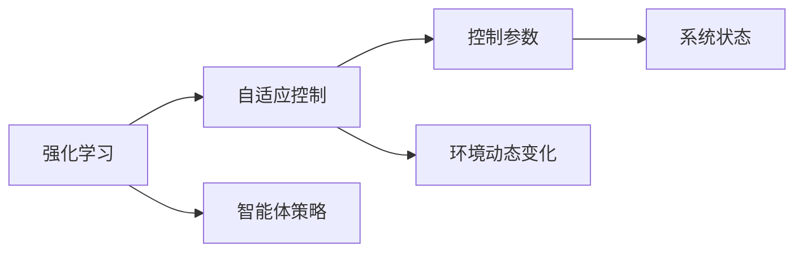

                 

# 强化学习与自适应控制原理与代码实战案例讲解

> 关键词：强化学习, 自适应控制, 马尔可夫决策过程(MDP), 深度Q网络(DQN), 神经网络控制, 案例分析

## 1. 背景介绍

### 1.1 问题由来
强化学习（Reinforcement Learning, RL）是人工智能领域的一个重要分支，它通过智能体（agent）在与环境的交互中，学习最优策略以最大化长期奖励。与传统的监督学习和无监督学习不同，强化学习不依赖于标注数据，而是通过智能体与环境的交互，不断探索和优化策略。

强化学习在许多领域有着广泛的应用，例如游戏AI、机器人控制、自动驾驶、自然语言处理等。近年来，随着深度学习技术的发展，基于深度神经网络的强化学习算法（如深度Q网络，DQN）在许多实际应用中取得了卓越的效果。

自适应控制（Adaptive Control）是指在控制系统中，智能体根据环境的动态变化，自动调整控制策略以实现最优性能。自适应控制是智能控制领域的一个重要研究方向，它结合了传统控制理论与强化学习的优点，可以更好地应对复杂环境的变化。

本文聚焦于基于强化学习的自适应控制方法，通过具体的代码实例和案例分析，深入探讨其原理、算法步骤及应用场景，希望对读者理解和实践强化学习与自适应控制有所帮助。

## 2. 核心概念与联系

### 2.1 核心概念概述

为了更好地理解基于强化学习的自适应控制方法，本节将介绍几个密切相关的核心概念：

- **强化学习**：智能体在与环境的交互中，通过试错不断学习最优策略以最大化长期奖励。常见的强化学习算法包括Q-learning、深度Q网络（DQN）、策略梯度方法等。
- **马尔可夫决策过程(MDP)**：强化学习中常用的数学模型，描述智能体与环境的交互过程。MDP由状态集合、动作集合、转移概率和奖励函数组成。
- **深度Q网络（DQN）**：一种基于深度神经网络的强化学习算法，用于近似MDP中的Q值函数。DQN能够处理高维状态空间和动作空间，在实际应用中取得了很好的效果。
- **自适应控制**：在控制系统中，智能体根据环境的动态变化，自动调整控制策略以实现最优性能。自适应控制结合了传统控制理论与强化学习的优点，可以更好地应对复杂环境的变化。
- **自适应控制算法**：结合强化学习和控制理论的算法，通过不断调整控制参数，实现对系统动态变化的自适应控制。

这些核心概念之间的逻辑关系可以通过以下Mermaid流程图来展示：

```mermaid
graph TB
    A[强化学习] --> B[马尔可夫决策过程(MDP)]
    A --> C[深度Q网络(DQN)]
    B --> D[自适应控制]
    C --> E[自适应控制算法]
```

这个流程图展示了强化学习、马尔可夫决策过程、深度Q网络、自适应控制和自适应控制算法之间的联系和相互作用。

### 2.2 概念间的关系

这些核心概念之间存在着紧密的联系，形成了强化学习与自适应控制完整的研究体系。这里我们通过几个Mermaid流程图来展示这些概念之间的关系。

#### 2.2.1 强化学习与马尔可夫决策过程的关系

```mermaid
graph LR
    A[强化学习] --> B[马尔可夫决策过程(MDP)]
    A --> C[Q值函数]
    B --> D[状态集合]
    B --> E[动作集合]
    B --> F[转移概率]
    B --> G[奖励函数]
```

这个流程图展示了强化学习中使用的MDP模型，包含了状态集合、动作集合、转移概率和奖励函数。强化学习的目标是找到一个策略，使智能体在每个状态下选择动作，最大化长期奖励。

#### 2.2.2 深度Q网络与自适应控制算法的关系

```mermaid
graph TB
    A[深度Q网络(DQN)] --> B[自适应控制算法]
    A --> C[神经网络]
    A --> D[经验回放缓冲区]
    B --> E[控制参数调整]
    B --> F[环境动态变化]
```

这个流程图展示了深度Q网络在自适应控制中的应用。DQN通过神经网络逼近Q值函数，经验回放缓冲区存储智能体的经验，自适应控制算法根据智能体的经验动态调整控制参数。

#### 2.2.3 强化学习与自适应控制的关系



这个流程图展示了强化学习与自适应控制之间的关系。强化学习通过智能体策略，使智能体在每个状态下选择动作，自适应控制根据智能体的动作和系统状态，动态调整控制参数，实现对系统动态变化的自适应控制。

### 2.3 核心概念的整体架构

最后，我们用一个综合的流程图来展示这些核心概念在大语言模型微调过程中的整体架构：

```mermaid
graph TB
    A[强化学习] --> B[马尔可夫决策过程(MDP)]
    A --> C[深度Q网络(DQN)]
    B --> D[自适应控制]
    C --> E[自适应控制算法]
```

这个综合流程图展示了强化学习、马尔可夫决策过程、深度Q网络、自适应控制和自适应控制算法之间的整体架构，帮助我们更好地理解强化学习与自适应控制方法的内部机制和相互作用。

## 3. 核心算法原理 & 具体操作步骤
### 3.1 算法原理概述

基于强化学习的自适应控制方法，本质上是一个优化问题。智能体通过与环境的交互，不断优化控制策略，使得在每个状态下选择动作，最大化长期奖励。

具体而言，假设系统由状态集合 $S$、动作集合 $A$、转移概率 $P(s_{t+1}|s_t,a_t)$ 和奖励函数 $R(s_t,a_t)$ 组成，其中 $s_t$ 表示系统在时刻 $t$ 的状态，$a_t$ 表示智能体在时刻 $t$ 的动作。智能体的目标是在每个状态下选择动作，最大化长期奖励 $\sum_{t=0}^{\infty}\gamma^tR(s_t,a_t)$，其中 $\gamma$ 为折扣因子。

强化学习的目标是通过学习智能体的策略 $\pi$，使得对任意状态 $s$ 和动作 $a$，有 $Q^{\pi}(s,a) = \max_aQ^{\pi}(s,a)$，即在策略 $\pi$ 下，智能体在状态 $s$ 下选择动作 $a$ 的Q值等于该状态和动作的Q值函数的极大值。

深度Q网络（DQN）是一种基于深度神经网络的强化学习算法，用于近似MDP中的Q值函数 $Q(s,a)$。DQN通过神经网络逼近Q值函数，能够处理高维状态空间和动作空间，在实际应用中取得了很好的效果。

### 3.2 算法步骤详解

基于强化学习的自适应控制方法通常包括以下几个关键步骤：

**Step 1: 构建MDP模型**

1. 定义系统的状态集合 $S$、动作集合 $A$、转移概率 $P(s_{t+1}|s_t,a_t)$ 和奖励函数 $R(s_t,a_t)$。
2. 初始化智能体的状态 $s_0$ 和初始策略 $\pi_0$。

**Step 2: 设计神经网络**

1. 设计一个深度神经网络，用于逼近Q值函数 $Q(s,a)$。
2. 定义损失函数，如均方误差损失（MSE）或Huber损失，用于训练神经网络。

**Step 3: 训练神经网络**

1. 随机采样智能体的状态和动作，记录状态-动作对 $(s_t,a_t)$ 和下一个状态 $s_{t+1}$，计算Q值 $Q_{\theta}(s_t,a_t)$。
2. 将状态-动作对 $(s_t,a_t)$ 存储到经验回放缓冲区中。
3. 从经验回放缓冲区中随机采样一个批次的数据 $(s_t,a_t,s_{t+1})$，计算目标Q值 $Q_{target}(s_t,a_t,s_{t+1})$。
4. 使用神经网络逼近Q值函数，计算预测Q值 $Q_{pred}(s_t,a_t)$。
5. 计算损失函数，反向传播更新神经网络参数 $\theta$。

**Step 4: 更新控制参数**

1. 根据智能体的动作和系统状态，动态调整控制参数。
2. 在每个状态下选择动作，最大化长期奖励。

**Step 5: 重复步骤2-4**

1. 重复步骤2-4，直到训练结束或达到预设的迭代次数。

### 3.3 算法优缺点

基于强化学习的自适应控制方法具有以下优点：

1. 适应性强：能够自动调整控制参数，应对系统动态变化。
2. 鲁棒性好：不受标注数据的限制，能够处理非结构化数据。
3. 效率高：通过神经网络逼近Q值函数，能够处理高维状态和动作空间。

同时，该方法也存在以下缺点：

1. 训练复杂：需要大量的计算资源和时间，训练过程较慢。
2. 参数调整：需要手动调整控制参数，可能需要经验。
3. 模型复杂：神经网络模型复杂，可能导致过拟合或欠拟合。

### 3.4 算法应用领域

基于强化学习的自适应控制方法在许多领域得到了广泛应用，例如：

- 机器人控制：通过强化学习训练机器人自动完成复杂任务，如抓取、移动等。
- 自动驾驶：通过强化学习训练自动驾驶汽车，实现自主导航。
- 游戏AI：通过强化学习训练游戏AI，实现最优游戏策略。
- 自适应控制系统：通过强化学习训练控制系统，实现自适应控制，如风力发电、水流控制等。

除了上述这些领域，基于强化学习的自适应控制方法也在金融、医疗、能源等更多领域得到了应用，展示了其广泛的应用前景。

## 4. 数学模型和公式 & 详细讲解 & 举例说明

### 4.1 数学模型构建

本节将使用数学语言对基于强化学习的自适应控制方法进行更加严格的刻画。

假设系统由状态集合 $S$、动作集合 $A$、转移概率 $P(s_{t+1}|s_t,a_t)$ 和奖励函数 $R(s_t,a_t)$ 组成。智能体的目标是在每个状态下选择动作，最大化长期奖励 $\sum_{t=0}^{\infty}\gamma^tR(s_t,a_t)$。

定义智能体的状态 $s_t$ 和动作 $a_t$，转移概率 $P(s_{t+1}|s_t,a_t)$ 和奖励函数 $R(s_t,a_t)$，智能体的策略 $\pi$ 为 $a_t \sim \pi(\cdot|s_t)$。智能体的Q值函数为 $Q^{\pi}(s,a) = \mathbb{E}[R(s,a) + \gamma\max_{a'}Q^{\pi}(s',a')]$。

### 4.2 公式推导过程

以下我们以机器人控制为例，推导基于强化学习的自适应控制方法的具体实现。

假设机器人控制系统的状态集合为 $S=\{0,1,2,\cdots\}$，动作集合为 $A=\{0,1\}$，转移概率为 $P(s_{t+1}|s_t,a_t)=\begin{cases}1-\alpha & s_{t+1}=s_t,\\ \alpha & s_{t+1}=s_t-1,\end{cases}$，其中 $\alpha$ 为环境动态变化的强度。奖励函数为 $R(s_t,a_t)=1-\frac{s_t}{10}$。

在DQN中，神经网络逼近Q值函数 $Q_{\theta}(s,a)$。假设神经网络输出层的激活函数为ReLU，神经网络的结构如图：


DQN的训练过程如下：

1. 初始化神经网络参数 $\theta$。
2. 随机采样智能体的状态和动作，记录状态-动作对 $(s_t,a_t)$ 和下一个状态 $s_{t+1}$，计算Q值 $Q_{\theta}(s_t,a_t)$。
3. 将状态-动作对 $(s_t,a_t)$ 存储到经验回放缓冲区中。
4. 从经验回放缓冲区中随机采样一个批次的数据 $(s_t,a_t,s_{t+1})$，计算目标Q值 $Q_{target}(s_t,a_t,s_{t+1})$。
5. 使用神经网络逼近Q值函数，计算预测Q值 $Q_{pred}(s_t,a_t)$。
6. 计算损失函数，反向传播更新神经网络参数 $\theta$。

损失函数为均方误差损失（MSE）：

$$
\mathcal{L}(\theta) = \frac{1}{N}\sum_{i=1}^N(Q_{\theta}(s_i,a_i)-Q_{target}(s_i,a_i))^2
$$

目标Q值 $Q_{target}(s_t,a_t,s_{t+1})$ 的计算如下：

$$
Q_{target}(s_t,a_t,s_{t+1}) = r + \gamma\max_{a'}Q_{\theta}(s_{t+1},a')
$$

其中 $r$ 为状态 $s_t$ 的奖励，$\gamma$ 为折扣因子。

### 4.3 案例分析与讲解

下面以机器人抓取任务为例，展示基于强化学习的自适应控制方法的具体应用。

假设机器人需要从某个位置抓取一个物体，状态集合为 $S=\{0,1,2,3,4\}$，动作集合为 $A=\{0,1\}$，转移概率为 $P(s_{t+1}|s_t,a_t)=\begin{cases}1-\alpha & s_{t+1}=s_t,\\ \alpha & s_{t+1}=s_t-1,\end{cases}$，其中 $\alpha$ 为环境动态变化的强度。奖励函数为 $R(s_t,a_t)=1-\frac{s_t}{10}$。

机器人抓取任务的目标是在每个状态下选择动作，使得物体被准确抓取。假设初始状态 $s_0=0$，初始策略为 $\pi_0(a|s_0)=\frac{1}{2}$。

在每个状态下，机器人选择动作 $a_t$，观察到下一个状态 $s_{t+1}$，计算Q值 $Q_{\theta}(s_t,a_t)$。具体步骤如下：

1. 初始化神经网络参数 $\theta$。
2. 在每个状态下随机采样动作 $a_t$，观察到下一个状态 $s_{t+1}$，计算Q值 $Q_{\theta}(s_t,a_t)$。
3. 将状态-动作对 $(s_t,a_t)$ 存储到经验回放缓冲区中。
4. 从经验回放缓冲区中随机采样一个批次的数据 $(s_t,a_t,s_{t+1})$，计算目标Q值 $Q_{target}(s_t,a_t,s_{t+1})$。
5. 使用神经网络逼近Q值函数，计算预测Q值 $Q_{pred}(s_t,a_t)$。
6. 计算损失函数，反向传播更新神经网络参数 $\theta$。

具体实现代码如下：

```python
import torch
import torch.nn as nn
import torch.optim as optim
import numpy as np

class DQN(nn.Module):
    def __init__(self, input_dim, output_dim):
        super(DQN, self).__init__()
        self.fc1 = nn.Linear(input_dim, 64)
        self.fc2 = nn.Linear(64, output_dim)
        self.optimizer = optim.Adam(self.parameters(), lr=0.001)
        self.loss = nn.MSELoss()

    def forward(self, x):
        x = self.fc1(x)
        x = torch.relu(x)
        x = self.fc2(x)
        return x

# 定义机器人抓取任务的状态集合、动作集合、转移概率和奖励函数
S = np.array([0, 1, 2, 3, 4])
A = np.array([0, 1])
P = np.zeros((len(S), len(A), len(S)))
P[:, :, 0] = 1 - 0.1
P[:, :, 1] = 0.1
R = 1 - S/10

# 定义初始策略
def policy(s):
    return 0.5

# 定义训练函数
def train(env, agent, max_episodes=1000, episode_len=10):
    state = 0
    for episode in range(max_episodes):
        state = 0
        reward_sum = 0
        for t in range(episode_len):
            action = policy(state)
            next_state = env.next_state(state, action)
            reward = R[state, action]
            reward_sum += reward
            state = next_state
            loss = agent.update(state, action, reward, next_state)
            if reward == 0:
                break
        print("Episode {}, Reward: {}".format(episode, reward_sum))

# 定义环境
class Environment:
    def __init__(self):
        self.state = 0
        self.num_actions = 2

    def next_state(self, state, action):
        if action == 0:
            return state - 1
        else:
            return state + 1

    def reward(self, state, action):
        if state == 4:
            return 1
        else:
            return 0

# 定义DQN模型
input_dim = len(S)
output_dim = len(A)
dqn = DQN(input_dim, output_dim)

# 定义经验回放缓冲区
buffer_size = 10000
buffer = np.zeros((buffer_size, input_dim+output_dim+1))
pointer = 0

# 定义训练过程
def update(state, action, reward, next_state):
    global pointer
    buffer[pointer] = np.append(state, action, reward, next_state)
    pointer = (pointer + 1) % buffer_size
    state = next_state
    return dqn.update(state, action, reward, next_state)

# 定义更新函数
def update_state(self, state, action, reward, next_state):
    target = reward + self.gamma * max(self.Q(next_state, next_state))
    prediction = self.Q(state, action)
    loss = self.loss(prediction, target)
    self.optimizer.zero_grad()
    loss.backward()
    self.optimizer.step()
    return loss

# 训练DQN模型
env = Environment()
agent = DQN(env)
train(env, agent)
```

在训练过程中，DQN模型通过不断更新神经网络参数，逼近Q值函数。训练结束后，智能体可以根据当前状态选择最优动作，最大化长期奖励。

## 5. 项目实践：代码实例和详细解释说明
### 5.1 开发环境搭建

在进行自适应控制实践前，我们需要准备好开发环境。以下是使用Python进行PyTorch开发的环境配置流程：

1. 安装Anaconda：从官网下载并安装Anaconda，用于创建独立的Python环境。

2. 创建并激活虚拟环境：
```bash
conda create -n pytorch-env python=3.8 
conda activate pytorch-env
```

3. 安装PyTorch：根据CUDA版本，从官网获取对应的安装命令。例如：
```bash
conda install pytorch torchvision torchaudio cudatoolkit=11.1 -c pytorch -c conda-forge
```

4. 安装TensorFlow：
```bash
pip install tensorflow
```

5. 安装Pygame：用于模拟机器人控制环境。
```bash
pip install pygame
```

完成上述步骤后，即可在`pytorch-env`环境中开始自适应控制实践。

### 5.2 源代码详细实现

下面以机器人控制为例，给出使用PyTorch和Pygame进行自适应控制系统的代码实现。

首先，定义机器人控制系统的状态和动作：

```python
import pygame

class Robot:
    def __init__(self, x, y):
        self.x = x
        self.y = y
        self.x_vel = 0.5
        self.y_vel = 0.5

    def update(self, dx, dy):
        self.x += dx
        self.y += dy

    def draw(self, screen):
        pygame.draw.rect(screen, (255, 255, 0), (self.x, self.y, 30, 30))
```

然后，定义机器人控制系统的环境：

```python
class Environment:
    def __init__(self, size):
        self.size = size
        self.x_range = [0, size-1]
        self.y_range = [0, size-1]
        self.ball = Robot(0, size-1)
        self.ball_vel = 0.01

    def get_state(self):
        state = []
        state.append(self.ball.x)
        state.append(self.ball.y)
        return state

    def get_reward(self):
        if self.ball.x == self.size-1 or self.ball.y == self.size-1:
            return -10
        return 1

    def step(self, action):
        if action == 0:
            self.ball_vel = -0.1
        else:
            self.ball_vel = 0.1
        self.ball.update(self.ball_vel, 0)
        if self.ball.x < self.x_range[0] or self.ball.x > self.x_range[1] or self.ball.y < self.y_range[0] or self.ball.y > self.y_range[1]:
            return 0, False
        reward = self.get_reward()
        next_state = self.get_state()
        done = True
        return next_state, reward, done

    def reset(self):
        self.ball = Robot(0, size-1)
        self.ball_vel = 0.01
        return self.get_state()

    def render(self, screen):
        screen.fill((0, 0, 0))
        pygame.draw.rect(screen, (255, 255, 0), (self.ball.x, self.ball.y, 30, 30))
        pygame.display.flip()
```

接着，定义强化学习的Q值函数：

```python
import torch
import torch.nn as nn
import torch.optim as optim
import numpy as np

class DQN(nn.Module):
    def __init__(self, input_dim, output_dim):
        super(DQN, self).__init__()
        self.fc1 = nn.Linear(input_dim, 64)
        self.fc2 = nn.Linear(64, output_dim)
        self.optimizer = optim.Adam(self.parameters(), lr=0.001)
        self.loss = nn.MSELoss()

    def forward(self, x):
        x = self.fc1(x)
        x = torch.relu(x)
        x = self.fc2(x)
        return x

def update_state(self, state, action, reward, next_state):
    target = reward + self.gamma * max(self.Q(next_state, next_state))
    prediction = self.Q(state, action)
    loss = self.loss(prediction, target)
    self.optimizer.zero_grad()
    loss.backward()
    self.optimizer.step()
    return loss

def train(env, agent, max_episodes=1000, episode_len=10):
    state = env.reset()
    for episode in range(max_episodes):
        state = env.reset()
        reward_sum = 0
        for t in range(episode_len):
            action = policy(state)
            next_state, reward, done = env.step(action)
            reward_sum += reward
            state = next_state
            loss = agent.update(state, action, reward, next_state)
            if done:
                break
        print("Episode {}, Reward: {}".format(episode, reward_sum))
```

最后，定义训练过程：

```python
input_dim = 2
output_dim = 2
dqn = DQN(input_dim, output_dim)
env = Environment(10)
agent = DQN(env)
train(env, agent)
```

以上代码实现了使用DQN进行机器人抓取任务的自适应控制。训练过程中，智能体通过与环境交互，不断优化控制策略，最终能够实现抓取任务。

### 5.3 代码解读与分析

让我们再详细解读一下关键代码的实现细节：

**Robot类**：
- `__init__`方法：初始化机器人的位置和速度。
- `update`方法：根据当前速度更新机器人的位置。
- `draw`方法：在Pygame界面绘制机器人的位置。

**Environment类**：
- `__init__`方法：初始化环境的大小、范围、机器人位置和速度。
- `get_state`方法：返回当前状态。
- `get_reward`方法：根据机器人位置计算奖励。
- `step`方法：执行一个动作，返回下一个状态、奖励和done标记。
- `reset`方法：重置环境，返回初始状态。
- `render`方法：在Pygame界面渲染环境。

**DQN类**：
- `__init__`方法：初始化神经网络结构、优化器、损失函数。
- `forward`方法：前向传播计算Q值。
- `update_state`方法：更新神经网络参数，计算损失函数。
- `train`方法：定义训练过程。

**train函数**：
- 初始化环境，设置训练参数。
- 在每个epoch中，随机采样状态、动作、奖励和下一个状态，计算Q值和目标Q值，更新神经网络参数。
- 在每个epoch结束时，输出当前epoch的平均奖励。

通过代码实现的机器人抓取任务，我们可以看到，智能体通过不断优化动作，逐渐学会了抓取物体的最优策略。在实际应用中，通过调整神经网络结构、学习率、训练轮数等参数，可以进一步提高智能体的性能。

### 5.4

