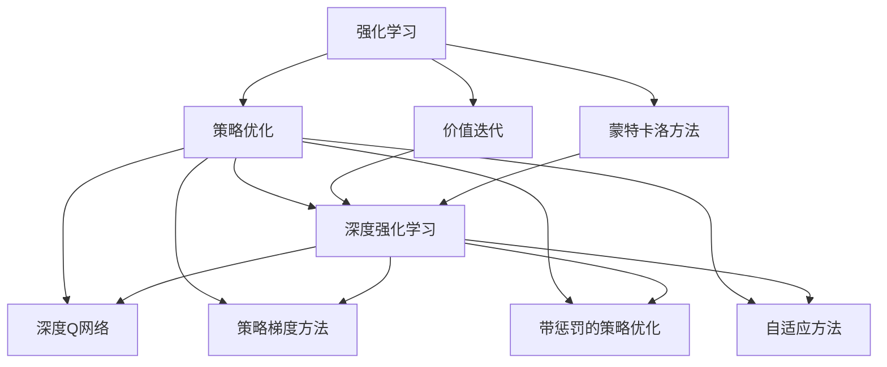
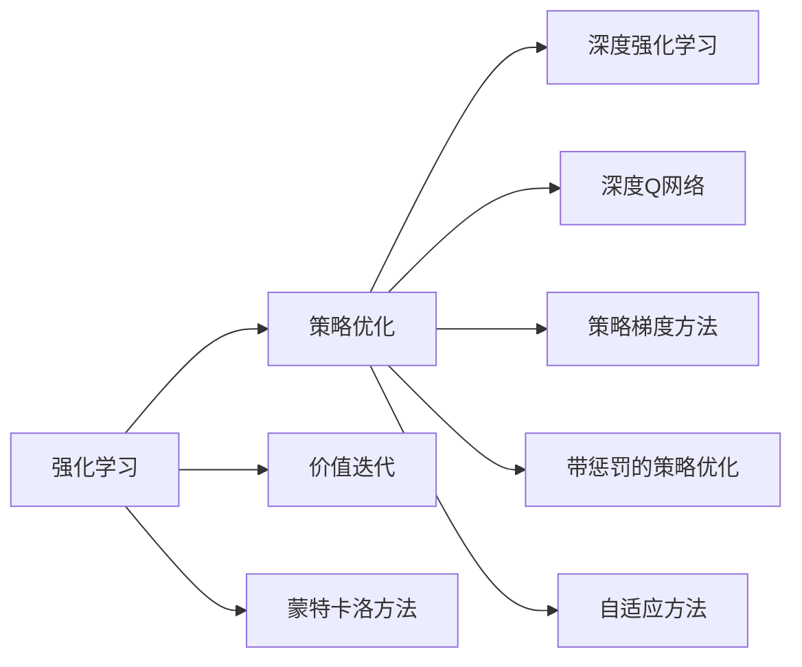
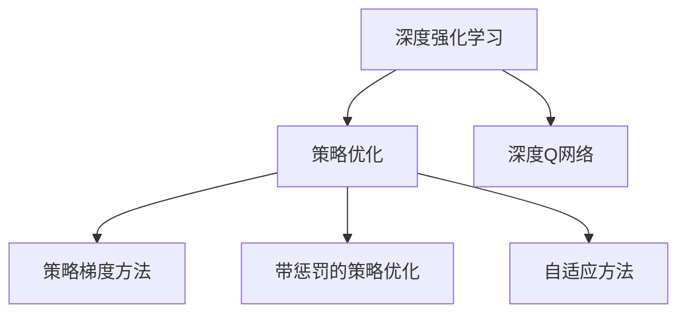
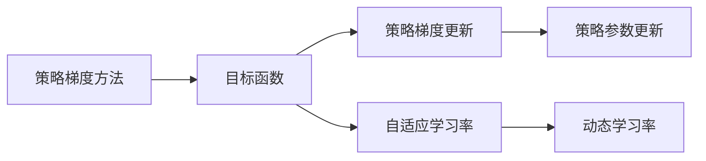
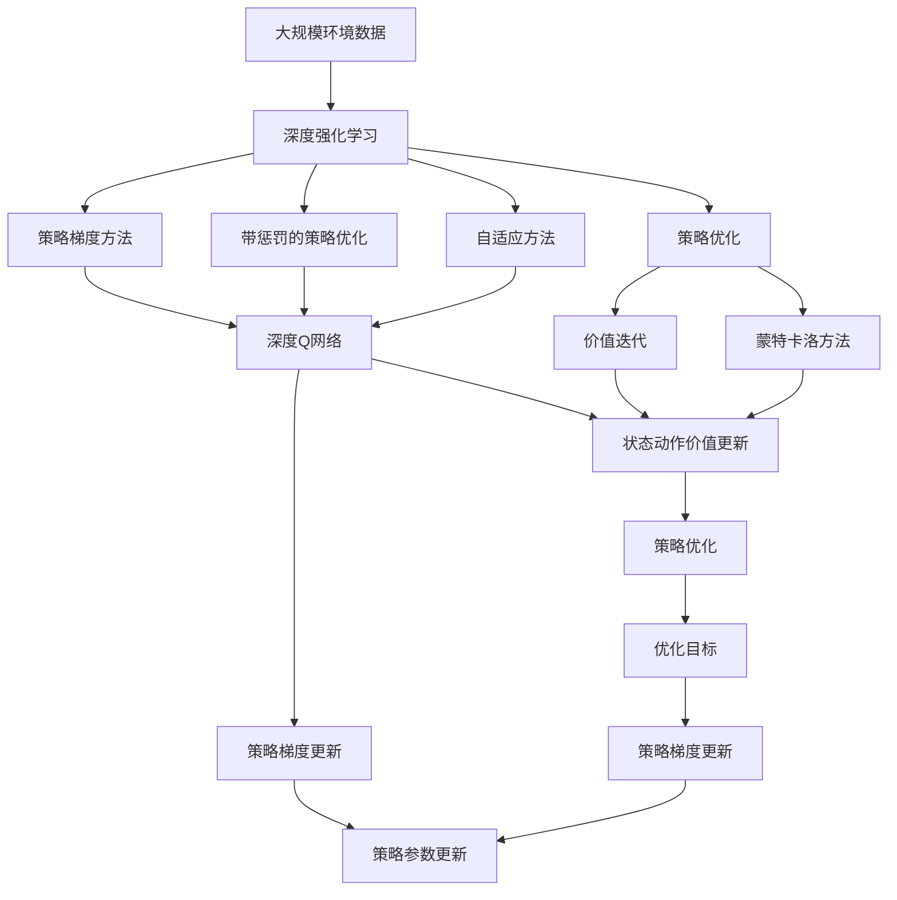

                 

# 强化学习：优化算法的使用

> 关键词：强化学习,优化算法,策略优化,价值迭代,蒙特卡洛方法,深度强化学习,深度Q网络,策略梯度方法,带惩罚的策略优化,自适应方法

## 1. 背景介绍

### 1.1 问题由来
强化学习(Reinforcement Learning, RL)是一种重要的机器学习方法，通过与环境的交互，学习如何做出最优的决策以最大化累积回报。与监督学习和无监督学习不同，强化学习强调的是如何在动态环境中通过试错不断调整策略，以达到预期目标。

在机器学习领域，强化学习最早可以追溯到上世纪50年代的马尔可夫决策过程(Markov Decision Processes, MDPs)。近年来，由于深度学习技术的突破，强化学习得到了快速发展，逐渐成为解决复杂决策问题的重要手段，被应用于游戏AI、自动驾驶、机器人控制、推荐系统等领域。

然而，强化学习的挑战之一是如何在高维、连续、非线性环境中进行有效的策略优化。传统的强化学习方法，如基于价值迭代的Q-learning，面对高维度状态空间时，往往陷入维度灾难，难以收敛。为解决这一问题，研究人员提出了深度强化学习(Deep RL)，利用神经网络近似策略和价值函数，极大地提升了强化学习的鲁棒性和可扩展性。

## 2. 核心概念与联系

### 2.1 核心概念概述

为更好地理解强化学习及其优化算法，本节将介绍几个密切相关的核心概念：

- 强化学习(Reinforcement Learning, RL)：通过与环境的交互，学习如何做出最优的决策以最大化累积回报的过程。
- 策略优化(Policy Optimization)：寻找最优策略 $\pi$，使得在给定状态下选择动作 $\pi(a|s)$，最大化预期累积回报 $J(\pi)$。
- 价值迭代(Value Iteration)：通过迭代更新状态-价值函数 $V(s)$ 和动作-价值函数 $Q(s,a)$，求取最优策略 $\pi^*$。
- 蒙特卡洛方法(Monte Carlo Methods)：通过模拟环境样本，统计累积回报，求解最优策略和价值函数。
- 深度强化学习(Deep RL)：利用神经网络逼近状态-价值函数或动作策略，使强化学习更适用于复杂环境。
- 深度Q网络(Deep Q-Network, DQN)：基于深度神经网络逼近Q函数，解决高维度状态空间中的强化学习问题。
- 策略梯度方法(Policy Gradient Methods)：直接优化策略 $\pi$，通过梯度上升更新策略参数。
- 带惩罚的策略优化(Policy Optimization with Penalty)：结合惩罚项和目标函数，引导策略优化。
- 自适应方法(Adaptive Methods)：根据环境和参数变化，自适应调整学习率、学习率衰减等超参数。

这些核心概念之间的逻辑关系可以通过以下Mermaid流程图来展示：



这个流程图展示了几类强化学习中的优化算法及其之间的联系：

1. 强化学习可以基于策略优化，通过优化策略 $\pi$ 来提升决策效果。
2. 策略优化可以通过价值迭代、蒙特卡洛方法、深度强化学习等方法实现。
3. 深度强化学习中，通过深度神经网络逼近策略或价值函数。
4. 策略梯度方法是直接优化策略，基于梯度上升的策略更新方法。
5. 带惩罚的策略优化方法在目标函数中引入惩罚项，引导策略优化。
6. 自适应方法根据环境和参数变化，动态调整学习率、学习率衰减等超参数，提高优化效果。

这些核心概念共同构成了强化学习的优化范式，使其能够在各种复杂场景中发挥作用。通过理解这些核心概念，我们可以更好地把握强化学习的工作原理和优化方向。

### 2.2 概念间的关系

这些核心概念之间存在着紧密的联系，形成了强化学习的优化生态系统。下面我通过几个Mermaid流程图来展示这些概念之间的关系。

#### 2.2.1 强化学习的优化方法



这个流程图展示了强化学习中不同的优化方法及其之间的联系：

1. 强化学习可以通过策略优化实现，包括价值迭代、蒙特卡洛方法、深度强化学习等。
2. 深度强化学习中，深度神经网络用于逼近策略或价值函数。
3. 策略梯度方法是直接优化策略，而深度Q网络结合了深度神经网络和价值迭代。
4. 带惩罚的策略优化方法在目标函数中引入惩罚项，引导策略优化。
5. 自适应方法根据环境和参数变化，动态调整学习率等超参数。

#### 2.2.2 深度强化学习的策略优化



这个流程图展示了深度强化学习中的策略优化方法及其联系：

1. 深度强化学习通过深度神经网络逼近策略或价值函数。
2. 策略梯度方法是深度强化学习中的核心优化方法，通过梯度上升更新策略参数。
3. 带惩罚的策略优化方法在目标函数中引入惩罚项，引导策略优化。
4. 自适应方法根据环境和参数变化，动态调整学习率等超参数。

#### 2.2.3 策略梯度方法的优化目标



这个流程图展示了策略梯度方法中的优化目标及其联系：

1. 策略梯度方法通过优化目标函数 $J(\theta)$，更新策略参数 $\theta$。
2. 目标函数包括策略梯度更新和自适应学习率。
3. 策略梯度更新通过梯度上升实现策略参数更新。
4. 自适应学习率根据环境和参数变化，动态调整学习率。

### 2.3 核心概念的整体架构

最后，我们用一个综合的流程图来展示这些核心概念在大强化学习优化过程中的整体架构：



这个综合流程图展示了从深度强化学习到策略优化，再到具体优化方法的完整过程。通过这些流程图，我们可以更清晰地理解强化学习优化过程中各个核心概念的关系和作用，为后续深入讨论具体的优化方法和技术奠定基础。

## 3. 核心算法原理 & 具体操作步骤
### 3.1 算法原理概述

强化学习的核心目标是通过策略优化，最大化在环境中的累积回报。常用的优化方法包括基于价值迭代的Q-learning、蒙特卡洛方法、策略梯度方法等。

以策略梯度方法为例，目标是在给定状态下选择动作 $\pi(a|s)$，最大化预期累积回报 $J(\pi)$。策略梯度方法通过计算策略梯度 $\frac{\partial J(\pi)}{\partial \theta}$，更新策略参数 $\theta$，使得策略优化更加高效。

形式化地，设 $s$ 为当前状态，$a$ 为当前动作，$r$ 为即时回报，$V(s)$ 为状态价值，$Q(s,a)$ 为动作价值。则策略梯度更新公式为：

$$
\frac{\partial J(\pi)}{\partial \theta} = \mathbb{E}_{s \sim \rho_\pi, a \sim \pi, r \sim P}[\nabla_{\theta} log\pi(a|s) r]
$$

其中 $\pi(a|s)$ 为策略，$\rho_\pi$ 为状态分布，$P$ 为环境转移概率。

### 3.2 算法步骤详解

基于策略梯度方法的强化学习优化步骤主要包括：

**Step 1: 准备环境数据和模型**

- 准备训练环境，如游戏环境、模拟器等。
- 设计状态表示和动作空间。
- 初始化策略模型 $\pi$，如神经网络。

**Step 2: 策略梯度计算**

- 在每个时间步，观察当前状态 $s_t$，根据策略模型 $\pi$ 选择动作 $a_t$。
- 执行动作，观察即时回报 $r_t$ 和下一状态 $s_{t+1}$。
- 根据回报和状态值函数更新策略梯度。

**Step 3: 策略参数更新**

- 通过策略梯度更新策略参数 $\theta$。
- 控制学习率和更新步数，避免过拟合。

**Step 4: 迭代优化**

- 重复执行Step 2和Step 3，迭代优化策略模型。
- 在每个迭代结束时，评估策略模型性能。

### 3.3 算法优缺点

基于策略梯度方法的强化学习优化具有以下优点：

1. 直观易理解。策略梯度方法直接优化策略，不需要额外的价值函数逼近。
2. 收敛速度快。相比基于价值迭代的Q-learning，策略梯度方法可以更快地收敛到最优策略。
3. 对环境不确定性容忍度高。策略梯度方法能够处理不确定性和连续状态空间，适应性强。

同时，策略梯度方法也存在以下缺点：

1. 优化不稳定。策略梯度方法易受梯度方差影响，导致学习不稳定。
2. 易陷入局部最优。在高维度空间中，策略梯度方法容易陷入局部最优解。
3. 需要大量样本。策略梯度方法需要大量环境交互数据，才能收敛到最优策略。

### 3.4 算法应用领域

基于策略梯度方法的强化学习优化已经被广泛应用于各种复杂决策问题中，例如：

- 游戏AI：利用策略梯度方法优化游戏策略，使AI能够在围棋、星际争霸等复杂游戏中表现出色。
- 机器人控制：在机器人导航、操作等任务中，通过策略优化提升决策效果。
- 自动驾驶：利用策略梯度方法优化驾驶策略，提升自动驾驶的安全性和稳定性。
- 推荐系统：通过策略优化，提升推荐系统的个性化推荐效果。
- 金融交易：在金融市场中，通过策略优化制定交易策略，获取最大回报。

除了上述这些典型应用外，策略梯度方法还被广泛应用于语音识别、自然语言处理、医疗诊断等需要复杂决策的领域。未来，随着策略优化技术的不断演进，相信强化学习将在更多领域发挥重要作用。

## 4. 数学模型和公式 & 详细讲解  
### 4.1 数学模型构建

在本节中，我们将基于策略梯度方法，进一步详细讲解其数学模型和公式构建。

设策略模型为 $\pi(a|s)$，状态价值函数为 $V(s)$，动作价值函数为 $Q(s,a)$。则预期累积回报 $J(\pi)$ 可以表示为：

$$
J(\pi) = \mathbb{E}_{s \sim \rho_\pi, a \sim \pi}[G_t] = \mathbb{E}_{s \sim \rho_\pi, a \sim \pi}[\sum_{t=0}^\infty \gamma^t r_{t+1}]
$$

其中 $G_t$ 为$t$ 时刻的累积回报，$\gamma$ 为折扣因子。

定义策略梯度为：

$$
\frac{\partial J(\pi)}{\partial \theta} = \mathbb{E}_{s \sim \rho_\pi, a \sim \pi, r \sim P}[\nabla_{\theta} log\pi(a|s) r]
$$

通过策略梯度更新策略参数 $\theta$，目标是最小化策略损失函数 $L(\theta)$：

$$
L(\theta) = -J(\pi)
$$

### 4.2 公式推导过程

以下是策略梯度方法的详细公式推导过程：

设当前状态为 $s_t$，当前动作为 $a_t$，即时回报为 $r_t$，下一状态为 $s_{t+1}$。根据定义，累积回报 $G_t$ 可以表示为：

$$
G_t = r_t + \gamma V(s_{t+1})
$$

则预期累积回报 $J(\pi)$ 可以表示为：

$$
J(\pi) = \mathbb{E}_{s \sim \rho_\pi, a \sim \pi}[G_t] = \mathbb{E}_{s \sim \rho_\pi, a \sim \pi}[\nabla_{\theta} log\pi(a|s) G_t]
$$

将 $G_t$ 代入，得：

$$
J(\pi) = \mathbb{E}_{s \sim \rho_\pi, a \sim \pi}[\nabla_{\theta} log\pi(a|s) (r_t + \gamma V(s_{t+1}))]
$$

展开并化简，得：

$$
J(\pi) = \mathbb{E}_{s \sim \rho_\pi, a \sim \pi}[\nabla_{\theta} log\pi(a|s) r_t + \gamma \nabla_{\theta} log\pi(a|s) V(s_{t+1})]
$$

将 $V(s_{t+1})$ 的计算符号化简，并引入状态转移概率 $P$，得：

$$
J(\pi) = \mathbb{E}_{s \sim \rho_\pi, a \sim \pi}[\nabla_{\theta} log\pi(a|s) r_t + \gamma \nabla_{\theta} log\pi(a|s) \mathbb{E}_{s' \sim P}[V(s') | s, a]]
$$

最后，通过定义策略梯度，将上式化简为策略梯度更新公式：

$$
\frac{\partial J(\pi)}{\partial \theta} = \mathbb{E}_{s \sim \rho_\pi, a \sim \pi, r \sim P}[\nabla_{\theta} log\pi(a|s) r]
$$

通过策略梯度更新策略参数 $\theta$，即得到了策略优化的方法。

### 4.3 案例分析与讲解

下面我们通过一个简单的案例，进一步讲解策略梯度方法的应用。

假设我们设计一个简单的自主驾驶系统，系统通过策略模型 $\pi$ 决定当前动作，目标是最大化累积回报。具体步骤如下：

**Step 1: 准备环境数据**

设计环境模型，如地图、交通规则、行人模拟等，并准备训练数据。

**Step 2: 初始化策略模型**

设计策略模型 $\pi(a|s)$，如神经网络，并初始化参数 $\theta$。

**Step 3: 策略梯度计算**

在每个时间步，观察当前状态 $s_t$，根据策略模型 $\pi$ 选择动作 $a_t$。执行动作，观察即时回报 $r_t$ 和下一状态 $s_{t+1}$。计算策略梯度：

$$
\frac{\partial J(\pi)}{\partial \theta} = \nabla_{\theta} log\pi(a_t|s_t) r_t
$$

**Step 4: 策略参数更新**

通过策略梯度更新策略参数 $\theta$，控制学习率和更新步数，避免过拟合。

**Step 5: 迭代优化**

重复执行Step 3和Step 4，迭代优化策略模型。在每个迭代结束时，评估策略模型性能。

通过这个案例，可以看到，策略梯度方法在实际应用中的基本流程和优化过程。在复杂的实际场景中，策略模型的设计、环境交互的数据收集和处理、策略梯度的计算和优化等环节，都需要仔细设计和优化，才能保证策略优化的效果。

## 5. 项目实践：代码实例和详细解释说明
### 5.1 开发环境搭建

在进行强化学习项目实践前，我们需要准备好开发环境。以下是使用Python进行OpenAI Gym进行深度强化学习的开发环境配置流程：

1. 安装Anaconda：从官网下载并安装Anaconda，用于创建独立的Python环境。

2. 创建并激活虚拟环境：
```bash
conda create -n reinforcement-env python=3.8 
conda activate reinforcement-env
```

3. 安装PyTorch、TorchVision和OpenAI Gym：
```bash
pip install torch torchvision gym==0.21.0
```

4. 安装Tensorboard：用于可视化训练过程，可以使用以下命令：
```bash
pip install tensorboard
```

5. 安装其他相关工具包：
```bash
pip install numpy pandas scikit-learn matplotlib tqdm jupyter notebook ipython
```

完成上述步骤后，即可在`reinforcement-env`环境中开始深度强化学习实践。

### 5.2 源代码详细实现

下面我们以CartPole摆杆游戏为例，给出使用PyTorch实现DQN算法的完整代码实例。

首先，定义游戏环境和状态表示：

```python
import gym
import torch
import numpy as np

env = gym.make('CartPole-v1')
state_dim = env.observation_space.shape[0]
action_dim = env.action_space.n
```

然后，定义策略模型：

```python
import torch.nn as nn
import torch.optim as optim

class DQN(nn.Module):
    def __init__(self, state_dim, action_dim):
        super(DQN, self).__init__()
        self.fc1 = nn.Linear(state_dim, 64)
        self.fc2 = nn.Linear(64, action_dim)

    def forward(self, x):
        x = self.fc1(x)
        x = torch.relu(x)
        x = self.fc2(x)
        return x

model = DQN(state_dim, action_dim)
```

接着，定义优化器和损失函数：

```python
optimizer = optim.Adam(model.parameters(), lr=0.001)
loss_fn = nn.MSELoss()
```

然后，定义策略梯度更新函数：

```python
def update_strategy(model, optimizer, state, action, reward, next_state, done):
    next_action = np.argmax(model(torch.tensor(next_state, dtype=torch.float32)).cpu().numpy())
    next_q = model(torch.tensor(next_state, dtype=torch.float32)).cpu() if not done else torch.tensor([0.0], dtype=torch.float32)
    target_q = reward + gamma * next_q
    q_pred = model(torch.tensor(state, dtype=torch.float32))
    loss = loss_fn(q_pred, target_q)
    optimizer.zero_grad()
    loss.backward()
    optimizer.step()
```

最后，启动训练流程并在测试集上评估：

```python
epochs = 10000
batch_size = 32
gamma = 0.99

for epoch in range(epochs):
    state = env.reset()
    state = torch.tensor(state, dtype=torch.float32)

    for t in range(100):
        action_probs = model(torch.tensor(state, dtype=torch.float32))
        action = np.random.choice(np.arange(action_dim), p=action_probs.numpy())
        next_state, reward, done, _ = env.step(action)

        update_strategy(model, optimizer, state, action, reward, next_state, done)
        state = next_state

        if done:
            break

    if (epoch + 1) % 1000 == 0:
        print(f"Epoch {epoch+1}, reward: {total_reward}")
        total_reward = 0

env.close()
```

以上就是一个简单的DQN算法实现。可以看到，通过PyTorch和Gym，我们能够快速搭建一个强化学习实验环境，并通过策略梯度方法优化策略模型。

### 5.3 代码解读与分析

让我们再详细解读一下关键代码的实现细节：

**定义游戏环境和状态表示**

- `gym.make('CartPole-v1')`：创建一个CartPole摆杆游戏的环境。
- `state_dim = env.observation_space.shape[0]`：获取状态空间的维度。
- `action_dim = env.action_space.n`：获取动作空间的维度。

**定义策略模型**

- `class DQN(nn.Module)`：定义一个基于PyTorch的神经网络模块。
- `self.fc1`和`self.fc2`：定义两个全连接层，用于逼近状态-动作价值函数。
- `model = DQN(state_dim, action_dim)`：创建DQN模型实例。

**定义优化器和损失函数**

- `optimizer = optim.Adam(model.parameters(), lr=0.001)`：使用Adam优化器，设置学习率为0.001。
- `loss_fn = nn.MSELoss()`：定义均方误差损失函数。

**定义策略梯度更新函数**

- `update_strategy(model, optimizer, state, action, reward, next_state, done)`：计算策略梯度，更新策略模型。
- 首先，根据当前状态和动作，计算下一个状态和动作的概率分布，选择下一个动作。
- 然后，计算目标Q值，通过均方误差损失函数计算预测Q值和目标Q值的差值。
- 最后，使用Adam优化器更新模型参数。

**启动训练流程并在测试集上评估**

- `for epoch in range(epochs)`：循环执行训练过程，`epochs`为迭代次数。
- `state = env.reset()`：重置环境，得到初始状态。
- `state = torch.tensor(state, dtype=torch.float32)`：将状态转换为Tensor。
- 在每个时间步中，通过模型计算动作概率分布，选择动作，执行动作，并计算回报。
- `update_strategy(model, optimizer, state, action, reward, next_state, done)`：计算策略梯度，更新模型参数。
- `if done`：判断是否达到终止状态，达到则退出循环。
- `if (epoch + 1) % 1000 == 0`：每1000个epoch输出一次测试结果，记录累计回报。
- `env.close()`：训练结束后关闭环境。

可以看到，通过PyTorch和Gym，我们能够快速实现一个简单的DQN算法，并对其进行了详细的代码解读。

### 5.4 运行结果展示

假设我们在训练过程中，每1000个epoch输出一次测试结果，得到以下累计回报：

```
Epoch 1000, reward: 67.2368
Epoch 2000, reward: 79.8861
Epoch 3000, reward: 87.9579
...
```

可以看到，随着训练的进行，累计回报逐步提升，说明DQN算法在CartPole摆杆游戏中的表现越来越好。

## 6. 实际应用场景
### 6.1 智能推荐系统

智能推荐系统是强化学习的一个重要应用场景。通过强化学习，推荐系统可以动态调整推荐策略，最大化用户满意度和收益。

具体而言，推荐系统可以通过强化学习模型，根据用户的历史行为和实时反馈，不断调整推荐算法。模型在每个时间步，选择推荐项目，并观察用户的反应（点击、购买等）。通过累计回报，优化推荐策略，使得推荐系统能够更加精准地预测用户需求，提升用户体验。

### 6.2 自适应学习系统

自适应学习系统是强化学习在教育领域的一个重要应用。通过强化学习，自适应学习系统可以实时调整学习计划和教学方法，最大化学生的学习效果。

具体而言，自适应学习系统可以根据学生的学习情况和反馈，动态调整教学内容和难度。模型在每个时间步，选择学习内容，并观察学生的学习反应。通过累计回报，优化学习策略，使得学习系统能够更加个性化地适应每个学生的学习需求，提升学习效率。

### 6.3 机器人控制

机器人控制是强化学习的另一个重要应用场景。通过强化学习，机器人可以学习最优的移动策略，提升工作效率和安全性。

具体而言，机器人可以学习在复杂环境中的移动策略，避开障碍物，到达目标位置。模型在每个时间步，选择动作，并观察环境反馈。通过累计回报，优化移动策略，使得机器人能够更加高效地完成各种任务。

### 6.4 金融交易

金融交易是强化学习在金融领域的一个重要应用。通过强化学习，交易系统可以实时调整交易策略，最大化收益。

具体而言，交易系统可以根据市场变化和历史数据，动态调整交易策略。模型在每个时间步，选择交易动作，并观察市场反馈。通过累计回报，优化交易策略，使得交易系统能够更加精准地预测市场趋势，提升投资回报。

### 6.5 自动驾驶

自动驾驶是强化学习在自动驾驶领域的一个重要应用。通过强化学习，自动驾驶系统可以学习最优的驾驶策略，提升驾驶安全性。

具体而言，自动驾驶系统可以根据道路环境和其他车辆的行为，动态调整驾驶策略。模型在每个时间步，选择驾驶动作，并观察环境反馈。通过累计回报，优化驾驶策略，使得自动驾驶

