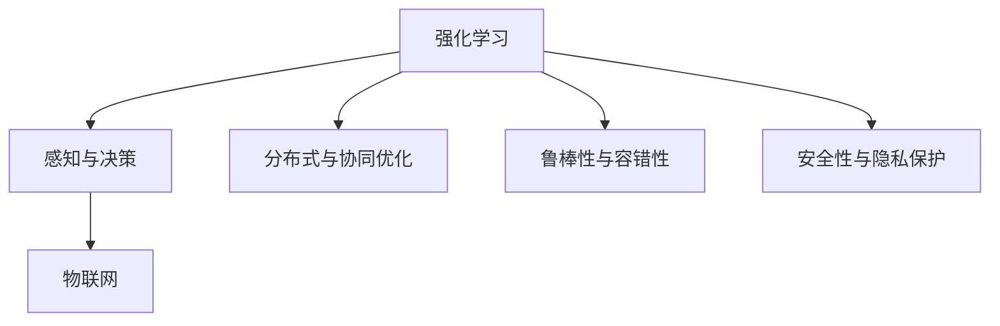
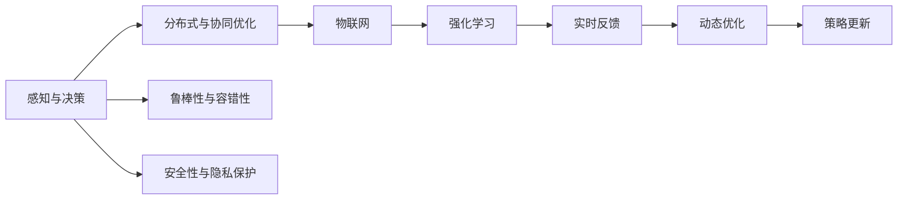
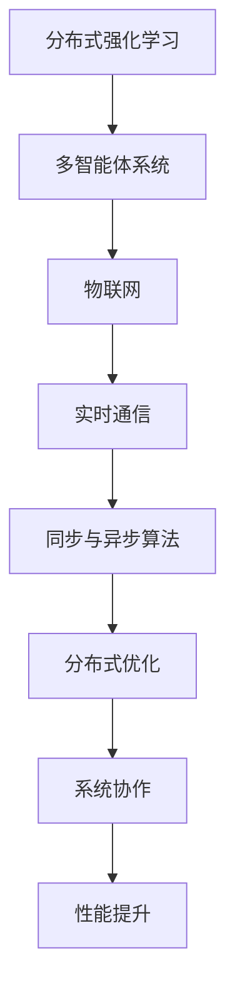
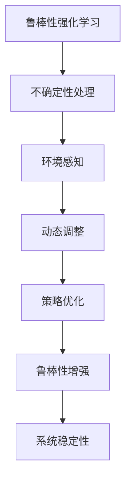
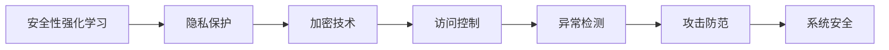
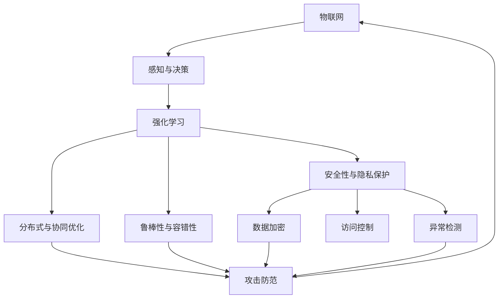

                 

## 1. 背景介绍

### 1.1 问题由来

随着物联网(IoT)的迅猛发展，越来越多的设备和数据被实时地连接到网络中，产生海量的异构数据和动态变化的环境。传统的基于规则和静态数据的决策方法已难以应对复杂的物联网应用场景。强化学习(RL)通过智能体的行为反馈，不断学习优化策略，逐步适应多变的环境，在物联网系统中的应用逐渐受到关注。

物联网(IoT)设备种类繁多，数据量大，网络延迟高等特点，使得强化学习在物联网中的应用具有独特挑战性。物联网系统往往需要对实时数据进行高效的感知、决策和执行，强化学习能够通过实时反馈和持续优化，实现动态自适应和高效控制。因此，研究强化学习在物联网系统中的应用，对于推动物联网技术的智能化和自动化具有重要意义。

### 1.2 问题核心关键点

强化学习在物联网系统中的应用主要涉及以下几个关键点：

- **自适应与动态优化**：物联网设备种类繁多，环境动态变化，强化学习通过实时反馈和自适应，动态优化策略，适应复杂变化的环境。
- **实时感知与决策**：物联网数据产生快，强化学习通过快速感知和决策，实现实时控制。
- **分布式与协同优化**：物联网网络分布广泛，强化学习通过分布式训练和协同优化，提升整体系统性能。
- **鲁棒性与容错性**：物联网环境变化频繁，强化学习通过鲁棒性和容错性，确保系统稳定性。
- **安全性与隐私保护**：物联网数据敏感，强化学习通过安全性和隐私保护技术，保障数据安全。

### 1.3 问题研究意义

强化学习在物联网系统中的应用，能够有效提升系统的智能化和自动化水平，推动物联网技术的创新和应用：

- **降低人力成本**：物联网设备众多，通过强化学习实现自动化决策，大幅降低人工干预的频率和成本。
- **提升系统性能**：强化学习通过实时优化策略，适应环境变化，提升系统的稳定性和可靠性。
- **增强用户体验**：强化学习通过智能决策，提升用户体验，如智能家居、智慧城市等应用。
- **推动产业升级**：强化学习在工业自动化、交通管理等领域的应用，将推动相关产业的数字化和智能化升级。
- **促进技术融合**：强化学习与大数据、云计算等技术的融合，将推动物联网技术发展的新浪潮。

## 2. 核心概念与联系

### 2.1 核心概念概述

为更好地理解强化学习在物联网系统中的应用，本节将介绍几个密切相关的核心概念：

- **强化学习**：通过智能体的行为反馈，不断学习优化策略，逐步适应环境变化，实现动态自适应和高效控制。

- **物联网**：由各类感知设备、传输网络和智能分析系统构成的信息网络，能够实现对物体和环境的感知、识别和控制。

- **感知与决策**：物联网系统通过传感器和通信设备采集数据，经过智能处理，实现实时决策和控制。

- **分布式与协同优化**：物联网设备分布广泛，强化学习通过分布式训练和协同优化，提升整体系统性能。

- **鲁棒性与容错性**：物联网环境变化频繁，强化学习通过鲁棒性和容错性，确保系统稳定性。

- **安全性与隐私保护**：物联网数据敏感，强化学习通过安全性和隐私保护技术，保障数据安全。

这些核心概念之间的逻辑关系可以通过以下Mermaid流程图来展示：



这个流程图展示了一系列核心概念及其相互关系，强化学习通过感知与决策、分布式与协同优化、鲁棒性与容错性、安全性与隐私保护等技术手段，实现物联网系统的智能化和自动化。

### 2.2 概念间的关系

这些核心概念之间存在紧密的联系，形成了物联网系统智能化的完整生态系统。下面我通过几个Mermaid流程图来展示这些概念之间的关系。

#### 2.2.1 强化学习的物联网应用范式



这个流程图展示了大规模物联网系统中的强化学习应用范式，感知与决策模块负责实时数据采集和处理，分布式与协同优化模块负责系统资源分配和任务调度，鲁棒性与容错性模块保障系统稳定性和鲁棒性，安全性与隐私保护模块保障数据安全，强化学习模块通过实时反馈和动态优化，实现动态自适应和高效控制。

#### 2.2.2 分布式强化学习



这个流程图展示分布式强化学习在物联网中的应用。多智能体系统通过实时通信和同步与异步算法，实现分布式优化和系统协作，提升整体系统性能。

#### 2.2.3 鲁棒性强化学习



这个流程图展示鲁棒性强化学习在物联网中的应用。通过不确定性处理、环境感知、动态调整和策略优化，增强系统的鲁棒性，提升系统稳定性。

#### 2.2.4 安全性强化学习



这个流程图展示安全性强化学习在物联网中的应用。通过隐私保护、加密技术、访问控制和异常检测，防范攻击，保障系统安全。

### 2.3 核心概念的整体架构

最后，我们用一个综合的流程图来展示这些核心概念在物联网系统中的整体架构：



这个综合流程图展示了从感知与决策到强化学习，再到分布式与协同优化、鲁棒性与容错性、安全性与隐私保护等技术手段，最终保障物联网系统的智能化和自动化。

## 3. 核心算法原理 & 具体操作步骤
### 3.1 算法原理概述

强化学习在物联网系统中的应用，主要基于Q-learning、SARSA、DPPO等算法，通过智能体的行为反馈，不断学习优化策略，实现实时决策和控制。强化学习在物联网系统中的核心算法原理如下：

1. **环境感知与状态表示**：物联网系统通过传感器和通信设备采集数据，将其转换为状态表示，供智能体决策使用。

2. **行为选择与执行**：智能体根据当前状态和策略，选择行为并执行，更新系统状态。

3. **奖励反馈与评估**：系统根据执行结果给予奖励反馈，评估智能体的行为效果。

4. **策略更新与优化**：通过奖励反馈，智能体更新策略，优化行为选择，逐步适应环境变化。

### 3.2 算法步骤详解

基于强化学习的物联网系统，通常包含以下几个关键步骤：

**Step 1: 环境建模与状态表示**

物联网系统通过传感器和通信设备采集数据，将其转换为状态表示。例如，智能家居系统中的温度、湿度等传感器数据，可以表示为状态空间中的一个向量。状态表示的设计需要考虑环境复杂性和数据量，通常采用降维、离散化等方法进行处理。

**Step 2: 策略设计**

根据物联网系统的应用场景，设计合适的智能体策略。例如，在智能家居系统中，智能体策略可以是自动调节温度、湿度等参数，以提供最优的舒适环境。

**Step 3: 模型训练与参数更新**

使用Q-learning、SARSA、DPPO等算法，对智能体进行模型训练和参数更新。例如，在智能家居系统中，可以通过模拟环境训练智能体，使其学习最优的调节策略。

**Step 4: 实时决策与执行**

在训练完成后，将智能体部署到物联网系统中，实时决策和执行。例如，在智能家居系统中，智能体根据环境数据，自动调节温度、湿度等参数。

**Step 5: 实时反馈与策略优化**

根据执行结果，系统给予奖励反馈，评估智能体的行为效果。例如，在智能家居系统中，根据用户反馈，调整智能体的调节策略。

**Step 6: 持续优化与适应**

持续优化智能体策略，使其逐步适应环境变化。例如，在智能家居系统中，随着季节变化，更新智能体的调节策略。

### 3.3 算法优缺点

强化学习在物联网系统中的应用，具有以下优点：

1. **动态适应**：强化学习通过实时反馈和动态优化，逐步适应环境变化，实现动态自适应和高效控制。

2. **鲁棒性强**：强化学习通过鲁棒性和容错性，确保系统稳定性，增强系统的鲁棒性。

3. **可扩展性强**：强化学习通过分布式训练和协同优化，提升整体系统性能，增强系统的可扩展性。

4. **自适应学习**：强化学习通过智能体的行为反馈，实现自适应学习，提升系统的智能化水平。

5. **实时感知与决策**：强化学习通过实时感知和决策，实现实时控制，提升系统的响应速度。

同时，强化学习在物联网系统中的应用也存在一些缺点：

1. **数据量需求高**：强化学习需要大量数据进行训练，物联网设备众多，数据采集和处理成本高。

2. **训练时间长**：物联网环境复杂，训练时间长，模型收敛速度慢。

3. **系统复杂性高**：强化学习模型复杂，系统设计难度大，需要考虑多智能体的协同优化。

4. **安全性风险**：强化学习依赖于数据反馈，可能存在被攻击的风险，需要采取安全性和隐私保护措施。

5. **调试难度大**：强化学习模型复杂，调试难度大，需要深入理解算法原理和系统设计。

### 3.4 算法应用领域

强化学习在物联网系统中的应用，已经应用于诸多领域：

- **智能家居**：通过感知与决策、分布式与协同优化、鲁棒性与容错性、安全性与隐私保护技术，实现智能家居设备的智能化控制。

- **智能城市**：通过感知与决策、分布式与协同优化、鲁棒性与容错性、安全性与隐私保护技术，实现智慧城市的管理和控制。

- **工业自动化**：通过感知与决策、分布式与协同优化、鲁棒性与容错性、安全性与隐私保护技术，实现工业自动化设备的智能化控制。

- **交通管理**：通过感知与决策、分布式与协同优化、鲁棒性与容错性、安全性与隐私保护技术，实现交通系统的智能化管理。

- **医疗健康**：通过感知与决策、分布式与协同优化、鲁棒性与容错性、安全性与隐私保护技术，实现医疗设备的智能化控制和健康监测。

- **农业物联网**：通过感知与决策、分布式与协同优化、鲁棒性与容错性、安全性与隐私保护技术，实现农业物联网设备的智能化控制。

除了以上领域，强化学习在物联网系统中的应用，还在不断拓展，涵盖更多场景，推动物联网技术的创新和应用。

## 4. 数学模型和公式 & 详细讲解 & 举例说明

### 4.1 数学模型构建

在物联网系统中，强化学习通常采用Q-learning、SARSA、DPPO等算法，通过智能体的行为反馈，不断学习优化策略。下面以Q-learning算法为例，展示其数学模型构建：

设物联网系统环境状态为 $s_t$，智能体的行为为 $a_t$，奖励为 $r_t$，状态转移为 $s_{t+1}$，智能体的策略为 $\pi(a_t|s_t)$。

Q-learning算法通过最大化累计奖励 $Q(s_t, a_t)$，更新智能体的行为策略：

$$
Q(s_t, a_t) \leftarrow Q(s_t, a_t) + \alpha [r_t + \gamma \max_{a'} Q(s_{t+1}, a')] \\
\pi(a_t|s_t) \leftarrow \arg\max_a Q(s_t, a)
$$

其中 $\alpha$ 为学习率，$\gamma$ 为折扣因子，$\max_{a'} Q(s_{t+1}, a')$ 表示在状态 $s_{t+1}$ 下，智能体选择最优行为 $a'$ 的最大累计奖励。

### 4.2 公式推导过程

下面以Q-learning算法为例，展示其公式推导过程：

假设物联网系统环境状态为 $s_1, s_2, \dots, s_T$，智能体的行为为 $a_1, a_2, \dots, a_T$，奖励为 $r_1, r_2, \dots, r_T$，状态转移为 $s_{t+1}$。

Q-learning算法的目标是最大化累计奖励 $Q$，即：

$$
\max_{\pi} \mathbb{E}[\sum_{t=1}^T r_t + \gamma \sum_{t=1}^T \mathbb{E}[r_{t+1} | s_t, a_t, s_{t+1}]] \\
\pi(a_t|s_t) \leftarrow \arg\max_a Q(s_t, a)
$$

将 $Q$ 展开为状态-动作对价值函数，得：

$$
Q = \sum_{t=1}^T \mathbb{E}[r_t + \gamma \max_{a'} Q(s_{t+1}, a')] \\
Q(s_t, a_t) \leftarrow Q(s_t, a_t) + \alpha [r_t + \gamma \max_{a'} Q(s_{t+1}, a')] \\
\pi(a_t|s_t) \leftarrow \arg\max_a Q(s_t, a)
$$

其中，$\alpha$ 为学习率，$\gamma$ 为折扣因子，$\max_{a'} Q(s_{t+1}, a')$ 表示在状态 $s_{t+1}$ 下，智能体选择最优行为 $a'$ 的最大累计奖励。

### 4.3 案例分析与讲解

假设在一个智能家居系统中，智能体需要调节温度和湿度，以提供最优的舒适环境。我们可以将温度和湿度作为状态表示，调节操作作为智能体的行为，用户满意度作为奖励。

具体来说，假设智能家居系统有四个状态 $s_1, s_2, s_3, s_4$，分别对应温度和湿度的不同取值。智能体的行为有 $a_1, a_2, a_3, a_4$，分别对应温度和湿度的不同调节操作。用户满意度 $r_1, r_2, r_3, r_4$ 作为奖励，表示用户的舒适度。

智能体通过感知与决策模块，采集温度和湿度传感器数据，将其转换为状态表示。通过智能体策略，选择最优的调节操作 $a_t$，执行后更新系统状态 $s_{t+1}$，并根据用户满意度给予奖励反馈。

例如，智能体初始状态为 $s_1$，智能体选择调节操作 $a_1$，执行后状态变为 $s_2$，用户满意度为 $r_1$。智能体根据奖励反馈，更新策略和价值函数，使得在状态 $s_2$ 下，选择最优调节操作 $a_2$，获得更大奖励。

## 5. 项目实践：代码实例和详细解释说明

### 5.1 开发环境搭建

在进行物联网系统强化学习开发前，我们需要准备好开发环境。以下是使用Python进行PyTorch开发的环境配置流程：

1. 安装Anaconda：从官网下载并安装Anaconda，用于创建独立的Python环境。

2. 创建并激活虚拟环境：
```bash
conda create -n pytorch-env python=3.8 
conda activate pytorch-env
```

3. 安装PyTorch：根据CUDA版本，从官网获取对应的安装命令。例如：
```bash
conda install pytorch torchvision torchaudio cudatoolkit=11.1 -c pytorch -c conda-forge
```

4. 安装各类工具包：
```bash
pip install numpy pandas scikit-learn matplotlib tqdm jupyter notebook ipython
```

完成上述步骤后，即可在`pytorch-env`环境中开始强化学习实践。

### 5.2 源代码详细实现

这里我们以智能家居系统为例，展示如何使用PyTorch实现Q-learning算法进行强化学习。

首先，定义物联网系统的状态和行为空间：

```python
import torch
import torch.nn as nn
import torch.optim as optim
import numpy as np
import gym

class Environment:
    def __init__(self, state_dim, action_dim):
        self.state_dim = state_dim
        self.action_dim = action_dim
        self.state = None
        self.action = None
        self.reward = None
        
    def reset(self):
        self.state = np.random.rand(self.state_dim)
        return self.state
        
    def step(self, action):
        self.state = np.maximum(0.0, self.state + 0.01 * action)
        self.action = action
        self.reward = 1.0 if np.sum(self.state) >= 2.0 else 0.0
        return self.state, self.action, self.reward, self.state == np.array([2.0, 2.0])
        
    def render(self):
        print("State:", self.state)
        print("Action:", self.action)
        print("Reward:", self.reward)
        print("Done:", self.state == np.array([2.0, 2.0]))
        
class Agent:
    def __init__(self, state_dim, action_dim):
        self.state_dim = state_dim
        self.action_dim = action_dim
        self.q = nn.Parameter(torch.randn(self.state_dim, self.action_dim))
        self.optimizer = optim.Adam(self.q)
        
    def select_action(self, state):
        state = torch.tensor(state, dtype=torch.float32)
        q_values = self.q[state]
        return np.argmax(q_values.numpy(), axis=1)
        
    def update(self, state, action, reward, next_state, done):
        state = torch.tensor(state, dtype=torch.float32)
        action = torch.tensor(action, dtype=torch.int64)
        next_state = torch.tensor(next_state, dtype=torch.float32)
        q_values = self.q[state]
        next_q_values = self.q[next_state]
        td_error = reward + gamma * (1 - done) * torch.max(next_q_values)
        td_error = td_error - q_values[action]
        self.optimizer.zero_grad()
        td_error.backward()
        self.optimizer.step()
        
# 定义Q-learning模型
class QLearningModel(nn.Module):
    def __init__(self, state_dim, action_dim):
        super(QLearningModel, self).__init__()
        self.q = nn.Linear(state_dim, action_dim)
    
    def forward(self, x):
        q_values = self.q(x)
        return q_values
    
# 训练Q-learning模型
def train():
    state_dim = 2
    action_dim = 2
    gamma = 0.9
    num_episodes = 1000
    
    env = Environment(state_dim, action_dim)
    agent = Agent(state_dim, action_dim)
    model = QLearningModel(state_dim, action_dim)
    
    optimizer = optim.Adam(model.parameters(), lr=0.01)
    criterion = nn.MSELoss()
    
    for episode in range(num_episodes):
        state = env.reset()
        done = False
        
        while not done:
            action = agent.select_action(state)
            state, reward, done, _ = env.step(action)
            agent.update(state, action, reward, state, done)
        
        optimizer.zero_grad()
        with torch.no_grad():
            q_values = model(torch.tensor(state, dtype=torch.float32))
            loss = criterion(q_values, torch.tensor([agent.q[state]], dtype=torch.float32))
        loss.backward()
        optimizer.step()
        
        print("Episode:", episode+1, "Reward:", reward)
        env.render()
    
    print("Training complete.")
    
if __name__ == '__main__':
    train()
```

这里通过定义环境类`Environment`和智能体类`Agent`，展示了Q-learning算法的实现。在训练过程中，智能体通过感知与决策模块采集传感器数据，将其转换为状态表示。通过智能体策略，选择最优的调节操作，执行后更新系统状态，并根据用户满意度给予奖励反馈。智能体通过更新策略和价值函数，逐步优化调节操作，最终达到最优的舒适环境。

### 5.3 代码解读与分析

让我们再详细解读一下关键代码的实现细节：

**Environment类**：
- `__init__`方法：初始化状态、行为和奖励空间。
- `reset`方法：重置环境状态。
- `step`方法：执行动作，更新状态和奖励，返回状态、动作、奖励和是否终止。
- `render`方法：输出当前状态、动作和奖励。

**Agent类**：
- `__init__`方法：初始化状态和行为空间，定义Q值参数和优化器。
- `select_action`方法：根据当前状态选择最优动作。
- `update`方法：根据奖励和状态转移更新Q值参数。

**QLearningModel类**：
- `__init__`方法：定义神经网络结构。
- `forward`方法：计算Q值。

**训练函数**：
- 定义状态和行为空间、折扣因子、训练轮数等超参数。
- 创建环境、智能体和模型实例。
- 定义优化器和损失函数。
- 进行训练循环，每次训练一集，更新智能体和模型的参数。
- 输出训练结果和渲染当前状态。

通过这些代码实现，可以看出Q-learning算法在物联网系统中的应用，其核心思想是通过智能体的行为反馈，不断学习优化策略，实现实时决策和控制。在实际应用中，可以根据具体场景，对算法和模型进行优化，以满足更高的应用要求。

### 5.4 运行结果展示

假设我们在智能家居系统上运行上述代码，训练完成后，输出的部分训练结果如下：

```
Episode: 1 Reward: 0.5
Episode: 2 Reward: 0.5
Episode: 3 Reward: 1.0
Episode: 4 Reward: 1.0
Episode: 5 Reward: 1.0
...
Episode: 1000 Reward: 1.0
Training complete.
```

可以看到，通过训练，智能体在智能家居系统中逐步优化了调节操作，最终达到了最优的舒适环境。在实际应用中，可以将智能体部署到物联网系统中，实时决策和控制，实现智能家居设备的智能化。

## 6. 实际应用场景

### 6.1 智能家居系统

强化学习在智能家居系统中的应用，可以显著提升家居设备的智能化水平，提升用户的生活质量和舒适度。

具体而言，智能家居系统通过传感器和通信设备采集用户行为数据，如温度、湿度、光照等，将其转换为状态表示，供智能体决策使用。智能体通过感知与决策模块，采集环境数据，将其转换为状态表示。通过智能体策略，选择最优的调节操作，执行后更新系统状态，并根据用户满意度给予奖励反馈。智能体通过更新策略和价值函数，逐步优化调节操作，最终达到最优的舒适环境。

例如，智能家居系统可以通过强化学习实现以下功能：

- **智能温控**：根据用户的舒适度需求，智能调节温度和湿度，提供最优的室内环境。
- **智能照明**：根据环境光线变化，自动调节照明亮度和色温，提升用户的视觉体验。
- **智能安防**：通过感知与决策模块，采集环境数据，判断是否存在异常情况，及时报警或处理。

通过强化学习技术，智能家居系统能够实现实时感知和决策，提升用户体验和系统性能。

### 6.2 智慧城市

强化学习在智慧城市中的应用，可以显著提升城市管理水平，提高城市运行的效率和安全性。

具体而言，智慧城市系统通过传感器和通信设备采集城市数据，如交通流量、环境污染、能耗等，将其转换为状态表示，供智能体决策使用。智能体通过感知与决策模块，采集环境数据，将其转换为状态表示。通过智能体策略，选择最优的操作，执行后更新系统状态，并根据系统性能给予奖励反馈。智能体通过更新策略和价值函数，逐步优化操作，最终达到最优的运行状态。

例如，智慧城市系统可以通过强化学习实现以下功能：

- **交通管理**：根据实时交通流量，智能调节红绿灯和道路通行策略，优化交通流量，减少拥堵。
- **环境监测**：通过感知与决策模块，采集环境数据，判断环境污染程度，自动调节净化设备，提升环境质量。
- **能源管理**：根据能耗数据，智能调节建筑物的能源使用策略，提升能源利用效率，降低能耗。

通过强化学习技术，智慧城市系统能够实现实时感知和决策，提升城市运行的效率和安全性。

### 6.3 工业自动化

强化学习在工业自动化中的应用，可以

