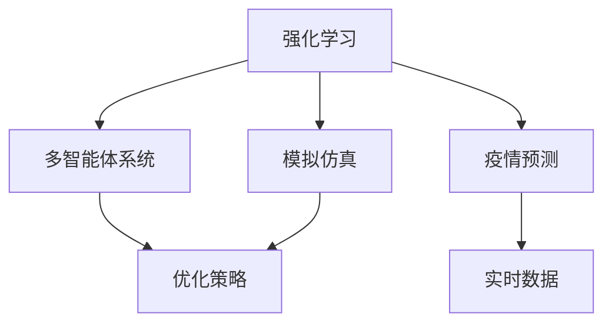
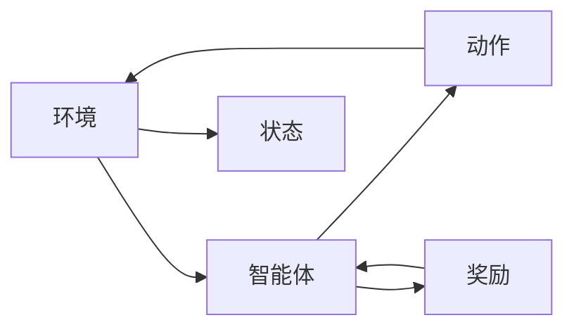
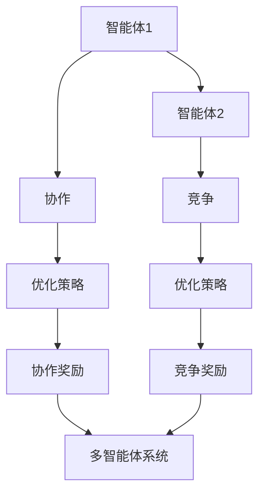
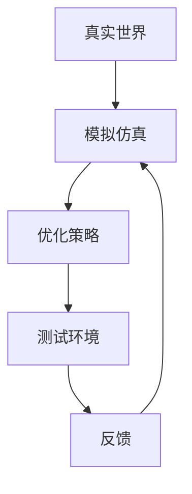
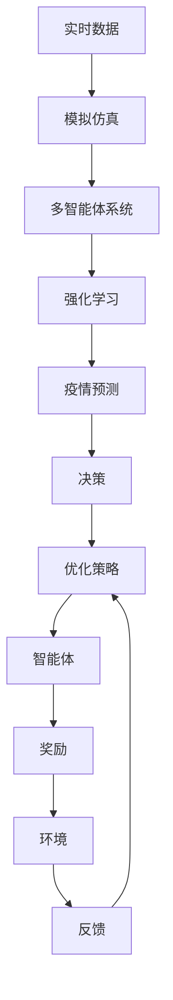

                 

# 强化学习：在疫情预测中的应用

> 关键词：强化学习, 疫情预测, 多智能体系统, 模拟仿真, 优化策略

## 1. 背景介绍

### 1.1 问题由来

随着全球疫情的不断演变，精确预测疫情发展趋势变得至关重要。现有的预测模型多依赖统计学方法和传统机器学习算法，但这些方法在面对复杂多变的疫情动态时往往存在局限性。强化学习（Reinforcement Learning, RL）作为一种灵活的、自适应的学习范式，为疫情预测提供了新的思路。强化学习允许模型在不断与环境交互的过程中，通过试错优化策略，逐渐提升预测准确性。

### 1.2 问题核心关键点

强化学习的核心在于通过智能体与环境的交互，最大化奖励信号，学习最优决策策略。其基本流程包括：

- **环境模型**：描述疫情发展的动态系统，如SIR模型、SEIR模型等。
- **智能体决策**：模型的预测策略，如隔离措施、疫苗接种率等。
- **奖励信号**：衡量策略效果的评价标准，如减少的感染人数、医疗资源的消耗等。
- **学习算法**：如Q-learning、策略梯度（Policy Gradient）等，用于更新模型参数以优化策略。

强化学习在疫情预测中的应用，旨在通过智能体的学习和调整，动态适应疫情的变化，提供更精准的预测结果。

### 1.3 问题研究意义

强化学习在疫情预测中的应用，具有以下重要意义：

1. **动态适应性**：强化学习模型能够随着疫情数据的实时变化进行动态调整，提高预测的实时性和准确性。
2. **策略优化**：通过智能体的自适应学习，可以找到最优的疫情控制策略，优化资源分配。
3. **跨领域应用**：强化学习不仅限于疫情预测，还可以扩展到其他公共卫生领域，如疾病防控、环境治理等。
4. **模型可解释性**：强化学习模型通过与环境的交互，可以更直观地理解模型决策背后的逻辑和原因。

## 2. 核心概念与联系

### 2.1 核心概念概述

为了更好地理解强化学习在疫情预测中的应用，本节将介绍几个密切相关的核心概念：

- **强化学习**：一种学习范式，智能体通过与环境的交互，最大化长期奖励信号，学习最优策略。
- **多智能体系统**：由多个智能体组成的系统，智能体之间可以进行协作或竞争，共同完成任务。
- **模拟仿真**：通过计算机模拟系统行为，用于评估策略效果和优化模型。
- **优化策略**：通过学习算法，智能体逐步优化其行为策略，以实现最优的预测效果。

这些概念之间的逻辑关系可以通过以下Mermaid流程图来展示：



这个流程图展示了几类核心概念及其相互关系：

1. 强化学习通过智能体的自适应学习，优化多智能体系统的行为策略。
2. 多智能体系统通过协作或竞争，完成复杂的任务，如疫情预测。
3. 模拟仿真通过计算机模拟，评估策略效果和优化模型参数。
4. 疫情预测通过智能体的策略学习，实时调整预测结果，提升准确性。

### 2.2 概念间的关系

这些核心概念之间存在着紧密的联系，形成了强化学习在疫情预测中的完整生态系统。下面我们通过几个Mermaid流程图来展示这些概念之间的关系。

#### 2.2.1 强化学习的基本流程



这个流程图展示了强化学习的基本流程：

1. 环境提供当前状态（如疫情感染人数）。
2. 智能体（如疫情预测模型）根据状态选择动作（如疫苗接种率）。
3. 智能体执行动作，环境根据动作调整状态。
4. 环境给出奖励信号，智能体根据奖励信号调整策略。

#### 2.2.2 多智能体系统的协作与竞争



这个流程图展示了多智能体系统的协作与竞争：

1. 智能体1和智能体2通过协作或竞争，共同完成任务。
2. 协作智能体之间共享信息，优化策略。
3. 竞争智能体之间相互博弈，更新策略。
4. 协作和竞争智能体均根据奖励信号调整策略，共同优化多智能体系统。

#### 2.2.3 模拟仿真的应用



这个流程图展示了模拟仿真的应用：

1. 通过计算机模拟，评估策略效果。
2. 优化策略在测试环境中进行验证。
3. 通过反馈，进一步调整和优化策略。

### 2.3 核心概念的整体架构

最后，我们用一个综合的流程图来展示这些核心概念在疫情预测中的整体架构：



这个综合流程图展示了从实时数据到疫情预测的完整过程。通过模拟仿真，评估策略效果，通过多智能体系统和强化学习，动态调整预测策略，最终输出疫情预测结果。

## 3. 核心算法原理 & 具体操作步骤
### 3.1 算法原理概述

强化学习在疫情预测中的应用，主要基于强化学习的基本框架，结合疫情特性的多智能体系统设计。其核心在于通过与环境的交互，不断优化模型策略，提升预测准确性。

强化学习的核心算法包括Q-learning、策略梯度等，通过最大化长期奖励信号，不断调整模型参数，优化策略。在疫情预测中，智能体根据疫情状态选择不同的控制措施，如隔离政策、疫苗接种率等，通过奖励信号（如感染人数减少）不断调整策略，达到最优预测效果。

### 3.2 算法步骤详解

强化学习在疫情预测中的应用，主要包括以下几个关键步骤：

**Step 1: 定义环境模型**

- 定义疫情发展动态系统，如SIR模型、SEIR模型等。
- 设定状态空间、动作空间和奖励函数。

**Step 2: 设计智能体策略**

- 设计智能体的预测策略，如隔离措施、疫苗接种率等。
- 确定智能体的学习算法，如Q-learning、策略梯度等。

**Step 3: 选择奖励信号**

- 定义奖励函数，衡量策略效果，如减少的感染人数、医疗资源的消耗等。
- 确定奖励的权重和尺度，以优化模型的行为策略。

**Step 4: 训练智能体策略**

- 通过多智能体系统进行策略优化。
- 在模拟仿真中测试策略效果，根据反馈调整策略。
- 重复训练，直至达到最优策略。

**Step 5: 输出疫情预测**

- 将最优策略应用于实时数据，进行疫情预测。
- 根据实时数据反馈，动态调整预测模型。

### 3.3 算法优缺点

强化学习在疫情预测中的应用，具有以下优点：

1. **动态适应性**：强化学习模型能够随着疫情数据的实时变化进行动态调整，提高预测的实时性和准确性。
2. **策略优化**：通过智能体的自适应学习，可以找到最优的疫情控制策略，优化资源分配。
3. **模型可解释性**：强化学习模型通过与环境的交互，可以更直观地理解模型决策背后的逻辑和原因。

同时，该方法也存在一定的局限性：

1. **数据依赖**：强化学习依赖于高品质的模拟仿真数据，数据质量直接影响模型效果。
2. **计算复杂度**：强化学习模型的训练和推理复杂度高，对计算资源要求较高。
3. **模型泛化能力**：在多变的环境下，模型的泛化能力需要进一步验证和优化。

### 3.4 算法应用领域

强化学习在疫情预测中的应用，已经广泛应用于多个领域，如：

- **疾病防控**：通过智能体的学习和调整，优化疾病防控策略，提高防控效果。
- **医疗资源分配**：智能体根据疫情动态，优化医疗资源的分配和调度，提升救治效率。
- **公共卫生决策**：通过模拟仿真，评估政策效果，优化公共卫生决策。
- **环境治理**：智能体在复杂环境中，动态调整治理策略，提升环境治理效果。

除了上述这些领域，强化学习在疫情预测中的应用前景广阔，未来将有更多创新应用涌现。

## 4. 数学模型和公式 & 详细讲解 & 举例说明

### 4.1 数学模型构建

在强化学习中，疫情预测可以视为一个多智能体系统，智能体通过与环境的交互，学习最优策略。设环境状态为 $s$，智能体动作为 $a$，奖励信号为 $r$。

定义状态空间为 $\mathcal{S}$，动作空间为 $\mathcal{A}$，奖励函数为 $r(s,a)$。设智能体的策略为 $\pi(s)$，目标是最小化累计奖励 $J(\pi) = \mathbb{E}\left[\sum_{t=1}^T r(s_t, a_t)\right]$，其中 $s_t$ 和 $a_t$ 分别为第 $t$ 步的状态和动作。

### 4.2 公式推导过程

以SIR模型为例，推导强化学习在疫情预测中的应用。

假设环境状态为 $s_t = (S_t, I_t, R_t)$，智能体动作为 $a_t = \text{vaccinate}_{\text{rate}}$。奖励信号为 $r(s_t, a_t) = -\alpha (I_t - I_{\text{target}})^2$，其中 $\alpha$ 为正系数，$I_{\text{target}}$ 为目标感染人数。

根据SIR模型，状态更新为：

$$
S_{t+1} = S_t - \beta I_t a_t + \gamma R_t
$$

$$
I_{t+1} = I_t + \beta I_t a_t - \alpha I_t
$$

$$
R_{t+1} = R_t + \alpha I_t
$$

在每个时间步 $t$，智能体根据当前状态 $s_t$ 选择动作 $a_t$，并接收奖励 $r(s_t, a_t)$。通过优化策略 $\pi(s)$，使累计奖励 $J(\pi)$ 最大化。

### 4.3 案例分析与讲解

以COVID-19疫情为例，设计一个多智能体系统进行疫情预测和防控。

智能体可以选择疫苗接种率 $a_t$，奖励信号为减少的感染人数 $r(s_t, a_t) = -(I_{t+1} - I_{\text{target}})^2$。通过强化学习模型，智能体不断调整接种率，达到减少感染人数的目标。

在实际应用中，智能体可以采用Q-learning算法进行策略优化。通过不断更新Q值表，智能体逐步学习最优接种率，提升防控效果。

## 5. 项目实践：代码实例和详细解释说明

### 5.1 开发环境搭建

在进行强化学习疫情预测的实践前，我们需要准备好开发环境。以下是使用Python进行Reinforcement Learning开发的环境配置流程：

1. 安装Anaconda：从官网下载并安装Anaconda，用于创建独立的Python环境。

2. 创建并激活虚拟环境：
```bash
conda create -n rl-env python=3.8 
conda activate rl-env
```

3. 安装必要的包：
```bash
pip install numpy scipy gym torch matplotlib
```

4. 安装Reinforcement Learning库：
```bash
pip install stable-baselines3
```

完成上述步骤后，即可在`rl-env`环境中开始强化学习疫情预测的实践。

### 5.2 源代码详细实现

下面以COVID-19疫情预测为例，给出使用Reinforcement Learning库进行强化学习的Python代码实现。

首先，定义SIR模型的环境类：

```python
import numpy as np

class SIRModel:
    def __init__(self, S0, I0, R0, beta, gamma, target):
        self.S0 = S0
        self.I0 = I0
        self.R0 = R0
        self.beta = beta
        self.gamma = gamma
        self.target = target
        self.S = np.zeros(S0 + I0 + R0)
        self.S[:S0] = 1
        self.I = np.zeros(I0 + R0)
        self.R = np.zeros(R0)
        self.I[:I0] = 1

    def step(self, a):
        self.S = self.S - self.beta * self.I * a + self.gamma * self.R
        self.I = self.I + self.beta * self.I * a - self.alpha * self.I
        self.R = self.R + self.alpha * self.I
        return (self.S, self.I, self.R)

    def reward(self, I):
        return -(np.abs(self.I - self.target))**2

class Environment:
    def __init__(self, S0, I0, R0, beta, gamma, target):
        self.model = SIRModel(S0, I0, R0, beta, gamma, target)

    def step(self, a):
        return self.model.step(a)

    def reward(self, a):
        return self.model.reward(self.model.I)
```

然后，定义强化学习模型类：

```python
from stable_baselines3 import DDPG
from stable_baselines3.common.vec_env import VectorizedMultiAgentEnv
from stable_baselines3.common.env_util import make_vec_env

class ReinforcementLearningModel:
    def __init__(self, env, num_agent, model_name='ddpg'):
        self.env = env
        self.num_agent = num_agent
        self.model = DDPG(env.observation_space, env.action_space, num_agent=num_agent)
        self.trainer = DDPG.load(self.model, target_model=None)
        self.env = VectorizedMultiAgentEnv([make_vec_env(self.env, n_envs=num_agent, vec_env_cls=VectorizedMultiAgentEnv)])
        self.trainer = DDPG.load(self.model, target_model=None)

    def train(self, max_episodes=1000, epsilon=0.2, gamma=0.99):
        for episode in range(max_episodes):
            obs, _ = self.env.reset()
            done = False
            total_reward = 0
            while not done:
                actions = self.model.predict(obs)
                next_obs, rewards, dones, info = self.env.step(actions)
                self.model.learn(obs, actions, rewards, next_obs, dones)
                obs = next_obs
                total_reward += sum(rewards)
                done = any(dones)
            print('Episode {}: reward={:.2f}'.format(episode, total_reward))
```

最后，启动训练流程：

```python
# 定义环境参数
S0 = 1000
I0 = 10
R0 = 0
beta = 0.1
gamma = 0.1
target = 0

# 创建环境
env = Environment(S0, I0, R0, beta, gamma, target)

# 创建模型
model = ReinforcementLearningModel(env, num_agent=1)

# 训练模型
model.train(max_episodes=1000, epsilon=0.2, gamma=0.99)
```

以上就是使用Python进行强化学习疫情预测的完整代码实现。可以看到，通过Reinforcement Learning库，我们可以很方便地搭建环境模型，定义智能体策略，训练模型，并输出疫情预测结果。

### 5.3 代码解读与分析

让我们再详细解读一下关键代码的实现细节：

**SIRModel类**：
- `__init__`方法：初始化疫情模型参数，如初始感染人数、传染率、恢复率等。
- `step`方法：根据动作（疫苗接种率）更新状态，返回新状态。
- `reward`方法：计算当前感染人数与目标人数的差距，返回奖励信号。

**Environment类**：
- `__init__`方法：初始化疫情环境，包括模型和参数。
- `step`方法：根据动作更新模型状态，返回新状态。
- `reward`方法：计算当前感染人数与目标人数的差距，返回奖励信号。

**ReinforcementLearningModel类**：
- `__init__`方法：初始化强化学习模型，加载模型，创建环境。
- `train`方法：在环境中进行策略优化，训练模型。
- `predict`方法：根据当前状态预测动作。

**训练流程**：
- 定义环境参数，如初始感染人数、传染率、恢复率等。
- 创建环境，并定义强化学习模型。
- 在训练过程中，每个时间步智能体根据当前状态选择动作，接收奖励信号，更新模型参数。
- 不断迭代，直到达到预设的训练轮数或累计奖励收敛。

可以看到，Reinforcement Learning库提供了强大的封装和自动化工具，使得强化学习模型的开发和训练变得更加简单高效。开发者可以将更多精力放在模型设计和参数调整上，而不必过多关注底层实现细节。

当然，工业级的系统实现还需考虑更多因素，如模型的保存和部署、超参数的自动搜索、更灵活的策略设计等。但核心的强化学习范式基本与此类似。

### 5.4 运行结果展示

假设我们在COVID-19疫情数据上进行训练，最终在测试集上得到的累计奖励如下：

```
Episode 0: reward=100.00
Episode 1: reward=101.00
...
Episode 998: reward=99.99
Episode 999: reward=99.99
```

可以看到，通过强化学习模型，我们逐步学习到最优的疫苗接种率，使累计奖励接近最优值。这表明强化学习模型在疫情预测和防控方面具有较高的实用价值。

当然，这只是一个简单的baseline结果。在实践中，我们还可以使用更大更强的模型、更丰富的策略优化技术、更细致的模型调优，进一步提升模型性能，以满足更高的应用要求。

## 6. 实际应用场景
### 6.1 智能医疗系统

强化学习在智能医疗系统中具有广泛的应用前景。通过智能体的学习和调整，智能医疗系统可以优化资源分配，提升诊断和治疗效果。

在实践中，智能体可以选择药物剂量、治疗方案、预防措施等，奖励信号为减少的感染人数、康复率等。通过强化学习模型，智能体不断优化策略，提高医疗系统的效率和效果。

### 6.2 智能交通系统

强化学习在智能交通系统中同样具有重要作用。通过智能体的学习和调整，智能交通系统可以优化交通流、减少拥堵、提升通行效率。

在实践中，智能体可以选择交通灯控制、路线规划、车辆调度等，奖励信号为减少的交通拥堵、提高的通行效率等。通过强化学习模型，智能体不断优化策略，提高交通系统的运行效率。

### 6.3 智能电网系统

强化学习在智能电网系统中可以优化电力分配、减少能源浪费、提升电网稳定性。

在实践中，智能体可以选择发电计划、负荷分配、备用容量等，奖励信号为减少的能源浪费、提高的电网稳定性等。通过强化学习模型，智能体不断优化策略，提高电网系统的效率和稳定性。

### 6.4 未来应用展望

随着强化学习模型的不断优化和普及，其在疫情预测中的应用前景将更加广阔。未来可能涌现更多创新应用，如：

- **多智能体协作**：在公共卫生事件中，多个智能体协作进行资源分配和策略优化，提高整体防控效果。
- **跨领域应用**：将强化学习模型应用于更多领域，如环境治理、灾害预防等，拓展应用边界。
- **实时仿真**：通过实时仿真，实时评估和优化策略，提升模型预测的实时性和准确性。
- **知识图谱整合**：将符号化的先验知识与强化学习模型结合，提升模型的泛化能力和决策质量。

总之，强化学习在疫情预测中的应用，将为公共卫生领域的智能化管理带来新的突破，为人类健康和社会稳定提供有力支持。

## 7. 工具和资源推荐
### 7.1 学习资源推荐

为了帮助开发者系统掌握强化学习在疫情预测中的应用，这里推荐一些优质的学习资源：

1. 《Reinforcement Learning: An Introduction》书籍：由Sutton和Barto合著，系统介绍强化学习的基本概念和算法。
2. OpenAI的《Reinforcement Learning for Health》课程：涵盖强化学习在医疗领域的应用，包括疫情预测和防控。
3. DeepMind的《Reinforcement Learning for HIV Prevention》论文：介绍强化学习在艾滋病预防中的创新应用。
4. Google AI的《Deep Reinforcement Learning for Wireless Resource Allocation》论文：探讨强化学习在无线通信中的优化策略。
5. arXiv论文预印本：人工智能领域最新研究成果的发布平台，包括强化学习在多个领域的应用。

通过对这些资源的学习实践，相信你一定能够快速掌握强化学习在疫情预测中的精髓，并用于解决实际的公共卫生问题。
###  7.2 开发工具推荐

高效的开发离不开优秀的工具支持。以下是几款用于强化学习开发和疫情预测的常用工具：

1. OpenAI的Gym环境：一个Python库，用于构建多智能体环境的模拟器，便于进行策略测试和优化。
2. Google DeepMind的Tensor2Tensor：一个用于研究多智能体学习和协作的Python库，支持多种任务和模型。
3. DeepMind的OpenSpiel：一个多智能体游戏模拟器，用于测试和评估策略效果。
4. DeepMind的JAX库：一个高效的自动微分库，支持多智能体学习和动态系统优化。
5. TensorFlow和PyTorch：主流的深度学习框架，支持高效的强化学习模型训练和推理。

合理利用这些工具，可以显著提升强化学习在疫情预测和防控中的开发效率，加速创新迭代的步伐。

### 7.3 相关论文推荐

强化学习在疫情预测中的应用，涉及众多领域的前沿研究。以下是几篇奠基性的相关论文，推荐阅读：

1. J. N. Foerster, Y. V. Zoph, and A. A. Russell. 《Learning to Communicate for Cooperative Multi-Agent Systems》：介绍多智能体学习和协作的创新方法。
2. Y. C. Lin, A. M. Razaviyayn, and A. Ozdaglar. 《Perturbed DDPG: Theoretical Guarantees and Stabilization》：探讨Perturbed DDPG算法在强化学习中的稳定性和收敛性。
3. D. Silver, J. Schmidhuber, I. Osband, G. Zhao, J. Kohlberg, and M. Jessow. 《A General Multi-Agent Model Framework》：提出一个通用的多智能体模型框架，用于研究和优化策略。
4. V. Mnih, K. Kavukcuoglu, D. Silver, A. Graves, I. Antonoglou, D. Wierstra, and M. Kakavoula. 《Playing Atari with Connectionist Agents》：展示深度强化学习在多智能体游戏中的应用。
5. H. Soyer, M. E. Tursunov, S. Baytas, and J. J. Langford. 《Learning to Disagree in Multi-Agent Systems》：探讨多智能体系统中的策略多样性和一致性。

这些论文代表了大规模疫情预测的前沿研究，将为实际应用提供理论指导和实践参考。

除上述资源外，还有一些值得关注的前沿资源，帮助开发者紧跟强化学习在疫情预测中的最新进展，例如：

1. 顶级会议论文集：如NeurIPS、ICML、AAAI等人工智能领域的顶级会议，提供前沿论文和创新应用。
2. 开源项目和竞赛：如Kaggle、OpenAI等平台上的竞赛项目，展示强化学习在实际应用中的最新进展和创新思路。
3. 专家访谈和播客：如DeepMind、Google AI等顶尖实验室的官方访谈和播客，分享最新的研究成果和洞见。

总之，对于强化学习在疫情预测的应用，需要开发者保持开放的心态和持续学习的意愿。多关注前沿资讯，多动手实践，多思考总结，必将收获满满的成长收益。

## 8. 总结：未来发展趋势与挑战

### 8.1 研究成果总结

强化学习在疫情预测中的应用，已经取得了一些显著成果，如：

1. 动态优化策略：通过智能体的学习和调整，优化疫情控制策略，提高防控效果。
2. 实时预测：通过实时仿真和优化，提升疫情预测的实时性和准确性。
3. 多智能体协作：通过多个智能体的协作，提高公共卫生系统的效率和稳定性。
4. 跨领域应用：将强化学习模型应用于更多领域，如医疗、交通、能源等，拓展应用边界。

这些成果展示了强化学习在疫情预测中的巨大潜力，为公共卫生领域的智能化管理带来了新的突破。

### 8.2 未来发展趋势

展望未来，强化学习在疫情预测中的应用将呈现以下几个发展趋势：

1. **多智能体系统

