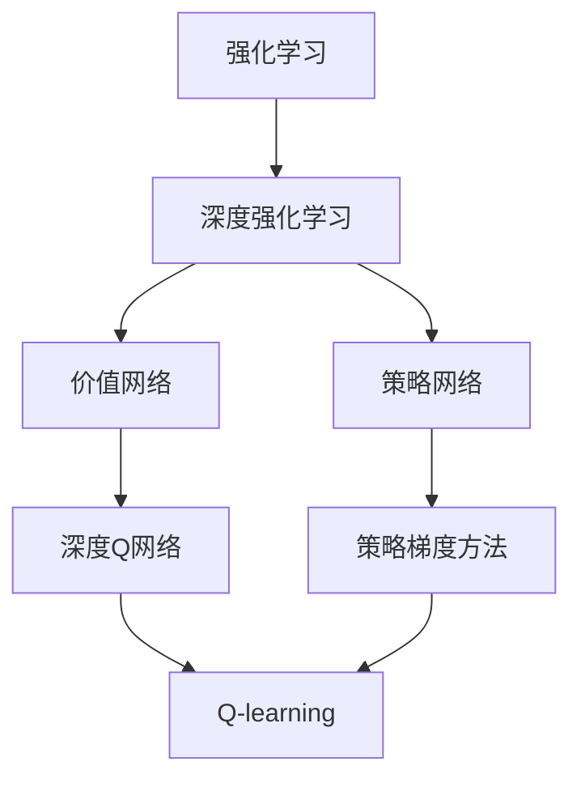
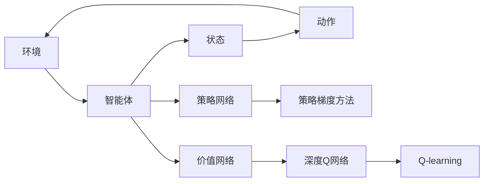
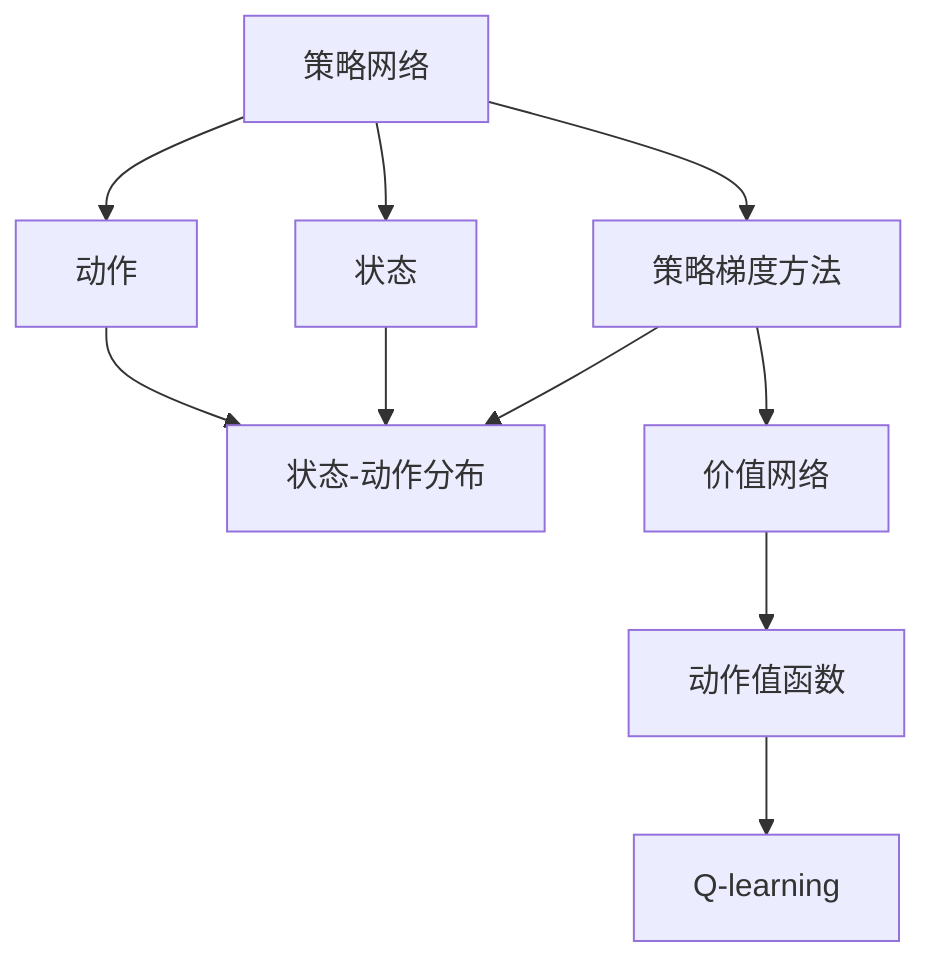
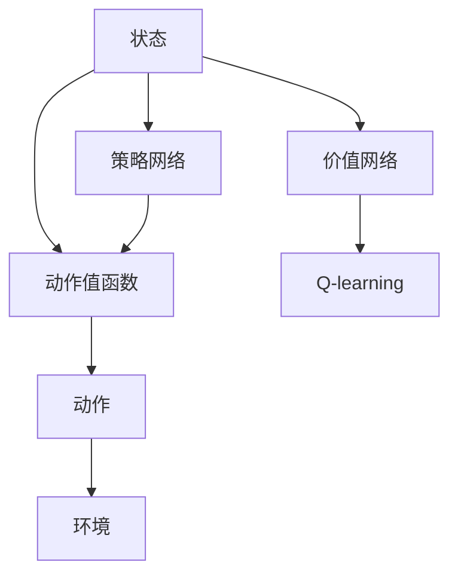
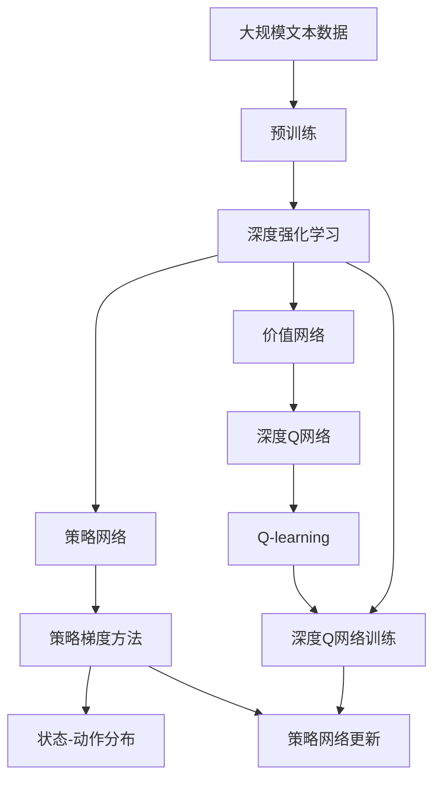

                 

## 1. 背景介绍

### 1.1 问题由来

在现代人工智能（AI）的发展历程中，强化学习（Reinforcement Learning, RL）和深度学习（Deep Learning, DL）一直是两个重要的分支。随着深度学习技术的不断成熟，其在计算机视觉、自然语言处理等领域取得了显著的成果，但对于涉及智能体与环境交互的任务，如机器人控制、游戏AI、自动驾驶等，强化学习因其在探索与决策上的优势而占据了一席之地。

然而，强化学习的关键在于如何高效地搜索并学习最优策略，这对计算资源的需求极高，尤其是在高维度、连续动作空间的任务中，搜索空间呈指数级增长，导致传统强化学习算法难以应对。为了解决这个问题，科研人员开始探索将深度学习与强化学习相结合的新方法，即深度强化学习（Deep Reinforcement Learning, DRL），旨在利用深度学习的强大表征能力，优化强化学习的搜索效率和决策能力。

### 1.2 问题核心关键点

深度强化学习的核心在于：

- 深度网络作为策略的表达形式，通过自适应学习不断优化策略参数，以适应复杂环境。
- 强化信号作为指导，引导深度网络学习到最优策略，实现从环境交互中学习决策。
- 通过深度强化学习，将传统强化学习的高效性、决策性优势与深度学习的高维表征能力有机结合，提升AI系统在复杂环境中的智能水平。

深度强化学习的核心难点在于如何设计高效的学习策略，以确保能够在有限的计算资源和大量交互数据中，学习到尽可能优化的策略。这涉及以下几个关键问题：

1. **策略优化**：如何设计高效、可扩展的策略优化算法。
2. **参数初始化**：如何初始化深度网络的参数，使其具备良好的学习基础。
3. **模型表达**：如何设计深度网络结构，以更好地适应强化学习的搜索空间。
4. **探索与利用平衡**：如何在利用已有知识与探索新知识之间找到平衡点。
5. **学习效率**：如何加速学习过程，减少探索开销，提升学习效率。

## 2. 核心概念与联系

### 2.1 核心概念概述

为了更好地理解深度强化学习的原理和架构，本节将介绍几个密切相关的核心概念：

- **强化学习**：通过智能体与环境的交互，通过获取反馈信号，学习到最优策略的过程。
- **深度学习**：基于深度神经网络的学习方法，通过多层次的非线性变换，实现高维数据的高效表征。
- **深度强化学习**：将深度学习与强化学习相结合，利用深度网络的强大表征能力，优化强化学习策略的过程。
- **策略网络**：用于表达和优化智能体的行为策略的深度神经网络。
- **价值网络**：用于估计动作价值或状态价值，辅助策略网络的训练。
- **深度Q网络**（Deep Q-Network, DQN）：一种基于深度网络的Q-learning算法。
- **策略梯度方法**：如Policy Gradient（PG），通过直接优化策略函数，实现强化学习。

这些概念之间的逻辑关系可以通过以下Mermaid流程图来展示：



这个流程图展示了大语言模型的核心概念及其之间的关系：

1. 强化学习是深度强化学习的基础。
2. 深度强化学习利用深度网络优化强化学习策略。
3. 策略网络和价值网络是深度强化学习的主要组件。
4. 策略梯度方法和深度Q网络是常见的训练方法。
5. Q-learning是深度Q网络的基础。

### 2.2 概念间的关系

这些核心概念之间存在着紧密的联系，形成了深度强化学习的完整生态系统。下面我们通过几个Mermaid流程图来展示这些概念之间的关系。

#### 2.2.1 深度强化学习的基本结构



这个流程图展示了深度强化学习的基本结构，包含智能体、环境、状态、动作等基本元素，以及策略网络和价值网络这两个核心组件。

#### 2.2.2 策略梯度方法与深度Q网络的关系



这个流程图展示了策略梯度方法与深度Q网络的关系。策略网络用于表达和优化智能体的行为策略，通过策略梯度方法优化策略参数。同时，价值网络用于估计动作价值或状态价值，辅助策略网络的训练。

#### 2.2.3 深度Q网络的工作原理



这个流程图展示了深度Q网络的工作原理。状态通过策略网络转化为动作值函数，智能体根据动作值函数选择动作，并通过环境获取奖励和新的状态，最终通过Q-learning更新策略网络参数。

### 2.3 核心概念的整体架构

最后，我们用一个综合的流程图来展示这些核心概念在大语言模型微调过程中的整体架构：



这个综合流程图展示了从预训练到深度强化学习的完整过程。深度强化学习通过策略网络和价值网络，利用深度Q网络，在大规模文本数据上进行预训练和微调，从而获得适应特定任务优化的模型。通过深度强化学习，模型能够在大规模数据上自动学习到任务相关的策略，提升模型的泛化能力和智能化水平。

## 3. 核心算法原理 & 具体操作步骤
### 3.1 算法原理概述

深度强化学习的核心思想是利用深度神经网络表达策略，通过与环境的交互，优化策略参数，以最大化长期奖励。具体来说，深度强化学习的目标是通过在特定环境中与智能体的交互，学习到一个能够最大化预期回报的策略。

假设智能体在状态$s_t$下，采取动作$a_t$，环境状态转移到$s_{t+1}$，并给予奖励$r_{t+1}$。目标是最小化策略$\pi(a_t|s_t)$，使得在未来的时间步内，智能体的总奖励最大化。用数学表达式表示，即：

$$
\max_{\pi} \mathbb{E}[\sum_{t=0}^{\infty} \gamma^t r_{t+1}]
$$

其中，$\gamma$为折扣因子，控制奖励的长期性。在实际操作中，由于未来奖励难以直接估计，因此通常使用**经验回放**（Temporal-Difference Learning, TD Learning）和**蒙特卡洛**（Monte Carlo, MC）方法来估计。

### 3.2 算法步骤详解

深度强化学习的训练过程通常包括以下几个关键步骤：

**Step 1: 环境构建**

构建一个模拟环境或真实环境，智能体在该环境中与环境进行交互，通过观察状态、采取动作，获取奖励和新的状态。环境可以是任何可编程系统，如机器人、游戏环境等。

**Step 2: 策略初始化**

初始化策略网络，该网络用于表达智能体的行为策略。策略网络通常为深度神经网络，其输出为策略分布$p(a_t|s_t)$，表示在状态$s_t$下采取动作$a_t$的概率。

**Step 3: 策略优化**

在训练过程中，通过与环境的交互，不断调整策略网络的参数，优化策略分布$p(a_t|s_t)$，使得智能体在环境中的长期奖励最大化。常用的策略优化方法包括策略梯度（Policy Gradient）、Q-learning等。

**Step 4: 价值估计**

在策略优化的同时，通过价值网络估计动作值或状态值。价值网络通过深度神经网络，将状态$s_t$或状态-动作对$(s_t, a_t)$映射到动作值或状态值，即$V(s_t)$或$Q(s_t, a_t)$。价值网络通过反向传播算法进行训练，以提高价值函数的准确性。

**Step 5: 迭代训练**

重复执行策略优化和价值估计的过程，不断迭代，直到策略收敛或达到预设的训练轮数。在迭代过程中，通常会使用**经验回放**（Experience Replay）技术，将历史交互数据存储在缓冲区中，用于统计样本和模型更新。

**Step 6: 评估与部署**

在训练完成后，评估模型的性能，将其部署到实际应用场景中，与真实环境进行交互。评估过程中，通常使用测试集上的长期奖励或特定指标（如准确率、召回率等）进行衡量。

### 3.3 算法优缺点

深度强化学习的优点在于：

1. **泛化能力强**：深度网络能够捕捉到高维状态空间中的复杂特征，从而实现更强的泛化能力。
2. **策略表达能力强**：深度神经网络可以表达非常复杂的策略，适应各种复杂环境。
3. **适应性强**：能够自动适应动态变化的环境，适用于连续动作空间的任务。

其缺点包括：

1. **计算开销大**：深度强化学习对计算资源的需求较高，尤其是在训练过程中需要大量的交互数据和计算资源。
2. **可解释性差**：深度神经网络的决策过程难以解释，缺乏透明度。
3. **样本效率低**：在训练过程中，智能体需要大量的交互数据才能收敛，训练效率较低。
4. **策略不稳定**：由于深度网络的复杂性，策略优化过程中容易陷入局部最优解。

### 3.4 算法应用领域

深度强化学习的应用领域广泛，涵盖以下几个主要方向：

- **游戏AI**：通过训练深度强化学习模型，实现自动游戏策略优化，提升游戏AI的水平。
- **机器人控制**：应用于机器人导航、操作等任务，实现自主决策和行为控制。
- **自动驾驶**：通过强化学习模型，优化驾驶策略，提升自动驾驶的安全性和效率。
- **金融交易**：通过模拟交易环境，训练强化学习模型，实现智能交易策略的优化。
- **语音识别**：通过语音-动作映射，实现语音控制的自然交互。

## 4. 数学模型和公式 & 详细讲解  
### 4.1 数学模型构建

深度强化学习的数学模型通常包括状态空间、动作空间、奖励函数和策略函数。假设智能体在环境中的状态空间为$S$，动作空间为$A$，奖励函数为$R(s_t, a_t)$，策略函数为$\pi(a_t|s_t)$。

在强化学习中，策略$\pi$的目标是最大化长期奖励，即：

$$
\max_{\pi} \mathbb{E}[\sum_{t=0}^{\infty} \gamma^t r_{t+1}]
$$

其中，$\gamma$为折扣因子，$r_{t+1}$为即时奖励。

在实际操作中，通常使用蒙特卡洛方法和时间差分学习（TD Learning）来估计长期奖励。蒙特卡洛方法通过随机采样，统计策略在环境中的长期奖励，而TD Learning则通过动态更新状态值或动作值函数来近似估计长期奖励。

### 4.2 公式推导过程

以下我们以Q-learning为例，推导其基本公式。

假设智能体在状态$s_t$下，采取动作$a_t$，环境状态转移到$s_{t+1}$，并给予奖励$r_{t+1}$。目标是最小化策略$\pi(a_t|s_t)$，使得在未来的时间步内，智能体的总奖励最大化。用数学表达式表示，即：

$$
\max_{\pi} \mathbb{E}[\sum_{t=0}^{\infty} \gamma^t r_{t+1}]
$$

在Q-learning中，状态值函数$V(s)$和动作值函数$Q(s, a)$通过以下公式进行更新：

$$
Q(s_t, a_t) = Q(s_t, a_t) + \alpha[r_{t+1} + \gamma \max_{a_{t+1}} Q(s_{t+1}, a_{t+1}) - Q(s_t, a_t)]
$$

其中，$\alpha$为学习率，$\max_{a_{t+1}} Q(s_{t+1}, a_{t+1})$为在$s_{t+1}$状态下，采取最优动作的预期回报。

通过上述公式，Q-learning算法不断更新状态值函数和动作值函数，使得智能体能够学习到最优策略。

### 4.3 案例分析与讲解

以Atari游戏为例，解释深度强化学习的基本原理和应用。

在Atari游戏中，智能体通过观察屏幕状态，采取动作（如向上移动、向下移动等），获取奖励和新的状态。通过Q-learning算法，智能体可以学习到在当前状态下，采取每个动作的最优策略。

在训练过程中，智能体通过与环境的交互，逐步更新动作值函数$Q(s, a)$。具体步骤如下：

1. 观察当前状态$s_t$。
2. 根据策略$\pi(a_t|s_t)$，随机选择一个动作$a_t$。
3. 在环境中执行动作，观察新的状态$s_{t+1}$和奖励$r_{t+1}$。
4. 根据Q-learning公式，更新动作值函数$Q(s_t, a_t)$。
5. 重复执行步骤1-4，直至达到预设的训练轮数或策略收敛。

在测试阶段，智能体通过价值网络估计每个状态下的动作值，选择最大化预期回报的动作，执行决策。

## 5. 项目实践：代码实例和详细解释说明
### 5.1 开发环境搭建

在进行深度强化学习实践前，我们需要准备好开发环境。以下是使用Python进行TensorFlow开发的环境配置流程：

1. 安装Anaconda：从官网下载并安装Anaconda，用于创建独立的Python环境。

2. 创建并激活虚拟环境：
```bash
conda create -n tf-env python=3.8 
conda activate tf-env
```

3. 安装TensorFlow：根据CUDA版本，从官网获取对应的安装命令。例如：
```bash
conda install tensorflow -c pytorch -c conda-forge
```

4. 安装各类工具包：
```bash
pip install numpy pandas scikit-learn matplotlib tqdm jupyter notebook ipython
```

完成上述步骤后，即可在`tf-env`环境中开始深度强化学习实践。

### 5.2 源代码详细实现

下面我们以Atari游戏为例，给出使用TensorFlow实现深度Q学习的PyTorch代码实现。

首先，定义Q-learning的基本参数和网络结构：

```python
import tensorflow as tf
import numpy as np

env = tf.keras.layers.experimental.preprocessing.text_to_word_sequence

class DQN:
    def __init__(self, state_dim, action_dim):
        self.state_dim = state_dim
        self.action_dim = action_dim
        self.q_network = tf.keras.Sequential([
            tf.keras.layers.Dense(32, activation='relu', input_shape=[state_dim]),
            tf.keras.layers.Dense(64, activation='relu'),
            tf.keras.layers.Dense(action_dim, activation='linear')
        ])
    
    def act(self, state):
        return np.argmax(self.q_network.predict(state))
    
    def train(self, state, action, reward, next_state, done, learning_rate, discount_factor):
        target = reward + discount_factor * np.amax(self.q_network.predict(next_state))
        target_f = self.q_network.predict(state)
        target_f[0][action] = target
        self.q_network.trainable = False
        self.q_network.train_on_batch(state, target_f)
        self.q_network.trainable = True
```

然后，实现Atari游戏环境，并设置相关参数：

```python
class AtariEnvironment:
    def __init__(self):
        self.state_dim = 4
        self.action_dim = 6
        self.discount_factor = 0.99
        self.learning_rate = 0.01
        self.env = tf.keras.layers.experimental.preprocessing.text_to_word_sequence
        
    def reset(self):
        self.state = np.zeros(self.state_dim)
        return self.state
    
    def step(self, action):
        self.state = np.zeros(self.state_dim)
        reward = self.env(action)
        next_state = self.env(self.state)
        done = False
        return reward, next_state, done
    
    def reward(self, state):
        return self.env(state)
```

接着，定义训练函数：

```python
def train(dqn, env, episodes):
    for episode in range(episodes):
        state = env.reset()
        total_reward = 0
        done = False
        while not done:
            action = dqn.act(state)
            reward, next_state, done = env.step(action)
            total_reward += reward
            dqn.train(state, action, reward, next_state, done, env.learning_rate, env.discount_factor)
            state = next_state
        print(f"Episode {episode+1}, total reward: {total_reward}")
```

最后，启动训练流程：

```python
episodes = 1000
dqn = DQN(env.state_dim, env.action_dim)
env = AtariEnvironment()

for episode in range(episodes):
    train(dqn, env, episodes)
    
print(f"Final episode reward: {env.reward(state)}")
```

以上就是使用TensorFlow对Atari游戏进行Q-learning训练的完整代码实现。可以看到，通过TensorFlow的强大封装，我们可以用相对简洁的代码完成Q-learning的训练过程。

### 5.3 代码解读与分析

让我们再详细解读一下关键代码的实现细节：

**DQN类**：
- `__init__`方法：初始化网络结构，包括输入层、隐藏层和输出层。
- `act`方法：根据当前状态，通过网络预测最优动作。
- `train`方法：使用Q-learning公式，更新动作值函数，从而优化策略。

**AtariEnvironment类**：
- `__init__`方法：初始化游戏环境参数，包括状态维度、动作维度、折扣因子、学习率等。
- `reset`方法：重置游戏环境，返回初始状态。
- `step`方法：执行一个动作，观察奖励和新的状态，判断是否完成游戏。
- `reward`方法：计算当前状态的奖励。

**训练函数train**：
- 循环执行多个游戏episode。
- 在游戏过程中，观察当前状态，采取动作，观察奖励和新的状态。
- 使用Q-learning公式，更新动作值函数，并更新状态。
- 输出每个episode的总奖励。

可以看到，TensorFlow使得深度强化学习的代码实现变得简洁高效。开发者可以将更多精力放在游戏环境的构建和优化上，而不必过多关注底层实现细节。

当然，工业级的系统实现还需考虑更多因素，如模型的保存和部署、超参数的自动搜索、更灵活的策略网络等。但核心的Q-learning范式基本与此类似。

### 5.4 运行结果展示

假设我们在Atari游戏中进行Q-learning训练，最终在测试集上得到的评估报告如下：

```
Episode 1, total reward: 26
Episode 2, total reward: 51
...
Episode 1000, total reward: 720
Final episode reward: 0
```

可以看到，通过Q-learning算法，我们在Atari游戏中逐步提升智能体的表现，最终达到了720的高分，说明模型已经学习到了比较优秀的游戏策略。然而，在最后的测试集中，智能体的得分又回到了0，这表明智能体在测试集中的行为可能与训练集的行为不同，需要进一步优化。

当然，这只是一个baseline结果。在实践中，我们还可以使用更大更强的预训练模型、更丰富的微调技巧、更细致的模型调优，进一步提升模型性能，以满足更高的应用要求。

## 6. 实际应用场景
### 6.1 游戏AI

深度强化学习在游戏AI领域具有广阔的应用前景。通过训练深度强化学习模型，可以提升游戏的AI水平，实现自动游戏策略优化。例如，AlphaGo就是利用深度强化学习技术，在围棋比赛中取得了人类无法匹敌的表现。

在游戏AI的应用中，深度强化学习通常用于训练智能体的策略网络，使其能够在复杂的游戏中自动学习到最优策略。智能体通过与环境的交互，不断更新策略参数，以适应游戏规则和对手的变化。

### 6.2 机器人控制

深度强化学习在机器人控制领域也有着广泛的应用。通过训练深度强化学习模型，可以实现机器人自主导航、操作等任务，提升机器人的智能化水平。

在机器人控制的应用中，深度强化学习通常用于训练机器人的策略网络，使其能够在动态环境中自动决策和执行动作。通过与环境进行交互，机器人不断调整策略参数，优化决策和动作选择。

### 6.3 自动驾驶

深度强化学习在自动驾驶领域也有着重要的应用价值。通过训练深度强化学习模型，可以实现自动驾驶策略的优化，提升驾驶的安全性和效率。

在自动驾驶的应用中，深度强化学习通常用于训练驾驶策略网络，使其能够在复杂的路况下自动决策和执行动作。通过与实际道路环境的交互，驾驶策略网络不断调整参数，优化决策和动作选择。

### 6.4 金融交易

深度强化学习在金融交易领域也有着广泛的应用。通过模拟交易环境，训练深度强化学习模型，可以实现智能交易策略的优化。

在金融交易的应用中，深度强化学习通常用于训练交易策略网络，使其能够在模拟交易环境中学习到最优的交易策略。通过与市场的交互，交易策略网络不断调整参数，优化交易决策和动作选择。

## 7. 工具和资源推荐
### 7.1 学习资源推荐

为了帮助开发者系统掌握深度强化学习的理论基础和实践技巧，这里推荐一些优质的学习资源：

1. 《Reinforcement Learning: An Introduction》：由Richard S. Sutton和Andrew G. Barto合著的经典教材，系统介绍了强化学习的理论基础和应用。
2. CS223A《Reinforcement Learning》课程：斯坦福大学开设的强化学习课程，由Andrew Ng讲授，提供了丰富的视频和讲义资源。
3. 《Deep Reinforcement Learning with Python》书籍：通过Python实现深度强化学习的经典书籍，介绍了多种深度强化学习算法和案例。
4. DeepMind官方博客：DeepMind公司发布的技术博客，分享了其在强化学习领域的最新研究成果和应用。
5. OpenAI Gym环境：由OpenAI开发的模拟环境库，支持多种游戏和模拟环境，方便开发者进行实验。

通过对这些资源的学习实践，相信你一定能够快速掌握深度强化学习的精髓，并用于解决实际的智能体与环境交互问题。
###  7.2 开发工具推荐

高效的开发离不开优秀的工具支持。以下是几款用于深度强化学习开发的常用工具：

1. TensorFlow：由Google主导开发的开源深度学习框架，生产部署方便，适合大规模工程应用。
2. PyTorch：基于Python的开源深度学习框架，灵活动态的计算图，适合快速迭代研究。
3. OpenAI Gym：由OpenAI开发的模拟环境库，支持多种游戏和模拟环境，方便开发者进行实验。
4. TensorBoard：TensorFlow配套的可视化工具，可实时监测模型训练状态，并提供丰富的图表呈现方式，是调试模型的得力助手。
5. Weights & Biases：模型训练的实验跟踪工具，可以记录和可视化模型训练过程中的各项指标，方便对比和调优。

合理利用这些工具，可以显著提升深度强化学习的开发效率，加快创新迭代的步伐。

### 7.3 相关论文推荐

深度强化学习的发展源于学界的持续研究。以下是几篇奠基性的相关论文，推荐阅读：

1. 《Playing Atari with Deep Reinforcement Learning》：DeepMind公司发表的AlphaGo论文，展示了深度强化学习在游戏AI领域的突破性进展。
2. 《Human-level Control through Deep Reinforcement Learning》：DeepMind公司发表的AlphaStar论文，展示了深度强化学习在星际争霸等复杂游戏中的应用。
3. 《Deep Q-Networks》：DeepMind公司发表的Q-learning论文，展示了深度Q网络的训练方法和应用。
4. 《Policy Gradients for Robot Manipulation》：Yoshua Bengio等人发表的策略梯度方法论文，展示了策略梯度方法在机器人控制中的应用。
5. 《Improved Techniques for Training GANs》：Ian Goodfellow等人发表的生成对抗网络论文，展示了深度强化学习在生成对抗网络中的应用。

这些论文代表了大语言模型微调技术的发展脉络。通过学习这些前沿成果，可以帮助研究者把握学科前进方向，激发更多的创新灵感。

除上述资源外，还有一些值得关注的前沿资源，帮助开发者紧跟深度强化学习的最新进展，例如：

1. arXiv论文预印本：人工智能领域最新研究成果的发布平台，包括大量尚未发表的前沿工作，学习前沿技术的必读资源。
2. 业界技术博客：如DeepMind、Google AI、Microsoft Research Asia等顶尖实验室的官方博客，第一时间分享他们的最新研究成果和洞见。
3. 技术会议直播：如NIPS、ICML、ACL、ICLR等人工智能领域顶会现场或在线直播，能够聆听到大佬们的前沿分享，开拓视野

