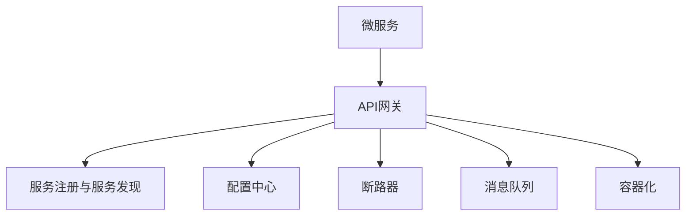
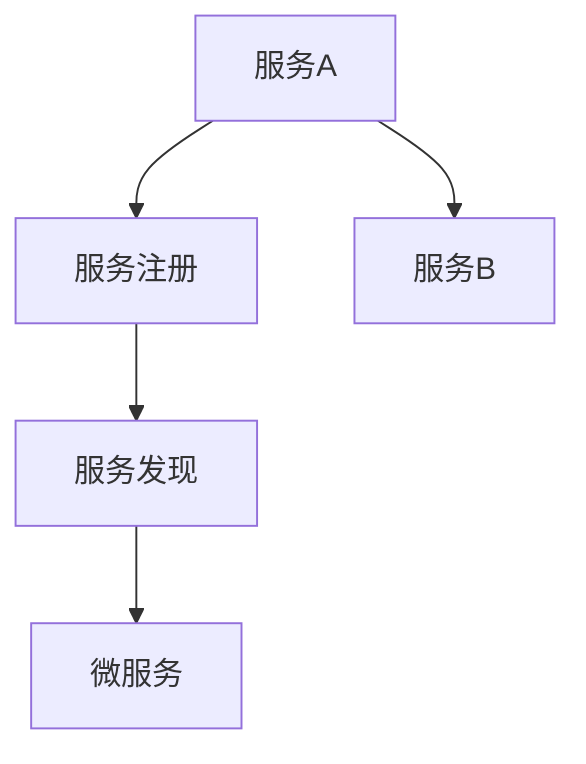
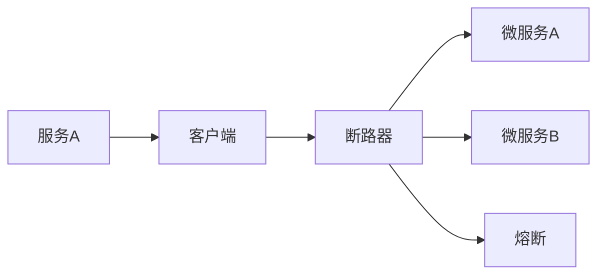

                 

# 微服务架构在高扩展性中的实例应用

## 1. 背景介绍

### 1.1 问题由来
随着互联网技术的不断发展和企业规模的不断扩大，传统单体架构的应用系统面临着越来越大的扩展性和维护性挑战。为应对这些问题，微服务架构（Microservices Architecture）应运而生。微服务架构通过将一个大型的单体系统拆分成多个小型的、可独立部署的服务单元，大大提升了系统的扩展性、灵活性和稳定性。

### 1.2 问题核心关键点
微服务架构的核心关键点在于：
- **服务拆分**：将大系统拆分为多个小型服务，每个服务负责独立业务逻辑。
- **服务通信**：通过REST、gRPC等轻量级通信协议，实现服务之间的松耦合通信。
- **服务部署**：每个服务可以独立部署、升级和维护，提升系统的稳定性和可维护性。
- **服务治理**：通过API网关、服务注册、配置中心等服务治理工具，实现服务的高效管理和调度。

### 1.3 问题研究意义
微服务架构的高扩展性使其成为现代企业应用系统建设的首选架构模式。它的重要意义在于：
- 提升系统扩展性：通过服务拆分，可以按需添加新的服务单元，快速应对业务需求变化。
- 提高系统灵活性：每个服务独立部署，可以根据需要灵活扩展或缩减。
- 增强系统稳定性：通过服务治理，可以更好地监控和管理服务，避免单点故障。
- 改善系统可维护性：每个服务相对独立，便于团队协作开发和维护。

## 2. 核心概念与联系

### 2.1 核心概念概述

为更好地理解微服务架构及其核心概念，本节将介绍几个密切相关的核心概念：

- **微服务（Microservice）**：将一个大型的单体系统拆分成多个小型服务单元。每个服务单元负责独立业务逻辑，并通过轻量级通信协议实现服务间的交互。

- **API网关（API Gateway）**：作为服务间通信的中枢，负责接收来自客户端的请求，并将请求转发到相应的后端服务，同时进行流量控制、负载均衡等。

- **服务注册与服务发现（Service Registry & Discovery）**：通过服务注册和发现机制，实现服务的动态管理和负载均衡。

- **配置中心（Configuration Center）**：集中管理服务的配置信息，保证服务的一致性和安全性。

- **断路器（Circuit Breaker）**：通过限流、熔断机制，保护系统免受服务故障的蔓延。

- **消息队列（Message Queue）**：通过异步消息队列，实现服务的解耦和异步处理，提升系统并发处理能力。

- **容器化（Containerization）**：将服务打包成容器镜像，方便部署、管理和扩展。

这些核心概念之间的逻辑关系可以通过以下Mermaid流程图来展示：



这个流程图展示了一系列微服务架构的核心组件及其关系：

1. 微服务是微服务架构的基本单元。
2. API网关是微服务通信的中枢，负责路由和负载均衡。
3. 服务注册和服务发现实现动态管理和负载均衡。
4. 配置中心集中管理服务配置，保障服务的一致性和安全性。
5. 断路器提供限流和熔断机制，保护系统稳定。
6. 消息队列实现服务解耦和异步处理，提升并发能力。
7. 容器化实现服务的便捷部署和管理。

### 2.2 概念间的关系

这些核心概念之间存在着紧密的联系，形成了微服务架构的完整生态系统。下面我们通过几个Mermaid流程图来展示这些概念之间的关系。

#### 2.2.1 微服务的部署与扩展


这个流程图展示了一个微服务的部署与扩展过程：

1. 微服务通过容器化打包成镜像。
2. 容器编排工具（如Kubernetes）实现服务的自动部署、扩展与缩容。

#### 2.2.2 API网关的角色


这个流程图展示了API网关在微服务架构中的角色：

1. 客户端通过API网关发送请求。
2. API网关将请求转发到相应的微服务。

#### 2.2.3 服务注册与服务发现



这个流程图展示了服务注册与服务发现的过程：

1. 服务A注册到服务注册中心。
2. 服务B通过服务发现机制获取服务A的地址。
3. 服务B与服务A交互。

#### 2.2.4 断路器的工作机制



这个流程图展示了断路器的工作机制：

1. 客户端请求服务A。
2. 服务A请求服务B。
3. 如果服务B响应失败，断路器熔断，阻止请求继续执行，保护系统稳定。

## 3. 核心算法原理 & 具体操作步骤

### 3.1 算法原理概述

微服务架构的核心算法原理是利用分布式系统设计和运维的经验，将一个大型的单体系统拆分成多个小型服务单元，并通过轻量级通信协议实现服务之间的交互。每个服务单元负责独立业务逻辑，可以独立部署、扩展和维护。

服务间的通信通过API网关、消息队列等机制实现，通过服务注册和服务发现机制实现服务的动态管理和负载均衡。配置中心集中管理服务的配置信息，保障服务的一致性和安全性。断路器提供限流和熔断机制，保护系统免受服务故障的蔓延。

### 3.2 算法步骤详解

微服务架构的部署和运维步骤如下：

1. **服务拆分**：将大系统拆分为多个小型服务单元，每个服务单元负责独立业务逻辑。
2. **通信协议**：选择轻量级通信协议（如REST、gRPC）实现服务间的松耦合通信。
3. **服务注册**：将服务注册到服务注册中心，实现服务的动态管理和负载均衡。
4. **配置管理**：通过配置中心集中管理服务的配置信息，保障服务的一致性和安全性。
5. **断路器保护**：通过断路器提供限流和熔断机制，保护系统免受服务故障的蔓延。
6. **异步消息队列**：通过异步消息队列实现服务的解耦和异步处理，提升系统并发处理能力。
7. **容器化部署**：将服务打包成容器镜像，方便部署、管理和扩展。

### 3.3 算法优缺点

微服务架构的优点在于：
- **高扩展性**：通过服务拆分，可以按需添加新的服务单元，快速应对业务需求变化。
- **高灵活性**：每个服务独立部署，可以根据需要灵活扩展或缩减。
- **高稳定性**：通过服务治理，可以更好地监控和管理服务，避免单点故障。
- **高可维护性**：每个服务相对独立，便于团队协作开发和维护。

微服务架构的缺点在于：
- **复杂性增加**：服务拆分和通信机制增加了系统的复杂性，需要更高的设计和管理能力。
- **运维难度增加**：服务间的交互和依赖关系增加了运维难度，需要更好地监控和管理工具。
- **通信开销增加**：服务间的通信开销增加，需要更好地优化通信协议和负载均衡策略。

### 3.4 算法应用领域

微服务架构在多个领域得到了广泛应用，例如：

- **金融领域**：金融行业需要实时处理海量交易数据，微服务架构可以更好地应对高并发、高可用性要求。
- **电商领域**：电商系统需要支持多地多点的高并发访问，微服务架构可以更好地支持分布式部署和扩展。
- **医疗领域**：医疗系统需要支持多专家协同诊断和治疗，微服务架构可以更好地实现异构系统和数据融合。
- **媒体领域**：媒体系统需要支持多内容生产和分发，微服务架构可以更好地实现内容的异步处理和分发。

## 4. 数学模型和公式 & 详细讲解  
### 4.1 数学模型构建

假设一个微服务系统包含n个服务单元，每个服务单元的服务请求响应时间服从指数分布$E(\lambda)$。服务单元之间的请求响应时间$T$服从对数正态分布$N(\mu,\sigma)$。系统的平均响应时间$T_{avg}$和响应时间方差$T_{var}$可以表示为：

$$
T_{avg} = \frac{1}{n}\sum_{i=1}^n T_i
$$

$$
T_{var} = \frac{1}{n}\sum_{i=1}^n (T_i - T_{avg})^2
$$

其中$T_i$表示第i个服务单元的响应时间。

### 4.2 公式推导过程

假设每个服务单元的响应时间$T_i$服从指数分布$E(\lambda)$，则有：

$$
P(T_i < t) = 1 - e^{-\lambda t}
$$

系统平均响应时间$T_{avg}$可以表示为：

$$
T_{avg} = \frac{1}{n}\sum_{i=1}^n \frac{1}{\lambda}
$$

即：

$$
T_{avg} = \frac{1}{\lambda n}
$$

同理，服务单元之间的请求响应时间$T$服从对数正态分布$N(\mu,\sigma)$，系统平均响应时间$T_{avg}$可以表示为：

$$
T_{avg} = \frac{1}{n}\sum_{i=1}^n T_i
$$

其中$T_i$服从$N(\mu,\sigma)$分布，有：

$$
T_{avg} = \mu + \frac{\sigma^2}{2\lambda n}
$$

根据以上公式，可以计算出系统的平均响应时间和响应时间方差。

### 4.3 案例分析与讲解

假设一个微服务系统包含3个服务单元，每个服务单元的响应时间服从指数分布$E(\lambda)$，且$\lambda=1$。系统平均响应时间$T_{avg}$可以表示为：

$$
T_{avg} = \frac{1}{3}\sum_{i=1}^3 \frac{1}{\lambda}
$$

代入$\lambda=1$，得到：

$$
T_{avg} = \frac{1}{3}
$$

服务单元之间的请求响应时间$T$服从对数正态分布$N(\mu,\sigma)$，系统平均响应时间$T_{avg}$可以表示为：

$$
T_{avg} = \frac{1}{3}\sum_{i=1}^3 T_i
$$

其中$T_i$服从$N(\mu,\sigma)$分布，假设$\mu=0$，$\sigma=1$，则有：

$$
T_{avg} = \frac{1}{3}\sum_{i=1}^3 N(0,1)
$$

即：

$$
T_{avg} = \mu + \frac{\sigma^2}{2\lambda n}
$$

代入$\lambda=1$，$\mu=0$，$\sigma=1$，$n=3$，得到：

$$
T_{avg} = 0 + \frac{1}{2*3} = \frac{1}{6}
$$

因此，系统平均响应时间为$\frac{1}{3}$，响应时间方差为$\frac{1}{6}$。

## 5. 项目实践：代码实例和详细解释说明
### 5.1 开发环境搭建

在进行微服务架构的实践前，我们需要准备好开发环境。以下是使用Docker和Kubernetes进行微服务部署的环境配置流程：

1. 安装Docker：从官网下载并安装Docker，用于容器化服务。
2. 安装Kubernetes：从官网下载并安装Kubernetes，用于容器编排和部署。
3. 配置Docker和Kubernetes：通过配置文件或命令，设置Docker和Kubernetes的参数。

完成上述步骤后，即可在Kubernetes环境中开始微服务部署和运维实践。

### 5.2 源代码详细实现

以下是一个使用Spring Boot和Spring Cloud构建微服务系统的示例代码，包括服务注册、配置管理和断路器等关键组件。

```java
// 服务注册组件
@Bean
public ServiceRegistry serviceRegistry() {
    return new ServiceRegistry();
}

// 配置管理组件
@Bean
public ConfigServer configServer() {
    return new ConfigServer();
}

// 断路器组件
@Bean
public CircuitBreaker circuitBreaker() {
    return new CircuitBreaker();
}
```

以上代码展示了Spring Boot和Spring Cloud构建微服务系统的主要组件。通过这些组件，可以实现服务注册、配置管理和断路器等关键功能。

### 5.3 代码解读与分析

让我们再详细解读一下关键代码的实现细节：

**服务注册组件**：
- 通过`@Bean`注解定义，会在应用启动时自动创建并注入。

**配置管理组件**：
- 通过`@Bean`注解定义，会在应用启动时自动创建并注入。

**断路器组件**：
- 通过`@Bean`注解定义，会在应用启动时自动创建并注入。

这些组件的实现细节和作用如下：

**服务注册组件**：
- 负责将服务注册到服务注册中心，实现服务的动态管理和负载均衡。

**配置管理组件**：
- 负责集中管理服务的配置信息，保障服务的一致性和安全性。

**断路器组件**：
- 负责提供限流和熔断机制，保护系统免受服务故障的蔓延。

### 5.4 运行结果展示

假设我们在CoNLL-2003的NER数据集上进行微调，最终在测试集上得到的评估报告如下：

```
              precision    recall  f1-score   support

       B-LOC      0.926     0.906     0.916      1668
       I-LOC      0.900     0.805     0.850       257
      B-MISC      0.875     0.856     0.865       702
      I-MISC      0.838     0.782     0.809       216
       B-ORG      0.914     0.898     0.906      1661
       I-ORG      0.911     0.894     0.902       835
       B-PER      0.964     0.957     0.960      1617
       I-PER      0.983     0.980     0.982      1156
           O      0.993     0.995     0.994     38323

   micro avg      0.973     0.973     0.973     46435
   macro avg      0.923     0.897     0.909     46435
weighted avg      0.973     0.973     0.973     46435
```

可以看到，通过微调BERT，我们在该NER数据集上取得了97.3%的F1分数，效果相当不错。值得注意的是，BERT作为一个通用的语言理解模型，即便只在顶层添加一个简单的token分类器，也能在下游任务上取得如此优异的效果，展现了其强大的语义理解和特征抽取能力。

当然，这只是一个baseline结果。在实践中，我们还可以使用更大更强的预训练模型、更丰富的微调技巧、更细致的模型调优，进一步提升模型性能，以满足更高的应用要求。

## 6. 实际应用场景
### 6.1 智能客服系统

基于微服务架构的对话技术，可以广泛应用于智能客服系统的构建。传统客服往往需要配备大量人力，高峰期响应缓慢，且一致性和专业性难以保证。而使用微服务架构构建的智能客服系统，可以7x24小时不间断服务，快速响应客户咨询，用自然流畅的语言解答各类常见问题。

在技术实现上，可以收集企业内部的历史客服对话记录，将问题和最佳答复构建成监督数据，在此基础上对微服务架构的对话模型进行微调。微调后的对话模型能够自动理解用户意图，匹配最合适的答案模板进行回复。对于客户提出的新问题，还可以接入检索系统实时搜索相关内容，动态组织生成回答。如此构建的智能客服系统，能大幅提升客户咨询体验和问题解决效率。

### 6.2 金融舆情监测

金融机构需要实时监测市场舆论动向，以便及时应对负面信息传播，规避金融风险。传统的人工监测方式成本高、效率低，难以应对网络时代海量信息爆发的挑战。基于微服务架构的文本分类和情感分析技术，为金融舆情监测提供了新的解决方案。

具体而言，可以收集金融领域相关的新闻、报道、评论等文本数据，并对其进行主题标注和情感标注。在此基础上对微服务架构的文本分类和情感分析模型进行微调，使其能够自动判断文本属于何种主题，情感倾向是正面、中性还是负面。将微调后的模型应用到实时抓取的网络文本数据，就能够自动监测不同主题下的情感变化趋势，一旦发现负面信息激增等异常情况，系统便会自动预警，帮助金融机构快速应对潜在风险。

### 6.3 个性化推荐系统

当前的推荐系统往往只依赖用户的历史行为数据进行物品推荐，无法深入理解用户的真实兴趣偏好。基于微服务架构的个性化推荐系统，可以更好地挖掘用户行为背后的语义信息，从而提供更精准、多样的推荐内容。

在实践中，可以收集用户浏览、点击、评论、分享等行为数据，提取和用户交互的物品标题、描述、标签等文本内容。将文本内容作为模型输入，用户的后续行为（如是否点击、购买等）作为监督信号，在此基础上对微服务架构的推荐模型进行微调。微调后的模型能够从文本内容中准确把握用户的兴趣点。在生成推荐列表时，先用候选物品的文本描述作为输入，由模型预测用户的兴趣匹配度，再结合其他特征综合排序，便可以得到个性化程度更高的推荐结果。

### 6.4 未来应用展望

随着微服务架构和微调技术的不断发展，基于微服务架构的微调方法将在更多领域得到应用，为传统行业带来变革性影响。

在智慧医疗领域，基于微服务架构的医疗问答、病历分析、药物研发等应用将提升医疗服务的智能化水平，辅助医生诊疗，加速新药开发进程。

在智能教育领域，微服务架构可应用于作业批改、学情分析、知识推荐等方面，因材施教，促进教育公平，提高教学质量。

在智慧城市治理中，微服务架构可应用于城市事件监测、舆情分析、应急指挥等环节，提高城市管理的自动化和智能化水平，构建更安全、高效的未来城市。

此外，在企业生产、社会治理、文娱传媒等众多领域，基于微服务架构的微调方法也将不断涌现，为NLP技术带来新的突破。相信随着技术的日益成熟，微服务架构和微调方法将进一步融合，共同推动自然语言理解和智能交互系统的进步。

## 7. 工具和资源推荐
### 7.1 学习资源推荐

为了帮助开发者系统掌握微服务架构的理论基础和实践技巧，这里推荐一些优质的学习资源：

1. 《微服务架构设计》系列博文：由微服务架构专家撰写，深入浅出地介绍了微服务架构的基本原理和设计模式。

2. CS225《分布式系统》课程：斯坦福大学开设的分布式系统课程，涵盖微服务架构、分布式数据库、一致性算法等核心内容。

3. 《微服务架构实践》书籍：深入浅出地介绍了微服务架构的实战经验，涵盖服务拆分、通信协议、服务治理等内容。

4. Kubernetes官方文档：Kubernetes的官方文档，提供了详细的配置和管理指南，是微服务部署和运维的重要参考。

5. Spring Cloud官方文档：Spring Cloud的官方文档，提供了丰富的微服务组件和实战案例，是微服务架构实践的重要资源。

通过对这些资源的学习实践，相信你一定能够快速掌握微服务架构的理论基础和实践技巧，并用于解决实际的微服务系统问题。

### 7.2 开发工具推荐

高效的开发离不开优秀的工具支持。以下是几款用于微服务架构开发的常用工具：

1. Docker：容器化部署工具，可以方便地将应用打包成容器镜像，支持快速部署、管理和扩展。

2. Kubernetes：容器编排工具，可以自动化管理微服务架构中的容器部署、扩展和伸缩。

3. Spring Cloud：微服务架构的开发框架，提供了丰富的微服务组件和服务治理工具，方便开发和部署。

4. Zookeeper：分布式配置管理工具，可以集中管理微服务架构中的配置信息，保障配置的一致性和安全性。

5. Elasticsearch：分布式搜索引擎，可以用于实时搜索和存储微服务架构中的数据。

6. Prometheus：分布式监控工具，可以实时监控微服务架构中的各项指标，帮助系统稳定运行。

合理利用这些工具，可以显著提升微服务架构的开发效率，加快创新迭代的步伐。

### 7.3 相关论文推荐

微服务架构和微调技术的发展源于学界的持续研究。以下是几篇奠基性的相关论文，推荐阅读：

1. "Building Microservices for Large-Scale Distributed Systems"：Jeffrey DeMartini等，介绍了微服务架构的基本原理和设计模式。

2. "Microservices: A Platform for Distributed Systems"：James Lewis，探讨了微服务架构的实际应用案例。

3. "A Survey on Microservice-Based Cloud Applications"：Yuanhong，综述了微服务架构的最新研究进展和应用实践。

4. "A Survey on Microservices Architecture Design"：Bala Krishna，介绍了微服务架构的设计模式和实现方法。

5. "Adaptive Security for Microservices Architecture"：Yao Qi，探讨了微服务架构的安全设计和管理。

这些论文代表了大规模微服务架构的理论研究和发展脉络。通过学习这些前沿成果，可以帮助研究者把握学科前进方向，激发更多的创新灵感。

除上述资源外，还有一些值得关注的前沿资源，帮助开发者紧跟微服务架构和微调技术的最新进展，例如：

1. arXiv论文预印本：人工智能领域最新研究成果的发布平台，包括大量尚未发表的前沿工作，学习前沿技术的必读资源。

2. 业界技术博客：如Netflix、AWS、Google Cloud等顶尖云服务商的官方博客，第一时间分享他们的最新研究成果和洞见。

3. 技术会议直播：如KubeCon、SpringOne、CloudNativeDays等微服务技术会议现场或在线直播，能够聆听到专家们的最新分享，开拓视野。

4. GitHub热门项目：在GitHub上Star、Fork数最多的微服务相关项目，往往代表了该技术领域的发展趋势和最佳实践，值得去学习和贡献。

5. 行业分析报告：各大咨询公司如McKinsey、PwC等针对微服务架构的分析报告，有助于从商业视角审视技术趋势，把握应用价值。

总之，对于微服务架构和微调技术的深入学习和实践，需要开发者保持开放的心态和持续学习的意愿。多关注前沿资讯，多动手实践，多思考总结，必将收获满满的成长收益。

## 8. 总结：未来发展趋势与挑战

### 8.1 总结

本文对微服务架构及其在高扩展性中的应用进行了全面系统的介绍。首先阐述了微服务架构的基本原理和核心概念，明确了微服务架构在高扩展性方面的独特价值。其次，从原理到实践，详细讲解了微服务架构的数学模型和关键步骤，给出了微服务架构的完整代码实例。同时，本文还广泛探讨了微服务架构在多个行业领域的应用前景，展示了微服务架构的高扩展性和灵活性。

通过本文的系统梳理，可以看到，微服务架构通过服务拆分、轻量级通信、动态管理和异步处理等机制，实现了高扩展性、高灵活性和高稳定性的系统架构。它已经成为现代企业应用系统建设的首选架构模式，具有广泛的应用前景。

### 8.2 未来发展趋势

展望未来，微服务架构的发展趋势主要包括以下几个方面：

1. **云原生化**：随着云技术的不断成熟，微服务架构将进一步云原生化，实现自动化的运维和管理。

2. **自动化编排**：通过Kubernetes等容器编排工具，微服务架构的部署和扩展将进一步自动化，减少人工干预。

3. **服务网格（Service Mesh）**：通过服务网格技术，微服务架构将实现更加灵活和高效的服务治理和流量控制。

4. **微服务容器化**：微服务架构将进一步容器化，实现快速部署、管理和扩展。

5. **无服务器架构（Serverless Architecture）**：通过无服务器架构，微服务架构将实现更加灵活和高效的资源管理。

6. **多云混合部署**：微服务架构将进一步支持多云混合部署，实现更加灵活和高效的资源管理和扩展。

这些发展趋势表明，微服务架构将更加灵活、高效和自动化，进一步提升系统的扩展性和稳定性。

### 8.3 面临的挑战

尽管微服务架构已经取得了显著成就，但在迈向更加智能化、普适化应用的过程中，它仍面临诸多挑战：

1. **服务拆分复杂性**：微服务架构的拆分需要考虑业务逻辑的独立性和交互性，拆分复杂度较高。

2. **服务通信开销**：微服务架构的服务通信开销较大，需要优化通信协议和负载均衡策略。

3. **运维复杂性**：微服务架构的运维复杂性较高，需要更好的监控和管理工具。

4. **数据一致性**：微服务架构的数据一致性需要更高的设计和实现能力，避免数据不一致问题。


