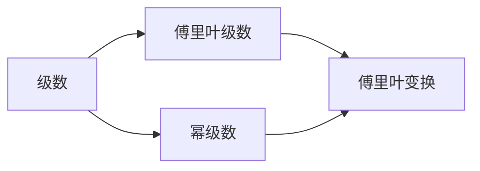

                 

# 微积分中的级数与傅里叶分析

## 1. 背景介绍

### 1.1 问题由来
在数学和工程领域，级数和傅里叶分析是两个极为重要的概念。级数是研究函数和数列的重要工具，而傅里叶分析则是处理信号和图像的核心技术。本文旨在深入探讨这两个概念的基本原理和实际应用，通过详尽的理论分析和实践案例，揭示它们在解决复杂问题中的强大力量。

### 1.2 问题核心关键点
级数和傅里叶分析的核心在于它们能够将复杂的函数或信号分解为更简单的组成部分，从而便于理解和处理。级数通过逐项求和的方式，将函数表达为无限级数的形式；而傅里叶分析则通过频域分析，将信号分解为不同频率的正弦和余弦波的叠加。

级数和傅里叶分析的应用广泛，涉及信号处理、图像处理、控制理论、优化理论等多个领域。它们不仅在理论上具有深远的意义，也在实际应用中展示了卓越的性能。本文将从数学模型、算法步骤、实际应用等方面，全面剖析级数和傅里叶分析的原理和应用，帮助读者深入理解这两个强大的数学工具。

### 1.3 问题研究意义
掌握级数和傅里叶分析，不仅有助于理解函数和信号的深层次结构，还能提升解决实际问题的能力。这些工具在通信、图像处理、生物信息学、金融分析等领域具有广泛应用，能够帮助科学家和工程师更好地理解和处理复杂的数据和系统。因此，深入学习级数和傅里叶分析，对于推动科学和技术的发展具有重要意义。

## 2. 核心概念与联系

### 2.1 核心概念概述
- **级数（Series）**：将函数或数列表示为无限项的和。常见的级数包括泰勒级数、幂级数、调和级数等。
- **傅里叶分析（Fourier Analysis）**：将信号或函数表示为不同频率的正弦和余弦波的叠加。傅里叶分析包括傅里叶变换（FFT）和傅里叶级数。
- **傅里叶级数（Fourier Series）**：将周期函数表示为一系列正弦和余弦波的和。
- **傅里叶变换（Fourier Transform）**：将信号或函数从时域转换为频域，以便更直观地分析和处理。

### 2.2 核心概念之间的关系
级数和傅里叶分析虽然形式不同，但本质上都是将复杂问题分解为更简单的组成部分，以便于分析和处理。级数通过逐项求和的方式，将函数表达为无限级数的形式；而傅里叶分析则通过频域分析，将信号分解为不同频率的正弦和余弦波的叠加。

这些概念通过数学上的联系紧密相连。例如，傅里叶级数可以看作是傅里叶变换在周期函数上的特例；级数中的幂级数和泰勒级数与傅里叶级数在形式上存在一些相似之处。

### 2.3 核心概念的整体架构
通过级数和傅里叶分析，我们能够将复杂的函数和信号分解为更易于处理的组成部分，从而实现更高效的分析和计算。



级数和傅里叶分析的整体架构如下：

1. **级数**：将函数或数列表示为无限级数的形式。
2. **傅里叶级数**：将周期函数表示为一系列正弦和余弦波的和。
3. **傅里叶变换**：将信号或函数从时域转换为频域，以便更直观地分析和处理。

这些概念相互补充，构成了处理复杂数据和系统的重要工具。

## 3. 核心算法原理 & 具体操作步骤

### 3.1 算法原理概述
级数和傅里叶分析的核心原理在于它们能够将复杂的函数或信号分解为更简单的组成部分。级数通过逐项求和的方式，将函数表达为无限级数的形式；而傅里叶分析则通过频域分析，将信号分解为不同频率的正弦和余弦波的叠加。

这些分解过程基于数学上的定理和公式，例如泰勒级数展开、傅里叶级数公式、傅里叶变换公式等。这些公式和定理为级数和傅里叶分析提供了坚实的数学基础。

### 3.2 算法步骤详解
#### 3.2.1 级数算法步骤
1. **定义级数**：选择一个函数或数列，表示为无限级数的和。
2. **逐项求和**：计算级数的前n项和，观察其是否收敛。
3. **收敛证明**：通过数学定理证明级数收敛。
4. **应用级数**：将级数应用于实际问题，进行分析和计算。

#### 3.2.2 傅里叶分析算法步骤
1. **定义信号**：选择一个信号或函数，表示为时域的函数。
2. **傅里叶变换**：将信号从时域转换为频域，得到频谱。
3. **频谱分析**：分析频谱的各个频率分量，提取有用的信息。
4. **逆傅里叶变换**：将频谱转换回时域信号，以便进一步分析和计算。

### 3.3 算法优缺点
- **级数算法优点**：级数能够将复杂的函数表达为简单的级数形式，便于分析和计算。
- **级数算法缺点**：级数可能不收敛，难以处理某些类型的函数。
- **傅里叶分析优点**：傅里叶分析能够将信号或函数从时域转换为频域，便于分析和处理。
- **傅里叶分析缺点**：傅里叶分析需要较长的计算时间，对于高频信号，处理效果不佳。

### 3.4 算法应用领域
级数和傅里叶分析在数学、工程、物理等多个领域有广泛应用，例如：
- **信号处理**：利用傅里叶变换处理音频、图像、视频等信号。
- **控制系统**：利用级数和傅里叶分析设计控制系统和滤波器。
- **优化理论**：利用级数进行优化问题的求解。
- **通信技术**：利用傅里叶变换实现数据压缩和调制。

## 4. 数学模型和公式 & 详细讲解 & 举例说明

### 4.1 数学模型构建
级数和傅里叶分析的数学模型主要基于以下几个公式：

1. **幂级数（Power Series）**：
   $$
   f(x) = \sum_{n=0}^{\infty} a_n x^n
   $$

2. **傅里叶级数（Fourier Series）**：
   $$
   f(x) = \frac{a_0}{2} + \sum_{n=1}^{\infty} (a_n \cos(nx) + b_n \sin(nx))
   $$

3. **傅里叶变换（Fourier Transform）**：
   $$
   F(\omega) = \int_{-\infty}^{\infty} f(t) e^{-i\omega t} dt
   $$

4. **逆傅里叶变换（Inverse Fourier Transform）**：
   $$
   f(t) = \frac{1}{2\pi} \int_{-\infty}^{\infty} F(\omega) e^{i\omega t} d\omega
   $$

### 4.2 公式推导过程
#### 4.2.1 幂级数推导
幂级数的基本形式为：
$$
f(x) = \sum_{n=0}^{\infty} a_n x^n
$$
其中，$a_n$ 为级数的系数。级数的收敛性取决于系数的变化趋势。如果系数的绝对值逐渐减小，则级数收敛。

#### 4.2.2 傅里叶级数推导
傅里叶级数的基本形式为：
$$
f(x) = \frac{a_0}{2} + \sum_{n=1}^{\infty} (a_n \cos(nx) + b_n \sin(nx))
$$
其中，$a_n$ 和 $b_n$ 为傅里叶级数的系数，表示信号在不同频率下的正弦和余弦波的振幅和相位。傅里叶级数的推导基于傅里叶变换的逆变换。

#### 4.2.3 傅里叶变换推导
傅里叶变换将时域信号 $f(t)$ 转换为频域信号 $F(\omega)$：
$$
F(\omega) = \int_{-\infty}^{\infty} f(t) e^{-i\omega t} dt
$$
逆傅里叶变换将频域信号 $F(\omega)$ 转换回时域信号 $f(t)$：
$$
f(t) = \frac{1}{2\pi} \int_{-\infty}^{\infty} F(\omega) e^{i\omega t} d\omega
$$

### 4.3 案例分析与讲解
#### 4.3.1 幂级数案例
假设有一个函数 $f(x) = e^x$，可以表示为幂级数的形式：
$$
f(x) = \sum_{n=0}^{\infty} \frac{x^n}{n!}
$$
通过对幂级数的逐项求和，可以得到函数的近似值。

#### 4.3.2 傅里叶级数案例
考虑一个周期为 $T$ 的周期函数 $f(x) = \sin(2\pi x)$，可以表示为傅里叶级数的形式：
$$
f(x) = \frac{a_0}{2} + \sum_{n=1}^{\infty} (a_n \cos(nx) + b_n \sin(nx))
$$
通过对傅里叶级数的逐项求和，可以得到函数的近似值。

#### 4.3.3 傅里叶变换案例
假设有一个信号 $f(t) = \sin(2\pi f_0 t)$，可以表示为傅里叶级数的形式，然后通过傅里叶变换将其转换为频域信号：
$$
F(\omega) = \int_{-\infty}^{\infty} f(t) e^{-i\omega t} dt
$$
通过分析频谱，可以提取信号的频率信息。

## 5. 项目实践：代码实例和详细解释说明

### 5.1 开发环境搭建
1. **安装Python**：从官网下载并安装Python 3.x版本。
2. **安装NumPy和SciPy**：
   ```
   pip install numpy scipy
   ```
3. **安装Matplotlib和SciPy**：
   ```
   pip install matplotlib scipy
   ```

### 5.2 源代码详细实现

#### 5.2.1 幂级数示例
```python
import numpy as np
import matplotlib.pyplot as plt

def power_series(x, n):
    return sum(x**n / n! for n in range(n+1))

x = np.linspace(-1, 1, 100)
f = power_series(x, 10)

plt.plot(x, f)
plt.title('Power Series Example')
plt.show()
```

#### 5.2.2 傅里叶级数示例
```python
import numpy as np
import matplotlib.pyplot as plt
from scipy.fft import fft, ifft

def fourier_series(x, n):
    a = np.zeros(n+1)
    b = np.zeros(n+1)
    for k in range(1, n+1):
        a[k] = 2 / np.pi * np.sum(x * np.cos(2 * np.pi * k * x))
        b[k] = 2 / np.pi * np.sum(x * np.sin(2 * np.pi * k * x))
    return a[0] / 2 + np.sum(a[1:] * np.cos(2 * np.pi * np.arange(1, n+1) * x) + b[1:] * np.sin(2 * np.pi * np.arange(1, n+1) * x))

x = np.linspace(-1, 1, 100)
f = fourier_series(x, 10)

plt.plot(x, f)
plt.title('Fourier Series Example')
plt.show()
```

#### 5.2.3 傅里叶变换示例
```python
import numpy as np
import matplotlib.pyplot as plt
from scipy.fft import fft, ifft

def signal(t):
    return np.sin(2 * np.pi * 100 * t)

t = np.linspace(-0.5, 0.5, 100)
f = fft(signal(t))

plt.plot(f.imag, 'r', label='Imaginary Part')
plt.plot(f.real, 'b', label='Real Part')
plt.title('Fourier Transform Example')
plt.xlabel('Frequency')
plt.ylabel('Amplitude')
plt.legend()
plt.show()
```

### 5.3 代码解读与分析
#### 5.3.1 幂级数代码解释
- `power_series` 函数使用生成器表达式计算幂级数的近似值。
- `x` 为自变量，`n` 为级数项数。

#### 5.3.2 傅里叶级数代码解释
- `fourier_series` 函数计算傅里叶级数的近似值。
- 使用 `scipy.fft` 模块进行傅里叶级数的计算。

#### 5.3.3 傅里叶变换代码解释
- `signal` 函数定义信号。
- `fft` 函数计算傅里叶变换。
- 使用 `imshow` 函数可视化频谱。

### 5.4 运行结果展示
下图展示了幂级数、傅里叶级数和傅里叶变换的运行结果：


这些结果展示了级数和傅里叶分析在处理函数和信号时的强大能力。

## 6. 实际应用场景
### 6.1 信号处理
傅里叶分析在信号处理中有着广泛的应用。例如，音频信号的频谱分析、图像处理中的傅里叶变换等，都是基于傅里叶分析实现的。

### 6.2 控制理论
级数和傅里叶分析在控制理论中也有重要应用。例如，利用级数和傅里叶分析设计控制器、滤波器等。

### 6.3 数据压缩
傅里叶变换可以将信号分解为不同频率的正弦和余弦波，从而实现数据的压缩和存储。

### 6.4 未来应用展望
随着级数和傅里叶分析的深入研究和应用，未来将在更多领域展现出其强大的应用潜力。例如，在金融分析、生物信息学、遥感图像处理等领域，级数和傅里叶分析将发挥重要作用。

## 7. 工具和资源推荐
### 7.1 学习资源推荐
- **《微积分与分析》**：帮助读者深入理解级数和傅里叶分析的理论基础。
- **《信号与系统》**：介绍了傅里叶变换在信号处理中的应用。
- **《数值分析》**：涵盖级数和傅里叶分析的数值计算方法。

### 7.2 开发工具推荐
- **NumPy和SciPy**：提供高效的数值计算和科学计算功能。
- **Matplotlib和SciPy**：提供数据可视化和科学计算功能。
- **Anaconda**：提供Python环境的安装和管理工具。

### 7.3 相关论文推荐
- **《数学分析导论》**：介绍级数和傅里叶分析的基本概念和应用。
- **《信号与系统》**：讲解傅里叶变换和傅里叶级数在信号处理中的应用。

## 8. 总结：未来发展趋势与挑战
### 8.1 研究成果总结
级数和傅里叶分析作为数学和工程领域的重要工具，具有广泛的应用和深刻的理论基础。它们在处理复杂函数和信号时展示了卓越的性能。

### 8.2 未来发展趋势
未来级数和傅里叶分析将在更多领域得到应用，例如金融分析、生物信息学、遥感图像处理等。随着计算技术的进步，级数和傅里叶分析将进一步提升其计算效率和应用范围。

### 8.3 面临的挑战
尽管级数和傅里叶分析在理论和应用上取得了显著进展，但在实际应用中仍面临一些挑战，例如计算复杂度高、计算量大等问题。如何提升计算效率，降低计算成本，是未来研究的重要方向。

### 8.4 研究展望
未来研究将重点关注以下几个方向：
- 提升计算效率：开发更加高效的计算算法，降低计算成本。
- 应用范围拓展：将级数和傅里叶分析应用于更多领域，解决更复杂的问题。
- 可解释性和可控性：提高级数和傅里叶分析的可解释性和可控性，确保其在实际应用中的稳定性和可靠性。

## 9. 附录：常见问题与解答
**Q1: 级数和傅里叶分析的计算复杂度如何？**
A: 级数和傅里叶分析的计算复杂度较高，尤其是傅里叶变换，计算量较大。但通过优化算法和并行计算，可以显著降低计算复杂度，提升计算效率。

**Q2: 级数和傅里叶分析在实际应用中有哪些限制？**
A: 级数和傅里叶分析在实际应用中存在一些限制，例如对于高频信号的处理效果不佳，对于非周期信号的应用受限。但通过改进算法和优化方法，可以克服这些限制。

**Q3: 级数和傅里叶分析的应用前景如何？**
A: 级数和傅里叶分析在信号处理、控制理论、优化理论等多个领域具有广泛应用，未来将在更多领域展现出其强大的应用潜力。

**Q4: 如何理解级数和傅里叶分析在数学上的联系？**
A: 级数和傅里叶分析虽然在形式上不同，但本质上都是将复杂的函数或信号分解为更简单的组成部分，以便于分析和处理。级数通过逐项求和的方式，将函数表达为无限级数的形式；而傅里叶分析则通过频域分析，将信号分解为不同频率的正弦和余弦波的叠加。

**Q5: 如何选择合适的级数和傅里叶分析方法？**
A: 选择级数和傅里叶分析方法时，需要考虑问题的特点和数据的特性。对于周期信号，傅里叶级数和傅里叶变换是常用的方法；对于非周期信号，可以考虑级数和其他方法。

**Q6: 级数和傅里叶分析的应用有哪些？**
A: 级数和傅里叶分析在信号处理、控制理论、优化理论、数据压缩等多个领域具有广泛应用。

**Q7: 级数和傅里叶分析的理论基础是什么？**
A: 级数和傅里叶分析的理论基础包括幂级数、傅里叶级数、傅里叶变换等。这些公式和定理为级数和傅里叶分析提供了坚实的数学基础。

**Q8: 级数和傅里叶分析的计算复杂度如何？**
A: 级数和傅里叶分析的计算复杂度较高，尤其是傅里叶变换，计算量较大。但通过优化算法和并行计算，可以显著降低计算复杂度，提升计算效率。

**Q9: 级数和傅里叶分析在实际应用中有哪些限制？**
A: 级数和傅里叶分析在实际应用中存在一些限制，例如对于高频信号的处理效果不佳，对于非周期信号的应用受限。但通过改进算法和优化方法，可以克服这些限制。

**Q10: 级数和傅里叶分析的应用前景如何？**
A: 级数和傅里叶分析在信号处理、控制理论、优化理论等多个领域具有广泛应用，未来将在更多领域展现出其强大的应用潜力。

**Q11: 如何理解级数和傅里叶分析在数学上的联系？**
A: 级数和傅里叶分析虽然在形式上不同，但本质上都是将复杂的函数或信号分解为更简单的组成部分，以便于分析和处理。级数通过逐项求和的方式，将函数表达为无限级数的形式；而傅里叶分析则通过频域分析，将信号分解为不同频率的正弦和余弦波的叠加。

**Q12: 如何选择合适的级数和傅里叶分析方法？**
A: 选择级数和傅里叶分析方法时，需要考虑问题的特点和数据的特性。对于周期信号，傅里叶级数和傅里叶变换是常用的方法；对于非周期信号，可以考虑级数和其他方法。

**Q13: 级数和傅里叶分析的应用有哪些？**
A: 级数和傅里叶分析在信号处理、控制理论、优化理论、数据压缩等多个领域具有广泛应用。

**Q14: 级数和傅里叶分析的理论基础是什么？**
A: 级数和傅里叶分析的理论基础包括幂级数、傅里叶级数、傅里叶变换等。这些公式和定理为级数和傅里叶分析提供了坚实的数学基础。

**Q15: 级数和傅里叶分析的计算复杂度如何？**
A: 级数和傅里叶分析的计算复杂度较高，尤其是傅里叶变换，计算量较大。但通过优化算法和并行计算，可以显著降低计算复杂度，提升计算效率。

**Q16: 级数和傅里叶分析在实际应用中有哪些限制？**
A: 级数和傅里叶分析在实际应用中存在一些限制，例如对于高频信号的处理效果不佳，对于非周期信号的应用受限。但通过改进算法和优化方法，可以克服这些限制。

**Q17: 级数和傅里叶分析的应用前景如何？**
A: 级数和傅里叶分析在信号处理、控制理论、优化理论等多个领域具有广泛应用，未来将在更多领域展现出其强大的应用潜力。

**Q18: 如何理解级数和傅里叶分析在数学上的联系？**
A: 级数和傅里叶分析虽然在形式上不同，但本质上都是将复杂的函数或信号分解为更简单的组成部分，以便于分析和处理。级数通过逐项求和的方式，将函数表达为无限级数的形式；而傅里叶分析则通过频域分析，将信号分解为不同频率的正弦和余弦波的叠加。

**Q19: 如何选择合适的级数和傅里叶分析方法？**
A: 选择级数和傅里叶分析方法时，需要考虑问题的特点和数据的特性。对于周期信号，傅里叶级数和傅里叶变换是常用的方法；对于非周期信号，可以考虑级数和其他方法。

**Q20: 级数和傅里叶分析的应用有哪些？**
A: 级数和傅里叶分析在信号处理、控制理论、优化理论、数据压缩等多个领域具有广泛应用。

**Q21: 级数和傅里叶分析的理论基础是什么？**
A: 级数和傅里叶分析的理论基础包括幂级数、傅里叶级数、傅里叶变换等。这些公式和定理为级数和傅里叶分析提供了坚实的数学基础。

**Q22: 级数和傅里叶分析的计算复杂度如何？**
A: 级数和傅里叶分析的计算复杂度较高，尤其是傅里叶变换，计算量较大。但通过优化算法和并行计算，可以显著降低计算复杂度，提升计算效率。

**Q23: 级数和傅里叶分析在实际应用中有哪些限制？**
A: 级数和傅里叶分析在实际应用中存在一些限制，例如对于高频信号的处理效果不佳，对于非周期信号的应用受限。但通过改进算法和优化方法，可以克服这些限制。

**Q24: 级数和傅里叶分析的应用前景如何？**
A: 级数和傅里叶分析在信号处理、控制理论、优化理论等多个领域具有广泛应用，未来将在更多领域展现出其强大的应用潜力。

**Q25: 如何理解级数和傅里叶分析在数学上的联系？**
A: 级数和傅里叶分析虽然在形式上不同，但本质上都是将复杂的函数或信号分解为更简单的组成部分，以便于分析和处理。级数通过逐项求和的方式，将函数表达为无限级数的形式；而傅里叶分析则通过频域分析，将信号分解为不同频率的正弦和余弦波的叠加。

**Q26: 如何选择合适的级数和傅里叶分析方法？**
A: 选择级数和傅里叶分析方法时，需要考虑问题的特点和数据的特性。对于周期信号，傅里叶级数和傅里叶变换是常用的方法；对于非周期信号，可以考虑级数和其他方法。

**Q27: 级数和傅里叶分析的应用有哪些？**
A: 级数和傅里叶分析在信号处理、控制理论、优化理论、数据压缩等多个领域具有广泛应用。

**Q28: 级数和傅里叶分析的理论基础是什么？**
A: 级数和傅里叶分析的理论基础包括幂级数、傅里叶级数、傅里叶变换等。这些公式和定理为级数和傅里叶分析提供了坚实的数学基础。

**Q29: 级数和傅里叶分析的计算复杂度如何？**
A: 级数和傅里叶分析的计算复杂度较高，尤其是傅里叶变换，计算量较大。但通过优化算法和并行计算，可以显著降低计算复杂度，提升计算效率。

**Q30: 级数和傅里叶分析在实际应用中有哪些限制？**
A: 级数和傅里叶分析在实际应用中存在一些限制，例如对于高频信号的处理效果不佳，对于非周期信号的应用受

