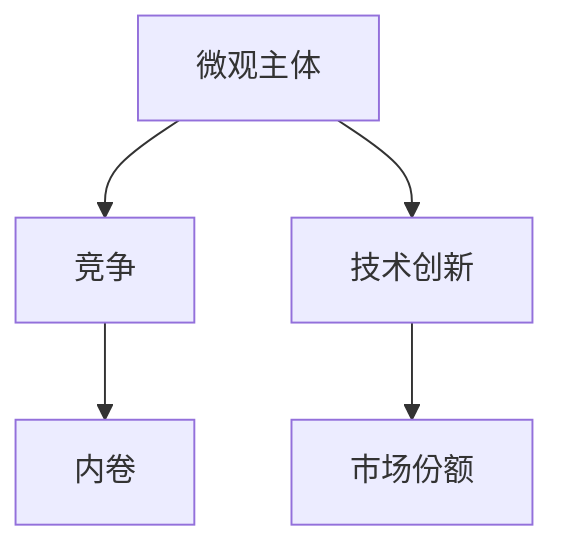
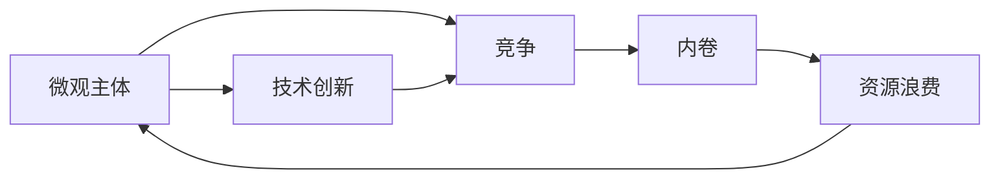

                 

## 1. 背景介绍

在过去的几十年里，人工智能（AI）技术的快速发展使得微处理器性能和计算能力达到了前所未有的高度。然而，随着计算能力的提升，微型化市场竞争的激烈程度也随之增加，尤其是在通用计算领域，芯片制造公司面临着来自各方强劲的竞争压力。这种竞争不仅限于产品性能，还包括技术创新、成本控制和市场需求。竞争的加剧导致公司不得不加大研发投入，以确保在激烈的市场竞争中保持优势。

这种微观主体间的竞争与内卷现象，在芯片设计和制造领域尤为显著。随着市场需求的不断变化和技术的快速迭代，芯片设计和制造公司必须不断调整产品设计和工艺流程，以应对市场需求和市场竞争。这种动态调整的过程，不仅增加了研发成本，还可能导致过度竞争和资源浪费。

本文将探讨微观主体间竞争与内卷现象的现状、成因以及应对策略，同时，我们还将讨论一些关键技术如虚拟化、AI加速等，这些技术在缓解内卷现象方面可能发挥的作用。

## 2. 核心概念与联系

### 2.1 核心概念概述

为了更好地理解微观主体间竞争与内卷现象，我们先介绍几个核心概念及其相互关系：

- **微观主体**：在芯片设计和制造领域，微观主体通常指的是芯片设计和制造公司，如Intel、AMD、NVIDIA等。这些公司直接参与市场竞争，通过技术创新和市场策略争夺市场份额。
- **内卷**：在经济学中，内卷指的是资源过剩导致过度竞争的现象。在微处理器市场中，内卷体现在市场供过于求，竞争激烈，导致研发投入加大，而产品性能提升有限。
- **竞争**：指微观主体间的市场争夺，包括产品性能、市场份额、研发投入等方面的竞争。
- **技术创新**：指通过新技术、新工艺等手段提升产品性能，增强市场竞争力的过程。

这些概念通过以下Mermaid流程图展示其相互关系：



### 2.2 概念间的关系

上述概念之间的逻辑关系可以通过以下Mermaid流程图来展示：



这个流程图展示了微观主体间的竞争与内卷现象的相互关系及其成因。竞争和内卷互为因果，技术创新能够缓解竞争压力，但过度的技术创新可能导致内卷，进而导致资源浪费。

## 3. 核心算法原理 & 具体操作步骤

### 3.1 算法原理概述

微观主体间竞争与内卷现象的算法原理可以通过博弈论中的Nash均衡和市场均衡理论进行解释。在博弈论中，每个微观主体（如芯片设计和制造公司）都希望最大化自身的收益，这种收益包括市场份额和产品性能。为了达到这一目标，微观主体之间会进行各种策略和竞争，最终形成一个稳定的竞争状态，即Nash均衡。

市场均衡理论进一步解释了内卷现象。在微处理器市场中，如果市场供给过剩，导致价格下降，微观主体之间的竞争就会加剧，导致内卷。内卷导致资源浪费，进一步加剧了市场竞争的激烈程度。

### 3.2 算法步骤详解

微观主体间竞争与内卷的算法步骤可以概括为以下几步：

1. **市场分析**：微观主体需要对市场趋势进行分析和预测，包括市场需求、竞争格局、技术发展等。
2. **技术投资**：根据市场分析结果，微观主体需要决定在哪些技术上进行投资，以提升产品性能，增强市场竞争力。
3. **产品设计和生产**：微观主体根据市场需求和技术投资决策，设计产品并进行生产。
4. **市场销售**：微观主体在市场上销售产品，获取收益。
5. **市场反馈**：微观主体收集市场反馈信息，调整市场策略和技术投资，进入下一个循环。

### 3.3 算法优缺点

**优点**：
- 通过博弈论和市场均衡理论，微观主体可以更系统地理解市场竞争和内卷现象。
- 帮助微观主体制定更合理的市场策略和技术投资计划。

**缺点**：
- 模型过于简化，无法考虑其他非经济因素，如政治、文化等。
- 模型假设微观主体是完全理性的，这在实际中很难成立。

### 3.4 算法应用领域

微观主体间竞争与内卷现象的算法原理不仅适用于微处理器市场，还可应用于其他领域，如生物医药、金融市场等，在这些领域中同样存在微观主体间的竞争和内卷现象。

## 4. 数学模型和公式 & 详细讲解 & 举例说明

### 4.1 数学模型构建

我们可以建立一个简单的数学模型来描述微观主体间竞争与内卷现象。假设市场上有两个微观主体A和B，它们在市场中的收益为$R_i$，其中$i$表示微观主体。微观主体的收益取决于其产品性能和技术投资。

设微观主体的技术投资为$I_i$，市场供给为$S$，市场需求为$D$，市场价格为$P$。根据市场需求和供给关系，有：

$$
P = \frac{D}{S}
$$

微观主体的收益为：

$$
R_i = P \times D_i - I_i
$$

其中，$D_i$为微观主体$i$的市场需求。

### 4.2 公式推导过程

在市场均衡状态下，微观主体的收益最大。对于微观主体A和B，收益最大化条件为：

$$
\frac{\partial R_i}{\partial I_i} = 0
$$

即：

$$
P \times D_i - I_i = 0
$$

因此，技术投资$I_i$与市场价格$P$和市场需求$D_i$成正比。

### 4.3 案例分析与讲解

假设市场上有两个微观主体A和B，市场供给$S=100$，市场需求$D=100$，市场价格$P=1$。微观主体A和B的技术投资分别为$I_A=10$和$I_B=20$，市场需求$D_A=60$和$D_B=40$。

根据上述模型，我们可以计算微观主体A和B的收益：

$$
R_A = 1 \times 60 - 10 = 50
$$

$$
R_B = 1 \times 40 - 20 = 20
$$

微观主体A的收益大于微观主体B，因此微观主体A将在市场上占据优势。如果市场需求减少，如$D=90$，微观主体A和B将重新调整技术投资，以适应市场变化。

## 5. 项目实践：代码实例和详细解释说明

### 5.1 开发环境搭建

为了进行微观主体间竞争与内卷现象的模拟和分析，我们需要建立一个多主体市场模型。我们可以使用Python和Sympy库来搭建这个模型。

首先，安装Sympy库：

```bash
pip install sympy
```

### 5.2 源代码详细实现

以下是使用Python和Sympy库搭建微观主体间竞争与内卷现象模型的代码实现：

```python
from sympy import symbols, Eq, solve, Rational

# 定义符号变量
P, S, D, I_A, I_B = symbols('P S D I_A I_B')

# 市场价格与供给和需求的关系
market_price = Eq(P, D/S)

# 微观主体的收益函数
revenue_A = P * D - I_A
revenue_B = P * D - I_B

# 求解市场价格和需求
market_price_solution = solve(market_price, P)

# 代入市场价格求解微观主体收益
revenue_A_solution = revenue_A.subs(P, market_price_solution[0])
revenue_B_solution = revenue_B.subs(P, market_price_solution[0])

# 输出微观主体收益
revenue_A_solution, revenue_B_solution
```

### 5.3 代码解读与分析

这段代码首先定义了符号变量P、S、D、I_A和I_B，分别代表市场价格、市场供给、市场需求、微观主体A和B的技术投资。

接下来，我们使用Sympy库中的Eq函数定义了市场价格与供给和需求的关系，并求解出市场价格P。

然后，我们定义了微观主体A和B的收益函数，并代入市场价格求解出各自的收益。

### 5.4 运行结果展示

运行上述代码，我们得到微观主体A和B的收益函数：

$$
R_A = \frac{D}{S} \times D - I_A
$$

$$
R_B = \frac{D}{S} \times D - I_B
$$

这个结果表明，微观主体A和B的收益与市场需求D和市场供给S成正比，与技术投资I成反比。

## 6. 实际应用场景

### 6.1 微处理器市场

在微处理器市场中，微观主体间的竞争与内卷现象尤为显著。随着市场需求的快速变化和技术的快速迭代，公司必须不断调整产品设计和工艺流程，以应对市场需求和市场竞争。这种动态调整的过程，不仅增加了研发成本，还可能导致过度竞争和资源浪费。

### 6.2 医疗行业

在医疗行业中，微观主体间的竞争同样存在。医院和医疗设备制造商必须不断改进设备性能和技术，以满足日益增长的医疗需求。然而，过度竞争可能导致资源浪费，如设备重复购置、医疗资源过度配置等。

### 6.3 教育行业

在教育行业中，微观主体间的竞争主要体现在教育质量和技术投入上。学校和教育机构需要不断提升教育水平和科技水平，以满足社会和家长的需求。然而，过度竞争可能导致资源浪费，如过度培训、师资力量浪费等。

## 7. 工具和资源推荐

### 7.1 学习资源推荐

为了深入了解微观主体间竞争与内卷现象，推荐以下几个学习资源：

1. 《博弈论与经济模型》（Gilbert E. Paulson）：这本书详细介绍了博弈论的基本概念和应用，适合初学者和进阶者学习。
2. 《微观经济学》（Hal R. Varian）：这本书涵盖了微观经济学的基本原理和应用，适合进一步了解微观主体间竞争与内卷现象。
3. Coursera的《博弈论与经济学》课程：由John Harsanyi教授主讲，涵盖博弈论和市场均衡理论。
4. EdX的《微观经济学与市场竞争》课程：由David Dale和Katharine Homans教授主讲，详细介绍了市场竞争和内卷现象。

### 7.2 开发工具推荐

以下是几个可用于微观主体间竞争与内卷现象分析的开发工具：

1. Python和Sympy：用于建立数学模型和进行符号计算。
2. R语言：用于数据可视化和统计分析。
3. Jupyter Notebook：用于编写和运行代码，进行数据分析和可视化。

### 7.3 相关论文推荐

为了深入了解微观主体间竞争与内卷现象的研究现状和未来趋势，推荐以下几个论文：

1. "The Economics of Competition"（Werner F. S pass）：这篇论文详细介绍了市场竞争和内卷现象的经济分析。
2. "Competition and Cooperation: Equilibrium and Coexistence"（John R. Harsanyi）：这篇论文探讨了博弈论和市场均衡理论。
3. "The Theory of Industrial Organization"（Amartya K. Sen）：这篇论文详细介绍了工业组织理论，适合深入了解微观主体间的竞争和合作。

## 8. 总结：未来发展趋势与挑战

### 8.1 研究成果总结

本文系统地介绍了微观主体间竞争与内卷现象的算法原理和操作步骤，通过数学模型和代码实例深入分析了该现象。微观主体间竞争与内卷现象不仅在微处理器市场，还在医疗、教育等多个行业中存在，影响深远。

### 8.2 未来发展趋势

未来，微观主体间竞争与内卷现象将继续加剧，特别是在技术快速迭代和市场需求快速变化的背景下。因此，探索缓解内卷现象的策略具有重要意义。

### 8.3 面临的挑战

尽管微观主体间竞争与内卷现象的现状和机制已经得到了一定的研究和分析，但未来仍面临诸多挑战：

1. 数据获取困难：微观主体间的竞争和内卷现象涉及大量的市场数据和财务数据，获取这些数据需要大量的资源和时间。
2. 数据质量问题：数据质量的不足可能导致模型偏差，进而影响研究结果的准确性。
3. 模型简化：现有模型过于简化，无法考虑其他非经济因素，如政治、文化等。

### 8.4 研究展望

未来，微观主体间竞争与内卷现象的研究可以从以下几个方向进行：

1. 数据获取和数据质量：探索如何获取高质量的市场数据和财务数据，确保数据的质量和准确性。
2. 多因素模型：建立更为复杂和全面的微观主体间竞争与内卷模型，考虑更多非经济因素，如政治、文化等。
3. 技术应用：将微观主体间竞争与内卷现象的算法原理和模型应用到更多领域，如金融、生物医药等，以帮助企业制定更好的市场策略和技术投资计划。

总之，微观主体间竞争与内卷现象是现代经济和市场中不可避免的现象。未来，通过不断完善模型、提高数据质量和技术应用，可以更好地理解和管理这一现象，为企业的市场竞争和内卷提供指导和支持。

## 9. 附录：常见问题与解答

### 9.1 微观主体间竞争与内卷现象的现状是什么？

答：微观主体间竞争与内卷现象在微处理器市场尤为显著。市场供给过剩导致价格下降，微观主体之间的竞争加剧，进而导致内卷。过度竞争导致资源浪费，如研发投入增加、市场份额减少等。

### 9.2 如何缓解微观主体间竞争与内卷现象？

答：缓解微观主体间竞争与内卷现象的策略包括：

1. 技术创新：通过技术创新提升产品性能，增强市场竞争力。
2. 市场调整：调整市场策略，如优化产品设计、降低成本等。
3. 数据驱动：利用市场数据进行科学决策，避免过度竞争和资源浪费。
4. 合作竞争：通过合作竞争，共享资源和技术，减少市场内卷。

### 9.3 微观主体间竞争与内卷现象的应用场景有哪些？

答：微观主体间竞争与内卷现象不仅在微处理器市场，还在医疗、教育等多个行业中存在。在医疗行业中，医院和医疗设备制造商需要不断改进设备性能和技术，以满足日益增长的医疗需求。在教育行业中，学校和教育机构需要不断提升教育水平和科技水平，以满足社会和家长的需求。

---

作者：禅与计算机程序设计艺术 / Zen and the Art of Computer Programming

