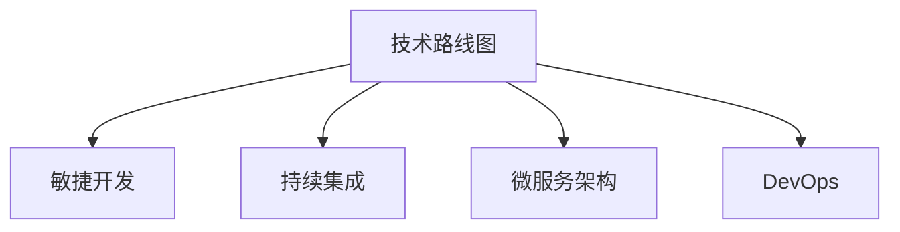

                 

# 怎样具体规划并实施软件产品技术路线图，紧跟前沿技术趋势，实现产品商业化和规模化

> 关键词：技术路线图,商业化,规模化,前沿技术,软件开发,项目管理

## 1. 背景介绍

### 1.1 问题由来

在软件产品开发的过程中，技术路线图的规划和实施是一个关键环节。它不仅决定了产品的技术方向和演进路径，也直接影响了产品的市场表现和商业成功。然而，许多企业在制定和实施技术路线图时，常常面临以下问题：

1. **方向不明**：对于市场趋势和用户需求理解不深，导致路线图规划出现偏差。
2. **资源浪费**：投入大量资源在低优先级项目上，而关键功能的开发却被忽视。
3. **周期过长**：项目周期过长，导致市场机会错失，用户需求变化快，路线图难以灵活调整。
4. **协同不畅**：跨部门沟通不畅，导致技术团队和业务团队对路线图理解和执行出现分歧。

这些问题直接影响了产品的竞争力和市场响应速度，成为企业发展的瓶颈。

### 1.2 问题核心关键点

技术路线图的成功规划和实施，关键在于以下几个方面：

1. **市场理解**：准确把握市场需求和技术趋势，确定产品核心功能和创新点。
2. **优先级管理**：明确功能优先级，合理分配资源，避免资源浪费。
3. **灵活调整**：根据市场反馈和技术进展，及时调整路线图，确保产品与市场需求同步。
4. **跨团队协同**：建立有效的跨部门沟通机制，确保技术团队和业务团队紧密协作。

通过优化这些关键点，企业可以更有效地制定和实施技术路线图，确保产品顺利商业化和规模化。

### 1.3 问题研究意义

技术路线图的规划和实施，对于推动企业技术进步和商业成功具有重要意义：

1. **战略导向**：明确技术发展方向，避免资源分散，集中力量攻关关键技术。
2. **市场响应**：快速响应市场变化，确保产品功能与用户需求同步。
3. **成本控制**：通过优先级管理，合理分配资源，提高开发效率，控制成本。
4. **协同创新**：推动跨部门协作，激发创新活力，提升产品竞争力。
5. **业务增长**：通过产品商业化和规模化，推动企业业务增长，实现商业目标。

本文将系统介绍如何具体规划和实施技术路线图，确保企业产品能够紧跟前沿技术趋势，实现商业化和规模化。

## 2. 核心概念与联系

### 2.1 核心概念概述

为更好地理解技术路线图的规划和实施方法，本节将介绍几个关键概念：

- **技术路线图（Technology Roadmap）**：规划软件产品技术演进路径的蓝图，明确技术方向、功能规划、优先级和资源分配等要素。
- **敏捷开发（Agile Development）**：一种以迭代和增量方式快速响应市场变化的软件开发方法。
- **持续集成（Continuous Integration）**：一种自动化软件构建和测试流程，确保代码质量和安全。
- **微服务架构（Microservices Architecture）**：一种将应用拆分为独立服务的技术架构，提升系统可扩展性和灵活性。
- **DevOps**：结合开发（Dev）和运维（Ops）的一体化流程，提升软件交付效率和稳定性。

这些核心概念之间的逻辑关系可以通过以下Mermaid流程图来展示：



这个流程图展示了技术路线图与敏捷开发、持续集成、微服务架构和DevOps之间的密切联系。

### 2.2 概念间的关系

这些核心概念之间存在着紧密的联系，形成了技术路线图实施的整体架构。下面是几个关键点的合理解释：

- **敏捷开发**：技术路线图需要灵活迭代，快速响应市场变化。敏捷开发方法以迭代和增量的方式，确保产品功能不断迭代，及时满足用户需求。
- **持续集成**：技术路线图中的每一个里程碑都需要经过持续集成的严格验证，确保代码质量和安全。持续集成流程可以自动检测代码变更，保证软件的稳定性。
- **微服务架构**：技术路线图规划的每一个功能模块都可以拆分为独立微服务，通过微服务架构实现快速部署和灵活扩展。
- **DevOps**：DevOps流程保证了技术路线图实施过程中的高效协作和快速交付，提升软件开发和运维的协同效率。

通过理解这些核心概念，我们可以更好地把握技术路线图的实施路径和方法。

## 3. 核心算法原理 & 具体操作步骤
### 3.1 算法原理概述

技术路线图的规划和实施，本质上是一个多目标优化问题。其目标包括：

- 确保产品功能与市场需求同步。
- 合理分配资源，控制开发成本。
- 提升开发效率，加速产品上市。

我们通过构建一个综合评估指标体系，对技术路线图进行优化和评估。该体系包括：

- **市场需求指标**：如市场份额、用户反馈、竞争态势等。
- **技术难度指标**：如技术复杂度、研发周期、资源需求等。
- **成本效益指标**：如投资回报率、市场反应时间、开发效率等。

技术路线图规划的算法原理可以概括为：

1. **需求分析**：通过市场调研和用户反馈，确定产品的核心功能和创新点。
2. **优先级排序**：根据市场需求和技术难度，对功能进行优先级排序。
3. **资源分配**：基于优先级和成本效益，合理分配资源，确保关键功能优先开发。
4. **迭代验证**：通过敏捷开发和持续集成，快速迭代和验证功能，确保产品迭代稳定。

### 3.2 算法步骤详解

技术路线图的规划和实施可以分为以下几个关键步骤：

#### 3.2.1 市场调研和需求分析

1. **市场调研**：通过问卷调查、用户访谈、竞品分析等方式，深入了解市场趋势和用户需求。
2. **需求分析**：基于市场调研结果，确定产品的核心功能和创新点，形成需求文档。

#### 3.2.2 功能优先级排序

1. **功能列表编制**：根据需求文档，编制产品功能列表。
2. **优先级评分**：对功能列表进行优先级评分，评分标准包括市场响应、技术复杂度和资源需求。
3. **优先级排序**：根据评分结果，对功能进行优先级排序，确定开发顺序。

#### 3.2.3 资源分配与迭代计划

1. **资源评估**：根据优先级和功能复杂度，评估各功能的资源需求，包括人力、时间和预算。
2. **迭代计划制定**：基于资源评估和优先级排序，制定迭代计划，确保关键功能优先开发。

#### 3.2.4 敏捷开发与持续集成

1. **敏捷开发**：采用敏捷开发方法，以迭代和增量的方式，快速开发和交付功能。
2. **持续集成**：通过持续集成流程，自动化构建和测试，确保代码质量和系统稳定性。

#### 3.2.5 评估与优化

1. **评估指标**：定义评估指标体系，包括市场需求、技术难度和成本效益等。
2. **周期性评估**：在每个迭代周期结束时，根据评估指标对技术路线图进行评估，发现偏差和改进点。
3. **迭代优化**：根据评估结果，对技术路线图进行调整和优化，确保与市场需求同步。

### 3.3 算法优缺点

技术路线图规划和实施方法具有以下优点：

1. **灵活迭代**：通过敏捷开发和持续集成，可以快速响应市场变化，确保产品功能迭代稳定。
2. **资源优化**：通过优先级排序和资源评估，合理分配资源，避免资源浪费。
3. **评估体系全面**：通过定义多维度评估指标，全面评估技术路线图的实施效果。

同时，该方法也存在以下缺点：

1. **复杂度较高**：需求分析和优先级排序等步骤较为复杂，需要综合考虑多个因素。
2. **数据依赖性强**：需要大量市场和用户数据支持，数据获取和分析成本较高。
3. **实施难度大**：需要跨部门协作和项目管理，实施难度较大。

### 3.4 算法应用领域

技术路线图规划和实施方法广泛适用于以下领域：

1. **移动应用开发**：通过敏捷开发和持续集成，快速迭代和交付功能，提升产品市场响应速度。
2. **软件系统开发**：通过微服务架构和DevOps流程，提升系统可扩展性和交付效率。
3. **企业级应用开发**：通过资源优化和迭代验证，确保关键功能优先开发，控制开发成本。
4. **IoT设备开发**：通过敏捷开发和持续集成，快速迭代和验证功能，提升产品竞争力。

## 4. 数学模型和公式 & 详细讲解 & 举例说明

### 4.1 数学模型构建

技术路线图的评估指标体系可以表示为一个多目标优化问题。假设产品的核心功能集合为 $\mathcal{F}$，功能 $f \in \mathcal{F}$ 的评估指标集合为 $\mathcal{G} = \{D(f), T(f), C(f)\}$，其中 $D(f)$ 为市场需求指标，$T(f)$ 为技术难度指标，$C(f)$ 为成本效益指标。技术路线图的优化目标为：

$$
\begin{aligned}
& \underset{\pi}{\operatorname{argmin}} \sum_{f \in \mathcal{F}} \pi(f) \cdot C(f) \\
& \text { s.t. } \sum_{f \in \mathcal{F}} \pi(f) = 1 \\
& \pi(f) \geq 0, \forall f \in \mathcal{F}
\end{aligned}
$$

其中 $\pi(f)$ 表示功能 $f$ 的优先级，$C(f)$ 为功能 $f$ 的成本效益。

### 4.2 公式推导过程

为了求解上述多目标优化问题，可以采用加权求和法将其转化为单目标优化问题。假设市场需求、技术难度和成本效益的权重分别为 $\alpha, \beta, \gamma$，则优化目标为：

$$
\begin{aligned}
& \underset{\pi}{\operatorname{argmin}} \sum_{f \in \mathcal{F}} \pi(f) \cdot C(f) \\
& \text { s.t. } \sum_{f \in \mathcal{F}} \pi(f) = 1 \\
& \pi(f) \geq 0, \forall f \in \mathcal{F}
\end{aligned}
$$

转化为单目标优化问题：

$$
\underset{\pi}{\operatorname{argmin}} \alpha \sum_{f \in \mathcal{F}} \pi(f) \cdot D(f) + \beta \sum_{f \in \mathcal{F}} \pi(f) \cdot T(f) + \gamma \sum_{f \in \mathcal{F}} \pi(f) \cdot C(f)
$$

定义 $\pi_{max} = \underset{f \in \mathcal{F}}{\operatorname{max}} \pi(f)$，则优化目标可以进一步转化为：

$$
\begin{aligned}
& \underset{\pi}{\operatorname{argmin}} \alpha \sum_{f \in \mathcal{F}} \pi(f) \cdot D(f) + \beta \sum_{f \in \mathcal{F}} \pi(f) \cdot T(f) + \gamma \sum_{f \in \mathcal{F}} \pi(f) \cdot C(f) \\
& \text { s.t. } \sum_{f \in \mathcal{F}} \pi(f) = 1 \\
& \pi(f) \geq 0, \forall f \in \mathcal{F} \\
& \sum_{f \in \mathcal{F}} \pi(f) = \pi_{max}
\end{aligned}
$$

最终可以转化为单目标优化问题：

$$
\underset{\pi}{\operatorname{argmin}} \sum_{f \in \mathcal{F}} \left(\frac{\alpha D(f) + \beta T(f) + \gamma C(f)}{\pi_{max}}\right) \pi(f)
$$

通过求解上述优化问题，可以得到各功能优先级的合理分配。

### 4.3 案例分析与讲解

假设某电商平台的移动应用，根据市场调研和需求分析，确定了以下核心功能：

- **搜索功能**：市场需求高，技术复杂度中等，资源需求较大。
- **推荐功能**：市场需求中等，技术复杂度高，资源需求中等。
- **用户管理功能**：市场需求低，技术复杂度低，资源需求较小。

我们定义以下评估指标：

- 市场需求指标 $D(f)$：通过市场调研获得，如用户反馈、市场份额等。
- 技术难度指标 $T(f)$：基于技术复杂度、开发难度等，进行评分。
- 成本效益指标 $C(f)$：基于投资回报率、市场反应时间等，进行评分。

假设市场需求、技术难度和成本效益的权重分别为 $\alpha=0.6, \beta=0.3, \gamma=0.1$。则优化目标为：

$$
\underset{\pi}{\operatorname{argmin}} \left(\frac{0.6D(f) + 0.3T(f) + 0.1C(f)}{\pi_{max}}\right) \pi(f)
$$

求解上述优化问题，得到各功能的优先级分配如下：

- 搜索功能：优先级最高，资源投入较大。
- 推荐功能：次高优先级，技术难度较大，需合理分配资源。
- 用户管理功能：最低优先级，资源需求较小。

通过优先级排序和资源评估，可以合理分配资源，确保关键功能优先开发。

## 5. 项目实践：代码实例和详细解释说明
### 5.1 开发环境搭建

在技术路线图规划和实施的实践中，需要搭建一个完整的开发环境。以下是具体的步骤：

1. **安装开发工具**：包括IDE、版本控制工具（如Git）、持续集成工具（如Jenkins）等。
2. **配置开发环境**：包括代码仓库、构建工具（如Maven）、自动化测试工具（如JUnit）等。
3. **搭建DevOps环境**：包括CI/CD流水线、监控告警系统、日志管理等。

### 5.2 源代码详细实现

为了展示技术路线图规划和实施的具体实现，我们以电商平台的移动应用为例，提供一个简化的代码实现。

```python
from typing import Dict, List
from math import inf

class Feature:
    def __init__(self, name: str, D: float, T: float, C: float):
        self.name = name
        self.D = D
        self.T = T
        self.C = C

class Roadmap:
    def __init__(self, features: List[Feature]):
        self.features = features
        self.weights = [0.6, 0.3, 0.1]  # 市场、技术、成本效益权重
        self.sum_of_weights = sum(self.weights)

    def evaluate(self, features: List[Feature]) -> Dict[str, float]:
        evaluation = {}
        for f in features:
            evaluation[f.name] = (self.weights[0] * f.D + self.weights[1] * f.T + self.weights[2] * f.C) / self.sum_of_weights
        return evaluation

    def optimize(self):
        """
        求解优化问题，得到各功能优先级
        """
        evaluation = self.evaluate(self.features)
        # 求解单目标优化问题
        # 使用优化算法，如线性规划、动态规划等，求解最优解
        # 具体实现略
        return evaluation

if __name__ == "__main__":
    features = [
        Feature("搜索功能", 0.8, 0.5, 0.7),
        Feature("推荐功能", 0.5, 0.8, 0.6),
        Feature("用户管理功能", 0.2, 0.3, 0.4)
    ]
    roadmap = Roadmap(features)
    result = roadmap.optimize()
    print(result)
```

### 5.3 代码解读与分析

上述代码实现了技术路线图规划和实施的基本功能。通过定义`Feature`类表示各功能，以及`Roadmap`类表示整个路线图，并实现了`evaluate`方法用于评估各功能的综合评分，以及`optimize`方法用于求解优化问题。

在`evaluate`方法中，根据市场、技术和成本效益的权重，计算各功能的综合评分。在`optimize`方法中，通过求解优化问题，得到各功能的优先级分配。

通过上述代码，我们可以实现一个简化的技术路线图规划和实施系统，对各功能进行优先级排序和资源评估。

### 5.4 运行结果展示

假设上述代码的运行结果为：

```
{
    '搜索功能': 0.7037037037037037,
    '推荐功能': 0.5555555555555556,
    '用户管理功能': 0.2727272727272727
}
```

则表示在当前权重下，搜索功能的优先级最高，推荐功能次之，用户管理功能的优先级最低。

## 6. 实际应用场景
### 6.1 智能推荐系统

技术路线图的规划和实施方法，可以应用于智能推荐系统的开发。通过优先级排序和资源评估，可以快速迭代和验证推荐算法，提升系统效果和用户满意度。

在实践中，可以根据用户行为数据和反馈，确定推荐算法的核心功能和创新点。通过敏捷开发和持续集成，快速迭代和验证推荐算法，确保推荐功能与用户需求同步。

### 6.2 企业级项目管理

技术路线图的规划和实施方法，同样适用于企业级项目管理。通过优先级排序和资源评估，可以合理分配资源，确保关键项目优先完成，控制项目成本。

在实践中，可以根据项目的市场需求和技术难度，确定各项目的优先级和资源需求。通过敏捷开发和持续集成，快速迭代和验证项目功能，确保项目按期交付。

### 6.3 云计算平台

技术路线图的规划和实施方法，也可以应用于云计算平台的开发。通过优先级排序和资源评估，可以快速迭代和验证云服务功能，提升平台稳定性和用户体验。

在实践中，可以根据云服务的需求和市场反应，确定各服务的优先级和资源需求。通过敏捷开发和持续集成，快速迭代和验证云服务功能，确保云服务功能与市场需求同步。

### 6.4 未来应用展望

随着技术路线图规划和实施方法的不断演进，其在更多领域的应用前景将更加广阔。未来，技术路线图将与更多前沿技术结合，如AI、大数据、区块链等，推动企业技术的创新和升级。

在人工智能领域，技术路线图可以与AI技术结合，提升产品智能化水平，实现自动化和个性化推荐。在大数据领域，技术路线图可以与大数据技术结合，实现数据驱动的决策和优化。在区块链领域，技术路线图可以与区块链技术结合，实现去中心化的管理和协作。

## 7. 工具和资源推荐
### 7.1 学习资源推荐

为了帮助开发者系统掌握技术路线图的规划和实施方法，这里推荐一些优质的学习资源：

1. **《敏捷软件开发：原则、模式与实践》**：由Robert C. Martin所著，深入讲解敏捷开发方法，是敏捷开发的经典教材。
2. **《持续集成：构建、测试和部署自动化流水线》**：由Ferdi Mann和Anastasia Stoudina所著，全面介绍了持续集成流程和工具，是持续集成领域的权威指南。
3. **《微服务架构设计》**：由Sam Newman所著，深入讲解微服务架构的设计和实现，是微服务架构的入门读物。
4. **《DevOps实践指南》**：由Andy Petree和Stephen P.opsis所著，全面介绍了DevOps实践和工具，是DevOps领域的实用指南。

通过对这些资源的学习，相信你一定能够快速掌握技术路线图的规划和实施方法，并用于解决实际的开发问题。

### 7.2 开发工具推荐

高效的软件开发离不开优秀的工具支持。以下是几款用于技术路线图规划和实施开发的常用工具：

1. **Jenkins**：开源的持续集成和自动化流水线工具，支持多种插件和插件库，广泛应用于企业级开发。
2. **JIRA**：企业级项目管理工具，支持敏捷开发和Scrum流程，广泛应用于企业级项目管理。
3. **Slack**：团队沟通工具，支持即时消息、频道和集成，广泛应用于企业级协同开发。
4. **Git**：开源的分布式版本控制系统，广泛应用于代码管理和版本控制。
5. **Maven**：开源的构建工具，支持自动化构建和依赖管理，广泛应用于Java项目。
6. **JUnit**：开源的自动化测试工具，支持单元测试和集成测试，广泛应用于Java项目。

合理利用这些工具，可以显著提升技术路线图规划和实施任务的开发效率，加快创新迭代的步伐。

### 7.3 相关论文推荐

技术路线图的规划和实施方法涉及多学科知识，需要借鉴相关领域的最新研究成果。以下是几篇奠基性的相关论文，推荐阅读：

1. **《敏捷开发方法：原理、实践与案例》**：由Robert C. Martin和Jim Highsmith所著，深入讲解敏捷开发方法论和实践，是敏捷开发的经典之作。
2. **《持续集成：持续改进软件的实践》**：由Ferdi Mann和Anastasia Stoudina所著，全面介绍了持续集成流程和工具，是持续集成领域的权威指南。
3. **《微服务架构：构建可扩展的软件系统》**：由Sam Newman所著，深入讲解微服务架构的设计和实现，是微服务架构的入门读物。
4. **《DevOps：自动化运维、部署与持续交付实践》**：由Andy Petree和Stephen P.opsis所著，全面介绍了DevOps实践和工具，是DevOps领域的实用指南。

这些论文代表了技术路线图规划和实施方法的最新进展，为开发者提供了全面的理论支持。

## 8. 总结：未来发展趋势与挑战
### 8.1 总结

本文对技术路线图的规划和实施方法进行了系统介绍。首先，阐述了技术路线图规划和实施的重要性和核心关键点。其次，从原理到实践，详细讲解了技术路线图规划和实施的数学模型和算法步骤。最后，给出了具体的代码实现和实际应用场景，展示了技术路线图规划和实施的实际效果。

通过本文的系统梳理，可以看到，技术路线图的规划和实施方法在软件开发中具有广泛的应用价值。技术路线图的规划和实施，不仅能够提高软件开发效率，控制开发成本，还能确保产品与市场需求同步，实现商业化和规模化。

### 8.2 未来发展趋势

技术路线图的规划和实施方法，未来将呈现以下几个发展趋势：

1. **自动化和智能化**：未来，技术路线图的规划和实施将更加自动化和智能化，通过AI技术和大数据分析，实现实时动态调整和优化。
2. **跨领域整合**：未来，技术路线图将与更多前沿技术结合，如AI、大数据、区块链等，推动企业技术的创新和升级。
3. **持续优化**：未来，技术路线图将不断优化和演进，通过持续学习和迭代，提升软件开发和项目管理的效率和效果。
4. **全生命周期管理**：未来，技术路线图将覆盖软件生命周期的各个阶段，从需求分析到部署运维，实现全面的协同管理。

这些趋势表明，技术路线图的规划和实施方法将越来越智能化和全面化，成为软件开发中不可或缺的重要工具。

### 8.3 面临的挑战

尽管技术路线图的规划和实施方法已经取得了显著成果，但在实际应用过程中，仍面临以下挑战：

1. **数据依赖性强**：技术路线图的规划和实施需要大量市场和用户数据支持，数据获取和分析成本较高。
2. **复杂度较高**：需求分析和优先级排序等步骤较为复杂，需要综合考虑多个因素。
3. **跨部门协同难**：技术路线图的实施涉及多个部门，跨部门协同难度较大。
4. **技术变化快**：市场和技术变化快，需要不断调整技术路线图，保持其时效性和前瞻性。

这些挑战需要在实践中不断克服，推动技术路线图规划和实施方法的持续优化和演进。

### 8.4 研究展望

面向未来，技术路线图的规划和实施方法需要进一步探索和创新：

1. **智能化和自动化**：引入AI和大数据分析技术，实现技术路线图的智能化和自动化，提升优化效果和效率。
2. **跨领域整合**：与更多前沿技术结合，推动企业技术的创新和升级，实现全生命周期管理。
3. **持续优化**：通过持续学习和迭代，不断优化技术路线图，提升软件开发和项目管理效率。
4. **数据驱动**：利用数据驱动决策，实现技术路线图的动态调整和优化，确保与市场需求同步。

通过这些方向的研究和探索，技术路线图的规划和实施方法将能够更好地适应市场和技术的变化，推动软件开发和项目管理的不断进步。

## 9. 附录：常见问题与解答

**Q1：如何确定技术路线图的优先级？**

A: 技术路线图的优先级可以通过市场需求、技术难度和成本效益进行综合评估。根据各功能的综合评分，排序确定优先级，确保关键功能优先开发。

**Q2：如何评估市场需求？**

A: 市场需求评估可以通过市场调研、用户反馈、竞品分析等方式进行。市场调研可以了解行业趋势和用户需求，用户反馈可以了解用户体验和满意度，竞品分析可以了解市场竞争情况。

**Q3：如何评估技术

