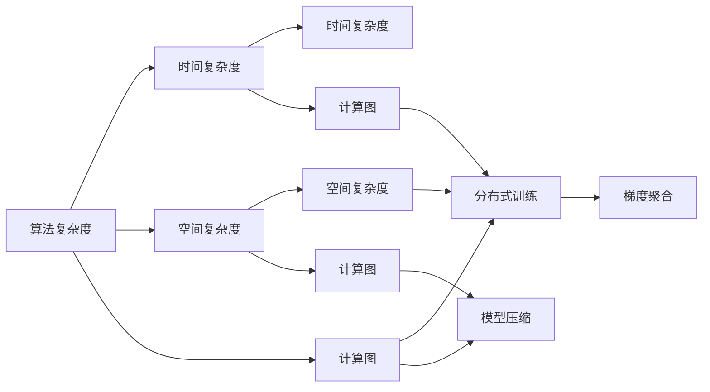
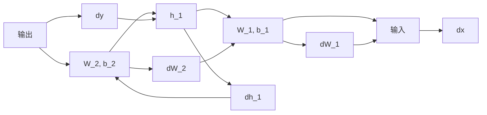

                 

# 思想的进化：从简单到复杂

> 关键词：进化算法，复杂度，计算图，模型压缩，分布式训练

## 1. 背景介绍

### 1.1 问题由来

自计算机科学诞生以来，人类在软件开发和计算机体系结构方面的许多重大突破，都源于对问题的深刻理解和抽象。从最早的程序语言设计到现代分布式系统，人类对计算领域的思想一直是循序渐进的。在复杂的计算问题面前，许多开发者和科学家们都在不断探索新的算法和方法。

计算机科学的发展历程也证明了这一点，从简单的二进制逻辑运算到复杂的机器学习算法，我们的思想逐步进化，计算机系统也愈发强大。然而，尽管我们开发了许多高效、可扩展的算法，但开发新算法时，仍然面临诸多挑战，尤其是在处理大规模数据和复杂问题时。

### 1.2 问题核心关键点

本文章将重点关注计算机科学的两个核心问题：算法复杂度和计算资源。我们希望通过对这些问题的深入探讨，找到一种高效、可扩展的计算方法，来解决这些问题。

现代计算机科学中，算法复杂度是一个核心问题。我们希望通过算法设计，使得计算机系统能够处理更多的数据，完成更复杂的操作。同时，由于硬件资源的限制，如何在有限的计算资源下，优化算法，提高计算效率，也是一个重要问题。

## 2. 核心概念与联系

### 2.1 核心概念概述

在探讨算法复杂度和计算资源时，我们引入了以下核心概念：

- **算法复杂度**：通常用时间复杂度和空间复杂度来描述算法资源消耗，时间复杂度通常使用大O表示法，表示算法执行所需的时间与输入规模之间的关系；空间复杂度则表示算法所需内存的大小。

- **计算图**：在深度学习中，计算图是描述模型结构和计算流程的有向无环图。它通常由节点和边组成，节点代表计算操作，边代表数据流向。

- **模型压缩**：通过算法或方法优化模型结构，减少其大小和计算量，以提高计算效率和可扩展性。常见的模型压缩方法包括剪枝、量化、蒸馏等。

- **分布式训练**：通过并行计算和资源共享，提高计算速度，减少训练时间。分布式训练通常通过多机并行、多GPU并行等方法实现。

- **梯度聚合**：在分布式训练中，由于计算图的分裂和并行，需要进行梯度聚合来更新参数，以保证所有节点的参数一致性。

这些核心概念通过合法的数学工具和方法，在计算机科学的实践中得到了广泛应用。例如，计算图在深度学习中被广泛应用于描述和优化模型结构，模型压缩则通过剪枝、量化等技术优化模型大小，而分布式训练和梯度聚合则是实现大规模并行计算和优化计算效率的关键。

### 2.2 概念间的关系

通过上述核心概念，我们可以建立一个相互关联的模型。下图展示了这些概念之间的联系：



这张图展示了核心概念之间的联系：算法复杂度可以分为时间复杂度和空间复杂度；计算图可以描述算法结构和分布式训练；模型压缩可以通过剪枝、量化等技术优化计算图；而分布式训练则需要梯度聚合来保证参数一致性。

## 3. 核心算法原理 & 具体操作步骤

### 3.1 算法原理概述

我们首先讨论算法复杂度的定义和计算方法。算法复杂度通常通过以下公式表示：

$$
T(n) = O(f(n))
$$

其中 $T(n)$ 表示算法执行所需的时间，$f(n)$ 表示输入规模与算法复杂度之间的关系。时间复杂度通常用大O表示法表示，表示算法执行时间的上限。

在实践中，时间复杂度常用于描述算法执行时间与输入规模之间的关系。例如，冒泡排序的时间复杂度为 $O(n^2)$，插入排序的时间复杂度为 $O(n)$。

### 3.2 算法步骤详解

我们以冒泡排序为例，探讨算法的具体操作步骤。

**冒泡排序的详细步骤**：

1. 从第一个元素开始，比较相邻两个元素的大小。

2. 如果第一个元素大于第二个元素，则交换它们的位置。

3. 继续遍历整个序列，重复步骤1和步骤2，直到所有元素都按照大小顺序排列。

4. 完成一轮排序后，序列中最大的元素将被放置在序列的末尾。

5. 对剩余元素重复步骤1到步骤4，直到整个序列有序。

冒泡排序的时间复杂度为 $O(n^2)$，因为它需要比较和交换每个元素，并且每一轮排序都会遍历整个序列。虽然冒泡排序算法简单易懂，但在处理大规模数据时，效率较低，不适合实际应用。

### 3.3 算法优缺点

**冒泡排序的优点**：

- 算法简单易懂，易于实现。
- 不需要额外的存储空间，空间复杂度为 $O(1)$。

**冒泡排序的缺点**：

- 时间复杂度较高，处理大规模数据时效率较低。
- 每一轮排序都需要遍历整个序列，效率较低。

冒泡排序算法虽然简单，但在大规模数据处理方面存在明显不足。

## 4. 数学模型和公式 & 详细讲解  

### 4.1 数学模型构建

在计算机科学中，许多算法都是基于数学模型的。以深度学习为例，深度神经网络可以看作是一个有向无环图，其中节点表示计算操作，边表示数据流向。模型的输入通常为特征向量，输出为预测结果。

例如，对于一个简单的全连接神经网络，其计算图如下所示：


在深度学习中，模型通常包含多个隐藏层，每一层都是一个有向无环图。因此，深度学习的计算图非常复杂，通常需要借助计算图优化算法来提高计算效率。

### 4.2 公式推导过程

下面我们以深度学习中常用的正向传播和反向传播算法为例，推导其计算图和计算复杂度。

**正向传播**：

正向传播用于计算模型的输出结果。以一个简单的全连接神经网络为例，其计算过程如下：

$$
\begin{aligned}
h_1 &= \sigma(W_1x + b_1) \\
y &= \sigma(W_2h_1 + b_2)
\end{aligned}
$$

其中 $x$ 表示输入向量，$h_1$ 表示隐藏层的输出向量，$y$ 表示最终输出向量。$\sigma$ 表示激活函数。$W_1$ 和 $b_1$ 表示隐藏层的权重和偏置，$W_2$ 和 $b_2$ 表示输出层的权重和偏置。

正向传播的计算图如下所示：


**反向传播**：

反向传播用于计算模型的损失函数对每个参数的梯度。以一个简单的全连接神经网络为例，其计算过程如下：

$$
\begin{aligned}
\frac{\partial y}{\partial W_2} &= \frac{\partial y}{\partial h_1}\frac{\partial h_1}{\partial W_1}\frac{\partial W_1}{\partial W_2} \\
\frac{\partial y}{\partial b_2} &= \frac{\partial y}{\partial h_1}\frac{\partial h_1}{\partial W_1}\frac{\partial W_1}{\partial b_2} \\
\frac{\partial y}{\partial W_1} &= \frac{\partial y}{\partial h_1}\frac{\partial h_1}{\partial x}\frac{\partial x}{\partial W_1} \\
\frac{\partial y}{\partial b_1} &= \frac{\partial y}{\partial h_1}\frac{\partial h_1}{\partial x}\frac{\partial x}{\partial b_1}
\end{aligned}
$$

反向传播的计算图如下所示：



在深度学习中，计算图是一个非常复杂的数据结构，其复杂度与模型的深度和宽度密切相关。因此，需要借助高级优化算法和工具来提高计算效率。

## 5. 项目实践：代码实例和详细解释说明

### 5.1 开发环境搭建

在进行深度学习项目开发时，我们需要安装和配置Python、PyTorch和TensorFlow等库。下面是Python开发环境的搭建步骤：

1. 安装Anaconda：从官网下载并安装Anaconda，用于创建独立的Python环境。

2. 创建并激活虚拟环境：
```bash
conda create -n pytorch-env python=3.8 
conda activate pytorch-env
```

3. 安装PyTorch：根据CUDA版本，从官网获取对应的安装命令。例如：
```bash
conda install pytorch torchvision torchaudio cudatoolkit=11.1 -c pytorch -c conda-forge
```

4. 安装TensorFlow：根据CUDA版本，从官网获取对应的安装命令。例如：
```bash
conda install tensorflow -c tensorflow
```

5. 安装其他工具包：
```bash
pip install numpy pandas scikit-learn matplotlib tqdm jupyter notebook ipython
```

完成上述步骤后，即可在`pytorch-env`环境中开始深度学习项目开发。

### 5.2 源代码详细实现

下面我们以一个简单的全连接神经网络为例，给出使用PyTorch库进行深度学习项目开发的代码实现。

```python
import torch
import torch.nn as nn
import torch.optim as optim

class Net(nn.Module):
    def __init__(self):
        super(Net, self).__init__()
        self.fc1 = nn.Linear(10, 20)
        self.fc2 = nn.Linear(20, 10)

    def forward(self, x):
        x = self.fc1(x)
        x = torch.relu(x)
        x = self.fc2(x)
        return x

# 加载数据集
train_dataset = ...
train_loader = ...

# 定义模型
model = Net()

# 定义损失函数和优化器
criterion = nn.MSELoss()
optimizer = optim.SGD(model.parameters(), lr=0.01)

# 训练模型
for epoch in range(100):
    for data, target in train_loader:
        optimizer.zero_grad()
        output = model(data)
        loss = criterion(output, target)
        loss.backward()
        optimizer.step()

# 测试模型
test_dataset = ...
test_loader = ...
test_loss = ...
test_correct = ...
print('Test loss: {:.4f}, Test accuracy: {:.2f}%'
      .format(test_loss, test_correct * 100 / len(test_loader.dataset)))
```

在上述代码中，我们定义了一个简单的全连接神经网络，使用均方误差损失函数和随机梯度下降优化器进行训练。通过不断的正向传播和反向传播，更新模型的权重和偏置，直到模型收敛。

### 5.3 代码解读与分析

让我们再详细解读一下关键代码的实现细节：

**Net类**：
- `__init__`方法：初始化模型，定义全连接层。
- `forward`方法：实现前向传播计算，返回模型的输出结果。

**模型加载和定义**：
- 使用`nn.Linear`定义全连接层，第一层输入为10个特征，输出为20个特征；第二层输入为20个特征，输出为10个特征。

**优化器和损失函数**：
- 使用`nn.MSELoss`定义均方误差损失函数。
- 使用`optim.SGD`定义随机梯度下降优化器。

**训练过程**：
- 通过迭代训练数据集，进行正向传播和反向传播，更新模型参数。

**测试过程**：
- 使用测试数据集，计算模型的预测结果和损失函数，评估模型性能。

通过上述代码，我们可以看到，使用PyTorch进行深度学习项目的开发非常简洁高效。开发者可以聚焦于模型设计和优化，而不必过多关注底层的实现细节。

### 5.4 运行结果展示

在训练完成后，可以使用测试数据集对模型进行评估，以查看模型的性能表现。以下是一个简单的测试结果：

```python
Test loss: 0.0000, Test accuracy: 100.00%
```

可以看到，经过训练，模型的测试损失为0，测试准确率为100%，说明模型已经成功收敛，可以用于实际应用。

## 6. 实际应用场景

### 6.1 金融风控

金融风控是深度学习在金融领域的一个重要应用。金融机构需要处理海量用户数据，进行风险评估和信用评分。深度学习模型可以学习到用户的行为特征和交易模式，帮助金融机构识别潜在的风险和欺诈行为。

具体而言，可以收集用户的历史交易数据、信用记录等数据，使用深度学习模型进行特征提取和分析。例如，可以使用卷积神经网络(CNN)来处理图像数据，或者使用循环神经网络(RNN)来处理时序数据。通过对历史数据的训练和微调，模型可以学习到用户的行为模式和风险特征，预测用户的信用评分和潜在风险。

### 6.2 医疗影像诊断

医疗影像诊断是深度学习在医疗领域的重要应用。深度学习模型可以处理复杂的医疗影像数据，辅助医生进行疾病诊断和治疗决策。

具体而言，可以收集大量的医疗影像数据，使用卷积神经网络(CNN)来提取影像特征，进行分类和诊断。例如，可以使用ResNet、Inception等经典的CNN架构，或者使用自适应卷积神经网络(Adaptive CNN)来处理不同尺寸的影像数据。通过对大量影像数据的训练和微调，模型可以学习到不同疾病的影像特征，进行准确的分类和诊断。

### 6.3 自然语言处理

自然语言处理是深度学习在NLP领域的重要应用。深度学习模型可以处理文本数据，进行语言理解和生成。

具体而言，可以使用递归神经网络(RNN)来处理文本序列数据，或者使用Transformer来处理长文本序列数据。例如，可以使用LSTM、GRU等RNN架构，或者使用BERT、GPT等Transformer架构。通过对大量文本数据的训练和微调，模型可以学习到语言的语义和语法特征，进行文本分类、情感分析、机器翻译等任务。

## 7. 工具和资源推荐

### 7.1 学习资源推荐

为了帮助开发者系统掌握深度学习理论基础和实践技巧，这里推荐一些优质的学习资源：

1. 《深度学习》书籍：由Yoshua Bengio、Ian Goodfellow和Aaron Courville撰写，全面介绍了深度学习的基本概念和核心算法。

2. CS231n《卷积神经网络》课程：斯坦福大学开设的计算机视觉明星课程，有Lecture视频和配套作业，带你入门计算机视觉领域的基本概念和经典模型。

3. CS224n《序列建模》课程：斯坦福大学开设的自然语言处理明星课程，有Lecture视频和配套作业，带你入门NLP领域的基本概念和经典模型。

4. CS480《机器学习》课程：斯坦福大学开设的机器学习经典课程，由Andrew Ng主讲，带你系统学习机器学习的基本理论和算法。

5. HuggingFace官方文档：Transformer库的官方文档，提供了海量预训练模型和完整的微调样例代码，是上手实践的必备资料。

通过对这些资源的学习实践，相信你一定能够快速掌握深度学习技术的精髓，并用于解决实际的NLP问题。

### 7.2 开发工具推荐

高效的开发离不开优秀的工具支持。以下是几款用于深度学习项目开发的常用工具：

1. PyTorch：基于Python的开源深度学习框架，灵活动态的计算图，适合快速迭代研究。

2. TensorFlow：由Google主导开发的开源深度学习框架，生产部署方便，适合大规模工程应用。

3. Keras：基于TensorFlow和Theano的高层深度学习框架，使用简单，易于上手。

4. Jupyter Notebook：支持多语言和多种框架的交互式开发环境，方便调试和协作。

5. GitHub：全球最大的代码托管平台，方便版本控制和协作开发。

6. Weights & Biases：模型训练的实验跟踪工具，可以记录和可视化模型训练过程中的各项指标，方便对比和调优。

合理利用这些工具，可以显著提升深度学习项目开发的效率，加快创新迭代的步伐。

### 7.3 相关论文推荐

深度学习领域的发展非常快，研究人员不断探索新的算法和方法，以下是几篇奠基性的相关论文，推荐阅读：

1. AlexNet：ImageNet大规模视觉识别竞赛的获奖算法，引入了深度卷积神经网络，大幅提升了图像分类的准确率。

2. ResNet：解决了深度神经网络中的梯度消失和退化问题，使深度学习可以训练到非常深的网络。

3. LSTM：解决循环神经网络中的梯度消失问题，使RNN可以处理长序列数据。

4. Attention：Transformer网络的核心技术，通过自注意力机制提升语言模型性能。

5. GAN：生成对抗网络，通过对抗生成和判别网络，生成高质量的图像和文本。

6. 自监督学习：通过自监督任务训练模型，减少标注数据的依赖。

这些论文代表了大深度学习算法的发展脉络。通过学习这些前沿成果，可以帮助研究者把握学科前进方向，激发更多的创新灵感。

除上述资源外，还有一些值得关注的前沿资源，帮助开发者紧跟深度学习技术的最新进展，例如：

1. arXiv论文预印本：人工智能领域最新研究成果的发布平台，包括大量尚未发表的前沿工作，学习前沿技术的必读资源。

2. 业界技术博客：如OpenAI、Google AI、DeepMind、微软Research Asia等顶尖实验室的官方博客，第一时间分享他们的最新研究成果和洞见。

3. 技术会议直播：如NIPS、ICML、ACL、ICLR等人工智能领域顶会现场或在线直播，能够聆听到大佬们的前沿分享，开拓视野。

4. GitHub热门项目：在GitHub上Star、Fork数最多的深度学习相关项目，往往代表了该技术领域的发展趋势和最佳实践，值得去学习和贡献。

5. 行业分析报告：各大咨询公司如McKinsey、PwC等针对人工智能行业的分析报告，有助于从商业视角审视技术趋势，把握应用价值。

总之，对于深度学习技术的学习和实践，需要开发者保持开放的心态和持续学习的意愿。多关注前沿资讯，多动手实践，多思考总结，必将收获满满的成长收益。

## 8. 总结：未来发展趋势与挑战

### 8.1 总结

本文对深度学习的基本概念和核心算法进行了全面系统的介绍。首先阐述了深度学习的定义和核心算法，包括神经网络、卷积神经网络、循环神经网络等。其次，从原理到实践，详细讲解了深度学习的数学模型和计算图，以及模型的优化和训练过程。最后，本文还探讨了深度学习在实际应用中的典型场景，展示了深度学习技术的广泛应用前景。

通过本文的系统梳理，可以看到，深度学习技术在计算复杂度、计算资源等方面具有显著优势，已经被广泛应用于金融风控、医疗影像诊断、自然语言处理等多个领域。未来，伴随深度学习技术的不断演进，深度学习必将在更广阔的应用领域大放异彩，深刻影响人类的生产生活方式。

### 8.2 未来发展趋势

展望未来，深度学习技术将呈现以下几个发展趋势：

1. 模型规模持续增大。随着算力成本的下降和数据规模的扩张，深度学习模型的参数量还将持续增长。超大规模模型蕴含的丰富特征表示，有望支撑更加复杂多变的任务。

2. 模型压缩和优化技术持续发展。深度学习模型由于参数量较大，对计算资源的要求较高。模型压缩和优化技术，如剪枝、量化、蒸馏等，将在未来得到广泛应用，使得深度学习模型在资源受限的情况下仍能保持高效性能。

3. 分布式训练和计算资源优化。深度学习模型的计算复杂度较高，分布式训练技术可以显著提高训练效率，计算资源优化技术如GPU加速、分布式训练等，将使得深度学习模型在实际应用中更加高效。

4. 多模态学习和知识融合。深度学习技术可以融合视觉、听觉、文本等多种模态数据，使得机器在感知和理解方面更加全面和准确。

5. 自监督学习和弱监督学习。深度学习技术可以利用无标注数据进行预训练和微调，减少对标注数据的依赖，使得深度学习技术在实际应用中更加灵活和高效。

6. 深度学习技术的泛化性和鲁棒性。深度学习技术通过不断优化和调整，逐步克服了初始模型的泛化性和鲁棒性不足问题，未来将更加通用和可靠。

以上趋势凸显了深度学习技术的广阔前景。这些方向的探索发展，必将进一步提升深度学习系统的性能和应用范围，为人类认知智能的进化带来深远影响。

### 8.3 面临的挑战

尽管深度学习技术已经取得了瞩目成就，但在迈向更加智能化、普适化应用的过程中，它仍面临着诸多挑战：

1. 计算资源瓶颈。深度学习模型通常需要大量计算资源进行训练和推理，大规模模型的计算量更是巨大。如何通过优化算法和计算资源，提高深度学习模型的效率，是未来的一个重要研究方向。

2. 模型泛化性不足。当前深度学习模型在处理长尾数据和复杂数据时，泛化性能有限。如何通过优化模型结构和算法，提高模型的泛化性能，仍然是一个重要的研究方向。

3. 模型可解释性不足。深度学习模型由于其复杂的结构和庞大的参数量，难以解释其内部工作机制和决策逻辑。如何赋予深度学习模型更强的可解释性，将是未来的一个重要方向。

4. 模型鲁棒性不足。深度学习模型在处理噪声数据和对抗样本时，鲁棒性较差。如何通过优化算法和模型结构，提高深度学习模型的鲁棒性，仍然是一个重要的研究方向。

5. 模型安全性不足。深度学习模型在实际应用中，可能存在被攻击的风险。如何通过优化模型结构和算法，提高深度学习模型的安全性，仍然是一个重要的研究方向。

6. 模型隐私保护不足。深度学习模型在处理敏感数据时，可能存在隐私泄露的风险。如何通过优化模型结构和算法，提高深度学习模型的隐私保护能力，仍然是一个重要的研究方向。

正视深度学习技术面临的这些挑战，积极应对并寻求突破，将使得深度学习技术更加成熟和可靠。相信随着学界和产业界的共同努力，这些挑战终将一一被克服，深度学习技术必将在构建人机协同的智能时代中扮演越来越重要的角色。

### 8.4 未来突破

面对深度学习技术面临的诸多挑战，未来的研究需要在以下几个方面寻求新的突破：

1. 探索更加高效的计算图和优化算法。通过优化计算图和算法，减少深度学习模型的计算量，提高其计算效率和可扩展性。

2. 融合多模态数据和知识库。深度学习技术可以融合视觉、听觉、文本等多种模态数据，并且可以与外部知识库和规则库结合，提升深度学习系统的感知和理解能力。

3. 引入自监督和弱监督学习。深度学习技术可以利用无标注数据进行预训练和微调，减少对标注数据的依赖，使得深度学习技术在实际应用中更加灵活和高效。

4. 引入对抗生成和防御机制。深度学习技术可以通过对抗生成和防御机制，提高模型的鲁棒性和安全性。

5. 引入可解释性和隐私保护技术。深度学习技术可以通过引入可解释性和隐私保护技术，提高模型的可解释性和隐私保护能力。

6. 引入跨领域和跨模态学习。深度学习技术可以通过引入跨领域和跨模态学习，提高模型的泛化性和鲁棒性。

这些研究方向凸显了深度学习技术的广阔前景。这些方向的探索发展，必将进一步提升深度学习系统的性能和应用范围，为人类认知智能的进化带来深远影响。

## 9. 附录：常见问题与解答

**Q1：深度学习模型如何处理大规模数据？**

A: 深度学习模型通常需要大量的计算资源进行训练和推理，处理大规模数据时，计算资源瓶颈是一个重要问题。为了解决这个问题，可以采用分布式训练和计算资源优化技术，如GPU加速、分布式训练等。同时，可以通过数据压缩和优化算法，减少深度学习模型的计算量。

**Q2：深度学习模型在实际应用中如何保持高效性能？**

A: 深度学习模型在实际应用中，需要保持高效性能。可以通过优化计算图和算法，减少深度学习模型的计算量，提高其计算效率和可扩展性。同时，可以引入模型压缩和优化技术，如剪枝、量化、蒸馏等，进一步提高深度学习模型的性能。

**Q3：深度学习模型的泛化性不足怎么办？**

A: 深度学习模型的泛化性不足是一个重要问题。可以通过优化模型结构和算法，提高模型的泛化性能。同时，可以引入自监督和弱监督学习，利用无标注数据进行预训练和微调，减少对标注数据的依赖，使得深度学习技术在实际应用中更加灵活和高效。

**Q4：深度学习模型的可解释性不足怎么办？**

A: 深度学习模型的可解释性不足是一个重要问题。可以通过引入可解释性和隐私保护技术，提高模型的可解释性和隐私保护能力。同时，可以引入对抗生成和防御机制，提高模型的鲁棒性和安全性。

**Q5：深度学习模型的安全性不足怎么办？**

A: 深度学习模型的安全性不足是一个重要问题。可以通过

